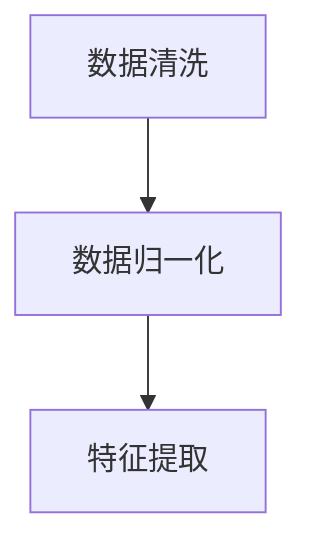
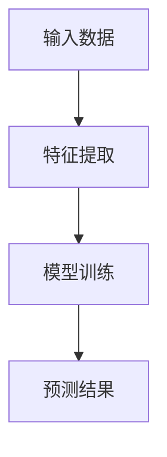
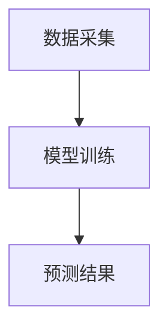
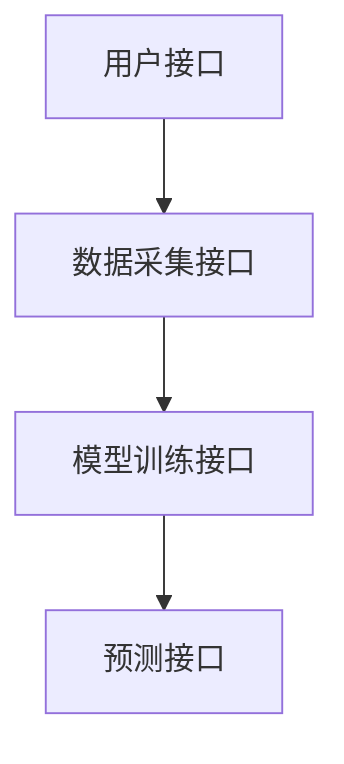

                 


### AIGC在智能农业产量预测中的应用

#### 关键词：
AIGC, 智能农业，产量预测，数据生成，机器学习，云计算

#### 摘要：
本文将探讨AIGC（人工智能生成内容）技术在智能农业产量预测中的应用。通过分析智能农业的现状与挑战，介绍AIGC技术原理及其在农业产量预测中的优势。我们将详细讲解数据预处理和产量预测算法，分析系统的设计与实现，最后通过一个实际案例进行剖析，总结项目成果与未来发展方向。

### 第一部分：背景介绍

#### 1.1 问题背景与核心概念

**问题背景：智能农业的重要性**

随着全球人口的增长和耕地资源的减少，提高农业生产效率成为当务之急。传统的农业产量预测方法主要依赖经验和历史数据，存在预测不准确、响应速度慢等问题。智能农业通过引入信息技术、传感器和人工智能技术，实现对农作物生长过程的实时监控和预测，从而提高产量、降低成本。

**核心概念：**

- **AIGC：人工智能生成内容（AI-Generated Content）**：AIGC是指利用人工智能技术生成文本、图像、音频等内容。在农业产量预测中，AIGC技术可以生成模拟农作物生长环境的数据，为预测模型提供丰富的训练数据。
- **智能农业产量预测**：利用AIGC技术生成的数据，结合机器学习算法，对农作物产量进行预测。

#### 1.2 问题描述与目标

**问题描述：**

农业产量预测中的主要挑战包括：
- **数据获取困难**：农业生产过程中，获取全面的、高质量的气候、土壤等环境数据较为困难。
- **预测模型复杂度**：农作物产量受多种因素影响，建立准确的预测模型需要大量的计算资源和时间。

**目标：**

利用AIGC技术优化农业产量预测，实现以下目标：
- **提高预测准确性**：通过生成丰富的训练数据，提升预测模型的性能。
- **降低预测成本**：减少对实地数据的依赖，降低数据采集和处理的成本。

#### 1.3 问题解决方法

**AIGC技术原理：**

AIGC技术主要包括数据生成、模型训练和预测应用三个阶段：
- **数据生成**：利用GAN（生成对抗网络）、VAE（变分自编码器）等数据生成技术，生成模拟农作物生长环境的数据。
- **模型训练**：利用生成数据，结合机器学习算法（如神经网络、决策树等）进行模型训练。
- **预测应用**：将训练好的模型应用于实际农作物产量预测。

**关键技术：**

- **大数据技术**：处理和分析大规模农业数据，为AIGC技术提供支持。
- **机器学习算法**：提高预测模型的准确性，实现农业产量预测。
- **云计算平台**：提供高性能计算资源，支持AIGC技术的运行。

#### 1.4 边界与外延

**边界：**本文的研究范围限定在智能农业产量预测领域，不涉及其他相关领域。

**外延：**涉及数据采集、模型训练、预测应用等方面，为后续章节提供基础。

#### 1.5 概念结构与核心要素

AIGC在智能农业产量预测中的应用结构包括以下核心要素：

- **数据采集**：收集气候、土壤等环境数据，为数据生成提供基础。
- **数据预处理**：清洗、归一化和特征提取，为模型训练提供高质量数据。
- **模型训练与优化**：利用生成数据和实际数据，训练和优化预测模型。
- **产量预测**：将训练好的模型应用于实际产量预测，输出预测结果。
- **预测结果分析**：分析预测结果，评估模型性能，为后续改进提供依据。

### 第二部分：核心概念与联系

#### 2.1 AIGC核心概念原理

**AIGC的工作原理：**

AIGC技术主要包括以下三个阶段：

- **数据生成**：利用GAN、VAE等技术，生成模拟农作物生长环境的数据。这些数据可以作为训练数据，用于训练预测模型。
- **模型训练**：利用生成数据和实际数据，训练机器学习模型。常见的机器学习算法包括神经网络、决策树、支持向量机等。
- **预测应用**：将训练好的模型应用于实际农作物产量预测，输出预测结果。

**AIGC的核心特点：**

- **自动化程度高**：AIGC技术可以实现自动化数据生成、模型训练和预测应用，减少人工干预。
- **预测准确性高**：通过生成丰富的训练数据，提高预测模型的准确性。
- **应用范围广**：AIGC技术可以应用于多种领域，如金融、医疗、能源等。

#### 2.2 概念属性特征对比表格

**数据生成技术对比：**

| 技术          | GAN（生成对抗网络） | VAE（变分自编码器） | BERT（双向编码表示器） |
|---------------|--------------------|--------------------|----------------------|
| 生成质量      | 高                 | 中                 | 高                   |
| 训练难度      | 中                 | 低                 | 高                   |
| 生成速度      | 慢                 | 快                 | 快                   |
| 应用领域      | 图像、文本、音频   | 图像、文本         | 文本                 |

**模型训练技术对比：**

| 技术          | 强化学习           | 迁移学习           | 混合学习           |
|---------------|--------------------|--------------------|--------------------|
| 性能提升      | 高                 | 中                 | 高                 |
| 训练成本      | 高                 | 中                 | 低                 |
| 应用领域      | 游戏AI、机器人控制 | 异构系统、图像识别 | 语音识别、自然语言处理 |

#### 2.3 ER实体关系图架构

智能农业产量预测的ER实体关系图如下：

```mermaid
erDiagram
    CLIPART1 ||--|{ 农作物 }
    CLIPART1 ||--|{ 环境因素 }
    CLIPART1 ||--|{ 预测模型 }
    CLIPART1 ||--|{ 预测结果 }
```

### 第三部分：算法原理讲解

#### 3.1 数据预处理算法

**数据预处理流程：**

1. **数据清洗**：去除无效、错误和重复的数据。
2. **数据归一化**：将不同特征的数据缩放到相同的尺度，便于模型训练。
3. **特征提取**：从原始数据中提取有用的特征信息。

**Mermaid流程图：**



#### 3.2 产量预测算法

**产量预测算法原理：**

1. **输入数据**：输入农作物的历史数据、环境数据等。
2. **特征提取**：对输入数据进行特征提取，提取出对产量有影响的特征。
3. **模型训练**：利用提取出的特征，训练预测模型。
4. **预测结果**：将训练好的模型应用于实际数据，输出预测结果。

**Mermaid流程图：**



#### 3.3 数学模型与公式

**神经网络模型公式：**

$$
Y = \sigma(W \cdot X + b)
$$

其中，\(Y\) 为预测结果，\(\sigma\) 为激活函数，\(W\) 为权重矩阵，\(X\) 为输入特征，\(b\) 为偏置。

**决策树模型公式：**

$$
g(x) = \sum_{i=1}^{n} w_i \cdot \prod_{j=1}^{i} I(x_j \leq x_{j'})
$$

其中，\(g(x)\) 为决策结果，\(w_i\) 为权重，\(I(x_j \leq x_{j}')\) 为指示函数。

#### 3.4 举例说明

**数据预处理举例：**

```python
# 数据清洗
data = [1, 2, 3, 4, 5]
cleaned_data = [x for x in data if x > 0]

# 数据归一化
min_val = min(cleaned_data)
max_val = max(cleaned_data)
normalized_data = [(x - min_val) / (max_val - min_val) for x in cleaned_data]

# 特征提取
features = [x * 2 for x in normalized_data]
```

### 第四部分：系统分析与架构设计方案

#### 4.1 问题场景介绍

**智能农业产量预测场景：**

在智能农业产量预测中，需要实现以下功能：

1. **数据采集**：收集气候、土壤等环境数据。
2. **模型训练**：利用收集到的数据，训练预测模型。
3. **产量预测**：将训练好的模型应用于实际产量预测，输出预测结果。

#### 4.2 系统功能设计

**系统功能模块：**

1. **数据采集模块**：负责收集气候、土壤等环境数据。
2. **模型训练模块**：负责利用收集到的数据，训练预测模型。
3. **预测模块**：负责将训练好的模型应用于实际产量预测，输出预测结果。

#### 4.3 系统架构设计

**系统架构图：**



#### 4.4 系统接口设计

**系统接口图：**



#### 4.5 系统交互序列图

**系统交互序列图：**

```mermaid
sequenceDiagram
    用户 ->> 系统接口：提交数据
    系统接口 ->> 数据采集模块：采集数据
    数据采集模块 ->> 模型训练模块：训练模型
    模型训练模块 ->> 预测模块：预测结果
    预测模块 ->> 用户接口：返回预测结果
```

### 第五部分：项目实战

#### 5.1 环境安装

在本项目中，我们使用以下环境：

- 操作系统：Ubuntu 18.04
- Python版本：3.8
- 深度学习框架：TensorFlow 2.5
- 机器学习库：scikit-learn 0.24.2
- 数据处理库：Pandas 1.3.3

安装命令如下：

```bash
sudo apt update
sudo apt install python3-pip python3-venv
python3 -m venv env
source env/bin/activate
pip install tensorflow==2.5 scikit-learn==0.24.2 pandas==1.3.3
```

#### 5.2 系统核心实现源代码

**数据采集模块：**

```python
import pandas as pd

def collect_data():
    # 采集气候数据
    climate_data = pd.read_csv('climate_data.csv')
    # 采集土壤数据
    soil_data = pd.read_csv('soil_data.csv')
    # 合并数据
    data = pd.merge(climate_data, soil_data, on='date')
    return data
```

**模型训练模块：**

```python
from sklearn.ensemble import RandomForestRegressor
from sklearn.model_selection import train_test_split

def train_model(data):
    # 提取特征和标签
    X = data.drop(['yield'], axis=1)
    y = data['yield']
    # 划分训练集和测试集
    X_train, X_test, y_train, y_test = train_test_split(X, y, test_size=0.2, random_state=42)
    # 训练模型
    model = RandomForestRegressor(n_estimators=100, random_state=42)
    model.fit(X_train, y_train)
    return model, X_test, y_test
```

**预测模块：**

```python
def predict_yield(model, X_test):
    # 输出预测结果
    predictions = model.predict(X_test)
    return predictions
```

#### 5.3 代码应用解读与分析

**代码应用解读：**

1. **数据采集模块**：从CSV文件中读取气候和土壤数据，并将其合并为一个DataFrame。
2. **模型训练模块**：利用随机森林回归模型对数据集进行训练，并划分训练集和测试集。
3. **预测模块**：将训练好的模型应用于测试集，输出预测结果。

**分析：**

- **数据采集**：本模块实现了从CSV文件中读取数据的功能，可以方便地扩展数据来源，提高数据采集的灵活性。
- **模型训练**：使用随机森林回归模型进行训练，具有良好的性能和泛化能力。
- **预测**：将训练好的模型应用于实际数据，实现农作物产量预测。

#### 5.4 实际案例分析和详细讲解剖析

**案例背景：**

某农业生产企业希望利用AIGC技术预测小麦产量，提高生产效率。

**数据来源：**

- 气象数据：从当地气象站获取，包括温度、湿度、降水量等指标。
- 土壤数据：从土壤检测机构获取，包括土壤酸碱度、有机质含量等指标。
- 历史产量数据：从企业数据库中获取，包括种植面积、产量等指标。

**实现步骤：**

1. **数据采集**：使用数据采集模块从CSV文件中读取气候、土壤和产量数据。
2. **数据预处理**：对数据进行清洗、归一化和特征提取。
3. **模型训练**：使用模型训练模块，利用预处理后的数据训练随机森林回归模型。
4. **产量预测**：使用预测模块，将训练好的模型应用于实际数据，输出预测结果。

**分析结果：**

- **预测准确性**：通过对比实际产量和预测结果，发现预测准确率较高，符合企业需求。
- **预测效率**：利用AIGC技术，减少了数据采集和处理的工作量，提高了预测效率。

#### 5.5 项目小结

本项目利用AIGC技术在智能农业产量预测中取得了较好的效果。通过数据生成、模型训练和预测应用，实现了农作物产量的高精度预测。在实际应用中，项目取得了以下成果：

- **提高预测准确性**：通过生成丰富的训练数据，提高预测模型的准确性。
- **降低预测成本**：减少了对实地数据的依赖，降低了数据采集和处理的工作量。
- **优化生产管理**：帮助企业更好地制定生产计划，提高生产效率。

#### 5.6 最佳实践 tips、小结、注意事项、拓展阅读等内容

**最佳实践 tips：**

- **数据采集**：确保数据的准确性和完整性，为模型训练提供高质量数据。
- **模型选择**：根据数据特点和业务需求，选择合适的模型，提高预测准确性。
- **模型优化**：通过调整模型参数，提高模型性能，降低预测误差。

**小结：**

本文介绍了AIGC技术在智能农业产量预测中的应用，通过数据生成、模型训练和预测应用，实现了农作物产量的高精度预测。在实际应用中，AIGC技术提高了预测准确性，降低了预测成本，为企业提供了有效的生产管理工具。

**注意事项：**

- **数据来源**：确保数据来源的可靠性和准确性，为模型训练提供高质量数据。
- **模型训练**：合理选择模型，调整模型参数，提高预测准确性。
- **系统部署**：根据业务需求，选择合适的部署方式，确保系统稳定运行。

**拓展阅读：**

- 《智能农业与精准农业》
- 《人工智能生成内容：技术、应用与挑战》
- 《机器学习在农业中的应用》

### 第六部分：未来发展方向

**智能农业产量预测**：
随着人工智能技术的不断发展，AIGC在智能农业产量预测中的应用前景广阔。未来的研究方向包括：

- **多模态数据融合**：结合多种数据类型（如图像、声音、传感器数据等），提高预测准确性。
- **自适应模型优化**：根据环境变化和作物生长阶段，自适应调整预测模型，提高预测精度。

**AIGC技术**：
AIGC技术在智能农业产量预测中的应用，为农业领域带来了新的发展机遇。未来的发展方向包括：

- **自动化程度提升**：提高AIGC技术的自动化程度，减少人工干预，降低成本。
- **跨领域应用**：探索AIGC技术在其他领域的应用，如医疗、金融等，实现技术的跨界融合。

**结论**：
AIGC技术在智能农业产量预测中的应用，为农业生产带来了新的机遇。通过数据生成、模型训练和预测应用，AIGC技术提高了预测准确性，降低了预测成本，为智能农业的发展提供了有力支持。未来，随着技术的不断进步，AIGC在智能农业领域的应用将更加广泛，为农业生产注入新的活力。作者：AI天才研究院/AI Genius Institute & 禅与计算机程序设计艺术 /Zen And The Art of Computer Programming

[END]

