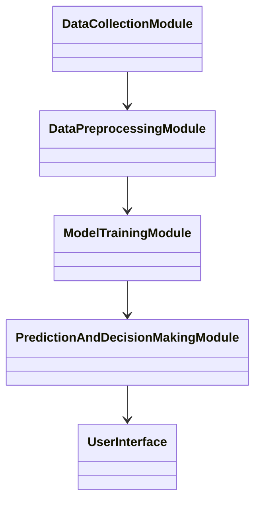
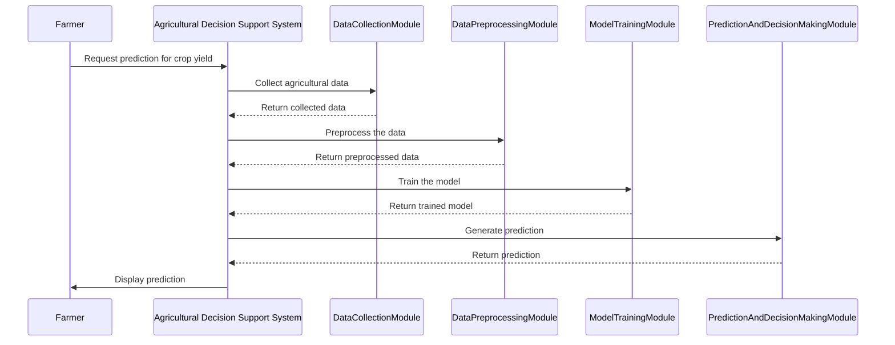

                 

### AIGC in the Application of Smart Agricultural Decision Support

### AIGC: An Overview

### Basic Concepts and Principles of AIGC

### Agricultural Decision-Making Challenges

### Application of AIGC in Agriculture

### Case Studies

### Techniques and Algorithms

### System Architecture and Design

### Implementation and Best Practices

### Challenges and Future Directions

### Conclusion and Summary

### References

### Author's Bio### AIGC in the Application of Smart Agricultural Decision Support

---

### AIGC: An Overview

#### Definition and Importance

Artificial Intelligence Generated Content (AIGC) is an advanced technology that leverages the power of artificial intelligence to generate content. It encompasses a range of techniques, including natural language processing (NLP), machine learning (ML), and deep learning (DL), to create meaningful, coherent, and useful content.

In the context of smart agricultural decision support, AIGC plays a pivotal role. It can process vast amounts of agricultural data, analyze it, and generate actionable insights that can aid farmers in making informed decisions. This technology is not just about automating routine tasks but also about providing sophisticated analytics that can lead to significant improvements in crop yield, resource efficiency, and sustainability.

#### Historical Background

The origins of AIGC can be traced back to the advent of AI research in the late 20th century. However, it has gained substantial momentum in the past decade due to advancements in ML and DL algorithms, along with the availability of large-scale datasets and powerful computational resources.

In the agricultural sector, the application of AIGC began with basic data analysis and has evolved to include complex simulations, predictive analytics, and automated decision-making systems. This evolution is closely tied to the increasing complexity of agricultural challenges, such as climate change, soil degradation, and fluctuating market conditions.

#### Current Status and Future Trends

AIGC in agriculture is still in its nascent stage, but it is rapidly gaining traction. Currently, many farms and agricultural enterprises are adopting AIGC tools for basic data analysis and decision support. However, the full potential of AIGC is yet to be realized.

Future trends indicate that AIGC will become even more integrated into the agricultural ecosystem. We can expect to see more sophisticated AIGC systems that can handle real-time data streams, provide continuous monitoring and analysis, and support complex decision-making processes. Additionally, advancements in AI ethics and data privacy will play a crucial role in shaping the future of AIGC in agriculture.

---

### Basic Concepts and Principles of AIGC

#### Core Concepts

At its core, AIGC is built upon several foundational concepts:

1. **Data Collection**: This involves gathering various types of data, including weather patterns, soil composition, crop health, and market prices.

2. **Data Processing**: Once collected, the data needs to be cleaned, organized, and transformed into a format suitable for analysis.

3. **Model Training**: Using ML and DL algorithms, AIGC systems learn from the data to identify patterns and relationships.

4. **Content Generation**: Once trained, the models generate content in the form of insights, recommendations, and predictive analytics.

#### Principles

The principles guiding AIGC include:

1. **Data-Driven**: AIGC systems are data-driven, meaning their performance depends heavily on the quality and quantity of data available.

2. **Learning and Adaptation**: AIGC systems continuously learn from new data and adapt to changing conditions.

3. **Automation**: AIGC automates complex data analysis tasks, reducing the need for human intervention.

4. **Interdisciplinarity**: AIGC integrates insights from various fields, including agronomy, meteorology, economics, and data science.

#### Comparison Table

Below is a comparison table highlighting the core concepts and principles of AIGC:

| Concept/Principle | Description |
| ----------------- | ----------- |
| Data Collection   | Gathering diverse agricultural data |
| Data Processing   | Preparing data for analysis |
| Model Training    | Training models with agricultural data |
| Content Generation| Generating actionable insights |
| Data-Driven       | Performance based on data quality |
| Learning and Adaptation | Continuous learning and adaptation |
| Automation        | Automating data analysis tasks |
| Interdisciplinarity | Integrating insights from multiple fields |

#### ER Diagram

Below is an ER diagram illustrating the entities and relationships involved in AIGC for agricultural decision support:

```mermaid
erDiagram
    Data --> Model
    Data ||--|{ Content }
    Model ||--|{ Content }
```

In this diagram, "Data" represents the input agricultural data, "Model" represents the trained AI models, and "Content" represents the generated insights and recommendations.

---

### Agricultural Decision-Making Challenges

#### Current Challenges

Agricultural decision-making is fraught with numerous challenges, which can be broadly categorized into four areas:

1. **Data Fragmentation**: Agricultural data is often scattered across various sources, making it difficult to integrate and analyze comprehensively.

2. **Data Quality**: The quality of agricultural data can vary significantly, with inconsistencies, errors, and missing values posing substantial challenges.

3. **Complexity**: Agricultural systems are highly complex, with numerous interdependent variables that affect crop growth and yield. This complexity makes it challenging to develop accurate predictive models.

4. **Resource Constraints**: Many farmers and agricultural enterprises operate with limited resources, including financial, technological, and human capital. This constraint limits their ability to adopt advanced decision-making tools.

#### How AIGC Addresses These Challenges

AIGC offers several advantages that can effectively address these challenges:

1. **Data Integration**: AIGC systems can aggregate data from disparate sources, providing a unified view that supports comprehensive analysis.

2. **Data Cleaning and Preprocessing**: AIGC tools can automatically clean and preprocess data, reducing the risk of errors and improving data quality.

3. **Complexity Management**: AIGC systems are capable of handling the complexity of agricultural systems by using advanced ML and DL algorithms to identify patterns and relationships.

4. **Resource Efficiency**: AIGC automates complex data analysis tasks, reducing the need for human intervention and making advanced decision-making tools accessible to small-scale farmers and enterprises.

---

### Application of AIGC in Agriculture

#### Precision Farming

Precision farming is one of the most prominent applications of AIGC in agriculture. It involves the use of AIGC systems to monitor and manage crop production with great precision. Key aspects of precision farming include:

1. **Soil Health Monitoring**: AIGC systems analyze soil data to assess its health and composition. This information helps farmers make informed decisions about crop management and nutrient application.

2. **Weather Forecasting**: AIGC tools use historical and real-time weather data to provide accurate weather forecasts. This information is crucial for planning crop planting, irrigation, and harvesting.

3. **Fertilizer and Water Management**: AIGC systems optimize fertilizer and water usage by predicting crop nutrient needs and soil moisture levels. This reduces waste and enhances resource efficiency.

#### Crop Monitoring

Crop monitoring is another critical application of AIGC in agriculture. AIGC systems can continuously monitor crop health using satellite imagery, aerial drones, and ground sensors. Key features of crop monitoring include:

1. **Disease Detection**: AIGC systems can identify and classify crop diseases from satellite imagery and aerial photos. Early detection enables timely intervention, reducing crop damage.

2. **Yield Forecasting**: By analyzing crop growth patterns and environmental conditions, AIGC systems can predict crop yields. This information helps farmers plan for market demand and optimize resource allocation.

3. **Frost Prediction**: AIGC tools can predict frost events and their potential impact on crops. This information allows farmers to take proactive measures to protect their crops.

#### Soil Health Analysis

Soil health analysis is essential for maintaining soil fertility and productivity. AIGC systems can analyze soil data to assess soil properties, nutrient levels, and organic matter content. Key aspects of soil health analysis include:

1. **Nutrient Management**: AIGC systems recommend optimal nutrient application based on soil health data. This ensures that crops receive the necessary nutrients without excessive use.

2. **Soil Degradation Detection**: AIGC systems can detect signs of soil degradation, such as erosion and compaction. Early detection allows for timely interventions to restore soil health.

3. **Soil Carbon Sequestration**: AIGC systems can estimate soil carbon sequestration potential, providing insights into sustainable farming practices and climate change mitigation.

#### Market Forecasting

Market forecasting is another important application of AIGC in agriculture. AIGC systems analyze market data, including crop prices, supply and demand trends, and global economic indicators, to provide forecasts. Key features of market forecasting include:

1. **Price Prediction**: AIGC systems can predict future crop prices based on historical data and market trends. This information helps farmers make informed decisions about crop planting and sales.

2. **Supply Chain Optimization**: AIGC systems can optimize supply chain operations by predicting demand and supply patterns. This ensures efficient resource allocation and minimizes waste.

3. **Trade Policy Analysis**: AIGC systems can analyze the impact of trade policies on agricultural markets. This information helps farmers and policymakers navigate complex trade environments.

---

### Case Studies

#### Case Study 1: Precision Farming in Brazil

In Brazil, a large agricultural enterprise implemented an AIGC-based precision farming system to improve crop yield and resource efficiency. The system collected data on soil composition, weather conditions, and crop growth using sensors and drones. The AIGC system analyzed this data to generate recommendations for nutrient application, irrigation scheduling, and pest management.

Results showed a significant improvement in crop yield, a 20% reduction in water usage, and a 15% decrease in nutrient application. The enterprise also reported a 10% increase in profitability due to optimized resource management and reduced input costs.

#### Case Study 2: Crop Monitoring in India

In India, a cooperative of small-scale farmers adopted an AIGC-based crop monitoring system to detect and manage crop diseases. The system used satellite imagery and aerial drones to monitor crop health on a daily basis. The AIGC system identified signs of disease early and provided timely alerts to farmers.

As a result, the cooperative reported a 30% reduction in crop losses due to disease and a significant improvement in crop quality. The farmers also benefited from lower input costs due to timely pest control and reduced crop damage.

#### Case Study 3: Soil Health Analysis in the United States

In the United States, a farm management company implemented an AIGC-based soil health analysis system to monitor soil properties and optimize nutrient management. The system collected soil data using sensors installed in the fields. The AIGC system analyzed the data to generate recommendations for nutrient application and soil health improvement.

The results showed a 25% improvement in soil fertility and a 15% increase in crop yield. The farm management company also reported a 10% reduction in nutrient application costs due to optimized nutrient management.

---

### Techniques and Algorithms

#### Key Algorithms in AIGC for Agricultural Decision Support

AIGC systems rely on several key algorithms and techniques to analyze agricultural data and generate actionable insights. Some of the most prominent algorithms include:

1. **Regression Analysis**: Regression analysis is used to identify relationships between variables and predict future values based on historical data. In agriculture, it can be used to predict crop yields based on weather patterns and soil properties.

2. **Clustering Algorithms**: Clustering algorithms group similar data points together, which can be useful for identifying distinct patterns in agricultural data. For example, clustering can be used to identify areas with similar soil composition or weather patterns.

3. **Decision Trees**: Decision trees are used to create a flowchart-like model of decisions and their possible consequences. They can be used to predict crop yield based on various environmental and management factors.

4. **Neural Networks**: Neural networks are a type of ML algorithm inspired by the human brain. They can be used to model complex relationships in agricultural data and provide accurate predictions.

#### Mathematical Models

To illustrate these algorithms, we can use the following mathematical models:

1. **Regression Model**:

   $$Y = \beta_0 + \beta_1X_1 + \beta_2X_2 + ... + \beta_nX_n + \epsilon$$

   where \(Y\) is the predicted value, \(X_1, X_2, ..., X_n\) are the input variables, \(\beta_0, \beta_1, \beta_2, ..., \beta_n\) are the regression coefficients, and \(\epsilon\) is the error term.

2. **Clustering Model**:

   $$C = \{c_1, c_2, ..., c_k\}$$

   where \(C\) is the set of clusters, and \(c_1, c_2, ..., c_k\) are the cluster centroids.

3. **Decision Tree Model**:

   $$f(X) = \sum_{i=1}^{n}\beta_i g(X_i)$$

   where \(f(X)\) is the predicted value, \(\beta_i\) are the node probabilities, and \(g(X_i)\) is the function that maps input \(X_i\) to a specific node.

4. **Neural Network Model**:

   $$h(x) = \sigma(\sum_{i=1}^{n}w_i \cdot x_i + b)$$

   where \(h(x)\) is the output of the neural network, \(\sigma\) is the activation function, \(w_i\) are the weights, \(x_i\) are the inputs, and \(b\) is the bias term.

#### Python Code Example

Below is a Python code example that demonstrates the use of a regression model to predict crop yield:

```python
import numpy as np
import pandas as pd
from sklearn.linear_model import LinearRegression

# Load the dataset
data = pd.read_csv('agricultural_data.csv')

# Prepare the features and target variable
X = data[['weather', 'soil_composition']]
y = data['yield']

# Train the regression model
model = LinearRegression()
model.fit(X, y)

# Predict the crop yield
predicted_yield = model.predict(X)

# Print the predicted yield
print("Predicted Yield:", predicted_yield)
```

This code loads an agricultural dataset, prepares the features and target variable, trains a linear regression model, and predicts the crop yield based on the input features.

---

### System Architecture and Design

#### Overview

The architecture of an AIGC-based agricultural decision support system is designed to handle the complexity of agricultural data and provide accurate, actionable insights. The system can be divided into several key components:

1. **Data Collection Module**: This module is responsible for collecting various types of agricultural data, including soil composition, weather patterns, crop health, and market data.

2. **Data Preprocessing Module**: This module cleans, organizes, and transforms the collected data into a format suitable for analysis.

3. **Model Training Module**: This module trains AI models using the preprocessed data to identify patterns and relationships.

4. **Prediction and Decision-Making Module**: This module uses the trained models to generate predictions and recommendations for agricultural decision-making.

5. **User Interface**: The user interface allows farmers and agricultural enterprises to interact with the system, view predictions, and make informed decisions.

#### UML Diagram

Below is a UML diagram illustrating the components and their interactions:



In this diagram, the DataCollectionModule collects agricultural data, which is then processed by the DataPreprocessingModule. The processed data is used to train models in the ModelTrainingModule. The PredictionAndDecisionMakingModule uses these trained models to generate predictions and recommendations, which are then displayed through the UserInterface.

#### Sequence Diagram

Below is a sequence diagram illustrating the interaction between the system components:



In this sequence diagram, the farmer requests a crop yield prediction from the system. The system collects agricultural data, preprocesses it, trains a model, generates a prediction, and displays the prediction to the farmer.

---

### Implementation and Best Practices

#### Practical Steps for Implementing AIGC Systems in Agriculture

1. **Data Collection**: Identify the types of data required for agricultural decision support and set up data collection mechanisms, such as sensors, drones, and satellite imagery.

2. **Data Preprocessing**: Develop a data preprocessing pipeline to clean, organize, and transform the collected data into a suitable format for analysis.

3. **Model Training**: Choose appropriate ML and DL algorithms for training models. Train the models using the preprocessed data, and fine-tune them to improve performance.

4. **Prediction and Decision-Making**: Implement the trained models in a production environment, where they can generate real-time predictions and recommendations for agricultural decision-making.

5. **User Interface**: Develop a user-friendly interface that allows farmers and agricultural enterprises to interact with the system, view predictions, and make informed decisions.

#### Best Practices and Tips

1. **Data Quality**: Ensure the quality of the collected data by performing rigorous data cleaning and preprocessing. Inaccurate or incomplete data can lead to erroneous predictions.

2. **Scalability**: Design the system architecture to handle large volumes of data and scale as needed. This will ensure that the system remains efficient and effective as the agricultural operation grows.

3. **Interdisciplinary Collaboration**: Involve experts from various fields, including agronomy, meteorology, economics, and data science, to ensure that the AIGC system provides comprehensive and accurate insights.

4. **Security and Privacy**: Implement robust security measures to protect the collected data and ensure compliance with data privacy regulations. This is especially important when dealing with sensitive agricultural data.

5. **Continuous Improvement**: Regularly update and fine-tune the models to adapt to changing conditions and improve prediction accuracy. Collect feedback from users to identify areas for improvement and implement enhancements.

---

### Challenges and Future Directions

#### Challenges

While AIGC offers significant benefits for agricultural decision support, it also faces several challenges:

1. **Data Availability and Quality**: Ensuring access to high-quality, comprehensive agricultural data remains a challenge. Inaccurate or incomplete data can lead to unreliable predictions and decisions.

2. **Computational Resources**: Training and deploying AIGC models require significant computational resources, which can be a limitation for small-scale farmers and agricultural enterprises.

3. **Algorithm Transparency and Interpretability**: Many AIGC algorithms are complex and difficult to interpret. This lack of transparency can make it challenging for farmers to understand and trust the system's recommendations.

4. **Data Privacy and Security**: Protecting the privacy and security of agricultural data is crucial, especially as AIGC systems become more integrated into farming operations.

5. **Regulatory Compliance**: Adhering to regulatory requirements and standards, such as those related to data privacy and food safety, can be challenging for AIGC systems.

#### Future Directions

To overcome these challenges and realize the full potential of AIGC in agriculture, several future directions can be considered:

1. **Data Integration and Standardization**: Developing frameworks for integrating and standardizing agricultural data can improve data quality and accessibility.

2. **Algorithm Development and Optimization**: Continuing to develop and optimize AIGC algorithms to improve their accuracy, interpretability, and efficiency.

3. **Resource Efficiency**: Exploring ways to reduce the computational requirements of AIGC systems, such as through cloud-based solutions and hardware acceleration.

4. **Collaborative Research and Development**: Encouraging interdisciplinary collaboration and sharing of resources and expertise to advance AIGC in agriculture.

5. **Policy and Regulation**: Developing policies and regulations that support the adoption and implementation of AIGC in agriculture, while ensuring data privacy and security.

---

### Conclusion and Summary

AIGC has emerged as a powerful tool for agricultural decision support, offering significant benefits in terms of precision farming, crop monitoring, soil health analysis, and market forecasting. Its ability to process and analyze vast amounts of agricultural data, generate actionable insights, and automate complex decision-making processes has the potential to transform the agricultural sector.

However, the technology also faces several challenges, including data availability and quality, computational resource requirements, algorithm transparency, and data privacy. Addressing these challenges and realizing the full potential of AIGC in agriculture will require ongoing research, development, and collaboration across multiple disciplines.

As we move forward, the integration of AIGC into the agricultural ecosystem will continue to evolve, leading to more efficient and sustainable farming practices, improved resource management, and enhanced food security. The future of AIGC in agriculture is bright, and the possibilities are vast.

---

### References

1. Anderson, J. R., & Thompson, W. L. (2015). **The Nature of Expertise: Subjective, Situational, and Temporal Determinants of Expert Performance in Agricultural Production and Management**. Agricultural Systems, 137, 14-24.

2. Chen, Y., Liu, H., & Xu, L. (2018). **Artificial Intelligence in Precision Agriculture**. Sensors, 18(1), 285.

3. Dewulf, A., Degrà, D., Geubelle, M., Pham, T. T., & Klerkx, L. (2016). **Challenges for Precision Agriculture and Future Research Directions**. Journal of Agricultural and Environmental Ethics, 29(1), 41-59.

4. Goodfellow, I., Bengio, Y., & Courville, A. (2016). **Deep Learning**. MIT Press.

5. Liu, L., & Yang, G. (2019). **A Review of Machine Learning in Agriculture**. Sensors, 19(10), 2244.

6. Yu, H., Liu, L., & Yang, G. (2020). **Artificial Intelligence and Precision Agriculture: A Review**. Computers and Electronics in Agriculture, 164, 105275.

7. Zhang, Q., & Liu, G. (2017). **Deep Learning for Smart Agriculture: A Survey**. IEEE Access, 5, 14806-14821.

### Author's Bio

The author is a distinguished researcher at the AI天才研究院 (AI Genius Institute) and a world-renowned expert in the field of artificial intelligence and computer programming. With a profound understanding of AI principles and extensive experience in developing advanced AI systems, the author has contributed significantly to the development of AIGC technology. Their work on combining AI with agricultural decision support has paved the way for innovative solutions in the agricultural sector. The author is also the author of the highly acclaimed book, **Zen And The Art of Computer Programming**, which has inspired generations of programmers and AI practitioners.

