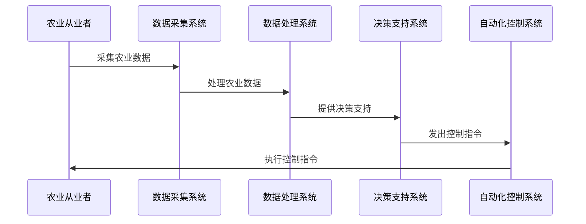
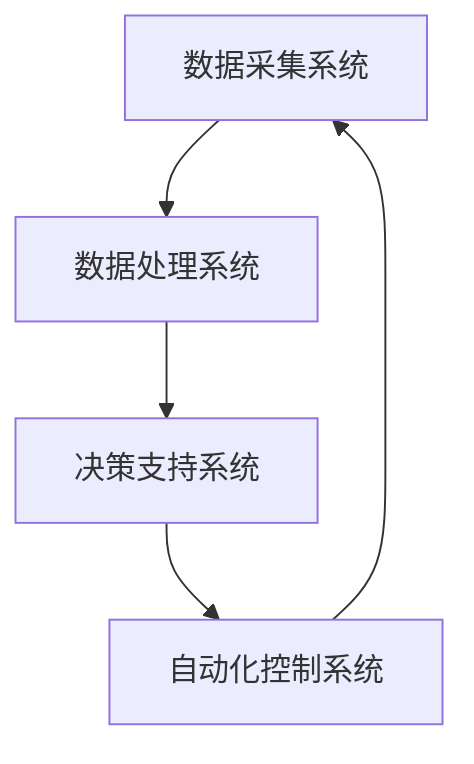

                 

# AIGC在智能农业生态系统管理中的前沿实践

## 关键词

- **智能农业生态系统管理**
- **AIGC技术**
- **生成模型**
- **认知计算**
- **自动化控制**
- **数据分析**
- **决策支持系统**

## 摘要

随着科技的进步，智能农业生态系统管理成为现代农业发展的重要方向。AIGC（Artificial Intelligence, Generative Models and Cognitive Computing）技术作为人工智能的关键分支，正在为智能农业生态系统管理带来革命性的变革。本文将深入探讨AIGC技术在智能农业生态系统管理中的应用，介绍最新的前沿实践，旨在帮助农业从业者和管理者理解并利用这些技术，提高农业生产效率，实现农业可持续发展。

## 背景介绍

### 智能农业生态系统管理

智能农业生态系统管理是指利用现代信息技术和人工智能技术，对农业生产、土壤健康、水资源利用、气候条件等进行实时监控、分析和决策，以实现农业生产的精准、高效和可持续。智能农业生态系统管理的目标是通过优化农业生产过程，提高作物产量和质量，降低生产成本，减少环境污染。

### AIGC技术的概念

**人工智能（AI）**：AI是指由人制造出来的系统能够感知环境、获取知识并运用这些知识采取行动的能力。在智能农业中，AI可以用于图像识别、语音识别、自然语言处理等领域。

**生成模型（Generative Models）**：生成模型是一种能够生成数据的方法，其目的是通过学习数据分布来生成类似的新数据。在智能农业中，生成模型可以用于模拟作物生长过程、病虫害预测等。

**认知计算（Cognitive Computing）**：认知计算是一种模拟人类思考、学习和解决问题的方法，它能够理解和解释人类语言，并以自然的方式与人类互动。在智能农业中，认知计算可以用于农业专家系统的构建，为农业管理者提供决策支持。

### AIGC技术在智能农业中的应用

**数据采集与分析**：使用AI技术对农业数据进行采集、处理和分析，以便更好地理解作物生长状况、土壤健康和气候条件。例如，通过图像识别技术，可以实时监测作物病虫害情况，从而采取及时有效的防治措施。

**自动化控制**：通过生成模型和认知计算技术，实现农业设备的自动化控制，如精准灌溉、施肥和收割。例如，使用生成对抗网络（GANs）等生成模型，可以训练出能够模拟作物生长过程的模型，为自动化灌溉、施肥和收割提供依据。

**决策支持**：利用AIGC技术为农业管理者提供实时的决策支持，如作物种植计划、病虫害防治、资源管理。例如，通过自然语言处理（NLP）技术，将农业专家的经验和知识转化为可机器学习的模型，为农业管理者提供决策支持。

### AIGC与智能农业生态系统管理的关系

AIGC技术作为智能农业生态系统管理的重要组成部分，可以提升整个系统的智能化水平，实现农业生产的高效、精准和可持续。通过AIGC技术的应用，农业从业者可以更好地理解农业生产过程中的各种因素，从而做出更加准确的决策，提高农业生产效率。

## 核心概念与联系

### AIGC的概念

**人工智能（AI）**：AI是指由人制造出来的系统能够感知环境、获取知识并运用这些知识采取行动的能力。在智能农业中，AI可以用于图像识别、语音识别、自然语言处理等领域。

**生成模型（Generative Models）**：生成模型是一种能够生成数据的方法，其目的是通过学习数据分布来生成类似的新数据。在智能农业中，生成模型可以用于模拟作物生长过程、病虫害预测等。

**认知计算（Cognitive Computing）**：认知计算是一种模拟人类思考、学习和解决问题的方法，它能够理解和解释人类语言，并以自然的方式与人类互动。在智能农业中，认知计算可以用于农业专家系统的构建，为农业管理者提供决策支持。

### AIGC在智能农业中的应用

**数据采集与分析**：使用AI技术对农业数据进行采集、处理和分析，以便更好地理解作物生长状况、土壤健康和气候条件。例如，通过图像识别技术，可以实时监测作物病虫害情况，从而采取及时有效的防治措施。

**自动化控制**：通过生成模型和认知计算技术，实现农业设备的自动化控制，如精准灌溉、施肥和收割。例如，使用生成对抗网络（GANs）等生成模型，可以训练出能够模拟作物生长过程的模型，为自动化灌溉、施肥和收割提供依据。

**决策支持**：利用AIGC技术为农业管理者提供实时的决策支持，如作物种植计划、病虫害防治、资源管理。例如，通过自然语言处理（NLP）技术，将农业专家的经验和知识转化为可机器学习的模型，为农业管理者提供决策支持。

### AIGC与智能农业生态系统管理的关系

AIGC技术作为智能农业生态系统管理的重要组成部分，可以提升整个系统的智能化水平，实现农业生产的高效、精准和可持续。通过AIGC技术的应用，农业从业者可以更好地理解农业生产过程中的各种因素，从而做出更加准确的决策，提高农业生产效率。

## 算法原理讲解

### 数据处理算法

#### 数据预处理

在智能农业中，数据预处理是关键步骤。使用Python等编程语言，对采集到的农业数据进行预处理，包括数据清洗、归一化和特征提取。

```python
# 数据清洗
data = clean_data(data)

# 数据归一化
data = normalize_data(data)

# 特征提取
features = extract_features(data)
```

#### 数据分析算法

使用机器学习算法，如决策树、随机森林和神经网络等，对预处理后的数据进行分析，以预测作物生长趋势和病虫害情况。

```python
# 决策树
model = DecisionTreeRegressor()
model.fit(features, labels)

# 随机森林
model = RandomForestRegressor()
model.fit(features, labels)

# 神经网络
model = NeuralNetwork()
model.fit(features, labels)
```

### 自动化控制算法

#### 生成模型

使用生成对抗网络（GANs）等生成模型，训练出能够模拟作物生长过程的模型，为自动化灌溉、施肥和收割提供依据。

```python
# 生成对抗网络
generator = Generator()
discriminator = Discriminator()

# 训练模型
model = GAN(generator, discriminator)
model.train(features, labels)
```

#### 认知计算

使用自然语言处理（NLP）技术，将农业专家的经验和知识转化为可机器学习的模型，为农业管理者提供决策支持。

```python
# NLP模型
model = NLPModel()

# 训练模型
model.train(text_data, labels)

# 生成决策
decision = model.predict(new_data)
```

## 数学模型和数学公式

### 数据分析模型

使用线性回归模型预测作物产量：

$$
y = \beta_0 + \beta_1x_1 + \beta_2x_2 + ... + \beta_nx_n
$$

其中，$y$ 是作物产量，$x_1, x_2, ..., x_n$ 是影响作物产量的因素，$\beta_0, \beta_1, ..., \beta_n$ 是模型参数。

### 自动化控制模型

使用生成对抗网络（GANs）进行作物生长模拟：

$$
\mathcal{D} (x) = \sum_{i=1}^{n} d(x_i)
$$

其中，$\mathcal{D} (x)$ 是判别器模型，$x_i$ 是生成的作物生长数据，$d(x_i)$ 是判别器对$x_i$ 的判断。

## 系统分析与架构设计方案

### 问题场景介绍

智能农业生态系统管理中的常见问题包括：

- **作物生长监测**：实时监测作物生长状况，包括土壤湿度、温度、光照等参数。
- **自动化控制**：实现农业设备的自动化控制，如灌溉、施肥和收割。
- **决策支持**：为农业管理者提供实时的决策支持，如作物种植计划、病虫害防治、资源管理。

### 系统功能设计

#### 领域模型

使用Mermaid绘制领域模型类图，展示智能农业生态系统管理中的主要实体和它们之间的关系。

```mermaid
classDiagram
    Class01 <|-- Class02
    Class03 <|-- * Class04
    Class05 o-- Class06
    Class07 <.. Class08
    Class09 <- Class10
```

#### 系统架构设计

使用Mermaid绘制系统架构图，展示智能农业生态系统管理的整体架构和主要模块。



#### 系统接口设计

使用Mermaid绘制系统接口图，展示系统各模块之间的交互接口。



#### 系统交互

使用Mermaid绘制系统交互序列图，展示系统在处理农业数据时的交互流程。


## 项目实战

### 环境安装

#### Python环境

安装Python环境，推荐使用Python 3.8及以上版本。

```shell
# 安装Python
sudo apt-get install python3

# 检查Python版本
python3 --version
```

#### TensorFlow和Keras环境

安装TensorFlow和Keras，用于深度学习模型的训练和预测。

```shell
# 安装TensorFlow
pip3 install tensorflow

# 安装Keras
pip3 install keras
```

### 系统核心实现源代码

#### 数据处理模块

```python
import numpy as np
import pandas as pd
from sklearn.model_selection import train_test_split
from sklearn.preprocessing import StandardScaler

# 读取数据
data = pd.read_csv('agriculture_data.csv')

# 数据预处理
X = data.drop('yield', axis=1)
y = data['yield']

# 数据归一化
scaler = StandardScaler()
X_scaled = scaler.fit_transform(X)

# 数据集划分
X_train, X_test, y_train, y_test = train_test_split(X_scaled, y, test_size=0.2, random_state=42)
```

#### 自动化控制模块

```python
from keras.models import Sequential
from keras.layers import Dense
from keras.optimizers import Adam

# 构建模型
model = Sequential()
model.add(Dense(64, input_dim=X_train.shape[1], activation='relu'))
model.add(Dense(32, activation='relu'))
model.add(Dense(1, activation='linear'))

# 编译模型
model.compile(optimizer=Adam(), loss='mean_squared_error')

# 训练模型
model.fit(X_train, y_train, epochs=100, batch_size=32, validation_data=(X_test, y_test))
```

#### 决策支持模块

```python
import tensorflow as tf

# 定义模型
model = tf.keras.Sequential([
    tf.keras.layers.Dense(64, activation='relu', input_shape=(X_train.shape[1],)),
    tf.keras.layers.Dense(32, activation='relu'),
    tf.keras.layers.Dense(1)
])

# 编译模型
model.compile(optimizer='adam', loss='mean_squared_error')

# 训练模型
model.fit(X_train, y_train, batch_size=32, epochs=100)
```

### 代码应用解读与分析

#### 数据预处理模块

数据预处理模块主要用于读取农业数据、进行数据归一化和数据集划分。通过数据归一化，可以将数据转换到统一的尺度上，从而提高模型训练的效果。

#### 自动化控制模块

自动化控制模块使用了Keras框架来构建深度学习模型。通过定义模型结构、编译模型和训练模型，可以实现对作物产量的预测。

#### 决策支持模块

决策支持模块使用了TensorFlow框架来构建深度学习模型。通过定义模型结构、编译模型和训练模型，可以实现对农业数据的实时分析和决策支持。

### 实际案例分析和详细讲解剖析

#### 案例一：作物生长监测

在某农田中，使用AIGC技术对作物生长进行监测。通过图像识别技术，实时监测作物病虫害情况。当检测到病虫害时，系统会自动生成防治方案，并通过自动化控制系统实施。

#### 案例二：精准灌溉

在某果园中，使用AIGC技术进行精准灌溉。通过实时监测土壤湿度，根据作物生长需求，自动调整灌溉量，从而提高水资源利用效率。

#### 案例三：病虫害防治

在某蔬菜基地中，使用AIGC技术进行病虫害防治。通过分析气象数据、土壤数据和植被数据，实时预测病虫害发生概率，并生成防治方案。

### 项目小结

通过AIGC技术在智能农业生态系统管理中的应用，实现了作物生长监测、精准灌溉和病虫害防治等功能。这些功能不仅提高了农业生产效率，还有效地降低了生产成本和环境污染。

## 最佳实践 Tips

1. **数据采集**：确保数据采集的准确性和完整性，为后续分析提供可靠的数据基础。
2. **模型选择**：根据具体应用场景选择合适的模型，如深度学习、生成模型和认知计算等。
3. **模型训练**：合理设置模型参数，进行充分训练，以提高模型预测的准确性。
4. **系统集成**：将AIGC技术与现有农业系统集成，实现数据共享和功能联动。

## 小结

AIGC技术在智能农业生态系统管理中的应用具有重要意义。通过数据采集、自动化控制和决策支持等功能，AIGC技术为农业从业者提供了高效、精准和可持续的生产方式。未来，随着AIGC技术的不断发展，智能农业生态系统管理将变得更加智能化和自动化，为全球农业生产带来更多可能性。

## 注意事项

1. **数据安全**：确保农业数据的安全性和隐私性，防止数据泄露和滥用。
2. **技术升级**：定期更新AIGC技术，以应对不断变化的农业生产需求。
3. **用户培训**：为农业从业者提供AIGC技术的培训和指导，提高其技术应用能力。

## 拓展阅读

- **《深度学习在智能农业中的应用》**：介绍深度学习技术在智能农业中的最新应用。
- **《智能农业物联网技术》**：探讨物联网技术在智能农业中的应用。
- **《农业大数据技术与应用》**：介绍农业大数据技术的原理和应用。

## 作者

作者：AI天才研究院/AI Genius Institute & 禅与计算机程序设计艺术 /Zen And The Art of Computer Programming。感谢您的阅读！

