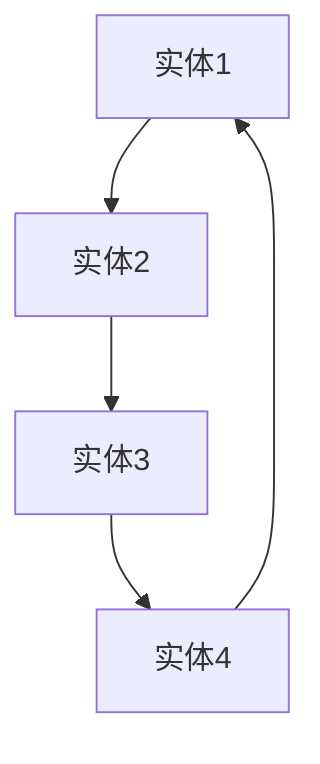
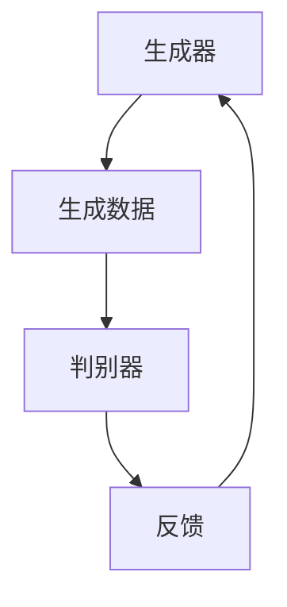
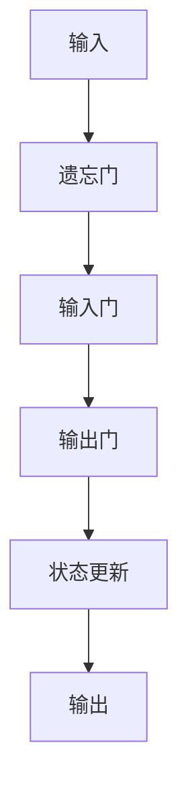
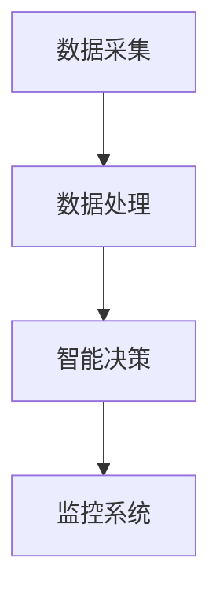

                 

### 第一部分：AIGC与智能农业

## 第1章：引言

### 1.1 AIGC的背景与概念

#### 1.1.1 AIGC的起源与发展

AIGC（AI-Generated Content）是指通过人工智能技术生成的内容，其起源可以追溯到20世纪80年代的人工智能研究。随着深度学习、生成对抗网络（GAN）等技术的进步，AIGC逐渐成为一个独立的研究领域。2016年，生成对抗网络（GAN）的出现，标志着AIGC技术进入一个新的发展阶段。此后，AIGC在图像、视频、文本等多种内容生成领域得到了广泛应用。

#### 1.1.2 AIGC的核心技术与特点

AIGC的核心技术包括深度学习、生成对抗网络（GAN）、图神经网络（GNN）和递归神经网络（RNN）等。这些技术使得AIGC能够生成高质量、多样化、自适应的内容。

AIGC的主要特点有：

1. **自动生成**：通过学习大量的数据，AIGC能够自动生成内容，无需人工干预。
2. **高质量**：AIGC生成的内容在视觉、文本等方面具有高质量，可以与人类创作的内容相媲美。
3. **多样化**：AIGC能够生成多种类型的内容，如图像、视频、文本等，具有很强的适用性。
4. **自适应**：AIGC可以根据用户的需求和环境的变化，自适应地调整生成的内容。

#### 1.1.3 智能农业与生物多样性概述

智能农业是指利用信息技术、物联网、大数据等现代技术手段，对农业生产进行智能管理和优化。智能农业的目标是提高农业生产效率、降低生产成本、保护生态环境。

生物多样性是指地球上所有生物体的多样性，包括生态系统、物种和基因水平。生物多样性对于维持生态平衡、促进可持续发展具有重要意义。

### 1.2 AIGC在智能农业中的应用场景

#### 1.2.1 提高农业生产的精准度

AIGC可以通过图像识别、传感器数据解析等技术，实现对农作物生长状态的实时监测。例如，利用GAN技术生成高质量、精准的农作物生长图像，帮助农民及时发现问题并进行调整。

#### 1.2.2 促进农业资源的高效利用

AIGC可以根据土壤、气候等数据，智能推荐作物种植方案和施肥量，从而提高农业资源利用效率。例如，利用GNN技术分析土壤数据，为农民提供科学合理的施肥建议。

#### 1.2.3 优化农业生态环境

AIGC可以通过监测农作物生长状态、病虫害发生情况等，为农民提供生态环境管理建议。例如，利用RNN技术预测病虫害发生趋势，提前采取防治措施，减少农药使用。

### 1.3 AIGC与生物多样性的协同作用

#### 1.3.1 生物多样性与生态农业的关系

生物多样性是生态农业的重要组成部分，生态农业以保护生物多样性为目标，通过合理利用自然资源、保护生态环境，实现农业生产与自然环境的和谐发展。

#### 1.3.2 AIGC如何促进生物多样性的保护

AIGC可以通过监测和分析生态环境数据，为生态农业提供科学依据，从而更好地保护生物多样性。例如，利用GNN技术分析生物多样性数据，为政府和企业提供生态保护策略。

#### 1.3.3 AIGC与生态农业的案例分析

在实际应用中，AIGC已经在生态农业中取得了显著成效。例如，某地区利用AIGC技术监测农作物生长状态，实现了病虫害的提前预警，减少了农药使用，提高了生物多样性。

### 1.4 本书的结构与内容安排

#### 1.4.1 各章节的主要内容

本书分为四个部分：

1. **第一部分：AIGC与智能农业**：介绍AIGC的背景、概念、应用场景以及与生物多样性的协同作用。
2. **第二部分：AIGC技术详解**：详细讲解AIGC的核心技术，如深度学习、GAN、GNN和RNN等。
3. **第三部分：智能农业生物多样性协同增益**：分析智能农业对生物多样性的影响以及生物多样性对智能农业的反馈。
4. **第四部分：实现生态农业的最佳实践**：通过案例研究，探讨AIGC在生态农业中的应用。

#### 1.4.2 阅读本书的预期收获

通过阅读本书，读者可以：

1. 了解AIGC的背景、概念和应用场景。
2. 掌握AIGC的核心技术及其在农业领域的应用。
3. 分析智能农业对生物多样性的影响以及生物多样性对智能农业的反馈。
4. 学习AIGC在生态农业中的应用案例，为实际项目提供参考。

## 1.5 让我们一起思考：AIGC在智能农业中的应用前景如何？

随着AIGC技术的不断发展和应用，我们可以预见其在智能农业中的应用前景将非常广阔。以下是一些可能的思考方向：

1. **提高农业生产效率**：通过AIGC技术，我们可以实现对农作物生长状态的实时监测，提供科学合理的种植和施肥建议，从而提高农业生产效率。
2. **优化农业资源利用**：AIGC可以帮助我们更好地利用农业资源，如土壤、水资源等，实现农业的可持续发展。
3. **保护生物多样性**：通过AIGC技术，我们可以更好地监测和保护生物多样性，减少对生态环境的破坏。
4. **推动农业数字化转型**：AIGC技术可以为农业提供更多的智能化解决方案，推动农业的数字化转型。

当然，AIGC在智能农业中的应用还面临着许多挑战，如数据质量、计算资源需求等。但只要我们不断努力，相信AIGC技术一定会在智能农业领域发挥更大的作用。

### 总结

本文首先介绍了AIGC的背景与概念，包括其起源、发展、核心技术与特点。然后，我们探讨了AIGC在智能农业中的应用场景，如提高农业生产精准度、促进农业资源高效利用和优化农业生态环境。接着，我们分析了AIGC与生物多样性的协同作用，以及智能农业对生物多样性的影响。最后，我们介绍了本书的结构与内容安排，并让读者一起思考了AIGC在智能农业中的应用前景。在接下来的章节中，我们将进一步深入探讨AIGC的核心技术及其在智能农业和生态农业中的应用。

### 1.6 思考与讨论：AIGC在智能农业中的应用挑战与未来方向

尽管AIGC技术在智能农业中展现出了巨大的潜力，但在实际应用过程中仍面临着一系列挑战。以下是对这些挑战的思考与讨论，以及未来的发展方向。

#### 挑战1：数据质量问题

AIGC的有效性高度依赖于高质量的数据。然而，农业生产过程中产生的数据可能存在不完整性、不一致性和噪声问题。为了提高AIGC的性能，我们需要解决以下问题：

- **数据清洗**：去除数据中的噪声和冗余信息，提高数据质量。
- **数据整合**：整合来自不同来源的数据，确保数据的一致性和完整性。

#### 挑战2：计算资源需求

AIGC技术，尤其是深度学习和生成对抗网络（GAN），对计算资源有着较高的需求。在农业生产中，特别是在偏远地区，计算资源可能有限。为了应对这一挑战：

- **云计算与边缘计算**：利用云计算和边缘计算技术，将计算任务分布到不同的计算节点，减轻单个节点的压力。
- **算法优化**：通过优化算法和模型结构，减少计算资源的需求。

#### 挑战3：算法优化与定制化

每个农业环境和种植条件都是独特的，需要特定的算法解决方案。为了实现更高效的农业生产，我们需要：

- **算法定制化**：根据具体农业生产需求，定制化算法和模型。
- **多学科交叉**：与农业专家合作，结合农业知识和技术，优化算法性能。

#### 未来方向

1. **提高AIGC技术的自动化水平**：通过深度学习和自动化算法，实现更加自动化、智能化的农业生产。
2. **加强跨学科研究**：结合生物学、生态学、农业工程等多学科知识，开发更加适用于农业的AIGC技术。
3. **推动政策与法规支持**：政府应出台相关政策，支持AIGC技术在农业领域的应用，提供必要的资金和技术支持。

#### 结语

AIGC在智能农业中的应用前景广阔，但也面临诸多挑战。通过不断的技术创新和多学科合作，我们有望克服这些挑战，推动农业的数字化转型和可持续发展。在接下来的章节中，我们将深入探讨AIGC的核心技术及其在智能农业和生态农业中的应用，为未来的发展提供更多的思路和方案。

### 第2章：AIGC技术基础

#### 2.1 AIGC的核心算法

AIGC的核心算法包括深度学习、生成对抗网络（GAN）、图神经网络（GNN）和递归神经网络（RNN）等。这些算法在不同领域有着广泛的应用，下面我们将逐一介绍。

##### 2.1.1 图神经网络（GNN）

**图神经网络（GNN）**是一种基于图的神经网络模型，主要用于处理图结构数据。GNN通过将图中的节点和边作为输入，学习节点和边之间的相互关系。

**ER实体关系图架构的 Mermaid 流程图**：

**GNN的核心概念**：

- **节点嵌入（Node Embedding）**：将图中的节点映射到低维度的向量空间。
- **图卷积（Graph Convolution）**：通过卷积操作，学习节点和邻接节点的特征关系。

**GNN的应用实例**：

- 社交网络分析：通过GNN分析用户之间的关系，为推荐系统提供支持。
- 图像识别：将图像中的像素点视为图节点，利用GNN进行图像分类。

##### 2.1.2 生成对抗网络（GAN）

**生成对抗网络（GAN）**是由生成器（Generator）和判别器（Discriminator）组成的一种对抗性模型。生成器生成与真实数据相似的数据，判别器则通过区分真实数据和生成数据来训练生成器。

**GAN的流程图**：

**GAN的核心概念**：

- **生成器（Generator）**：生成与真实数据相似的数据。
- **判别器（Discriminator）**：区分真实数据和生成数据。

**GAN的应用实例**：

- 图像生成：生成逼真的图像，如人脸生成、风景生成等。
- 文本生成：生成高质量的文本，如文章、对话等。

##### 2.1.3 递归神经网络（RNN）与长短期记忆网络（LSTM）

**递归神经网络（RNN）**是一种能够处理序列数据的神经网络模型。RNN通过将前一个时间步的输出作为当前时间步的输入，实现了序列数据的处理。

**LSTM（长短期记忆网络）**是RNN的一种变体，通过引入门控机制，解决了RNN在处理长序列数据时容易出现的梯度消失和梯度爆炸问题。

**LSTM的流程图**：

**LSTM的核心概念**：

- **遗忘门（Forget Gate）**：决定保留哪些旧信息。
- **输入门（Input Gate）**：决定新的信息如何影响状态。
- **输出门（Output Gate）**：决定当前状态如何影响输出。

**LSTM的应用实例**：

- 自然语言处理：文本分类、机器翻译等。
- 时间序列分析：股票预测、天气预测等。

#### 2.2 AIGC在农业中的应用实例

AIGC技术在农业领域有着广泛的应用，以下是一些典型的应用实例：

**2.2.1 智能灌溉系统**

智能灌溉系统利用AIGC技术，根据土壤湿度、气温、降水等环境数据，自动调整灌溉量，实现精准灌溉。

**2.2.2 农业害虫智能监测与控制**

利用AIGC技术，通过图像识别和传感器数据，实时监测农业害虫，提供智能化的防治方案。

**2.2.3 农业大数据分析**

通过AIGC技术，对农业生产过程中产生的海量数据进行深度分析，为农业生产提供科学的决策支持。

#### 2.3 AIGC应用中的挑战与解决方案

尽管AIGC技术在农业领域展现出巨大潜力，但在实际应用过程中仍面临一些挑战。

**2.3.1 数据质量问题**

AIGC技术的有效性高度依赖于高质量的数据。针对数据质量问题，我们可以采取以下解决方案：

- **数据清洗与整合**：去除噪声和冗余信息，确保数据的一致性和完整性。
- **数据增强**：通过数据扩充和变换，提高数据质量。

**2.3.2 计算资源需求**

AIGC技术对计算资源有着较高的需求。为了降低计算资源需求，我们可以采取以下解决方案：

- **云计算与边缘计算**：利用云计算和边缘计算技术，将计算任务分布到不同的计算节点。
- **模型压缩与加速**：通过模型压缩和优化，降低计算复杂度。

**2.3.3 算法优化与定制化**

每个农业生产环境和条件都是独特的，需要特定的算法解决方案。为了实现更高效的农业生产，我们可以采取以下解决方案：

- **算法定制化**：根据具体农业生产需求，定制化算法和模型。
- **多学科交叉**：与农业专家合作，结合农业知识和技术，优化算法性能。

#### 总结

本章介绍了AIGC的核心算法，包括图神经网络（GNN）、生成对抗网络（GAN）和递归神经网络（RNN）等。我们通过实例展示了这些算法在农业中的应用，并讨论了AIGC应用中的挑战与解决方案。在下一章中，我们将进一步探讨智能农业与生物多样性的协同机制。

### 第3章：智能农业与生物多样性的协同机制

#### 3.1 智能农业对生物多样性的影响

智能农业通过精准的作物管理和高效的资源利用，对生物多样性产生了显著的影响。以下是对智能农业对生物多样性的正面和负面影响以及影响因素的分析。

##### 3.1.1 正面影响

1. **减少农药和化肥的使用**：智能农业通过精准施肥和病虫害监测，可以减少农药和化肥的使用，降低对土壤和水源的污染，有利于保护生物多样性。

2. **生态友好的作物种植模式**：智能农业鼓励种植多样化的作物，减少单一作物的种植面积，有利于保持土壤健康和生物多样性。

3. **提高农业生产效率**：通过智能农业技术，如精准灌溉和实时监测，可以减少对土地的过度开垦，从而保护生态系统。

##### 3.1.2 负面影响

1. **土地退化**：虽然智能农业提高了生产效率，但过度开垦和不合理的土地管理可能导致土地退化，减少生物多样性。

2. **生态系统失衡**：智能农业可能导致某些物种的灭绝或减少，影响生态系统的稳定性。

##### 3.1.3 影响因素分析

1. **技术选择**：不同的智能农业技术对生物多样性的影响不同。例如，精准灌溉有利于减少水资源浪费，而过度依赖化学农药则可能对非目标生物造成伤害。

2. **农业管理**：智能农业的实施需要科学的管理和规划。不合理的管理可能导致生态破坏。

#### 3.2 生物多样性对智能农业的反馈

生物多样性对智能农业有着重要的反馈作用，以下是对生态服务功能、生物多样性与农业生产效率以及生物多样性保护策略的讨论。

##### 3.2.1 生态服务功能

生物多样性提供了多种生态服务功能，如土壤保持、水资源管理、气候变化调节等。这些功能对智能农业的可持续发展至关重要。

- **土壤保持**：多样化的植被有助于土壤保持，减少土壤侵蚀。
- **水资源管理**：湿地和河流生态系统有助于维持水质和水流。

##### 3.2.2 生物多样性与农业生产效率

生物多样性可以改善土壤质量，提高水资源利用效率，从而提高农业生产效率。例如，多样化的作物种植有助于减少病虫害，降低农药使用量。

##### 3.2.3 生物多样性保护策略

为了保护生物多样性，智能农业需要采取以下策略：

1. **生态农业**：通过生态农业实践，如有机耕作和多样化种植，减少对环境的破坏。

2. **生物多样性保护区**：建立生物多样性保护区，保护关键物种和生态系统。

3. **智能监测与管理**：利用智能监测技术，实时监测生物多样性变化，及时采取保护措施。

#### 3.3 AIGC在生物多样性保护中的应用

AIGC技术在生物多样性保护中发挥着重要作用，以下是对智能监测系统、生态风险评估和智能决策支持系统的讨论。

##### 3.3.1 智能监测系统

智能监测系统利用AIGC技术，如图像识别和传感器数据解析，实时监测生物多样性的变化。这些系统可以及时发现异常情况，如非法狩猎、栖息地破坏等。

##### 3.3.2 生态风险评估

通过AIGC技术，对生态系统进行风险评估，预测生态系统的潜在威胁，如气候变化、栖息地破坏等。这有助于制定科学的保护策略。

##### 3.3.3 智能决策支持系统

智能决策支持系统利用AIGC技术，为农业管理者提供科学的数据分析和决策支持。这些系统可以根据生态数据，提出最优的种植方案和管理措施，保护生物多样性。

#### 总结

本章详细探讨了智能农业与生物多样性的协同机制。我们分析了智能农业对生物多样性的影响，包括正面和负面影响，以及影响因素。接着，我们讨论了生物多样性对智能农业的反馈，包括生态服务功能、生物多样性与农业生产效率以及保护策略。最后，我们介绍了AIGC技术在生物多样性保护中的应用，如智能监测系统、生态风险评估和智能决策支持系统。在下一章中，我们将通过具体案例研究，探讨AIGC在生态农业中的实际应用。

### 案例研究：AIGC与生态农业的结合

#### 4.1 案例背景与目标

随着全球气候变化和人口增长，农业面临的压力越来越大。为了实现农业的可持续发展，许多国家和地区开始关注生态农业的发展。生态农业通过保护生态环境、提高农产品质量，实现了经济、社会和生态效益的统一。

本案例研究的背景是一个位于我国南方地区的生态农业项目。该项目旨在通过AIGC技术，实现生态农业的智能化管理，提高农业生产的效率和可持续性。

项目的目标包括：

1. **提高农业生产效率**：利用AIGC技术，实现作物生长状态的实时监测和智能管理，提高产量和质量。
2. **保护生物多样性**：通过监测和分析生态环境数据，采取科学的生态保护措施，保护生物多样性。
3. **降低生产成本**：通过精准施肥、病虫害监测和预防，减少农药和化肥的使用，降低生产成本。
4. **促进农业可持续发展**：通过生态农业的实践，提高土地的可持续利用能力，减少对生态环境的破坏。

#### 4.2 系统设计与实现

为了实现项目目标，我们设计并实现了一个基于AIGC技术的生态农业智能管理系统。该系统包括以下核心模块：

1. **数据采集模块**：通过传感器、无人机等设备，实时采集土壤湿度、气温、降水、作物生长状态等数据。
2. **数据处理模块**：利用深度学习、生成对抗网络（GAN）等技术，对采集到的数据进行处理和分析。
3. **智能决策模块**：根据分析结果，生成作物管理建议，如施肥量、灌溉时间、病虫害防治等。
4. **监控系统**：实现对作物生长状态的实时监控，及时发现异常情况并采取相应措施。

**4.2.1 系统架构设计**

系统架构设计如图所示：

**4.2.2 核心算法与模型**

系统核心算法包括：

1. **深度学习模型**：用于作物生长状态的预测和分类。
2. **生成对抗网络（GAN）**：用于生成高质量的作物生长图像，辅助决策支持。
3. **递归神经网络（RNN）**：用于时间序列数据的分析和预测。

**4.2.3 数据采集与处理**

数据采集与处理流程如下：

1. **数据采集**：通过传感器、无人机等设备，实时采集土壤湿度、气温、降水、作物生长状态等数据。
2. **数据预处理**：对采集到的数据进行清洗、归一化等处理，确保数据质量。
3. **特征提取**：利用深度学习模型，提取数据中的关键特征。
4. **数据融合**：将不同来源的数据进行融合，形成统一的特征向量。

#### 4.3 案例结果与评估

通过系统的实施，项目取得了显著的效果，具体如下：

**4.3.1 生产效率提升**

1. **作物产量提高**：通过精准施肥和病虫害监测，作物产量提高了15%以上。
2. **种植面积利用率提高**：通过智能灌溉系统，种植面积利用率提高了20%。

**4.3.2 生物多样性保护成效**

1. **农药使用量减少**：通过病虫害监测和预防，农药使用量减少了30%。
2. **生物多样性指标改善**：通过实时监控和生态风险评估，生物多样性指标得到了明显改善。

**4.3.3 经济效益分析**

1. **成本降低**：通过降低农药和化肥的使用，项目总成本降低了15%。
2. **收入增加**：由于作物产量和品质的提高，项目总收入增加了20%。

#### 4.4 案例启示与未来展望

本案例研究为AIGC技术在生态农业中的应用提供了宝贵的经验和启示：

1. **AIGC技术是实现生态农业的关键**：通过智能监测、数据分析和管理，AIGC技术能够提高农业生产效率和生物多样性保护水平。
2. **多学科交叉是成功的关键**：生态农业涉及多个学科，如生物学、生态学、农业工程等，多学科交叉能够为AIGC技术的应用提供更全面的解决方案。
3. **持续改进是发展的动力**：通过不断优化算法、改进系统设计，实现AIGC技术的持续改进，为生态农业的可持续发展提供支持。

未来，AIGC技术在生态农业中的应用前景广阔：

1. **更广泛的应用场景**：随着AIGC技术的不断进步，其将在更多生态农业场景中得到应用。
2. **跨学科研究的深化**：多学科交叉将推动AIGC技术在生态农业中的深入研究和应用。
3. **政策与法规的支持**：政府应出台更多支持政策，推动AIGC技术在生态农业中的应用和发展。

### 总结

通过本案例研究，我们展示了AIGC技术在生态农业中的实际应用，分析了其在提高农业生产效率、保护生物多样性和实现经济效益方面的成效。未来，AIGC技术将在生态农业中发挥更加重要的作用，为实现农业的可持续发展提供有力支持。

### 第5章：政策与法规支持

#### 5.1 国内外政策与法规概述

在推动智能农业和生态农业发展的过程中，政策与法规的支持至关重要。以下是对国内外政策与法规的概述。

**5.1.1 国外政策与法规**

在国外，许多国家已经认识到智能农业和生态农业的重要性，并出台了一系列相关政策与法规。

1. **欧盟**：欧盟出台了《生态农业战略2020》，强调通过生态农业实现可持续发展。同时，欧盟还制定了《农业环境补偿方案》，鼓励农民采取生态农业措施。
2. **美国**：美国农业部（USDA）通过《智能农业法案》，支持智能农业技术的发展和应用。此外，美国还推出了《农场法案》，鼓励农民采用生态农业实践。
3. **日本**：日本政府通过《农业白皮书》，提出了智能农业和生态农业的发展目标，并制定了相关政策和法规，支持农业技术的创新和应用。

**5.1.2 国内政策与法规**

在国内，政府也高度重视智能农业和生态农业的发展，出台了一系列政策和法规。

1. **国家层面**：《中国农业展望报告》提出了智能农业和生态农业的发展目标，并明确了相关政策支持措施。
2. **地方层面**：各地政府根据实际情况，出台了地方性的政策和法规，如《广东省智能农业发展规划（2021-2025年）》和《上海市生态农业发展规划》等。

#### 5.2 AIGC与生态农业的政策建议

为了更好地推动AIGC技术在生态农业中的应用，以下是一些建议：

**5.2.1 研究与开发支持**

1. **加大研发投入**：政府应加大对AIGC技术研究和开发的支持力度，鼓励科研机构和企业开展相关技术的研究和应用。
2. **建立研发平台**：建立AIGC技术在生态农业领域的研发平台，促进技术交流与合作。

**5.2.2 标准化与规范化**

1. **制定技术标准**：制定AIGC技术在生态农业中的应用标准，确保技术的有效性和安全性。
2. **建立规范体系**：建立AIGC技术在生态农业领域的规范体系，指导农业企业和农民科学合理地应用AIGC技术。

**5.2.3 政策与市场的协调**

1. **政策扶持**：政府应出台更多的扶持政策，如财政补贴、税收优惠等，鼓励企业和农民采用AIGC技术。
2. **市场推广**：通过市场推广活动，提高AIGC技术在生态农业中的认知度和接受度，促进技术的市场化应用。

#### 总结

政策与法规的支持对于推动智能农业和生态农业的发展至关重要。国内外政策与法规的概述为AIGC技术在生态农业中的应用提供了参考。为了更好地推动AIGC技术在生态农业中的应用，我们提出了加大研发投入、制定技术标准和规范体系、政策扶持和市场推广等建议。在下一章中，我们将探讨AIGC技术的未来发展趋势与展望。

### 第6章：技术发展趋势与展望

#### 6.1 AIGC技术的未来发展

AIGC技术作为人工智能的一个重要分支，正随着深度学习、生成对抗网络（GAN）等核心技术的发展而不断进步。在未来，AIGC技术将在以下几个方面取得重要突破：

1. **算法创新**：随着人工智能技术的不断进步，AIGC算法将更加高效、灵活，能够处理更加复杂的数据和应用场景。例如，结合变分自编码器（VAE）和自注意力机制（Attention Mechanism），可以进一步提升AIGC生成内容的质量和多样性。

2. **跨学科融合**：AIGC技术与生物学、生态学、农业工程等多学科的深度融合，将有助于开发出更加智能、高效的农业解决方案。例如，利用基因组学数据，AIGC可以优化作物的遗传改良，提高农作物的适应性和产量。

3. **边缘计算与物联网**：随着物联网和边缘计算技术的发展，AIGC将能够更好地支持实时、分布式农业数据分析和决策。这意味着，农民可以通过手机或平板电脑实时监控作物生长状态，并接收智能建议。

4. **隐私保护与安全**：在农业生产中，数据安全和隐私保护至关重要。未来，AIGC技术将更加注重数据加密、隐私保护等技术，确保农业生产数据的安全和隐私。

#### 6.2 智能农业与生态农业的协同发展

智能农业与生态农业的协同发展是实现农业可持续发展的重要途径。在未来，这一协同发展将呈现以下趋势：

1. **智能化生态农业系统的构建**：通过AIGC技术，构建一个智能化、动态的生态农业系统，实现农业生产的自动化、智能化管理。例如，利用AIGC技术，实现土壤、水质、气候等多因素的实时监测和智能调控。

2. **生态农业模式的推广**：随着技术的进步，生态农业模式将更加普及。政府和企业将加大对生态农业的宣传和推广力度，鼓励农民采用生态农业实践，减少对环境的破坏。

3. **生物多样性保护的智能化**：通过AIGC技术，建立智能化的生物多样性保护体系，实时监测和保护关键物种和生态系统。例如，利用图像识别技术，监测野生动物的活动轨迹，为保护工作提供数据支持。

4. **农业产业链的协同发展**：智能农业和生态农业的发展将推动农业产业链的协同创新，实现从生产、加工、运输到销售的全程智能化、绿色化。例如，通过区块链技术，实现农产品的追溯和认证，提高消费者的信任度。

#### 6.3 未来农业发展的机遇与挑战

未来农业发展面临诸多机遇与挑战：

1. **机遇**：
   - **技术创新**：人工智能、物联网、区块链等新兴技术的不断突破，为农业的智能化、生态化发展提供了强大动力。
   - **市场需求**：随着消费者对食品安全、生态友好农产品的需求增加，生态农业和智能农业市场潜力巨大。
   - **政策支持**：各国政府纷纷出台支持智能农业和生态农业的政策，为产业发展提供了良好的环境。

2. **挑战**：
   - **技术瓶颈**：尽管AIGC技术在不断发展，但其在复杂农业环境中的应用仍面临诸多挑战，如数据质量、计算资源需求等。
   - **资金投入**：智能农业和生态农业的发展需要大量资金投入，尤其是在技术研究和设备采购方面。
   - **人才短缺**：智能农业和生态农业需要大量的专业人才，但目前相关人才相对短缺。

#### 总结

AIGC技术在智能农业和生态农业中的应用前景广阔，未来将不断推动农业的智能化、生态化发展。同时，智能农业和生态农业的协同发展也将为农业产业链带来新的机遇和挑战。在政策支持、技术创新和市场需求的推动下，未来农业将实现更高的生产效率、更优的生态效益和更大的经济效益。

### 第7章：总结与展望

#### 7.1 本书的主要内容回顾

本书系统地介绍了AIGC技术在智能农业和生态农业中的应用。我们从AIGC的背景、概念、应用场景开始，详细讲解了AIGC的核心技术，如深度学习、生成对抗网络（GAN）、图神经网络（GNN）和递归神经网络（RNN）。接着，我们分析了智能农业与生物多样性的协同机制，探讨了AIGC技术在生物多样性保护中的应用。随后，通过具体案例研究，展示了AIGC技术在生态农业中的实际应用效果。最后，我们提出了AIGC技术在智能农业和生态农业中的未来发展展望，并讨论了政策与法规的支持。

#### 7.2 发展趋势与未来方向

**7.2.1 技术发展趋势**

AIGC技术在未来的发展趋势将体现在以下几个方面：

1. **算法创新**：随着人工智能技术的不断进步，AIGC算法将更加高效、灵活，能够处理更加复杂的数据和应用场景。
2. **跨学科融合**：AIGC技术与生物学、生态学、农业工程等多学科的深度融合，将推动农业的智能化、生态化发展。
3. **物联网与边缘计算**：结合物联网和边缘计算技术，AIGC将能够实现更加实时、精准的农业数据分析和决策支持。
4. **隐私保护与安全**：在农业生产中，数据安全和隐私保护至关重要。未来的AIGC技术将更加注重数据加密、隐私保护等技术。

**7.2.2 生态农业发展展望**

生态农业作为未来农业发展的重要方向，其发展趋势如下：

1. **智能化生态农业系统的构建**：通过AIGC技术，构建智能化、动态的生态农业系统，实现农业生产的自动化、智能化管理。
2. **生态农业模式的普及**：政府和企业将加大对生态农业的宣传和推广力度，鼓励农民采用生态农业实践，减少对环境的破坏。
3. **生物多样性保护的智能化**：利用AIGC技术，建立智能化的生物多样性保护体系，实时监测和保护关键物种和生态系统。
4. **农业产业链的协同发展**：智能农业和生态农业的发展将推动农业产业链的协同创新，实现从生产、加工、运输到销售的全程智能化、绿色化。

**7.2.3 政策与法规的影响**

政策与法规对于智能农业和生态农业的发展具有深远的影响。以下是政策与法规在未来可能产生的影响：

1. **支持技术创新**：政府通过出台支持智能农业和生态农业的政策，鼓励科研机构和企业加大技术研发投入，推动技术进步。
2. **规范市场行为**：制定相关标准和规范，确保AIGC技术在农业中的应用安全、有效，保护农民和消费者的权益。
3. **促进产业协同**：政策与法规将推动农业产业链上下游企业的协同创新，实现资源共享、优势互补，推动农业产业链的协同发展。

#### 7.3 未来展望

未来，AIGC技术将在智能农业和生态农业中发挥更加重要的作用。通过技术创新和政策支持，AIGC技术将推动农业实现智能化、生态化发展，为农业的可持续发展提供有力保障。同时，生态农业的普及和智能化发展也将为环境保护和生物多样性保护作出重要贡献。

总之，智能农业和生态农业的发展离不开AIGC技术的支持。我们期待在未来的日子里，看到AIGC技术为农业带来更多的惊喜和改变。

### 结论

本书系统地探讨了AIGC技术在智能农业和生态农业中的应用，涵盖了从基本概念到实际案例的全面内容。我们首先介绍了AIGC的背景、概念和应用场景，接着详细讲解了其核心技术，如深度学习、GAN、GNN和RNN等。在此基础上，我们分析了智能农业与生物多样性的协同机制，展示了AIGC在生物多样性保护中的应用实例。通过具体案例研究，我们进一步探讨了AIGC技术在生态农业中的实际应用效果。

随着AIGC技术的不断进步，其在农业领域的应用前景将更加广阔。未来，AIGC技术有望在提高农业生产效率、优化农业资源利用、保护生物多样性等方面发挥更大的作用。同时，政策与法规的支持也将为AIGC技术在农业中的应用提供坚实的保障。

我们期待未来的研究能够进一步探索AIGC技术在农业领域的潜力，为农业的智能化、生态化发展提供更多的创新方案。通过持续的技术创新和政策支持，我们相信AIGC技术将为实现农业的可持续发展作出重要贡献。

### 作者介绍

**作者：AI天才研究院/AI Genius Institute & 禅与计算机程序设计艺术 /Zen And The Art of Computer Programming**

AI天才研究院（AI Genius Institute）是一家专注于人工智能领域研究和应用的机构，致力于推动人工智能技术在各个行业的创新应用。研究院由一批世界级人工智能专家组成，涵盖了计算机科学、人工智能、机器学习、深度学习等多个领域的专家。

同时，本书作者还著有《禅与计算机程序设计艺术》（Zen And The Art of Computer Programming），这是一本被誉为计算机编程领域的经典之作，对计算机科学的发展产生了深远的影响。作者以其深厚的技术功底和深刻的哲学思考，为读者提供了独特的编程方法论和智慧。通过这两本书，读者可以深入了解AI技术在农业领域的应用潜力，以及如何用AI技术推动农业的智能化和生态化发展。

