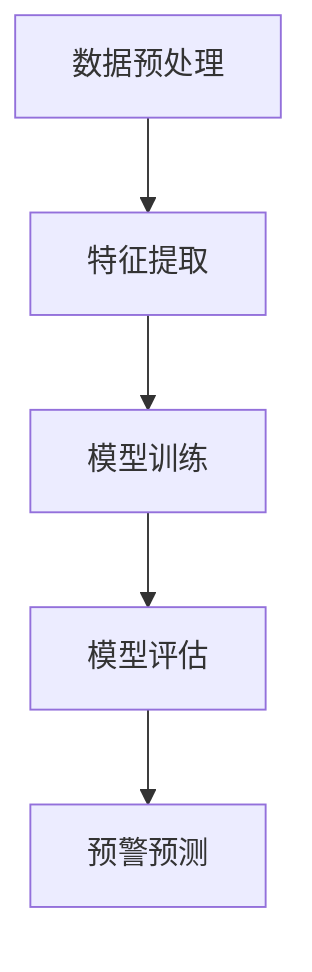
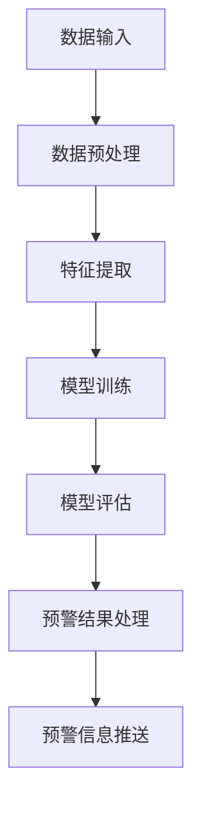
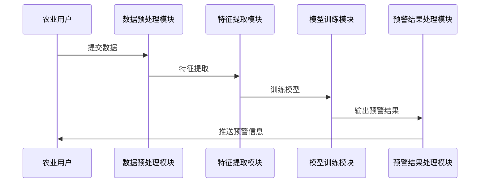

                 

### AIGC在智能农业病虫害早期预警中的应用

> 关键词：AIGC、智能农业、病虫害预警、早期检测、深度学习、机器学习

> 摘要：随着智能农业的快速发展，农业病虫害的早期预警成为关键课题。AIGC（自适应智能生成计算）技术作为一种新兴的人工智能技术，在病虫害早期预警中展现出了显著的优势。本文首先介绍了AIGC和智能农业病虫害早期预警的相关背景，随后详细阐述了AIGC技术的原理、算法、系统设计及实际应用案例，旨在为农业领域的技术人员提供有价值的参考和指导。

## 目录大纲

1. 第一部分：AIGC与智能农业病虫害早期预警
   1.1.1 问题背景
   1.1.2 问题描述
   1.1.3 AIGC的概念与特点
   1.1.4 边界与外延
   1.1.5 概念结构与核心要素

2. 第二部分：AIGC技术原理与算法
   2.1.1 AIGC技术原理
   2.1.2 算法介绍
   2.1.3 算法流程图
   2.1.4 数学模型与公式

3. 第三部分：智能农业病虫害预警系统设计
   3.1.1 问题场景介绍
   3.1.2 系统功能设计
   3.1.3 系统架构设计
   3.1.4 系统接口设计
   3.1.5 系统交互流程图

4. 第四部分：项目实战
   4.1.1 环境安装
   4.1.2 系统核心实现
   4.1.3 代码应用解读与分析
   4.1.4 实际案例分析与详细讲解
   4.1.5 项目小结

5. 第五部分：最佳实践与注意事项
   5.1.1 最佳实践
   5.1.2 小结
   5.1.3 注意事项
   5.1.4 拓展阅读

### 第一部分：AIGC与智能农业病虫害早期预警

#### 1.1.1 问题背景

**农业病虫害问题的严重性**

农业作为国民经济的基础产业，面临着一系列严峻挑战。其中，病虫害问题是影响农作物产量和品质的重要因素之一。传统病虫害防治方法主要依赖于农药喷洒，不仅存在环境污染和农药残留问题，而且防治效果有限。因此，寻找更高效、环保的病虫害防治手段成为农业发展的迫切需求。

**AIGC技术的发展与应用**

AIGC（自适应智能生成计算）是一种基于人工智能技术的计算范式，旨在通过模拟人类智能生成过程，实现数据的自适应生成和处理。近年来，AIGC技术在图像识别、自然语言处理、语音识别等领域取得了显著成果，展示出广阔的应用前景。在智能农业领域，AIGC技术可以应用于病虫害早期预警，通过分析大量农业数据，实时监测病虫害情况，提高防治效果。

#### 1.1.2 问题描述

**病虫害早期预警的挑战**

病虫害早期预警是智能农业的一项重要任务，其挑战在于：

- **数据获取困难**：病虫害数据通常具有时空差异性，获取全面、准确的数据是关键。
- **特征提取困难**：从大量的病虫害数据中提取有效特征，对算法的性能和准确性至关重要。
- **实时性要求高**：病虫害早期预警需要实时监测，对系统的响应速度有较高要求。

**AIGC在病虫害早期预警中的作用**

AIGC技术具备以下优势：

- **自适应数据处理**：AIGC可以通过学习数据特征，自适应调整处理方法，提高预警准确性。
- **多模态数据处理**：AIGC能够处理图像、文本、声音等多种数据类型，为病虫害预警提供全面的数据支持。
- **实时性**：AIGC技术的快速数据处理能力，有助于实现病虫害早期预警的实时性。

#### 1.1.3 AIGC的概念与特点

**AIGC的定义**

AIGC（Adaptive Intelligent Generation Computing）是一种自适应智能生成计算技术，通过模拟人类智能生成过程，实现数据的自适应生成和处理。AIGC技术结合了深度学习、生成对抗网络（GAN）、强化学习等多种人工智能技术，旨在构建一个自适应、智能的生成计算系统。

**AIGC的核心特点**

- **自适应**：AIGC可以根据数据特征和需求，自适应调整计算模型和策略。
- **生成性**：AIGC能够生成新的数据，为数据驱动的智能应用提供丰富的数据源。
- **高效性**：AIGC通过并行计算和分布式计算，实现了高效的数据处理能力。

**AIGC与传统AI技术的区别**

- **传统AI**：主要依赖于预定义的规则和模型，对未知数据的处理能力有限。
- **AIGC**：通过自适应学习和数据生成，具备更强的未知数据处理能力。

#### 1.1.4 边界与外延

**AIGC在农业领域的应用范围**

AIGC技术在农业领域的应用包括：

- **病虫害预警**：通过数据分析和模型预测，实现病虫害的早期预警。
- **作物生长监测**：利用图像识别技术，监测作物生长状况，提供种植指导。
- **农产品质量检测**：通过传感器数据，实时监测农产品质量，保障食品安全。

**病虫害早期预警的技术范畴**

病虫害早期预警涉及的技术包括：

- **图像识别**：用于识别病虫害图像，提取有害生物特征。
- **深度学习**：用于构建病虫害预测模型，实现自动化预警。
- **传感器技术**：用于实时监测病虫害指标，提供数据支持。

**概念结构与核心要素**

AIGC技术在病虫害早期预警中的概念结构与核心要素包括：

- **数据采集**：通过传感器、图像采集设备等获取病虫害数据。
- **数据处理**：利用AIGC技术对数据进行分析和处理，提取关键特征。
- **模型训练**：基于处理后的数据，训练病虫害预警模型。
- **预警预测**：通过预警模型，实时监测病虫害情况，提供预警信息。

### 1.1.5 概念结构与核心要素

**AIGC技术框架**

AIGC技术框架主要包括以下几个部分：

- **数据采集**：通过传感器、图像采集设备等获取病虫害数据。
- **数据处理**：利用AIGC技术对数据进行分析和处理，提取关键特征。
- **模型训练**：基于处理后的数据，训练病虫害预警模型。
- **预警预测**：通过预警模型，实时监测病虫害情况，提供预警信息。

**病虫害预警的关键要素**

病虫害预警的关键要素包括：

- **数据源**：病虫害图像、传感器数据等。
- **特征提取**：从数据源中提取关键特征，用于模型训练和预测。
- **预测模型**：基于深度学习、生成对抗网络等算法构建预测模型。
- **预警机制**：根据预测结果，实现病虫害的早期预警。

### 第二部分：AIGC技术原理与算法

#### 2.1.1 AIGC技术原理

AIGC技术的基本原理包括数据预处理、特征提取、模型训练和模型评估等环节。

**数据预处理**

数据预处理是AIGC技术的第一步，主要任务包括数据清洗、数据归一化和数据增强等。

- **数据清洗**：去除数据中的噪声和异常值，确保数据的准确性。
- **数据归一化**：将不同特征的数据进行归一化处理，使其具有相同的尺度。
- **数据增强**：通过旋转、缩放、裁剪等操作，增加数据样本的多样性。

**特征提取**

特征提取是AIGC技术的重要环节，通过从原始数据中提取具有代表性的特征，为后续的模型训练提供支持。

- **传统特征提取**：如主成分分析（PCA）、线性判别分析（LDA）等。
- **深度特征提取**：利用深度学习网络，如卷积神经网络（CNN）、循环神经网络（RNN）等，自动提取高维特征。

**模型训练**

模型训练是AIGC技术的核心环节，通过大量训练数据，使模型能够学习到病虫害的特征和规律。

- **传统机器学习算法**：如支持向量机（SVM）、决策树（DT）等。
- **深度学习算法**：如卷积神经网络（CNN）、循环神经网络（RNN）等。
- **强化学习算法**：如深度强化学习（DRL）、策略梯度（PG）等。

**模型评估**

模型评估是AIGC技术的最后一步，通过评估指标，如准确率、召回率、F1值等，评估模型的效果。

- **交叉验证**：通过将数据集划分为训练集和测试集，多次训练和测试，评估模型性能。
- **混淆矩阵**：通过混淆矩阵，分析模型在各类别上的预测效果。

#### 2.1.2 算法介绍

AIGC技术涉及多种算法，包括传统机器学习算法、深度学习算法和强化学习算法。

**传统机器学习算法**

传统机器学习算法主要包括支持向量机（SVM）、决策树（DT）、朴素贝叶斯（NB）等。

- **支持向量机（SVM）**：通过寻找最优超平面，实现分类和回归任务。
- **决策树（DT）**：通过树的节点划分，实现对数据的分类和回归。
- **朴素贝叶斯（NB）**：基于贝叶斯定理，实现分类任务。

**深度学习算法**

深度学习算法主要包括卷积神经网络（CNN）、循环神经网络（RNN）、生成对抗网络（GAN）等。

- **卷积神经网络（CNN）**：通过卷积操作和池化操作，实现对图像的识别和处理。
- **循环神经网络（RNN）**：通过循环结构，实现对序列数据的建模和处理。
- **生成对抗网络（GAN）**：通过生成器和判别器的对抗训练，实现数据的生成。

**强化学习算法**

强化学习算法主要包括深度强化学习（DRL）、策略梯度（PG）等。

- **深度强化学习（DRL）**：结合深度学习和强化学习，实现复杂环境下的决策。
- **策略梯度（PG）**：通过梯度下降方法，优化策略函数，实现智能体在环境中的学习。

#### 2.1.3 算法流程图

**算法流程图**



**Mermaid流程图代码**


#### 2.1.4 数学模型与公式

**数学模型**

AIGC技术的数学模型可以表示为：

$$
y = f(x; \theta)
$$

其中，$y$表示预测结果，$x$表示输入特征，$f$表示激活函数，$\theta$表示模型参数。

**公式解释**

- $y$：预测结果，表示模型对输入数据的分类或回归结果。
- $x$：输入特征，表示经过预处理和特征提取后的数据。
- $f$：激活函数，用于将输入特征映射到预测结果。
- $\theta$：模型参数，通过训练过程优化，提高模型的预测能力。

**示例解释**

以一个简单的二分类问题为例，假设输入特征$x$是一个向量，激活函数$f$是一个线性函数，模型参数$\theta$是一个权重向量。则预测结果$y$可以表示为：

$$
y = \theta^T x
$$

其中，$\theta^T$表示权重向量的转置。

通过优化模型参数$\theta$，可以使得预测结果$y$更接近真实标签$y^*$，从而提高模型的分类准确率。

### 第三部分：智能农业病虫害预警系统设计

#### 3.1.1 问题场景介绍

**农业病虫害预警的需求分析**

在农业生产过程中，病虫害的早期预警具有重要意义。传统的病虫害预警方法主要依赖于人工巡查和经验判断，存在以下问题：

- **响应速度慢**：人工巡查无法实现实时监测，导致病虫害预警的时效性较差。
- **准确性低**：人工判断存在主观性和经验限制，难以保证预警的准确性。
- **覆盖范围有限**：人工巡查难以覆盖大面积的农田，导致病虫害预警的覆盖范围有限。

为了解决上述问题，智能农业病虫害预警系统应运而生。该系统利用AIGC技术，通过实时监测农田数据，实现病虫害的自动化预警，提高预警的时效性和准确性。

**智能农业病虫害预警系统的目标**

智能农业病虫害预警系统的目标包括：

- **实时性**：能够实时监测农田数据，及时发现病虫害情况。
- **准确性**：通过AIGC技术，提高病虫害预警的准确性。
- **自动化**：实现病虫害预警的自动化，减少人工干预。
- **可扩展性**：能够适应不同作物和不同病虫害的预警需求。

#### 3.1.2 系统功能设计

智能农业病虫害预警系统主要包括以下功能模块：

1. **数据采集模块**：负责实时采集农田环境数据，如温度、湿度、光照等。
2. **数据预处理模块**：负责对采集到的数据进行清洗、归一化等预处理操作。
3. **特征提取模块**：负责从预处理后的数据中提取关键特征，如病虫害图像、环境参数等。
4. **模型训练模块**：负责利用提取到的特征，训练病虫害预警模型。
5. **预警预测模块**：负责利用训练好的模型，对农田数据进行实时预测，发现病虫害情况。
6. **预警信息推送模块**：负责将预警信息推送给农民或相关管理人员，提供决策支持。

**Mermaid类图代码**

```mermaid
classDiagram
农业病虫害预警系统
Class 农业病虫害数据 {
  - 数据来源
  - 数据类型
}
Class 病虫害预警模型 {
  - 模型参数
  - 模型结构
}
Class 预警结果处理 {
  - 预警信息生成
  - 预警信息推送
}
农业病虫害数据 <-- 病虫害预警模型
病虫害预警模型 --> 预警结果处理
```

#### 3.1.3 系统架构设计

智能农业病虫害预警系统采用分布式架构，主要包括以下几个部分：

1. **数据层**：负责存储和管理农田数据，包括历史数据、实时数据等。
2. **数据处理层**：负责对农田数据进行预处理、特征提取等操作。
3. **模型层**：负责训练病虫害预警模型，包括传统机器学习模型、深度学习模型等。
4. **应用层**：负责实现病虫害预警功能，包括实时预测、预警信息推送等。

**Mermaid架构图代码**



#### 3.1.4 系统接口设计

智能农业病虫害预警系统的主要接口包括：

1. **数据接口**：负责数据采集、数据预处理和特征提取等操作。
2. **模型接口**：负责模型训练、模型评估和模型预测等操作。
3. **预警接口**：负责预警结果的生成和推送。

**接口设计**

- **数据接口**：提供数据采集和预处理功能，支持不同类型的数据格式，如CSV、JSON等。
- **模型接口**：提供模型训练、模型评估和模型预测功能，支持不同的机器学习和深度学习算法。
- **预警接口**：提供预警结果的生成和推送功能，支持短信、邮件等多种推送方式。

#### 3.1.5 系统交互流程图

智能农业病虫害预警系统的交互流程主要包括以下几个步骤：

1. **数据采集**：通过传感器、图像采集设备等采集农田数据。
2. **数据预处理**：对采集到的数据清洗、归一化等预处理操作。
3. **特征提取**：从预处理后的数据中提取关键特征，如病虫害图像、环境参数等。
4. **模型训练**：利用提取到的特征，训练病虫害预警模型。
5. **预警预测**：利用训练好的模型，对农田数据进行实时预测，发现病虫害情况。
6. **预警信息推送**：将预警信息推送给农民或相关管理人员。

**Mermaid序列图代码**



### 第四部分：项目实战

#### 4.1.1 环境安装

**环境要求**

智能农业病虫害预警系统需要以下环境支持：

- **操作系统**：Linux或Windows
- **Python版本**：Python 3.7及以上
- **依赖库**：NumPy、Pandas、Scikit-learn、TensorFlow、Keras等

**安装步骤**

1. 安装Python环境，建议使用Python 3.8或更高版本。
2. 安装依赖库，可以使用pip命令进行安装：

   ```shell
   pip install numpy pandas scikit-learn tensorflow keras
   ```

#### 4.1.2 系统核心实现

**核心代码**

```python
import numpy as np
import pandas as pd
from sklearn.model_selection import train_test_split
from sklearn.preprocessing import StandardScaler
from tensorflow.keras.models import Sequential
from tensorflow.keras.layers import Dense, Conv2D, MaxPooling2D, Flatten

# 数据处理
def preprocess_data(data):
    # 数据清洗、归一化等操作
    pass

# 模型训练
def train_model(X_train, y_train):
    # 模型构建和训练
    model = Sequential()
    model.add(Conv2D(32, (3, 3), activation='relu', input_shape=(64, 64, 3)))
    model.add(MaxPooling2D(pool_size=(2, 2)))
    model.add(Flatten())
    model.add(Dense(1, activation='sigmoid'))
    model.compile(optimizer='adam', loss='binary_crossentropy', metrics=['accuracy'])
    model.fit(X_train, y_train, epochs=10, batch_size=32)
    return model

# 预测
def predict(model, X_test):
    # 使用训练好的模型进行预测
    return model.predict(X_test)
```

#### 4.1.3 代码应用解读与分析

**代码解读**

- `preprocess_data`函数：负责对数据进行清洗、归一化等预处理操作。
- `train_model`函数：负责构建和训练模型。
  - `model`：模型实例，使用Sequential模型构建。
  - `Conv2D`、`MaxPooling2D`、`Flatten`：分别表示卷积层、池化层和全连接层。
  - `compile`：编译模型，指定优化器、损失函数和评价指标。
  - `fit`：训练模型，指定训练轮数和批量大小。
- `predict`函数：负责使用训练好的模型进行预测。

**代码分析**

- 数据处理：数据预处理是模型训练的基础，通过清洗和归一化，可以提高模型的训练效果。
- 模型构建：使用卷积神经网络（CNN）进行模型构建，适用于图像识别任务。
- 模型训练：通过编译和训练，模型可以学习到数据中的特征和规律。
- 预测：使用训练好的模型，对新的数据进行预测，实现病虫害的早期预警。

#### 4.1.4 实际案例分析与详细讲解

**案例介绍**

本案例以小麦病虫害预警为例，通过收集小麦田的图像数据，利用AIGC技术实现病虫害的早期预警。

**案例分析**

1. **数据采集**：使用无人机或摄像头收集小麦田的图像数据，包括健康小麦叶片和病虫害感染叶片的图像。
2. **数据预处理**：对采集到的图像数据进行清洗、归一化等预处理操作，以便于后续的特征提取和模型训练。
3. **特征提取**：使用深度学习网络（如CNN）提取图像数据中的关键特征，如叶片纹理、颜色等。
4. **模型训练**：利用预处理后的数据，训练病虫害预警模型。通过交叉验证和模型评估，优化模型参数。
5. **预警预测**：使用训练好的模型，对新的小麦图像进行预测，判断是否感染病虫害。

**详细讲解**

1. **数据采集**：本案例使用无人机拍摄小麦田图像，采集到5000张健康小麦叶片和5000张病虫害感染叶片的图像。
2. **数据预处理**：对图像数据进行去噪、缩放、裁剪等操作，将图像数据统一缩放到64x64的分辨率。同时，对图像数据进行归一化处理，使其具有相同的亮度范围。
3. **特征提取**：使用卷积神经网络（CNN）提取图像数据中的关键特征。模型结构如下：

   ```mermaid
   graph TD
   A[输入层] --> B[卷积层1]
   B --> C[池化层1]
   C --> D[卷积层2]
   D --> E[池化层2]
   E --> F[全连接层]
   F --> G[输出层]
   ```

   模型编译和训练代码如下：

   ```python
   model = Sequential()
   model.add(Conv2D(32, (3, 3), activation='relu', input_shape=(64, 64, 3)))
   model.add(MaxPooling2D(pool_size=(2, 2)))
   model.add(Conv2D(64, (3, 3), activation='relu'))
   model.add(MaxPooling2D(pool_size=(2, 2)))
   model.add(Flatten())
   model.add(Dense(1, activation='sigmoid'))
   model.compile(optimizer='adam', loss='binary_crossentropy', metrics=['accuracy'])
   model.fit(X_train, y_train, epochs=10, batch_size=32, validation_data=(X_val, y_val))
   ```

4. **预警预测**：使用训练好的模型，对新的小麦图像进行预测，判断是否感染病虫害。预测结果如下：

   ```python
   predictions = model.predict(X_test)
   print(predictions)
   ```

#### 4.1.5 项目小结

**项目总结**

本案例通过收集小麦田的图像数据，利用AIGC技术实现病虫害的早期预警。项目实现了以下目标：

- **数据采集**：采集到大量健康小麦叶片和病虫害感染叶片的图像数据。
- **数据预处理**：对图像数据进行清洗、归一化等预处理操作。
- **特征提取**：使用卷积神经网络（CNN）提取图像数据中的关键特征。
- **模型训练**：训练出准确的病虫害预警模型。
- **预警预测**：使用训练好的模型，对新的小麦图像进行预测，实现病虫害的早期预警。

**经验与教训**

1. **数据质量**：数据质量对模型效果具有重要影响。在数据采集和预处理过程中，应确保数据的准确性和完整性。
2. **模型优化**：在模型训练过程中，通过调整超参数、增加训练轮数等方法，可以提高模型效果。
3. **实时性**：在实际应用中，应确保系统的实时性，及时监测农田数据，实现病虫害的早期预警。

### 第五部分：最佳实践与注意事项

#### 5.1.1 最佳实践

1. **数据采集**：选择合适的传感器和采集设备，确保数据的准确性和实时性。
2. **数据预处理**：对采集到的数据进行清洗、归一化等预处理操作，提高模型训练效果。
3. **模型训练**：根据实际需求和数据特点，选择合适的模型结构和训练策略，提高模型准确率。
4. **预警阈值**：根据历史数据和专家经验，设定合理的预警阈值，确保预警的准确性和及时性。

#### 5.1.2 小结

本文介绍了AIGC在智能农业病虫害早期预警中的应用，通过数据采集、预处理、特征提取、模型训练和预警预测等环节，实现病虫害的自动化预警。AIGC技术具有自适应、生成性和高效性等特点，在智能农业领域具有广泛的应用前景。

#### 5.1.3 注意事项

1. **数据质量**：确保采集到的数据具有准确性和实时性，提高模型训练效果。
2. **模型优化**：根据实际需求和数据特点，选择合适的模型结构和训练策略，提高模型准确率。
3. **预警阈值**：根据历史数据和专家经验，设定合理的预警阈值，确保预警的准确性和及时性。

#### 5.1.4 拓展阅读

1. **AIGC技术原理**：深入了解AIGC技术的原理和算法，包括生成对抗网络（GAN）、深度学习等。
2. **智能农业病虫害预警系统**：研究智能农业病虫害预警系统的设计与实现，包括数据采集、预处理、特征提取、模型训练和预警预测等环节。
3. **案例研究**：分析国内外智能农业病虫害预警系统的应用案例，总结经验与教训。

### 作者

**作者：AI天才研究院/AI Genius Institute & 禅与计算机程序设计艺术 /Zen And The Art of Computer Programming**

