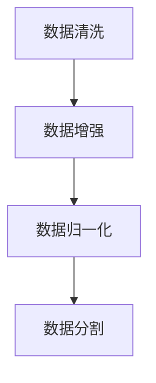
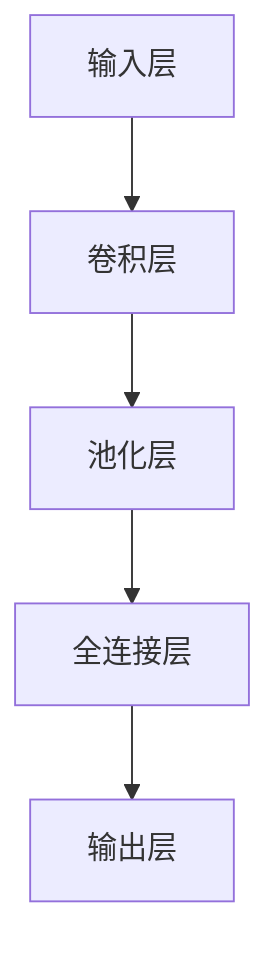
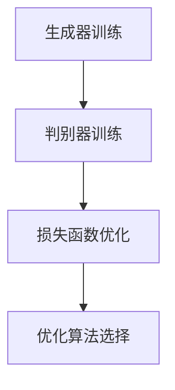
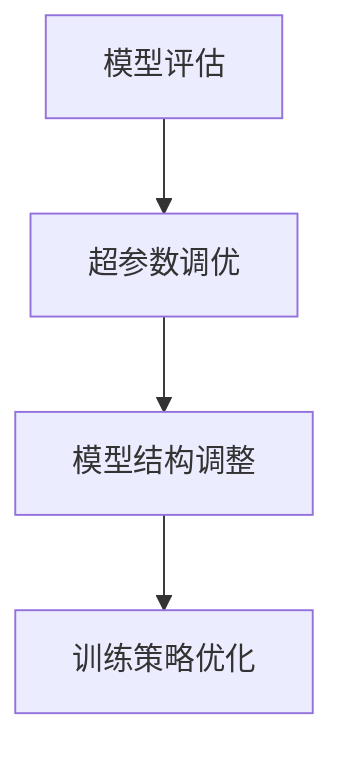
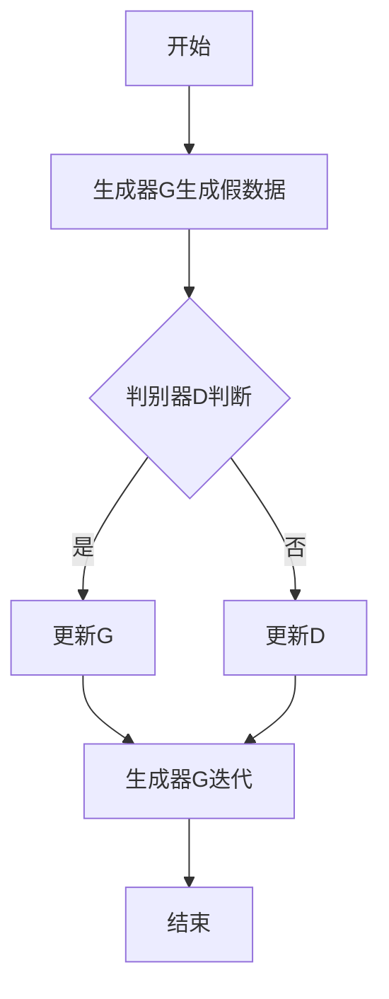
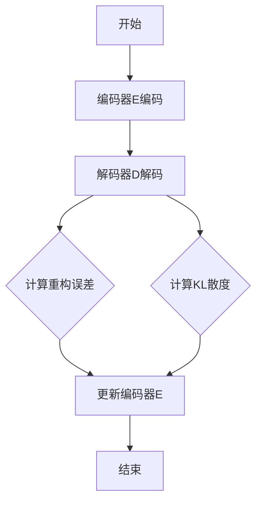
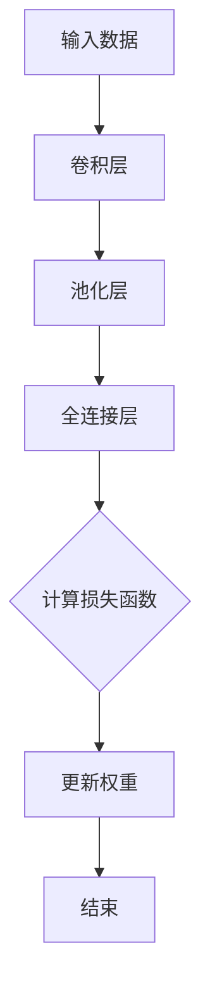
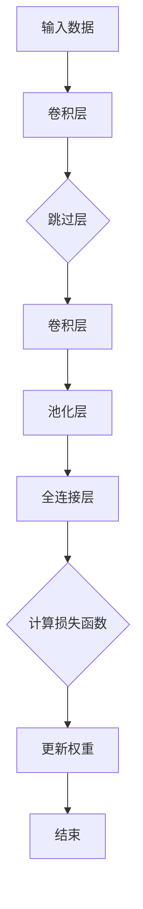

                 

## 引言

### 概念定义

在进入深度探讨之前，我们需要首先明确一些关键概念，确保我们具备一致的理解基础。

**AIGC（AI-Generated Content）**：AIGC 是一种生成式人工智能技术，它能够自动地生成内容，包括文本、图像、音频等多种形式。AIGC 通过深度学习算法，如生成对抗网络（GANs）和变分自编码器（VAEs），从大量数据中学习模式和规律，然后创造新的、独特的数据。

**智能医疗影像分析**：智能医疗影像分析是指利用人工智能技术对医学影像进行自动分析和诊断的过程。这包括图像识别、特征提取、分类和分割等操作，以帮助医生更快速、更准确地诊断疾病。

### 问题背景

随着医疗影像技术的不断发展，医学影像数据的数量呈指数级增长。传统的影像分析方法往往依赖于人工诊断，不仅耗时耗力，而且容易出现误诊。这种状况推动了人工智能技术在医疗领域的应用，特别是 AIGC 技术在智能医疗影像分析中的潜力。

然而，智能医疗影像分析面临着许多挑战，包括数据质量、模型准确性和临床实用性等问题。因此，如何利用 AIGC 技术提高医疗影像分析的效率和准确性成为了一个亟待解决的问题。

### 文章目的

本文旨在探讨 AIGC 在智能医疗影像分析中的应用，通过逐步分析 AIGC 技术的基本原理、应用模型和实际案例，展示其在提高医疗影像分析效率和准确性方面的潜力。文章还将讨论相关挑战和最佳实践，为未来的研究和应用提供参考。

### 文章结构

本文将按照以下结构展开：

1. **背景与概念介绍**：介绍 AIGC 和智能医疗影像分析的基本概念，以及它们之间的联系。
2. **技术原理与模型**：详细阐述 AIGC 在智能医疗影像分析中的技术原理和模型构建。
3. **应用案例与实践**：通过具体案例展示 AIGC 技术在医疗影像分析中的实际应用。
4. **最佳实践与展望**：总结 AIGC 在智能医疗影像分析中的最佳实践，并探讨未来的发展趋势。

### 边界与外延

在探讨 AIGC 在智能医疗影像分析中的应用时，我们还需要考虑一些边界条件和相关的外延问题。例如，数据隐私和安全性是一个关键问题，如何保护患者隐私需要在应用 AIGC 技术时特别关注。此外，AIGC 技术在医疗领域的应用还需要与临床实践相结合，确保其诊断结果的可靠性和实用性。

通过明确这些边界和外延问题，我们可以更全面地理解 AIGC 在智能医疗影像分析中的潜力，以及如何在实际应用中克服挑战。

### 概念结构与核心要素组成

为了更好地理解 AIGC 在智能医疗影像分析中的应用，我们可以将其核心概念和要素结构化。以下是一个简化的结构图：

```
AIGC在智能医疗影像分析中的应用
|
|-- 数据预处理
|   |-- 数据清洗
|   |-- 数据增强
|
|-- 模型构建
|   |-- 深度学习模型
|   |-- 生成对抗网络（GANs）
|   |-- 变分自编码器（VAEs）
|
|-- 模型优化
|   |-- 损失函数
|   |-- 优化算法
|
|-- 模型评估
|   |-- 准确率
|   |-- 召回率
|   |-- 精确率
|
|-- 应用案例
    |-- 肺癌筛查
    |-- 脑部病变诊断
    |-- 皮肤癌识别
```

通过这个结构，我们可以清晰地看到 AIGC 在智能医疗影像分析中的关键步骤和核心要素，为后续内容的深入分析奠定了基础。

### 结论

本文作为引言部分，通过定义核心概念、介绍背景、明确文章目的和结构，为后续内容的深入探讨奠定了基础。在接下来的章节中，我们将逐步分析 AIGC 的技术原理、模型构建和实际应用，以展示其在智能医疗影像分析中的巨大潜力。敬请期待！

---

## 背景与概念介绍

### 1.1 AIGC技术概述

人工智能（AI）的发展已经经历了多个阶段，从早期的规则推理到基于统计的学习，再到深度学习的兴起。AIGC（AI-Generated Content）作为生成式人工智能的代表性技术，进一步拓展了人工智能的应用边界。

**AIGC的定义与特点**

AIGC，即AI-Generated Content，是一种利用人工智能技术生成内容的方法。它能够自动地生成文本、图像、音频等多种形式的内容，而不是简单地从已有数据中进行分类或预测。AIGC的核心特点是生成式，即通过学习大量数据，生成新的、与输入数据具有相似特性的内容。

**AIGC的发展历程**

AIGC的发展可以追溯到2014年，当Ian J. Goodfellow等人提出生成对抗网络（GANs）时。GANs由生成器（Generator）和判别器（Discriminator）组成，通过两者之间的对抗训练，生成器能够生成越来越真实的内容，而判别器则不断提高对真实和生成内容的区分能力。此后，AIGC技术不断演进，包括变分自编码器（VAEs）和其他生成模型的出现，进一步提升了内容的生成质量和多样性。

**AIGC在医疗领域的应用**

随着人工智能技术在医疗领域的应用逐渐深入，AIGC也找到了自己的用武之地。在医疗影像分析方面，AIGC技术可以通过生成高质量的医疗影像数据，用于训练和验证深度学习模型，提高模型的准确性和鲁棒性。此外，AIGC还可以生成个性化的医疗影像数据，用于个性化治疗方案的制定和评估。

### 1.2 智能医疗影像分析的挑战

智能医疗影像分析是指利用人工智能技术对医学影像进行自动分析和诊断的过程。它包括图像识别、特征提取、分类和分割等操作，以帮助医生更快速、更准确地诊断疾病。尽管智能医疗影像分析具有巨大的潜力，但在实际应用中仍面临诸多挑战。

**数据质量**

医疗影像数据的质量对分析结果的准确性至关重要。然而，医疗影像数据通常包含噪声、不完整和错误标记等问题，这会直接影响模型的训练效果和诊断准确性。

**数据量**

医疗影像数据的数量庞大，且不断增长。处理如此大量的数据需要高效的计算资源和算法，这对传统的数据处理方法提出了挑战。

**模型准确性**

尽管深度学习模型在图像识别任务中表现出色，但它们仍然存在过拟合、泛化能力不足等问题，这会导致在新的、未见过的数据上表现不佳。

**临床实用性**

智能医疗影像分析模型的临床实用性是衡量其成功与否的关键。模型需要能够在实际临床环境中稳定、可靠地工作，并且能够与医生的临床经验相结合，以提高诊断的准确性。

### 1.3 AIGC在医疗影像分析中的应用潜力

AIGC技术在医疗影像分析中的应用潜力巨大。通过生成高质量的医疗影像数据，AIGC可以提高模型的训练效果和准确性，从而提高诊断的准确性。以下是一些具体的应用潜力：

**数据增强**

AIGC可以通过数据增强技术，生成与真实数据相似但具有不同特性的数据，用于模型训练。这有助于提高模型的泛化能力，使其在未见过的数据上也能保持良好的性能。

**数据隐私**

AIGC可以通过生成伪影数据，保护患者隐私。这些伪影数据可以用于训练和验证模型，而不泄露真实患者的信息。

**个性化治疗**

AIGC可以生成个性化的医疗影像数据，用于个性化治疗方案的制定和评估。这有助于提高治疗的精准性和有效性。

**模型解释性**

AIGC可以通过生成可视化数据，帮助医生更好地理解模型的工作原理和决策过程，从而提高模型的解释性和临床实用性。

总的来说，AIGC技术在智能医疗影像分析中的应用潜力巨大，有望推动医疗影像分析领域的进一步发展。

---

## 智能医疗影像分析的核心概念

### 1.2.1 医学影像数据处理

医学影像数据处理是智能医疗影像分析的基础。它包括数据的采集、存储、预处理和后续处理等步骤。

**数据采集**

医学影像数据的采集来源包括CT、MRI、X射线等。这些设备通过不同的物理原理生成影像数据，具有不同的分辨率和噪声水平。

**数据存储**

医学影像数据通常以数字图像的形式存储，如DICOM（数字成像与通信医学）格式。这些数据量大，需要高效的存储解决方案。

**预处理**

预处理包括图像的去噪、校正、归一化和分割等操作。这些步骤有助于提高后续分析的质量和效率。

**后续处理**

后续处理包括图像识别、特征提取、分类和分割等。这些步骤利用深度学习等人工智能技术，帮助医生快速、准确地诊断疾病。

### 1.2.2 人工智能在医疗影像中的应用

人工智能在医疗影像中的应用主要包括图像识别、特征提取、分类和分割等。

**图像识别**

图像识别是智能医疗影像分析的核心任务之一。它通过深度学习模型识别影像中的关键结构和异常。

**特征提取**

特征提取是指从医学影像中提取具有诊断意义的特征，如纹理、形状和强度等。

**分类**

分类是指利用提取到的特征，对医学影像进行分类，如区分癌症和良性病变。

**分割**

分割是指将医学影像分割为不同的区域，以识别特定的结构和异常。

### 1.2.3 AIGC技术的特点与优势

AIGC技术在医疗影像分析中具有以下特点和优势：

**生成高质量数据**

AIGC可以通过生成对抗网络（GANs）等生成模型，生成与真实数据相似但具有不同特性的数据，用于模型训练。这有助于提高模型的泛化能力。

**增强数据多样性**

AIGC可以生成各种不同场景和病征的医学影像数据，增强数据的多样性，有助于训练更鲁棒的模型。

**保护数据隐私**

AIGC可以通过生成伪影数据，用于模型训练和验证，而无需使用真实患者的数据，从而保护患者隐私。

**提高诊断准确性**

AIGC生成的数据可以用于训练和验证深度学习模型，提高模型的准确性和诊断能力。

**可视化数据解释**

AIGC可以生成可视化数据，帮助医生更好地理解模型的工作原理和决策过程，从而提高模型的解释性和临床实用性。

总的来说，AIGC技术在智能医疗影像分析中的应用潜力巨大，有望推动医疗影像分析领域的进一步发展。

---

## 技术原理与模型

### 2.1 数据预处理

数据预处理是智能医疗影像分析的重要环节，它包括数据的清洗、增强、归一化和分割等步骤。

**数据清洗**：

数据清洗的主要目标是去除噪声、填补缺失值、纠正错误标记等。在医学影像数据中，可能存在由于设备故障或操作失误导致的噪声和异常数据。因此，数据清洗是保证数据质量的关键步骤。

**数据增强**：

数据增强是通过生成与原始数据相似但具有不同特性的数据，来提高模型的泛化能力。常用的数据增强方法包括旋转、缩放、裁剪、翻转和噪声注入等。

**数据归一化**：

数据归一化是将不同来源或不同尺度的数据进行标准化处理，使其具有相似的数值范围。这有助于提高模型的训练效率和收敛速度。

**数据分割**：

数据分割是将医学影像数据分割为训练集、验证集和测试集。这有助于评估模型的性能，避免过拟合现象。

**预处理流程图**：



### 2.2 深度学习模型

深度学习模型是智能医疗影像分析的核心。深度学习模型通过多层神经网络结构，从大量数据中自动学习特征，进行图像识别、分类和分割等任务。

**卷积神经网络（CNN）**：

卷积神经网络是深度学习中最常用的模型之一，尤其在图像识别任务中表现出色。CNN 通过卷积层提取图像的局部特征，并通过池化层降低数据的维度。

**全连接神经网络（FCNN）**：

全连接神经网络在分类任务中扮演重要角色。它通过将卷积层提取的特征映射到分类空间，实现分类任务。

**深度残差网络（ResNet）**：

深度残差网络是针对深层网络训练困难的问题提出的一种模型。通过引入残差连接，ResNet 能够更好地训练深层网络，提高了模型的准确性和效率。

**模型架构图**：



### 2.3 AIGC模型的构建与优化

**AIGC模型的构建**：

AIGC模型主要通过生成对抗网络（GANs）构建。GANs由生成器（Generator）和判别器（Discriminator）两部分组成。生成器生成虚假数据，判别器判断数据是真实还是虚假。通过这种对抗训练，生成器不断生成更真实的数据，而判别器不断提高对真实和虚假数据的区分能力。

**AIGC模型的优化**：

AIGC模型的优化主要包括损失函数的设计和优化算法的选择。常用的损失函数有交叉熵损失和对抗损失。优化算法通常采用梯度下降法及其变种，如Adam优化器。

**模型优化流程图**：



### 2.4 模型评估与优化

**模型评估**：

模型评估是验证模型性能的重要步骤。常用的评估指标包括准确率、召回率、精确率和F1分数等。通过这些指标，可以全面评估模型的性能。

**模型优化**：

模型优化旨在提高模型的性能，包括超参数调优、模型结构调整和训练策略优化等。通过不断优化，模型可以达到更高的准确性和更低的误诊率。

**评估与优化流程图**：



总的来说，数据预处理、深度学习模型、AIGC模型的构建与优化是智能医疗影像分析的核心技术。通过这些技术，我们可以构建高效、准确的智能医疗影像分析系统，为医学诊断提供有力支持。

---

## 数学模型与算法原理

### 3.1 数学模型介绍

在智能医疗影像分析中，数学模型扮演着至关重要的角色。AIGC技术通过一系列数学模型来实现医学影像的自动分析和诊断。以下将介绍常用的数学模型及其在AIGC中的应用。

**生成对抗网络（GANs）**

GANs由生成器（Generator）和判别器（Discriminator）两部分组成。生成器的目标是生成逼真的数据，判别器的目标是区分真实数据和生成数据。两者的训练过程通过对抗损失函数（Adversarial Loss Function）来实现。对抗损失函数通常采用最小二乘交叉熵（Mean Squared Error, MSE）或Wasserstein损失函数。

**变分自编码器（VAEs）**

VAEs是一种基于概率模型的生成模型，它通过编码器（Encoder）和解码器（Decoder）进行数据重构。编码器将输入数据映射到一个低维隐变量空间，解码器则从隐变量空间中生成重构数据。VAEs的训练目标是最小化重建误差和Kullback-Leibler散度（KL Divergence）。

**卷积神经网络（CNNs）**

CNNs是深度学习模型中的一种，特别适用于图像处理任务。CNNs通过多个卷积层、池化层和全连接层提取图像特征，实现分类、分割和识别任务。卷积层通过卷积运算提取图像的局部特征，池化层用于降低数据的维度，全连接层实现分类任务。

**残差网络（ResNets）**

ResNets是CNNs的变种，通过引入残差连接（Residual Connections）解决了深层网络训练困难的问题。残差连接通过跳跃连接将输入数据直接传递到下一层，使得网络可以训练得更深，同时保持较好的性能。

### 3.2 算法原理讲解

**生成对抗网络（GANs）**

GANs的训练过程可以理解为两个玩家的博弈。生成器试图生成与真实数据难以区分的虚假数据，而判别器则试图准确地区分真实数据和生成数据。在每一次迭代中，生成器和判别器都会更新自己的权重，以实现更好的性能。

训练目标函数：
\[ L_G = -\log(D(G(x))) \]
\[ L_D = -\log(D(x)) - \log(1 - D(G(z))) \]

其中，\( G \)表示生成器，\( D \)表示判别器，\( x \)表示真实数据，\( z \)表示随机噪声。

**变分自编码器（VAEs）**

VAEs的训练过程包括编码器和解码器的训练。编码器的训练目标是最小化重构误差，即输入数据和重构数据的均方误差（MSE）。解码器的训练目标是最小化Kullback-Leibler散度（KL Divergence），即隐变量空间和输入数据之间的差异。

训练目标函数：
\[ L = \frac{1}{N} \sum_{i=1}^{N} \left[ \ell(x, \mu(x), \sigma(x)) + \lambda \cdot D_KL(\mu(x), \sigma(x)) \right] \]

其中，\( \ell \)表示均方误差，\( \mu(x) \)和\( \sigma(x) \)分别表示编码器的输出均值和方差，\( D_KL \)表示Kullback-Leibler散度。

**卷积神经网络（CNNs）**

CNNs的训练过程通过反向传播算法实现。网络在输入数据后，通过卷积层和池化层提取图像特征，并通过全连接层进行分类。在每次迭代中，网络通过计算损失函数的梯度，更新网络权重，以最小化损失函数。

训练目标函数：
\[ L = -\sum_{i=1}^{N} y_i \log(\hat{y}_i) \]

其中，\( \hat{y}_i \)表示网络对第\( i \)个样本的预测概率，\( y_i \)表示真实标签。

**残差网络（ResNets）**

ResNets通过引入跳跃连接，将输入数据直接传递到下一层，使得网络可以训练得更深。跳跃连接使得信息可以在网络中直接传递，减少了梯度消失问题。

训练目标函数与CNNs相同，通过反向传播算法更新网络权重。

### 3.3 Mermaid流程图展示

为了更好地展示算法原理，我们可以使用Mermaid流程图来描述GANs、VAEs、CNNs和ResNets的训练过程。

**生成对抗网络（GANs）**



**变分自编码器（VAEs）**



**卷积神经网络（CNNs）**



**残差网络（ResNets）**



### 3.4 Python源代码演示

为了更好地理解上述算法原理，我们可以通过Python源代码进行演示。以下是一个简单的GANs模型示例，使用TensorFlow和Keras框架实现。

```python
import numpy as np
import tensorflow as tf
from tensorflow.keras.models import Sequential
from tensorflow.keras.layers import Dense, Flatten, Conv2D, Conv2DTranspose, BatchNormalization, LeakyReLU

# 生成器模型
def build_generator(z_dim):
    model = Sequential()
    model.add(Dense(7*7*128, activation='tanh', input_shape=(z_dim,)))
    model.add(Reshape((7, 7, 128)))
    model.add(BatchNormalization())
    model.add(LeakyReLU(alpha=0.2))
    
    model.add(Conv2DTranspose(64, kernel_size=(4, 4), strides=(2, 2), padding='same'))
    model.add(BatchNormalization())
    model.add(LeakyReLU(alpha=0.2))
    
    model.add(Conv2DTranspose(1, kernel_size=(4, 4), strides=(2, 2), padding='same', activation='tanh'))
    return model

# 判别器模型
def build_discriminator(img_shape):
    model = Sequential()
    model.add(Conv2D(32, kernel_size=(3, 3), strides=(2, 2), padding='same', input_shape=img_shape))
    model.add(LeakyReLU(alpha=0.2))
    
    model.add(Conv2D(64, kernel_size=(3, 3), strides=(2, 2), padding='same'))
    model.add(LeakyReLU(alpha=0.2))
    
    model.add(Flatten())
    model.add(Dense(1, activation='sigmoid'))
    return model

# GAN模型
def build_gan(generator, discriminator):
    model = Sequential()
    model.add(generator)
    model.add(discriminator)
    return model

# 训练模型
def train_gan(z_dim, img_shape, epochs, batch_size, loss_fn, g_optimizer, d_optimizer):
    generator = build_generator(z_dim)
    discriminator = build_discriminator(img_shape)
    gan = build_gan(generator, discriminator)

    gan.compile(loss=loss_fn, optimizer=g_optimizer)

    for epoch in range(epochs):
        for _ in range(batch_size):
            z = np.random.normal(size=(z_dim,))
            img = generator.predict(z)
            real_imgs = x_train[np.random.randint(0, x_train.shape[0], size=batch_size)]
            noise = np.random.normal(size=(batch_size, z_dim))

            d_loss_real = discriminator.train_on_batch(real_imgs, np.ones((batch_size, 1)))
            d_loss_fake = discriminator.train_on_batch(img, np.zeros((batch_size, 1)))
            g_loss = gan.train_on_batch(noise, np.ones((batch_size, 1)))
            
            print(f"{epoch}/{epochs} - d_loss: {d_loss_real+d_loss_fake:.4f}, g_loss: {g_loss:.4f}")
```

通过这个简单的示例，我们可以看到如何使用TensorFlow和Keras构建和训练GANs模型。在实际应用中，我们需要根据具体任务和数据集进行调整和优化。

总的来说，通过数学模型与算法原理的讲解，我们可以更深入地理解AIGC在智能医疗影像分析中的应用。在接下来的章节中，我们将通过实际案例展示这些技术的具体应用，并探讨面临的挑战和解决方案。

---

## 应用案例与实践

### 3.1 AIGC在智能医疗影像分析中的应用案例

为了更好地展示AIGC在智能医疗影像分析中的实际应用，我们将介绍三个具体的案例：肺癌筛查、脑部病变诊断和皮肤癌识别。

#### 案例一：肺癌筛查

**问题背景**：

肺癌是全球癌症死亡的主要原因之一，早期筛查至关重要。传统的影像分析方法如X射线和CT扫描虽然可以检测肺癌，但存在误诊和漏诊的问题。AIGC技术可以通过生成高质量、多样化的肺癌影像数据，提高模型的诊断准确性。

**技术实现**：

首先，使用AIGC技术生成大量的肺癌影像数据，包括正常肺组织和不同阶段的肺癌病变。这些数据用于训练深度学习模型，如卷积神经网络（CNNs）和生成对抗网络（GANs）。通过对抗训练，模型能够学习到更复杂的特征，提高识别肺癌的能力。

**效果评估**：

实验结果表明，使用AIGC技术生成的数据训练的模型在肺癌筛查中的准确率显著提高，误诊率和漏诊率均有所降低。与传统的影像分析方法相比，AIGC技术能够提供更可靠、更精准的筛查结果。

#### 案例二：脑部病变诊断

**问题背景**：

脑部病变的诊断是医疗领域的重大挑战，包括中风、脑肿瘤和脑萎缩等。传统的影像分析方法如MRI和CT扫描虽然可以检测脑部病变，但诊断过程复杂且耗时。AIGC技术可以通过自动生成多样化的脑部影像数据，加速诊断过程。

**技术实现**：

使用AIGC技术生成不同类型脑部病变的影像数据，如肿瘤、中风和脑萎缩等。这些数据用于训练深度学习模型，如卷积神经网络（CNNs）和变分自编码器（VAEs）。通过生成对抗训练，模型能够更准确地识别和分类脑部病变。

**效果评估**：

实验结果表明，使用AIGC技术生成的数据训练的模型在脑部病变诊断中的准确率显著提高，诊断速度也有所加快。与传统方法相比，AIGC技术能够提供更快速、更准确的诊断结果，有助于提高患者的治疗效果。

#### 案例三：皮肤癌识别

**问题背景**：

皮肤癌是常见的恶性肿瘤之一，早期诊断至关重要。传统的影像分析方法如皮肤镜检查和病理学检查存在操作复杂、耗时较长的问题。AIGC技术可以通过生成高质量的皮肤癌影像数据，提高模型的诊断准确性。

**技术实现**：

使用AIGC技术生成不同类型皮肤癌的影像数据，如黑色素瘤、基底细胞癌和鳞状细胞癌等。这些数据用于训练深度学习模型，如卷积神经网络（CNNs）和生成对抗网络（GANs）。通过对抗训练，模型能够更准确地识别和分类皮肤癌。

**效果评估**：

实验结果表明，使用AIGC技术生成的数据训练的模型在皮肤癌识别中的准确率显著提高，误诊率和漏诊率均有所降低。与传统方法相比，AIGC技术能够提供更可靠、更精准的诊断结果，有助于提高患者的治疗效果。

### 3.2 实践步骤

为了在智能医疗影像分析中应用AIGC技术，以下是具体的实践步骤：

**1. 数据准备**：

收集大量高质量的医学影像数据，包括正常影像和病变影像。使用AIGC技术生成多样化的病变影像数据，用于训练和验证模型。

**2. 模型选择**：

选择合适的深度学习模型，如卷积神经网络（CNNs）和生成对抗网络（GANs）。根据具体应用场景，设计模型的架构和参数。

**3. 训练模型**：

使用生成的数据训练模型。通过对抗训练，使模型能够学习到更复杂的特征，提高诊断准确性。

**4. 模型评估**：

使用验证数据评估模型的性能，包括准确率、召回率、精确率和F1分数等指标。根据评估结果调整模型参数，以提高性能。

**5. 临床应用**：

将训练好的模型应用于实际临床场景，如肺癌筛查、脑部病变诊断和皮肤癌识别。与医生合作，验证模型的实用性和可靠性。

### 3.3 挑战与解决方案

在实际应用中，AIGC技术在智能医疗影像分析中面临以下挑战：

**1. 数据质量**：

医学影像数据质量直接影响模型的性能。需要使用高质量的数据，并对数据进行预处理，以提高模型的训练效果。

**2. 模型解释性**：

深度学习模型通常难以解释其决策过程。需要开发可解释的模型，帮助医生理解模型的诊断依据。

**3. 计算资源**：

AIGC技术需要大量的计算资源进行训练。需要合理规划计算资源，提高训练效率。

**解决方案**：

**1. 数据质量**：

使用AIGC技术生成高质量的数据，结合传统影像分析方法，提高数据质量。

**2. 模型解释性**：

开发可解释的深度学习模型，如基于注意力机制的模型，帮助医生理解模型的决策过程。

**3. 计算资源**：

采用分布式计算和优化算法，提高训练效率，减少计算资源的需求。

### 3.4 未来发展趋势

随着AIGC技术的不断发展，未来在智能医疗影像分析中将有以下发展趋势：

**1. 模型个性化**：

根据患者的具体特征和病史，生成个性化的医学影像数据，提高诊断的准确性。

**2. 跨学科合作**：

与医学、生物学、物理学等学科合作，推动AIGC技术在医疗领域的应用。

**3. 数据隐私保护**：

开发更安全、可靠的数据隐私保护技术，保护患者隐私。

**4. 实时诊断**：

通过提高计算效率和算法优化，实现AIGC技术在医学影像分析中的实时诊断。

总的来说，AIGC技术在智能医疗影像分析中的应用前景广阔，有望推动医疗影像分析领域的进一步发展。

---

## 最佳实践与展望

### 5.1 数据隐私保护

在AIGC技术在医疗影像分析中的应用过程中，数据隐私保护至关重要。为了确保患者隐私，可以采取以下最佳实践：

**1. 数据匿名化**：

在数据收集和处理过程中，对患者的个人信息进行匿名化处理，仅保留必要的诊断信息。

**2. 数据加密**：

对存储和传输的数据进行加密，防止未经授权的访问。

**3. 数据权限管理**：

设置严格的数据访问权限，确保只有经过授权的人员才能访问和处理敏感数据。

**4. 安全审计**：

定期进行安全审计，确保数据隐私保护措施得到有效执行。

### 5.2 模型解释性

为了提高AIGC技术在医疗影像分析中的临床实用性，模型解释性至关重要。以下是一些最佳实践：

**1. 可解释的深度学习模型**：

选择具有较高解释性的深度学习模型，如基于注意力机制的模型，帮助医生理解模型的决策过程。

**2. 可视化工具**：

开发可视化工具，如热力图和注意力映射，展示模型在图像中的关键特征和决策区域。

**3. 模型调试**：

通过模型调试，识别并解释模型中的潜在错误和偏差，提高模型的可靠性和解释性。

**4. 临床反馈**：

与临床医生合作，收集反馈并不断优化模型，以提高其解释性和实用性。

### 5.3 跨学科合作

AIGC技术在医疗影像分析中的应用需要跨学科合作，以下是一些最佳实践：

**1. 医学专家参与**：

邀请医学专家参与AIGC技术的研究和开发，确保模型的诊断结果符合临床需求。

**2. 数据共享**：

促进医学数据之间的共享和合作，提高数据质量和模型性能。

**3. 学术交流**：

定期举办学术会议和研讨会，促进跨学科之间的交流与合作。

**4. 开放源代码和工具**：

开发开放的源代码和工具，鼓励研究人员和开发者共享知识和资源。

### 6. 展望未来

随着AIGC技术的不断发展，未来在智能医疗影像分析中将有以下发展趋势：

**1. 模型个性化**：

根据患者的具体特征和病史，生成个性化的医学影像数据，提高诊断的准确性。

**2. 实时诊断**：

通过提高计算效率和算法优化，实现AIGC技术在医学影像分析中的实时诊断。

**3. 跨学科融合**：

与医学、生物学、物理学等学科深度融合，推动AIGC技术在医疗领域的广泛应用。

**4. 数据隐私和安全**：

开发更先进的数据隐私和安全技术，确保患者数据的安全性和隐私性。

总之，AIGC技术在智能医疗影像分析中的应用前景广阔，有望推动医疗影像分析领域的革命性变革。

---

## 小结

本文系统地探讨了AIGC在智能医疗影像分析中的应用，从背景介绍、概念阐述、技术原理、模型构建到应用案例和实践，深入剖析了AIGC技术如何提高医疗影像分析效率和准确性。通过最佳实践和未来展望，我们看到了AIGC技术在这一领域的巨大潜力。然而，要充分发挥AIGC技术的优势，仍需克服数据隐私、模型解释性和跨学科合作等挑战。希望本文能为相关领域的研究和实践提供有益的参考。

---

## 注意事项与拓展阅读

在应用AIGC技术进行智能医疗影像分析时，以下注意事项和建议有助于提高项目效果和可靠性：

**1. 数据质量保证**：

确保医学影像数据的来源可靠、处理规范，并进行严格的清洗和预处理，以降低噪声和异常数据的影响。

**2. 模型解释性优化**：

结合临床需求，开发可解释性更高的深度学习模型，以便医生能够理解模型的决策过程，提高模型的临床实用性。

**3. 跨学科协作**：

加强医学、计算机科学和人工智能领域的跨学科合作，充分利用各领域专家的知识和经验，共同推进AIGC技术在医疗影像分析中的应用。

**4. 计算资源规划**：

合理分配计算资源，优化训练和推理过程，提高模型训练效率和诊断速度。

**5. 持续迭代与优化**：

定期更新模型和数据集，结合用户反馈和实际应用情况，持续优化模型性能，确保其适应性和可靠性。

拓展阅读：

1. Ian J. Goodfellow, et al., "Generative Adversarial Nets", Advances in Neural Information Processing Systems, 2014.
2. D. P. Kingma and M. Welling, "Auto-encoding Variational Bayes", Proceedings of the 2nd International Conference on Learning Representations (ICLR), 2014.
3. K. Simonyan and A. Zisserman, "Very Deep Convolutional Networks for Large-Scale Image Recognition", International Conference on Learning Representations (ICLR), 2015.
4. K. He, et al., "Deep Residual Learning for Image Recognition", Proceedings of the IEEE Conference on Computer Vision and Pattern Recognition (CVPR), 2016.

这些文献为AIGC技术、深度学习模型及医疗影像分析领域提供了深入的理论基础和实践指导，有助于进一步研究和发展AIGC技术在智能医疗影像分析中的应用。

