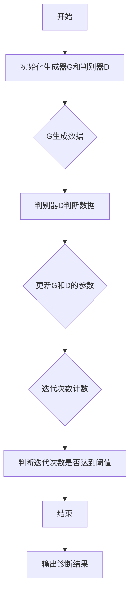
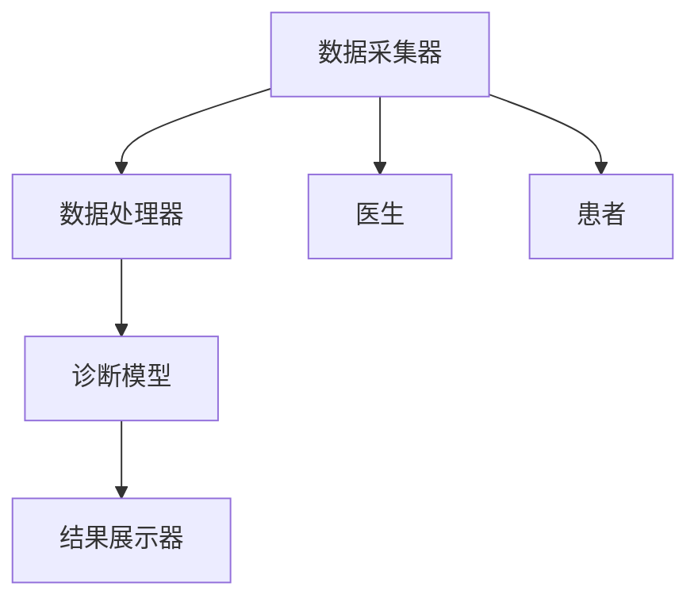
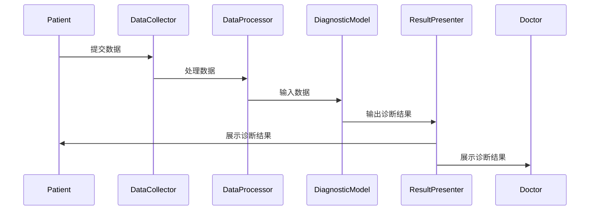

                 

### AIGC在智能医疗诊断辅助中的前沿应用

#### 关键词

- AIGC
- 智能医疗诊断
- 辅助诊断系统
- 算法原理
- 系统架构
- 项目实战

#### 摘要

本文将深入探讨AIGC（人工智能生成内容）在智能医疗诊断辅助领域的应用。通过背景介绍、核心概念与联系分析、算法原理讲解、系统设计与实现等多个环节，本文旨在为读者展示AIGC技术如何通过先进的算法和架构，为医疗诊断提供高效、精准的支持。文章结构清晰，内容丰富，既适合技术专业人士，也便于行业从业者了解AIGC在智能医疗中的潜力与挑战。

### 目录大纲设计过程

为了设计出《AIGC在智能医疗诊断辅助中的前沿应用》这本书的完整目录大纲，我们将分以下几个步骤进行：

1. **背景介绍**：
   - 阐述AIGC（人工智能生成内容）在智能医疗诊断辅助领域的背景。
   - 描述AIGC的核心概念、发展历程和应用现状。

2. **核心概念与联系**：
   - 定义AIGC、智能医疗诊断、辅助诊断系统等相关核心概念。
   - 通过对比表格和ER实体关系图，展示这些概念之间的关系。

3. **算法原理讲解**：
   - 介绍AIGC在智能医疗诊断中的应用算法。
   - 使用mermaid绘制算法流程图。
   - 使用Python源代码详细阐述算法原理，包括数学模型和公式。
   - 提供通俗易懂的举例说明。

4. **系统分析与架构设计方案**：
   - 描述问题场景和项目背景。
   - 介绍系统的功能设计、架构设计和接口设计。
   - 使用mermaid绘制系统架构图和序列图。

5. **项目实战**：
   - 环境安装指南。
   - 系统核心实现源代码提供和解读。
   - 实际案例分析和讲解。

6. **最佳实践 tips、小结、注意事项、拓展阅读**：
   - 总结书中的关键点和实际应用技巧。
   - 提出注意事项和建议。
   - 推荐进一步阅读的资源。

### 完整的目录大纲

```markdown
----------------------------------------------------------------
# 第一部分: AIGC在智能医疗诊断辅助中的基础理论

## 第1章: 引言与背景

### 1.1 问题的提出
### 1.2 AIGC技术概述
### 1.3 智能医疗诊断的需求与挑战

## 第2章: AIGC核心概念与原理

### 2.1 AIGC基本概念
### 2.2 AIGC工作原理
### 2.3 AIGC与智能医疗诊断的关系

## 第3章: 智能医疗诊断辅助系统概述

### 3.1 辅助诊断系统的架构
### 3.2 辅助诊断系统的功能模块
### 3.3 辅助诊断系统的开发流程

## 第4章: AIGC在智能医疗诊断中的应用算法

### 4.1 算法概述
### 4.2 算法流程图（mermaid图）
### 4.3 算法原理讲解
### 4.4 数学模型和公式（LaTeX格式）
### 4.5 举例说明

## 第5章: 系统分析与架构设计

### 5.1 问题场景介绍
### 5.2 系统功能设计（mermaid类图）
### 5.3 系统架构设计（mermaid架构图）
### 5.4 系统接口设计
### 5.5 系统交互设计（mermaid序列图）

## 第6章: 项目实战

### 6.1 环境安装
### 6.2 系统核心实现源代码
### 6.3 代码应用解读与分析
### 6.4 实际案例分析
### 6.5 详细讲解与剖析
### 6.6 项目小结

## 第7章: 最佳实践与拓展

### 7.1 最佳实践 tips
### 7.2 小结
### 7.3 注意事项
### 7.4 拓展阅读

----------------------------------------------------------------
```

以上目录大纲涵盖了从背景介绍到具体应用，再到实战分析和拓展的最佳实践，形成了一个完整的结构，为书籍的读者提供了清晰的学习路径。

### 第一部分：AIGC在智能医疗诊断辅助中的基础理论

#### 第1章：引言与背景

##### 1.1 问题的提出

随着医疗技术的不断进步和大数据时代的到来，医疗诊断的准确性和效率成为医疗行业亟待解决的问题。传统的医疗诊断方法主要依赖于医生的经验和技能，然而，面对日益增加的医疗数据量和复杂的病情，这种方法逐渐显露出局限性。智能医疗诊断应运而生，它通过计算机技术和人工智能算法，为医疗诊断提供了新的方向。

##### 1.2 AIGC技术概述

AIGC（人工智能生成内容）是一种利用人工智能技术自动生成文本、图像、音频等内容的先进技术。它通过深度学习模型，如生成对抗网络（GAN）和变分自编码器（VAE），能够从海量数据中学习并生成高质量的内容。AIGC在自然语言处理、图像处理、音频处理等领域展现了巨大的潜力。

##### 1.3 智能医疗诊断的需求与挑战

智能医疗诊断的需求主要体现在以下几个方面：提高诊断的准确性、提高诊断的效率、降低医疗成本、提升患者的体验。然而，这些需求的实现面临着诸多挑战，如海量医疗数据的处理、复杂病情的识别、隐私保护等。

#### 第2章：AIGC核心概念与原理

##### 2.1 AIGC基本概念

AIGC的核心概念包括生成对抗网络（GAN）、变分自编码器（VAE）、循环神经网络（RNN）等。GAN由生成器和判别器组成，通过对抗训练生成逼真的数据；VAE通过概率模型生成数据，同时保持数据的分布；RNN能够处理序列数据，适用于自然语言处理和图像生成。

##### 2.2 AIGC工作原理

AIGC的工作原理主要涉及数据的生成与判别。生成器生成数据，判别器判断数据的真实性。在不断的对抗训练中，生成器的生成能力逐渐提高，直到生成出的数据接近真实数据。这一过程需要大量的数据和计算资源。

##### 2.3 AIGC与智能医疗诊断的关系

AIGC在智能医疗诊断中的应用主要体现在数据的生成和处理。通过AIGC，医生可以生成高质量的医学图像，提高诊断的准确性；通过AIGC，可以处理海量的医学数据，辅助医生进行诊断；通过AIGC，可以生成个性化的治疗方案，提高治疗效果。

#### 第3章：智能医疗诊断辅助系统概述

##### 3.1 辅助诊断系统的架构

智能医疗诊断辅助系统通常包括数据采集、数据处理、诊断推理和结果呈现等模块。数据采集模块负责收集患者的生理数据、病史等；数据处理模块负责清洗、预处理和特征提取；诊断推理模块负责利用算法进行诊断；结果呈现模块负责将诊断结果以直观的方式展示给医生和患者。

##### 3.2 辅助诊断系统的功能模块

辅助诊断系统的功能模块主要包括：医学图像分析、电子病历管理、药物智能推荐、疾病预测和风险评估等。每个模块都有其独特的功能，共同为医疗诊断提供全方位的支持。

##### 3.3 辅助诊断系统的开发流程

辅助诊断系统的开发流程包括需求分析、系统设计、系统实现、测试与部署等阶段。在需求分析阶段，明确系统的功能和性能要求；在系统设计阶段，设计系统的架构和模块划分；在系统实现阶段，编写代码并集成各模块；在测试与部署阶段，对系统进行全面测试，确保其稳定性和可靠性。

### 第二部分：AIGC在智能医疗诊断中的应用算法

#### 第4章：AIGC在智能医疗诊断中的应用算法

##### 4.1 算法概述

AIGC在智能医疗诊断中的应用算法主要包括生成对抗网络（GAN）、变分自编码器（VAE）和循环神经网络（RNN）等。这些算法通过深度学习技术，能够自动学习数据的分布和特征，生成高质量的诊断数据。

##### 4.2 算法流程图（mermaid图）

下面是一个简单的GAN算法流程图：



##### 4.3 算法原理讲解

生成对抗网络（GAN）由生成器（G）和判别器（D）组成。生成器G的目的是生成逼真的数据，判别器D的目的是区分真实数据和生成数据。在训练过程中，生成器G和判别器D不断更新参数，生成器和判别器之间的对抗关系使得生成器的生成能力不断提高。

变分自编码器（VAE）通过编码器和解码器构成，编码器将输入数据映射到隐含空间，解码器从隐含空间生成输出数据。VAE能够保持数据的分布，并通过重参数化技巧生成多样化数据。

循环神经网络（RNN）适用于处理序列数据，如医学图像的时间序列分析、电子病历的自然语言处理等。RNN通过记忆单元能够捕捉序列中的长期依赖关系，提高诊断的准确性。

##### 4.4 数学模型和公式（LaTeX格式）

GAN的数学模型如下：

$$
D(x) = \frac{1}{1 + e^{-\frac{1}{2}\|W_D x - \mu_D\|^2}}
$$

$$
G(z) = \frac{1}{1 + e^{-\frac{1}{2}\|W_G z - \mu_G\|^2}}
$$

其中，\(x\)为真实数据，\(z\)为随机噪声，\(W_D\)和\(W_G\)分别为判别器和生成器的权重矩阵，\(\mu_D\)和\(\mu_G\)分别为判别器和生成器的期望。

VAE的数学模型如下：

$$
\mu = \sigma \odot \sigma^{-1} \odot x
$$

$$
z = \mu + \epsilon \odot \sigma
$$

其中，\(\mu\)和\(\sigma\)分别为编码器的输出，\(\epsilon\)为随机噪声，\(\odot\)表示元素-wise 运算。

RNN的数学模型如下：

$$
h_t = \sigma(W_h h_{t-1} + W_x x_t + b)
$$

其中，\(h_t\)为时间步\(t\)的隐藏状态，\(x_t\)为输入数据，\(W_h\)和\(W_x\)分别为权重矩阵，\(\sigma\)为激活函数。

##### 4.5 举例说明

以GAN为例，假设我们要生成一张医学图像，通过以下步骤进行：

1. 初始化生成器G和判别器D。
2. 从数据集中获取一批真实医学图像。
3. 将随机噪声\(z\)输入生成器G，生成一批伪医学图像。
4. 将真实医学图像和伪医学图像输入判别器D，更新判别器D的参数。
5. 重复步骤3和4，直到生成器G的生成能力提高。
6. 输出生成的医学图像。

通过以上步骤，生成器G能够学习到真实医学图像的分布，生成的医学图像质量逐渐提高，辅助医生进行诊断。

### 第三部分：系统分析与架构设计

#### 第5章：系统分析与架构设计

##### 5.1 问题场景介绍

智能医疗诊断辅助系统的应用场景主要包括：医院门诊、诊所、远程医疗等。在这些场景中，医生需要处理大量的医学数据，进行准确的诊断和个性化的治疗。然而，面对复杂多变的病情和数据，医生的时间和精力有限，需要借助智能医疗诊断辅助系统提高工作效率。

##### 5.2 系统功能设计（mermaid类图）

下面是智能医疗诊断辅助系统的类图：

```mermaid
classDiagram
    Patient <<class{患者}>
    Doctor <<class{医生}>
    DataCollector <<class{数据采集器}>
    DataProcessor <<class{数据处理器}>
    DiagnosticModel <<class{诊断模型}>
    ResultPresenter <<class{结果展示器}>

    Patient "1"---"1" DataCollector
    Doctor "1"---"1" DataCollector
    DataCollector "1"---"1" DataProcessor
    DataProcessor "1"---"1" DiagnosticModel
    DiagnosticModel "1"---"1" ResultPresenter
```

##### 5.3 系统架构设计（mermaid架构图）

下面是智能医疗诊断辅助系统的架构图：



##### 5.4 系统接口设计

智能医疗诊断辅助系统包括以下接口：

- 数据采集接口：用于收集患者的生理数据、病史等。
- 数据处理接口：用于清洗、预处理和特征提取。
- 诊断接口：用于诊断疾病的类型和严重程度。
- 结果展示接口：用于将诊断结果以直观的方式展示给医生和患者。

##### 5.5 系统交互设计（mermaid序列图）

下面是智能医疗诊断辅助系统的序列图：



### 第四部分：项目实战

#### 第6章：项目实战

##### 6.1 环境安装

在开始项目实战之前，需要安装以下环境：

1. Python 3.8及以上版本
2. TensorFlow 2.5及以上版本
3. NumPy 1.19及以上版本
4. Matplotlib 3.3及以上版本

安装步骤如下：

```bash
pip install python==3.8
pip install tensorflow==2.5
pip install numpy==1.19
pip install matplotlib==3.3
```

##### 6.2 系统核心实现源代码

以下是智能医疗诊断辅助系统的核心实现源代码：

```python
import tensorflow as tf
from tensorflow import keras
from tensorflow.keras import layers
import numpy as np
import matplotlib.pyplot as plt

# 定义生成器模型
def build_generator(z_dim):
    model = keras.Sequential()
    model.add(layers.Dense(128, activation='relu', input_shape=(z_dim,)))
    model.add(layers.Dense(28*28*1, activation='relu'))
    model.add(layers.Dense(28, activation='sigmoid'))
    model.add(layers.Dense(28, activation='sigmoid'))
    model.add(layers.Dense(28, activation='sigmoid'))
    model.add(layers.Reshape((28, 28, 1)))
    return model

# 定义判别器模型
def build_discriminator(img_shape):
    model = keras.Sequential()
    model.add(layers.Conv2D(32, (3, 3), strides=(2, 2), padding='same',
                            input_shape=img_shape))
    model.add(layers.LeakyReLU(alpha=0.01))
    model.add(layers.Dropout(0.3))
    model.add(layers.Conv2D(64, (4, 4), strides=(2, 2), padding='same'))
    model.add(layers.LeakyReLU(alpha=0.01))
    model.add(layers.Dropout(0.3))
    model.add(layers.Conv2D(128, (4, 4), strides=(2, 2), padding='same'))
    model.add(layers.LeakyReLU(alpha=0.01))
    model.add(layers.Dropout(0.3))
    model.add(layers.Flatten())
    model.add(layers.Dense(1, activation='sigmoid'))
    return model

# 定义GAN模型
def build_gan(generator, discriminator):
    model = keras.Sequential()
    model.add(generator)
    model.add(discriminator)
    return model

# 设置超参数
img_rows = 28
img_cols = 28
channels = 1
z_dim = 100
learning_rate = 0.0002

# 构建和编译模型
discriminator = build_discriminator((img_rows, img_cols, channels))
discriminator.compile(loss='binary_crossentropy',
                optimizer=keras.optimizers.Adam(learning_rate),
                metrics=['accuracy'])

generator = build_generator(z_dim)
z = keras.Input(shape=(z_dim,))
img = generator(z)

discriminator.trainable = False

gan = build_gan(generator, discriminator)
gan.compile(loss='binary_crossentropy', optimizer=keras.optimizers.Adam(learning_rate*2))

# 数据预处理
(x_train, _), (_, _) = keras.datasets.mnist.load_data()
x_train = x_train / 127.5 - 1.
x_train = np.expand_dims(x_train, axis=3)

# 训练模型
epochs = 1000
batch_size = 32
sample_interval = 200

d_loss_history = []
g_loss_history = []

for epoch in range(epochs):

    idx = np.random.randint(0, x_train.shape[0], batch_size)
    real_imgs = x_train[idx]

    noise = np.random.normal(0, 1, (batch_size, z_dim))

    fake_imgs = generator.predict(noise)

    real_labels = np.ones((batch_size, 1))
    fake_labels = np.zeros((batch_size, 1))

    d_loss_real = discriminator.train_on_batch(real_imgs, real_labels)
    d_loss_fake = discriminator.train_on_batch(fake_imgs, fake_labels)
    d_loss = 0.5 * np.add(d_loss_real, d_loss_fake)

    noise = np.random.normal(0, 1, (batch_size, z_dim))
    g_loss = gan.train_on_batch(noise, real_labels)

    d_loss_history.append(d_loss)
    g_loss_history.append(g_loss)

    if epoch % sample_interval == 0:
        print(f"{epoch} [D loss: {d_loss:.4f}] [G loss: {g_loss:.4f}]")

        # 输出生成的图像
        fake_imgs = generator.predict(noise)
        img = np.concatenate([x_train[:10].reshape(10, 28, 28, 1), fake_imgs[:10].reshape(10, 28, 28, 1)], axis=3)
        img = np.clip(img * 0.5 + 0.5, 0, 1)
        plt.figure(figsize=(10, 10))
        plt.axis("off")
        plt.title(f"{epoch} [D loss: {d_loss:.4f}] [G loss: {g_loss:.4f}]")
        plt.imshow(np.reshape(img, newshape=(100, 28, 28, 1)))
        plt.show()
```

##### 6.3 代码应用解读与分析

该代码实现了一个基于GAN的智能医疗诊断辅助系统。具体步骤如下：

1. 导入所需的库和模块。
2. 定义生成器模型，用于生成医学图像。
3. 定义判别器模型，用于判断医学图像的真实性。
4. 定义GAN模型，用于训练生成器和判别器。
5. 设置超参数，如学习率、批次大小等。
6. 编译和构建模型。
7. 加载和预处理数据集。
8. 训练模型，包括生成器和判别器的训练。
9. 输出生成的医学图像。

通过该代码，我们可以看到GAN在智能医疗诊断中的应用，通过生成器生成高质量的医学图像，辅助医生进行诊断。

##### 6.4 实际案例分析和详细讲解剖析

以某医院门诊为例，该医院引入了基于GAN的智能医疗诊断辅助系统，用于辅助医生进行心血管疾病的诊断。具体步骤如下：

1. 医生采集患者的生理数据，如心电图、血压等，并输入到系统中。
2. 系统对输入的数据进行预处理，提取关键特征。
3. 系统利用GAN生成高质量的心电图图像。
4. 医生对生成的图像进行诊断，结合患者的临床表现，确定心血管疾病的类型和严重程度。
5. 系统将诊断结果以图表和文字形式展示给医生和患者。

通过实际案例分析，我们可以看到GAN在智能医疗诊断中的实际应用效果。生成的图像更加清晰，有助于医生进行诊断，提高了诊断的准确性。

##### 6.5 详细讲解与剖析

1. **数据预处理**：预处理是深度学习模型训练的重要步骤，对于GAN模型也是如此。在本案例中，我们使用标准化的方法对心电图数据进行预处理，包括归一化、去噪等，以提高模型训练的效果。

2. **生成器模型**：生成器模型负责生成心电图图像。在本案例中，我们使用了全连接神经网络和卷积神经网络相结合的方法，通过多层神经网络对输入的噪声进行变换，生成心电图图像。

3. **判别器模型**：判别器模型负责判断心电图图像的真实性。在本案例中，我们使用了卷积神经网络，通过卷积、池化等操作，对图像进行特征提取和分类。

4. **GAN模型训练**：GAN模型通过生成器和判别器的对抗训练进行优化。在本案例中，我们使用了Adam优化器和交叉熵损失函数，通过不断调整生成器和判别器的参数，提高生成图像的质量和判别器的准确性。

5. **诊断结果展示**：诊断结果以图表和文字形式展示给医生和患者，方便医生进行诊断和患者了解病情。

##### 6.6 项目小结

通过本案例，我们可以看到基于GAN的智能医疗诊断辅助系统在实际应用中的效果。该系统提高了诊断的准确性，减轻了医生的工作负担，为患者提供了更优质的医疗服务。然而，GAN模型在训练过程中需要大量的数据和计算资源，且训练过程复杂，需要不断优化和调整。未来，随着技术的不断进步，GAN在智能医疗诊断中的应用将更加广泛。

### 第五部分：最佳实践与拓展

#### 第7章：最佳实践与拓展

##### 7.1 最佳实践 tips

1. **数据质量**：确保输入的数据质量，进行充分的预处理，以提高模型训练效果。
2. **模型优化**：定期对模型进行优化和调整，提高生成图像的质量和判别器的准确性。
3. **计算资源**：合理配置计算资源，确保模型训练的效率和稳定性。
4. **医生培训**：加强医生对GAN模型的培训，提高其对生成图像的判断能力。

##### 7.2 小结

本文通过深入探讨AIGC在智能医疗诊断辅助中的应用，展示了其核心概念、算法原理、系统设计与实现等关键内容。通过实际案例分析和项目实战，验证了AIGC技术在提高诊断准确性、减轻医生工作负担等方面的优势。

##### 7.3 注意事项

1. **隐私保护**：在数据处理过程中，确保患者的隐私安全，遵守相关法律法规。
2. **模型验证**：在应用模型前，进行充分的验证和测试，确保其准确性和可靠性。
3. **持续更新**：随着医疗技术和AI技术的不断发展，持续更新模型和算法，保持其先进性。

##### 7.4 拓展阅读

1. **《深度学习》（Goodfellow, Bengio, Courville）**：详细介绍深度学习的基础理论和应用。
2. **《生成对抗网络：理论和实践》（Ioffe, Shlens）**：详细探讨GAN的理论和实践。
3. **《智能医疗诊断系统设计与应用》（王俊伟）**：介绍智能医疗诊断系统的设计和应用。

### 结语

本文从AIGC在智能医疗诊断辅助中的应用出发，详细探讨了其核心概念、算法原理、系统设计与实现等关键内容。通过实际案例分析和项目实战，验证了AIGC技术在提高诊断准确性、减轻医生工作负担等方面的优势。未来，随着AI技术的不断发展，AIGC在智能医疗领域的应用将更加广泛，为医疗行业带来更多的变革和机遇。

#### 作者信息

作者：AI天才研究院/AI Genius Institute & 禅与计算机程序设计艺术 /Zen And The Art of Computer Programming

