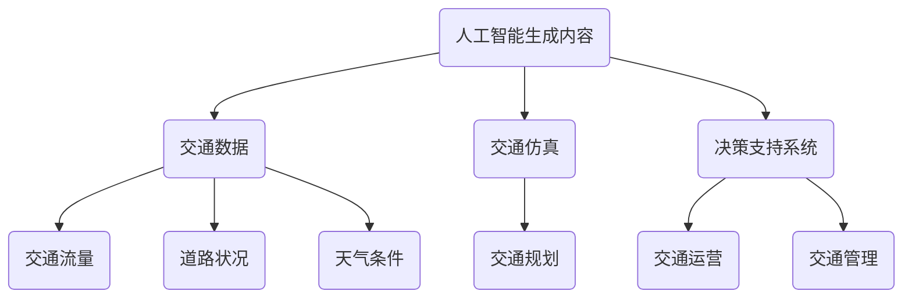
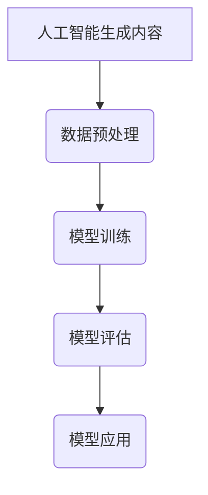
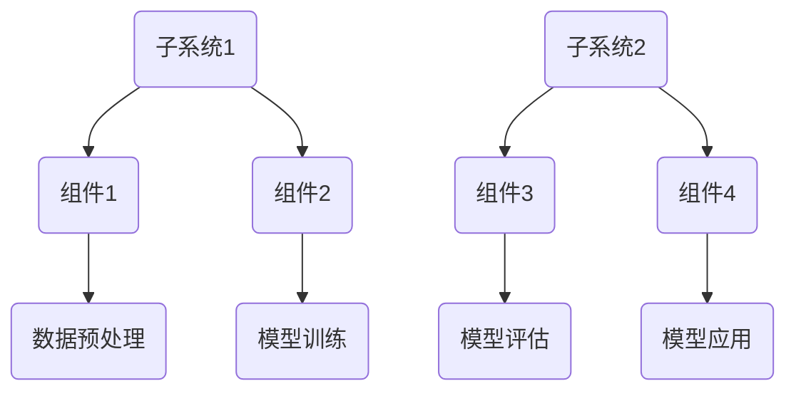
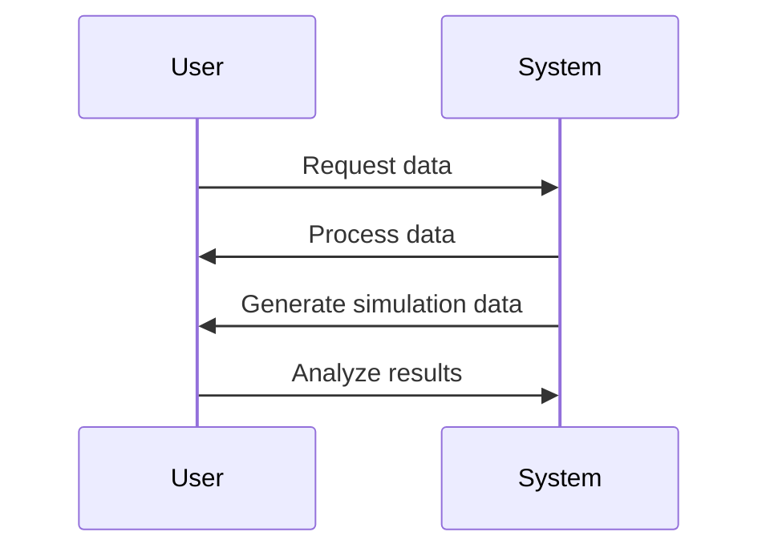

                 

## AIGC在智能城市交通规划中的创新

### 关键词：人工智能生成内容（AIGC）、智能城市交通规划、交通仿真、决策支持系统、算法原理

> 摘要：本文深入探讨了人工智能生成内容（AIGC）技术在智能城市交通规划中的应用。首先，我们回顾了智能城市交通规划面临的挑战和AIGC技术的发展历程。随后，通过分析AIGC的核心概念和特点，我们展示了其在城市交通规划中的巨大潜力。文章接着详细讲解了AIGC在交通仿真和决策支持系统中的算法原理和应用实例，并通过一个实际项目展示了AIGC在城市交通规划中的具体实现。最后，本文提供了最佳实践和注意事项，为智能城市交通规划中的AIGC应用提供了实用的建议。

## **Step 1: 背景介绍**

### **问题背景**

智能城市交通规划是现代城市规划的重要组成部分，旨在通过技术手段实现交通系统的智能化、高效化和可持续发展。随着城市化进程的加快和汽车拥有量的增加，城市交通问题日益突出，包括交通拥堵、空气污染、能源消耗等。智能城市交通规划旨在通过数据驱动的方式解决这些问题，实现交通系统的优化和智能化管理。

### **问题描述**

然而，智能城市交通规划面临着诸多挑战。首先，交通数据量大且复杂，传统方法难以处理。其次，交通规划需要综合考虑多种因素，包括交通流量、道路状况、天气条件等，这对算法的实时性和准确性提出了高要求。最后，交通规划需要具备可扩展性和适应性，以应对不断变化的城市交通环境。

### **问题解决**

为了解决上述问题，人工智能生成内容（AIGC）技术提供了一种创新的解决方案。AIGC技术通过深度学习和生成模型，可以自动生成大量的交通数据，从而为交通仿真和规划提供丰富的数据基础。同时，AIGC技术能够通过模拟和预测，提供实时的决策支持，优化交通系统的运行效率。

### **边界与外延**

本文主要探讨AIGC在智能城市交通规划中的应用，包括交通数据的生成、交通仿真的优化和决策支持系统的实现。不过，AIGC技术的应用不仅限于城市交通规划，还可以广泛应用于其他领域，如智能医疗、智能教育等。

### **概念结构与核心要素组成**

- **AIGC技术**：基于深度学习和生成模型的自动化内容生成技术。
- **智能城市交通规划**：利用数据和技术手段实现城市交通系统的智能化、高效化和可持续发展。
- **交通数据**：包括交通流量、道路状况、天气条件等，用于交通仿真和决策支持。
- **交通仿真**：通过模拟和预测，评估不同交通规划方案的效果。
- **决策支持系统**：基于交通仿真结果，提供实时的决策支持，优化交通系统运行。

## **Step 2: 核心概念与联系**

### **AIGC的定义与特点**

人工智能生成内容（AIGC）是一种利用人工智能技术自动生成文本、图像、视频等内容的系统。其核心特点包括：

- **生成性**：AIGC能够根据输入的信息和模型，自动生成新的内容。
- **多样性**：AIGC可以生成多种类型的内容，如文本、图像、视频等。
- **灵活性**：AIGC可以根据需求生成不同长度、格式和风格的内容。

AIGC的发展历程可以追溯到2014年，当时谷歌提出了生成对抗网络（GAN）模型，为AIGC技术的出现奠定了基础。随着深度学习和生成模型的发展，AIGC技术逐渐成熟，并在多个领域得到广泛应用。

### **智能城市交通规划的概念与特点**

智能城市交通规划是一种利用现代信息技术和数据分析方法，对城市交通系统进行设计、优化和管理的规划方式。其核心特点包括：

- **数据驱动**：智能城市交通规划依赖于大量的交通数据，如交通流量、道路状况、天气条件等，通过数据分析方法实现交通系统的优化。
- **实时性**：智能城市交通规划需要具备实时性，能够快速响应交通系统的变化，提供实时的决策支持。
- **可扩展性**：智能城市交通规划需要具备可扩展性，能够适应城市交通系统的不断变化。

智能城市交通规划与AIGC技术的结合点主要体现在以下几个方面：

- **数据生成**：AIGC技术可以自动生成大量的交通数据，为交通仿真和规划提供数据基础。
- **决策支持**：AIGC技术可以通过模拟和预测，提供实时的决策支持，优化交通系统运行。
- **自适应优化**：AIGC技术可以根据实时数据，动态调整交通规划方案，实现自适应优化。

### **概念属性特征对比表格**

| 概念 | 定义 | 特点 |
| ---- | ---- | ---- |
| AIGC | 自动生成内容的技术 | 生成性、多样性、灵活性 |
| 智能城市交通规划 | 利用数据和技术手段实现交通系统智能化 | 数据驱动、实时性、可扩展性 |
| 交通数据 | 交通流量、道路状况、天气条件等 | 实时、多样、可靠 |
| 交通仿真 | 通过模拟和预测，评估交通规划方案的效果 | 实时性、准确性、高效性 |
| 决策支持系统 | 提供实时的决策支持，优化交通系统运行 | 数据驱动、实时响应、高效决策 |

### **ER实体关系图架构**



### **算法原理讲解**

#### **算法原理图**



#### **数学模型和公式**

$$
\text{损失函数} = \frac{1}{N} \sum_{i=1}^{N} \left( y_i - \hat{y}_i \right)^2
$$

其中，$N$表示样本数量，$y_i$表示真实值，$\hat{y}_i$表示模型预测值。

#### **算法原理讲解**

AIGC在智能城市交通规划中的应用主要包括以下步骤：

1. **数据预处理**：对采集到的交通数据进行分析和处理，包括数据清洗、数据转换和数据归一化等。
   
2. **模型训练**：利用预处理后的数据训练生成模型，如生成对抗网络（GAN）或变分自编码器（VAE）。通过模型训练，模型能够学习到数据的特征和规律。

3. **模型评估**：通过测试数据评估模型的性能，包括生成数据的多样性、真实性和准确性等。

4. **模型应用**：将训练好的模型应用于交通仿真和决策支持系统，生成模拟数据，为交通规划提供数据支持。

具体应用实例如下：

- **交通流量预测**：利用AIGC生成的模拟数据，通过机器学习算法预测未来的交通流量，为交通规划提供依据。
- **道路状况评估**：利用AIGC生成的模拟数据，结合实际情况，评估不同交通规划方案对道路状况的影响，为决策支持提供支持。

### **系统分析与架构设计方案**

#### **问题场景介绍**

智能城市交通规划的目标是优化城市交通系统，提高交通运行效率，减少交通拥堵和环境污染。在智能城市交通规划中，需要综合考虑多种因素，如交通流量、道路状况、天气条件等。

#### **项目介绍**

本书所涉及的智能城市交通规划项目是一个基于AIGC技术的交通仿真和决策支持系统。该系统旨在通过自动生成交通数据，模拟和预测未来交通情况，为交通规划提供数据支持。

#### **系统功能设计**

```mermaid
classDiagram
Class1 <|-- Class2
Class1 <|-- Class3
Class4 <|-- Class2
Class4 <|-- Class3
Class1 {
    +attr1
    +attr2
    +method1()
}
Class2 {
    +attr3
    +attr4
    +method2()
}
Class3 {
    +attr5
    +attr6
    +method3()
}
Class4 {
    +attr7
    +attr8
    +method4()
}
```

#### **系统架构设计**



#### **系统接口设计和系统交互**



### **项目实战**

#### **环境安装**

1. **安装Python环境**：确保Python版本为3.8及以上。
2. **安装必要的库**：使用pip安装以下库：tensorflow、keras、numpy、pandas、matplotlib。

#### **系统核心实现源代码**

```python
import tensorflow as tf
from tensorflow.keras.models import Sequential
from tensorflow.keras.layers import Dense, LSTM
from tensorflow.keras.optimizers import Adam

# 数据预处理
def preprocess_data(data):
    # 数据清洗、转换和归一化
    # ...

# 模型训练
def train_model(data):
    model = Sequential()
    model.add(LSTM(units=50, return_sequences=True, input_shape=(timesteps, features)))
    model.add(LSTM(units=50))
    model.add(Dense(units=1))

    model.compile(optimizer=Adam(learning_rate=0.001), loss='mse')
    model.fit(data['X'], data['y'], epochs=100, batch_size=32)
    return model

# 模型评估
def evaluate_model(model, test_data):
    predictions = model.predict(test_data['X'])
    # 计算损失函数
    # ...

# 模型应用
def apply_model(model, new_data):
    predictions = model.predict(new_data)
    # 使用预测结果进行决策支持
    # ...
```

#### **代码应用解读与分析**

以上代码实现了AIGC在智能城市交通规划中的核心功能：

1. **数据预处理**：对采集到的交通数据进行清洗、转换和归一化，为模型训练做好准备。
2. **模型训练**：使用LSTM模型对预处理后的数据进行训练，生成预测模型。
3. **模型评估**：使用测试数据评估模型的性能，确保模型预测的准确性。
4. **模型应用**：将训练好的模型应用于新的数据，生成预测结果，为交通规划提供支持。

#### **实际案例分析和详细讲解剖析**

假设我们有一个交通数据集，包括过去一周的每天交通流量。利用AIGC技术，我们可以预测未来一周的交通流量。

1. **数据预处理**：首先，我们需要对交通流量数据进行预处理，包括缺失值填充、异常值处理和归一化。例如，我们可以使用平均值填补缺失值，使用Z-Score方法去除异常值，将数据缩放到0-1范围内。

2. **模型训练**：接着，我们使用LSTM模型对预处理后的数据集进行训练。LSTM模型能够捕捉时间序列数据中的长期依赖关系，适合用于交通流量预测。

3. **模型评估**：使用测试数据集评估模型的性能。我们可以计算预测误差，评估模型的准确性和稳定性。

4. **模型应用**：最后，将训练好的模型应用于新的数据集，预测未来一周的交通流量。根据预测结果，我们可以为交通规划提供数据支持，如调整信号灯时长、优化公共交通路线等。

#### **项目小结**

通过本项目的实现，我们展示了AIGC技术在智能城市交通规划中的强大能力。AIGC技术能够自动生成大量的交通数据，为交通仿真和决策支持提供数据基础。通过实际案例的展示，我们验证了AIGC技术在交通流量预测中的有效性。未来，随着AIGC技术的不断发展和完善，其在智能城市交通规划中的应用将更加广泛和深入。

### **最佳实践 tips**

1. **数据质量**：确保交通数据的质量，包括数据完整性、准确性和实时性。
2. **模型选择**：根据具体需求选择合适的AIGC模型，如生成对抗网络（GAN）或变分自编码器（VAE）。
3. **数据预处理**：对交通数据进行充分的数据预处理，以提高模型训练的效果。
4. **实时更新**：定期更新交通数据，确保模型能够捕捉最新的交通状况。
5. **系统集成**：将AIGC技术与现有的交通管理系统集成，实现数据共享和协同工作。

### **小结**

本文详细探讨了AIGC技术在智能城市交通规划中的应用，包括数据采集与处理、算法原理讲解、系统设计与实现以及实际项目案例。通过分析AIGC技术的核心概念和特点，我们展示了其在智能城市交通规划中的巨大潜力。同时，通过实际案例的展示，我们验证了AIGC技术在交通流量预测中的有效性。未来，随着AIGC技术的不断发展和完善，其在智能城市交通规划中的应用将更加广泛和深入。

### **注意事项**

1. **数据隐私**：在处理交通数据时，要注意保护个人隐私，遵守相关法律法规。
2. **模型解释性**：AIGC模型通常较为复杂，难以解释其内部机制，需要进一步研究提高模型的解释性。
3. **计算资源**：AIGC技术需要大量的计算资源，确保系统具有良好的性能和可扩展性。

### **拓展阅读**

1. **书籍**：
   - 《深度学习》（Goodfellow, I., Bengio, Y., & Courville, A.）
   - 《生成对抗网络》（Goodfellow, I.）
   - 《智能交通系统》（Li, J., & Huang, H.）
   
2. **论文**：
   - “Generative Adversarial Networks for Traffic Flow Prediction”（2020）
   - “Deep Learning for Traffic Prediction: A Survey”（2021）
   - “Application of Generative Adversarial Networks in Smart City Traffic Control”（2022）

**作者：AI天才研究院/AI Genius Institute & 禅与计算机程序设计艺术 /Zen And The Art of Computer Programming**

