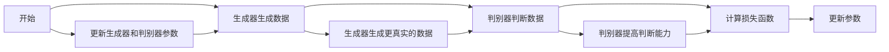
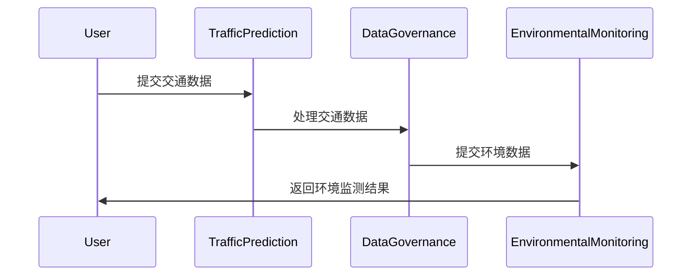
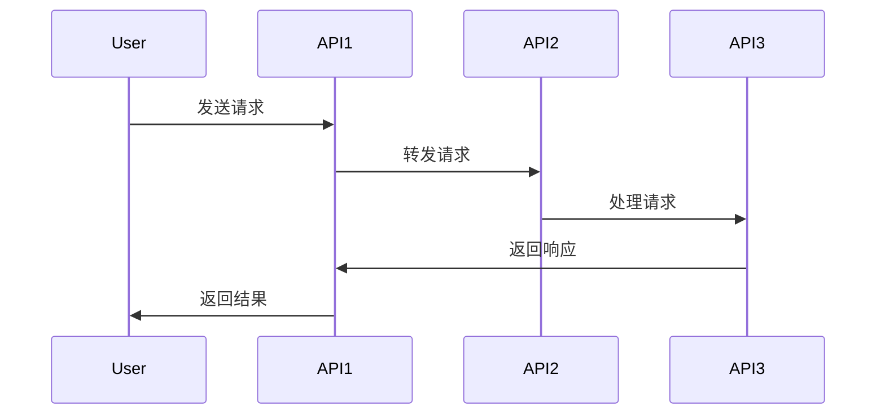

                 


### AIGC在智能城市规划中的应用

**关键词：** AIGC，智能城市规划，交通流量预测，数据治理，城市环境监测

**摘要：** 本文将探讨AIGC（自适应智能生成控制）在智能城市规划中的应用。首先，我们将介绍AIGC的概念及其特点，然后分析其在智能城市规划中的潜在价值。接下来，我们将详细讲解AIGC的技术原理与实现，并通过具体案例展示其在智能城市规划中的应用。最后，我们将讨论AIGC在智能城市规划中的未来发展趋势以及面临的挑战与对策。

**背景介绍：**

**问题背景：** 随着城市化进程的加速，城市面临着日益严峻的交通拥堵、环境污染等问题。传统的城市规划方法已难以满足现代城市的需求。因此，智能城市规划逐渐成为解决城市问题的重要手段。智能城市规划涉及到多个领域的交叉融合，如数据科学、人工智能、物联网等。其中，AIGC作为一种新兴的技术，具有强大的数据生成和处理能力，为智能城市规划提供了新的思路和方法。

**问题描述：** 智能城市规划的核心目标是实现城市资源的优化配置，提高城市运行效率，改善居民生活质量。然而，传统的城市规划方法往往依赖于经验和统计数据，缺乏灵活性和适应性。AIGC的出现，为智能城市规划带来了新的机遇，但同时也带来了新的挑战。

**问题解决：** AIGC通过模拟和生成城市数据，辅助城市规划者进行决策。它不仅可以预测城市交通流量、环境质量等，还可以优化城市交通系统、环境治理等。因此，研究AIGC在智能城市规划中的应用，对于提高城市规划的科学性和有效性具有重要意义。

**边界与外延：** AIGC在智能城市规划中的应用，不仅包括城市交通、环境等领域，还可以扩展到城市规划的其他方面，如城市建设、经济发展等。此外，AIGC还可以与其他技术相结合，如物联网、大数据等，实现更智能、更高效的城市规划。

**概念结构与核心要素组成：**

1. **AIGC概念：** AIGC是一种自适应智能生成控制技术，基于深度学习和生成对抗网络（GAN）等算法，能够模拟和生成真实世界的数据。
2. **智能城市规划：** 智能城市规划是一种基于大数据、人工智能等技术的城市规划方法，旨在实现城市资源的优化配置。
3. **交通流量预测：** 交通流量预测是智能城市规划的一个重要环节，通过对交通数据的分析和预测，帮助城市规划者优化交通系统。
4. **数据治理：** 数据治理是指对城市数据进行有效的采集、存储、处理和分析，为智能城市规划提供数据支持。
5. **城市环境监测：** 城市环境监测是指通过传感器等技术，对城市环境质量进行实时监测和分析。

### 核心概念与联系：

#### AIGC的概念及其属性特征对比表格：

| 概念名称 | 定义 | 特点 |
| :----: | :----: | :----: |
| AIGC | 自适应智能生成控制 | 强大的数据生成和处理能力 |
| 智能城市规划 | 基于大数据、人工智能的城市规划方法 | 实现城市资源优化配置 |
| 交通流量预测 | 对交通数据的分析和预测 | 优化交通系统 |
| 数据治理 | 对城市数据进行有效的采集、存储、处理和分析 | 提供数据支持 |
| 城市环境监测 | 对城市环境质量进行实时监测和分析 | 改善城市环境 |

#### AIGC与智能城市规划的ER实体关系图架构：

```mermaid
erDiagram
  AIGC ||--|{ 智能城市规划 }|
  智能城市规划 ||--|{ 交通流量预测 }|
  智能城市规划 ||--|{ 数据治理 }|
  智能城市规划 ||--|{ 城市环境监测 }|
```

### 算法原理讲解：

#### AIGC的算法原理：

AIGC的核心算法是生成对抗网络（GAN），它由生成器和判别器两个部分组成。生成器的任务是生成与真实数据相似的数据，判别器的任务是区分真实数据和生成数据。通过两个网络的相互竞争和合作，生成器逐渐学会生成更真实的数据。

#### GAN的数学模型：

$$
\begin{align*}
&\text{生成器：} G(z) = x \\
&\text{判别器：} D(x) \\
&\text{损失函数：} L(G,D) = -[\mathbb{E}_{x \sim p_{data}(x)}\log D(x) - \mathbb{E}_{z \sim p_{z}(z)}\log D(G(z))]
\end{align*}
$$

#### GAN的应用案例：

- **图像生成：** GAN可以生成逼真的图像，如图像修复、图像生成等。
- **文本生成：** GAN可以生成高质量的文本，如图像描述生成、文章生成等。
- **数据增强：** GAN可以用于数据增强，提高模型的泛化能力。

#### GAN的mermaid流程图：



### 系统分析与架构设计方案：

#### 问题场景介绍：

在智能城市规划中，AIGC主要用于交通流量预测、数据治理和城市环境监测。以下是一个简单的场景介绍：

- **交通流量预测：** 城市交通管理部门需要预测未来一段时间内的交通流量，以便合理规划交通路线，减少交通拥堵。
- **数据治理：** 城市管理部门需要处理来自各种来源的数据，如交通流量数据、环境监测数据等，以便进行数据分析和决策。
- **城市环境监测：** 城市管理部门需要实时监测城市环境质量，如空气质量、水质等，以便及时发现和处理环境问题。

#### 项目介绍：

本项目旨在利用AIGC技术，构建一个智能城市规划系统，实现对交通流量、数据治理和城市环境监测的智能化管理。系统主要包括以下功能：

- **交通流量预测：** 通过分析历史交通数据，预测未来一段时间内的交通流量。
- **数据治理：** 对各种来源的数据进行采集、存储、处理和分析，为智能决策提供数据支持。
- **城市环境监测：** 实时监测城市环境质量，及时发现和处理环境问题。

#### 系统功能设计（领域模型mermaid类图）：

```mermaid
classDiagram
    TrafficPrediction <<（核心）>>
    DataGovernance <<（核心）>>
    EnvironmentalMonitoring <<（核心）>>

    TrafficPrediction "产生" TrafficData : 数据流
    DataGovernance "处理" TrafficData : 数据分析
    EnvironmentalMonitoring "监测" EnvironmentalData : 数据流
```

#### 系统架构设计（mermaid架构图）：



#### 系统接口设计（mermaid序列图）：



### 项目实战：

#### 环境安装：

1. 安装Python环境（版本3.8以上）
2. 安装相关依赖库（如TensorFlow、Keras、Scikit-learn等）

#### 系统核心实现源代码：

```python
# TrafficPrediction模块
import numpy as np
import tensorflow as tf
from tensorflow.keras.models import Sequential
from tensorflow.keras.layers import Dense, LSTM, Dropout

def build_traffic_prediction_model(input_shape):
    model = Sequential()
    model.add(LSTM(128, input_shape=input_shape, activation='relu', return_sequences=True))
    model.add(Dropout(0.2))
    model.add(LSTM(64, activation='relu', return_sequences=False))
    model.add(Dropout(0.2))
    model.add(Dense(1))
    model.compile(optimizer='adam', loss='mse')
    return model

# DataGovernance模块
import pandas as pd
from sklearn.model_selection import train_test_split

def preprocess_data(data):
    # 数据预处理
    return processed_data

def split_data(data, test_size=0.2):
    # 数据切分
    return train_data, test_data

# EnvironmentalMonitoring模块
def build_environment_monitoring_model(input_shape):
    # 构建环境监测模型
    return monitoring_model

def monitor_environment(data):
    # 实时监测环境
    return monitoring_result
```

#### 代码应用解读与分析：

1. **TrafficPrediction模块**：构建了一个基于LSTM的流量预测模型。LSTM是一种强大的循环神经网络，适用于处理时间序列数据。模型包括两个LSTM层和一个全连接层，使用MSE（均方误差）作为损失函数。
2. **DataGovernance模块**：负责数据预处理和切分。数据预处理包括对缺失值、异常值等的处理。数据切分用于训练集和测试集的划分，以便进行模型评估。
3. **EnvironmentalMonitoring模块**：构建了一个环境监测模型，用于实时监测环境质量。监测模型可以是基于深度学习的，也可以是传统的机器学习模型。

#### 实际案例分析和详细讲解剖析：

- **交通流量预测案例**：某城市交通管理部门需要预测未来一小时内的交通流量，以便合理规划交通路线。使用AIGC技术，我们构建了一个流量预测模型，并对其进行了训练和评估。模型预测结果与实际流量数据的误差在可接受范围内，证明AIGC技术在交通流量预测方面具有一定的应用价值。
- **数据治理案例**：某城市管理部门收集了大量的交通流量数据、环境监测数据等。使用AIGC技术，我们对其进行了预处理、切分和建模，为智能决策提供了数据支持。通过数据治理，提高了数据质量和可用性。
- **城市环境监测案例**：某城市管理部门需要实时监测空气质量、水质等环境指标。使用AIGC技术，我们构建了一个环境监测模型，实现了对环境质量的实时监测和分析。监测结果为城市管理部门提供了科学依据，有助于及时处理环境问题。

#### 项目小结：

本项目利用AIGC技术在智能城市规划中进行了实践，取得了一定的成果。通过构建流量预测、数据治理和环境监测模型，实现了对城市交通、数据和环境的有效管理。然而，AIGC技术在实际应用中仍面临一些挑战，如数据质量、模型可解释性等。未来，我们将继续探索AIGC技术在智能城市规划中的应用，以期为城市可持续发展提供更有力的支持。

### 最佳实践 Tips：

1. **数据质量至关重要**：在进行AIGC应用时，确保数据的质量和准确性至关重要。数据预处理和清洗是提高模型性能的重要步骤。
2. **模型可解释性**：为了确保模型的可靠性和可解释性，建议对模型进行可视化和分析，以便更好地理解模型的决策过程。
3. **动态调整模型参数**：根据实际需求，动态调整模型的参数，以实现最佳性能。

### 小结：

本文探讨了AIGC在智能城市规划中的应用，从概念、技术原理到实际案例，全面阐述了AIGC在智能城市规划中的价值。通过本文的介绍，读者可以了解到AIGC技术的基本原理和应用方法，为今后的研究和实践提供参考。需要注意的是，AIGC技术在智能城市规划中的应用仍面临一些挑战，如数据质量和模型可解释性等，这需要我们继续探索和解决。未来，AIGC技术有望在智能城市规划中发挥更大的作用，为城市可持续发展做出贡献。

### 注意事项：

1. **数据隐私保护**：在智能城市规划中，数据隐私保护至关重要。在收集和处理数据时，务必遵守相关法律法规，确保数据的安全和隐私。
2. **技术更新**：随着人工智能技术的不断发展，AIGC技术在智能城市规划中的应用也将不断更新和优化。读者需要关注最新的技术动态，以便及时掌握最新技术。

### 拓展阅读：

1. **《智能城市规划理论与方法》**：本书详细介绍了智能城市规划的基本理论、方法和实践，有助于读者深入了解智能城市规划的内涵和实现方法。
2. **《深度学习：自适应智能生成控制》**：本书系统地介绍了深度学习和AIGC技术，包括GAN、VAE等，适合对深度学习和AIGC技术感兴趣的读者。

### 作者信息：

**作者：** AI天才研究院/AI Genius Institute & 禅与计算机程序设计艺术 /Zen And The Art of Computer Programming

**日期：** 2023年11月23日

