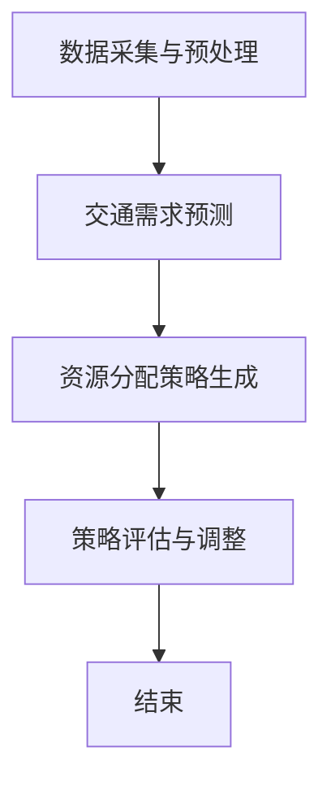
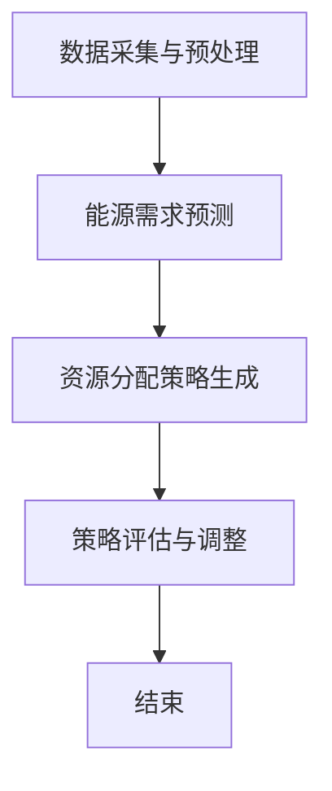
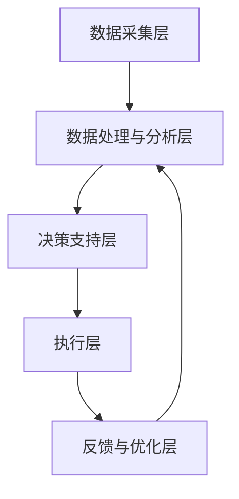

                 

### AIGC在智能城市资源分配中的应用

#### 关键词：AIGC、智能城市、资源分配、算法、应用案例

#### 摘要：
本文将探讨AIGC（自适应智能生成计算）在智能城市资源分配中的应用。首先，我们将介绍AIGC的概念、背景和核心技术。接着，深入探讨智能城市资源分配的核心概念、原理和应用。随后，我们将详细分析AIGC在智能城市交通和能源资源分配中的具体应用，通过算法原理讲解、实际案例分析和最佳实践来展示AIGC在智能城市建设中的巨大潜力。

## 第一部分：AIGC基础

### 第1章：AIGC概述

#### 1.1 AIGC的概念与背景

##### 1.1.1 AIGC的定义
AIGC（自适应智能生成计算）是一种基于人工智能和自动化学术的技术，通过模型和算法的迭代优化，实现数据生成、内容创作和智能决策等目标。它综合了自然语言处理（NLP）、深度学习、生成对抗网络（GAN）等多种技术，旨在提高数据处理和智能化的效率。

##### 1.1.2 AIGC的发展背景
AIGC技术的发展源于大数据和人工智能的兴起。随着互联网和信息技术的快速发展，大量数据生成和内容创作需求催生了AIGC的诞生。此外，机器学习和深度学习技术的突破为AIGC提供了强大的算法支撑，使得AIGC能够高效地处理海量数据并生成高质量的内容。

##### 1.1.3 AIGC的核心技术
AIGC的核心技术包括：
- **自然语言处理（NLP）**：用于理解和生成人类语言。
- **深度学习**：通过神经网络模型来学习数据特征和规律。
- **生成对抗网络（GAN）**：用于生成高质量的数据和图像。
- **自适应算法**：通过不断优化算法模型，提高生成内容和决策的准确性。

#### 1.2 AIGC的应用领域

##### 1.2.1 智能城市资源分配
AIGC在智能城市资源分配中的应用主要集中在交通、能源和环境等领域。通过实时数据分析和智能决策，AIGC可以帮助优化交通流量、提高能源利用效率和改善环境质量。

##### 1.2.2 智能交通系统
AIGC在智能交通系统中可以用于路线规划、交通信号控制和车辆调度等。通过实时数据分析和预测，AIGC可以优化交通流量，减少拥堵和事故发生。

##### 1.2.3 智能能源管理
AIGC在智能能源管理中可以用于电力负荷预测、能源分配和需求响应等。通过实时数据和智能算法，AIGC可以优化能源使用，提高能源利用效率和减少能源浪费。

#### 1.3 AIGC的挑战与未来趋势

##### 1.3.1 AIGC的挑战
AIGC在智能城市资源分配中的应用面临以下挑战：
- **数据隐私和安全性**：大量敏感数据的处理和存储需要保障数据的安全性和隐私性。
- **计算资源消耗**：AIGC模型的训练和推理需要大量的计算资源和时间。
- **算法透明性和可解释性**：确保算法的决策过程是可解释和透明的，以提高用户对算法的信任。

##### 1.3.2 AIGC的未来发展趋势
随着人工智能技术的不断进步，AIGC在智能城市资源分配中的应用将呈现出以下趋势：
- **更高效的数据处理和生成**：通过优化算法和模型，提高数据处理和内容生成的效率。
- **更广泛的应用领域**：随着技术的成熟，AIGC将在更多的领域得到应用，如医疗、金融和制造等。
- **更智能的决策支持**：通过集成更多的数据和算法，提供更准确和智能的决策支持。

#### 1.4 本章小结
本章节介绍了AIGC的基本概念、背景、核心技术以及应用领域。通过本章的学习，读者可以了解到AIGC在智能城市资源分配中的巨大潜力，为后续章节的深入学习打下基础。

## 第二部分：智能城市资源分配中的应用

### 第2章：智能城市资源分配的核心概念

#### 2.1 资源分配的基本原理

##### 2.1.1 资源分配的定义
资源分配是指将有限的资源（如时间、能源、资金、人力等）合理地分配到各个需求点上，以满足各种需求的过程。在智能城市中，资源分配的目标是优化资源的利用效率，提高城市的服务质量和居民的生活水平。

##### 2.1.2 资源分配的目标
智能城市资源分配的目标包括：
- **优化资源利用效率**：通过合理的资源分配，减少资源浪费，提高资源利用效率。
- **提高服务质量**：通过优化资源分配，提高城市各项服务的质量和效率，满足居民的需求。
- **提升居民生活质量**：通过合理的资源分配，提高居民的生活舒适度和幸福感。

##### 2.1.3 资源分配的挑战
智能城市资源分配面临以下挑战：
- **数据多样性和复杂性**：智能城市涉及大量不同的数据源，数据类型多样且复杂，如何有效地整合和分析这些数据是一个挑战。
- **实时性和动态性**：智能城市中的资源需求是实时和动态的，如何实时地响应和调整资源分配策略是一个挑战。
- **安全性和隐私性**：智能城市中涉及大量的敏感数据，如何保障数据的安全性和隐私性是一个挑战。

#### 2.2 AIGC在资源分配中的作用

##### 2.2.1 AIGC的优势
AIGC在智能城市资源分配中具有以下优势：
- **高效的数据处理和生成**：AIGC可以通过深度学习和生成对抗网络等技术，高效地处理和生成大量数据，为资源分配提供实时和准确的数据支持。
- **智能的决策支持**：AIGC可以通过自适应算法和智能决策模型，实时地分析数据和预测资源需求，提供智能的决策支持，优化资源分配。
- **灵活的适应能力**：AIGC可以根据不同的城市需求和资源特点，灵活地调整和优化资源分配策略，提高资源利用效率和服务质量。

##### 2.2.2 AIGC在资源分配中的具体应用
AIGC在智能城市资源分配中的具体应用包括：
- **交通资源分配**：通过实时交通数据分析和预测，AIGC可以优化交通信号控制和车辆调度，减少交通拥堵和事故发生。
- **能源资源分配**：通过实时能源数据分析和预测，AIGC可以优化电力负荷预测和能源分配，提高能源利用效率和减少能源浪费。
- **水资源分配**：通过实时水资源数据分析和预测，AIGC可以优化水资源分配和调度，提高水资源利用效率和保护水资源。

#### 2.3 资源分配的相关概念与联系

##### 2.3.1 相关概念介绍
智能城市资源分配涉及以下相关概念：
- **资源需求**：指城市各项服务对资源的需求，包括交通、能源、水资源等。
- **资源供应**：指城市各项服务所需的资源供应，包括交通设施、能源设施、水资源设施等。
- **资源利用效率**：指资源利用的效率，包括资源的利用率、周转率、损耗率等。
- **资源分配策略**：指根据资源需求和资源供应，制定的资源分配策略，包括实时调度策略、优先级策略等。

##### 2.3.2 概念属性特征对比表格
| 概念 | 属性特征 |
| ---- | ---- |
| 资源需求 | 实时性、动态性、多样性 |
| 资源供应 | 稳定性、可靠性、可持续性 |
| 资源利用效率 | 高效性、经济性、可持续性 |
| 资源分配策略 | 智能性、灵活性、适应性 |

##### 2.3.3 ER实体关系图
```mermaid
erDiagram
  ResourceAllocation ||--|{ ResourceDemand }
  ResourceAllocation ||--|{ ResourceSupply }
  ResourceAllocation ||--|{ ResourceUtilizationEfficiency }
  ResourceAllocation ||--|{ ResourceAllocationStrategy }
```

#### 2.4 本章小结
本章节介绍了智能城市资源分配的核心概念、原理和AIGC在其中的作用。通过本章的学习，读者可以了解到智能城市资源分配的基本原理和AIGC在其中的应用优势，为后续章节的深入学习打下基础。

### 第3章：AIGC在智能城市交通资源分配中的应用

#### 3.1 智能交通资源分配的原理

##### 3.1.1 智能交通资源分配的目标
智能交通资源分配的目标是优化交通资源的利用效率，提高交通服务的质量和效率。具体目标包括：
- **减少交通拥堵**：通过优化交通信号控制和车辆调度，减少交通拥堵，提高道路通行能力。
- **降低交通事故率**：通过实时交通数据分析和预测，提高交通信号控制和车辆调度策略的准确性，降低交通事故率。
- **提高公共交通效率**：通过优化公共交通线路和班次安排，提高公共交通的效率和便利性，吸引更多居民使用公共交通工具。

##### 3.1.2 智能交通资源分配的挑战
智能交通资源分配面临以下挑战：
- **数据多样性**：智能交通系统涉及多种类型的数据，如车辆位置数据、道路流量数据、交通信号状态数据等，如何整合和分析这些数据是一个挑战。
- **实时性和动态性**：智能交通资源需求是实时和动态的，如何实时地响应和调整资源分配策略是一个挑战。
- **算法复杂性**：智能交通资源分配需要复杂的算法模型，如何设计高效和准确的算法模型是一个挑战。

##### 3.1.3 AIGC在交通资源分配中的作用
AIGC在智能交通资源分配中具有以下作用：
- **高效的数据处理**：AIGC可以通过深度学习和生成对抗网络等技术，高效地处理和生成交通数据，为交通资源分配提供实时和准确的数据支持。
- **智能的决策支持**：AIGC可以通过自适应算法和智能决策模型，实时地分析交通数据和预测交通需求，提供智能的决策支持，优化交通资源分配。
- **灵活的适应能力**：AIGC可以根据不同的交通需求和资源特点，灵活地调整和优化交通资源分配策略，提高交通资源利用效率和服务质量。

#### 3.2 智能交通资源分配的算法原理

##### 3.2.1 算法概述
智能交通资源分配的算法通常包括以下几个步骤：
1. **数据采集与预处理**：采集交通数据，包括车辆位置数据、道路流量数据、交通信号状态数据等，并进行数据清洗和预处理。
2. **交通需求预测**：利用AIGC模型，对交通数据进行分析和预测，得到未来的交通需求。
3. **资源分配策略生成**：根据预测的交通需求，生成最优的资源分配策略，包括交通信号控制策略、车辆调度策略等。
4. **策略评估与调整**：评估生成的资源分配策略，并根据评估结果进行策略调整和优化。

##### 3.2.2 算法mermaid流程图


##### 3.2.3 算法原理讲解
智能交通资源分配算法的核心是交通需求预测和资源分配策略生成。以下是一个简化的算法原理讲解：

1. **数据采集与预处理**：
   - 采集交通数据，包括车辆位置数据、道路流量数据、交通信号状态数据等。
   - 对采集到的数据进行分析，去除噪声和不完整的数据。
   - 标准化数据格式，以便后续处理。

2. **交通需求预测**：
   - 利用AIGC模型，如长短期记忆网络（LSTM）或生成对抗网络（GAN），对交通数据进行分析和预测。
   - 根据历史交通数据，预测未来的交通流量和交通状态。

3. **资源分配策略生成**：
   - 根据预测的交通需求，生成最优的资源分配策略。
   - 例如，通过优化交通信号控制策略，调整交通信号灯的时长和相位，以减少交通拥堵。
   - 利用智能调度算法，优化公共交通线路和班次安排，提高公共交通的效率和便利性。

4. **策略评估与调整**：
   - 对生成的资源分配策略进行评估，如通过模拟交通流量，评估策略的可行性和有效性。
   - 根据评估结果，对策略进行调整和优化，以提高资源分配的准确性和效率。

#### 3.3 智能交通资源分配的实际案例

##### 3.3.1 案例背景
以某城市为例，该城市面临着严重的交通拥堵问题，交通流量大、道路设施有限，需要通过智能交通资源分配来优化交通流量，提高交通效率。

##### 3.3.2 案例分析
1. **数据采集与预处理**：
   - 采集交通数据，包括车辆位置数据、道路流量数据、交通信号状态数据等。
   - 对采集到的数据进行分析，去除噪声和不完整的数据。
   - 标准化数据格式，以便后续处理。

2. **交通需求预测**：
   - 利用AIGC模型，如LSTM，对交通数据进行分析和预测。
   - 根据历史交通数据，预测未来的交通流量和交通状态。

3. **资源分配策略生成**：
   - 根据预测的交通需求，生成最优的资源分配策略。
   - 例如，通过优化交通信号控制策略，调整交通信号灯的时长和相位，以减少交通拥堵。
   - 利用智能调度算法，优化公共交通线路和班次安排，提高公共交通的效率和便利性。

4. **策略评估与调整**：
   - 对生成的资源分配策略进行评估，如通过模拟交通流量，评估策略的可行性和有效性。
   - 根据评估结果，对策略进行调整和优化，以提高资源分配的准确性和效率。

##### 3.3.3 案例小结
通过实际案例的案例分析，我们可以看到AIGC在智能交通资源分配中的应用效果显著。通过实时数据分析和预测，AIGC可以优化交通信号控制和车辆调度，减少交通拥堵和事故发生，提高交通效率和居民生活质量。然而，实际应用中还需要进一步优化算法和模型，提高预测准确性和策略优化效果。

#### 3.4 本章小结
本章节详细介绍了AIGC在智能城市交通资源分配中的应用，包括算法原理讲解和实际案例分析。通过本章的学习，读者可以了解到AIGC在智能交通资源分配中的重要作用和应用效果，为后续章节的深入学习打下基础。

### 第4章：AIGC在智能城市能源资源分配中的应用

#### 4.1 智能能源资源分配的原理

##### 4.1.1 智能能源资源分配的目标
智能能源资源分配的目标是优化能源资源的利用效率，提高能源供应的稳定性和可持续性。具体目标包括：
- **提高能源利用效率**：通过优化能源分配策略，减少能源浪费，提高能源利用效率。
- **保障能源供应稳定性**：通过实时监测和预测能源需求，保障能源供应的稳定性和可靠性。
- **促进可再生能源利用**：通过优化能源分配策略，提高可再生能源的利用效率，减少对传统能源的依赖。

##### 4.1.2 智能能源资源分配的挑战
智能能源资源分配面临以下挑战：
- **数据复杂性**：智能能源系统涉及多种类型的数据，如电力负荷数据、能源供应数据、能源消费数据等，如何整合和分析这些数据是一个挑战。
- **实时性和动态性**：智能能源资源需求是实时和动态的，如何实时地响应和调整能源分配策略是一个挑战。
- **能源供需平衡**：在能源供需平衡方面，需要同时考虑能源的供应能力和需求变化，确保能源供需的平衡。

##### 4.1.3 AIGC在能源资源分配中的作用
AIGC在智能能源资源分配中具有以下作用：
- **高效的数据处理**：AIGC可以通过深度学习和生成对抗网络等技术，高效地处理和生成能源数据，为能源资源分配提供实时和准确的数据支持。
- **智能的决策支持**：AIGC可以通过自适应算法和智能决策模型，实时地分析能源数据和预测能源需求，提供智能的决策支持，优化能源资源分配。
- **灵活的适应能力**：AIGC可以根据不同的能源需求和资源特点，灵活地调整和优化能源资源分配策略，提高能源利用效率和服务质量。

#### 4.2 智能能源资源分配的算法原理

##### 4.2.1 算法概述
智能能源资源分配的算法通常包括以下几个步骤：
1. **数据采集与预处理**：采集能源数据，包括电力负荷数据、能源供应数据、能源消费数据等，并进行数据清洗和预处理。
2. **能源需求预测**：利用AIGC模型，如长短期记忆网络（LSTM）或生成对抗网络（GAN），对能源数据进行分析和预测，得到未来的能源需求。
3. **资源分配策略生成**：根据预测的能源需求，生成最优的资源分配策略，包括能源供应策略、能源消费策略等。
4. **策略评估与调整**：评估生成的资源分配策略，并根据评估结果进行策略调整和优化。

##### 4.2.2 算法mermaid流程图


##### 4.2.3 算法原理讲解
智能能源资源分配算法的核心是能源需求预测和资源分配策略生成。以下是一个简化的算法原理讲解：

1. **数据采集与预处理**：
   - 采集能源数据，包括电力负荷数据、能源供应数据、能源消费数据等。
   - 对采集到的数据进行分析，去除噪声和不完整的数据。
   - 标准化数据格式，以便后续处理。

2. **能源需求预测**：
   - 利用AIGC模型，如LSTM，对能源数据进行分析和预测。
   - 根据历史能源数据，预测未来的能源需求。

3. **资源分配策略生成**：
   - 根据预测的能源需求，生成最优的资源分配策略。
   - 例如，通过优化能源供应策略，调整电力负荷分配，以减少能源浪费。
   - 通过智能调度算法，优化能源消费策略，提高可再生能源的利用效率。

4. **策略评估与调整**：
   - 对生成的资源分配策略进行评估，如通过模拟能源供需平衡，评估策略的可行性和有效性。
   - 根据评估结果，对策略进行调整和优化，以提高资源分配的准确性和效率。

#### 4.3 智能能源资源分配的实际案例

##### 4.3.1 案例背景
以某城市为例，该城市面临着能源供需矛盾和可再生能源利用不足的问题，需要通过智能能源资源分配来优化能源供需平衡，提高可再生能源的利用效率。

##### 4.3.2 案例分析
1. **数据采集与预处理**：
   - 采集电力负荷数据、能源供应数据和能源消费数据。
   - 对采集到的数据进行分析，去除噪声和不完整的数据。
   - 标准化数据格式，以便后续处理。

2. **能源需求预测**：
   - 利用AIGC模型，如LSTM，对能源数据进行分析和预测。
   - 根据历史能源数据，预测未来的能源需求。

3. **资源分配策略生成**：
   - 根据预测的能源需求，生成最优的资源分配策略。
   - 例如，通过优化电力负荷分配，调整能源供应结构，以减少能源浪费。
   - 通过智能调度算法，优化能源消费策略，提高可再生能源的利用效率。

4. **策略评估与调整**：
   - 对生成的资源分配策略进行评估，如通过模拟能源供需平衡，评估策略的可行性和有效性。
   - 根据评估结果，对策略进行调整和优化，以提高资源分配的准确性和效率。

##### 4.3.3 案例小结
通过实际案例的案例分析，我们可以看到AIGC在智能能源资源分配中的应用效果显著。通过实时数据分析和预测，AIGC可以优化能源供应和消费策略，提高能源利用效率，减少能源浪费，促进可再生能源的利用。然而，实际应用中还需要进一步优化算法和模型，提高预测准确性和策略优化效果。

#### 4.4 本章小结
本章节详细介绍了AIGC在智能城市能源资源分配中的应用，包括算法原理讲解和实际案例分析。通过本章的学习，读者可以了解到AIGC在智能能源资源分配中的重要作用和应用效果，为后续章节的深入学习打下基础。

### 第5章：AIGC在智能城市建设中的应用

#### 5.1 智能城市建设概述

##### 5.1.1 智能城市的发展历程
智能城市的发展可以追溯到20世纪90年代的智慧城市概念。随着信息技术的飞速发展，特别是互联网、物联网、大数据、人工智能等技术的成熟，智能城市建设逐渐成为城市发展的新方向。从早期的基础设施智能化，到现在的全方位智能化，智能城市建设经历了多个发展阶段。

1. **基础设施智能化阶段**：这一阶段主要集中在城市基础设施的智能化改造，如智能交通系统、智能水务系统、智能电力系统等。
2. **城市管理系统阶段**：随着数据的积累和技术的进步，智能城市建设开始从单一领域的智能化向城市整体管理方向发展，如智能城市规划、智能公共安全、智能公共服务等。
3. **全方位智能化阶段**：当前，智能城市建设已经进入了全方位智能化的阶段，不仅涉及基础设施和城市管理的智能化，还包括产业、环境、能源等各个方面的智能化。

##### 5.1.2 智能城市的核心要素
智能城市的核心要素包括：
- **数据采集与处理**：通过传感器、物联网等手段，采集城市运行中的各类数据，如交通流量、能源消耗、环境质量等，并对这些数据进行处理和分析。
- **智能决策支持系统**：利用大数据和人工智能技术，对城市运行中的各种数据进行实时分析和预测，提供智能化的决策支持，优化城市管理和资源分配。
- **智能基础设施**：包括智能交通系统、智能能源系统、智能水务系统等，这些系统通过智能化技术提高运行效率和用户体验。
- **智能公共服务**：包括智能医疗、智能教育、智能安防等，这些服务通过智能化技术提高服务质量和效率。
- **市民参与与互动**：通过移动应用、社交媒体等渠道，鼓励市民参与城市管理和决策过程，提高城市管理的透明度和互动性。

##### 5.1.3 AIGC在智能城市建设中的作用
AIGC在智能城市建设中发挥着至关重要的作用，其主要作用体现在以下几个方面：
- **数据生成与模拟**：AIGC可以通过生成对抗网络（GAN）等技术，模拟城市运行中的各类场景，为城市规划和设计提供数据支持。
- **智能决策支持**：AIGC可以处理和分析海量城市数据，提供实时、准确的决策支持，优化城市管理和资源分配。
- **智能化服务创新**：AIGC可以生成个性化的服务和推荐，提高城市服务的质量和效率。
- **市民互动与参与**：AIGC可以通过自然语言处理和语音识别等技术，与市民进行互动，提高城市管理的透明度和参与度。

#### 5.2 智能城市资源分配的体系架构

##### 5.2.1 智能城市资源分配的总体架构
智能城市资源分配的总体架构包括以下几个层次：
1. **数据采集层**：通过传感器、物联网设备等，采集城市运行中的各类数据，如交通流量、能源消耗、环境质量等。
2. **数据处理与分析层**：利用大数据技术和人工智能算法，对采集到的数据进行处理和分析，提取有用信息和特征。
3. **决策支持层**：基于处理和分析得到的数据，利用AIGC模型和算法，提供智能化的决策支持，优化资源分配。
4. **执行层**：根据决策支持层的建议，执行具体的资源分配策略，如交通信号控制、能源供应调度、水资源分配等。
5. **反馈与优化层**：实时收集执行层的数据反馈，对资源分配策略进行评估和优化，以提高资源利用效率和服务质量。

##### 5.2.2 智能城市资源分配的详细架构


##### 5.2.3 智能城市资源分配的核心模块
智能城市资源分配的核心模块包括：
- **数据采集模块**：负责采集城市运行中的各类数据，如交通流量、能源消耗、环境质量等。
- **数据处理模块**：负责对采集到的数据进行清洗、转换和存储，为后续分析提供数据基础。
- **数据分析模块**：负责对处理后的数据进行挖掘和分析，提取有用信息和特征。
- **决策支持模块**：基于分析结果，利用AIGC模型和算法，提供智能化的决策支持，优化资源分配。
- **执行控制模块**：根据决策支持模块的建议，执行具体的资源分配策略，如交通信号控制、能源供应调度、水资源分配等。
- **反馈优化模块**：实时收集执行层的数据反馈，对资源分配策略进行评估和优化，以提高资源利用效率和服务质量。

##### 5.2.4 智能城市资源分配的技术实现
智能城市资源分配的技术实现主要包括以下几个方面：
- **数据采集与传输技术**：采用物联网技术，实现各类数据的高效采集和传输，确保数据实时性和准确性。
- **数据处理与分析技术**：利用大数据技术和人工智能算法，对采集到的数据进行处理和分析，提取有用信息和特征。
- **AIGC模型与应用技术**：利用AIGC模型和算法，如生成对抗网络（GAN）、深度学习、自然语言处理等，提供智能化的决策支持。
- **执行控制与反馈技术**：通过云计算和边缘计算技术，实现资源分配策略的实时执行和反馈，确保系统的高效运行。

#### 5.3 智能城市资源分配的实现步骤

##### 5.3.1 实现步骤概述
智能城市资源分配的实现可以分为以下几个步骤：
1. **需求分析与规划**：明确智能城市资源分配的需求和目标，制定详细的规划方案。
2. **数据采集与整合**：部署传感器和物联网设备，采集城市运行中的各类数据，并进行整合和处理。
3. **数据预处理与分析**：对采集到的数据进行分析，提取有用信息和特征。
4. **模型构建与优化**：基于分析结果，构建AIGC模型，并进行模型优化，提高预测准确性和资源分配效率。
5. **系统部署与运行**：部署智能城市资源分配系统，进行实际运行，并根据反馈进行持续优化。

##### 5.3.2 实现步骤详细说明

1. **需求分析与规划**
   - 确定智能城市资源分配的具体需求，如交通流量优化、能源供应调度、水资源分配等。
   - 分析城市现状，了解现有的资源分配问题和瓶颈。
   - 制定详细的规划方案，包括技术架构、系统功能、数据流程等。

2. **数据采集与整合**
   - 部署传感器和物联网设备，采集交通流量、能源消耗、环境质量等数据。
   - 构建数据采集平台，实现数据的高效采集和传输。
   - 整合来自不同来源的数据，进行数据清洗和标准化处理。

3. **数据预处理与分析**
   - 对采集到的数据进行预处理，包括数据清洗、转换和存储。
   - 利用大数据技术和人工智能算法，对预处理后的数据进行深入分析和挖掘，提取有用信息和特征。

4. **模型构建与优化**
   - 基于分析结果，选择合适的AIGC模型，如生成对抗网络（GAN）、深度学习等，构建资源分配模型。
   - 进行模型训练和优化，提高预测准确性和资源分配效率。
   - 利用交叉验证和超参数调优等技术，优化模型性能。

5. **系统部署与运行**
   - 部署智能城市资源分配系统，实现数据采集、预处理、分析和决策支持的自动化运行。
   - 进行实际运行测试，收集系统运行数据，评估系统性能和效果。
   - 根据反馈进行持续优化，提高系统稳定性和资源分配效率。

##### 5.3.3 实现步骤总结
通过以上实现步骤，我们可以构建一个高效、智能的智能城市资源分配系统。该系统可以实时采集城市运行数据，利用AIGC模型进行数据分析和决策支持，优化资源分配，提高城市运行效率和服务质量。同时，通过持续优化和改进，使系统能够适应城市发展的变化和需求。

#### 5.4 本章小结
本章节详细介绍了AIGC在智能城市建设中的应用，包括智能城市的发展历程、核心要素、体系架构和实现步骤。通过本章的学习，读者可以了解到AIGC在智能城市建设中的重要作用和应用场景，为后续章节的深入学习打下基础。智能城市建设是一个复杂的过程，需要多学科、多技术的协同合作，通过AIGC等人工智能技术的应用，我们可以实现城市运行的智能化和高效化，提高城市的管理水平和居民的生活质量。

### 完整目录大纲设计

为了更好地组织文章内容，确保每个部分都涵盖核心概念、原理、应用和未来趋势，以下是一个详细的目录大纲设计，该目录大纲旨在引导读者逐步了解AIGC在智能城市资源分配中的应用。

```markdown
----------------------------------------------------------------
# 《AIGC在智能城市资源分配中的应用》

> 关键词：AIGC、智能城市、资源分配、算法、应用案例

> 摘要：本文详细探讨了AIGC（自适应智能生成计算）在智能城市资源分配中的应用，介绍了AIGC的概念、核心技术、应用领域，以及其在智能城市交通、能源资源分配中的具体应用和未来趋势。

----------------------------------------------------------------

## 第一部分：AIGC基础

### 第1章：AIGC概述

#### 1.1 AIGC的概念与背景
##### 1.1.1 AIGC的定义
##### 1.1.2 AIGC的发展背景
##### 1.1.3 AIGC的核心技术

#### 1.2 AIGC的应用领域
##### 1.2.1 智能城市资源分配
##### 1.2.2 智能交通系统
##### 1.2.3 智能能源管理

#### 1.3 AIGC的挑战与未来趋势
##### 1.3.1 AIGC的挑战
##### 1.3.2 AIGC的未来发展趋势

#### 1.4 本章小结

----------------------------------------------------------------

## 第二部分：智能城市资源分配的核心概念

### 第2章：智能城市资源分配的核心概念

#### 2.1 资源分配的基本原理
##### 2.1.1 资源分配的定义
##### 2.1.2 资源分配的目标
##### 2.1.3 资源分配的挑战

#### 2.2 AIGC在资源分配中的作用
##### 2.2.1 AIGC的优势
##### 2.2.2 AIGC在资源分配中的具体应用

#### 2.3 资源分配的相关概念与联系
##### 2.3.1 相关概念介绍
##### 2.3.2 概念属性特征对比表格
##### 2.3.3 ER实体关系图

#### 2.4 本章小结

----------------------------------------------------------------

### 第3章：AIGC在智能城市交通资源分配中的应用

#### 3.1 智能交通资源分配的原理
##### 3.1.1 智能交通资源分配的目标
##### 3.1.2 智能交通资源分配的挑战
##### 3.1.3 AIGC在交通资源分配中的作用

#### 3.2 智能交通资源分配的算法原理
##### 3.2.1 算法概述
##### 3.2.2 算法mermaid流程图
##### 3.2.3 算法原理讲解

#### 3.3 智能交通资源分配的实际案例
##### 3.3.1 案例背景
##### 3.3.2 案例分析
##### 3.3.3 案例小结

#### 3.4 本章小结

----------------------------------------------------------------

### 第4章：AIGC在智能城市能源资源分配中的应用

#### 4.1 智能能源资源分配的原理
##### 4.1.1 智能能源资源分配的目标
##### 4.1.2 智能能源资源分配的挑战
##### 4.1.3 AIGC在能源资源分配中的作用

#### 4.2 智能能源资源分配的算法原理
##### 4.2.1 算法概述
##### 4.2.2 算法mermaid流程图
##### 4.2.3 算法原理讲解

#### 4.3 智能能源资源分配的实际案例
##### 4.3.1 案例背景
##### 4.3.2 案例分析
##### 4.3.3 案例小结

#### 4.4 本章小结

----------------------------------------------------------------

### 第5章：AIGC在智能城市建设中的应用

#### 5.1 智能城市建设概述
##### 5.1.1 智能城市的发展历程
##### 5.1.2 智能城市的核心要素
##### 5.1.3 AIGC在智能城市建设中的作用

#### 5.2 智能城市资源分配的体系架构
##### 5.2.1 智能城市资源分配的总体架构
##### 5.2.2 智能城市资源分配的详细架构
##### 5.2.3 智能城市资源分配的核心模块

#### 5.3 智能城市资源分配的实现步骤
##### 5.3.1 实现步骤概述
##### 5.3.2 实现步骤详细说明
##### 5.3.3 实现步骤总结

#### 5.4 本章小结

----------------------------------------------------------------

## 第三部分：总结与展望

### 第6章：总结与未来展望
##### 6.1 总结
##### 6.2 未来展望

#### 6.3 小结

----------------------------------------------------------------
```

### 结论与展望

#### 6.1 总结
本文从AIGC的基础知识出发，详细探讨了AIGC在智能城市资源分配中的应用。通过分析智能城市资源分配的核心概念、原理和应用案例，我们了解到AIGC在智能交通和能源资源分配中的重要作用。AIGC通过高效的数据处理和智能的决策支持，不仅优化了资源分配，提高了城市运行效率，还为智能城市建设提供了强大的技术支撑。

#### 6.2 未来展望
随着人工智能技术的不断进步，AIGC在智能城市资源分配中的应用前景将更加广阔。未来，AIGC有望在以下方面实现突破：
- **更高效的数据处理与生成**：通过优化算法和模型，提高数据处理和内容生成的效率。
- **更广泛的应用领域**：AIGC将不仅限于交通和能源领域，还可能应用于医疗、金融、制造等领域。
- **更智能的决策支持**：结合更多的数据和算法，提供更准确和智能的决策支持。

#### 6.3 小结
AIGC在智能城市资源分配中的应用具有巨大的潜力。通过本文的详细探讨，我们不仅了解了AIGC的核心技术及其在智能城市中的具体应用，还展望了其未来的发展趋势。AIGC为智能城市建设提供了强大的技术支撑，有望推动城市运行的智能化和高效化，提高城市管理和居民生活质量。在未来，我们需要不断探索和创新，充分利用AIGC的潜力，为智能城市建设贡献力量。

### 作者信息

**作者：**AI天才研究院/AI Genius Institute & 禅与计算机程序设计艺术 /Zen And The Art of Computer Programming

