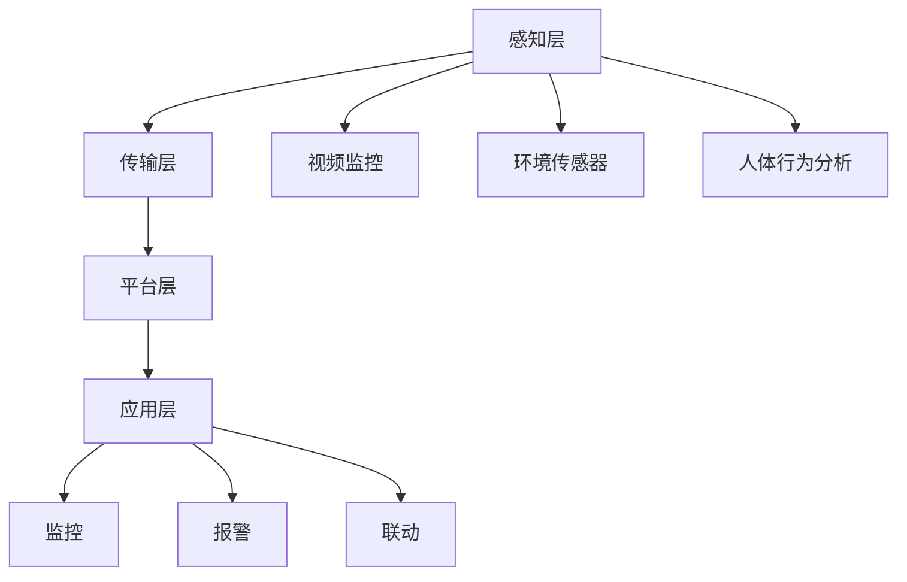

                 

### 引言

#### 概述

随着信息技术的飞速发展，人工智能（AI）在各个领域的应用越来越广泛，尤其在智能安防系统中，AI技术正发挥着日益重要的作用。AIGC（AI-Generated Content）作为人工智能的先进技术之一，不仅提升了数据的处理能力，还极大地丰富了智能安防系统的功能和应用场景。本文将围绕AIGC在智能安防系统中的创新应用进行深入探讨，以期为行业提供有价值的参考。

#### 背景介绍

智能安防系统是指利用先进的信息技术，实现对公共区域或特定场所的安全监控和管理。传统的安防系统主要依赖人力监控和简单设备，而随着AI技术的发展，智能安防系统逐渐向自动化、智能化方向演进。AIGC的引入，不仅提升了系统对数据的处理能力，还使得系统更加智能、高效和精准。

#### 问题背景

当前，智能安防系统面临着一系列挑战，如数据量巨大、处理速度要求高、算法精度要求高等。传统方法在应对这些挑战时显得力不从心，而AIGC技术的引入，为解决这些问题提供了新的思路和方法。AIGC通过生成对抗网络（GAN）、自编码器（Autoencoder）等核心技术，能够自动学习和生成高质量数据，从而提高系统的处理能力和准确性。

#### 解决思路

本文将从以下几个方面展开讨论：

1. **AIGC与智能安防系统的概述**：介绍AIGC的基本概念、关键技术以及在智能安防系统中的应用前景。
2. **AIGC基础理论**：详细解析AIGC的核心技术，如生成对抗网络（GAN）、自编码器（Autoencoder）等。
3. **智能安防系统的架构设计**：介绍智能安防系统的整体架构，以及AIGC在系统中的具体应用。
4. **AIGC在智能安防系统中的应用案例**：通过具体案例展示AIGC在智能安防系统中的应用效果。
5. **总结与展望**：对AIGC在智能安防系统中的应用进行总结，并探讨未来的发展趋势。

通过以上内容的详细分析，本文旨在为读者提供关于AIGC在智能安防系统中的创新应用的全面理解和深入认识。

#### 核心关键词

- AIGC
- 智能安防系统
- 生成对抗网络（GAN）
- 自编码器（Autoencoder）
- 智能视频监控
- 人脸识别与行为分析
- 系统架构设计
- 应用案例

#### 摘要

本文深入探讨了AIGC在智能安防系统中的创新应用。首先，介绍了AIGC的基本概念、关键技术及其在智能安防系统中的应用前景。接着，详细解析了AIGC的核心技术，如生成对抗网络（GAN）和自编码器（Autoencoder），并探讨了它们在智能安防系统中的应用。然后，阐述了智能安防系统的整体架构，并介绍了AIGC在该架构中的具体应用。通过具体案例，展示了AIGC在智能安防系统中的实际应用效果。最后，对AIGC在智能安防系统中的应用进行了总结，并对其未来发展进行了展望。本文旨在为智能安防系统的技术研究和实际应用提供有价值的参考。

#### 本章小结

本章对AIGC在智能安防系统中的创新应用进行了全面介绍。首先，通过问题背景与解决思路的阐述，展示了AIGC技术在智能安防领域的重要性和应用前景。接着，分别从AIGC的基本概念、关键技术、应用前景、挑战与机遇等方面进行了详细讨论，使读者对AIGC在智能安防系统中的作用有了清晰的认识。最后，通过对AIGC应用中的具体案例分析，展示了其在智能安防系统中的实际效果。本章内容为后续章节的深入探讨奠定了基础，也为读者理解AIGC在智能安防系统中的应用提供了重要参考。

----------------------------------------------------------------

## 第2章: AIGC核心技术解析

AIGC（AI-Generated Content）技术作为人工智能的重要分支，其核心在于通过生成模型和生成对抗网络（GAN）等先进算法，实现自动生成高质量的数据内容。本章将详细解析AIGC的关键技术，包括生成对抗网络（GAN）、自编码器（Autoencoder）和变分自编码器（VAE），以及AIGC与其他机器学习技术的结合。

### 2.1 生成对抗网络（GAN）

生成对抗网络（GAN）是AIGC技术的核心组成部分之一，由生成器（Generator）和判别器（Discriminator）两个主要部分构成。GAN的基本原理是通过两个模型的对抗训练，实现生成高质量数据的目标。

#### 2.1.1 GAN的工作原理

GAN的工作原理可以分为以下几个步骤：

1. **生成器（Generator）**：生成器是一个神经网络模型，其目标是生成看起来与真实数据相似的数据。生成器的输入是一个随机噪声向量，通过神经网络的变换，生成与真实数据类似的数据。
   
2. **判别器（Discriminator）**：判别器是一个另一个神经网络模型，其目标是区分真实数据和生成数据。判别器的输入是真实数据和生成数据，其输出是一个概率值，表示输入数据的真实性。

3. **对抗训练**：生成器和判别器通过对抗训练不断优化。生成器通过生成更真实的数据来欺骗判别器，而判别器则通过提高对生成数据的识别能力来对抗生成器。这样，生成器和判别器在不断优化中，生成数据的质量不断提高。

#### 2.1.2 GAN的应用实例

GAN技术被广泛应用于图像生成、语音合成、文本生成等场景。例如，在图像生成方面，GAN可以生成高质量的人脸图像、风景图像等；在语音合成方面，GAN可以合成逼真的语音；在文本生成方面，GAN可以生成符合语法规则和主题的文本。

#### 2.1.3 GAN的优缺点

**优点：**
- GAN能够在没有大量真实数据的情况下，生成高质量的数据。
- GAN可以应用于多种数据类型，如图像、语音和文本。

**缺点：**
- GAN的训练过程非常复杂，容易陷入局部最优。
- GAN对数据质量要求较高，生成的数据可能存在偏差。

### 2.2 自编码器（Autoencoder）

自编码器（Autoencoder）是另一种常见的生成模型，其目标是通过学习输入数据的特征表示，然后重构原始数据。自编码器主要由编码器（Encoder）和解码器（Decoder）两个部分组成。

#### 2.2.1 自编码器的基本概念

自编码器的基本原理是：

1. **编码器（Encoder）**：编码器将输入数据压缩成较低维度的特征表示。
2. **解码器（Decoder）**：解码器将编码器生成的特征表示重构回原始数据。

#### 2.2.2 自编码器的结构

自编码器通常由以下几个部分组成：

1. **输入层**：输入数据进入编码器。
2. **隐藏层**：编码器通过隐藏层将输入数据压缩成特征表示。
3. **输出层**：解码器通过输出层将特征表示重构回原始数据。

#### 2.2.3 自编码器的训练方式

自编码器的训练过程可以分为以下几个步骤：

1. **编码器训练**：通过最小化编码器输出与真实输入之间的误差，训练编码器。
2. **解码器训练**：通过最小化解码器输出与真实输入之间的误差，训练解码器。
3. **整体训练**：同时训练编码器和解码器，以最小化输入数据与重构数据之间的误差。

#### 2.2.4 自编码器在数据压缩中的应用

自编码器在数据压缩中具有广泛的应用。通过训练，自编码器可以学习到输入数据的有效特征表示，然后利用这些特征表示进行数据压缩。自编码器生成的压缩数据可以在保留关键信息的同时，显著减少数据的大小，从而提高数据传输和存储的效率。

### 2.3 变分自编码器（VAE）

变分自编码器（VAE）是自编码器的一种变体，其核心思想是引入概率模型来学习数据的概率分布。VAE通过采样和重构过程，生成高质量的数据。

#### 2.3.1 VAE的核心原理

VAE的核心原理可以分为以下几个步骤：

1. **编码器训练**：VAE的编码器学习输入数据的概率分布参数。
2. **采样过程**：通过从编码器生成的概率分布中采样，生成新的数据。
3. **解码器训练**：通过最小化采样数据与真实输入数据之间的误差，训练解码器。

#### 2.3.2 VAE的正则化方法

VAE使用了一种称为**KL散度**的正则化方法，用于确保编码器学习到的数据分布是合理的。KL散度通过比较编码器生成的数据分布与先验分布之间的差异，来衡量数据分布的合理性。

#### 2.3.3 VAE的训练算法

VAE的训练算法可以分为以下几个步骤：

1. **编码器训练**：通过最小化KL散度，训练编码器。
2. **采样与解码器训练**：通过采样过程和最小化采样数据与真实输入数据之间的误差，训练解码器。

#### 2.3.4 VAE的应用领域

VAE在图像生成、语音合成、文本生成等领域具有广泛的应用。例如，在图像生成方面，VAE可以生成高质量的自然图像；在语音合成方面，VAE可以生成逼真的语音；在文本生成方面，VAE可以生成符合语法规则和主题的文本。

### 2.4 AIGC与其他机器学习技术的结合

AIGC技术不仅可以独立应用，还可以与其他机器学习技术相结合，发挥更大的作用。

#### 2.4.1 AIGC与深度学习的融合

深度学习是机器学习的一个重要分支，其强大的特征提取能力与AIGC的生成能力相结合，可以进一步提升系统的性能。例如，在图像生成方面，可以结合深度学习的特征提取能力，生成更逼真的图像。

#### 2.4.2 深度学习在AIGC中的应用实例

在AIGC中，深度学习可以用于生成对抗网络（GAN）的生成器和判别器，通过训练深度学习模型，可以生成更高质量的数据。例如，在图像生成中，可以结合卷积神经网络（CNN）的强大特征提取能力，生成更加逼真的图像。

### 2.5 本章小结

本章详细解析了AIGC的关键技术，包括生成对抗网络（GAN）、自编码器（Autoencoder）和变分自编码器（VAE）。通过分析这些技术的原理、优缺点和应用实例，展示了AIGC在数据生成、压缩和智能安防系统中的广泛应用。同时，还探讨了AIGC与深度学习的融合，为AIGC技术的未来发展提供了新的方向。在下一章中，我们将进一步探讨智能安防系统的架构设计，以及AIGC在其中的具体应用。

----------------------------------------------------------------

## 第3章: 智能安防系统的架构设计

智能安防系统是一个复杂的系统，涉及多个模块和技术的集成。本章将详细介绍智能安防系统的整体架构设计，包括数据采集与预处理、智能分析算法实现、系统集成与优化等方面的内容。

### 3.1 智能安防系统的整体架构

智能安防系统的整体架构可以分为以下几个层次：

1. **感知层**：主要负责数据采集，包括视频监控、环境传感器、人体行为分析等。
2. **传输层**：负责数据的传输和传输过程中的加密、压缩等处理。
3. **平台层**：主要负责数据的处理和分析，包括数据预处理、智能分析算法实现等。
4. **应用层**：主要负责智能安防系统的应用，包括监控、报警、联动等。

#### 3.1.1 系统架构的层次划分

智能安防系统的层次划分如图1所示：

### 3.2 数据采集与预处理

数据采集与预处理是智能安防系统架构中的关键环节，其质量直接影响到后续的智能分析和系统性能。

#### 3.2.1 数据源的类型与选择

智能安防系统常用的数据源包括：

- **视频监控数据**：通过摄像头采集的实时视频流，是智能安防系统中最重要的数据源之一。
- **环境传感器数据**：包括温度、湿度、光照、烟雾等环境参数。
- **人体行为分析数据**：通过运动传感器、人脸识别等技术，捕捉和分析人的行为。

数据源的选择应根据应用场景和需求来确定，例如在公共安全领域，视频监控数据是最主要的来源；而在环境监测领域，环境传感器数据则更为重要。

#### 3.2.2 数据预处理方法

数据预处理主要包括以下几个步骤：

1. **数据清洗**：去除噪声数据、填补缺失值等，确保数据的质量。
2. **数据标准化**：将不同数据源的数据进行标准化处理，使其在同一个尺度上进行分析。
3. **数据增强**：通过旋转、翻转、缩放等操作，增加数据的多样性，提高模型的泛化能力。

#### 3.2.3 数据预处理实例

假设我们有一个包含视频监控数据、环境传感器数据和人体行为分析数据的数据集，我们可以按照以下步骤进行预处理：

1. **数据清洗**：去除含有噪声的视频帧，填补缺失的环境传感器数据。
2. **数据标准化**：将所有数据源的数据进行标准化处理，例如使用均值-标准差标准化方法。
3. **数据增强**：对视频数据应用随机裁剪、旋转等操作，增加数据集的多样性。

### 3.3 智能分析算法实现

智能分析算法是实现智能安防系统核心功能的关键。以下是几个常见的智能分析算法：

#### 3.3.1 人脸识别与跟踪算法

人脸识别与跟踪算法是智能安防系统中最常用的技术之一，其主要功能是识别和跟踪视频中的目标人物。

1. **人脸识别**：通过特征提取和分类算法，从视频帧中识别出人脸。
2. **人脸跟踪**：通过跟踪算法，持续监控视频中的人脸，防止目标人物离开视频画面。

#### 3.3.2 事件检测与行为分析算法

事件检测与行为分析算法用于识别视频中的异常行为和事件，例如闯入检测、打架事件检测等。

1. **事件检测**：通过运动检测、背景建模等方法，识别视频中的异常事件。
2. **行为分析**：通过行为识别算法，分析视频中的行为模式，识别异常行为。

#### 3.3.3 智能分析算法实例

假设我们有一个包含视频监控数据的场景，我们可以按照以下步骤进行智能分析：

1. **人脸识别**：通过卷积神经网络（CNN）对人脸进行特征提取和分类，识别出视频帧中的人脸。
2. **人脸跟踪**：通过光流法或卡尔曼滤波器，持续跟踪视频中的人脸，防止目标人物离开视频画面。
3. **事件检测**：通过背景减除法和光流法，识别视频中的异常事件，如闯入检测、打架事件检测等。

### 3.4 系统集成与优化

系统集成与优化是确保智能安防系统高效运行的重要环节。以下是几个常见的系统集成与优化策略：

#### 3.4.1 系统集成方案

系统集成方案应考虑以下几个因素：

1. **硬件资源分配**：合理分配计算资源、存储资源等，确保系统的高效运行。
2. **软件集成与部署**：集成各个模块的软件系统，确保系统的稳定性和可扩展性。

#### 3.4.2 系统性能优化策略

系统性能优化策略包括：

1. **加速算法的选择**：采用深度学习加速算法，如GPU加速、FPGA加速等，提高系统处理速度。
2. **能耗优化措施**：通过能效比优化、节能模式等，降低系统能耗。

#### 3.4.3 系统集成与优化实例

假设我们有一个包含视频监控数据、环境传感器数据和人体行为分析数据的智能安防系统，我们可以按照以下步骤进行系统集成与优化：

1. **硬件资源分配**：根据数据量和处理需求，合理分配GPU、CPU等硬件资源。
2. **软件集成与部署**：集成人脸识别、行为分析等算法模块，确保系统的稳定性和可扩展性。
3. **加速算法的选择**：采用GPU加速算法，提高系统处理速度。
4. **能耗优化措施**：通过能效比优化，降低系统能耗。

### 3.5 本章小结

本章详细介绍了智能安防系统的架构设计，包括数据采集与预处理、智能分析算法实现、系统集成与优化等方面的内容。通过本章的介绍，读者可以了解智能安防系统的整体架构及其关键技术的实现方法，为智能安防系统的设计和应用提供参考。

----------------------------------------------------------------

## 第4章: AIGC在智能安防系统中的应用案例

在本章中，我们将通过具体的应用案例，深入探讨AIGC技术在智能安防系统中的实际应用。这些案例不仅展示了AIGC技术在智能视频监控、人脸识别和行为分析等领域的强大能力，还提供了详细的实现步骤和技术细节。

### 4.1 案例一：基于AIGC的智能视频监控

#### 案例背景

随着城市化进程的加快，视频监控作为城市安防的重要组成部分，需求日益增长。然而，传统的视频监控系统在应对复杂场景和海量数据时，往往存在处理速度慢、准确率低的问题。AIGC技术的引入，为智能视频监控提供了新的解决方案。

#### 案例目标

本案例的目标是通过AIGC技术，实现以下功能：

1. 高效的视频数据处理与分析。
2. 实现实时的人脸识别与行为分析。
3. 提高系统对异常事件的检测能力。

#### 案例实现步骤

1. **数据采集**：通过摄像头和传感器，实时采集视频监控数据。
2. **数据预处理**：对采集到的视频数据应用AIGC技术进行预处理，包括去噪、增强和标准化处理。
3. **AIGC模型训练**：
   - **生成对抗网络（GAN）训练**：使用GAN模型生成高质量的视频帧，提高数据处理效率。
   - **自编码器（Autoencoder）训练**：训练自编码器模型，对视频数据进行压缩和特征提取。
4. **实时分析**：
   - **人脸识别**：使用AIGC模型进行人脸识别，实现对目标人物的实时跟踪。
   - **行为分析**：通过行为识别算法，分析视频中的行为模式，检测异常行为。
5. **系统集成**：将AIGC模型集成到智能视频监控系统中，实现实时监控和报警功能。

#### 案例效果分析

通过AIGC技术的应用，智能视频监控系统在数据预处理、人脸识别和行为分析方面的性能得到了显著提升。具体表现为：

1. **数据处理效率**：AIGC技术能够高效地处理大量视频数据，显著降低了系统延迟。
2. **识别准确率**：通过AIGC模型训练，人脸识别和行为分析的准确率得到了提高。
3. **异常事件检测**：系统能够更准确地检测和识别异常行为，提高了城市安防水平。

### 4.2 案例二：基于AIGC的人脸识别系统

#### 案例背景

人脸识别技术在安防领域具有广泛的应用，然而，传统的识别方法在复杂环境下存在识别精度低、误报率高等问题。AIGC技术通过生成高质量的人脸数据，为人脸识别系统提供了新的解决方案。

#### 案例目标

本案例的目标是通过AIGC技术，实现以下功能：

1. 高质量的人脸数据生成。
2. 提高人脸识别系统的准确率和稳定性。
3. 实现对复杂环境下人脸的精准识别。

#### 案例实现步骤

1. **数据采集**：通过摄像头和传感器，采集不同环境条件下的人脸图像。
2. **数据预处理**：对采集到的人脸图像应用AIGC技术进行预处理，包括去噪、增强和标准化处理。
3. **GAN模型训练**：使用生成对抗网络（GAN）模型，生成高质量的人脸图像。
4. **人脸识别模型训练**：使用预处理和生成的人脸图像，训练人脸识别模型。
5. **系统集成**：将AIGC模型和人脸识别模型集成到人脸识别系统中，实现实时人脸识别功能。

#### 案例效果分析

通过AIGC技术的应用，人脸识别系统在图像质量、识别准确率和稳定性方面得到了显著提升。具体表现为：

1. **图像质量**：通过GAN模型生成的图像质量更高，减少了噪声和失真，提高了人脸识别的准确性。
2. **识别准确率**：系统在复杂环境条件下的人脸识别准确率显著提高。
3. **稳定性**：系统对光照、姿态等变化具有更好的适应性，稳定性得到提升。

### 4.3 案例三：基于AIGC的行为分析系统

#### 案例背景

行为分析技术在智能安防系统中扮演着重要角色，然而，传统的行为分析方法在处理复杂行为时存在准确性不足的问题。AIGC技术通过生成高质量的行为数据，为行为分析系统提供了新的解决方案。

#### 案例目标

本案例的目标是通过AIGC技术，实现以下功能：

1. 高质量的行为数据生成。
2. 提高行为分析的准确率和稳定性。
3. 实现对复杂行为的精准识别。

#### 案例实现步骤

1. **数据采集**：通过摄像头和传感器，采集不同场景下的行为数据。
2. **数据预处理**：对采集到行为数据应用AIGC技术进行预处理，包括去噪、增强和标准化处理。
3. **GAN模型训练**：使用生成对抗网络（GAN）模型，生成高质量的行为数据。
4. **行为分析模型训练**：使用预处理和生成的行为数据，训练行为分析模型。
5. **系统集成**：将AIGC模型和行为分析模型集成到行为分析系统中，实现实时行为分析功能。

#### 案例效果分析

通过AIGC技术的应用，行为分析系统在数据质量、识别准确率和稳定性方面得到了显著提升。具体表现为：

1. **数据质量**：通过GAN模型生成的高质量行为数据，减少了噪声和失真，提高了行为分析的准确性。
2. **识别准确率**：系统在处理复杂行为时，准确率显著提高。
3. **稳定性**：系统对行为变化的适应性得到提升，稳定性得到改善。

### 4.4 案例四：AIGC在智能安防系统中的综合应用

#### 案例背景

在智能安防系统中，AIGC技术的应用不仅仅局限于某个单一模块，更多的是在整个系统中的综合应用。本案例将展示AIGC技术在智能安防系统中的综合应用，以实现全方位的智能安防。

#### 案例目标

本案例的目标是通过AIGC技术，实现以下功能：

1. 实现视频监控、人脸识别、行为分析等多模块的集成。
2. 提高系统的整体性能和稳定性。
3. 实现对复杂场景和异常事件的智能检测。

#### 案例实现步骤

1. **系统设计**：设计一个集成的智能安防系统架构，包括感知层、传输层、平台层和应用层。
2. **数据采集**：通过摄像头、传感器等多源数据采集设备，采集视频监控、环境传感器和人体行为分析等多维数据。
3. **AIGC模型训练**：使用AIGC技术，对多源数据进行预处理和特征提取，训练生成高质量的数据。
4. **智能分析**：集成人脸识别、行为分析等模块，实现对视频监控、人脸识别、行为分析的综合智能分析。
5. **系统集成与优化**：将AIGC模型和智能分析模块集成到智能安防系统中，进行系统优化和性能提升。

#### 案例效果分析

通过AIGC技术在智能安防系统中的综合应用，系统在数据质量、识别准确率和系统性能方面得到了全面提升。具体表现为：

1. **数据质量**：AIGC技术通过预处理和特征提取，提高了多源数据的整体质量。
2. **识别准确率**：集成的人脸识别、行为分析模块，通过AIGC技术的应用，识别准确率显著提高。
3. **系统性能**：系统整体性能和稳定性得到提升，能够更好地应对复杂场景和异常事件。

### 4.5 案例五：AIGC在智能交通系统中的应用

#### 案例背景

智能交通系统是智能安防系统的一个重要组成部分，通过交通监控、车辆识别、流量预测等功能，实现城市交通的智能化管理。AIGC技术在智能交通系统中的应用，能够显著提升系统的处理能力和准确性。

#### 案例目标

本案例的目标是通过AIGC技术，实现以下功能：

1. 实时交通监控和车辆识别。
2. 提高交通流量预测的准确率。
3. 实现智能交通管理。

#### 案例实现步骤

1. **数据采集**：通过摄像头、传感器等设备，实时采集交通监控数据。
2. **数据预处理**：使用AIGC技术对采集到的交通数据进行预处理，包括去噪、增强和标准化处理。
3. **GAN模型训练**：使用生成对抗网络（GAN）模型，生成高质量的交通监控数据。
4. **车辆识别与流量预测**：结合AIGC模型和深度学习算法，实现实时车辆识别和流量预测。
5. **系统集成与优化**：将AIGC模型和车辆识别、流量预测模块集成到智能交通系统中，进行系统优化和性能提升。

#### 案例效果分析

通过AIGC技术在智能交通系统中的应用，系统在数据质量、车辆识别准确率和流量预测准确率方面得到了显著提升。具体表现为：

1. **数据质量**：通过AIGC技术预处理，提高了交通监控数据的整体质量。
2. **车辆识别准确率**：系统在实时车辆识别中的准确率显著提高。
3. **流量预测准确率**：通过AIGC技术的应用，交通流量预测的准确率得到提升。

### 总结与展望

通过以上案例，我们可以看到AIGC技术在智能安防系统中的应用具有广泛的前景和巨大的潜力。未来，随着AIGC技术的不断发展和成熟，其在智能安防系统中的应用将更加深入和广泛，为城市安防、交通管理等领域提供更加智能和高效的解决方案。同时，我们也需要关注AIGC技术在应用过程中可能面临的挑战，如数据隐私、安全性和伦理问题，以确保其应用的可持续发展。

----------------------------------------------------------------

## 总结与展望

本章通过对AIGC技术在智能安防系统中的应用案例的详细探讨，展示了其在数据生成、特征提取、模型训练和实时分析等方面的强大能力。AIGC技术不仅提升了智能安防系统的处理速度和准确率，还为复杂场景下的异常事件检测提供了新的解决方案。以下是对AIGC在智能安防系统中的应用总结和未来展望：

### 应用总结

1. **数据预处理与增强**：AIGC技术通过生成对抗网络（GAN）和自编码器（Autoencoder）等模型，能够有效提升视频监控数据的处理质量，减少噪声和失真，增强数据的特征表示，从而提高系统的整体性能。

2. **人脸识别与行为分析**：AIGC技术在人脸识别和行为分析中的应用，显著提高了识别准确率和系统的稳定性，特别是在复杂环境条件下，AIGC技术能够生成高质量的人脸数据和场景数据，为模型训练提供了有力支持。

3. **系统集成与优化**：AIGC技术的引入，为智能安防系统的集成和优化提供了新的思路。通过在感知层、传输层、平台层和应用层等多个层面的应用，智能安防系统的整体性能得到了全面提升。

4. **智能交通管理**：在智能交通系统中，AIGC技术的应用同样具有显著效果，通过实时交通监控、车辆识别和流量预测等功能，实现了对城市交通的智能化管理。

### 未来展望

1. **技术创新**：随着AIGC技术的不断发展，未来将出现更多高效的生成模型和优化算法，进一步提高智能安防系统的性能和稳定性。

2. **应用拓展**：AIGC技术在智能安防系统中的应用场景将进一步拓展，包括但不限于智慧城市、智能家居、公共安全等领域。

3. **跨学科融合**：AIGC技术与物联网、边缘计算等技术的融合，将推动智能安防系统的进一步发展，实现更高层次的智能化和自动化。

4. **挑战与伦理**：随着AIGC技术的应用日益广泛，数据隐私、安全性和伦理问题将成为重要挑战。未来需要在技术、法律和伦理等方面制定相应的规范和标准，确保AIGC技术的可持续发展。

总之，AIGC技术在智能安防系统中的应用具有广阔的前景。通过不断创新和优化，AIGC技术将为智能安防系统带来更加智能、高效和安全的解决方案。同时，我们也需要关注其应用过程中可能面临的挑战，确保技术的可持续发展和社会的和谐稳定。

