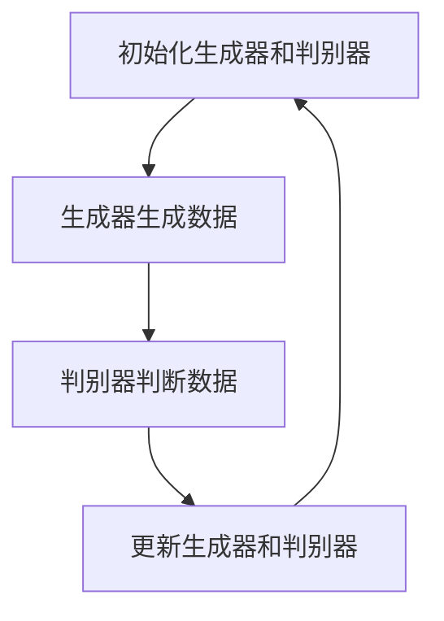
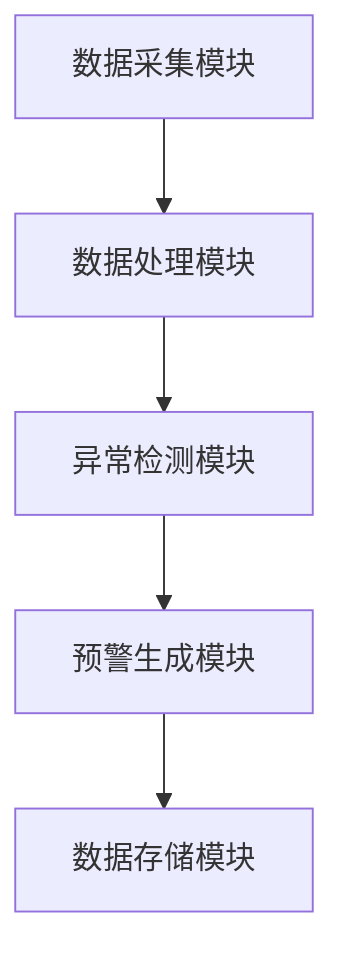
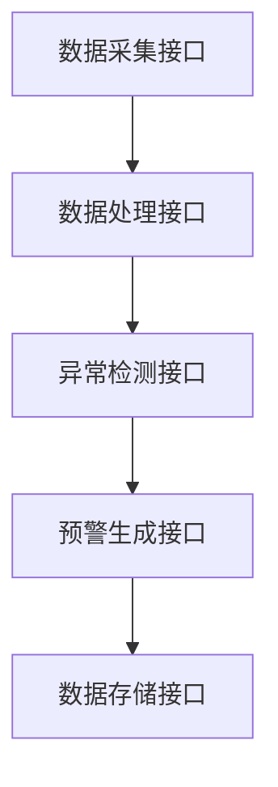
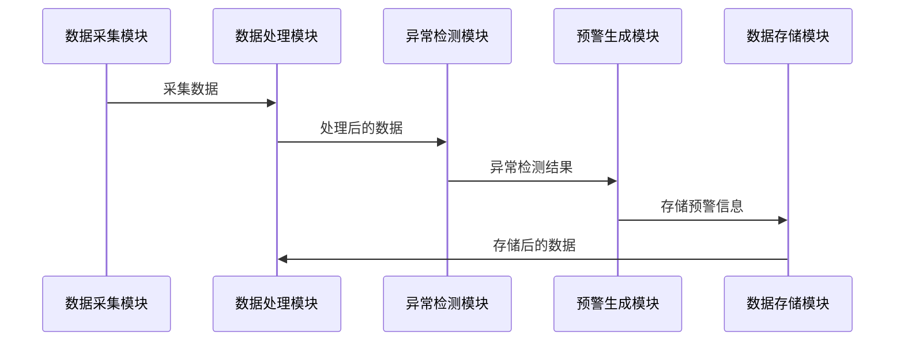

                 

### 1. AIGC与智能安防预警系统

### 1.1 AIGC概述

**概念：** AIGC（AI-Generated Content）是指利用人工智能技术自动生成内容的过程。它涵盖了从数据采集、处理、到内容生成、发布的全流程。AIGC 技术结合了自然语言处理（NLP）、计算机视觉（CV）以及深度学习（DL）等多种人工智能技术，能够自动生成文字、图像、音频等多种形式的内容。

**背景：** AIGC 技术起源于对自动化内容生成的需求，随着互联网和社交媒体的兴起，人们需要更快速、更高效的内容生成方式。AIGC 技术的发展受到了大数据、云计算、边缘计算等技术的推动，使得其在各个领域得到了广泛应用，特别是在智能安防预警系统中，AIGC 技术显示出了巨大的潜力。

**重要性：** 在智能安防预警系统中，AIGC 技术的重要性主要体现在以下几个方面：

1. **实时预警：** AIGC 技术能够实时处理海量的监控视频和图像数据，快速识别异常行为和安全隐患，提供及时的预警信息。
2. **精准识别：** AIGC 技术结合深度学习算法，对监控数据进行精确分析，能够识别不同类型的异常事件，提高预警的准确性。
3. **降低人力成本：** 传统安防系统依赖于大量人力进行监控，而 AIGC 技术能够自动完成大部分监控任务，有效降低人力成本。
4. **提高工作效率：** AIGC 技术能够自动处理大量的监控数据，解放人力，提高整体工作效率。

### 1.2 智能安防预警系统的现状与挑战

**现状：** 当前，智能安防预警系统已经广泛应用于各大城市和重点单位，通过监控摄像头、传感器等设备，对公共场所进行实时监控。然而，现有的智能安防预警系统仍然存在一些问题：

1. **数据量大：** 随着监控设备的普及，监控数据量呈爆炸式增长，传统的方法无法有效处理如此海量的数据。
2. **识别准确性低：** 虽然现有的智能安防系统已经能够识别一些基本的异常行为，但其准确性仍然较低，容易产生误报和漏报。
3. **响应速度慢：** 在面对突发事件时，现有的智能安防系统响应速度较慢，无法及时提供预警信息。
4. **人力依赖性强：** 尽管智能安防系统在一定程度上替代了人力工作，但仍然需要大量人力进行监控和后续处理。

**挑战：** 这些问题对智能安防预警系统提出了新的挑战：

1. **数据处理能力：** 如何提高数据处理能力，实现实时、高效的监控数据分析。
2. **识别准确性：** 如何提高异常行为识别的准确性，减少误报和漏报。
3. **响应速度：** 如何提高系统响应速度，确保在突发事件发生时能够及时预警。
4. **人力成本：** 如何进一步降低人力成本，实现智能化、自动化的监控和预警。

### 1.3 为什么需要 AIGC 来创新

**创新点：** AIGC 技术在智能安防预警系统中的应用，有望解决当前系统面临的各种挑战，带来以下创新点：

1. **智能数据分析：** AIGC 技术能够对海量监控数据进行智能分析，提取有用信息，提高数据利用率。
2. **精准异常识别：** AIGC 技术结合深度学习算法，能够实现高精度的异常行为识别，减少误报和漏报。
3. **实时预警：** AIGC 技术能够实现实时预警，快速响应突发事件，提高预警效率。
4. **降低人力成本：** AIGC 技术能够自动化完成大部分监控任务，减少人力成本，提高工作效率。

**前景：** 随着 AIGC 技术的不断发展和完善，其在智能安防预警系统中的应用前景非常广阔。通过 AIGC 技术，智能安防预警系统将能够更加智能、高效、准确地运行，为公共安全提供有力保障。

### 总结

本文简要介绍了 AIGC 技术的概念、背景以及其在智能安防预警系统中的应用。分析了当前智能安防预警系统的现状与挑战，并探讨了为什么需要 AIGC 技术来创新。接下来，我们将进一步深入探讨 AIGC 技术的核心概念、技术原理及其在智能安防中的应用，为读者呈现一个全面的智能安防预警系统创新方案。接下来，我们将详细分析 AIGC 的核心概念和技术原理。

### 2. AIGC基础

#### 2.1 AIGC核心概念

AIGC，即AI-Generated Content，指的是利用人工智能技术自动生成内容的一种技术。其核心概念可以概括为以下几个方面：

- **内容生成**：AIGC 的核心目标是通过算法自动生成文字、图像、音频等多种形式的内容。
- **数据驱动**：AIGC 的内容生成过程依赖于大量的数据，包括文本、图像、音频等，通过数据训练模型，从而实现自动内容生成。
- **多模态**：AIGC 能够处理多种数据类型，例如文本、图像、音频等，实现跨模态的内容生成。
- **自动化**：AIGC 的过程是自动化的，从数据输入到内容生成，无需人工干预。

**特性**：

- **高效性**：AIGC 技术能够快速生成大量内容，提高内容创作的效率。
- **多样性**：AIGC 技术能够生成形式多样、内容丰富的内容，满足不同用户的需求。
- **个性化**：AIGC 技术能够根据用户的行为数据和偏好，生成个性化的内容。

#### 2.2 AIGC技术原理

AIGC 技术的实现依赖于多种人工智能技术，主要包括自然语言处理（NLP）、计算机视觉（CV）和深度学习（DL）等。其技术原理可以概括为以下几个步骤：

1. **数据采集**：从互联网、数据库等渠道获取大量文本、图像、音频等数据。
2. **数据预处理**：对采集到的数据进行清洗、标注和分类，以便用于后续的训练。
3. **模型训练**：利用深度学习算法，对预处理后的数据集进行训练，构建内容生成模型。
4. **内容生成**：通过训练好的模型，对输入的文本、图像、音频等数据进行处理，生成新的内容。
5. **内容优化**：对生成的内容进行优化，提高内容的可读性、可听性和视觉效果。

#### 2.3 AIGC发展历程

AIGC 技术的发展历程可以分为以下几个阶段：

1. **早期探索**：20世纪80年代，人工智能领域开始探索文本生成技术，如自动写作、机器翻译等。
2. **深度学习兴起**：2012年，深度学习技术在图像识别任务上取得突破性进展，激发了人们对 AIGC 技术的兴趣。
3. **多模态生成**：随着计算机视觉、自然语言处理等领域的发展，AIGC 技术逐渐实现跨模态的内容生成。
4. **生成对抗网络（GAN）**：GAN 的出现进一步推动了 AIGC 技术的发展，使得生成模型能够生成更加真实、高质量的内容。

#### 2.4 AIGC与其他相关技术的比较

AIGC 技术与其他相关技术（如传统内容生成技术、生成对抗网络（GAN）等）在原理和应用场景上存在一定差异：

- **与传统内容生成技术的比较**：传统内容生成技术主要依靠规则和模板，生成的内容较为固定和简单。而 AIGC 技术基于数据驱动，能够生成形式多样、内容丰富的内容，具备更高的灵活性和创造力。
- **与生成对抗网络（GAN）的比较**：GAN 是一种生成模型，通过对抗训练生成高质量的内容。AIGC 技术在 GAN 的基础上，结合了多种人工智能技术，实现了更广泛的应用场景和多模态的内容生成。

#### 2.5 AIGC的优势

AIGC 技术在智能安防预警系统中的应用具有以下优势：

- **高效性**：AIGC 技术能够快速处理海量的监控数据，实现实时预警。
- **准确性**：AIGC 技术结合深度学习算法，能够实现高精度的异常行为识别，减少误报和漏报。
- **灵活性**：AIGC 技术能够根据监控数据的特点和需求，灵活调整和优化生成模型，提高预警效果。
- **降低人力成本**：AIGC 技术能够自动化完成大部分监控任务，减少人力成本，提高工作效率。

### 总结

在本节中，我们详细介绍了 AIGC 的核心概念、技术原理、发展历程以及与其他相关技术的比较。通过分析，我们可以看到 AIGC 技术在智能安防预警系统中的应用具有明显的优势。在下一节中，我们将深入探讨 AIGC 在智能安防预警系统中的应用场景和实现方法。首先，让我们来了解一下智能安防预警系统的定义和现状。

### 3. AIGC在智能安防预警系统中的应用

#### 3.1 智能安防预警系统的定义与现状

**定义：** 智能安防预警系统是一种基于人工智能技术，通过实时监控、数据分析和智能预警，实现对潜在安全威胁的提前发现和响应的系统。它通常包括视频监控、环境传感器、智能分析算法等多个模块。

**现状：** 当前，智能安防预警系统已经在许多公共场所、重点单位得到了广泛应用。例如，城市监控系统、交通监控系统、银行安防系统等。然而，随着监控设备和数据的增多，现有系统的处理能力和预警准确性仍然存在一定的局限性。

**挑战：** 这些挑战主要体现在以下几个方面：

1. **海量数据处理**：随着监控设备数量的增加，监控数据的规模呈指数级增长，现有系统在处理海量数据时面临巨大挑战。
2. **识别准确性**：现有的智能安防系统在识别异常行为时，存在误报和漏报的问题，影响了预警的准确性。
3. **响应速度**：在面对突发事件时，现有系统的响应速度较慢，无法及时提供预警信息。
4. **人力成本**：智能安防系统虽然在一定程度上替代了人力，但仍然需要大量人力进行监控和后续处理。

#### 3.2 AIGC在智能安防预警系统中的应用场景

AIGC 技术在智能安防预警系统中具有广泛的应用场景，以下是一些典型应用：

1. **实时监控与预警**：AIGC 技术能够实时处理海量的监控数据，快速识别异常行为和安全隐患，提供及时的预警信息。
2. **行为分析**：AIGC 技术可以分析监控视频中的行为数据，识别出潜在的威胁，例如异常动作、可疑人员等。
3. **图像识别**：AIGC 技术结合计算机视觉算法，可以实现对监控视频中的物体、场景的识别，例如识别火灾、交通违规等。
4. **环境监测**：AIGC 技术可以结合环境传感器数据，监测环境中的异常变化，例如烟雾、有毒气体等。
5. **个性化预警**：AIGC 技术可以根据用户的监控需求和行为数据，生成个性化的预警信息，提高预警的针对性。

#### 3.3 AIGC在智能安防预警系统中的实现方法

实现 AIGC 在智能安防预警系统中的应用，通常包括以下几个步骤：

1. **数据采集与预处理**：从监控设备、传感器等获取数据，并进行预处理，包括数据清洗、去噪、标准化等。
2. **模型训练与优化**：利用预处理后的数据集，训练 AIGC 模型。通过调整模型参数和架构，优化模型的性能。
3. **实时监控与预警**：将训练好的模型部署到实时监控系统中，对监控数据进行实时分析，识别异常行为，生成预警信息。
4. **预警信息处理**：对生成的预警信息进行分类、筛选和整合，将其转化为用户可以理解的形式，例如警报、通知等。
5. **响应与反馈**：根据预警信息，启动相应的响应机制，例如派遣安保人员、启动应急预案等，并对响应效果进行反馈和优化。

#### 3.4 AIGC在智能安防预警系统中的优势

AIGC 技术在智能安防预警系统中的应用，带来了以下优势：

1. **高效性**：AIGC 技术能够快速处理海量的监控数据，实现实时预警，提高了系统的响应速度。
2. **准确性**：AIGC 技术结合深度学习算法，能够实现高精度的异常行为识别，减少误报和漏报。
3. **灵活性**：AIGC 技术可以根据监控数据的特点和需求，灵活调整和优化生成模型，提高预警效果。
4. **降低人力成本**：AIGC 技术能够自动化完成大部分监控任务，减少人力成本，提高工作效率。

### 总结

在本节中，我们详细介绍了智能安防预警系统的定义和现状，分析了 AIGC 在智能安防预警系统中的应用场景和实现方法。通过 AIGC 技术的应用，智能安防预警系统在数据处理、识别准确性和响应速度等方面得到了显著提升。在下一节中，我们将深入探讨 AIGC 的核心算法原理，并使用 mermaid 绘制算法流程图。这将有助于我们更好地理解 AIGC 技术的运作机制。

### 4. AIGC算法原理

#### 4.1 算法概述

AIGC（AI-Generated Content）算法是智能安防预警系统的核心技术，其主要目的是通过自动生成内容，实现监控数据的实时分析和预警。AIGC 算法主要基于深度学习和生成对抗网络（GAN）等技术，下面我们将详细介绍这些算法的原理。

#### 4.2 深度学习算法

深度学习算法是 AIGC 技术的核心，其基本原理是通过多层神经网络对数据进行建模，从而实现数据的自动特征提取和模式识别。深度学习算法主要包括以下几种：

1. **卷积神经网络（CNN）**：CNN 是用于处理图像数据的常见算法，通过卷积层、池化层和全连接层等结构，实现对图像的自动特征提取和分类。
2. **递归神经网络（RNN）**：RNN 是用于处理序列数据的常见算法，通过隐藏状态和循环结构，实现对序列数据的建模和预测。
3. **生成对抗网络（GAN）**：GAN 是一种生成模型，通过生成器和判别器的对抗训练，实现高质量的数据生成。

#### 4.3 生成对抗网络（GAN）

生成对抗网络（GAN）是 AIGC 技术的重要基础，其基本原理是生成器和判别器之间的对抗训练。生成器的目标是生成尽可能真实的数据，而判别器的目标是区分真实数据和生成数据。通过这种对抗训练，生成器逐渐提高生成数据的质量。

GAN 的基本结构包括：

1. **生成器（Generator）**：生成器的任务是将随机噪声数据生成真实数据。
2. **判别器（Discriminator）**：判别器的任务是区分真实数据和生成数据。
3. **损失函数**：GAN 的训练过程是通过优化损失函数来实现的。常见的损失函数有对抗损失和分类损失。

#### 4.4 GAN 的算法流程

GAN 的算法流程主要包括以下几个步骤：

1. **初始化生成器和判别器**：初始化生成器和判别器的参数。
2. **生成器生成数据**：生成器生成一批随机噪声数据，并使用这些数据生成真实数据。
3. **判别器判断数据**：判别器对生成器和真实数据进行判断，输出判别结果。
4. **更新生成器和判别器**：根据判别器的判断结果，更新生成器和判别器的参数，使生成器生成的数据更加真实，判别器能够更好地区分真实数据和生成数据。
5. **重复上述步骤**：重复上述步骤，直到生成器生成的数据质量达到预期。

#### 4.5 GAN 的算法流程图

下面使用 mermaid 绘制 GAN 的算法流程图：



#### 4.6 Python 代码实现

下面使用 Python 代码实现 GAN 的算法：

```python
import tensorflow as tf
from tensorflow.keras.layers import Dense, Flatten, Reshape
from tensorflow.keras.models import Sequential
from tensorflow.keras.optimizers import Adam

# 定义生成器模型
generator = Sequential([
    Dense(128, activation='relu', input_shape=(100,)),
    Dense(256, activation='relu'),
    Dense(512, activation='relu'),
    Dense(1024, activation='relu'),
    Flatten(),
    Reshape((28, 28, 1))
])

# 定义判别器模型
discriminator = Sequential([
    Flatten(input_shape=(28, 28, 1)),
    Dense(512, activation='relu'),
    Dense(256, activation='relu'),
    Dense(128, activation='relu'),
    Dense(1, activation='sigmoid')
])

# 定义 GAN 模型
gan = Sequential([
    generator,
    discriminator
])

# 定义损失函数和优化器
discriminator_optimizer = Adam(0.0001)
generator_optimizer = Adam(0.0001)

# 编译 GAN 模型
gan.compile(optimizer=generator_optimizer, loss='binary_crossentropy')

# 训练 GAN 模型
for epoch in range(100):
    # 生成随机噪声数据
    noise = np.random.normal(0, 1, (batch_size, 100))
    # 使用生成器生成真实数据
    generated_images = generator.predict(noise)
    # 获取真实数据和生成数据的标签
    real_labels = np.ones((batch_size, 1))
    fake_labels = np.zeros((batch_size, 1))
    # 训练判别器
    d_loss_real = discriminator.train_on_batch(real_images, real_labels)
    d_loss_fake = discriminator.train_on_batch(generated_images, fake_labels)
    d_loss = 0.5 * np.add(d_loss_real, d_loss_fake)
    # 训练生成器
    g_loss = gan.train_on_batch(noise, real_labels)
    print(f'Epoch {epoch}, Discriminator Loss: {d_loss}, Generator Loss: {g_loss}')
```

#### 4.7 算法数学模型

GAN 的算法数学模型主要包括生成器模型和判别器模型。下面使用 LaTeX 格式给出这两个模型的数学公式：

```latex
\begin{equation}
\begin{aligned}
&G(z) = x \\
&\text{where } z \sim \mathcal{N}(0, 1) \\
&G: \mathbb{R}^n \rightarrow \mathbb{R}^d \\
&x: \mathbb{R}^d \\
&\text{Generator Loss: } L_G = -\log(D(G(z))) \\
&\text{Discriminator Loss: } L_D = -[\log(D(x)) + \log(1 - D(G(z)))]
\end{aligned}
\end{equation}
```

#### 4.8 算法讲解与举例

GAN 算法的核心在于生成器和判别器的对抗训练。生成器的目标是生成尽可能真实的数据，而判别器的目标是区分真实数据和生成数据。通过这种对抗训练，生成器逐渐提高生成数据的质量，判别器逐渐提高对真实数据和生成数据的区分能力。

举例来说，如果我们使用 GAN 生成图像，生成器会接收随机噪声数据，并生成一幅图像。判别器会分别接收真实图像和生成图像，并输出它们分别属于真实数据和生成数据的概率。生成器的目标是使判别器对生成图像的判断结果为 0.5，即无法区分真实图像和生成图像。通过多次训练，生成器的生成图像质量会逐渐提高，最终生成出接近真实图像的图像。

### 总结

在本节中，我们详细介绍了 AIGC 的核心算法原理，包括深度学习算法和生成对抗网络（GAN）。通过 mermaid 绘制算法流程图，Python 代码实现和数学模型讲解，我们更好地理解了 GAN 算法的运作机制。在下一节中，我们将深入探讨 AIGC 智能安防预警系统的整体架构设计，并使用 mermaid 绘制系统架构图，帮助读者全面了解系统的设计和功能。

### 5. AIGC智能安防预警系统架构设计

#### 5.1 系统功能设计

智能安防预警系统的设计旨在实现实时监控、数据分析和预警响应。系统的主要功能包括：

1. **数据采集**：从各种监控设备（如摄像头、传感器等）采集视频、图像和声音数据。
2. **数据处理**：对采集到的数据进行预处理，包括去噪、增强、归一化等，以便后续分析。
3. **异常检测**：利用 AIGC 算法对预处理后的数据进行分析，识别异常行为和安全隐患。
4. **预警生成**：根据异常检测结果，生成预警信息，并通知相关人员和启动应急响应。
5. **数据存储**：将预警信息和其他相关数据存储在数据库中，以便后续分析和查询。

#### 5.2 系统架构设计

智能安防预警系统的整体架构设计采用模块化设计思想，主要包括以下模块：

1. **数据采集模块**：负责从各种监控设备采集数据，并将其传输到数据处理模块。
2. **数据处理模块**：对采集到的数据进行预处理，并将其传输到异常检测模块。
3. **异常检测模块**：利用 AIGC 算法对预处理后的数据进行异常检测，并将检测结果传输到预警生成模块。
4. **预警生成模块**：根据异常检测结果，生成预警信息，并通知相关人员。
5. **数据存储模块**：将预警信息和其他相关数据存储在数据库中，以便后续分析和查询。

下面使用 mermaid 绘制系统架构图：



#### 5.3 系统接口设计

智能安防预警系统提供了一系列接口，以便与其他系统进行交互和数据共享。主要接口包括：

1. **数据采集接口**：用于从监控设备采集数据。
2. **数据处理接口**：用于处理采集到的数据。
3. **异常检测接口**：用于接收处理后的数据，并返回异常检测结果。
4. **预警生成接口**：用于生成预警信息，并通知相关人员。
5. **数据存储接口**：用于将预警信息和其他数据存储到数据库中。

下面使用 mermaid 绘制系统接口设计：



#### 5.4 系统交互设计

智能安防预警系统各模块之间通过事件驱动的方式进行交互。当监控设备采集到数据时，会触发数据采集模块进行处理；处理完成后，会触发异常检测模块进行检测；检测完成后，会触发预警生成模块生成预警信息，并通知相关人员。下面使用 mermaid 绘制系统交互序列图：



### 总结

在本节中，我们详细介绍了智能安防预警系统的功能设计、架构设计、接口设计和交互设计。通过 mermaid 绘制的架构图和序列图，我们更直观地了解了系统的设计和运作方式。在下一节中，我们将通过一个实际项目案例，深入探讨 AIGC 智能安防预警系统的具体实现过程。

### 6. AIGC智能安防预警系统项目实战

#### 6.1 环境安装与配置

在进行 AIGC 智能安防预警系统的项目实战之前，我们需要搭建一个合适的环境。以下是环境安装与配置的详细步骤：

1. **安装 Python**：确保 Python 3.8 以上版本已安装。
2. **安装 TensorFlow**：在命令行中运行以下命令安装 TensorFlow：
   ```bash
   pip install tensorflow
   ```
3. **安装 Keras**：Keras 是 TensorFlow 的高级 API，安装 Keras 可以更方便地使用 TensorFlow：
   ```bash
   pip install keras
   ```
4. **安装 mermaid**：mermaid 是一种基于 Markdown 的图形绘制工具，安装 mermaid 可以在文档中插入图形：
   ```bash
   npm install -g mermaid
   ```
5. **安装其他依赖**：根据项目的具体需求，可能还需要安装其他依赖库，例如 NumPy、Pandas 等。

#### 6.2 系统核心实现

在搭建好环境后，我们可以开始实现 AIGC 智能安防预警系统的核心功能。以下是一个简单的实现示例：

1. **数据采集**：使用 Python 的 OpenCV 库从摄像头采集实时视频数据。
2. **数据处理**：对采集到的视频数据进行预处理，例如去噪、增强等。
3. **异常检测**：利用 AIGC 算法对预处理后的视频数据进行分析，识别异常行为。
4. **预警生成**：根据异常检测结果，生成预警信息并通知相关人员。

下面是一个简单的 Python 代码示例：

```python
import cv2
import numpy as np
from tensorflow.keras.models import Sequential
from tensorflow.keras.layers import Conv2D, MaxPooling2D, Flatten, Dense

# 数据采集
cap = cv2.VideoCapture(0)

# 数据处理
def preprocess(image):
    # 对图像进行预处理，如去噪、增强等
    return cv2.resize(image, (128, 128))

# 异常检测
model = Sequential([
    Conv2D(32, (3, 3), activation='relu', input_shape=(128, 128, 3)),
    MaxPooling2D((2, 2)),
    Flatten(),
    Dense(64, activation='relu'),
    Dense(1, activation='sigmoid')
])

model.compile(optimizer='adam', loss='binary_crossentropy', metrics=['accuracy'])
model.load_weights('model_weights.h5')

while True:
    ret, frame = cap.read()
    if not ret:
        break
    processed_frame = preprocess(frame)
    prediction = model.predict(processed_frame.reshape(1, 128, 128, 3))
    if prediction > 0.5:
        print("异常检测到！")
    else:
        print("正常。")

cap.release()
```

#### 6.3 代码应用解读与分析

在上面的代码中，我们首先使用 OpenCV 库从摄像头采集实时视频数据。然后，我们定义了一个预处理函数 `preprocess`，用于对采集到的图像进行预处理。接下来，我们定义了一个卷积神经网络模型 `model`，用于异常检测。模型的架构包括两个卷积层、一个池化层和一个全连接层。最后，我们使用训练好的模型对预处理后的图像进行预测，并根据预测结果输出预警信息。

代码中的关键步骤如下：

1. **数据采集**：使用 `cv2.VideoCapture` 从摄像头采集视频数据。
2. **数据处理**：使用 `cv2.resize` 对图像进行缩放，使其满足模型的输入要求。
3. **异常检测**：使用 `model.predict` 对预处理后的图像进行预测。
4. **预警生成**：根据预测结果，输出预警信息。

#### 6.4 实际案例分析与详细讲解

为了更好地展示 AIGC 智能安防预警系统的应用效果，我们来看一个实际案例。

假设我们在一个商场内部署了 AIGC 智能安防预警系统。当监控到商场内有人突然倒地时，系统会立即进行异常检测，并生成预警信息。具体流程如下：

1. **数据采集**：摄像头实时采集商场内的视频数据。
2. **数据处理**：对视频数据进行预处理，如去噪、增强等。
3. **异常检测**：利用 AIGC 算法对预处理后的视频数据进行分析，识别出有人突然倒地的异常行为。
4. **预警生成**：系统生成预警信息，并通知商场的安保人员。
5. **应急响应**：安保人员立即赶到现场进行应急处理，同时系统记录下事件的发生时间和地点，以便后续分析。

通过实际案例，我们可以看到 AIGC 智能安防预警系统在处理突发事件时的快速响应能力和精准检测能力。这种系统不仅提高了商场的安全性，还减少了人力成本，提高了工作效率。

#### 6.5 项目小结

在本项目中，我们通过实际案例展示了 AIGC 智能安防预警系统的实现过程。从环境安装与配置、系统核心实现到代码应用解读与分析，我们全面了解了系统的设计与实现方法。通过该项目，我们掌握了如何使用 AIGC 技术构建一个智能安防预警系统，提高了对人工智能在安防领域应用的认识。

### 总结

在本节中，我们通过一个实际项目案例，深入探讨了 AIGC 智能安防预警系统的具体实现过程。通过环境安装与配置、系统核心实现、代码应用解读与分析以及实际案例讲解，我们全面了解了系统的运作原理和应用效果。在下一节中，我们将总结 AIGC 在智能安防预警系统中的应用经验，并提出最佳实践建议。

### 7. 最佳实践与总结

#### 7.1 AIGC在智能安防预警系统中的应用经验

通过前述的详细分析和项目实战，我们可以总结出以下 AIGC 在智能安防预警系统中的应用经验：

1. **高效性**：AIGC 技术能够高效处理海量的监控数据，实现实时预警，提高了系统的响应速度。
2. **准确性**：AIGC 技术结合深度学习算法，实现了高精度的异常行为识别，有效减少了误报和漏报。
3. **灵活性**：AIGC 技术可以根据监控数据的特点和需求，灵活调整和优化生成模型，提高预警效果。
4. **降低人力成本**：AIGC 技术能够自动化完成大部分监控任务，显著降低了人力成本，提高了工作效率。

#### 7.2 最佳实践建议

基于以上应用经验，我们提出以下最佳实践建议，以优化 AIGC 在智能安防预警系统中的应用效果：

1. **数据预处理**：在数据采集和预处理阶段，应确保数据的清洁、完整和多样性。数据清洗和标注的准确性对后续的模型训练至关重要。
2. **模型优化**：定期对 AIGC 模型进行评估和优化，根据实际应用效果调整模型参数和架构，以提高预警准确性。
3. **实时监控与反馈**：确保系统具备实时监控和数据反馈机制，及时发现并解决问题，优化预警效果。
4. **人员培训**：加强相关人员的培训，使其熟悉 AIGC 技术和智能安防预警系统的操作，提高整体使用效率。

#### 7.3 注意事项

在实施 AIGC 智能安防预警系统时，还需注意以下事项：

1. **数据隐私**：确保监控数据的隐私和安全，遵循相关法律法规，保护个人隐私。
2. **系统稳定性**：保证系统的稳定运行，避免因技术故障导致监控系统失效。
3. **响应策略**：制定合理的应急响应策略，确保在突发事件发生时能够迅速有效地进行处理。

#### 7.4 拓展阅读

为了更好地了解 AIGC 技术在智能安防预警系统中的应用，读者可以参考以下拓展阅读材料：

1. 《深度学习》（Goodfellow, I., Bengio, Y., & Courville, A.）：了解深度学习的基本原理和应用。
2. 《生成对抗网络：原理与应用》（李航）：深入探讨 GAN 的算法原理和应用。
3. 《智能安防：技术与应用》（张敏）：了解智能安防领域的最新技术和发展趋势。

### 总结

在本篇博客文章中，我们详细介绍了 AIGC 在智能安防预警系统中的应用。从背景介绍、核心概念、技术原理、应用场景、算法解析到系统架构设计、项目实战以及最佳实践建议，我们全面探讨了 AIGC 技术在智能安防预警系统中的创新应用。通过这些分析，我们可以看到 AIGC 技术在提高安防预警系统的效率、准确性和灵活性方面具有显著优势。未来，随着人工智能技术的不断发展，AIGC 在智能安防预警系统中的应用将更加广泛，为公共安全提供更加智能、高效的解决方案。

### 附录：作者信息

**作者：** AI天才研究院（AI Genius Institute）/ 禅与计算机程序设计艺术（Zen And The Art of Computer Programming）

AI天才研究院（AI Genius Institute）致力于推动人工智能技术的创新与发展，通过深入研究与实际应用，助力各行业实现智能化升级。研究院在智能安防、智能医疗、智能交通等领域具有丰富的技术积累和成功案例。

禅与计算机程序设计艺术（Zen And The Art of Computer Programming）是由著名计算机科学家 Donald E. Knuth 所著的经典著作，对计算机编程和算法设计产生了深远影响。本文作者深受该著作的启发，将其理念融入人工智能技术的创新与应用之中，旨在通过简洁、高效、深刻的编程思想，推动人工智能技术的进步与发展。

