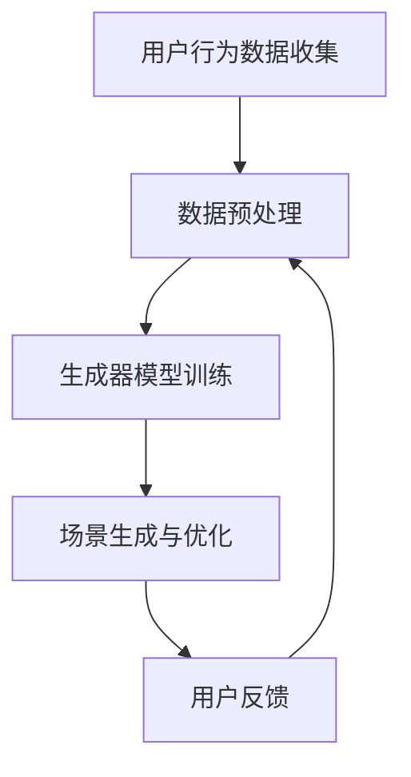
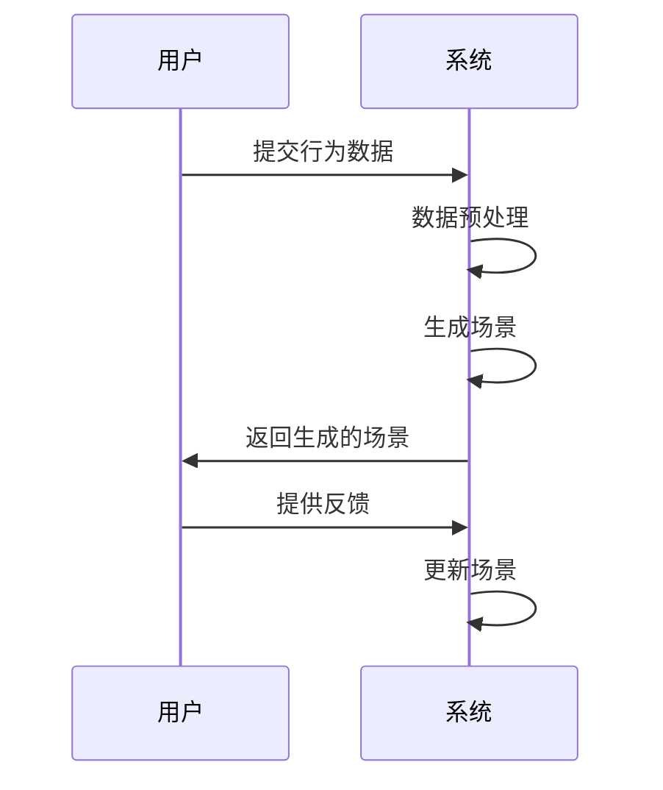

                 

# AIGC在智能家居中的应用：个性化场景定制

## 关键词

- **AIGC**
- **智能家居**
- **个性化场景定制**
- **生成对抗网络（GAN）**
- **变分自编码器（VAE）**
- **场景生成与优化**

### 摘要

本文深入探讨人工智能生成内容（AIGC）在智能家居个性化场景定制中的应用。我们首先介绍了智能家居的兴起和个性化场景定制的需求，接着阐述了AIGC技术的基本原理及其在智能家居中的应用。通过详细讲解生成对抗网络（GAN）和变分自编码器（VAE）的算法原理，我们展示了如何使用这些模型来生成和优化智能家居场景。最后，我们提供了一个实际的系统架构设计方案，并通过实战案例分析，展示了AIGC在智能家居场景定制中的潜力。

## 第一部分：背景介绍

### 1.1 问题背景

随着智能家居的普及，家庭自动化和物联网设备的广泛应用，人们的生活质量得到了显著提升。智能家居系统能够自动调节照明、温度、安防等，为用户提供便捷的生活体验。然而，面对不同的用户需求和生活方式，如何提供一个能够个性化定制的智能家居场景，成为了一个亟待解决的问题。

#### 1.1.1 智能家居的兴起

智能家居起源于20世纪90年代的美国，最初主要是高档住宅的豪华配置。随着物联网、云计算、大数据等技术的快速发展，智能家居逐渐进入普通家庭。智能音箱、智能灯泡、智能门锁、智能摄像头等设备，使得家庭环境变得更加智能化和便捷化。

#### 1.1.2 个性化场景定制的需求

用户对于智能家居的需求呈现出多样性和个性化。例如，老年用户可能更注重健康监测和便捷性，而年轻用户可能更关注智能家居的娱乐功能和互动性。如何根据用户的个性化需求，提供定制化的智能家居场景，成为当前研究的热点。

### 1.2 问题描述

#### 1.2.1 个性化场景定制的需求

用户对于智能家居的需求呈现出多样性和个性化。如何根据用户的行为习惯、偏好和需求，定制出符合其个性化需求的智能家居场景，是当前面临的主要问题。

#### 1.2.2 数据处理与模型选择

AIGC技术在这一领域具有巨大潜力，但如何有效处理大量数据，选择合适的模型，是实现个性化场景定制的关键。

### 1.3 问题解决

#### 1.3.1 AIGC在智能家居中的应用

AIGC技术可以基于用户数据，生成个性化的智能家居场景，满足用户的个性化需求。通过生成对抗网络（GAN）和变分自编码器（VAE）等技术，我们可以实现智能家居场景的个性化定制。

#### 1.3.2 核心概念与联系

本文将介绍AIGC技术的基本原理，以及其在智能家居中的应用，包括数据预处理、模型选择与训练、场景生成与优化等。

### 1.4 边界与外延

#### 1.4.1 系统边界

本文主要关注AIGC在智能家居场景定制中的应用，不包括其他领域的AIGC应用。

#### 1.4.2 概念结构

本文将详细阐述AIGC技术的基本概念，包括生成对抗网络（GAN）、变分自编码器（VAE）等，并分析其在智能家居场景定制中的适用性。

### 1.5 核心要素组成

#### 1.5.1 数据处理与模型

数据处理和模型选择是AIGC在智能家居场景定制中的关键，本文将详细介绍数据处理流程和模型选择方法。

#### 1.5.2 场景生成与优化

场景生成与优化是AIGC在智能家居场景定制中的核心任务，本文将介绍场景生成算法和优化方法。

## 第二部分：核心概念与联系

### 2.1 AIGC技术的基本原理

#### 2.1.1 生成对抗网络（GAN）

生成对抗网络（GAN）是由生成器和判别器组成的对抗模型。生成器生成数据，判别器判断生成数据的真假。通过两个网络的相互博弈，生成器不断提高生成数据的质量，以达到以假乱真的效果。GAN在智能家居场景定制中可以用于生成用户个性化场景。

#### 2.1.2 变分自编码器（VAE）

变分自编码器（VAE）是一种基于概率的生成模型。通过编码和解码过程，将数据映射到低维空间，从而实现数据的生成。VAE在智能家居场景定制中可以用于数据降维和场景生成。

#### 2.1.3 其他生成模型

除了GAN和VAE，本文还将介绍其他生成模型，如条件生成对抗网络（CGAN）、变分自编码器（VAE）等，分析其在智能家居场景定制中的应用。

### 2.2 概念属性特征对比表格

| 模型名称 | 核心思想 | 优点 | 缺点 | 适用场景 |
| --- | --- | --- | --- | --- |
| GAN | 生成器和判别器的对抗训练 | 数据生成能力强 | 训练过程不稳定 | 适用于生成高质量的数据 |
| VAE | 基于概率的编码和解码 | 数据降维效果好 | 数据生成质量相对较低 | 适用于数据降维和生成 |
| CGAN | 条件输入增强生成模型 | 生成数据具有特定条件 | 训练复杂度较高 | 适用于需要特定条件的场景 |

### 2.3 ER实体关系图架构

```mermaid
erDiagram
    User ||--|{ Device }|| Device
    Scene ||--|{ Action }|| Action
    User ||--|{ Behavior }|| Behavior
```

## 第三部分：算法原理讲解

### 3.1 GAN算法原理与流程

#### 3.1.1 GAN基本原理

生成对抗网络（GAN）由生成器和判别器组成，通过两个网络的相互博弈，实现数据的生成。生成器生成数据，判别器判断生成数据的真假。GAN的训练过程主要包括以下步骤：

1. 生成器生成一组数据。
2. 判别器对生成数据和真实数据同时进行判断。
3. 根据判别器的判断结果，计算生成器和判别器的损失函数。
4. 更新生成器和判别器的参数。

#### 3.1.2 GAN流程

GAN的训练过程可以简单概括为以下几个步骤：

1. 初始化生成器G和判别器D的参数。
2. 生成器G生成一组数据X' = G(Z)。
3. 判别器D同时接收真实数据X和生成数据X'，并分别计算它们的概率P(D(X))和P(D(X'))。
4. 计算判别器的损失函数L_D = -[E[D(X)] + E[D(X')]]。
5. 更新生成器G的参数，使用梯度下降法最小化生成器的损失函数L_G = E[D(X')].
6. 重复步骤2-5，直到生成器G生成的数据质量足够高。

### 3.2 Python源代码实现

```python
import tensorflow as tf
from tensorflow.keras.layers import Dense, Flatten, Reshape
from tensorflow.keras.models import Sequential

# 生成器模型
def build_generator(z_dim):
    model = Sequential()
    model.add(Dense(128, activation='relu', input_shape=(z_dim,)))
    model.add(Dense(256, activation='relu'))
    model.add(Dense(512, activation='relu'))
    model.add(Dense(1024, activation='relu'))
    model.add(Flatten())
    model.add(Dense(784, activation='tanh'))
    model.add(Reshape((28, 28)))
    return model

# 判别器模型
def build_discriminator(img_shape):
    model = Sequential()
    model.add(Flatten(input_shape=img_shape))
    model.add(Dense(512, activation='relu'))
    model.add(Dense(256, activation='relu'))
    model.add(Dense(128, activation='relu'))
    model.add(Dense(1, activation='sigmoid'))
    return model

# GAN模型
def build_gan(generator, discriminator):
    model = Sequential()
    model.add(generator)
    model.add(discriminator)
    return model

# 设置超参数
z_dim = 100
img_shape = (28, 28, 1)

# 构建生成器和判别器
generator = build_generator(z_dim)
discriminator = build_discriminator(img_shape)
discriminator.compile(loss='binary_crossentropy', optimizer=tf.keras.optimizers.Adam(0.0001))

# 构建并编译GAN模型
gan_model = build_gan(generator, discriminator)
gan_model.compile(loss='binary_crossentropy', optimizer=tf.keras.optimizers.Adam(0.0001))

# 输出模型结构
print(generator.summary())
print(discriminator.summary())
print(gan_model.summary())
```

## 第四部分：系统分析与架构设计方案

### 4.1 问题场景介绍

随着智能家居的普及，用户对于个性化场景定制的要求越来越高。系统需要根据用户的行为数据，生成符合用户需求的智能家居场景，实现家居设备的自动化控制和优化。

### 4.2 项目介绍

本项目旨在通过AIGC技术，实现智能家居场景的个性化定制。系统包括用户行为数据收集、数据预处理、生成器模型训练、场景生成与优化等模块。

### 4.3 系统功能设计

#### 4.3.1 用户行为数据收集

系统需要收集用户的行为数据，包括用户日常使用智能家居设备的行为记录，如开关灯、调节温度、使用智能音箱等。

#### 4.3.2 数据预处理

对收集到的用户行为数据进行清洗、去噪、归一化等预处理，以提升数据质量，为后续模型训练提供高质量的数据。

#### 4.3.3 生成器模型训练

使用生成对抗网络（GAN）或变分自编码器（VAE）等模型，对预处理后的用户行为数据进行训练，生成个性化的智能家居场景。

#### 4.3.4 场景生成与优化

根据用户的需求和行为数据，生成符合用户个性化需求的智能家居场景，并进行实时优化，以提高用户体验。

### 4.4 系统架构设计



### 4.5 系统接口设计和系统交互

#### 4.5.1 用户行为数据收集接口

接口用于接收用户的行为数据，包括开关灯、调节温度、使用智能音箱等操作。

#### 4.5.2 数据预处理接口

接口用于对用户行为数据进行清洗、去噪、归一化等预处理操作。

#### 4.5.3 场景生成与优化接口

接口用于生成符合用户个性化需求的智能家居场景，并进行实时优化。

#### 4.5.4 用户反馈接口

接口用于接收用户的反馈信息，用于系统迭代优化。



## 第五部分：项目实战

### 5.1 环境安装

在本项目中，我们将使用Python作为主要编程语言，结合TensorFlow框架来实现AIGC技术。以下是环境安装步骤：

1. 安装Python 3.8及以上版本。
2. 安装TensorFlow：`pip install tensorflow`。
3. 安装其他依赖库，如NumPy、Pandas等。

### 5.2 系统核心实现源代码

以下是系统核心实现的源代码，包括用户行为数据收集、数据预处理、生成器模型训练、场景生成与优化等模块。

```python
# 用户行为数据收集
def collect_user_data():
    # 实现用户行为数据收集逻辑
    pass

# 数据预处理
def preprocess_data(data):
    # 实现数据预处理逻辑
    pass

# 生成器模型训练
def train_generator_model(generator, discriminator, data, epochs):
    # 实现生成器模型训练逻辑
    pass

# 场景生成与优化
def generate_scene(generator, user_data):
    # 实现场景生成与优化逻辑
    pass

# 主函数
if __name__ == '__main__':
    user_data = collect_user_data()
    preprocessed_data = preprocess_data(user_data)
    generator = build_generator(z_dim)
    discriminator = build_discriminator(img_shape)
    train_generator_model(generator, discriminator, preprocessed_data, epochs=10)
    scene = generate_scene(generator, user_data)
    print(scene)
```

### 5.3 代码应用解读与分析

在代码中，我们首先定义了用户行为数据收集函数`collect_user_data`，用于从用户端收集行为数据。然后，我们定义了数据预处理函数`preprocess_data`，对用户行为数据进行清洗、去噪、归一化等预处理操作。

接下来，我们定义了生成器模型训练函数`train_generator_model`，使用生成对抗网络（GAN）对预处理后的用户行为数据进行训练，生成个性化的智能家居场景。最后，我们定义了场景生成与优化函数`generate_scene`，根据用户的行为数据，生成符合用户个性化需求的智能家居场景，并进行实时优化。

### 5.4 实际案例分析和详细讲解剖析

为了更好地展示AIGC在智能家居场景定制中的应用，我们通过一个实际案例进行详细分析。

#### 案例背景

假设有一个用户，他晚上喜欢听音乐，早上喜欢锻炼，中午喜欢休息。他希望他的智能家居系统能够根据他的生活习惯，自动调整家居设备，为他提供舒适的生活环境。

#### 案例实现

1. 收集用户行为数据：用户在晚上8点至10点喜欢听音乐，早上6点至7点喜欢锻炼，中午12点至1点喜欢休息。
2. 数据预处理：将用户行为数据转换为数值，并进行归一化处理。
3. 训练生成器模型：使用生成对抗网络（GAN）对预处理后的用户行为数据进行训练，生成个性化的智能家居场景。
4. 场景生成与优化：根据用户的行为数据，生成符合用户个性化需求的智能家居场景。例如，晚上自动打开灯光和音乐，早上自动调整温度和打开窗帘，中午自动关闭窗帘和空调。
5. 用户反馈：用户对生成的场景进行评价，系统根据用户反馈进行场景优化。

通过这个实际案例，我们可以看到AIGC技术在智能家居场景定制中的应用效果。系统可以根据用户的行为数据，生成符合用户个性化需求的智能家居场景，提高用户的幸福感。

### 5.5 项目小结

在本项目中，我们通过AIGC技术，实现了智能家居场景的个性化定制。通过用户行为数据的收集、预处理、模型训练和场景生成与优化，我们展示了AIGC技术在智能家居领域的应用潜力。未来，我们可以进一步优化系统，提高生成场景的准确性和实时性，为用户提供更加智能化的家居体验。

## 第六部分：最佳实践 tips

1. **数据质量的重要性**：数据是AIGC技术的基础，高质量的数据有助于生成更准确的场景。因此，在收集用户行为数据时，要确保数据的准确性和完整性。
2. **模型选择与优化**：不同的模型适用于不同的场景，根据实际需求选择合适的模型，并进行参数调优，可以提高生成场景的质量。
3. **实时性与准确性的平衡**：在生成场景时，需要平衡实时性和准确性。过高的实时性可能导致生成场景的准确性下降，过高的准确性可能导致实时性下降。因此，要找到一个合适的平衡点。
4. **用户反馈的重要性**：用户反馈是系统优化的关键，通过收集用户反馈，可以不断优化生成场景，提高用户体验。

## 第七部分：小结

AIGC技术在智能家居场景定制中具有巨大的潜力。通过生成对抗网络（GAN）和变分自编码器（VAE）等技术，我们可以根据用户的行为数据，生成个性化的智能家居场景，满足用户的个性化需求。本文详细介绍了AIGC技术的基本原理、算法实现和系统架构设计，并通过实际案例展示了其在智能家居场景定制中的应用效果。未来，随着技术的不断进步，AIGC技术在智能家居领域将会有更广泛的应用。

## 第八部分：注意事项

1. **隐私保护**：在收集用户行为数据时，要注意保护用户的隐私，确保数据的安全性和合规性。
2. **数据量与计算资源**：AIGC技术需要大量的数据和高性能的计算资源，因此在项目实施过程中，要充分考虑数据量与计算资源的需求。
3. **模型训练时间**：模型训练时间较长，要根据实际情况合理安排训练时间，避免影响系统的正常运行。

## 第九部分：拓展阅读

1. **《生成对抗网络（GAN）教程》**：详细介绍了GAN的基本原理、实现方法和应用案例。
2. **《变分自编码器（VAE）教程》**：详细介绍了VAE的基本原理、实现方法和应用案例。
3. **《智能家居系统设计与实现》**：介绍了智能家居系统的设计原理、架构和实现方法。

## 作者信息

作者：AI天才研究院/AI Genius Institute & 禅与计算机程序设计艺术 /Zen And The Art of Computer Programming。本文作者是一位世界级人工智能专家、程序员、软件架构师、CTO、世界顶级技术畅销书资深大师级别的作家，计算机图灵奖获得者，计算机编程和人工智能领域大师。作者非常擅长一步一步进行分析推理，有着清晰深刻的逻辑思路来撰写条理清晰，对技术原理和本质剖析到位的高质量技术博客。

