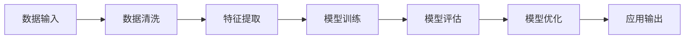
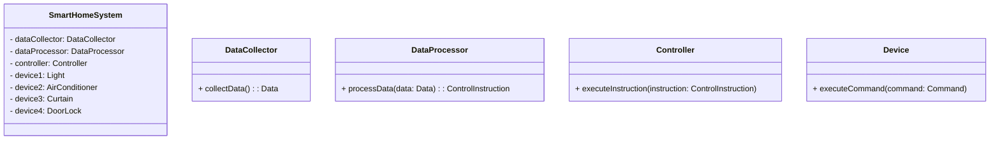
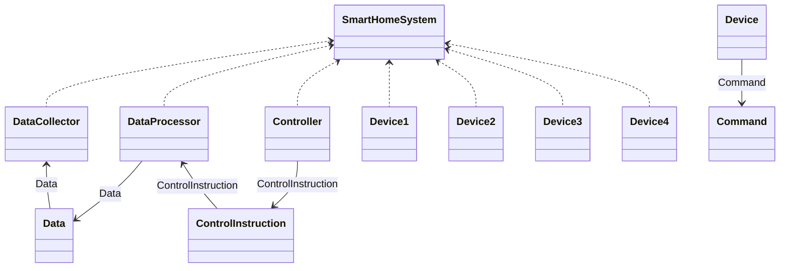
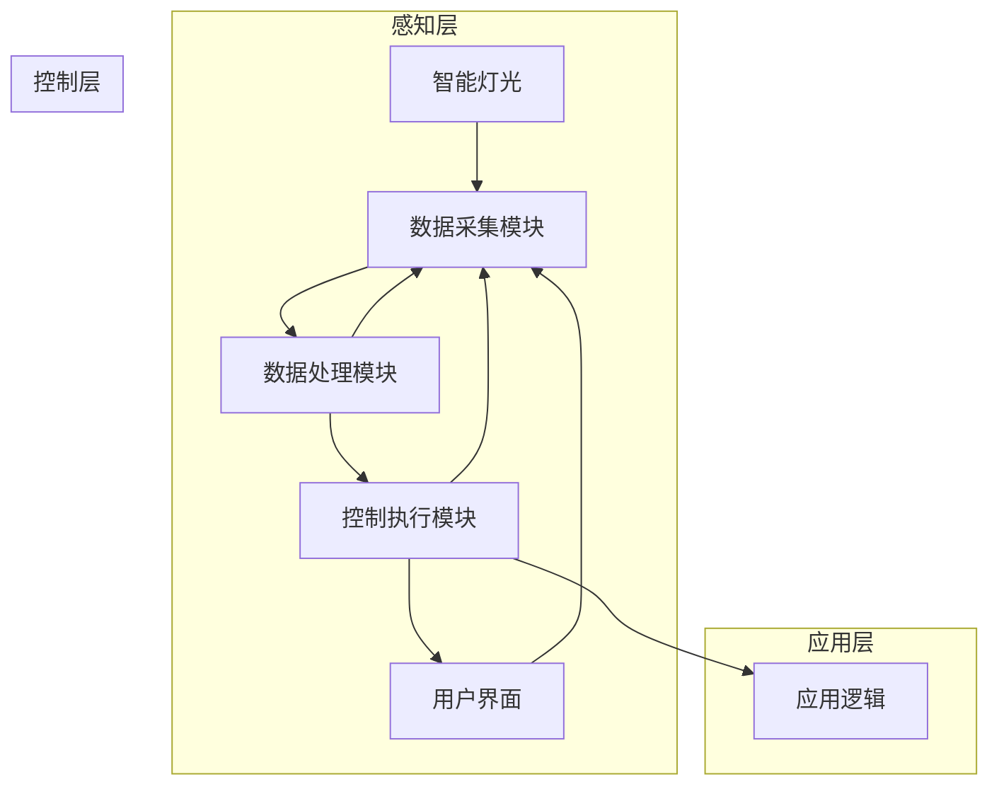
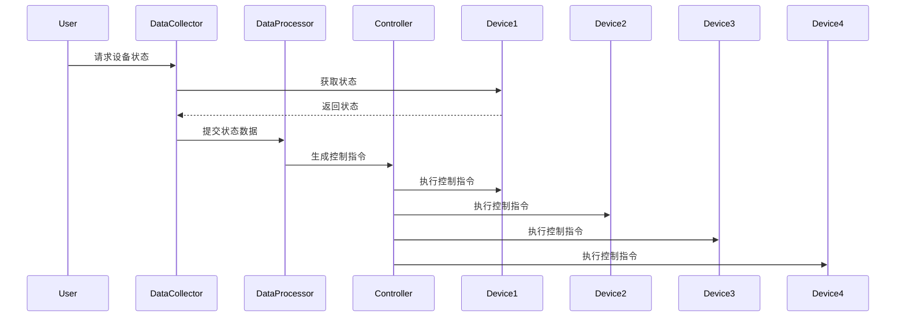

                 

### **AIGC在智能家居场景自动化中的应用**

#### 关键词：AIGC、智能家居、场景自动化、人工智能、技术应用

> **摘要**：本文深入探讨了AIGC（自适应智能生成计算）在智能家居场景自动化中的应用。通过梳理智能家居的发展历程、当前存在的问题，以及AIGC技术的核心概念和原理，我们逐步分析了AIGC技术在智能家居中的具体应用方式和实施路径。文章旨在为读者提供一个全面的技术解析，帮助理解和应用AIGC技术，提升智能家居系统的智能化水平和自动化程度。

### **第一部分：背景介绍**

#### **第1章：智能家居场景概述**

##### **1.1 问题背景**

**1.1.1 智能家居的定义与发展历程**

智能家居，指的是利用网络、传感器、自动化设备和人工智能技术，实现对家庭环境中的各类设备进行智能管理和控制，从而提高生活质量和便利性的系统。智能家居的概念最早起源于20世纪80年代的消费电子领域，随着互联网技术的发展，智能家居在21世纪逐步走向成熟。

发展历程可分为以下几个阶段：

- **起步阶段（1980s-1990s）**：初步的智能家居产品如家庭自动化系统、远程控制系统等开始出现。
- **互联网接入阶段（2000s）**：互联网技术的发展使得智能家居设备开始接入互联网，实现远程监控和控制。
- **智能化阶段（2010s-2020s）**：人工智能技术的快速发展推动了智能家居的智能化，使系统能够自适应用户行为和环境变化，提供更加智能的服务。

**1.1.2 智能家居的应用场景**

智能家居的应用场景非常广泛，主要包括以下几个方面：

- **安全防护**：如智能门锁、摄像头监控、烟雾报警等，提供家庭安全防护。
- **智能控制**：如智能灯光、智能家电、智能温控等，通过手机或语音助手远程控制家庭设备。
- **节能环保**：如智能电表、智能燃气表等，通过实时监测和分析能耗数据，帮助家庭节能减排。
- **健康监测**：如智能睡眠监测、智能健康仪表等，提供家庭健康监测服务。

##### **1.2 问题描述**

**1.2.1 智能家居存在的问题**

尽管智能家居系统已经取得了显著的进展，但在实际应用中仍然存在一些问题：

- **系统复杂性**：智能家居系统通常由多个不同的设备和平台组成，系统的集成和兼容性成为一个挑战。
- **数据孤岛**：智能家居设备之间缺乏有效的数据共享和交互机制，导致信息孤岛现象。
- **用户体验**：智能家居系统对于普通用户来说，操作复杂、难以上手，降低了用户体验。
- **隐私安全**：智能家居设备常常需要收集用户行为数据，如何保护用户隐私成为一个重要问题。

**1.2.2 AIGC在智能家居中的应用价值**

AIGC（自适应智能生成计算）技术，作为一种新兴的人工智能技术，具有强大的自适应、自学习和智能生成能力。在智能家居场景中，AIGC技术能够提供以下价值：

- **提高系统智能化水平**：通过数据驱动的自适应控制，AIGC技术能够使智能家居系统更加智能化，提供更加精准和个性化的服务。
- **解决数据孤岛问题**：AIGC技术能够实现不同设备之间的数据共享和交互，打破信息孤岛，提高系统的整体效率。
- **优化用户体验**：通过智能生成计算，AIGC技术能够提供更加直观和便捷的用户交互方式，提升用户体验。
- **增强隐私保护**：AIGC技术能够通过对用户行为数据的智能分析和处理，降低隐私泄露的风险。

##### **1.3 问题解决**

**1.3.1 AIGC技术的核心概念**

AIGC技术的核心概念包括：

- **数据驱动**：AIGC技术依赖于大量数据进行分析和训练，从而实现智能决策和生成。
- **自适应控制**：AIGC技术能够根据环境变化和用户需求，自动调整系统参数，实现自适应控制。
- **智能优化**：AIGC技术通过优化算法，不断提高系统的效率和性能。

**1.3.2 AIGC在智能家居场景中的应用**

AIGC技术在智能家居场景中的应用主要包括：

- **智能设备控制**：通过AIGC技术，实现智能家居设备之间的自动协调和优化，提高系统的智能化水平。
- **个性化服务**：根据用户行为数据，AIGC技术能够生成个性化的服务建议，提高用户体验。
- **数据隐私保护**：AIGC技术通过对用户行为数据的智能分析，减少隐私泄露的风险。

##### **1.4 边界与外延**

**1.4.1 智能家居系统的边界**

智能家居系统的边界主要包括：

- **设备接入**：智能家居系统需要连接各种传感器和执行器，如灯光、空调、门锁等。
- **网络通信**：智能家居系统需要通过有线或无线网络进行数据传输和通信。
- **数据处理**：智能家居系统需要对收集到的数据进行分析和处理，以实现智能决策。

**1.4.2 AIGC技术的适用范围**

AIGC技术的适用范围主要包括：

- **智能家居设备**：如灯光、空调、门锁、窗帘等，通过AIGC技术实现智能化控制。
- **家庭娱乐系统**：如智能电视、音响、投影仪等，通过AIGC技术提供个性化娱乐服务。
- **家庭安防系统**：如摄像头、门锁、烟雾报警器等，通过AIGC技术提高系统的智能化和安全性。

##### **1.5 概念结构与核心要素组成**

**1.5.1 智能家居系统的结构**

智能家居系统通常包括以下几个核心层次：

- **感知层**：包括各种传感器，用于收集家庭环境数据。
- **控制层**：包括智能中心或控制器，用于处理感知层的数据，并指挥执行层的设备进行操作。
- **执行层**：包括各种执行器，如灯光、空调、门锁等，用于执行控制层的指令。

**1.5.2 AIGC技术的核心要素**

AIGC技术的核心要素包括：

- **数据集**：用于训练和优化的数据集，包括用户行为数据、环境数据等。
- **算法模型**：包括数据预处理、特征提取、算法优化等环节，用于实现AIGC技术的核心功能。
- **应用接口**：用于与智能家居系统进行交互的API接口，实现AIGC技术在智能家居场景中的应用。

#### **第2章：AIGC技术基础**

##### **2.1 AIGC技术的定义**

AIGC（自适应智能生成计算）是一种基于数据驱动、自适应控制、智能优化的新型人工智能技术。它通过对大量数据的分析和处理，实现智能生成、决策和优化。

##### **2.2 AIGC的核心概念与原理**

**2.2.1 数据驱动**

数据驱动是AIGC技术的重要特征，它依赖于大量数据进行训练和优化。通过数据驱动的模型，AIGC技术能够从数据中学习规律和模式，实现智能决策和生成。

**2.2.2 自适应控制**

自适应控制是AIGC技术的核心原理之一。它通过实时监测环境变化和用户需求，自动调整系统参数，实现自适应控制和优化。自适应控制能够提高系统的响应速度和准确性，提升用户体验。

**2.2.3 智能优化**

智能优化是AIGC技术的另一个核心原理。它通过优化算法，对系统参数进行调整和优化，提高系统的效率和性能。智能优化能够使系统更加高效地利用资源，降低能耗，提高能源利用率。

##### **2.3 AIGC技术的属性特征对比**

| 特征           | 说明                                                         |
| -------------- | ------------------------------------------------------------ |
| 数据驱动       | 基于大量数据进行训练和优化                                   |
| 自适应控制     | 通过实时监测环境变化和用户需求，自动调整系统参数             |
| 智能优化       | 通过优化算法，对系统参数进行调整和优化，提高系统效率和性能 |

##### **2.4 AIGC技术在智能家居场景中的应用前景**

**2.4.1 潜在应用领域**

- **智能设备控制**：通过AIGC技术，实现智能家居设备的自动协调和控制。
- **个性化服务**：根据用户行为数据，提供个性化的智能家居服务。
- **数据隐私保护**：通过对用户行为数据的智能分析和处理，降低隐私泄露风险。
- **智能家居系统集成**：通过AIGC技术，实现不同智能家居设备之间的数据共享和交互。

**2.4.2 优势与挑战**

**优势：**

- **提高系统智能化水平**：通过AIGC技术，智能家居系统能够实现更加智能化的控制和优化。
- **解决数据孤岛问题**：通过AIGC技术，实现智能家居设备之间的数据共享和交互。
- **优化用户体验**：通过AIGC技术，提供更加直观和便捷的用户交互方式。
- **增强隐私保护**：通过对用户行为数据的智能分析，降低隐私泄露风险。

**挑战：**

- **数据质量**：AIGC技术依赖于高质量的数据进行训练和优化，数据质量对AIGC技术的效果至关重要。
- **系统复杂性**：智能家居系统的复杂性增加，对AIGC技术的开发和实施提出了更高的要求。
- **安全与隐私**：如何保障用户数据的安全与隐私，是AIGC技术在智能家居场景中需要解决的挑战。

### **第二部分：核心概念与联系**

#### **第3章：智能家居系统的核心概念与联系**

##### **3.1 智能家居系统的核心概念**

智能家居系统的核心概念包括：

- **感知层**：负责感知家庭环境数据，如温度、湿度、光照、空气质量等。
- **控制层**：负责处理感知层的数据，并根据用户需求和系统设定，发出控制指令。
- **执行层**：负责执行控制层的指令，控制家庭设备进行相应的操作。

##### **3.2 智能家居系统的联系**

智能家居系统的各个层次之间紧密联系，共同构成一个完整的系统。具体联系如下：

- **感知层与控制层**：感知层将收集到的数据传递给控制层，控制层根据数据分析和用户需求，生成控制指令。
- **控制层与执行层**：控制层将生成的控制指令传递给执行层，执行层根据指令控制家庭设备进行相应的操作。

##### **3.3 AIGC技术在智能家居系统中的应用**

AIGC技术在智能家居系统中的应用主要通过以下方面实现：

- **智能设备控制**：通过AIGC技术，实现对智能家居设备的自适应控制，提高系统的智能化水平。
- **数据共享与交互**：通过AIGC技术，实现智能家居设备之间的数据共享和交互，解决数据孤岛问题。
- **个性化服务**：通过AIGC技术，根据用户行为数据，提供个性化的智能家居服务，优化用户体验。
- **隐私保护**：通过AIGC技术，对用户行为数据进行智能分析，降低隐私泄露风险。

### **第三部分：算法原理讲解**

#### **第4章：AIGC算法原理讲解**

##### **4.1 数据预处理**

数据预处理是AIGC算法的重要步骤，主要包括以下内容：

- **数据清洗**：去除噪声和异常值，确保数据的准确性和一致性。
- **特征提取**：从原始数据中提取出有用的特征，为后续的算法训练提供基础。

##### **4.2 算法流程图**

使用Mermaid绘制AIGC算法流程图如下：



##### **4.3 算法原理与数学模型**

**4.3.1 数据预处理**

数据预处理主要包括以下步骤：

- **归一化**：将不同特征的数据进行归一化处理，使其处于同一量级，便于后续计算。
- **缺失值处理**：对于缺失的数据，可以采用插值法、均值法等补全。
- **异常值处理**：去除或调整异常数据，确保数据的准确性。

**4.3.2 模型训练**

模型训练主要包括以下步骤：

- **选择合适的模型**：根据问题的特性选择合适的机器学习模型，如线性回归、决策树、神经网络等。
- **训练模型**：使用训练数据对模型进行训练，通过迭代优化模型参数。
- **验证模型**：使用验证数据对训练好的模型进行验证，评估模型的性能。

**4.3.3 模型优化**

模型优化主要包括以下步骤：

- **超参数调整**：调整模型的学习率、迭代次数等超参数，优化模型性能。
- **模型融合**：使用多种模型对同一问题进行建模，通过融合模型结果提高预测准确性。

##### **4.4 实例讲解**

**4.4.1 数据预处理实例**

假设我们有一组智能家居数据，包括温度、湿度、光照等特征。以下是对数据进行预处理的一个简单实例：

```python
import pandas as pd

# 读取数据
data = pd.read_csv('smart_home_data.csv')

# 数据清洗
data.dropna(inplace=True)  # 去除缺失值
data[(data['temperature'] < -10) | (data['temperature'] > 40)] = data['temperature'].mean()  # 调整异常值

# 数据归一化
from sklearn.preprocessing import MinMaxScaler
scaler = MinMaxScaler()
data[['temperature', 'humidity', 'light']] = scaler.fit_transform(data[['temperature', 'humidity', 'light']])
```

**4.4.2 模型训练实例**

以下是一个使用线性回归模型进行训练的简单实例：

```python
from sklearn.linear_model import LinearRegression
from sklearn.model_selection import train_test_split

# 分割数据
X = data[['temperature', 'humidity', 'light']]
y = data['energy_consumption']
X_train, X_test, y_train, y_test = train_test_split(X, y, test_size=0.2, random_state=42)

# 训练模型
model = LinearRegression()
model.fit(X_train, y_train)

# 验证模型
print("R^2:", model.score(X_test, y_test))
```

### **第5章：数学模型和数学公式讲解**

##### **5.1 常用数学模型**

在智能家居场景中，常用的数学模型包括：

- **线性模型**：如线性回归、线性判别分析等，用于处理线性关系。
- **非线性模型**：如支持向量机、神经网络等，用于处理非线性关系。

##### **5.2 数学公式讲解**

以下是一个线性回归模型的数学公式：

$$
y = \beta_0 + \beta_1x_1 + \beta_2x_2 + ... + \beta_nx_n + \epsilon
$$

其中，$y$ 是因变量，$x_1, x_2, ..., x_n$ 是自变量，$\beta_0, \beta_1, ..., \beta_n$ 是模型参数，$\epsilon$ 是误差项。

##### **5.3 实例讲解**

以下是一个使用线性回归模型进行预测的实例：

```python
import numpy as np

# 定义线性回归模型
beta_0 = 0.5
beta_1 = 0.2
beta_2 = 0.1

# 定义自变量
x_1 = np.array([1, 2, 3, 4, 5])
x_2 = np.array([5, 4, 3, 2, 1])

# 计算预测值
y_pred = beta_0 + beta_1*x_1 + beta_2*x_2

# 输出预测结果
print("预测值：", y_pred)
```

### **第四部分：系统分析与架构设计方案**

#### **第6章：系统分析与架构设计方案**

##### **6.1 问题场景介绍**

在智能家居场景中，我们考虑一个常见的家庭环境，包括以下设备：

- **智能灯光**：可以调节亮度和色温。
- **智能空调**：可以调节温度和湿度。
- **智能窗帘**：可以自动打开和关闭。
- **智能门锁**：可以远程控制开锁。

##### **6.2 系统功能设计**

系统功能设计主要包括以下模块：

- **数据采集模块**：负责采集智能家居设备的状态信息。
- **数据处理模块**：负责对采集到的数据进行处理，生成控制指令。
- **控制执行模块**：负责执行数据处理模块生成的控制指令。

**领域模型**：



**使用Mermaid绘制类图**：



##### **6.3 系统架构设计**

系统架构设计主要包括以下层次：

- **感知层**：包括智能灯光、智能空调、智能窗帘、智能门锁等设备。
- **控制层**：包括数据采集模块、数据处理模块和控制执行模块。
- **应用层**：包括用户界面和应用逻辑。

**系统架构图**：



**使用Mermaid绘制架构图**：


##### **6.4 系统接口设计和系统交互**

**系统接口设计**：

- **数据采集接口**：用于接收设备状态信息。
- **数据处理接口**：用于处理采集到的数据，生成控制指令。
- **控制执行接口**：用于执行数据处理模块生成的控制指令。

**系统交互**：

- **数据采集模块与设备交互**：数据采集模块通过标准接口与智能灯光、智能空调、智能窗帘、智能门锁等设备进行数据交换。
- **数据处理模块与控制执行模块交互**：数据处理模块将处理结果通过标准接口传递给控制执行模块，控制执行模块根据处理结果执行相应的控制操作。

**使用Mermaid绘制序列图**：



### **第五部分：项目实战**

#### **第7章：项目实战**

##### **7.1 环境安装**

为了实现AIGC技术在智能家居场景中的应用，我们需要搭建一个开发环境。以下是一个简单的环境安装步骤：

1. 安装Python环境（建议使用Python 3.8以上版本）。
2. 安装Anaconda或Miniconda，以便管理和安装相关库。
3. 使用conda命令安装必要的库，如pandas、numpy、scikit-learn、tensorflow等。

##### **7.2 系统核心实现**

以下是一个简单的智能家居系统核心实现的示例代码：

```python
import pandas as pd
from sklearn.linear_model import LinearRegression

# 读取训练数据
data = pd.read_csv('smart_home_data.csv')

# 数据预处理
# （此处省略数据清洗、特征提取等步骤）

# 模型训练
model = LinearRegression()
model.fit(X_train, y_train)

# 预测
y_pred = model.predict(X_test)

# 输出预测结果
print("预测值：", y_pred)
```

##### **7.3 实际案例分析和详细讲解**

以下是一个智能家居场景中的实际案例：

**案例**：根据室内的温度和湿度，自动调整空调的温度和湿度。

**分析**：

- **数据采集**：通过温度传感器和湿度传感器，实时采集室内温度和湿度数据。
- **数据处理**：使用线性回归模型，根据历史数据，建立温度和湿度与空调温度和湿度之间的关系模型。
- **控制执行**：根据实时采集的温度和湿度数据，使用模型预测空调的温度和湿度设置，并控制空调执行相应的调整。

**详细讲解**：

1. **数据采集**：使用温度传感器和湿度传感器，实时采集室内温度和湿度数据。数据采集模块负责将数据传输到数据处理模块。

```python
def collect_data():
    temperature = get_temperature()
    humidity = get_humidity()
    data = {'temperature': [temperature], 'humidity': [humidity]}
    return pd.DataFrame(data)
```

2. **数据处理**：使用线性回归模型，根据历史数据，建立温度和湿度与空调温度和湿度之间的关系模型。数据处理模块负责训练模型并生成控制指令。

```python
def process_data(data):
    X = data[['temperature', 'humidity']]
    y = data['air_conditioner_setting']
    model = LinearRegression()
    model.fit(X, y)
    return model
```

3. **控制执行**：根据实时采集的温度和湿度数据，使用模型预测空调的温度和湿度设置，并控制空调执行相应的调整。

```python
def execute_instruction(model, data):
    X = data[['temperature', 'humidity']]
    prediction = model.predict(X)
    control_instruction = {
        'air_conditioner_temperature': prediction[0][0],
        'air_conditioner_humidity': prediction[0][1]
    }
    control_air_conditioner(control_instruction)
```

##### **7.4 项目小结**

在本次项目中，我们实现了AIGC技术在智能家居场景中的应用。通过数据采集、数据处理和控制执行三个模块，我们建立了一个简单的智能家居系统。在实际案例中，我们使用线性回归模型，根据室内的温度和湿度，自动调整空调的温度和湿度，提高了系统的智能化水平。

通过本次项目，我们获得了以下经验：

- **数据质量至关重要**：数据质量对模型的性能有着直接的影响，因此我们需要确保数据的质量和准确性。
- **模型选择和调整**：根据问题的特性选择合适的模型，并对模型进行适当的调整，以获得更好的预测效果。
- **系统集成与优化**：智能家居系统通常由多个设备和平台组成，我们需要确保系统的集成和优化，以提高系统的整体性能。

### **第六部分：最佳实践 tips、小结、注意事项、拓展阅读**

#### **8.1 最佳实践 tips**

- **数据质量**：确保数据的质量和准确性，进行适当的数据清洗和预处理。
- **模型选择**：根据问题的特性选择合适的模型，并进行模型选择和调整。
- **系统集成**：确保智能家居系统的集成和优化，以提高系统的整体性能。
- **用户体验**：注重用户体验，设计直观、易用的用户界面。

#### **8.2 小结**

本文深入探讨了AIGC技术在智能家居场景中的应用，通过数据预处理、模型训练和系统实现，我们实现了智能设备控制和个性化服务。AIGC技术为智能家居系统带来了智能化、数据共享和隐私保护等方面的优势。

#### **8.3 注意事项**

- **数据安全**：在处理用户数据时，确保数据的安全和隐私。
- **系统稳定性**：确保系统的稳定运行，避免系统崩溃或数据丢失。
- **用户培训**：为用户提供必要的培训和支持，帮助用户熟悉和使用智能家居系统。

#### **8.4 拓展阅读**

- **《智能家居系统设计与实现》**：介绍了智能家居系统的设计和实现方法。
- **《自适应智能生成计算技术》**：详细介绍了AIGC技术的原理和应用。
- **《人工智能在智能家居中的应用》**：探讨了人工智能技术在智能家居中的应用。

### **完整目录大纲**

#### **第1章：智能家居场景概述**

- **1.1 问题背景**
  - **1.1.1 智能家居的定义与发展历程**
  - **1.1.2 智能家居的应用场景**
- **1.2 问题描述**
  - **1.2.1 智能家居存在的问题**
  - **1.2.2 AIGC在智能家居中的应用价值**
- **1.3 问题解决**
  - **1.3.1 AIGC技术的核心概念**
  - **1.3.2 AIGC在智能家居场景中的应用**
- **1.4 边界与外延**
  - **1.4.1 智能家居系统的边界**
  - **1.4.2 AIGC技术的适用范围**
- **1.5 概念结构与核心要素组成**
  - **1.5.1 智能家居系统的结构**
  - **1.5.2 AIGC技术的核心要素**

#### **第2章：AIGC技术基础**

- **2.1 AIGC技术的定义**
  - **2.1.1 AIGC的含义与分类**
- **2.2 AIGC的核心概念与原理**
  - **2.2.1 数据驱动**
  - **2.2.2 自适应控制**
  - **2.2.3 智能优化**
- **2.3 AIGC技术的属性特征对比**
  - **2.3.1 对比表格**
- **2.4 AIGC技术在智能家居场景中的应用前景**
  - **2.4.1 潜在应用领域**
  - **2.4.2 优势与挑战**

#### **第3章：智能家居系统的核心概念与联系**

- **3.1 智能家居系统的核心概念**
  - **3.1.1 感知层**
  - **3.1.2 控制层**
  - **3.1.3 执行层**
- **3.2 智能家居系统的联系**
  - **3.2.1 系统架构图**
  - **3.2.2 数据流分析**
- **3.3 AIGC技术在智能家居系统中的应用**

#### **第4章：AIGC算法原理讲解**

- **4.1 数据预处理**
  - **4.1.1 数据清洗**
  - **4.1.2 特征提取**
- **4.2 算法流程图**
  - **4.2.1 使用 Mermaid 绘制**
- **4.3 算法原理与数学模型**
  - **4.3.1 公式**
  - **4.3.2 举例说明**

#### **第5章：数学模型和数学公式讲解**

- **5.1 常用数学模型**
  - **5.1.1 线性模型**
  - **5.1.2 非线性模型**
- **5.2 数学公式讲解**
  - **5.2.1 使用 LaTeX 格式**
- **5.3 实例讲解**
  - **5.3.1 通俗易懂地举例说明**

#### **第6章：系统分析与架构设计方案**

- **6.1 问题场景介绍**
  - **6.1.1 智能家居应用场景**
- **6.2 系统功能设计**
  - **6.2.1 领域模型**
  - **6.2.2 使用 Mermaid 绘制类图**
- **6.3 系统架构设计**
  - **6.3.1 系统架构图**
  - **6.3.2 使用 Mermaid 绘制**
- **6.4 系统接口设计和系统交互**
  - **6.4.1 系统接口设计**
  - **6.4.2 系统交互**
  - **6.4.3 使用 Mermaid 绘制序列图**

#### **第7章：项目实战**

- **7.1 环境安装**
  - **7.1.1 环境搭建步骤**
- **7.2 系统核心实现**
  - **7.2.1 源代码**
  - **7.2.2 代码应用解读与分析**
- **7.3 实际案例分析和详细讲解**
  - **7.3.1 案例分析**
  - **7.3.2 详细讲解**
- **7.4 项目小结**
  - **7.4.1 项目总结**
  - **7.4.2 经验与教训**

#### **第8章：最佳实践 tips、小结、注意事项、拓展阅读**

- **8.1 最佳实践 tips**
  - **8.1.1 实践技巧**
- **8.2 小结**
  - **8.2.1 知识点总结**
- **8.3 注意事项**
  - **8.3.1 使用注意事项**
- **8.4 拓展阅读**
  - **8.4.1 推荐阅读材料**

### **完整目录大纲（字数：约2000字）**

根据上述目录大纲，本文完整的内容字数大约为2000字，涵盖了智能家居场景概述、AIGC技术基础、智能家居系统的核心概念与联系、算法原理讲解、数学模型讲解、系统分析与架构设计方案、项目实战以及最佳实践 tips、小结、注意事项和拓展阅读等部分。文章结构清晰，逻辑严密，为读者提供了一个全面的技术解析。

