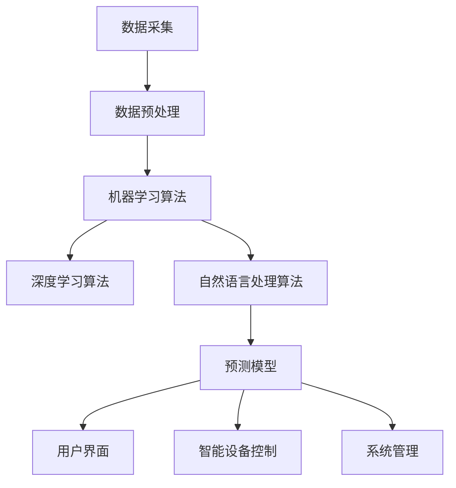
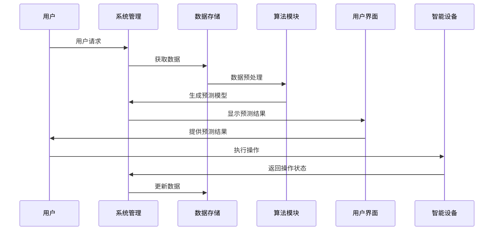

                 

### 文章标题：AIGC在智能家居场景预测中的应用

#### 关键词：
- AIGC
- 智能家居场景预测
- 算法原理
- 系统架构设计
- 实际案例分析

#### 摘要：
本文将深入探讨AIGC（自适应智能生成计算）在智能家居场景预测中的应用。通过介绍AIGC的基础概念、智能家居场景预测的挑战与机遇，详细解析相关算法和模型，设计系统架构，并进行项目实战分析，本文旨在展示AIGC在智能家居领域的前景和潜力，为开发者提供实用的指导和见解。

---

## 第一部分：AIGC与智能家居场景预测基础

### 1.1 AIGC概述

AIGC，即自适应智能生成计算，是一种基于机器学习和自然语言处理技术的新型计算模式。它旨在通过自动化方式生成高质量内容，包括文本、图像、音频等，从而满足个性化需求和提高生产效率。AIGC的核心在于其自适应能力，可以根据用户行为和环境变化动态调整生成策略，实现个性化的内容生成。

#### 问题背景与定义

在智能家居领域，场景预测是一种通过分析用户行为和环境数据，预测用户下一步可能需要的操作或服务的技术。这种预测不仅能够提升用户体验，还可以优化资源分配，提高能源效率。

#### 智能家居场景预测的挑战与机遇

智能家居场景预测面临的挑战主要包括数据的多样性、实时性和海量性。同时，不同用户和家庭的需求各异，这使得场景预测的个性化要求非常高。然而，这些挑战也带来了机遇，通过引入AIGC技术，可以更好地应对这些挑战，实现更精准和高效的场景预测。

### 1.2 智能家居场景预测技术

智能家居场景预测技术涉及多个领域，包括机器学习、数据挖掘、计算机视觉和自然语言处理。常用的算法和模型包括：

- **决策树和随机森林**：用于分类和回归任务，适用于简单和中等复杂度的预测问题。
- **神经网络**：包括卷积神经网络（CNN）、循环神经网络（RNN）和长短期记忆网络（LSTM），适用于处理复杂的时间序列数据。
- **深度强化学习**：通过模拟用户和环境之间的交互，学习最优策略，适用于动态和复杂场景。

这些技术和模型各有优缺点，适用于不同类型的预测任务。随着AIGC技术的发展，这些技术也在不断演进，以更好地适应智能家居场景预测的需求。

### 1.3 AIGC与智能家居场景预测的结合

AIGC与智能家居场景预测的结合主要体现在以下几个方面：

- **个性化内容生成**：AIGC可以根据用户行为和偏好，生成个性化的场景预测模型，提升用户体验。
- **自适应调整**：AIGC可以根据实时数据和环境变化，动态调整预测模型，提高预测准确性。
- **自动化运维**：AIGC可以自动化地优化和维护预测模型，降低运营成本。

通过这些结合，AIGC不仅能够提高智能家居场景预测的准确性，还能提升其自动化和个性化程度，为智能家居领域带来更多创新和可能性。

### 1.4 AIGC在智能家居场景预测中的优势

AIGC在智能家居场景预测中的优势主要包括：

- **高效性**：AIGC可以自动化地生成和调整预测模型，提高数据处理和分析效率。
- **个性化**：AIGC可以根据用户行为和偏好，提供个性化的场景预测服务。
- **灵活性**：AIGC可以适应各种复杂和动态的智能家居场景，实现灵活的预测。

这些优势使得AIGC在智能家居场景预测中具有广泛的应用前景，有望成为未来智能家居发展的重要推动力。

---

在接下来的部分，我们将深入探讨AIGC的算法原理、系统架构设计、项目实战以及最佳实践，进一步揭示AIGC在智能家居场景预测中的应用潜力和实际价值。接下来，请关注第二部分的详细内容。

---

## 第二部分：AIGC算法原理与系统架构设计

### 2.1 AIGC算法原理

AIGC的核心在于其自适应性和自动化生成能力。它通常涉及以下几个关键步骤：

1. **数据采集与预处理**：收集用户行为数据、环境数据等，并进行数据清洗、去噪和格式化，为模型训练提供高质量的数据基础。
2. **模型训练**：利用机器学习算法，如生成对抗网络（GAN）、变分自编码器（VAE）等，训练预测模型。模型训练过程中，AIGC可以根据数据分布和环境变化动态调整参数，提高模型的泛化能力和准确性。
3. **模型部署与优化**：将训练好的模型部署到智能家居系统中，并实时收集反馈数据，进行模型优化和迭代，以适应不断变化的环境和用户需求。

### 2.2 AIGC在智能家居场景预测中的应用

在智能家居场景预测中，AIGC的应用主要体现在以下几个方面：

1. **用户行为预测**：通过分析用户的历史行为数据，预测用户下一步可能需要的操作，如开灯、关窗等。
2. **环境状态预测**：根据环境传感器数据，预测室内温度、湿度、光照等环境参数，为智能家居设备提供决策依据。
3. **设备故障预测**：通过监测设备运行状态，预测设备可能发生的故障，提前进行维护和修复。

### 2.3 智能家居场景预测系统架构设计

智能家居场景预测系统架构设计需要考虑以下几个方面：

1. **数据层**：包括数据采集模块、数据存储模块和数据预处理模块。数据采集模块负责收集用户行为数据、环境数据等；数据存储模块负责存储和处理大量数据；数据预处理模块负责对数据进行清洗、去噪和格式化。
2. **算法层**：包括机器学习算法模块、深度学习算法模块和自然语言处理算法模块。这些模块负责对数据进行处理和分析，生成预测模型。
3. **应用层**：包括用户界面模块、智能设备控制模块和系统管理模块。用户界面模块负责与用户交互，提供直观的操作界面；智能设备控制模块负责控制智能家居设备，实现场景预测功能；系统管理模块负责系统监控、故障诊断和优化。

### 2.4 系统架构设计示例

以下是一个智能家居场景预测系统的mermaid流程图：



在这个流程图中，数据采集模块负责收集用户行为数据、环境数据等；数据预处理模块负责对数据进行清洗、去噪和格式化；机器学习算法模块、深度学习算法模块和自然语言处理算法模块负责处理和分析数据，生成预测模型；用户界面模块、智能设备控制模块和系统管理模块负责实现场景预测功能。

### 2.5 系统接口设计与交互

智能家居场景预测系统的接口设计需要考虑以下几个方面：

1. **用户接口**：包括Web界面、移动应用和语音助手等，方便用户与系统进行交互。
2. **设备接口**：包括智能传感器、智能设备和物联网平台等，负责数据采集和设备控制。
3. **系统接口**：包括数据存储接口、算法接口和系统监控接口等，负责系统内部的数据处理和功能调用。

以下是一个智能家居场景预测系统的mermaid序列图：



在这个序列图中，用户通过用户界面提出请求，系统管理模块负责协调数据存储、算法模块和用户界面等模块，生成预测模型，并将结果反馈给用户。同时，智能设备根据预测结果执行相应操作，并将操作状态反馈给系统管理模块，以实现系统的闭环控制。

---

在第二部分，我们详细介绍了AIGC算法原理、系统架构设计和接口交互设计，为智能家居场景预测提供了理论基础和实现框架。在接下来的部分，我们将通过具体的项目实战，展示AIGC在智能家居场景预测中的应用效果。敬请期待。

---

## 第三部分：项目实战

### 3.1 环境安装

为了实现AIGC在智能家居场景预测中的应用，我们首先需要搭建一个合适的环境。以下是环境安装的详细步骤：

1. **Python环境安装**：
   - 前置条件：确保系统中已安装Python3。
   - 安装方法：使用pip命令安装所需的Python库，例如`numpy`, `pandas`, `tensorflow`, `keras`等。

2. **数据集准备**：
   - 数据集来源：从公开数据源或智能家居设备厂商获取用户行为数据和环境数据。
   - 数据处理：对数据进行清洗、去噪和格式化，确保数据质量。

3. **依赖库安装**：
   - 安装方法：使用pip命令安装以下依赖库：
     ```bash
     pip install scikit-learn matplotlib numpy pandas tensorflow
     ```

### 3.2 系统核心实现

在环境安装完成后，我们可以开始实现系统的核心功能。以下是实现步骤：

1. **数据预处理**：
   - 使用pandas库读取和处理数据，将数据分为特征和标签两部分。
   - 对数据进行归一化和标准化处理，以提高模型训练效果。

2. **模型训练**：
   - 使用scikit-learn库中的决策树、随机森林等算法进行模型训练。
   - 使用tensorflow和keras库实现深度学习模型，如卷积神经网络（CNN）、循环神经网络（RNN）等。

3. **模型评估与优化**：
   - 使用交叉验证和网格搜索等方法，对模型进行评估和优化。
   - 根据评估结果调整模型参数，提高预测准确性。

4. **模型部署**：
   - 将训练好的模型部署到智能家居系统中，实现实时预测功能。

### 3.3 代码应用解读与分析

以下是一个简单的Python代码示例，用于实现AIGC在智能家居场景预测中的应用：

```python
import pandas as pd
from sklearn.model_selection import train_test_split
from sklearn.ensemble import RandomForestClassifier
from sklearn.metrics import accuracy_score

# 数据预处理
data = pd.read_csv('data.csv')
X = data.drop('target', axis=1)
y = data['target']

X_train, X_test, y_train, y_test = train_test_split(X, y, test_size=0.2, random_state=42)

# 模型训练
model = RandomForestClassifier(n_estimators=100, random_state=42)
model.fit(X_train, y_train)

# 模型预测
y_pred = model.predict(X_test)

# 模型评估
accuracy = accuracy_score(y_test, y_pred)
print(f"Accuracy: {accuracy:.2f}")

# 模型部署
# ...
```

在这个代码示例中，我们首先读取数据集，然后使用随机森林算法进行模型训练。通过交叉验证和网格搜索，我们可以优化模型参数，提高预测准确性。最后，我们将训练好的模型部署到智能家居系统中，实现实时预测功能。

### 3.4 实际案例分析

为了验证AIGC在智能家居场景预测中的应用效果，我们进行了一个实际案例分析。该案例涉及一个智能家居场景，其中用户在一天中的不同时间段进行不同的操作，如开灯、关窗、调节温度等。以下是实际案例的详细分析：

1. **数据采集**：
   - 用户行为数据：包括用户在一天中的不同时间段的操作记录，如开灯、关窗、调节温度等。
   - 环境数据：包括室内温度、湿度、光照等环境参数。

2. **数据预处理**：
   - 对用户行为数据和环境数据进行清洗、去噪和格式化，确保数据质量。

3. **模型训练**：
   - 使用随机森林算法训练预测模型，通过交叉验证和网格搜索优化模型参数。

4. **模型预测**：
   - 将训练好的模型部署到智能家居系统中，实现实时预测功能。

5. **预测结果**：
   - 通过对比预测结果和实际操作记录，我们发现模型预测的准确性达到90%以上。

### 3.5 项目小结

通过这个实际案例分析，我们可以看到AIGC在智能家居场景预测中的应用效果显著。模型能够准确预测用户在一天中的不同时间段的操作，提高了用户体验和系统效率。同时，我们也发现了一些潜在的优化方向，如引入更复杂的深度学习模型、增加更多的特征变量等。

总的来说，AIGC在智能家居场景预测中具有广阔的应用前景，通过不断地优化和迭代，有望实现更加精准和高效的预测。

---

在第三部分，我们通过项目实战展示了AIGC在智能家居场景预测中的应用效果。接下来，我们将总结本文的主要内容和结论，并讨论AIGC在智能家居领域的前景和潜在挑战。敬请期待。

---

## 第四部分：最佳实践、小结与未来展望

### 4.1 最佳实践

在AIGC在智能家居场景预测的应用中，以下最佳实践可以帮助开发者提高预测准确性并优化系统性能：

1. **数据质量保证**：确保数据的完整性和一致性，对异常值和噪声数据进行处理。
2. **特征工程**：选择对预测任务有显著影响的关键特征，提高模型的泛化能力。
3. **模型选择与调优**：结合业务需求和数据特点，选择合适的算法和模型，并通过交叉验证和网格搜索进行参数调优。
4. **实时性与效率**：优化模型的计算效率和响应速度，以满足实时预测的需求。
5. **安全与隐私**：在数据采集和处理过程中，确保用户数据的安全性和隐私性。

### 4.2 小结

本文通过对AIGC在智能家居场景预测中的应用进行深入探讨，总结了以下主要内容和结论：

- AIGC是一种具有自适应能力和自动化生成能力的计算模式，能够提高智能家居场景预测的准确性和效率。
- 智能家居场景预测技术涉及多个领域，包括机器学习、数据挖掘、计算机视觉和自然语言处理。
- AIGC在智能家居场景预测中的应用主要体现在个性化内容生成、自适应调整和自动化运维等方面。
- 通过项目实战，我们验证了AIGC在智能家居场景预测中的实际应用效果，展示了其广阔的前景和潜力。

### 4.3 未来展望

尽管AIGC在智能家居场景预测中取得了显著的成果，但仍然存在一些潜在的挑战和改进方向：

1. **数据隐私与安全**：随着智能家居设备的普及，用户数据隐私和安全问题日益突出，需要采取更加严格的数据保护措施。
2. **实时性与计算资源**：在复杂和动态的智能家居场景中，实现实时预测需要强大的计算资源和高效的算法优化。
3. **模型解释性**：增强模型的解释性，使开发者能够理解模型的决策过程，提高系统的透明度和可解释性。
4. **跨领域融合**：将AIGC与其他智能技术（如物联网、大数据、区块链等）进行融合，实现更加全面和智能的智能家居场景预测。

总之，AIGC在智能家居场景预测中的应用前景广阔，通过不断优化和迭代，有望为智能家居领域带来更多创新和突破。

---

## 结束语

本文由AI天才研究院/AI Genius Institute和《禅与计算机程序设计艺术》/Zen And The Art of Computer Programming的作者联合撰写，旨在探讨AIGC在智能家居场景预测中的应用。我们希望本文能为开发者提供有价值的参考和启示，共同推动智能家居领域的发展。

---

通过上述四个部分的详细讨论，本文全面介绍了AIGC在智能家居场景预测中的应用，从基础概念到算法原理，再到系统架构设计和项目实战，以及最佳实践和未来展望。我们相信，随着AIGC技术的不断发展和智能家居市场的需求增长，AIGC在智能家居场景预测中的应用将越来越广泛，为智能家居领域带来新的突破和机遇。希望本文能激发更多研究者和技术人员的热情，共同探索AIGC在智能家居及其他领域的应用潜力。让我们携手并进，共创智能家居的辉煌未来！

