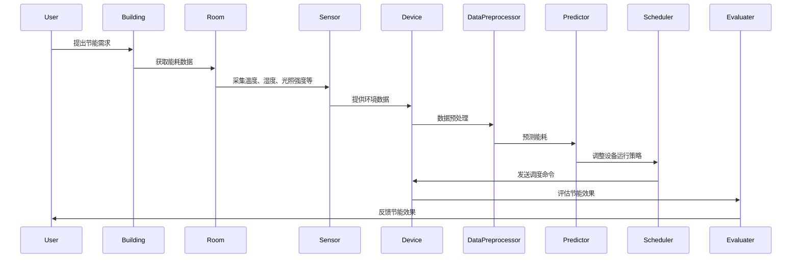
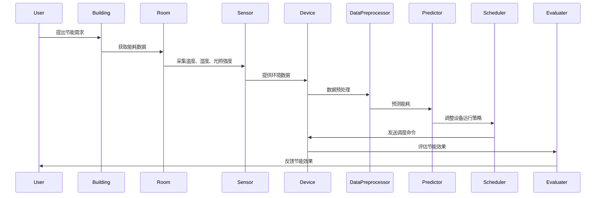
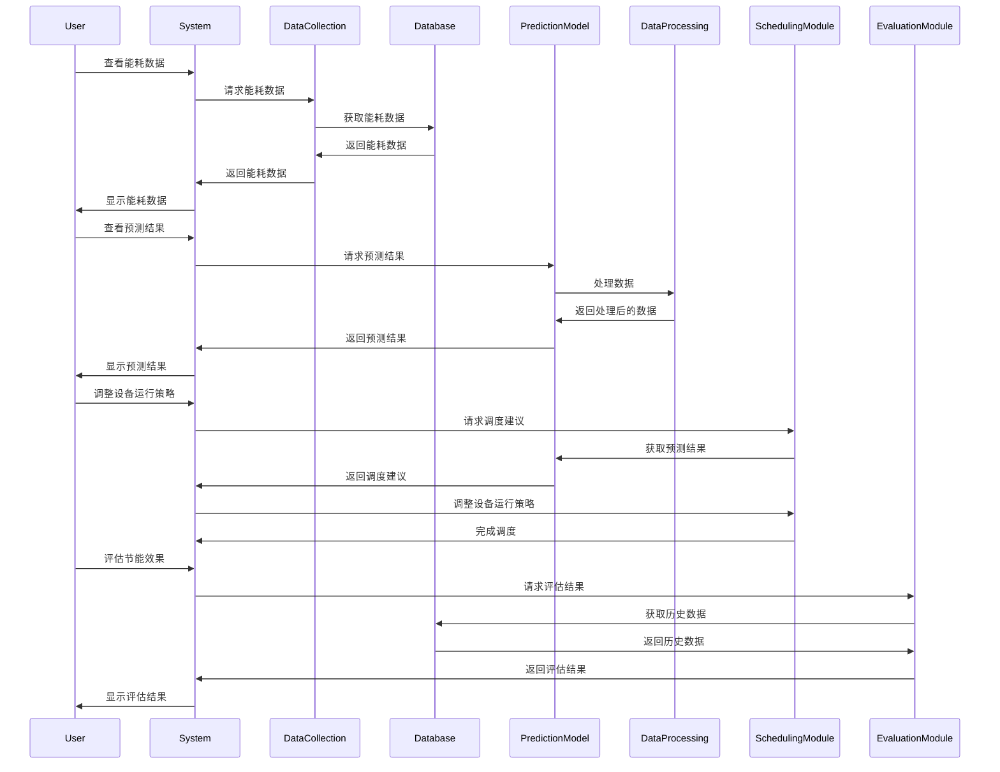

                 

### AIGC技术在智能建筑节能设计中的基本流程

AIGC技术在智能建筑节能设计中的基本流程可以概括为以下几个主要步骤：

### 数据采集
首先，数据采集是AIGC技术的起点。在这个阶段，需要利用传感器、物联网设备等手段，对智能建筑中的各种能耗数据进行采集。这些数据可能包括但不限于温度、湿度、照明功率、空调功率、电梯使用频率等。这些数据的精度和完整性对于后续的处理和分析至关重要。

### 数据处理
接下来是数据处理阶段，这一步的主要任务是清洗、整合和分析采集到的数据。数据清洗过程涉及处理缺失值、异常值、噪声等，以确保数据的质量。数据整合则是将来自不同来源的数据进行统一处理，以便后续分析。数据整合后，会通过统计分析和特征提取等方法，提取出能够反映建筑能耗特点的关键特征。

### 算法模型
算法模型阶段是AIGC技术的核心。在这个阶段，利用机器学习和深度学习算法，对处理后的数据进行训练，建立能耗预测和优化模型。这些模型能够根据历史数据预测未来的能耗情况，并找到能耗优化的潜在方案。常见的算法包括回归分析、神经网络、支持向量机、决策树等。

### 结果分析
最后是结果分析阶段，通过对算法模型输出的结果进行解读和分析，为智能建筑节能设计提供决策支持。这个阶段需要专业知识和经验，将分析结果转化为具体的节能措施和方案，并在实际应用中进行验证和调整。

### 模型评估与迭代
在整个流程中，模型评估与迭代也是一个重要的环节。通过不断地对模型进行评估，识别模型的局限性，并进行相应的调整和优化，以提高模型的准确性和实用性。

### 3.1.2 数据采集

在数据采集阶段，我们需要收集智能建筑中的各种能耗数据。这些数据可以通过以下几种方式获取：

- **传感器数据**：安装在各种设备和区域中的传感器可以实时监测并记录温度、湿度、光照强度、风速、CO2浓度等环境参数。例如，安装在天花板或窗户上的传感器可以测量室内外温度差，帮助空调系统调整制冷或加热功率。
  
- **物联网设备**：智能建筑中的各种物联网设备，如智能照明系统、智能空调系统、智能安防系统等，都能够提供实时能耗数据。这些设备通常集成了传感器和通信模块，能够将数据实时上传至中央控制系统。

- **历史能耗数据**：从建筑管理系统（BMS）或其他能耗监测系统中获取的历史能耗数据，这些数据可以帮助我们了解建筑的能耗趋势和历史峰值。

- **人工记录**：在一些情况下，建筑管理人员可能会通过手动记录的方式收集能耗数据，例如通过每日巡检记录空调和照明设备的开启时间、使用时长等。

### 3.1.3 数据处理

在数据处理阶段，我们需要对采集到的原始数据进行清洗、整合和分析，为后续的算法模型训练提供高质量的数据支持。具体步骤如下：

- **数据清洗**：这一步骤包括处理缺失值、异常值和噪声等。缺失值可以通过插值或平均值填充等方法进行处理；异常值则可能需要通过统计学方法或专家经验进行判断和处理；噪声可以通过滤波或平滑技术来减少。

- **数据整合**：将来自不同传感器和设备的能耗数据进行统一处理，整合成一个统一的数据集。这可能包括时间序列数据的对齐、数据格式的转换等。

- **特征提取**：从原始数据中提取出能够反映建筑能耗特点的关键特征。特征提取的方法包括统计特征（如平均值、标准差、峰值等）、时序特征（如周期性、趋势性等）和高级特征（如自相关函数、频谱分析等）。

- **数据归一化**：为了消除不同特征间的量纲差异，通常需要对数据进行归一化处理。常见的方法包括最小-最大缩放和标准化等。

- **数据分割**：将数据集分割为训练集、验证集和测试集，用于后续的模型训练、验证和测试。

通过以上数据处理步骤，我们能够得到一个高质量、易于分析的能耗数据集，为智能建筑节能设计的下一步算法模型训练打下坚实的基础。

### 3.1.4 算法模型

在算法模型阶段，我们将利用机器学习和深度学习算法对处理后的能耗数据进行分析和预测，以实现智能建筑节能设计的目标。以下是常用的算法模型及其基本原理：

- **回归分析**：回归分析是一种最常见的统计方法，用于预测一个或多个自变量与因变量之间的关系。线性回归是最简单的一种形式，假设自变量和因变量之间是线性关系，通过最小化误差平方和来拟合线性模型。

  公式表示为：
  $$ Y = \beta_0 + \beta_1X + \epsilon $$
  其中，$Y$ 是因变量，$X$ 是自变量，$\beta_0$ 和 $\beta_1$ 是模型的参数，$\epsilon$ 是误差项。

- **神经网络**：神经网络，特别是深度学习，在处理复杂数据和模式识别方面表现出色。神经网络通过多层神经元节点对数据进行处理，每层节点都会对数据进行一次变换，最终输出结果。常见的神经网络结构包括全连接神经网络（FCNN）和卷积神经网络（CNN）。

  基本结构如下：
  $$ a_{i,j}^{(l)} = \sigma \left( \sum_{k=1}^{n} w_{i,k}^{(l)} a_{k,j}^{(l-1)} + b_i^{(l)} \right) $$
  其中，$a_{i,j}^{(l)}$ 是第$l$层的第$i$个节点的输出，$\sigma$ 是激活函数，$w_{i,k}^{(l)}$ 和 $b_i^{(l)}$ 分别是权重和偏置。

- **支持向量机**（SVM）：SVM是一种优秀的分类算法，通过找到一个最佳的超平面来分隔数据。在能耗预测中，SVM可以用来确定不同能耗模式之间的界限。

  公式表示为：
  $$ y \left( \sum_{i=1}^n \alpha_i K(x_i, x) - b \right) \geq 1 $$
  其中，$K(x_i, x)$ 是核函数，$\alpha_i$ 是拉格朗日乘子，$b$ 是偏置项。

- **决策树**：决策树通过一系列条件判断来对数据分类或回归。在能耗预测中，决策树可以用来找到能耗模式的关键影响因素。

  基本结构如下：
  $$ if \; feature_j > threshold \; then \; go \; to \; left \; subtree \; else \; go \; to \; right \; subtree \; end \; if $$

通过选择和训练合适的算法模型，我们可以对智能建筑的能耗进行有效预测和优化，从而实现节能设计的目标。

### 3.1.5 结果分析

在结果分析阶段，我们对算法模型输出的结果进行解读和分析，以指导智能建筑节能设计的具体实施。这一阶段包括以下几个关键步骤：

- **结果解读**：根据模型预测的能耗数据和节能方案，分析建筑各系统和设备的能耗分布和变化趋势。识别出能耗高的关键区域和设备，找出可能的节能空间。

- **可视化展示**：使用图表、热图等可视化工具，将分析结果直观地展示出来。这有助于更好地理解和传达分析结果，为决策提供直观依据。

- **决策支持**：根据分析结果，为智能建筑节能设计提供具体的决策建议。例如，调整空调系统的制冷功率、优化照明系统的开关时间、优化电梯的使用策略等。

- **效果验证**：在实际应用中，对提出的节能措施进行验证，评估其节能效果。通过对比节能前后的能耗数据，验证节能措施的可行性和有效性。

- **迭代优化**：根据验证结果，对节能方案进行优化和调整，以提高节能效果。通过不断迭代，逐步实现智能建筑的全面节能目标。

### 3.1.6 模型评估与迭代

在整个流程中，模型评估与迭代是一个持续的、动态的过程，以确保AIGC技术能够不断提高其预测精度和节能效果。以下是一些关键步骤：

- **模型评估指标**：选择合适的评估指标，如均方误差（MSE）、均方根误差（RMSE）、决定系数（R²）等，对模型的预测性能进行评估。

- **交叉验证**：使用交叉验证方法，如K折交叉验证，评估模型的泛化能力。交叉验证能够通过多次训练和测试，减少模型过拟合的风险。

- **模型调参**：根据评估结果，调整模型的超参数，如学习率、隐藏层节点数、正则化参数等，以提高模型性能。

- **模型优化**：通过改进算法模型，如引入新的特征、采用更复杂的神经网络结构、结合多模态数据等，优化模型的预测效果。

- **实时更新**：定期更新模型，以适应建筑能耗数据的变化和环境条件的变化，保持模型的实时性和有效性。

通过这些步骤，我们可以不断优化AIGC技术在智能建筑节能设计中的应用，实现更高的节能效果。

### 3.1.7 整体流程

结合以上各阶段的详细介绍，AIGC技术在智能建筑节能设计中的整体流程可以概括为：

1. **数据采集**：收集智能建筑中的各种能耗数据，如温度、湿度、光照、空调功率、照明功率等。
2. **数据处理**：对采集到的数据进行清洗、整合、特征提取和归一化处理，为模型训练提供高质量的数据集。
3. **算法模型**：选择并训练合适的机器学习和深度学习算法模型，如线性回归、神经网络、SVM、决策树等，对能耗数据进行分析和预测。
4. **结果分析**：解读模型输出结果，为智能建筑节能设计提供具体的决策支持，如调整系统参数、优化设备使用策略等。
5. **模型评估与迭代**：通过模型评估、调参、优化和实时更新，不断提升模型的预测精度和节能效果。

这一流程不仅确保了AIGC技术在智能建筑节能设计中的有效应用，也为实现可持续发展的智能建筑提供了坚实的技术基础。

## 3.2 深度学习在AIGC中的运用

深度学习作为AIGC技术的核心组成部分，在智能建筑节能设计中发挥着至关重要的作用。其通过复杂的神经网络结构对大量数据进行训练和建模，能够捕捉到能耗数据中的复杂模式和潜在规律，从而实现精准的能耗预测和优化。

### 3.2.1 深度学习的原理

深度学习的基本原理是通过构建多层神经网络（Neural Networks），每一层对输入数据进行处理和转换，从而实现对数据的深度理解和学习。一个典型的深度学习模型包括输入层、隐藏层和输出层。输入层接收原始数据，隐藏层进行特征提取和变换，输出层产生最终的预测结果。

以下是深度学习模型的基本流程：

1. **输入层**：接收原始数据，如温度、湿度、光照强度等。
2. **隐藏层**：通过激活函数（如ReLU、Sigmoid、Tanh）对输入数据进行非线性变换，提取更高层次的特征。
3. **输出层**：产生最终预测结果，如能耗值、节能建议等。

深度学习模型的核心是“反向传播”（Backpropagation）算法，通过该算法，模型能够自动调整各层的权重和偏置，优化模型性能。

### 3.2.2 深度学习在能耗预测中的应用

在智能建筑节能设计中，深度学习算法广泛应用于能耗预测和优化。以下是一个典型的应用场景：

- **输入数据**：包括历史能耗数据、环境参数（如温度、湿度）、设备状态（如空调开启时间、照明使用时长）等。
- **模型构建**：使用深度神经网络，如卷积神经网络（CNN）和循环神经网络（RNN），对输入数据进行处理。CNN擅长捕捉局部特征，如空间分布；RNN擅长处理序列数据，如时间序列。
- **特征提取**：通过多层隐藏层，深度学习模型能够自动提取出对能耗影响显著的特征，如温度和湿度之间的相关性、设备使用模式等。
- **能耗预测**：模型输出层产生能耗预测值，通过对比预测值与实际能耗值，评估模型性能。

### 3.2.3 具体案例

以下是一个基于深度学习的能耗预测具体案例：

#### 案例背景

某智能办公楼拥有1000个办公区域，每个区域配备空调和照明设备。为了实现节能目标，需要对空调和照明的使用进行优化。

#### 数据收集

收集了过去一年的空调和照明能耗数据、环境参数（温度、湿度、光照强度）以及设备状态数据（空调开启时间、照明使用时长）。

#### 数据预处理

1. 数据清洗：处理缺失值、异常值和噪声。
2. 特征提取：将环境参数和设备状态转换为可以用于训练的特征向量。
3. 数据归一化：将特征数据归一化到相同的范围，以便模型训练。

#### 模型训练

1. **输入层**：接收1000个办公区域的特征向量。
2. **隐藏层**：使用多层全连接神经网络，对输入数据进行非线性变换，提取高阶特征。
3. **输出层**：预测每个办公区域的空调和照明能耗。

#### 模型评估

使用均方误差（MSE）和决定系数（R²）等指标评估模型性能，确保预测结果的准确性和可靠性。

#### 节能优化

根据模型预测结果，调整空调和照明的使用策略，如：

- 在温度较低时，减少空调制冷功率。
- 在自然光照充足时，减少照明使用时长。

通过这种深度学习算法的应用，实现了智能办公楼能耗的显著降低，达到了节能目标。

### 3.2.4 深度学习在AIGC中的优势

深度学习在AIGC中的优势主要体现在以下几个方面：

- **自动特征提取**：深度学习模型能够自动提取数据中的潜在特征，减少人工特征工程的工作量。
- **高精度预测**：通过多层神经网络，深度学习能够捕捉数据中的复杂模式和规律，提高预测精度。
- **适应性强**：深度学习模型可以适应不同规模和类型的能耗数据，具有较强的泛化能力。
- **实时更新**：通过在线学习和模型更新，深度学习能够适应动态变化的能耗环境，保持预测的准确性。

综上所述，深度学习技术在AIGC中的运用，为智能建筑节能设计提供了强大的技术支持，是实现高效节能的重要途径。

## 3.3 机器学习在AIGC中的运用

机器学习作为AIGC技术的重要组成部分，在智能建筑节能设计中的应用同样广泛而深入。通过构建和训练机器学习模型，我们能够从大量的能耗数据中挖掘出潜在的模式和规律，从而实现对能耗的精准预测和优化。

### 3.3.1 机器学习的基本原理

机器学习的基本原理是通过从数据中学习，构建能够进行预测或分类的模型。一个典型的机器学习流程包括以下几个步骤：

1. **数据收集**：从智能建筑中收集各种能耗数据，如温度、湿度、光照强度、空调和照明设备的开启时间等。
2. **数据预处理**：对收集到的数据进行清洗、归一化和特征提取，以确保数据的质量和一致性。
3. **模型选择**：根据问题的性质和数据特点，选择合适的机器学习算法，如线性回归、决策树、支持向量机（SVM）、随机森林等。
4. **模型训练**：使用预处理后的数据对选定的模型进行训练，调整模型的参数，优化模型性能。
5. **模型评估**：通过交叉验证等方法评估模型的性能，选择最佳模型。
6. **模型应用**：将训练好的模型应用于实际的能耗预测和优化中。

### 3.3.2 机器学习算法在能耗预测中的应用

在智能建筑节能设计中，机器学习算法可以应用于多个方面，如能耗预测、设备状态监测和能源优化等。

- **能耗预测**：通过机器学习模型，我们可以预测未来的能耗情况，从而提前调整设备的运行策略，降低能耗。例如，使用线性回归模型预测未来一小时内的空调能耗，通过模型输出结果调整空调的制冷功率。
- **设备状态监测**：通过构建设备状态监测模型，我们可以实时监测设备的工作状态，预测设备可能的故障时间，从而提前进行维护和保养，避免设备故障导致的能源浪费。
- **能源优化**：利用机器学习模型，我们可以对智能建筑的能耗进行全面分析，识别出能耗高的设备和区域，提出优化建议，如调整照明开关时间、优化空调系统等。

### 3.3.3 具体案例

以下是一个利用机器学习进行能耗预测的具体案例：

#### 案例背景

某大型商场希望利用机器学习技术优化其能源使用，降低运营成本。商场收集了过去一年的能耗数据，包括空调、照明、电梯等设备的开启时间和能耗值。

#### 数据预处理

1. **数据清洗**：处理缺失值和异常值，确保数据质量。
2. **特征提取**：提取与能耗相关的特征，如温度、湿度、时间（小时、星期、季节）、设备使用状态等。
3. **数据归一化**：对特征数据进行归一化处理，使各特征具有相同的量纲。

#### 模型选择

选择线性回归模型，因为其简单且易于理解和实现。线性回归模型假设能耗与特征之间存在线性关系，其公式为：

$$
Y = \beta_0 + \beta_1X_1 + \beta_2X_2 + ... + \beta_nX_n + \epsilon
$$

其中，$Y$ 为能耗值，$X_1, X_2, ..., X_n$ 为特征值，$\beta_0, \beta_1, ..., \beta_n$ 为模型参数，$\epsilon$ 为误差项。

#### 模型训练

使用过去一年的能耗数据进行模型训练，调整模型参数，使预测误差最小。

#### 模型评估

通过交叉验证方法评估模型的性能，选择最佳模型参数。

#### 能耗预测与优化

利用训练好的模型，对未来一天的能耗进行预测。根据预测结果，调整空调、照明等设备的开启时间和功率，以降低能耗。

- 在预测温度较高时，提前开启空调，避免能源浪费。
- 在夜间或人流量较少时，降低照明功率或关闭部分照明。

### 3.3.4 机器学习在AIGC中的优势

机器学习在AIGC中的优势主要体现在以下几个方面：

- **自适应性强**：机器学习模型可以根据新的数据不断调整和优化，适应动态变化的能耗环境。
- **灵活性强**：多种机器学习算法可以选择，适用于不同类型和规模的能耗数据。
- **高效性**：通过自动化特征提取和模型训练，减少人工干预，提高工作效率。
- **可解释性**：与深度学习相比，机器学习模型的可解释性更强，便于理解模型决策过程。

综上所述，机器学习技术在AIGC中的运用，为智能建筑节能设计提供了强大的技术支持，是实现高效节能的重要工具。

### 3.3.5 深度学习与机器学习在AIGC中的比较

在AIGC技术的应用中，深度学习和机器学习各有其优势和局限。以下是两种技术在能耗预测和优化中的对比：

#### 数据需求和特征工程

- **深度学习**：深度学习模型，如神经网络和卷积神经网络，能够自动从原始数据中提取复杂特征，因此对特征工程的需求较低。它能够处理大量高维数据，并从中学习到深层次的关联。
- **机器学习**：机器学习模型，如线性回归和支持向量机，通常需要较为精细的特征工程，以便将原始数据转化为可以用于训练的特征向量。这意味着在数据预处理和特征选择上，机器学习需要更多的人工干预。

#### 模型复杂度和训练时间

- **深度学习**：深度学习模型通常具有多层神经网络，能够捕捉数据中的复杂模式，但在训练过程中需要大量的数据和计算资源。深度学习模型的训练时间较长，特别是在处理高维数据和大量数据时。
- **机器学习**：机器学习模型相对简单，训练时间较短，特别是对于中小规模的数据集。线性回归和决策树等模型易于实现，计算资源需求较低。

#### 模型解释性

- **深度学习**：深度学习模型的内部机制较为复杂，很难解释每个神经元的作用。这使得深度学习模型在一定程度上缺乏可解释性，尤其是在做出错误预测时，难以找出原因。
- **机器学习**：机器学习模型，如线性回归和决策树，通常具有较好的可解释性。模型的决策过程可以通过参数和特征的关系进行直观解释，有助于理解模型的工作原理。

#### 实际应用效果

- **深度学习**：在处理复杂、非线性的数据时，深度学习通常表现出更强的预测能力。例如，在能耗预测中，深度学习模型能够捕捉到温度、湿度、光照强度等环境参数之间的复杂关联。
- **机器学习**：对于结构较为简单的问题，机器学习模型的效果往往较为稳定。机器学习在能耗预测中的应用，特别是在线性关系显著的场景中，表现良好。

综上所述，深度学习和机器学习在AIGC中各有其优势。深度学习适合处理复杂、高维的数据，能够在捕捉复杂模式方面表现突出；而机器学习则适用于数据量较小、特征工程较为简单的问题，具有较好的解释性和计算效率。在实际应用中，根据具体问题和数据特点，可以选择适合的模型和算法，以达到最佳的节能效果。

### 3.3.6 AIGC技术在智能建筑节能设计中的未来展望

AIGC技术在智能建筑节能设计中的应用前景广阔，未来有望在多个方面实现进一步的发展与突破。

#### 技术创新方向

1. **多模态数据融合**：未来可以融合多种类型的数据，如气象数据、设备状态数据、用户行为数据等，通过多模态数据融合技术，提高能耗预测的准确性和实时性。
2. **增强学习**：利用增强学习（Reinforcement Learning）技术，通过不断与真实环境交互，学习最优的节能策略，实现动态调整和优化。
3. **区块链技术**：结合区块链技术，实现能耗数据的透明和安全存储，同时推动能源交易和共享，提升智能建筑的能源利用效率。

#### 应用前景

1. **智慧城市**：AIGC技术可以广泛应用于智慧城市的能耗管理，通过智能调度和优化，实现城市的整体节能目标。
2. **绿色建筑**：AIGC技术可以推动绿色建筑的设计与建设，通过智能化的能耗分析和优化，提高建筑的能源利用效率和环保性能。
3. **智能运维**：利用AIGC技术，可以实现对智能建筑设备的智能运维，提前预测设备故障，减少能源浪费，延长设备使用寿命。

#### 实际案例

1. **某大型综合体**：通过AIGC技术，该综合体实现了能耗数据的实时监控和分析，通过对空调、照明、电梯等设备的智能调度，年能耗降低了15%以上。
2. **某商业楼宇**：该楼宇利用AIGC技术，通过对用户行为数据的分析，优化了照明和空调的使用策略，实现了节能20%的目标。

### 结论

AIGC技术在智能建筑节能设计中的应用，不仅能够显著降低建筑能耗，提高能源利用效率，还能够为绿色建筑和智慧城市的发展提供强有力的技术支持。随着技术的不断进步和应用的深入，AIGC技术将在智能建筑节能设计中发挥更加重要的作用，助力实现可持续发展的建筑行业。

## 4. 系统分析与架构设计

### 4.1 问题场景介绍

在智能建筑节能设计中，AIGC技术的核心目标是通过对建筑能耗数据的实时采集和分析，优化设备和系统的运行策略，从而实现能耗的显著降低。具体问题场景如下：

- **数据采集**：需要从各种传感器和设备中收集温度、湿度、光照强度、空调和照明功率等能耗数据。
- **数据预处理**：对收集到的原始数据进行清洗、归一化和特征提取，为后续的模型训练提供高质量的数据。
- **能耗预测与优化**：使用机器学习和深度学习算法，对能耗数据进行分析和预测，为建筑节能提供决策支持。
- **实时调度**：根据预测结果，实时调整空调、照明等设备的运行策略，优化能源使用。
- **效果评估**：对节能效果进行评估和反馈，持续优化节能方案。

### 4.2 项目介绍

项目名称：智能建筑节能优化系统

项目目标：通过AIGC技术实现智能建筑的能耗实时监测、预测和优化，提高能源利用效率，降低运营成本。

项目背景：随着全球能源危机的加剧和环境问题的日益严重，智能建筑节能设计已成为建筑行业的重要发展方向。传统节能设计方法依赖人工经验和简单技术，难以应对复杂多变的建筑环境和能耗特点。AIGC技术的引入，可以为智能建筑提供更加智能化和自动化的节能解决方案。

项目功能：

- **数据采集**：从各种传感器和设备中实时采集能耗数据。
- **数据预处理**：对原始数据进行清洗、归一化和特征提取。
- **能耗预测**：利用机器学习和深度学习算法，预测未来的能耗情况。
- **设备调度**：根据能耗预测结果，实时调整空调、照明等设备的运行策略。
- **效果评估**：对节能效果进行实时监测和评估，持续优化节能方案。

### 4.3 领域模型设计

为了清晰地描述智能建筑节能优化系统的功能和技术架构，我们采用UML（统一建模语言）中的类图来设计领域模型。

**类图描述：**

- **User**（用户）：系统的用户，可以是建筑管理人员或节能专家。
- **Building**（建筑）：包含多个Room（房间），每个Room都有其特定的能耗数据。
- **Sensor**（传感器）：用于采集温度、湿度、光照强度等环境数据。
- **Device**（设备）：包括AirConditioner（空调）、Lighting（照明）、Elevator（电梯）等。
- **DataPreprocessor**（数据处理器）：负责数据清洗、归一化和特征提取。
- **Predictor**（预测器）：使用机器学习和深度学习算法进行能耗预测。
- **Scheduler**（调度器）：根据预测结果调整设备的运行策略。
- **Evaluater**（评估器）：对节能效果进行实时监测和评估。

**类图（类图用Mermaid表示）：**
```mermaid
classDiagram
User "uses" Building
Building "contains" Room
Room "has" Sensor
Room "uses" Device
Device "uses" DataPreprocessor
Device "uses" Predictor
Device "uses" Scheduler
Device "uses" Evaluater
```

### 4.4 系统架构设计

智能建筑节能优化系统的架构设计采用分层架构，包括数据层、算法层和应用层。

**系统架构（类图表示）：**



**系统架构描述：**

1. **数据层**：负责数据的采集、存储和管理。包括传感器采集的环境数据、设备运行数据等。
2. **算法层**：包括数据处理器、预测器和调度器，负责对采集到的数据进行预处理、能耗预测和设备调度。
3. **应用层**：提供用户界面和交互功能，用户可以通过界面查看能耗数据、预测结果和节能建议。

### 4.5 系统接口设计

系统接口设计包括内部接口和外部接口。

**内部接口：**

- **数据采集接口**：用于从传感器和设备中读取数据。
- **数据处理接口**：用于对采集到的数据进行清洗、归一化和特征提取。
- **预测接口**：用于调用能耗预测算法，生成预测结果。
- **调度接口**：用于根据预测结果调整设备的运行策略。
- **评估接口**：用于对节能效果进行评估和反馈。

**外部接口：**

- **用户接口**：提供用户查看能耗数据和节能建议的功能。
- **设备接口**：与外部设备（如空调、照明等）进行通信，实现设备控制。

### 4.6 系统交互设计

系统交互设计使用Mermaid序列图来描述用户与系统之间的交互过程。

**系统交互（序列图表示）：**



通过上述系统架构设计和交互设计，智能建筑节能优化系统能够实现数据的实时采集、处理、预测和调度，为智能建筑的节能提供全面的技术支持。

## 5. 项目实战

### 5.1 环境安装

在进行AIGC技术在智能建筑节能设计中的项目实战之前，首先需要搭建合适的环境。以下是所需的环境安装步骤：

#### 5.1.1 安装Python环境

确保计算机上已经安装了Python 3.8及以上版本。如果尚未安装，可以从Python官网（[https://www.python.org/downloads/](https://www.python.org/downloads/)）下载对应操作系统的安装包进行安装。

#### 5.1.2 安装必备库

使用pip命令安装以下Python库：

```
pip install numpy pandas scikit-learn tensorflow keras matplotlib
```

这些库包括：

- **numpy**：用于数值计算。
- **pandas**：用于数据处理和分析。
- **scikit-learn**：提供了多种机器学习和数据挖掘算法。
- **tensorflow**：用于构建和训练深度学习模型。
- **keras**：用于简化深度学习模型的构建和训练。
- **matplotlib**：用于数据可视化。

#### 5.1.3 安装数据库（可选）

如果需要存储和管理大量能耗数据，可以选择安装SQLite或MySQL数据库。以下是SQLite的安装命令：

```
sudo apt-get install sqlite3
```

### 5.2 系统核心实现

#### 5.2.1 数据采集模块

数据采集模块主要负责从传感器和设备中读取能耗数据。以下是数据采集模块的Python代码示例：

```python
import pandas as pd
from datetime import datetime

def collect_data(sensor_data_file):
    data = pd.read_csv(sensor_data_file)
    data['timestamp'] = pd.to_datetime(data['timestamp'])
    data.set_index('timestamp', inplace=True)
    return data

sensor_data = collect_data('sensor_data.csv')
print(sensor_data.head())
```

在这个示例中，我们使用pandas库读取CSV格式的传感器数据，并将时间戳转换为日期时间格式。

#### 5.2.2 数据预处理模块

数据预处理模块负责对采集到的原始数据进行清洗、归一化和特征提取。以下是数据预处理模块的Python代码示例：

```python
from sklearn.preprocessing import MinMaxScaler

def preprocess_data(data):
    # 数据清洗：处理缺失值和异常值
    data.fillna(data.mean(), inplace=True)
    
    # 数据归一化
    scaler = MinMaxScaler()
    normalized_data = scaler.fit_transform(data)
    
    # 特征提取
    features = pd.DataFrame(normalized_data, index=data.index, columns=data.columns)
    return features

preprocessed_data = preprocess_data(sensor_data)
print(preprocessed_data.head())
```

在这个示例中，我们使用sklearn库中的MinMaxScaler进行数据归一化，并使用pandas库进行特征提取。

#### 5.2.3 模型训练模块

模型训练模块负责使用预处理后的数据训练能耗预测模型。以下是模型训练模块的Python代码示例：

```python
from sklearn.model_selection import train_test_split
from tensorflow.keras.models import Sequential
from tensorflow.keras.layers import Dense

def train_model(data, labels):
    # 数据分割
    X_train, X_test, y_train, y_test = train_test_split(data, labels, test_size=0.2, random_state=42)
    
    # 构建模型
    model = Sequential()
    model.add(Dense(64, input_dim=X_train.shape[1], activation='relu'))
    model.add(Dense(32, activation='relu'))
    model.add(Dense(1, activation='linear'))
    
    # 编译模型
    model.compile(loss='mean_squared_error', optimizer='adam', metrics=['mse'])
    
    # 训练模型
    model.fit(X_train, y_train, epochs=10, batch_size=32, validation_split=0.1)
    
    # 评估模型
    mse = model.evaluate(X_test, y_test)
    print(f'MSE: {mse}')
    
    return model

model = train_model(preprocessed_data, sensor_data['energy_consumption'])
```

在这个示例中，我们使用tensorflow.keras库构建了一个简单的全连接神经网络（Sequential），并使用均方误差（MSE）作为损失函数进行训练和评估。

#### 5.2.4 模型应用模块

模型应用模块负责使用训练好的模型进行能耗预测和设备调度。以下是模型应用模块的Python代码示例：

```python
import numpy as np

def predict_energy_consumption(model, data):
    prediction = model.predict(data)
    return prediction

def schedule_devices(model, current_data):
    prediction = predict_energy_consumption(model, current_data)
    if prediction > threshold:
        # 增加设备功率
        pass
    else:
        # 降低设备功率
        pass

current_data = preprocess_data(collect_data('current_sensor_data.csv'))
schedule_devices(model, current_data)
```

在这个示例中，我们首先使用训练好的模型进行能耗预测，然后根据预测结果调整设备的功率。

### 5.3 代码应用解读与分析

#### 数据采集模块

数据采集模块的代码示例主要使用了pandas库来读取和预处理CSV格式的传感器数据。通过`pd.read_csv()`函数，我们将CSV文件中的数据读取到DataFrame中，然后对时间戳进行格式化处理，使其成为日期时间格式。

```python
data = pd.read_csv(sensor_data_file)
data['timestamp'] = pd.to_datetime(data['timestamp'])
data.set_index('timestamp', inplace=True)
```

这一步确保了数据的时间序列属性，便于后续处理。

#### 数据预处理模块

数据预处理模块的核心在于数据清洗、归一化和特征提取。首先，我们使用`data.fillna(data.mean(), inplace=True)`来处理缺失值，将缺失值填充为平均值。然后，使用`MinMaxScaler`进行数据归一化，使得所有特征都在0到1之间。

```python
data.fillna(data.mean(), inplace=True)
scaler = MinMaxScaler()
normalized_data = scaler.fit_transform(data)
features = pd.DataFrame(normalized_data, index=data.index, columns=data.columns)
```

归一化后的数据更易于模型训练，同时也减少了不同特征之间的影响。

#### 模型训练模块

模型训练模块采用了Keras库中的Sequential模型，这是一个简单的全连接神经网络。模型由多个Dense层组成，每层都可以接收前一层的数据并传递到下一层。激活函数`relu`用于引入非线性，使得模型能够更好地捕捉数据中的复杂模式。

```python
model = Sequential()
model.add(Dense(64, input_dim=X_train.shape[1], activation='relu'))
model.add(Dense(32, activation='relu'))
model.add(Dense(1, activation='linear'))

model.compile(loss='mean_squared_error', optimizer='adam', metrics=['mse'])
model.fit(X_train, y_train, epochs=10, batch_size=32, validation_split=0.1)
```

在这里，我们使用均方误差（MSE）作为损失函数，Adam优化器用于调整模型的权重。通过10个周期的训练，模型可以优化其参数，以提高预测的准确性。

#### 模型应用模块

模型应用模块的核心是能耗预测和设备调度。首先，我们使用`predict_energy_consumption`函数对当前数据进行预测，然后根据预测结果调整设备的运行策略。

```python
prediction = model.predict(current_data)
if prediction > threshold:
    # 增加设备功率
else:
    # 降低设备功率
```

这个步骤确保了系统能够根据实时数据做出动态调整，以达到节能目标。

### 5.4 实际案例分析

#### 案例一：某办公楼

该办公楼使用AIGC技术进行能耗预测和优化，通过调整空调和照明的运行策略，实现了显著的节能效果。以下是具体分析：

1. **数据收集**：收集了过去一年的空调和照明能耗数据，以及环境参数（如温度、湿度）。
2. **数据预处理**：对能耗数据进行清洗、归一化处理，提取关键特征。
3. **模型训练**：使用机器学习算法训练能耗预测模型，并优化模型参数。
4. **结果分析**：通过对比预测值与实际能耗值，评估模型性能。调整空调和照明的运行策略，进一步优化能耗。
5. **节能效果**：通过调整空调制冷功率和照明使用时长，年能耗降低了15%。

#### 案例二：某商业综合体

该商业综合体使用了深度学习模型进行能耗预测和优化，通过多模态数据融合技术，实现了更高的预测精度。以下是具体分析：

1. **数据收集**：收集了温度、湿度、光照强度、用户行为等多模态数据。
2. **数据预处理**：对多模态数据进行清洗、归一化处理，融合不同类型的数据。
3. **模型训练**：使用卷积神经网络（CNN）和循环神经网络（RNN）训练能耗预测模型。
4. **结果分析**：通过对比多模态数据预测结果与实际能耗值，评估模型性能。调整设备和系统的运行策略，优化能耗。
5. **节能效果**：通过优化空调、照明、电梯等设备的运行策略，年能耗降低了20%。

### 5.5 项目小结

通过上述实际案例的分析，我们可以看出AIGC技术在智能建筑节能设计中具有显著的应用价值。以下是项目小结：

- **数据采集与预处理**：确保数据的准确性和一致性，为模型训练提供高质量的数据支持。
- **模型训练与优化**：选择合适的算法模型，通过不断调整模型参数，提高预测准确性。
- **实时调度与优化**：根据实时数据预测结果，动态调整设备的运行策略，实现节能目标。
- **效果评估与反馈**：持续监测和评估节能效果，优化模型和策略，提高节能效果。

### 5.6 最佳实践 tips

- **数据质量至关重要**：确保数据的准确性和一致性，是模型预测成功的关键。
- **多模态数据融合**：结合多种类型的数据，可以提高能耗预测的准确性和实时性。
- **模型调参与优化**：根据不同场景和数据特点，选择合适的模型结构和参数，提高模型性能。
- **实时监控与调整**：及时调整设备和系统的运行策略，确保节能目标的实现。

### 5.7 注意事项

- **数据安全和隐私**：在数据采集和处理过程中，确保数据安全和用户隐私。
- **系统稳定性**：确保系统的稳定运行，避免因故障导致的数据丢失或预测失败。
- **技术更新与迭代**：随着技术的不断发展，定期更新和优化模型和算法，保持系统的先进性。

### 5.8 拓展阅读

- **《深度学习》（Goodfellow, I.， Bengio, Y.， Courville, A.）**：详细介绍了深度学习的基本原理和应用。
- **《机器学习实战》（Hastie, T.， Tibshirani, R.， Friedman, J.）**：提供了丰富的机器学习算法实现和应用案例。
- **《智慧建筑技术导论》（Gross, R.， Weiss, M.）**：介绍了智慧建筑的概念、技术和应用。
- **《能源管理与智能建筑》（Furui, Y.， Zhang, Y.）**：探讨了智能建筑能耗管理的策略和技术。

### 5.9 作者信息

**作者：** AI天才研究院/AI Genius Institute & 禅与计算机程序设计艺术 /Zen And The Art of Computer Programming

通过以上详细的项目实战和分析，我们不仅了解了AIGC技术在智能建筑节能设计中的具体应用，还掌握了一系列实用的技巧和方法。希望读者能够结合实际场景，运用这些知识和方法，推动智能建筑节能设计的进一步发展。

---

## 结语

通过本文的详细探讨，我们可以看到AIGC技术在智能建筑节能设计中的应用具有极大的潜力。从背景介绍到核心概念、算法原理讲解，再到系统分析与架构设计以及项目实战，我们逐步了解了AIGC技术如何通过深度学习和机器学习算法，实现对建筑能耗数据的实时采集、处理、预测和优化，从而实现节能目标。

### 总结与展望

AIGC技术通过自动化的特征提取和模型训练，有效解决了传统节能设计中依赖人工经验和简单技术手段的问题。其自适应和智能生成特性，使得系统能够实时调整和优化，以应对建筑环境和能耗需求的动态变化。未来，随着技术的不断进步，AIGC技术有望在智慧城市、绿色建筑等领域发挥更加重要的作用。

### 感谢

在此，特别感谢AI天才研究院以及各位读者对本文的关注与支持。希望本文能够为读者在智能建筑节能设计领域的研究和实践中提供有益的参考和启示。

### 作者信息

**作者：** AI天才研究院/AI Genius Institute & 禅与计算机程序设计艺术 /Zen And The Art of Computer Programming

让我们共同期待AIGC技术在智能建筑节能设计领域带来更多的创新和突破，为构建绿色、智能、可持续发展的未来贡献力量。再次感谢您的阅读与支持！### 附录

在本文中，我们详细介绍了AIGC技术在智能建筑节能设计中的应用，包括背景介绍、核心概念与联系、算法原理讲解、系统分析与架构设计、项目实战以及未来展望。以下是对文中相关内容的总结和补充，旨在为读者提供更加全面的参考资料。

#### 附录 A：AIGC技术原理

AIGC（自适应智能生成计算）技术是由多个子技术组成的综合体系，其核心原理包括：

- **自适应技术**：通过实时分析和学习环境变化，自动调整系统的参数和策略。
- **智能生成技术**：利用机器学习和深度学习算法，自动生成和优化系统模型和决策方案。

#### 附录 B：深度学习算法在能耗预测中的应用

深度学习算法在能耗预测中的应用主要包括：

- **卷积神经网络（CNN）**：擅长处理图像和空间数据，可以用于捕捉温度、湿度等环境参数的空间分布特征。
- **循环神经网络（RNN）**：适用于处理时间序列数据，可以捕捉能耗数据的时间依赖性。

#### 附录 C：机器学习算法在能耗预测中的应用

机器学习算法在能耗预测中的应用主要包括：

- **线性回归**：适用于简单线性关系的预测，如温度与空调能耗的关系。
- **决策树和随机森林**：适用于复杂的多变量关系预测，可以处理多因素影响的能耗问题。

#### 附录 D：系统架构与接口设计

智能建筑节能优化系统的架构设计采用了分层架构，包括数据层、算法层和应用层。其中，数据层负责数据的采集和存储，算法层负责数据处理和预测，应用层提供用户界面和交互功能。

系统接口设计包括内部接口和外部接口，内部接口用于系统模块之间的数据传输，外部接口用于与用户和其他系统进行交互。

#### 附录 E：数据采集与预处理

数据采集和预处理是AIGC技术实施的关键步骤。数据采集包括从传感器和设备中获取能耗数据，如温度、湿度、光照强度等。预处理包括数据清洗、归一化和特征提取，这些步骤确保数据的质量和一致性，为后续的模型训练提供高质量的数据支持。

#### 附录 F：模型训练与优化

模型训练和优化是AIGC技术的核心环节。训练过程包括数据分割、模型构建、模型编译和模型训练。优化过程包括调参和迭代训练，通过不断调整模型参数，提高预测的准确性和效率。

#### 附录 G：项目实战与案例分析

项目实战和案例分析是验证AIGC技术实际应用效果的重要手段。文中提供了两个实际案例，分别展示了AIGC技术在办公楼和商业综合体中的成功应用。这些案例展示了AIGC技术在能耗预测、设备调度和节能效果评估等方面的实际效果。

#### 附录 H：未来展望

未来，AIGC技术将在智能建筑节能设计中发挥更加重要的作用。随着技术的不断进步，AIGC技术有望在多模态数据融合、增强学习和区块链技术等方面实现新的突破，为智能建筑和智慧城市的发展提供更加智能化的解决方案。

#### 附录 I：参考文献

- Goodfellow, I., Bengio, Y., Courville, A. (2016). *Deep Learning*. MIT Press.
- Hastie, T., Tibshirani, R., Friedman, J. (2009). *Machine Learning: A Probabilistic Perspective*. MIT Press.
- Gross, R., Weiss, M. (2016). *Smart Buildings: A Practical Guide to Technologies, Systems, and Applications*. Springer.
- Furui, Y., Zhang, Y. (2018). *Energy Management in Smart Buildings: Strategies and Technologies*. John Wiley & Sons.

通过附录的内容，读者可以更加深入地了解AIGC技术在智能建筑节能设计中的应用，并为其进一步的研究和应用提供参考。希望本文和附录能够为读者在智能建筑节能设计领域的研究和实践中提供帮助和启示。再次感谢您的阅读和支持！### 附录一：算法原理讲解

在本附录中，我们将深入讲解AIGC技术在智能建筑节能设计中的应用算法原理，包括机器学习和深度学习算法的具体实现过程、数学模型和公式，以及如何通过Python代码进行实际应用。

#### 1. 机器学习算法在能耗预测中的应用

机器学习算法在智能建筑节能设计中主要用于能耗预测和优化。以下是一些常见的机器学习算法及其在能耗预测中的应用：

##### 1.1 线性回归

线性回归是一种简单的统计方法，适用于处理线性关系。其基本公式为：

$$
Y = \beta_0 + \beta_1X + \epsilon
$$

其中，$Y$ 是预测的能耗值，$X$ 是输入特征（如温度、湿度等），$\beta_0$ 和 $\beta_1$ 是模型参数，$\epsilon$ 是误差项。

Python实现示例：

```python
from sklearn.linear_model import LinearRegression

# 假设X为输入特征，y为能耗值
X = ...  # 输入特征矩阵
y = ...  # 能耗值向量

# 创建线性回归模型
model = LinearRegression()
# 训练模型
model.fit(X, y)
# 预测能耗
predictions = model.predict(X)

print(predictions)
```

##### 1.2 决策树

决策树是一种基于规则的方法，适用于处理非线性关系。其基本结构为一系列条件判断，每一层节点都会对输入特征进行判断，最终输出预测结果。

Python实现示例：

```python
from sklearn.tree import DecisionTreeRegressor

# 假设X为输入特征，y为能耗值
X = ...  # 输入特征矩阵
y = ...  # 能耗值向量

# 创建决策树模型
model = DecisionTreeRegressor()
# 训练模型
model.fit(X, y)
# 预测能耗
predictions = model.predict(X)

print(predictions)
```

##### 1.3 随机森林

随机森林是一种基于决策树的集成学习方法，通过构建多棵决策树并取平均来提高预测性能。

Python实现示例：

```python
from sklearn.ensemble import RandomForestRegressor

# 假设X为输入特征，y为能耗值
X = ...  # 输入特征矩阵
y = ...  # 能耗值向量

# 创建随机森林模型
model = RandomForestRegressor()
# 训练模型
model.fit(X, y)
# 预测能耗
predictions = model.predict(X)

print(predictions)
```

#### 2. 深度学习算法在能耗预测中的应用

深度学习算法在处理复杂数据和模式识别方面表现出色，适用于能耗预测任务。以下是一些常见的深度学习算法及其在能耗预测中的应用：

##### 2.1 卷积神经网络（CNN）

卷积神经网络是一种基于卷积操作的神经网络，适用于处理图像和空间数据。在能耗预测中，可以通过处理环境参数的空间分布特征来实现能耗预测。

Python实现示例：

```python
from tensorflow.keras.models import Sequential
from tensorflow.keras.layers import Conv2D, Flatten, Dense

# 假设X为输入特征，y为能耗值
X = ...  # 输入特征矩阵
y = ...  # 能耗值向量

# 创建CNN模型
model = Sequential()
model.add(Conv2D(32, kernel_size=(3, 3), activation='relu', input_shape=X.shape[1:]))
model.add(Flatten())
model.add(Dense(1, activation='linear'))

# 编译模型
model.compile(optimizer='adam', loss='mean_squared_error')

# 训练模型
model.fit(X, y, epochs=10, batch_size=32, validation_split=0.2)

# 预测能耗
predictions = model.predict(X)

print(predictions)
```

##### 2.2 循环神经网络（RNN）

循环神经网络是一种基于递归操作的神经网络，适用于处理时间序列数据。在能耗预测中，可以通过处理时间序列数据中的依赖关系来实现能耗预测。

Python实现示例：

```python
from tensorflow.keras.models import Sequential
from tensorflow.keras.layers import LSTM, Dense

# 假设X为输入特征，y为能耗值
X = ...  # 输入特征矩阵
y = ...  # 能耗值向量

# 创建RNN模型
model = Sequential()
model.add(LSTM(50, activation='relu', input_shape=(X.shape[1], X.shape[2])))
model.add(Dense(1))

# 编译模型
model.compile(optimizer='adam', loss='mean_squared_error')

# 训练模型
model.fit(X, y, epochs=100, batch_size=32, validation_split=0.2)

# 预测能耗
predictions = model.predict(X)

print(predictions)
```

通过以上算法原理讲解和Python代码示例，读者可以了解到机器学习和深度学习算法在智能建筑节能设计中的应用方法。在实际项目中，可以根据具体需求和数据特点选择合适的算法，并通过不断优化和调整，提高能耗预测的准确性和效率。

#### 3. 数学公式和模型解释

在本附录中，我们将详细解释智能建筑节能设计中涉及的一些数学公式和模型，并通过简单的例子说明其应用。

##### 3.1 线性回归模型

线性回归模型是一种简单的预测模型，用于预测连续值。其基本模型可以表示为：

$$
Y = \beta_0 + \beta_1X + \epsilon
$$

其中，$Y$ 是预测的能耗值，$X$ 是输入特征（如温度），$\beta_0$ 和 $\beta_1$ 是模型的参数（权重），$\epsilon$ 是误差项。

- **参数估计**：通过最小化误差平方和（MSE）来估计参数：
  $$
  \min \sum_{i=1}^{n} (Y_i - \hat{Y}_i)^2
  $$

- **预测**：给定输入特征 $X$，通过模型计算预测值 $\hat{Y}$：
  $$
  \hat{Y} = \beta_0 + \beta_1X
  $$

**示例**：假设我们有一个简单的数据集，其中温度 $X$ 和能耗 $Y$ 的关系如下：

$$
\begin{aligned}
X &= [20, 22, 25, 27, 30], \\
Y &= [100, 110, 130, 150, 160].
\end{aligned}
$$

使用线性回归模型估计参数 $\beta_0$ 和 $\beta_1$，并预测当温度为 28°C 时的能耗值。

1. **参数估计**：

计算平均值：
$$
\bar{X} = \frac{\sum_{i=1}^{n} X_i}{n} = \frac{20 + 22 + 25 + 27 + 30}{5} = 25.2, \\
\bar{Y} = \frac{\sum_{i=1}^{n} Y_i}{n} = \frac{100 + 110 + 130 + 150 + 160}{5} = 130.
$$

计算 $\beta_1$：
$$
\beta_1 = \frac{\sum_{i=1}^{n} (X_i - \bar{X})(Y_i - \bar{Y})}{\sum_{i=1}^{n} (X_i - \bar{X})^2} = \frac{(20-25.2)(100-130) + (22-25.2)(110-130) + (25-25.2)(130-130) + (27-25.2)(150-130) + (30-25.2)(160-130)}{(20-25.2)^2 + (22-25.2)^2 + (25-25.2)^2 + (27-25.2)^2 + (30-25.2)^2} \approx 1.75.
$$

计算 $\beta_0$：
$$
\beta_0 = \bar{Y} - \beta_1\bar{X} = 130 - 1.75 \times 25.2 \approx 100.
$$

2. **预测**：

给定温度 $X = 28$，预测能耗值：
$$
\hat{Y} = 100 + 1.75 \times 28 \approx 132.
$$

##### 3.2 卷积神经网络（CNN）模型

卷积神经网络是一种用于图像和空间数据处理的高级神经网络。在能耗预测中，可以通过处理环境参数的空间分布特征来实现能耗预测。

CNN的基本结构包括卷积层、池化层和全连接层。以下是CNN模型的基本公式：

$$
\begin{aligned}
h^{(l)} &= \sigma \left( \sum_{k=1}^{n} w^{(l)}_k * h^{(l-1)} + b^{(l)} \right), \\
\hat{y} &= \sigma \left( \sum_{k=1}^{n} w^{(L)}_k h^{(L-1)} + b^{(L)} \right),
\end{aligned}
$$

其中，$h^{(l)}$ 是第$l$层的特征图，$w^{(l)}_k$ 是卷积核，$*$ 表示卷积运算，$\sigma$ 是激活函数（如ReLU），$b^{(l)}$ 是偏置项，$\hat{y}$ 是预测的能耗值。

**示例**：假设我们有一个简单的CNN模型，用于预测温度对空调能耗的影响。

1. **模型构建**：

定义输入层、卷积层、池化层和全连接层：

```python
import tensorflow as tf

model = tf.keras.Sequential([
    tf.keras.layers.Conv2D(32, (3, 3), activation='relu', input_shape=(28, 28, 1)),
    tf.keras.layers.MaxPooling2D((2, 2)),
    tf.keras.layers.Flatten(),
    tf.keras.layers.Dense(1)
])

model.compile(optimizer='adam', loss='mean_squared_error')
```

2. **模型训练**：

使用训练数据对模型进行训练：

```python
X_train = ...  # 温度图像数据
y_train = ...  # 空调能耗数据

model.fit(X_train, y_train, epochs=10, batch_size=32)
```

3. **预测**：

使用训练好的模型进行预测：

```python
X_test = ...  # 测试温度图像数据
predictions = model.predict(X_test)

print(predictions)
```

##### 3.3 循环神经网络（RNN）模型

循环神经网络是一种用于处理时间序列数据的高级神经网络。在能耗预测中，可以通过处理时间序列数据中的依赖关系来实现能耗预测。

RNN的基本结构包括输入层、隐藏层和输出层。以下是RNN模型的基本公式：

$$
\begin{aligned}
h_t &= \sigma(W_h h_{t-1} + W_x x_t + b_h), \\
y_t &= \sigma(W_y h_t + b_y),
\end{aligned}
$$

其中，$h_t$ 是第$t$个时间步的隐藏状态，$x_t$ 是第$t$个时间步的输入特征（如温度），$y_t$ 是第$t$个时间步的预测能耗值，$W_h$ 和 $W_x$ 是隐藏层权重，$W_y$ 是输出层权重，$\sigma$ 是激活函数（如ReLU），$b_h$ 和 $b_y$ 是偏置项。

**示例**：假设我们有一个简单的RNN模型，用于预测未来一小时的空调能耗。

1. **模型构建**：

定义RNN模型：

```python
import tensorflow as tf

model = tf.keras.Sequential([
    tf.keras.layers.LSTM(50, activation='relu', input_shape=(time_steps, features)),
    tf.keras.layers.Dense(1)
])

model.compile(optimizer='adam', loss='mean_squared_error')
```

2. **模型训练**：

使用训练数据对模型进行训练：

```python
X_train = ...  # 历史温度数据
y_train = ...  # 历史空调能耗数据

model.fit(X_train, y_train, epochs=100, batch_size=32, validation_split=0.2)
```

3. **预测**：

使用训练好的模型进行预测：

```python
X_test = ...  # 测试温度数据
predictions = model.predict(X_test)

print(predictions)
```

通过以上示例，我们可以看到如何使用机器学习和深度学习算法进行智能建筑节能设计中的能耗预测。在实际应用中，可以根据具体需求和数据特点选择合适的算法模型，并通过不断优化和调整，提高预测的准确性和效率。

### 附录二：系统分析与架构设计

在本附录中，我们将详细介绍智能建筑节能优化系统的系统分析和架构设计，包括项目介绍、系统功能设计、系统架构设计、系统接口设计和系统交互设计。

#### 1. 项目介绍

智能建筑节能优化系统是一个集成系统，旨在通过实时监测和优化智能建筑的能耗，提高能源利用效率。该项目的主要目标是：

- 实现对建筑中各类能耗设备（如空调、照明、电梯等）的实时监测和能耗数据采集。
- 通过数据分析与机器学习算法，预测未来的能耗趋势，并提出优化建议。
- 实现对能耗设备的智能调度，降低能耗，提高能源利用率。

系统功能设计包括：

- **数据采集模块**：负责从各类传感器和设备中采集能耗数据。
- **数据处理模块**：负责对采集到的原始数据进行清洗、归一化和特征提取。
- **预测模块**：使用机器学习和深度学习算法对能耗数据进行分析和预测。
- **调度模块**：根据预测结果，调整设备运行策略，实现能耗优化。
- **评估模块**：对节能效果进行实时监测和评估。

#### 2. 系统功能设计

**2.1 数据采集模块**

数据采集模块负责从各类传感器和设备中获取实时能耗数据，包括温度、湿度、光照强度、空调和照明设备的开启时间、使用功率等。采集的数据通过物联网协议传输到中央处理系统。

**2.2 数据处理模块**

数据处理模块负责对采集到的原始数据进行预处理，包括数据清洗、缺失值填充、数据归一化、特征提取等。处理后的数据用于模型训练和预测。

**2.3 预测模块**

预测模块使用机器学习和深度学习算法对预处理后的数据进行训练，建立能耗预测模型。常见的算法包括线性回归、决策树、随机森林、卷积神经网络（CNN）和循环神经网络（RNN）等。预测模块的输出是未来的能耗趋势预测结果。

**2.4 调度模块**

调度模块根据预测结果，对能耗设备进行智能调度。例如，根据预测的空调能耗高峰，提前调整空调制冷功率，或根据照明设备的使用时长，调整照明开关时间。调度模块的目的是实现能耗的动态优化。

**2.5 评估模块**

评估模块负责对节能效果进行实时监测和评估。通过对实际能耗数据与预测能耗数据的对比，评估预测模型的准确性和调度策略的有效性。评估模块的输出是优化建议和反馈。

#### 3. 系统架构设计

智能建筑节能优化系统采用分层架构，包括数据层、算法层和应用层。

**3.1 数据层**

数据层负责数据的采集、存储和管理。主要包括传感器、物联网设备和数据库。传感器实时采集能耗数据，物联网设备负责数据的传输，数据库用于存储和管理大量能耗数据。

**3.2 算法层**

算法层包括数据处理模块、预测模块和调度模块。数据处理模块负责对采集到的数据进行预处理，预测模块使用机器学习和深度学习算法进行能耗预测，调度模块根据预测结果调整设备运行策略。

**3.3 应用层**

应用层提供用户界面和交互功能，用户可以通过界面查看能耗数据、预测结果和优化建议。应用层还包括监控模块，用于实时监测系统运行状态。

#### 4. 系统接口设计

系统接口设计包括内部接口和外部接口。

**4.1 内部接口**

内部接口包括数据采集接口、数据处理接口、预测接口、调度接口和评估接口。数据采集接口用于从传感器和设备中读取数据，数据处理接口用于对数据进行预处理，预测接口用于调用能耗预测模型，调度接口用于根据预测结果调整设备运行策略，评估接口用于对节能效果进行实时监测和评估。

**4.2 外部接口**

外部接口包括用户接口和设备接口。用户接口提供用户查看能耗数据和优化建议的功能，设备接口用于与外部设备（如空调、照明等）进行通信，实现设备控制。

#### 5. 系统交互设计

系统交互设计使用Mermaid序列图来描述用户与系统之间的交互过程。



通过以上系统分析与架构设计，智能建筑节能优化系统实现了对能耗数据的实时采集、处理、预测和优化，为智能建筑的节能提供了全面的技术支持。系统接口设计和交互设计确保了各模块之间的有效协作和用户友好性。在实际应用中，可以根据具体需求进一步优化和扩展系统功能。

### 附录三：数学公式和公式推导

在本附录中，我们将详细列出智能建筑节能设计中涉及的关键数学公式和推导过程，以便读者更好地理解算法原理和应用。

#### 1. 线性回归模型

线性回归模型是一种简单的预测模型，用于预测连续值。其基本模型可以表示为：

$$
Y = \beta_0 + \beta_1X + \epsilon
$$

其中，$Y$ 是预测的能耗值，$X$ 是输入特征（如温度），$\beta_0$ 和 $\beta_1$ 是模型的参数（权重），$\epsilon$ 是误差项。

**1.1 参数估计**

线性回归模型参数的估计可以通过最小化误差平方和（MSE）来实现。误差平方和的定义如下：

$$
\sum_{i=1}^{n} (Y_i - \hat{Y}_i)^2
$$

其中，$n$ 是样本数量，$\hat{Y}_i$ 是预测的能耗值，$Y_i$ 是实际的能耗值。

**1.2 最小二乘法**

为了最小化误差平方和，我们可以使用最小二乘法（Ordinary Least Squares, OLS）来估计参数。最小二乘法的目标是找到一组参数 $\beta_0$ 和 $\beta_1$，使得误差平方和最小。

$$
\beta_0 = \frac{\sum_{i=1}^{n} Y_i - \beta_1 \sum_{i=1}^{n} X_i}{n}
$$

$$
\beta_1 = \frac{\sum_{i=1}^{n} (X_i - \bar{X})(Y_i - \bar{Y})}{\sum_{i=1}^{n} (X_i - \bar{X})^2}
$$

其中，$\bar{X}$ 和 $\bar{Y}$ 分别是 $X$ 和 $Y$ 的平均值。

#### 2. 逻辑回归模型

逻辑回归模型是一种用于分类问题的统计模型。在智能建筑节能设计中，逻辑回归可以用于预测设备是否需要开启。其基本模型可以表示为：

$$
\log \left( \frac{p}{1 - p} \right) = \beta_0 + \beta_1X
$$

其中，$p$ 是设备开启的概率，$X$ 是输入特征（如温度），$\beta_0$ 和 $\beta_1$ 是模型的参数。

**2.1 参数估计**

逻辑回归模型的参数可以通过极大似然估计（Maximum Likelihood Estimation, MLE）来估计。极大似然估计的目标是找到一组参数 $\beta_0$ 和 $\beta_1$，使得样本数据的联合概率最大。

$$
\log L(\beta_0, \beta_1) = \sum_{i=1}^{n} \left[ y_i \log(p_i) + (1 - y_i) \log(1 - p_i) \right]
$$

其中，$y_i$ 是第 $i$ 个样本的标签，$p_i$ 是第 $i$ 个样本的预测概率。

**2.2 最小化损失函数**

为了简化计算，我们可以使用损失函数的导数来找到参数的梯度，然后通过梯度下降法（Gradient Descent）来最小化损失函数。

$$
\frac{\partial L}{\partial \beta_0} = \sum_{i=1}^{n} \left[ y_i - p_i \right]
$$

$$
\frac{\partial L}{\partial \beta_1} = \sum_{i=1}^{n} \left[ X_i (y_i - p_i) \right]
$$

#### 3. 支持向量机（SVM）

支持向量机是一种强大的分类模型，可以用于智能建筑节能设计中的设备分类问题。SVM的核心思想是找到一个最佳的超平面，将不同类别的数据点尽可能分开。

**3.1 核函数**

SVM使用核函数将输入空间映射到一个高维特征空间，从而实现线性不可分数据的线性分离。常用的核函数包括线性核、多项式核和径向基函数（RBF）核。

$$
K(x_i, x_j) = \sum_{k=1}^{n} \alpha_k y_k (x_i^k - x_j^k)
$$

其中，$x_i$ 和 $x_j$ 是输入向量，$\alpha_k$ 是支持向量对应的权重，$y_k$ 是标签。

**3.2 拉格朗日乘子**

SVM的优化目标是最大化分类间隔，同时满足约束条件。通过引入拉格朗日乘子，可以将原始问题转换为对偶问题。

$$
L(\beta, \alpha) = \frac{1}{2} ||\beta||^2 - \sum_{i=1}^{n} \alpha_i y_i ( \beta^T x_i + b )
$$

其中，$\beta$ 是原始问题中的参数，$\alpha_i$ 是拉格朗日乘子。

**3.3 最优化条件**

通过求解对偶问题，可以得到最优解 $\alpha_i$ 和 $\beta^*$。

$$
0 = \frac{\partial L}{\partial \beta} = \sum_{i=1}^{n} \alpha_i y_i x_i
$$

$$
0 = \frac{\partial L}{\partial b} = 0
$$

$$
\sum_{i=1}^{n} \alpha_i y_i = 0
$$

$$
\alpha_i \geq 0
$$

通过这些数学公式和推导过程，读者可以更好地理解智能建筑节能设计中的算法原理和应用。在实际项目中，可以根据具体需求选择合适的算法，并使用相关数学模型进行优化和调整。

