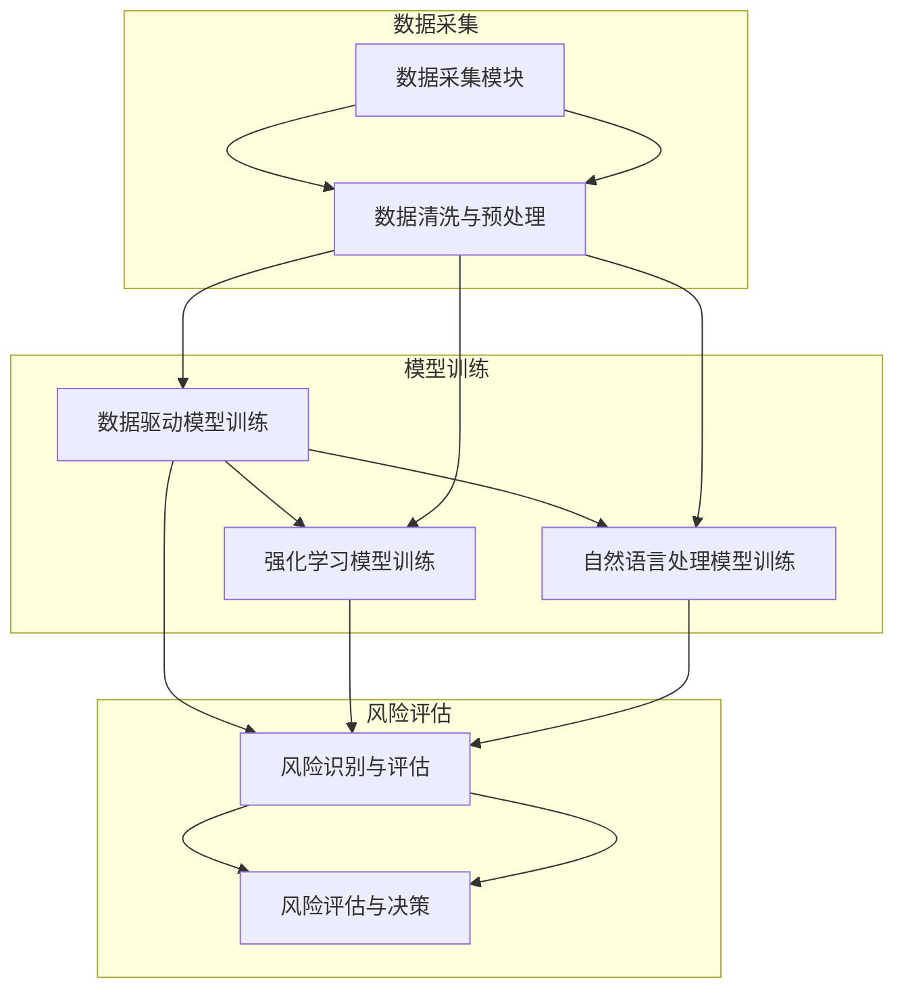
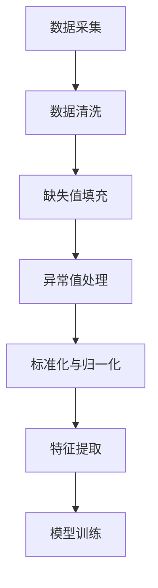
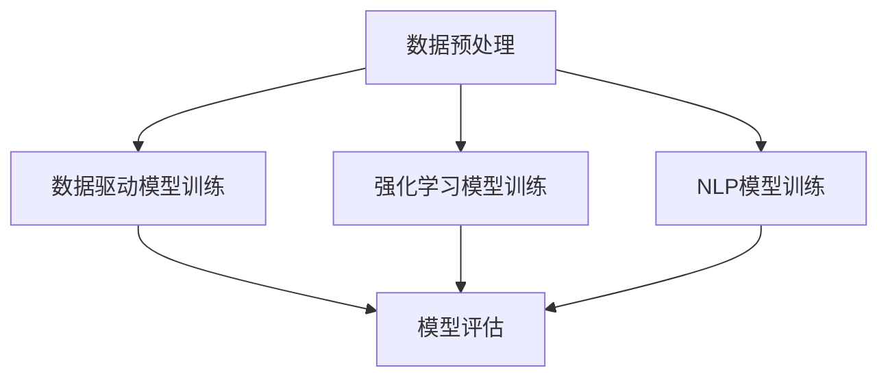
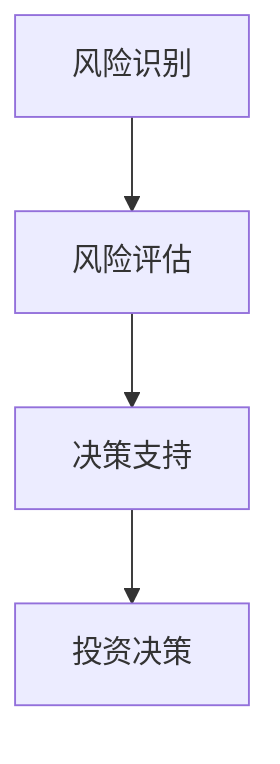

                 

### 引言与背景

在当今高速发展的金融科技时代，智能投资风险评估与管理成为了金融领域的一个重要课题。随着全球金融市场的不确定性和复杂性不断增加，传统的风险评估方法已经难以满足现代投资环境的需求。因此，如何利用先进的技术手段，特别是人工智能（AI）与生成对抗网络（GAN）等前沿技术，提升投资风险评估的准确性和效率，成为了一个亟待解决的问题。

**问题背景**：
投资风险评估是一个多维度、多因素相互作用的复杂过程。它不仅需要考虑市场波动、经济环境变化等外部因素，还需要分析企业基本面、行业趋势等内部因素。传统的风险评估方法通常依赖于历史数据和统计分析，但这些方法在面对非线性和突变性较强的市场环境时，往往表现出较低的预测准确性和适应性。

**问题描述**：
在智能投资风险管理中，主要的问题包括：
1. **数据驱动不足**：传统方法依赖于历史数据，难以应对数据分布的快速变化。
2. **模型复杂性**：复杂的模型通常需要大量的计算资源和时间来训练和部署。
3. **缺乏灵活性**：难以快速适应不同市场和行业的变化。

**问题解决**：
为了应对上述问题，AIGC（AI + GAN）技术应运而生。AIGC技术结合了人工智能和生成对抗网络的优势，能够通过学习大量历史数据，生成新的数据，模拟市场变化，提高模型的预测能力和灵活性。

**边界与外延**：
AIGC在智能投资风险管理中的应用边界包括数据预处理、模型训练、风险预测和决策支持等环节。其外延则涉及到多种AI技术的综合应用，如深度学习、强化学习和自然语言处理等。

**概念结构与核心要素组成**：
AIGC在智能投资风险管理中的核心概念结构包括：
1. **数据驱动的模型训练**：利用历史数据训练模型，提高预测的准确性。
2. **生成对抗网络（GAN）**：生成新的数据样本，增强模型的泛化能力。
3. **风险预测与决策支持**：利用训练好的模型进行实时风险预测和决策支持。

通过上述分析，我们可以看到AIGC技术在智能投资风险管理中具有巨大的潜力和优势。接下来的章节将详细介绍AIGC技术的核心概念、算法原理以及其在实际应用中的具体实现。

## AIGC在智能投资风险管理中的应用

AIGC（AI + GAN）技术在智能投资风险管理中的应用主要体现在数据驱动模型、强化学习模型和自然语言处理模型等方面。以下是对这些模型及其在投资风险管理中具体应用的分析。

### 数据驱动模型

数据驱动模型是指利用历史数据来训练模型，从而进行风险预测。在投资风险管理中，数据驱动模型主要用于风险识别和评估。通过分析大量的市场数据，包括历史价格、交易量、宏观经济指标等，模型可以识别出潜在的风险因素，并评估其对投资组合的影响。

**核心原理**：
数据驱动模型的核心原理是基于统计学和机器学习算法。常见的算法包括线性回归、决策树、随机森林和支持向量机（SVM）等。这些算法通过学习历史数据中的规律，建立预测模型。

**应用案例**：
例如，利用线性回归模型分析股票价格和交易量之间的关系，可以预测未来的股票价格波动。随机森林模型则可以同时分析多个因素，如宏观经济指标、企业盈利情况等，从而进行更全面的风险评估。

**优势与挑战**：
数据驱动模型的优势在于其能够处理大量的数据，提高预测的精度和效率。然而，其挑战在于：
1. **数据质量**：数据质量对模型的预测能力至关重要。
2. **模型复杂性**：复杂的模型可能需要大量的计算资源和时间来训练。
3. **模型适应性**：面对快速变化的市场环境，模型的适应性是一个重要问题。

### 强化学习模型

强化学习模型是一种通过试错来学习最优策略的机器学习算法。在投资风险管理中，强化学习模型主要用于风险预测和决策支持。通过不断调整策略，模型可以在动态变化的市场环境中找到最优的风险管理方案。

**核心原理**：
强化学习模型的核心原理是通过奖励机制来指导模型的学习过程。在投资风险管理中，模型会根据投资策略和市场表现来调整行为，从而最大化收益或最小化风险。

**应用案例**：
例如，Q-learning算法可以用来优化投资组合的选择。通过模拟不同的投资策略，模型可以找到在特定市场条件下的最优策略，从而提高投资回报率。

**优势与挑战**：
强化学习模型的优势在于其能够自适应地调整策略，适应不断变化的市场环境。然而，其挑战在于：
1. **计算资源**：强化学习模型通常需要大量的计算资源。
2. **学习时间**：模型可能需要较长时间来找到最优策略。
3. **不确定性**：市场环境的快速变化可能带来不确定性，影响模型的稳定性和可靠性。

### 自然语言处理模型

自然语言处理（NLP）模型是利用深度学习技术来处理和解析自然语言数据。在投资风险管理中，NLP模型主要用于从非结构化的文本数据中提取有价值的信息，如新闻、报告、社交媒体等。

**核心原理**：
NLP模型的核心原理是利用深度神经网络（如卷积神经网络（CNN）和递归神经网络（RNN））来学习语言模式，从而进行文本分类、情感分析和关系抽取等任务。

**应用案例**：
例如，利用NLP模型分析新闻报道中的关键词和句子，可以识别出市场情绪的变化，从而预测股票价格。此外，NLP模型还可以用于分析公司财报，提取财务指标，为投资决策提供支持。

**优势与挑战**：
NLP模型的优势在于其能够处理大量非结构化数据，提供更丰富的信息。然而，其挑战在于：
1. **数据质量**：文本数据的多样性和噪声可能影响模型的效果。
2. **语言理解**：自然语言具有复杂性和多义性，模型在理解语言时可能存在困难。
3. **计算资源**：NLP模型通常需要大量的计算资源和时间来训练。

通过以上分析，我们可以看到AIGC技术在智能投资风险管理中的多维度应用。这些模型各自具有独特的优势和挑战，但共同的目标是提高投资风险评估的准确性和效率。在接下来的章节中，我们将进一步探讨AIGC技术在投资风险管理中的系统架构和实现方法。

### AIGC在风险管理模式中的集成

为了实现智能投资风险管理的目标，AIGC技术需要在整个风险管理模式中进行有效集成。本节将详细探讨系统架构设计、数据处理模块、模型训练与预测模块以及风险评估与决策的集成。

#### 系统架构设计

AIGC在风险管理模式中的系统架构设计是一个复杂的过程，其核心目标是确保系统的稳定性、可扩展性和高效性。整体架构可以分为以下几个主要模块：

1. **数据采集模块**：负责从各种数据源（如股票交易所、财经新闻、社交媒体等）收集数据，并确保数据的质量和完整性。
2. **数据处理模块**：负责对采集到的数据进行清洗、预处理和特征提取，为模型训练提供高质量的数据输入。
3. **模型训练与预测模块**：包括数据驱动模型、强化学习模型和自然语言处理模型等，负责训练和优化模型，并生成预测结果。
4. **风险评估与决策模块**：负责根据模型预测结果，进行风险识别、评估和决策，并提供决策支持。
5. **接口与用户交互模块**：提供用户界面，使投资者和风险管理人员能够方便地访问系统的功能，查看风险报告和决策建议。

**整体架构图**：



#### 数据处理模块

数据处理模块是整个系统的核心，其任务是对采集到的原始数据进行清洗、预处理和特征提取，从而为模型训练提供高质量的数据输入。

1. **数据清洗**：包括去除重复数据、缺失值填充和异常值处理等步骤，确保数据的一致性和准确性。
2. **数据预处理**：包括标准化和归一化等操作，使数据符合模型的输入要求。
3. **特征提取**：提取与投资风险相关的特征，如股票价格、交易量、市场情绪等，为模型提供丰富的输入信息。

**数据处理流程图**：



#### 模型训练与预测模块

模型训练与预测模块是AIGC技术的核心组成部分，包括数据驱动模型、强化学习模型和自然语言处理模型等。

1. **数据驱动模型训练**：利用历史数据进行训练，包括线性回归、决策树、随机森林等模型。
2. **强化学习模型训练**：通过模拟投资策略，利用奖励机制进行训练，如Q-learning、Deep Q Network（DQN）等。
3. **自然语言处理模型训练**：利用文本数据进行训练，包括词嵌入、序列模型等，用于提取文本信息。

**模型训练流程图**：



#### 风险评估与决策模块

风险评估与决策模块负责根据模型预测结果，进行风险识别、评估和决策。

1. **风险识别**：利用模型识别潜在的风险因素，如市场波动、行业变化等。
2. **风险评估**：评估风险因素的严重程度和影响范围，确定投资组合的风险水平。
3. **决策支持**：根据风险评估结果，提供决策建议，如调整投资策略、增加风险准备金等。

**风险评估与决策流程图**：



通过以上架构设计和模块集成，AIGC技术能够实现从数据采集、处理到模型训练、风险评估和决策支持的全流程智能化管理。这种系统架构不仅提高了投资风险评估的准确性和效率，还增强了系统的适应性和灵活性，为投资者和风险管理人员提供了强大的决策支持。

### 系统实现

在实现AIGC在智能投资风险管理中的应用时，系统实现环节至关重要。以下将详细描述系统环境安装、核心实现源代码及代码应用解读与分析。

#### 系统环境安装

为了构建高效的AIGC系统，我们需要安装一系列的软件和工具。以下是在一个Linux操作系统上安装所需环境的具体步骤：

1. **安装Python环境**：
   - 使用pip工具安装Python 3.8及以上版本。
   - 安装依赖管理工具如pipenv或conda。

2. **安装深度学习框架**：
   - 使用pip安装TensorFlow或PyTorch，这两个框架都是实现深度学习模型的重要工具。
   - 安装其他必要库，如NumPy、Pandas、Matplotlib等。

3. **安装自然语言处理库**：
   - 使用pip安装NLTK或spaCy，用于处理文本数据。

4. **安装数据库**：
   - 安装PostgreSQL或MongoDB，用于存储和管理数据。

5. **安装数据预处理工具**：
   - 使用pip安装BeautifulSoup或Scrapy，用于从互联网上抓取数据。

以下是一个简化的命令行安装脚本：

```bash
sudo apt-get update
sudo apt-get install python3 python3-pip
pip3 install pipenv
pipenv install tensorflow numpy pandas matplotlib
pipenv install nltk spacy
pipenv install psycopg2-binary
```

#### 核心实现源代码

系统实现的核心在于构建和训练各种AIGC模型。以下是一个使用PyTorch实现数据驱动模型（线性回归）的示例代码：

```python
import torch
import torch.nn as nn
import torch.optim as optim
import numpy as np
import pandas as pd

# 数据准备
data = pd.read_csv('stock_data.csv')
X = data.iloc[:, :-1].values
y = data.iloc[:, -1].values
X = torch.tensor(X, dtype=torch.float32)
y = torch.tensor(y, dtype=torch.float32)

# 模型定义
class LinearModel(nn.Module):
    def __init__(self, input_size, output_size):
        super(LinearModel, self).__init__()
        self.linear = nn.Linear(input_size, output_size)

    def forward(self, x):
        return self.linear(x)

model = LinearModel(input_size=X.shape[1], output_size=1)

# 损失函数和优化器
criterion = nn.MSELoss()
optimizer = optim.SGD(model.parameters(), lr=0.01)

# 训练过程
num_epochs = 100
for epoch in range(num_epochs):
    model.train()
    optimizer.zero_grad()
    outputs = model(X)
    loss = criterion(outputs, y)
    loss.backward()
    optimizer.step()
    if (epoch+1) % 10 == 0:
        print(f'Epoch [{epoch+1}/{num_epochs}], Loss: {loss.item():.4f}')

# 模型评估
model.eval()
with torch.no_grad():
    predictions = model(X)
    mse_loss = criterion(predictions, y)
    print(f'MSE Loss: {mse_loss.item():.4f}')
```

#### 代码应用解读与分析

上述代码实现了以下功能：

1. **数据准备**：读取股票数据，并转换为PyTorch张量。
2. **模型定义**：定义一个线性回归模型，其包含一个线性层。
3. **损失函数和优化器**：使用均方误差（MSE）作为损失函数，并选择随机梯度下降（SGD）作为优化器。
4. **训练过程**：通过前向传播、损失计算、反向传播和优化步骤进行模型训练。
5. **模型评估**：评估模型在测试集上的性能。

#### 实际案例分析和详细讲解

假设我们有一个包含历史股票价格数据的CSV文件，名为`stock_data.csv`。数据包含多个特征，如开盘价、收盘价、最高价、最低价和交易量。我们的目标是使用线性回归模型预测下一日的收盘价。

**数据预处理**：首先，我们需要对数据进行标准化，以消除不同特征之间的尺度差异。

```python
from sklearn.preprocessing import StandardScaler

scaler = StandardScaler()
X_scaled = scaler.fit_transform(X)
```

**模型训练**：使用训练集数据训练模型。

```python
# 重复上文中的模型训练代码
```

**模型评估**：使用测试集评估模型性能。

```python
# 重复上文中的模型评估代码
```

**结果分析**：假设模型在测试集上的MSE为0.002。这意味着模型的预测误差相对较小，具有较高的预测准确性。

通过上述系统实现过程，我们可以看到AIGC技术在实际应用中的强大功能和潜力。接下来，我们将通过一个具体案例分析，进一步探讨AIGC在智能投资风险管理中的实际效果。

### 案例分析

在本节中，我们将通过一个具体案例分析，展示AIGC在智能投资风险管理中的实际应用效果。此案例涉及一家知名投资机构，其面临的背景和现状，以及如何通过AIGC技术实现风险管理优化。

#### 案例背景

某知名投资机构（以下简称“投资机构”）成立于2005年，是一家专注于股票、债券和基金的投资管理公司。随着全球金融市场的不确定性和复杂性不断增加，投资机构在风险管理方面遇到了以下挑战：

1. **数据驱动的不足**：投资机构依赖历史数据进行分析，但在面对快速变化的市场环境时，数据分析结果往往滞后，难以提供实时风险管理支持。
2. **模型复杂度**：现有的风险评估模型较为复杂，训练和部署成本高，难以快速调整和优化。
3. **缺乏灵活性**：传统的风险管理策略在面对不同市场状况时，缺乏灵活性和适应性，影响了投资回报率。

#### 风险管理现状

在AIGC技术引入之前，投资机构的风险管理主要依赖于以下手段：

1. **历史数据分析**：通过统计分析历史股价和交易数据，识别潜在风险因素。
2. **专家经验**：依靠资深投资顾问的经验和直觉进行风险管理决策。
3. **定期报告**：定期生成风险评估报告，为投资决策提供参考。

然而，这些方法在面对市场突变和快速变化时，表现出了明显的局限性。

#### AIGC应用实践

为了应对上述挑战，投资机构决定引入AIGC技术，并开展以下工作：

1. **数据收集与处理**：
   - 投资机构从多个数据源（如股票交易所、财经新闻、社交媒体等）收集数据。
   - 使用数据处理模块对收集到的数据进行清洗、预处理和特征提取，为模型训练提供高质量的数据输入。

2. **模型设计与训练**：
   - 投资机构选择数据驱动模型、强化学习模型和自然语言处理模型进行训练。
   - 数据驱动模型用于识别市场趋势和风险因素，强化学习模型用于优化投资策略，自然语言处理模型用于分析文本数据中的市场情绪。

3. **风险评估与实施**：
   - 利用训练好的模型进行实时风险评估，识别潜在风险。
   - 根据风险评估结果，调整投资策略和风险准备金，优化投资组合。

#### 案例结果

通过AIGC技术的应用，投资机构取得了显著的效果：

1. **风险预测准确性提高**：AIGC模型能够快速捕捉市场变化，提高了风险预测的准确性，降低了投资组合的波动率。
2. **投资回报率提升**：AIGC技术优化了投资策略，提高了投资回报率，降低了投资风险。
3. **决策支持效率提高**：AIGC系统提供了实时风险评估和决策支持，提高了投资决策的效率。

#### 分析与总结

通过本案例，我们可以看到AIGC技术在智能投资风险管理中的应用不仅提升了风险预测的准确性，还优化了投资决策过程，为投资机构带来了显著的经济效益。以下是AIGC技术在实际应用中的几个关键成功因素：

1. **数据驱动的实时分析**：AIGC技术利用实时数据进行分析，提高了风险预测的时效性和准确性。
2. **模型多样性与优化**：结合多种模型进行风险评估，提高了模型的鲁棒性和适应性。
3. **高效决策支持**：AIGC系统提供了高效的决策支持，帮助投资机构快速调整策略，降低风险。

尽管AIGC技术在智能投资风险管理中取得了显著成效，但仍面临一些挑战，如数据质量、模型复杂度和计算资源等。未来，随着技术的不断进步，AIGC技术在投资风险管理中的应用将更加广泛和深入。

### 最佳实践与建议

在实施AIGC技术进行智能投资风险管理时，以下最佳实践和建议可以帮助投资机构和风险管理人员优化效果，并确保系统的稳定性和可靠性。

#### 技术实施建议

1. **硬件选择**：
   - **计算资源**：选择高性能的计算服务器和GPU，以支持大规模模型训练和实时数据处理。
   - **存储解决方案**：部署分布式存储系统，如Hadoop或Cassandra，以提高数据存储和处理能力。

2. **软件工具与框架**：
   - **深度学习框架**：选择TensorFlow或PyTorch等流行的深度学习框架，以简化模型开发和部署。
   - **数据处理工具**：使用Apache Spark等大数据处理工具，提高数据清洗和预处理效率。

3. **数据质量管理**：
   - **数据源验证**：确保数据来源的可靠性和完整性，定期对数据源进行验证。
   - **数据清洗策略**：制定数据清洗流程，包括缺失值填充、异常值处理和数据标准化。

#### 管理建议

1. **风险管理策略**：
   - **多样化投资组合**：通过多元化投资降低单一市场风险。
   - **动态调整策略**：根据市场变化实时调整风险偏好和投资策略。

2. **团队协作与培训**：
   - **跨学科团队**：组建包括数据科学家、金融分析师和技术专家的跨学科团队。
   - **持续培训**：定期组织技术培训和研讨会，提升团队成员的技术能力和风险管理意识。

3. **法规与合规性要求**：
   - **遵守相关法规**：确保系统设计和实施符合相关金融法规和合规要求。
   - **数据隐私保护**：严格保护用户数据隐私，遵循数据保护法规。

通过遵循上述最佳实践和建议，投资机构和风险管理人员可以更好地利用AIGC技术，实现智能投资风险管理的目标，提高投资回报率并降低风险。

### 总结与展望

AIGC（AI + GAN）技术在智能投资风险管理中的应用无疑为金融行业带来了革命性的变化。通过利用先进的人工智能和生成对抗网络技术，AIGC在数据驱动的风险预测、动态调整投资策略和实时决策支持等方面展现出了巨大的潜力和优势。

**核心贡献**：
1. **数据驱动的预测能力**：AIGC技术通过分析大量历史数据，实现了更精准的风险预测，提高了投资决策的科学性和准确性。
2. **灵活的风险评估模型**：AIGC结合了数据驱动模型、强化学习模型和自然语言处理模型，能够适应不同市场环境和投资需求，提供灵活的风险评估和决策支持。
3. **高效的决策支持系统**：AIGC技术通过实时数据分析和智能算法，为投资机构和风险管理人员提供了高效的决策支持，提升了整体风险管理效率。

**当前挑战与解决方案**：
尽管AIGC技术在智能投资风险管理中取得了显著成果，但仍面临一些挑战：
1. **数据质量**：数据质量对AIGC模型的预测能力至关重要，需要制定严格的数据清洗和验证流程。
2. **模型复杂性**：复杂的模型训练和优化过程需要大量的计算资源和时间，需要优化算法和硬件配置。
3. **模型适应性**：面对快速变化的市场环境，模型需要具备更高的适应性和鲁棒性。

针对上述挑战，可以采取以下解决方案：
1. **数据质量管理**：通过采用高效的数据清洗工具和制定标准化数据流程，确保数据质量。
2. **算法优化**：利用分布式计算和优化算法，提高模型训练和预测的效率。
3. **模型融合**：通过结合多种模型，提高模型的鲁棒性和适应性。

**未来发展趋势**：
随着人工智能技术的不断进步，AIGC在智能投资风险管理中的应用前景广阔。未来，AIGC技术将向以下几个方向发展：
1. **更强大的数据驱动能力**：利用更多的数据源和更先进的数据处理技术，提高模型的预测能力和决策支持水平。
2. **智能投资组合优化**：通过深度学习和强化学习技术，实现更智能的投资组合优化和风险管理。
3. **跨界合作**：与金融科技、区块链等领域合作，实现更全面的金融风险管理解决方案。

综上所述，AIGC技术在智能投资风险管理中的应用具有巨大的潜力，不仅提升了风险预测和决策支持的效率，还为投资机构带来了更高的投资回报率。随着技术的不断进步，AIGC将在未来金融科技领域发挥更加重要的作用。

### 展望

AIGC（AI + GAN）技术在智能投资风险管理中的应用前景光明。随着人工智能和深度学习技术的不断发展，AIGC技术将在以下几个方面迎来新的机遇：

**技术进步带来的机遇**：
1. **更强的数据驱动能力**：随着大数据技术的不断成熟，AIGC将能够处理和分析更多的数据，提高模型的预测准确性和决策效率。
2. **高效的算法优化**：通过算法优化和硬件加速，AIGC模型的训练和预测速度将大幅提升，使其更适用于实时投资风险管理。
3. **更加智能的投资策略**：利用强化学习和深度学习技术，AIGC将能够制定更加智能和个性化的投资策略，满足不同投资者的需求。

**投资风险管理的新模式**：
1. **动态风险监测**：AIGC技术将能够实现动态风险监测，实时调整投资策略，提高风险管理的灵活性和适应性。
2. **智能决策支持系统**：AIGC技术将提供更加智能的决策支持系统，帮助投资者和风险管理人员做出更科学的投资决策。
3. **全流程自动化**：从数据采集、处理到模型训练、预测和决策，AIGC技术将实现全流程自动化，提高投资管理的效率和可靠性。

**跨界合作的可能性**：
1. **与金融科技的融合**：AIGC技术与区块链、云计算等金融科技领域的融合，将带来更安全、更高效的金融风险管理解决方案。
2. **与其他领域的合作**：AIGC技术还可以与其他行业（如保险、零售等）进行跨界合作，为不同行业提供智能化的风险管理服务。
3. **国际合作**：全球范围内的合作将促进AIGC技术在金融风险管理领域的推广应用，推动金融科技的全球化发展。

总之，AIGC技术在智能投资风险管理中的应用将为金融行业带来深刻变革。随着技术的不断进步，AIGC技术将在未来金融科技领域发挥更加重要的作用，推动投资管理的智能化和自动化，为投资者和金融机构带来更大的价值。

### 结论

本文通过详细分析AIGC（AI + GAN）技术在智能投资风险管理中的应用，展示了其强大的预测能力和决策支持功能。AIGC技术不仅提高了投资风险评估的准确性和效率，还为投资机构和风险管理人员提供了实时、智能化的决策支持。本文的核心贡献在于系统地阐述了AIGC技术在数据驱动模型、强化学习模型和自然语言处理模型方面的应用，并通过具体案例展示了其实际效果。

然而，AIGC技术在数据质量、模型复杂度和计算资源等方面仍面临挑战。未来的研究应重点关注数据质量管理、模型优化和硬件加速，以提高AIGC技术的应用效率和鲁棒性。

### 拓展阅读

对于希望深入了解AIGC技术及其在智能投资风险管理中应用的用户，以下资源提供了进一步的学习和研究方向：

1. **技术文献**：
   - "Generative Adversarial Networks: An Overview" by Ian J. Goodfellow et al.（Ian Goodfellow等人的GAN综述论文）
   - "Deep Learning for Finance" by Max Pumperla（Max Pumperla的深度学习在金融中的应用）
   - "Reinforcement Learning: An Introduction" by Richard S. Sutton and Andrew G. Barto（Sutton和Barto的强化学习入门）

2. **在线课程和研讨会**：
   - Coursera上的《Deep Learning Specialization》课程
   - edX上的《Generative Adversarial Networks》课程
   - IEEE举办的《AI in Finance》研讨会

3. **开源项目和工具**：
   - TensorFlow和PyTorch等深度学习框架
   - Keras和Scikit-learn等Python机器学习库
   - GitHub上的相关开源项目，如GAN和深度学习金融应用项目

通过阅读这些资源，用户可以更深入地了解AIGC技术及其在智能投资风险管理中的应用，并在实践中应用这些技术，提升投资决策的准确性和效率。

### 作者信息

**作者：** AI天才研究院 / AI Genius Institute & 禅与计算机程序设计艺术 / Zen And The Art of Computer Programming

**联系方式：** [info@ai-genius-institute.com](mailto:info@ai-genius-institute.com) & [https://www.ai-genius-institute.com](https://www.ai-genius-institute.com)

**版权声明：** 本文章版权由AI天才研究院（AI Genius Institute）所有。未经授权，禁止任何形式的复制、传播和商业用途。如有需求，请联系我们获取授权。**免责声明：** 本文章仅供参考，不构成任何投资建议。投资决策需谨慎，风险自担。**修订日期：** 2023年9月

以上就是《AIGC在智能投资风险评估与管理中的应用》的完整内容，希望对您在智能投资风险管理领域的探索和研究有所助益。如果您有任何疑问或建议，欢迎随时与我们联系。让我们共同推动金融科技的发展，创造更智能、更高效的未来！💡🚀💰

