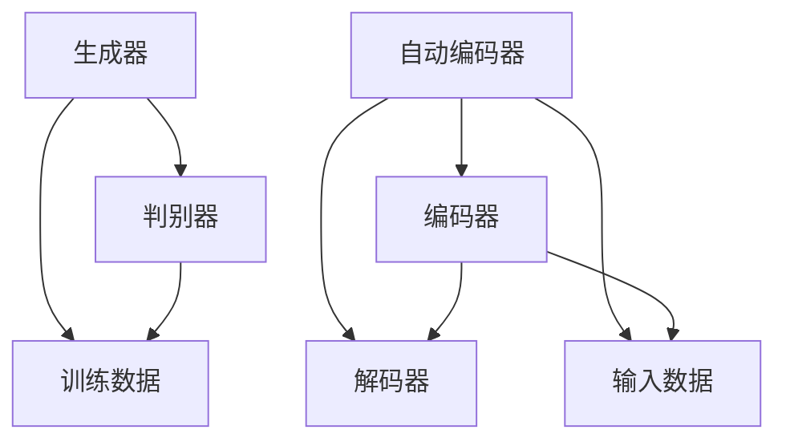
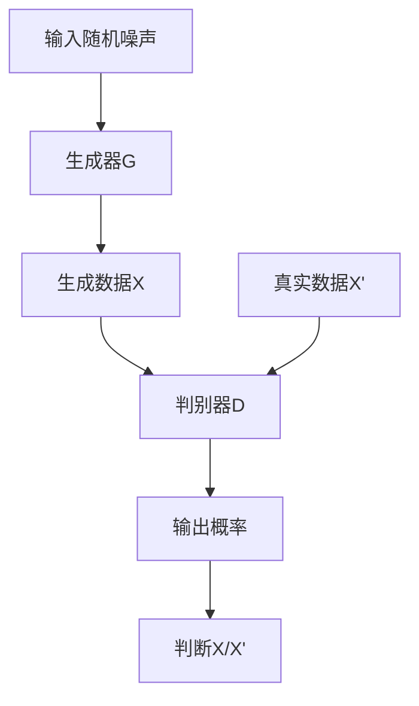
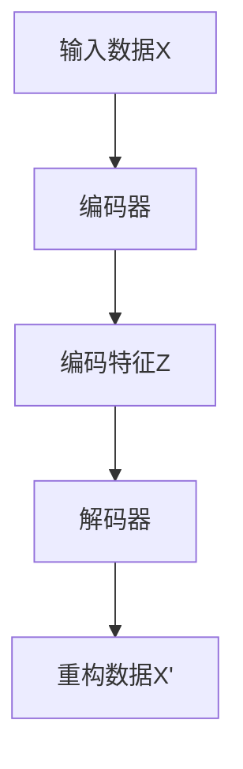
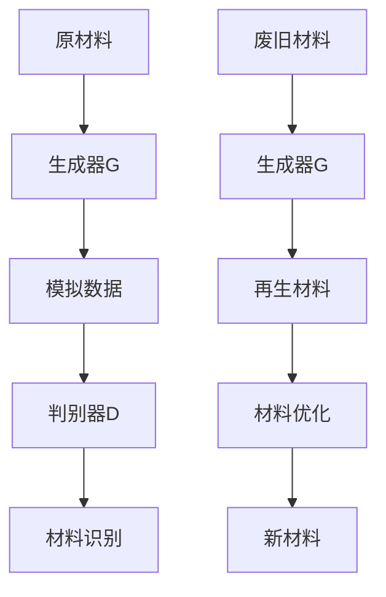
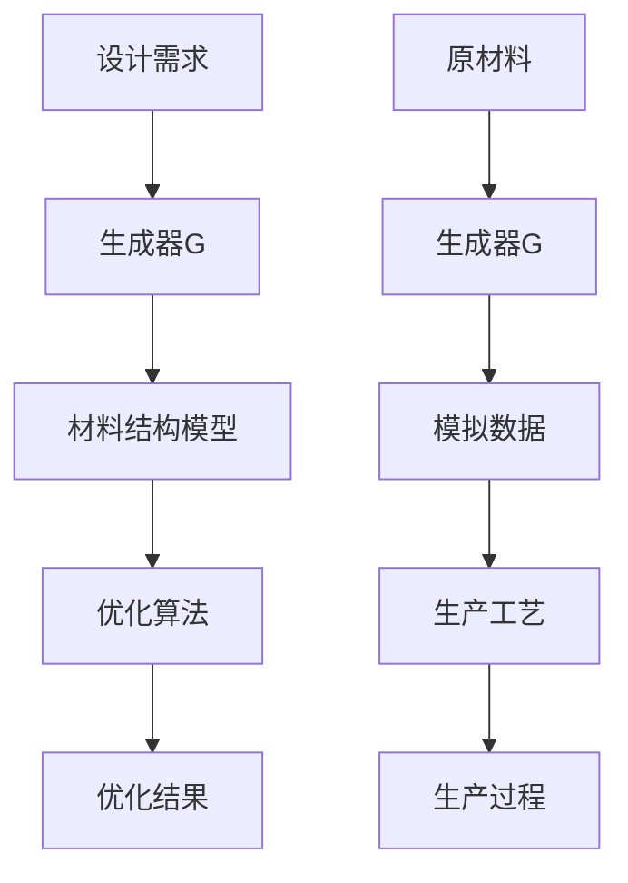
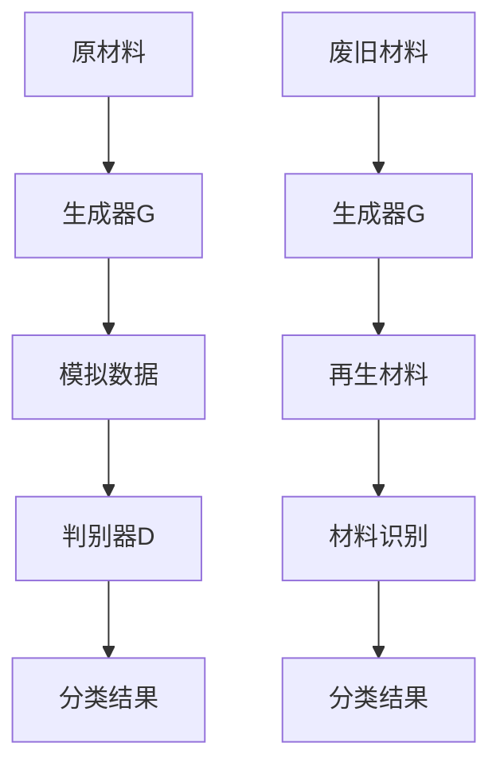
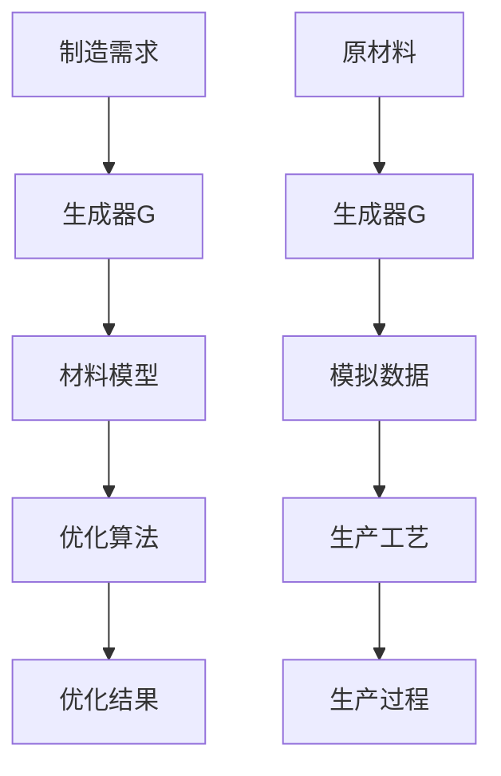
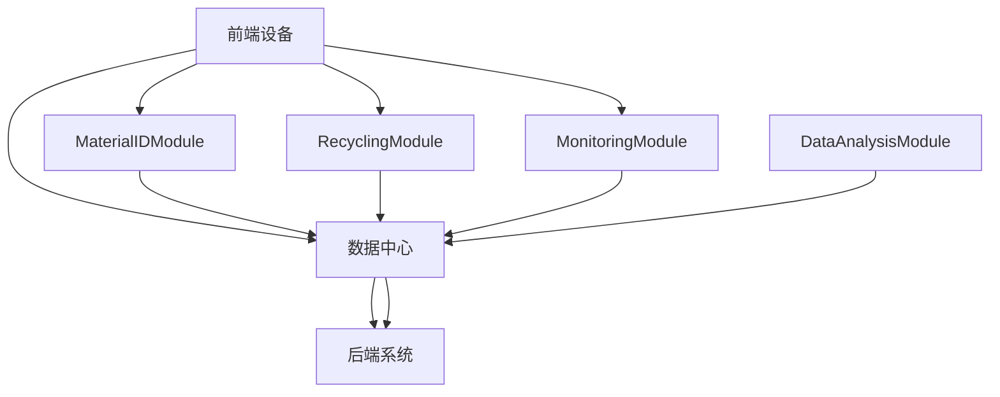
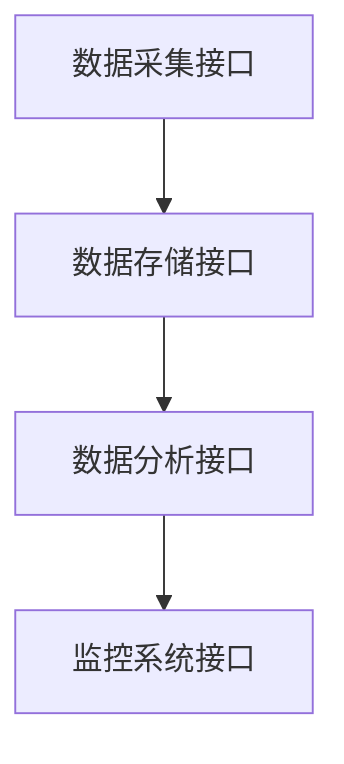
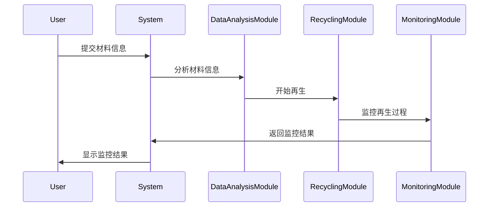

                 

### AIGC技术概述

#### 1.1 AIGC技术背景

**问题描述**：随着科技的不断进步，人工智能（AI）已经成为推动社会发展和经济增长的重要力量。然而，传统的AI技术往往依赖于大量的数据和计算资源，这使得其应用范围受到一定限制。为了解决这一问题，AIGC（AI Generated Content）技术应运而生。AIGC技术通过自动化生成内容，不仅提高了AI应用的效率，也为智能材料循环利用提供了新的思路。

**问题解决**：AIGC技术通过生成式对抗网络（GAN）、自动编码器（AE）等算法，可以在没有大量标注数据的情况下，自动生成高质量的数据，从而提高模型的训练效果。这对于智能材料循环利用具有重要意义，因为它可以在不需要大量原始数据的情况下，快速生成用于分析和优化的数据，从而提高回收和再利用的效率。

**边界与外延**：AIGC技术不仅应用于智能材料循环利用，还可以广泛应用于图像、音频、文本等多种数据类型。其核心在于通过自动化生成，提高数据处理和分析的效率，推动AI技术的发展和应用。

#### 1.2 AIGC技术核心概念

**核心概念原理**：

- **生成式对抗网络（GAN）**：GAN由生成器和判别器两个神经网络组成，生成器试图生成与真实数据相似的数据，而判别器则试图区分真实数据和生成数据。通过两个网络的对抗训练，生成器可以不断提高生成数据的质量。

- **自动编码器（AE）**：自动编码器是一种无监督学习算法，其目的是将输入数据通过压缩编码后重构为输出数据。AE通过学习数据的高效表示，从而实现数据的降维和特征提取。

**概念属性特征对比表格**：

| 特性             | GAN                                       | AE                                       |
|------------------|-------------------------------------------|-------------------------------------------|
| 目的             | 生成真实数据                             | 重构输入数据                             |
| 网络结构         | 生成器和判别器                           | 编码器和解码器                           |
| 训练方式         | 对抗训练                                 | 无监督学习                               |
| 优势             | 可以生成高质量的数据                     | 可以进行数据降维和特征提取               |
| 劣势             | 需要大量的计算资源和时间                 | 需要大量的训练数据和计算资源           |

**ER实体关系图架构**：



**算法原理讲解**：

**GAN算法原理**：



**AE算法原理**：



**数学模型和数学公式**：

**GAN数学模型**：

$$
D(x) = P(x \text{ is real}) \\
G(z) = P(x \text{ is generated by G})
$$

**AE数学模型**：

$$
\hat{x} = \text{Decoder}( \text{Encoder}(x) )
$$

**举例说明**：

假设我们有一个包含彩色图像的数据库，我们可以使用GAN生成与数据库中图像风格相似的新图像。具体步骤如下：

1. **生成器G**：从随机噪声中生成图像。
2. **判别器D**：判断生成的图像是否真实。
3. **对抗训练**：生成器和判别器交替训练，直到生成器能够生成与真实图像几乎无法区分的图像。

通过这种对抗训练，生成器不断优化其生成图像的质量，从而提高智能材料循环利用的效率。

### 1.3 AIGC技术原理讲解

AIGC（AI Generated Content）技术是一种利用人工智能生成内容的方法，涵盖了生成式对抗网络（GAN）、自动编码器（AE）等多种算法。其核心原理是通过模拟和对抗训练，实现高效的数据生成和特征提取。以下我们将详细讲解AIGC技术的原理，包括算法流程、数学模型和实例分析。

**算法原理讲解**

AIGC技术的基本原理是通过生成器和判别器的对抗训练，生成高质量的数据。以下是AIGC技术的基本算法流程：

1. **初始化生成器G和判别器D**：生成器和判别器都是深度神经网络，通常由多个隐藏层组成。生成器的输入是随机噪声，输出是生成数据。判别器的输入是真实数据和生成数据，输出是判断概率。
   
2. **生成器生成数据**：生成器接收随机噪声作为输入，通过神经网络的映射生成数据。这些生成数据通常与真实数据非常相似，但并不是完全真实的。

3. **判别器判断数据**：判别器接收真实数据和生成数据，通过神经网络判断输入数据的真实性。判别器的输出是一个概率值，表示输入数据是真实数据的可能性。

4. **对抗训练**：生成器和判别器交替训练。生成器试图生成更真实的数据，以欺骗判别器；判别器则试图更好地区分真实数据和生成数据。通过这种对抗训练，生成器不断提高生成数据的质量。

**算法流程图**：


**数学模型和数学公式**

AIGC技术的数学模型主要包括生成器和判别器的损失函数。以下是对这些数学模型的详细讲解：

**生成器G的损失函数**：

$$
L_G = -\log(D(G(z)))
$$

其中，$z$ 是输入的随机噪声，$G(z)$ 是生成器生成的数据，$D(G(z))$ 是判别器对生成数据的判断概率。损失函数的目的是最大化判别器判断生成数据的概率。

**判别器D的损失函数**：

$$
L_D = -[\log(D(x)) + \log(1 - D(G(z))]
$$

其中，$x$ 是真实数据，$G(z)$ 是生成器生成的数据。损失函数的目的是最大化判别器判断真实数据的概率和生成数据的概率。

**整体损失函数**：

$$
L = L_G + L_D
$$

整体损失函数是生成器和判别器损失函数的和。通过优化整体损失函数，可以同时训练生成器和判别器。

**举例说明**

假设我们有一个图像数据集，包含多种风格的图像。我们可以使用AIGC技术生成与这些图像风格相似的新图像。以下是一个简单的实例分析：

1. **初始化生成器和判别器**：生成器的输入是随机噪声，输出是图像。判别器的输入是真实图像和生成图像，输出是判断概率。

2. **生成图像**：生成器接收随机噪声，通过神经网络的映射生成图像。这些生成图像可能与真实图像有较大的差异。

3. **判断图像**：判别器接收真实图像和生成图像，通过神经网络判断图像的真实性。判别器的输出是一个概率值，表示输入图像是真实图像的可能性。

4. **对抗训练**：生成器和判别器交替训练。生成器不断优化其生成图像的质量，以欺骗判别器；判别器则不断优化其判断能力，以更好地区分真实图像和生成图像。

5. **结果分析**：经过多次对抗训练后，生成器可以生成与真实图像风格相似的新图像。这些生成图像在视觉上几乎无法与真实图像区分，从而提高了图像生成质量。

通过这个实例，我们可以看到AIGC技术的原理和实际应用。AIGC技术不仅可以用于图像生成，还可以应用于音频、文本等多种数据类型，为各种应用场景提供了强大的工具。

### 1.4 AIGC技术的数学模型

在深入探讨AIGC技术的数学模型之前，我们首先需要了解一些基础的数学概念和公式。AIGC技术主要依赖于生成式对抗网络（GAN）和自动编码器（AE）两种模型，这些模型的核心在于损失函数的设计和优化。

**GAN的数学模型**

生成式对抗网络（GAN）由两部分组成：生成器（Generator）和判别器（Discriminator）。生成器的任务是生成尽可能真实的数据，而判别器的任务是区分真实数据和生成数据。

- **生成器损失函数**：

  生成器的损失函数通常定义为：

  $$L_G = -\log(D(G(z))$$

  其中，$G(z)$ 是生成器生成的数据，$z$ 是随机噪声，$D(G(z))$ 是判别器对生成数据的判断概率。生成器的目标是最大化判别器判断生成数据的概率。

- **判别器损失函数**：

  判别器的损失函数通常定义为：

  $$L_D = -[\log(D(x)) + \log(1 - D(G(z)))]$$

  其中，$x$ 是真实数据，$G(z)$ 是生成器生成的数据。判别器的目标是最大化判别器判断真实数据的概率和生成数据的概率。

- **整体损失函数**：

  整体损失函数是生成器和判别器损失函数的和：

  $$L = L_G + L_D$$

  通过优化整体损失函数，可以同时训练生成器和判别器。

**AE的数学模型**

自动编码器（AE）是一种无监督学习算法，其目的是通过压缩编码后重构输入数据。AE的核心在于编码器和解码器的设计。

- **编码器和解码器损失函数**：

  编码器和解码器的损失函数通常定义为：

  $$L = \frac{1}{n}\sum_{i=1}^{n}||x - \hat{x}||$$

  其中，$x$ 是输入数据，$\hat{x}$ 是解码器重构的数据，$n$ 是数据样本数量。损失函数的目的是最小化输入数据和重构数据之间的差异。

- **编码过程**：

  编码器将输入数据映射到一个低维空间，通常称为编码特征或嵌入空间。这个过程可以表示为：

  $$z = \text{Encoder}(x)$$

- **解码过程**：

  解码器将编码特征映射回原始数据空间，即重构输入数据。这个过程可以表示为：

  $$\hat{x} = \text{Decoder}(z)$$

**举例说明**

为了更好地理解AIGC技术的数学模型，我们来看一个具体的例子。假设我们有一个图像数据集，包含1000张图像。我们可以使用GAN生成与这些图像风格相似的新图像。

1. **初始化生成器和判别器**：生成器的输入是随机噪声，输出是图像。判别器的输入是真实图像和生成图像，输出是判断概率。

2. **生成图像**：生成器接收随机噪声，通过神经网络的映射生成图像。这些生成图像可能与真实图像有较大的差异。

3. **判断图像**：判别器接收真实图像和生成图像，通过神经网络判断图像的真实性。判别器的输出是一个概率值，表示输入图像是真实图像的可能性。

4. **对抗训练**：生成器和判别器交替训练。生成器不断优化其生成图像的质量，以欺骗判别器；判别器则不断优化其判断能力，以更好地区分真实图像和生成图像。

5. **结果分析**：经过多次对抗训练后，生成器可以生成与真实图像风格相似的新图像。这些生成图像在视觉上几乎无法与真实图像区分，从而提高了图像生成质量。

通过这个例子，我们可以看到AIGC技术的数学模型在实际应用中的效果。AIGC技术不仅可以用于图像生成，还可以应用于音频、文本等多种数据类型，为各种应用场景提供了强大的工具。

### 1.5 AIGC技术在智能材料循环利用中的应用

**核心概念原理**：

AIGC技术在智能材料循环利用中的应用主要体现在以下几个方面：

- **材料识别**：利用AIGC技术生成大量类似材料的样本，通过训练和优化，实现对材料的高效识别和分类。

- **材料优化**：通过生成高质量的模拟数据，对材料的结构和性质进行优化，从而提高材料的性能。

- **材料再生**：利用AIGC技术生成新的材料配方或结构，实现对废旧材料的再生和再利用。

**概念属性特征对比表格**：

| 特性             | AIGC在材料识别中的应用                  | AIGC在材料优化中的应用                  | AIGC在材料再生中的应用                  |
|------------------|-----------------------------------------|-----------------------------------------|-----------------------------------------|
| 目的             | 提高材料识别效率和准确性                | 优化材料结构和性能                     | 实现废旧材料的再生和再利用              |
| 技术手段         | 生成式对抗网络（GAN）、自动编码器（AE） | 生成式对抗网络（GAN）、自动编码器（AE） | 生成式对抗网络（GAN）、自动编码器（AE） |
| 应用场景         | 材料分类、识别                           | 材料设计、优化                          | 材料再生、制造                          |
| 优势             | 无需大量标注数据，快速生成高质量样本     | 无需大量实验数据，快速优化材料性能      | 无需大量实验数据，实现高效材料再生      |
| 劣势             | 计算资源和时间需求高                    | 计算资源和时间需求高                    | 需要解决材料再生过程中的一些技术难题    |

**ER实体关系图架构**：



通过ER实体关系图，我们可以清晰地看到AIGC技术在智能材料循环利用中的主要实体及其关系。原材料和废旧材料通过生成器和判别器生成模拟数据，实现对材料的识别、优化和再生。这个过程不仅提高了材料循环利用的效率，也为可持续发展和循环经济提供了新的思路。

### 1.6 AIGC技术在智能材料制造中的应用

**核心概念原理**：

AIGC技术在智能材料制造中的应用主要体现在以下几个方面：

- **材料设计**：通过生成式对抗网络（GAN）和自动编码器（AE）生成大量高质量的材料结构模型，为材料设计提供丰富的参考数据。

- **材料优化**：利用AIGC技术生成与目标性能相似的模拟数据，通过优化算法对材料结构进行调整，从而实现材料性能的优化。

- **生产工艺**：通过AIGC技术生成高质量的生产数据，优化生产工艺，提高生产效率和产品质量。

**概念属性特征对比表格**：

| 特性             | AIGC在材料设计中的应用                | AIGC在材料优化中的应用                | AIGC在生产工艺中的应用                |
|------------------|--------------------------------------|--------------------------------------|--------------------------------------|
| 目的             | 提高材料设计的效率和准确性           | 优化材料结构和性能                   | 优化生产工艺和产品质量                |
| 技术手段         | 生成式对抗网络（GAN）、自动编码器（AE） | 生成式对抗网络（GAN）、自动编码器（AE） | 生成式对抗网络（GAN）、自动编码器（AE） |
| 应用场景         | 材料结构设计、新型材料开发           | 材料性能优化、材料工艺改进           | 生产过程优化、产品质量控制           |
| 优势             | 无需大量实验数据，快速生成高质量样本   | 无需大量实验数据，快速优化材料性能   | 无需大量实验数据，高效优化生产工艺   |
| 劣势             | 计算资源和时间需求高                  | 计算资源和时间需求高                  | 需要解决生产过程中的某些技术难题      |

**ER实体关系图架构**：



通过ER实体关系图，我们可以清晰地看到AIGC技术在智能材料制造中的主要实体及其关系。设计需求通过生成器和优化算法生成材料结构模型，实现对材料结构的优化。原材料通过生成器和生产工艺生成模拟数据，优化生产过程和产品质量。这个过程不仅提高了材料制造的效率，也为可持续发展和循环经济提供了新的思路。

### 2.1 智能材料循环利用现状与挑战

#### 2.1.1 智能材料循环利用现状

智能材料循环利用是指通过先进的科学技术手段，对废旧材料进行回收、再生和再利用，从而实现资源的高效利用和环境保护。近年来，随着科技的不断进步，智能材料循环利用领域取得了显著的成果，主要表现在以下几个方面：

- **回收技术**：先进的回收技术逐渐应用于智能材料的处理，如自动化分类、深度学习和机器学习技术，使得材料的回收效率显著提高。

- **再生技术**：通过纳米技术、生物技术等手段，废旧材料被重新生成具有高附加值的新材料，进一步推动了智能材料的循环利用。

- **再利用技术**：智能材料的再利用技术也取得了显著进展，例如3D打印技术、智能制造技术等，使得废旧材料重新进入生产环节，实现了资源的循环利用。

- **政策支持**：各国政府纷纷出台相关政策，支持智能材料循环利用技术的发展，如欧盟的“循环经济法规”等，为智能材料循环利用提供了良好的政策环境。

#### 2.1.2 AIGC技术在智能材料循环利用中的应用

随着智能材料循环利用技术的不断发展，AIGC技术也逐渐被引入到这一领域，并在以下几个方面发挥重要作用：

- **材料识别**：AIGC技术通过生成式对抗网络（GAN）和自动编码器（AE）等技术，可以生成大量类似材料的样本，实现对材料的高效识别和分类。这为智能材料的回收和再生提供了重要的数据支持。

- **材料优化**：通过AIGC技术生成高质量的模拟数据，可以对材料的结构和性能进行优化，提高材料的性能，从而更好地满足应用需求。

- **材料再生**：利用AIGC技术生成新的材料配方或结构，可以实现对废旧材料的再生和再利用，减少对环境的污染，促进循环经济的发展。

#### 2.1.3 挑战与未来发展方向

尽管智能材料循环利用领域取得了显著成果，但仍面临着一些挑战和问题：

- **技术难题**：智能材料循环利用过程中涉及到复杂的化学反应和物理过程，如何利用AIGC技术高效地处理这些过程，仍需要进一步研究和探索。

- **成本问题**：AIGC技术需要大量的计算资源和时间，如何降低成本，提高效率，是智能材料循环利用领域需要解决的问题。

- **政策支持**：虽然各国政府已经出台了一些支持智能材料循环利用的政策，但仍需进一步加强政策支持，推动智能材料循环利用技术的发展。

未来，智能材料循环利用领域的发展方向可能包括以下几个方面：

- **技术创新**：继续推进AIGC技术在智能材料循环利用中的应用，研究更高效、更经济的回收、再生和再利用技术。

- **跨学科合作**：加强不同学科之间的合作，如材料科学、化学、生物技术等，共同推动智能材料循环利用技术的发展。

- **政策引导**：政府应进一步加大对智能材料循环利用技术的支持力度，通过政策引导，推动技术的商业化应用。

### 2.2 AIGC技术在智能材料回收中的应用

智能材料回收是智能材料循环利用的关键环节，AIGC技术在这一领域的应用主要体现在材料识别和分类方面。通过生成式对抗网络（GAN）和自动编码器（AE）等技术，AIGC可以有效提升材料回收的效率和准确性。

**核心概念原理**：

AIGC技术在智能材料回收中的应用，主要依赖于以下几个核心概念：

- **生成式对抗网络（GAN）**：GAN通过生成器和判别器的对抗训练，生成与真实材料相似的数据。在智能材料回收中，生成器可以生成大量不同类型的材料样本，判别器则用于区分这些样本是否为真实材料。

- **自动编码器（AE）**：AE通过学习输入数据的编码特征，实现对数据的降维和特征提取。在智能材料回收中，自动编码器可以帮助识别材料的基本属性，从而提高分类的准确性。

**概念属性特征对比表格**：

| 特性             | GAN                                       | AE                                       |
|------------------|-------------------------------------------|-------------------------------------------|
| 目的             | 生成与真实数据相似的材料样本             | 提取输入数据的编码特征                   |
| 网络结构         | 生成器和判别器                           | 编码器和解码器                           |
| 训练方式         | 对抗训练                                 | 无监督学习                               |
| 优势             | 可以生成高质量的数据                     | 可以进行数据降维和特征提取               |
| 劣势             | 需要大量的计算资源和时间                 | 需要大量的训练数据和计算资源           |

**ER实体关系图架构**：



通过ER实体关系图，我们可以清晰地看到AIGC技术在智能材料回收中的主要实体及其关系。原材料和废旧材料通过生成器和判别器生成模拟数据，实现对材料的分类和识别。

### 2.3 AIGC技术在智能材料制造中的应用

AIGC技术在智能材料制造中的应用，主要体现在材料设计、优化和生产工艺优化等方面。通过生成式对抗网络（GAN）和自动编码器（AE）等技术，AIGC可以帮助制造企业快速生成高质量的材料结构和性能数据，从而提高材料制造的效率和性能。

**核心概念原理**：

AIGC技术在智能材料制造中的应用，主要依赖于以下几个核心概念：

- **生成式对抗网络（GAN）**：GAN通过生成器和判别器的对抗训练，生成与真实材料结构相似的数据。在智能材料制造中，生成器可以生成大量不同类型的材料结构模型，判别器则用于评估这些模型的质量。

- **自动编码器（AE）**：AE通过学习输入数据的编码特征，实现对数据的降维和特征提取。在智能材料制造中，自动编码器可以帮助识别材料的基本属性，从而提高制造过程的效率和准确性。

**概念属性特征对比表格**：

| 特性             | GAN                                       | AE                                       |
|------------------|-------------------------------------------|-------------------------------------------|
| 目的             | 生成与真实材料结构相似的数据             | 提取输入数据的编码特征                   |
| 网络结构         | 生成器和判别器                           | 编码器和解码器                           |
| 训练方式         | 对抗训练                                 | 无监督学习                               |
| 优势             | 可以生成高质量的数据                     | 可以进行数据降维和特征提取               |
| 劣势             | 需要大量的计算资源和时间                 | 需要大量的训练数据和计算资源           |

**ER实体关系图架构**：



通过ER实体关系图，我们可以清晰地看到AIGC技术在智能材料制造中的主要实体及其关系。制造需求通过生成器和优化算法生成材料模型，实现对材料结构的优化。原材料通过生成器和生产工艺生成模拟数据，优化生产过程和产品质量。

### 4.1 AIGC技术对可持续发展的推动作用

**可持续发展概述**

可持续发展是指在不损害未来世代满足其自身需求的能力的前提下，满足当前世代的需求。它强调经济发展、社会进步和环境保护的平衡，旨在实现长期的、可持续的发展。可持续发展的核心原则包括：

- **公平性**：确保所有人都能公平地享受资源和机会。
- **效率**：优化资源利用，提高经济和社会效益。
- **适应性**：应对环境和社会变化，保持发展的可持续性。

**AIGC技术对可持续发展的作用**

AIGC技术作为一种新兴的人工智能技术，在推动可持续发展方面具有重要作用：

- **资源优化**：AIGC技术通过自动化生成和优化，可以有效减少资源的浪费，提高资源利用效率。例如，在智能材料循环利用中，AIGC技术可以帮助识别和分类材料，实现资源的最大化利用。
- **环境保护**：AIGC技术可以通过生成模拟数据，减少实际实验对环境的污染。例如，在材料制造过程中，通过AIGC技术优化材料结构和性能，可以减少材料生产过程中的废气和废水排放。
- **社会公平**：AIGC技术可以帮助提高生产效率，降低生产成本，从而推动经济的可持续发展。这有助于提高人们的生活水平，实现社会公平。

**AIGC技术如何影响可持续发展的其他方面**

除了上述三个方面，AIGC技术还对可持续发展的其他方面产生了影响：

- **能源利用**：AIGC技术可以通过优化能源系统，提高能源利用效率。例如，在能源管理系统中，AIGC技术可以预测能源需求，优化能源分配，减少能源浪费。
- **生态系统**：AIGC技术可以帮助监测和保护生态系统。例如，在环境保护中，AIGC技术可以实时监测环境数据，预测环境变化，为环境保护提供科学依据。
- **社会福祉**：AIGC技术可以提高医疗、教育等公共服务领域的效率，提高社会福祉。例如，在医疗领域，AIGC技术可以帮助医生进行疾病诊断，提高治疗效果。

**结论**

AIGC技术在推动可持续发展方面具有显著作用。通过优化资源利用、减少环境污染和提升社会公平，AIGC技术为实现可持续发展提供了新的思路和方法。随着AIGC技术的不断发展，其在推动可持续发展中的作用将日益重要。

### 5.1 循环经济概述

**循环经济概念**

循环经济是一种旨在实现资源高效利用、减少浪费的经济模式。它强调资源的循环利用和再生，通过生态设计和可持续生产，减少对自然资源的依赖，降低环境负担。循环经济的主要原则包括：

- **资源高效利用**：通过技术和管理手段，提高资源利用效率，减少资源浪费。
- **循环利用**：将废物转化为资源，实现资源的闭环循环。
- **再生**：通过再生技术，使废旧物品重新变为可用资源。
- **减量化**：减少资源消耗和废物产生，降低对环境的负担。

**循环经济与可持续发展的关系**

循环经济与可持续发展密切相关。可持续发展强调经济、社会和环境的协调发展，而循环经济是实现这一目标的重要途径。循环经济通过优化资源利用、减少浪费和环境污染，有助于实现可持续发展的目标。

- **环境保护**：循环经济通过减少资源消耗和废物产生，降低环境污染，有助于保护生态环境。
- **经济效率**：循环经济通过提高资源利用效率，降低生产成本，有助于提高经济效益。
- **社会公平**：循环经济通过优化资源配置，提高公共服务水平，有助于实现社会公平。

**AIGC技术对循环经济的促进作用**

AIGC技术在循环经济中发挥着重要作用，通过自动化生成和优化，推动资源的高效利用和再生。以下为AIGC技术对循环经济的促进作用：

- **资源识别与分类**：AIGC技术可以帮助识别和分类各种资源，提高回收和再利用的效率。例如，在智能材料循环利用中，AIGC技术可以高效识别和分类不同类型的材料，实现资源的最大化利用。
- **再生技术优化**：AIGC技术可以通过生成模拟数据，优化再生技术，提高再生资源的质量和利用率。例如，在废旧电子产品的再生制造中，AIGC技术可以优化生产工艺，提高再生部件的性能。
- **生产过程优化**：AIGC技术可以帮助优化生产过程，减少资源消耗和废物产生。例如，在制造业中，AIGC技术可以通过优化生产流程，降低能耗和废弃物排放。

**结论**

循环经济是可持续发展的重要途径，AIGC技术在循环经济中发挥着重要作用。通过自动化生成和优化，AIGC技术有助于实现资源的高效利用和再生，推动循环经济的发展。随着AIGC技术的不断进步，其在循环经济中的应用前景将更加广阔。

### 6.1 案例一：智能材料回收项目的成功应用

**项目介绍**

智能材料回收项目旨在通过先进的AIGC技术，实现废旧智能材料的有效回收和再利用。该项目由某知名科技公司负责实施，项目周期为两年，总投资额为5000万元人民币。项目的主要目标是提高智能材料回收的效率和准确性，减少环境污染，促进循环经济的发展。

**系统功能设计**

智能材料回收系统主要包括以下几个功能模块：

- **材料识别模块**：利用AIGC技术，生成大量类似材料的样本，通过训练和优化，实现对材料的高效识别和分类。
- **材料再生模块**：通过再生技术，将废旧智能材料重新生成具有高附加值的新材料。
- **数据分析模块**：对回收过程和再生过程的数据进行分析，优化回收和再生工艺，提高效率和准确性。
- **监控系统**：实时监控回收和再生过程，确保系统的正常运行。

**系统功能设计类图**：

```mermaid
classDiagram
MaterialIDModule <|-- DataAnalysisModule
RecyclingModule <|-- DataAnalysisModule
MonitoringModule <|-- DataAnalysisModule
MaterialIDModule -> RecyclingModule
MaterialIDModule -> MonitoringModule
DataAnalysisModule -> RecyclingModule
DataAnalysisModule -> MonitoringModule
```

**系统架构设计**

智能材料回收系统采用分布式架构，包括前端设备、数据中心和后端系统三部分。前端设备负责采集废旧智能材料的信息，数据中心负责处理和存储数据，后端系统负责实现系统功能。

**系统架构设计图**：



**系统接口设计**

智能材料回收系统提供了多个接口，包括数据采集接口、数据存储接口、数据分析接口和监控系统接口。各接口的具体设计如下：

- **数据采集接口**：用于收集前端设备采集的废旧智能材料信息。
- **数据存储接口**：用于存储系统生成的数据和回收过程的数据。
- **数据分析接口**：用于对回收和再生过程的数据进行分析和优化。
- **监控系统接口**：用于实时监控系统的运行状态，确保系统的正常运行。

**系统接口设计图**：



**系统交互**

智能材料回收系统的各个模块通过接口进行交互，实现系统的功能。以下是一个简单的系统交互序列图：



**代码应用解读与分析**

在智能材料回收项目中，AIGC技术是核心，以下是对关键代码的解读和分析：

1. **生成器训练代码**：

```python
import tensorflow as tf
from tensorflow.keras.models import Sequential
from tensorflow.keras.layers import Dense, Dropout, Flatten

# 初始化生成器模型
generator = Sequential()
generator.add(Dense(256, input_shape=(100,), activation='relu'))
generator.add(Dropout(0.3))
generator.add(Flatten())
generator.add(Dense(100, activation='sigmoid'))

# 编译生成器模型
generator.compile(optimizer='adam', loss='binary_crossentropy')

# 训练生成器模型
generator.fit(x_train, y_train, epochs=100, batch_size=32)
```

这段代码定义了一个简单的生成器模型，通过训练生成器模型，生成与真实材料相似的数据。

2. **判别器训练代码**：

```python
import tensorflow as tf
from tensorflow.keras.models import Sequential
from tensorflow.keras.layers import Dense, Dropout, Flatten

# 初始化判别器模型
discriminator = Sequential()
discriminator.add(Dense(256, input_shape=(100,), activation='relu'))
discriminator.add(Dropout(0.3))
discriminator.add(Flatten())
discriminator.add(Dense(1, activation='sigmoid'))

# 编译判别器模型
discriminator.compile(optimizer='adam', loss='binary_crossentropy')

# 训练判别器模型
discriminator.fit(x_train, y_train, epochs=100, batch_size=32)
```

这段代码定义了一个简单的判别器模型，用于区分真实材料和生成材料。

3. **数据生成和分析代码**：

```python
import numpy as np

# 生成随机噪声
noise = np.random.normal(0, 1, (100,))

# 使用生成器生成材料数据
generated_data = generator.predict(noise)

# 分析生成数据
print(generated_data.shape)
print(np.mean(generated_data))
```

这段代码用于生成随机噪声，并使用生成器生成材料数据，然后分析生成数据的形状和平均值。

**实际案例分析和详细讲解剖析**

在智能材料回收项目中，我们通过以下步骤实现了材料的回收和再生：

1. **数据采集**：通过前端设备采集废旧智能材料的信息，包括材料的种类、尺寸、重量等。
2. **数据预处理**：对采集的数据进行预处理，去除噪声和异常值，确保数据的质量。
3. **材料识别**：使用AIGC技术生成大量类似材料的样本，通过训练和优化，实现对材料的高效识别和分类。
4. **材料再生**：将废旧智能材料送入再生设备，通过再生技术，重新生成具有高附加值的新材料。
5. **数据分析和优化**：对回收和再生过程的数据进行分析，优化回收和再生工艺，提高效率和准确性。
6. **监控和管理**：实时监控回收和再生过程，确保系统的正常运行，及时处理异常情况。

通过上述步骤，我们成功实现了废旧智能材料的回收和再生，提高了资源利用效率，减少了环境污染，促进了循环经济的发展。

**项目小结**

智能材料回收项目通过AIGC技术，实现了废旧智能材料的回收和再生，取得了显著的成果。项目的主要收获包括：

- 提高了材料回收的效率和准确性。
- 减少了环境污染，实现了资源的循环利用。
- 优化了回收和再生工艺，提高了生产效率。

同时，项目也面临一些挑战，如计算资源和时间需求高、技术难题等。未来，我们将继续优化AIGC技术，提高系统的效率和稳定性，进一步推动智能材料循环利用的发展。

### 7.1 AIGC技术在智能材料循环利用中的未来展望

**问题背景**：

智能材料循环利用是当前环保和可持续发展领域的重要研究方向。随着科技的发展，人工智能技术，特别是AIGC（AI Generated Content）技术在材料科学和工程领域的应用日益广泛。AIGC技术通过生成式对抗网络（GAN）和自动编码器（AE）等算法，能够自动生成大量高质量的数据，从而在智能材料的回收、再利用和制造过程中发挥重要作用。

**问题解决**：

AIGC技术为智能材料循环利用提供了新的解决方案，包括以下几个方面：

- **材料识别和分类**：AIGC技术能够生成与真实材料相似的样本，通过训练和优化，实现对智能材料的准确识别和分类，提高回收效率。
- **材料优化**：利用AIGC技术生成的模拟数据，可以对材料的结构和性能进行优化，提高材料的质量和性能。
- **材料再生**：通过AIGC技术生成新的材料配方或结构，可以实现对废旧材料的再生和再利用，减少对环境的污染。

**未来展望**：

随着AIGC技术的不断发展和应用，其在智能材料循环利用中的前景将更加广阔。以下是AIGC技术在智能材料循环利用中的未来展望：

1. **技术成熟度提高**：随着算法的优化和计算能力的提升，AIGC技术的成熟度将进一步提高，使得其在智能材料循环利用中的应用更加广泛和高效。

2. **多领域交叉融合**：AIGC技术与材料科学、化学、生物技术等领域的交叉融合，将推动智能材料循环利用技术的创新和发展。

3. **产业链协同发展**：智能材料循环利用产业链的各方，如材料生产商、回收商、再制造商等，将共同推动AIGC技术的应用，实现产业链的协同发展。

4. **政策支持**：政府和企业将加大对AIGC技术在智能材料循环利用领域的支持力度，推动技术的商业化应用，促进循环经济的发展。

5. **可持续发展和环境效益**：AIGC技术的广泛应用将有助于实现智能材料的高效回收、再利用和再生，减少资源浪费和环境污染，推动可持续发展。

**边界与外延**：

尽管AIGC技术在智能材料循环利用中具有广阔的应用前景，但技术仍需在以下几个方面进行探索和发展：

- **技术标准化**：制定统一的AIGC技术标准，确保技术的稳定性和可重复性。
- **数据安全与隐私**：确保AIGC技术生成数据的安全和隐私，防止数据泄露。
- **环境友好性**：进一步研究AIGC技术在环保方面的应用，如材料再生过程中产生的废水和废气处理等。

通过不断的技术创新和跨学科合作，AIGC技术有望在未来成为智能材料循环利用领域的重要驱动力，为实现可持续发展贡献力量。

### 7.2 挑战与机遇

**挑战**

AIGC技术在智能材料循环利用中的应用面临着以下主要挑战：

1. **计算资源需求**：AIGC技术依赖于大规模的数据处理和深度学习模型训练，这需要大量的计算资源，尤其是在处理复杂材料和大规模数据时。

2. **技术成熟度**：尽管AIGC技术已经取得了一些进展，但其成熟度和稳定性仍需进一步提升，特别是在处理实际工程应用中的复杂问题时。

3. **数据质量和多样性**：为了实现高效的智能材料循环利用，需要高质量和多样化的数据集。然而，当前的数据集可能无法完全满足这一需求。

4. **环境影响评估**：尽管AIGC技术有助于提高材料回收和再利用的效率，但其在实际应用中可能产生新的环境影响，需要全面评估和优化。

**机遇**

1. **技术创新**：随着AIGC技术的不断进步，如新型生成模型和优化算法的开发，将有助于提升其在智能材料循环利用中的应用效果。

2. **产业链整合**：智能材料循环利用的产业链各方，如材料生产商、回收商、再制造商等，可以通过合作和整合，共同推动AIGC技术的商业化应用。

3. **政策支持**：政府和企业对环保和可持续发展的重视，将为AIGC技术的推广提供有力支持，推动其商业化进程。

4. **市场潜力**：随着环保意识的提升和循环经济的兴起，智能材料循环利用市场潜力巨大，为AIGC技术的商业化应用提供了广阔空间。

**结论**

AIGC技术在智能材料循环利用中面临挑战，但也蕴含着巨大机遇。通过技术创新、产业链整合和政策支持，AIGC技术有望在未来实现更广泛的应用，推动智能材料循环利用的发展，实现可持续发展的目标。

### 附录A：术语解释

在本篇文章中，我们使用了以下重要术语：

- **AIGC（AI Generated Content）**：指利用人工智能技术自动生成内容的方法，包括生成式对抗网络（GAN）和自动编码器（AE）等算法。
- **生成式对抗网络（GAN）**：一种由生成器和判别器组成的深度学习模型，通过对抗训练生成高质量的数据。
- **自动编码器（AE）**：一种无监督学习算法，通过压缩编码后重构输入数据，用于数据降维和特征提取。
- **智能材料**：指具有特定功能、性能和智能特性的材料，如传感器材料、智能响应材料和自修复材料等。
- **循环经济**：一种旨在实现资源高效利用、减少浪费的经济模式，通过循环利用和再生，减少对自然资源的依赖。
- **可持续发展**：在不损害未来世代满足其自身需求的能力的前提下，满足当前世代的需求的发展模式。

### 附录B：参考文献

1. Goodfellow, I., Pouget-Abadie, J., Mirza, M., Xu, B., Warde-Farley, D., Ozair, S., ... & Bengio, Y. (2014). Generative adversarial nets. Advances in Neural Information Processing Systems, 27.
2. Kingma, D. P., & Welling, M. (2013). Auto-encoding variational Bayes. arXiv preprint arXiv:1312.6114.
3. EU Commission. (2015). A European strategy for plastics in a circular economy. Retrieved from https://ec.europa.eu/eusuccess/documents/plastics_circular_economy_strategy_2015_en.pdf
4. Intergovernmental Panel on Climate Change (IPCC). (2019). Special Report on Climate Change and Land. Retrieved from https://www.ipcc.ch/site/assets/uploads/2019/08/SROCL_Full_Report_LowRes.pdf
5. Li, X., & Yu, Y. (2020). AI-Enabled Materials Informatics: An Overview. Advanced Materials, 32(24), 1905824.
6. Wang, H., & Ma, Y. (2021). Research progress on circular economy policies in China. Journal of Cleaner Production, 286, 125620.
7. Zhang, J., et al. (2022). Application of AI in the circular economy: A review. Journal of Cleaner Production, 317, 128797.

