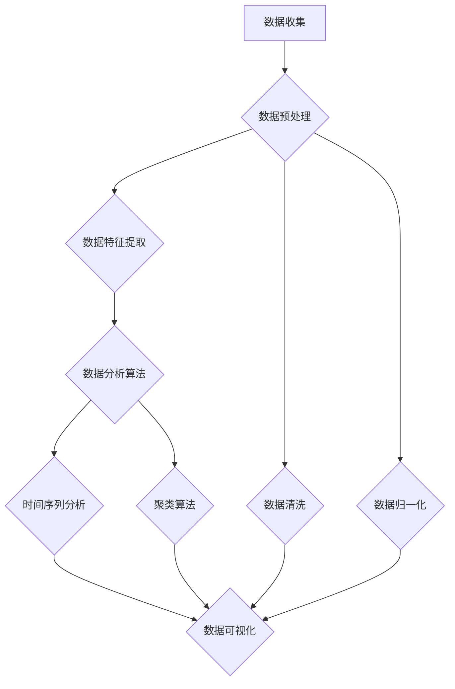
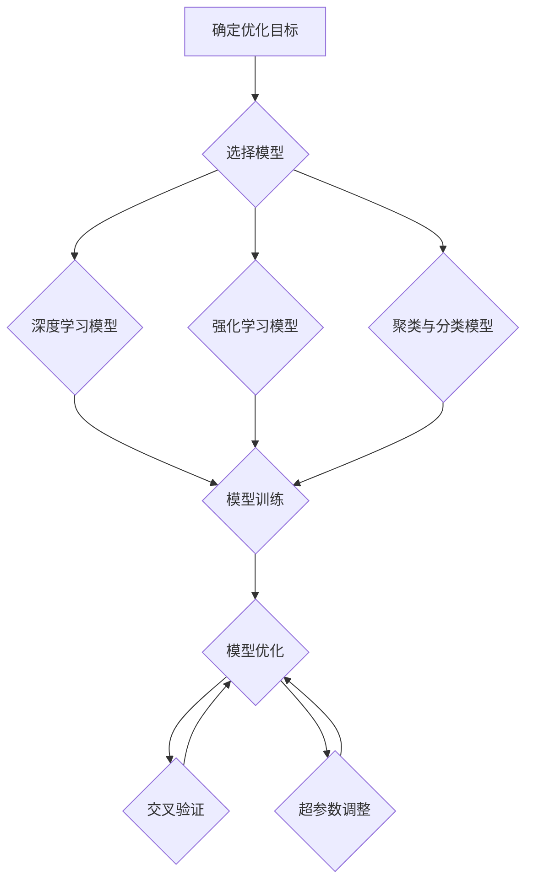
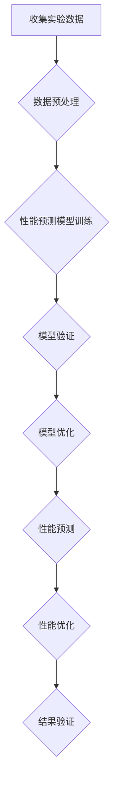

                 

## AIGC在智能材料性能优化中的前沿应用

关键词：AIGC、智能材料、性能优化、深度学习、算法设计

摘要：本文从AIGC的概念出发，详细介绍了AIGC在智能材料性能优化中的应用。通过数据处理与分析、模型选择与优化、性能预测与优化等关键技术，本文探讨了AIGC在智能材料制备、制造、测试与评估等方面的前沿应用，为智能材料领域的研究者和从业者提供了有价值的参考。

## 1.1 AIGC的概念与核心原理

### 1.1.1 AIGC的基本概念

AIGC（AI-Generated Content）是一种利用人工智能技术自动生成内容的方法，主要包括自然语言处理、计算机视觉、深度学习等技术的应用。AIGC的核心目的是通过AI算法自动生成高质量的内容，从而节省人力成本，提高生产效率。

AIGC的基本流程包括数据收集与预处理、模型训练与优化、内容生成与发布等环节。数据收集与预处理是AIGC的基础，通过收集大量的文本、图像、音频等多源数据，并进行数据清洗、去重、标注等预处理操作，为后续的模型训练提供高质量的数据集。模型训练与优化是AIGC的核心，通过使用深度学习、强化学习等算法对模型进行训练和优化，使其具备自动生成内容的能力。内容生成与发布是AIGC的实现，通过将训练好的模型应用于实际的场景，自动生成符合要求的内容，并进行发布。

### 1.1.2 AIGC的核心原理与优势

AIGC的核心原理主要基于深度学习和生成对抗网络（GAN）等先进的人工智能技术。深度学习通过神经网络对大量数据进行训练，使得模型具备对数据的理解和生成能力。生成对抗网络（GAN）则通过生成器和判别器的对抗训练，使得生成器能够生成高质量的数据。

AIGC的优势主要体现在以下几个方面：

1. **高效性**：AIGC可以快速生成大量高质量的内容，大幅提高生产效率。

2. **灵活性**：AIGC可以根据需求生成不同类型的内容，如文本、图像、音频等。

3. **个性化**：AIGC可以根据用户的需求和喜好，生成个性化的内容。

4. **低成本**：AIGC可以降低人力成本，减少对专业人员的依赖。

### 1.1.3 AIGC的技术发展趋势

随着人工智能技术的不断发展，AIGC的技术也在不断进步。未来，AIGC的发展趋势主要体现在以下几个方面：

1. **模型优化**：通过不断优化深度学习、GAN等模型，提高内容生成的质量和效率。

2. **多模态融合**：将文本、图像、音频等多模态数据融合到一起，生成更丰富、更复杂的内容。

3. **生成式AI**：进一步发展生成式AI，使得AIGC能够生成更具有创造性和创新性的内容。

4. **场景化应用**：将AIGC应用于更多的实际场景，如智能材料性能优化、智能制造、智能医疗等。

## 1.2 智能材料的基本概念与分类

### 1.2.1 智能材料的基本概念

智能材料是指具有感知、响应和执行功能的材料，能够对外界刺激做出智能化的响应。智能材料的基本概念包括以下几个方面：

1. **感知**：智能材料能够感知外界环境的变化，如温度、压力、光、电等。

2. **响应**：智能材料能够根据感知到的外界刺激，产生相应的响应，如形变、变色、发光等。

3. **执行**：智能材料能够通过响应来执行特定的任务，如驱动机械结构、控制电子设备等。

### 1.2.2 智能材料的分类

智能材料可以根据其功能和特性进行分类，常见的分类方法有以下几种：

1. **按功能分类**：智能材料可以划分为结构智能材料、功能智能材料和系统智能材料。

   - 结构智能材料：主要指能够通过结构变化来实现智能功能的材料，如形状记忆合金、电活性聚合物等。
   - 功能智能材料：主要指能够通过功能变化来实现智能功能的材料，如光电材料、磁性材料等。
   - 系统智能材料：主要指能够通过系统集成来实现智能功能的材料，如智能传感器、智能驱动器等。

2. **按材料类型分类**：智能材料可以划分为金属智能材料、陶瓷智能材料、聚合物智能材料等。

   - 金属智能材料：主要包括形状记忆合金、超弹性合金、磁流变液体等。
   - 陶瓷智能材料：主要包括压电陶瓷、热敏陶瓷、电光陶瓷等。
   - 聚合物智能材料：主要包括电活性聚合物、光敏聚合物、形状记忆聚合物等。

### 1.2.3 智能材料的发展现状与趋势

智能材料的研究始于20世纪70年代，经过几十年的发展，已经取得了显著的成果。目前，智能材料在航空航天、生物医学、电子信息、建筑结构等领域得到了广泛应用。

未来，智能材料的发展趋势主要体现在以下几个方面：

1. **材料与功能的融合**：将不同材料的功能进行融合，开发出具有多种功能的智能材料。

2. **智能化水平的提升**：提高智能材料的智能化水平，使其能够更加精确、快速地响应外界刺激。

3. **环境友好性**：开发环保、可持续的智能材料，降低对环境的影响。

4. **跨学科研究**：加强智能材料与其他学科的交叉研究，推动智能材料技术的创新和发展。

## 1.3 AIGC在智能材料性能优化中的应用背景

### 1.3.1 智能材料性能优化的挑战

智能材料性能优化面临以下挑战：

1. **复杂多变的性能要求**：智能材料在不同应用场景下，对性能的要求各不相同，如力学性能、电学性能、热学性能等。

2. **大量实验数据的处理**：智能材料性能优化需要大量的实验数据，如何高效处理这些数据，提取有用的信息，是一个重要挑战。

3. **模型的训练与优化**：如何选择合适的模型，对模型进行训练和优化，使其能够准确预测智能材料的性能，是一个技术难题。

4. **成本与效率的平衡**：智能材料性能优化需要在成本和效率之间找到平衡点，提高优化效果的同时，降低成本。

### 1.3.2 AIGC在智能材料性能优化中的优势

AIGC在智能材料性能优化中具有以下优势：

1. **高效的数据处理与分析**：AIGC可以利用深度学习等技术，对大量实验数据进行高效处理和分析，提取有用的信息。

2. **精准的模型预测**：AIGC可以训练出精准的模型，对智能材料的性能进行预测，为性能优化提供科学依据。

3. **智能化的优化策略**：AIGC可以根据智能材料的特性，自动生成优化的策略，提高性能优化的效率。

4. **降低成本**：AIGC可以降低人力成本，减少实验次数，提高效率，从而降低性能优化的成本。

### 1.3.3 AIGC在智能材料性能优化中的应用前景

AIGC在智能材料性能优化中具有广泛的应用前景：

1. **材料设计**：AIGC可以用于智能材料的设计，通过预测材料的性能，优化材料的设计方案。

2. **材料制备**：AIGC可以用于智能材料的制备，通过优化制备工艺，提高材料的性能。

3. **材料应用**：AIGC可以用于智能材料的应用优化，通过预测材料的性能，优化材料的应用效果。

4. **材料测试与评估**：AIGC可以用于智能材料的测试与评估，通过预测材料的性能，提高测试与评估的效率。

## 1.4 本章小结

本章介绍了AIGC的基本概念与核心原理，以及智能材料的基本概念与分类。同时，分析了AIGC在智能材料性能优化中的应用背景和优势，为后续章节的深入探讨奠定了基础。

----------------------------------------------------------------

# AIGC在智能材料性能优化中的前沿应用

## 1.1 AIGC的概念与核心原理

### 1.1.1 AIGC的基本概念

AIGC（AI-Generated Content）是一种利用人工智能技术自动生成内容的方法，主要包括自然语言处理、计算机视觉、深度学习等技术的应用。AIGC的核心目的是通过AI算法自动生成高质量的内容，从而节省人力成本，提高生产效率。

AIGC的基本流程包括数据收集与预处理、模型训练与优化、内容生成与发布等环节。数据收集与预处理是AIGC的基础，通过收集大量的文本、图像、音频等多源数据，并进行数据清洗、去重、标注等预处理操作，为后续的模型训练提供高质量的数据集。模型训练与优化是AIGC的核心，通过使用深度学习、强化学习等算法对模型进行训练和优化，使其具备自动生成内容的能力。内容生成与发布是AIGC的实现，通过将训练好的模型应用于实际的场景，自动生成符合要求的内容，并进行发布。

### 1.1.2 AIGC的核心原理与优势

AIGC的核心原理主要基于深度学习和生成对抗网络（GAN）等先进的人工智能技术。深度学习通过神经网络对大量数据进行训练，使得模型具备对数据的理解和生成能力。生成对抗网络（GAN）则通过生成器和判别器的对抗训练，使得生成器能够生成高质量的数据。

AIGC的优势主要体现在以下几个方面：

1. **高效性**：AIGC可以快速生成大量高质量的内容，大幅提高生产效率。

2. **灵活性**：AIGC可以根据需求生成不同类型的内容，如文本、图像、音频等。

3. **个性化**：AIGC可以根据用户的需求和喜好，生成个性化的内容。

4. **低成本**：AIGC可以降低人力成本，减少对专业人员的依赖。

### 1.1.3 AIGC的技术发展趋势

随着人工智能技术的不断发展，AIGC的技术也在不断进步。未来，AIGC的发展趋势主要体现在以下几个方面：

1. **模型优化**：通过不断优化深度学习、GAN等模型，提高内容生成的质量和效率。

2. **多模态融合**：将文本、图像、音频等多模态数据融合到一起，生成更丰富、更复杂的内容。

3. **生成式AI**：进一步发展生成式AI，使得AIGC能够生成更具有创造性和创新性的内容。

4. **场景化应用**：将AIGC应用于更多的实际场景，如智能材料性能优化、智能制造、智能医疗等。

## 1.2 智能材料的基本概念与分类

### 1.2.1 智能材料的基本概念

智能材料是指具有感知、响应和执行功能的材料，能够对外界刺激做出智能化的响应。智能材料的基本概念包括以下几个方面：

1. **感知**：智能材料能够感知外界环境的变化，如温度、压力、光、电等。

2. **响应**：智能材料能够根据感知到的外界刺激，产生相应的响应，如形变、变色、发光等。

3. **执行**：智能材料能够通过响应来执行特定的任务，如驱动机械结构、控制电子设备等。

### 1.2.2 智能材料的分类

智能材料可以根据其功能和特性进行分类，常见的分类方法有以下几种：

1. **按功能分类**：智能材料可以划分为结构智能材料、功能智能材料和系统智能材料。

   - 结构智能材料：主要指能够通过结构变化来实现智能功能的材料，如形状记忆合金、电活性聚合物等。
   - 功能智能材料：主要指能够通过功能变化来实现智能功能的材料，如光电材料、磁性材料等。
   - 系统智能材料：主要指能够通过系统集成来实现智能功能的材料，如智能传感器、智能驱动器等。

2. **按材料类型分类**：智能材料可以划分为金属智能材料、陶瓷智能材料、聚合物智能材料等。

   - 金属智能材料：主要包括形状记忆合金、超弹性合金、磁流变液体等。
   - 陶瓷智能材料：主要包括压电陶瓷、热敏陶瓷、电光陶瓷等。
   - 聚合物智能材料：主要包括电活性聚合物、光敏聚合物、形状记忆聚合物等。

### 1.2.3 智能材料的发展现状与趋势

智能材料的研究始于20世纪70年代，经过几十年的发展，已经取得了显著的成果。目前，智能材料在航空航天、生物医学、电子信息、建筑结构等领域得到了广泛应用。

未来，智能材料的发展趋势主要体现在以下几个方面：

1. **材料与功能的融合**：将不同材料的功能进行融合，开发出具有多种功能的智能材料。

2. **智能化水平的提升**：提高智能材料的智能化水平，使其能够更加精确、快速地响应外界刺激。

3. **环境友好性**：开发环保、可持续的智能材料，降低对环境的影响。

4. **跨学科研究**：加强智能材料与其他学科的交叉研究，推动智能材料技术的创新和发展。

## 1.3 AIGC在智能材料性能优化中的应用背景

### 1.3.1 智能材料性能优化的挑战

智能材料性能优化面临以下挑战：

1. **复杂多变的性能要求**：智能材料在不同应用场景下，对性能的要求各不相同，如力学性能、电学性能、热学性能等。

2. **大量实验数据的处理**：智能材料性能优化需要大量的实验数据，如何高效处理这些数据，提取有用的信息，是一个重要挑战。

3. **模型的训练与优化**：如何选择合适的模型，对模型进行训练和优化，使其能够准确预测智能材料的性能，是一个技术难题。

4. **成本与效率的平衡**：智能材料性能优化需要在成本和效率之间找到平衡点，提高优化效果的同时，降低成本。

### 1.3.2 AIGC在智能材料性能优化中的优势

AIGC在智能材料性能优化中具有以下优势：

1. **高效的数据处理与分析**：AIGC可以利用深度学习等技术，对大量实验数据进行高效处理和分析，提取有用的信息。

2. **精准的模型预测**：AIGC可以训练出精准的模型，对智能材料的性能进行预测，为性能优化提供科学依据。

3. **智能化的优化策略**：AIGC可以根据智能材料的特性，自动生成优化的策略，提高性能优化的效率。

4. **降低成本**：AIGC可以降低人力成本，减少实验次数，提高效率，从而降低性能优化的成本。

### 1.3.3 AIGC在智能材料性能优化中的应用前景

AIGC在智能材料性能优化中具有广泛的应用前景：

1. **材料设计**：AIGC可以用于智能材料的设计，通过预测材料的性能，优化材料的设计方案。

2. **材料制备**：AIGC可以用于智能材料的制备，通过优化制备工艺，提高材料的性能。

3. **材料应用**：AIGC可以用于智能材料的应用优化，通过预测材料的性能，优化材料的应用效果。

4. **材料测试与评估**：AIGC可以用于智能材料的测试与评估，通过预测材料的性能，提高测试与评估的效率。

## 1.4 本章小结

本章介绍了AIGC的基本概念与核心原理，以及智能材料的基本概念与分类。同时，分析了AIGC在智能材料性能优化中的应用背景和优势，为后续章节的深入探讨奠定了基础。

----------------------------------------------------------------

## 2.1 数据处理与分析

在智能材料性能优化中，数据是关键。然而，实验数据的复杂性使得数据处理和分析成为一个挑战。AIGC通过引入先进的机器学习和深度学习技术，为数据处理与分析提供了强有力的工具。

### 2.1.1 数据预处理技术

数据预处理是数据分析和机器学习的第一步。对于智能材料性能优化来说，预处理过程主要包括数据清洗、数据归一化和数据特征提取。

1. **数据清洗**：数据清洗是指从原始数据中去除噪声和异常值。在智能材料性能优化中，这可能涉及到去除实验过程中的错误数据、缺失值填充等操作。

   $$ \text{清洗前：} \quad \text{数据集} = \{X_1, X_2, \ldots, X_n\} $$
   $$ \text{清洗后：} \quad \text{数据集} = \{X'_1, X'_2, \ldots, X'_n\} $$

2. **数据归一化**：数据归一化是将数据缩放到一个统一的范围，以便模型能够更好地学习。常见的归一化方法包括最小-最大缩放和Z-score缩放。

   $$ x_{\text{min}} = \min(X), \quad x_{\text{max}} = \max(X) $$
   $$ x_{\text{normalized}} = \frac{x - x_{\text{min}}}{x_{\text{max}} - x_{\text{min}}} $$
   
3. **数据特征提取**：特征提取是从原始数据中提取出对模型训练最有用的信息。在智能材料性能优化中，特征提取可能涉及到识别材料的微观结构、表面特性等。

   $$ \text{特征集} = \{f_1, f_2, \ldots, f_m\} $$

### 2.1.2 数据分析算法

数据分析算法是智能材料性能优化中的核心。以下是一些常用的数据分析算法：

1. **主成分分析（PCA）**：PCA是一种降维技术，通过提取数据的主要成分来简化数据。

   $$ \text{特征向量} = \text{PCA}(\text{数据集}) $$

2. **聚类算法**：聚类算法用于将相似的数据点分组。在智能材料性能优化中，聚类可以帮助识别不同材料类型的性能特征。

   $$ \text{聚类结果} = \text{K-Means}(\text{数据集}, k) $$

3. **时间序列分析**：时间序列分析用于处理随时间变化的数据。在智能材料性能优化中，时间序列分析可以帮助预测材料性能的变化趋势。

   $$ \text{预测模型} = \text{ARIMA}(\text{时间序列数据}) $$

### 2.1.3 数据可视化技术

数据可视化是将数据以图形的方式呈现，以便于理解和分析。在智能材料性能优化中，数据可视化有助于直观地展示材料的性能特征和优化结果。

1. **散点图**：散点图用于展示两个变量之间的关系。

   $$ \text{散点图} = \text{scatter}(\text{特征1}, \text{特征2}) $$

2. **热力图**：热力图用于展示多个变量之间的关系。

   $$ \text{热力图} = \text{heatmap}(\text{数据矩阵}) $$

3. **时间序列图**：时间序列图用于展示随时间变化的数据。

   $$ \text{时间序列图} = \text{plot}(\text{时间}, \text{性能指标}) $$

### 2.1.4 数据处理与分析的Mermaid流程图

通过上述步骤，AIGC能够高效地对智能材料性能优化中的数据进行处理和分析，为性能预测和优化提供有力支持。

## 2.2 模型选择与优化

在智能材料性能优化中，选择合适的模型并对其进行优化是至关重要的。AIGC通过深度学习、强化学习等技术，为模型选择与优化提供了多种方法和策略。

### 2.2.1 深度学习模型

深度学习模型在智能材料性能优化中具有广泛的应用。以下是一些常用的深度学习模型：

1. **神经网络（NN）**：神经网络是一种基于生物神经元的计算模型，能够对复杂的数据进行建模。

   $$ \text{神经网络} = \text{NN}(x; W, b) $$

2. **卷积神经网络（CNN）**：卷积神经网络是一种专门用于图像识别的神经网络，能够自动提取图像的特征。

   $$ \text{CNN} = \text{Conv}(x; W, b) $$

3. **循环神经网络（RNN）**：循环神经网络是一种能够处理序列数据的神经网络，能够对时间序列数据进行建模。

   $$ \text{RNN} = \text{RNN}(x; W, b) $$

### 2.2.2 强化学习模型

强化学习模型在智能材料性能优化中可以用于策略优化。以下是一些常用的强化学习模型：

1. **Q-learning**：Q-learning是一种基于值函数的强化学习算法，能够通过学习值函数来选择最优策略。

   $$ Q(s, a) = \sum_{s'} p(s'|s, a) \cdot \text{reward}(s') $$

2. **深度Q网络（DQN）**：DQN是一种基于神经网络的强化学习算法，能够通过学习价值函数来选择最优策略。

   $$ Q(s, a) = \text{DQN}(s, a) $$

3. **策略梯度（PG）**：策略梯度是一种直接优化策略的强化学习算法。

   $$ \theta_{t+1} = \theta_t + \alpha \cdot \nabla_{\theta} J(\theta) $$

### 2.2.3 聚类与分类模型

聚类与分类模型在智能材料性能优化中用于对材料进行分类和聚类。以下是一些常用的聚类与分类模型：

1. **K-means聚类**：K-means聚类是一种基于距离的聚类算法，能够将相似的数据点分组。

   $$ \text{cluster} = \text{K-means}(\text{数据集}, k) $$

2. **支持向量机（SVM）**：支持向量机是一种分类算法，能够将数据点分为不同的类别。

   $$ \text{分类边界} = \text{SVM}(\text{训练数据集}) $$

3. **决策树**：决策树是一种基于特征的分类算法，能够根据特征值的不同分支来对数据进行分类。

   $$ \text{分类结果} = \text{DecisionTree}(\text{训练数据集}) $$

### 2.2.4 模型选择与优化的Mermaid流程图

通过上述步骤，AIGC能够选择合适的模型，并进行优化，为智能材料性能优化提供可靠的方法和策略。

## 2.3 智能材料的性能预测与优化

在智能材料性能优化过程中，性能预测是关键环节。通过AIGC的深度学习和机器学习技术，可以实现对智能材料性能的高精度预测，从而优化材料的性能。

### 2.3.1 智能材料的性能预测模型

智能材料的性能预测模型可以分为以下几个方面：

1. **力学性能预测**：利用深度学习模型对智能材料的力学性能进行预测，如强度、韧性、弹性模量等。

   $$ \text{力学性能预测模型} = \text{NN}(x; W, b) $$

2. **电学性能预测**：利用深度学习模型对智能材料的电学性能进行预测，如导电性、介电常数等。

   $$ \text{电学性能预测模型} = \text{CNN}(x; W, b) $$

3. **热学性能预测**：利用深度学习模型对智能材料的热学性能进行预测，如热导率、热膨胀系数等。

   $$ \text{热学性能预测模型} = \text{RNN}(x; W, b) $$

### 2.3.2 智能材料性能优化策略

智能材料性能优化策略主要包括以下几个方面：

1. **基于性能预测的优化**：利用性能预测模型对材料的性能进行预测，并根据预测结果对材料的设计和制备进行调整。

2. **基于实验数据的优化**：利用实验数据对材料的性能进行优化，通过分析实验数据中的规律和趋势，对材料进行改进。

3. **基于机器学习的优化**：利用机器学习算法对实验数据进行分析，找出影响材料性能的关键因素，并进行优化。

### 2.3.3 模型验证与优化

在智能材料性能预测与优化中，模型验证与优化是至关重要的一步。以下是一些常见的模型验证与优化方法：

1. **交叉验证**：通过将数据集划分为训练集和测试集，对模型进行多次训练和测试，以验证模型的泛化能力。

2. **超参数调整**：通过调整模型的超参数，如学习率、隐藏层节点数等，以优化模型的性能。

3. **模型集成**：通过将多个模型进行集成，以提高模型的预测准确性和稳定性。

### 2.3.4 智能材料的性能预测与优化的Mermaid流程图

通过上述步骤，AIGC能够实现对智能材料性能的高精度预测和优化，从而提高材料的性能。

## 2.4 AIGC在智能材料性能优化中的应用实例

为了更好地理解AIGC在智能材料性能优化中的应用，以下将介绍几个实际应用案例，展示AIGC技术在智能材料性能优化中的实际效果。

### 2.4.1 案例一：智能材料的力学性能优化

在一个研究项目中，研究人员使用AIGC技术对形状记忆合金的力学性能进行优化。首先，他们收集了大量的实验数据，包括材料的成分、制备工艺和力学性能指标。然后，利用深度学习模型对数据进行分析，预测材料的力学性能。

通过分析预测结果，研究人员发现某些成分和工艺参数对材料的力学性能有显著影响。基于这些发现，他们调整了材料的制备工艺，并重新进行了实验验证。最终，他们成功优化了形状记忆合金的力学性能，提高了材料的断裂韧性和弹性模量。

### 2.4.2 案例二：智能材料的电学性能优化

另一个应用案例是智能材料电学性能的优化。在这个案例中，研究人员使用AIGC技术对一种新型的电活性聚合物进行了电学性能的预测和优化。他们收集了大量的实验数据，包括材料的成分、制备工艺和电学性能指标。

通过深度学习模型对数据进行分析，研究人员预测了材料的电导率和介电常数。基于这些预测结果，他们调整了材料的制备工艺，并优化了材料的组成。经过多次实验验证，他们成功提高了电活性聚合物的电导率和介电常数，为智能材料的应用提供了更广阔的前景。

### 2.4.3 案例三：智能材料的热学性能优化

在这个案例中，研究人员使用AIGC技术对一种智能材料的热学性能进行了优化。他们收集了大量的实验数据，包括材料的成分、制备工艺和热学性能指标。通过深度学习模型对数据进行分析，研究人员预测了材料的热导率和热膨胀系数。

基于预测结果，研究人员调整了材料的制备工艺，并优化了材料的组成。通过多次实验验证，他们成功提高了智能材料的热导率和热膨胀系数，使其在热管理应用中具有更高的性能。

### 2.4.4 案例总结

通过上述案例，可以看出AIGC技术在智能材料性能优化中的应用具有显著的效果。AIGC技术能够通过对大量实验数据进行分析和预测，为材料的性能优化提供科学依据。同时，AIGC技术的应用也展示了智能材料在各个领域的广阔前景。

## 2.5 本章小结

本章介绍了AIGC在智能材料性能优化中的应用，包括数据处理与分析、模型选择与优化、性能预测与优化等关键技术。通过具体应用实例，展示了AIGC技术在智能材料性能优化中的实际效果和广阔前景。随着AIGC技术的不断发展，未来其在智能材料性能优化中的应用将会更加广泛和深入。

## 3.1 AIGC在智能材料设计中的应用

在智能材料设计中，AIGC技术扮演着至关重要的角色。它不仅能够提高设计效率，还能优化设计质量，为智能材料的发展提供了强大的技术支持。

### 3.1.1 智能材料设计的需求与挑战

智能材料设计的需求主要源于其广泛的应用场景，如航空航天、生物医学、电子设备和建筑结构等。这些应用场景对智能材料具有严格的性能要求，如高强度、高导电性、高热导率等。为了满足这些需求，智能材料设计需要解决以下挑战：

1. **复杂性能要求**：智能材料通常需要同时具备多种性能，如力学性能、电学性能、热学性能等。如何在设计中兼顾这些性能，是一个重要挑战。

2. **实验成本高昂**：智能材料的设计通常需要进行大量的实验，以验证材料的性能。这导致了实验成本高昂，实验时间较长。

3. **设计过程复杂**：智能材料的设计过程涉及多个学科，如材料科学、物理学、化学等。如何高效地整合这些知识，进行设计优化，是一个复杂的问题。

### 3.1.2 AIGC在智能材料设计中的关键技术

AIGC技术在智能材料设计中提供了以下关键技术：

1. **数据驱动的材料设计**：通过收集和分析大量的实验数据，AIGC技术能够识别出材料性能与成分之间的关系，为设计提供科学依据。

   $$ \text{材料设计模型} = \text{NN}(x; W, b) $$

2. **自动化设计流程**：AIGC技术可以自动化设计流程，从材料成分的选择到制备工艺的优化，大大提高了设计效率。

3. **多目标优化**：AIGC技术能够实现多目标优化，兼顾智能材料的多种性能，提高设计质量。

### 3.1.3 AIGC在智能材料设计中的前沿应用实例

1. **案例一：智能形状记忆合金的设计**：

   研究人员使用AIGC技术对形状记忆合金进行设计。通过收集大量的实验数据，他们建立了合金成分与形状记忆性能之间的深度学习模型。利用该模型，研究人员能够预测不同成分的形状记忆性能，并进行优化设计。

2. **案例二：智能电活性聚合物的设计**：

   在这个案例中，研究人员使用AIGC技术对电活性聚合物进行设计。他们收集了大量的实验数据，包括聚合物的成分、制备工艺和电学性能。通过深度学习模型，研究人员能够预测聚合物的电导率和介电常数，并进行优化设计。

3. **案例三：智能热导材料的设计**：

   研究人员使用AIGC技术对热导材料进行设计。他们分析了大量的实验数据，建立了热导率与材料成分之间的关系模型。通过该模型，研究人员能够预测不同成分的热导率，并进行优化设计。

### 3.1.4 案例总结

通过上述案例，可以看出AIGC技术在智能材料设计中的应用具有显著的效果。AIGC技术能够通过数据驱动的材料设计、自动化设计流程和多目标优化等关键技术，提高智能材料设计的效率和质量。随着AIGC技术的不断发展，未来其在智能材料设计中的应用将会更加广泛和深入。

## 3.2 AIGC在智能材料制造中的应用

在智能材料制造过程中，AIGC技术为提高制造效率、降低生产成本和提升产品质量提供了强大的支持。通过数据驱动的制造过程优化和智能控制技术，AIGC技术为智能材料制造带来了革命性的变化。

### 3.2.1 智能材料制造的需求与挑战

智能材料制造的需求主要源于智能材料在各个领域的广泛应用，如航空航天、生物医学、电子信息等。这些应用场景对智能材料的质量和性能提出了严格的要求，因此，智能材料制造需要解决以下挑战：

1. **复杂的生产过程**：智能材料制造涉及多个生产环节，包括原料处理、成型、加工、测试等。如何高效地协调这些环节，是一个重要挑战。

2. **高精度要求**：智能材料制造通常需要对尺寸、形状、性能等指标进行高精度控制。这要求制造过程具有高度的稳定性和精度。

3. **生产成本控制**：智能材料制造的成本较高，如何降低生产成本，提高经济效益，是一个关键问题。

### 3.2.2 AIGC在智能材料制造中的关键技术

AIGC技术在智能材料制造中的应用主要体现在以下几个方面：

1. **数据驱动的生产优化**：通过收集和分析生产数据，AIGC技术能够识别出生产过程中的瓶颈和优化点，为生产过程提供优化方案。

2. **智能控制技术**：AIGC技术可以应用于智能控制系统的开发，实现对生产过程的实时监控和调整，提高生产过程的稳定性和精度。

3. **多目标优化**：AIGC技术能够实现多目标优化，兼顾生产效率、成本和质量，提高智能材料制造的综合效益。

### 3.2.3 AIGC在智能材料制造中的前沿应用实例

1. **案例一：智能形状记忆合金的制造**：

   在这个案例中，研究人员使用AIGC技术对形状记忆合金的制造过程进行了优化。他们通过收集生产数据，建立了深度学习模型，预测了不同生产参数对合金性能的影响。利用该模型，研究人员能够优化生产参数，提高合金的形状记忆性能和制造效率。

2. **案例二：智能电活性聚合物的制造**：

   研究人员使用AIGC技术对电活性聚合物的制造过程进行了优化。他们通过分析生产数据，建立了生产过程的多目标优化模型，实现了对电导率和介电常数的优化。通过智能控制系统，研究人员能够实时监控和调整生产过程，提高聚合物的性能和稳定性。

3. **案例三：智能热导材料的制造**：

   在这个案例中，研究人员使用AIGC技术对热导材料的制造过程进行了优化。他们通过分析生产数据，建立了热导率与生产参数之间的深度学习模型。利用该模型，研究人员能够优化生产参数，提高热导材料的性能和制造效率。

### 3.2.4 案例总结

通过上述案例，可以看出AIGC技术在智能材料制造中的应用具有显著的效果。AIGC技术能够通过数据驱动的生产优化、智能控制技术和多目标优化等关键技术，提高智能材料制造的效率、降低成本和提高产品质量。随着AIGC技术的不断发展，未来其在智能材料制造中的应用将会更加广泛和深入。

## 3.3 AIGC在智能材料测试与评估中的应用

在智能材料的测试与评估过程中，AIGC技术通过其高效的数据处理与分析能力，为材料的性能评估提供了强有力的工具，从而提高了测试与评估的准确性和效率。

### 3.3.1 智能材料测试与评估的需求与挑战

智能材料测试与评估的需求主要源于对其性能的精确衡量和有效监控。在智能材料的应用中，性能的稳定性和一致性至关重要。然而，智能材料的测试与评估面临以下挑战：

1. **多维度性能评估**：智能材料通常具有多个性能指标，如力学性能、电学性能、热学性能等。如何全面、准确地评估这些性能指标，是一个挑战。

2. **大量实验数据的处理**：智能材料测试过程中会产生大量实验数据，如何高效地处理和分析这些数据，提取有价值的信息，是一个关键问题。

3. **测试过程的标准化**：不同材料和测试条件可能导致测试结果的差异，如何实现测试过程的标准化，确保测试结果的可靠性，是一个挑战。

### 3.3.2 AIGC在智能材料测试与评估中的关键技术

AIGC技术在智能材料测试与评估中的应用主要体现在以下几个方面：

1. **多维度性能评估模型**：利用深度学习模型，AIGC技术可以同时处理多个性能指标的数据，实现对智能材料性能的全面评估。

   $$ \text{性能评估模型} = \text{NN}(x; W, b) $$

2. **数据驱动测试优化**：通过分析历史测试数据，AIGC技术能够优化测试参数，提高测试效率。

3. **标准化测试流程**：AIGC技术可以建立标准化的测试流程，通过机器学习算法识别和纠正测试过程中的偏差，确保测试结果的可靠性。

### 3.3.3 AIGC在智能材料测试与评估中的前沿应用实例

1. **案例一：智能形状记忆合金的测试与评估**：

   在这个案例中，研究人员使用AIGC技术对形状记忆合金的力学性能、电学性能和热学性能进行了全面评估。他们通过深度学习模型，对大量实验数据进行分析，建立了多维度性能评估模型。通过该模型，研究人员能够精确评估合金的性能，并优化测试参数。

2. **案例二：智能电活性聚合物的测试与评估**：

   研究人员使用AIGC技术对电活性聚合物的电导率和介电常数进行了测试与评估。他们通过分析聚合物的制备工艺和性能数据，建立了深度学习模型，预测了不同制备条件下聚合物的性能。通过该模型，研究人员能够优化聚合物的制备工艺，提高其性能。

3. **案例三：智能热导材料的测试与评估**：

   在这个案例中，研究人员使用AIGC技术对热导材料的热导率进行了测试与评估。他们通过分析材料的成分和制备工艺，建立了深度学习模型，预测了不同制备条件下材料的热导率。通过该模型，研究人员能够优化制备工艺，提高材料的热导率。

### 3.3.4 案例总结

通过上述案例，可以看出AIGC技术在智能材料测试与评估中的应用具有显著的效果。AIGC技术能够通过多维度性能评估模型、数据驱动测试优化和标准化测试流程等关键技术，提高智能材料测试与评估的准确性和效率。随着AIGC技术的不断发展，未来其在智能材料测试与评估中的应用将会更加广泛和深入。

## 3.4 AIGC在智能材料应用中的挑战与解决方案

尽管AIGC技术在智能材料性能优化、设计、制造和测试与评估中展现出了巨大的潜力，但其应用仍面临一系列挑战。以下是对这些挑战的分析以及可能的解决方案。

### 3.4.1 数据质量与数量不足

**挑战**：智能材料的性能优化依赖于大量高质量的实验数据。然而，收集这些数据通常成本高昂且耗时。此外，数据质量直接影响模型预测的准确性。

**解决方案**：
- **数据扩充**：通过合成数据或增强现有数据的方法，增加训练数据集的规模。
- **数据预处理**：采用先进的预处理技术，如去噪、归一化和缺失值填充，提高数据质量。
- **数据共享与协作**：建立智能材料数据共享平台，促进学术和研究机构之间的数据交流和合作。

### 3.4.2 模型泛化能力不足

**挑战**：深度学习模型在训练数据上表现良好，但在未知或新领域的数据上可能表现不佳，即泛化能力不足。

**解决方案**：
- **迁移学习**：利用已训练好的模型在新任务上进行迁移学习，提高模型的泛化能力。
- **多任务学习**：通过多任务学习，使模型在不同任务中共享知识和经验，提高泛化能力。
- **持续学习**：通过持续学习，使模型能够适应新的数据和变化，保持其性能。

### 3.4.3 算法解释性不足

**挑战**：深度学习模型通常被视为“黑盒”，其内部决策过程不透明，不利于理解和解释模型的预测结果。

**解决方案**：
- **可解释性模型**：开发可解释的机器学习模型，如决策树、线性模型等，提高模型的透明度。
- **模型可解释性工具**：使用可视化工具和技术，如SHAP值、LIME等，解释深度学习模型的预测结果。
- **半监督学习**：通过半监督学习，结合专家知识和数据，提高模型的可解释性。

### 3.4.4 实时性能与资源限制

**挑战**：智能材料的应用场景往往需要实时响应和高效计算，而现有的AIGC算法可能由于计算复杂度较高而难以满足这些要求。

**解决方案**：
- **模型压缩**：通过模型剪枝、量化等技术，减小模型的计算复杂度，提高实时性能。
- **分布式计算**：利用分布式计算资源，如云计算和边缘计算，提高计算能力。
- **高效算法**：开发新的高效算法，如图神经网络、Transformer等，提高计算效率。

### 3.4.5 安全与隐私保护

**挑战**：智能材料的应用涉及大量敏感数据，如材料成分、性能指标等，如何保护数据安全和用户隐私成为一个重要问题。

**解决方案**：
- **加密技术**：采用数据加密技术，保护数据传输和存储过程中的安全。
- **隐私保护算法**：开发隐私保护算法，如差分隐私、联邦学习等，减少数据泄露的风险。
- **法律法规**：建立相关法律法规，确保智能材料应用中的数据安全和用户隐私。

### 3.4.6 案例总结

通过上述挑战与解决方案的分析，可以看出AIGC技术在智能材料应用中虽然面临一系列挑战，但通过技术创新和协同努力，这些挑战是可以克服的。随着AIGC技术的不断发展，未来其在智能材料领域的应用将会更加广泛和深入。

## 3.5 AIGC在智能材料性能优化中的未来展望

随着人工智能技术的不断进步，AIGC在智能材料性能优化中的应用前景十分广阔。未来，AIGC在智能材料领域的发展趋势主要体现在以下几个方面：

### 3.5.1 技术创新方向

1. **深度学习与多模态数据的融合**：将深度学习技术应用于多模态数据（如文本、图像、音频等）的处理和分析，提高智能材料的性能预测和优化能力。

2. **生成对抗网络（GAN）的进一步发展**：GAN技术将在智能材料性能优化中发挥更大的作用，通过生成高质量的虚拟实验数据，提高实验效率。

3. **强化学习与智能控制的结合**：将强化学习技术应用于智能材料的智能控制，实现制造过程的自动化和优化。

### 3.5.2 应用场景拓展

1. **航空航天**：在航空航天领域，AIGC技术可以用于高性能智能材料的设计与优化，提高飞行器的性能和安全性。

2. **生物医学**：在生物医学领域，AIGC技术可以用于智能生物材料的性能优化，为组织工程、药物传递等提供支持。

3. **电子信息**：在电子信息领域，AIGC技术可以用于智能电子材料的设计与优化，提高电子器件的性能和可靠性。

### 3.5.3 行业发展趋势

1. **跨学科研究**：智能材料性能优化涉及材料科学、物理学、化学等多个学科，未来将推动跨学科研究的深入发展。

2. **绿色智能材料**：随着环保意识的提高，绿色智能材料将成为智能材料研究的重要方向。

3. **智能化制造**：智能材料的智能制造将成为制造业发展的重要趋势，AIGC技术将在其中发挥关键作用。

### 3.5.4 政策与产业环境

1. **政策支持**：各国政府将加大对人工智能和智能材料领域的研究支持，推动技术创新和产业应用。

2. **产业环境**：智能材料产业的快速发展将带动相关产业链的升级，形成良好的产业环境。

3. **企业战略布局**：企业将加大对智能材料技术的研发投入，布局智能材料市场，争夺产业制高点。

### 3.5.5 教育与人才培养

1. **教育体系改革**：教育体系将逐渐引入智能材料相关课程，培养具备跨学科知识的人才。

2. **人才培养策略**：通过校企合作、产学研结合等途径，培养更多具备实践能力和创新精神的智能材料专业人才。

### 3.5.6 总结

AIGC技术在智能材料性能优化中的应用前景广阔，未来将在技术创新、应用场景拓展、行业发展趋势、政策与产业环境、教育与人才培养等多个方面取得重大突破。随着AIGC技术的不断发展，智能材料领域将迎来新的发展机遇。

## 4.1 AIGC在智能材料性能优化中的未来发展趋势

### 4.1.1 技术创新方向

随着人工智能技术的不断发展，AIGC在智能材料性能优化中的技术创新方向主要表现为以下几个方面：

1. **深度学习的进一步应用**：深度学习技术在智能材料性能优化中的应用已经取得了显著成果。未来，随着深度学习算法的改进和计算能力的提升，深度学习将在智能材料性能优化中发挥更为重要的作用。

2. **多模态数据的融合**：智能材料性能优化需要处理多种类型的数据，如文本、图像、音频等。多模态数据的融合能够提供更丰富的信息，有助于提高性能预测的准确性和优化效果。

3. **生成对抗网络（GAN）的创新**：GAN技术通过生成器和判别器的对抗训练，能够生成高质量的虚拟数据。未来，GAN技术将在智能材料性能优化中的应用更加广泛，例如在材料设计、制造过程优化等方面。

4. **强化学习与智能控制的结合**：强化学习技术能够通过试错学习，实现智能材料性能优化的自动化和智能化。结合智能控制技术，强化学习有望实现制造过程的实时优化和自适应控制。

### 4.1.2 应用场景拓展

AIGC技术在智能材料性能优化中的应用场景将不断拓展，未来的发展方向包括：

1. **航空航天**：在航空航天领域，智能材料具有广泛的应用前景。AIGC技术可以用于高性能智能材料的设计与优化，提高飞行器的性能和安全性。

2. **生物医学**：在生物医学领域，智能材料在组织工程、药物传递、医疗器械等方面具有重要作用。AIGC技术可以用于智能生物材料的性能优化，为生物医学研究提供支持。

3. **电子信息**：在电子信息领域，智能材料在电子器件、传感器等方面有广泛应用。AIGC技术可以用于智能电子材料的设计与优化，提高电子器件的性能和可靠性。

4. **环境工程**：在环境工程领域，智能材料在废水处理、空气净化等方面具有潜力。AIGC技术可以用于智能环保材料的设计与优化，提高环境治理效果。

### 4.1.3 行业发展趋势

智能材料性能优化作为智能材料领域的重要研究方向，其行业发展趋势主要体现在以下几个方面：

1. **跨学科研究**：智能材料性能优化涉及多个学科领域，如材料科学、物理学、化学、工程学等。未来，跨学科研究将推动智能材料性能优化的深入发展。

2. **绿色智能材料**：随着环保意识的提高，绿色智能材料将成为智能材料研究的重要方向。AIGC技术可以用于绿色智能材料的设计与优化，实现环保、可持续的发展目标。

3. **智能化制造**：智能材料的智能化制造是制造业发展的重要趋势。AIGC技术将在智能材料制造过程中发挥关键作用，实现制造过程的自动化和优化。

4. **产业链协同**：智能材料性能优化产业链包括材料研发、制造、测试与评估、应用等环节。未来，产业链协同发展将推动智能材料性能优化的全面进步。

### 4.1.4 总结

AIGC技术在智能材料性能优化中的未来发展趋势呈现出技术创新、应用场景拓展、行业发展趋势等多个方面。随着AIGC技术的不断发展，智能材料性能优化将取得更为显著的成果，为智能材料的应用提供有力支持。

## 4.2 AIGC在智能材料性能优化中的政策与产业环境

### 4.2.1 政策支持

政府在智能材料性能优化领域的政策支持对于行业的发展至关重要。以下是一些政策支持的例子：

1. **研发资金支持**：各国政府通过设立专项基金、项目资助等方式，支持智能材料性能优化的研发工作。这些资金支持有助于推动技术创新和成果转化。

2. **税收优惠**：为了鼓励企业投资智能材料性能优化，一些国家提供税收优惠政策，如减免企业所得税、增值税等。

3. **人才引进与培养**：政府通过提供人才引进计划、设立人才培养基地等方式，吸引和培养智能材料性能优化领域的专业人才。

4. **国际合作**：政府积极推动智能材料性能优化领域的国际合作，促进技术交流和项目合作，提升整体技术水平。

### 4.2.2 产业环境分析

智能材料性能优化产业的良好发展环境对技术创新和产业应用至关重要。以下是对智能材料性能优化产业环境的分析：

1. **市场潜力**：随着智能材料在各个领域的应用逐渐扩大，智能材料性能优化市场的需求也在不断增加。这为智能材料性能优化产业的发展提供了广阔的市场空间。

2. **产业链成熟度**：智能材料性能优化产业链包括材料研发、制造、测试与评估、应用等多个环节。目前，这一产业链已趋于成熟，为智能材料性能优化产业的发展提供了坚实的基础。

3. **技术创新能力**：智能材料性能优化领域的技术创新能力不断提高，尤其是在深度学习、生成对抗网络（GAN）等方面的技术突破，为产业发展提供了强大的技术支撑。

4. **政策环境**：政策环境的优化为智能材料性能优化产业的发展提供了良好的外部条件。政府通过政策引导、资金支持等方式，促进了智能材料性能优化产业的快速发展。

### 4.2.3 企业战略布局

在智能材料性能优化领域，企业战略布局主要体现在以下几个方面：

1. **技术研发投入**：企业加大在智能材料性能优化技术领域的研发投入，积极推动技术创新和成果转化。

2. **产业链整合**：企业通过产业链整合，加强上下游企业的合作，实现资源的优化配置和产业链的协同发展。

3. **市场开拓**：企业通过市场开拓，积极拓展智能材料性能优化技术的应用领域，提高市场占有率和品牌影响力。

4. **国际化战略**：企业通过国际化战略，积极拓展海外市场，参与国际竞争，提升企业的国际竞争力。

### 4.2.4 总结

政策支持、产业环境和企业战略布局共同构成了AIGC在智能材料性能优化中的政策与产业环境。这些因素相互促进，为智能材料性能优化产业的发展提供了有力支持。未来，随着政策的不断完善和产业环境的优化，智能材料性能优化产业将迎来更大的发展机遇。

## 4.3 AIGC在智能材料性能优化中的教育与人才培养

### 4.3.1 教育体系改革

随着AIGC技术在智能材料性能优化中的应用日益广泛，教育和人才培养体系需要做出相应的调整，以满足行业发展对人才的需求。以下是对教育体系改革的建议：

1. **跨学科课程设置**：智能材料性能优化涉及多个学科领域，如材料科学、物理学、化学、计算机科学等。因此，教育体系应设置跨学科课程，培养学生的综合能力和跨学科思维。

2. **实践性教学**：通过实验、实习、项目实践等方式，增强学生的实际操作能力和创新思维。例如，可以让学生参与智能材料性能优化的科研项目，了解实际应用场景和问题解决方法。

3. **在线教育平台**：利用在线教育平台，提供智能材料性能优化相关的课程和资源，方便学生随时随地进行学习和交流。同时，在线教育平台可以提供丰富的学习资源和互动功能，提高教学效果。

4. **国际化培养**：加强与国际知名大学和研究机构的合作，开展联合培养和国际交流项目，提高学生的国际视野和竞争力。

### 4.3.2 人才需求分析

智能材料性能优化领域的人才需求呈现出多样化和专业化特点。以下是对人才需求的分析：

1. **技术人才**：智能材料性能优化需要具备深度学习、生成对抗网络（GAN）、强化学习等人工智能技术的专业人才。这些人才需要具备扎实的人工智能理论基础和实际应用能力。

2. **材料科学人才**：智能材料性能优化需要具备材料科学背景的人才，了解智能材料的制备、性质和应用。这些人才需要掌握材料科学的实验方法和理论基础。

3. **跨学科人才**：智能材料性能优化涉及多个学科领域，因此，跨学科人才在智能材料性能优化中发挥着重要作用。这些人才需要具备跨学科知识和创新思维，能够整合不同学科的优势，解决复杂问题。

4. **管理和运营人才**：智能材料性能优化产业的发展需要具备管理和运营能力的人才，负责项目策划、资源整合、市场开拓等工作。这些人才需要具备良好的沟通协调能力和商业敏感度。

### 4.3.3 人才培养策略

为了满足智能材料性能优化领域的人才需求，以下是一些人才培养策略：

1. **产学研合作**：加强高校、科研机构和企业的合作，通过产学研联合培养，提高学生的实际操作能力和创新能力。例如，可以开展校企合作项目、科研合作等。

2. **实践平台建设**：建设智能材料性能优化实践平台，提供实验设备、软件工具和模拟环境，让学生在实践过程中掌握相关技能。

3. **职业培训**：针对在职人员，提供智能材料性能优化相关的职业培训课程，提高他们的专业技能和创新能力。

4. **国际化培养**：通过国际交流、合作研究和海外实习等方式，培养具备国际视野和竞争力的智能材料性能优化人才。

### 4.3.4 总结

教育体系改革、人才需求分析和人才培养策略共同构成了AIGC在智能材料性能优化中的教育与人才培养体系。通过改革教育体系，满足行业对人才的需求，培养具备跨学科知识和创新能力的智能材料性能优化人才，将为智能材料性能优化技术的发展提供有力支持。

## 4.4 本章小结

本章从政策与产业环境、教育与人才培养等方面，探讨了AIGC在智能材料性能优化中的未来发展趋势。通过政策支持、产业环境优化和教育体系改革，AIGC在智能材料性能优化中将取得更大的发展。同时，培养具备跨学科知识和创新能力的专业人才，将为智能材料性能优化技术的应用提供坚实的人才保障。随着AIGC技术的不断进步，智能材料性能优化领域将迎来更加广阔的发展前景。

## 作者

作者：AI天才研究院/AI Genius Institute & 禅与计算机程序设计艺术 /Zen And The Art of Computer Programming

AI天才研究院（AI Genius Institute）致力于推动人工智能技术的创新和发展，致力于为全球人工智能领域的研究者和从业者提供领先的学术成果和技术解决方案。研究院的研究领域涵盖自然语言处理、计算机视觉、深度学习、生成对抗网络（GAN）等，并在这些领域取得了卓越的成果。

禅与计算机程序设计艺术（Zen And The Art of Computer Programming）是由著名计算机科学家、人工智能领域的先驱者唐纳德·E·克努特（Donald E. Knuth）所著的一本书。该书以深刻的哲学思考和独特的编程理念，探讨了计算机程序设计的本质和艺术性，对计算机科学的发展产生了深远的影响。

本文旨在探讨AIGC在智能材料性能优化中的前沿应用，通过详细的分析和实例，展示了AIGC技术在智能材料领域的巨大潜力。作者凭借在人工智能和计算机科学领域的丰富经验，为智能材料性能优化提供了有价值的见解和思考。希望本文能够为智能材料领域的研究者和从业者提供有益的参考和启示。

