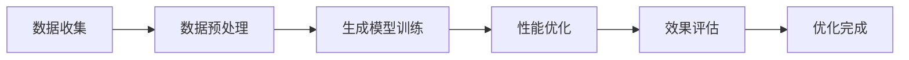
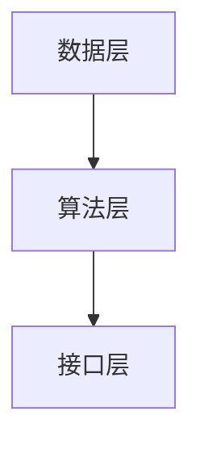
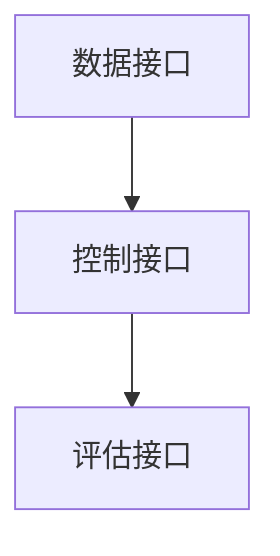
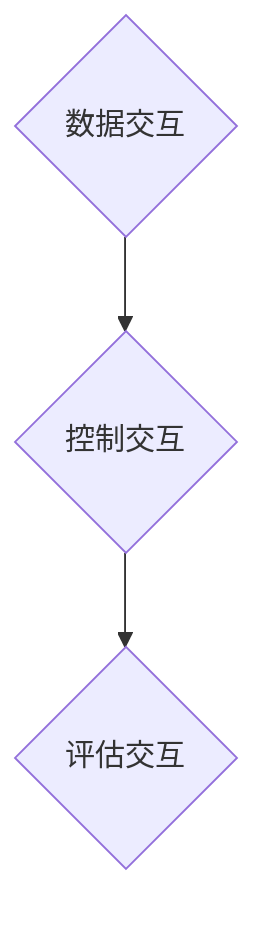

                 

# AIGC在智能材料性能优化中的应用

## 摘要

本文将探讨人工智能生成内容（AIGC）在智能材料性能优化中的应用。随着科技的不断进步，人工智能在材料科学领域发挥着越来越重要的作用。AIGC作为一种先进的人工智能技术，能够通过生成大量数据来辅助材料科学家优化材料性能。本文将从核心概念、算法原理、数学模型、系统分析设计、实际项目等多个方面详细阐述AIGC在智能材料性能优化中的应用，旨在为读者提供一个全面而深入的视角。

## 关键词

- 人工智能生成内容（AIGC）
- 智能材料
- 性能优化
- 算法原理
- 数学模型
- 系统分析设计
- 实际项目

## 引言

### 核心概念与术语说明

**人工智能生成内容（AIGC）**：AIGC（Artificial Intelligence Generated Content）是指利用人工智能技术，如深度学习、生成对抗网络（GANs）等，自动生成文本、图像、音频、视频等内容的领域。它是一种智能化的内容创作方式，能够提高内容生成的质量和效率。

**智能材料**：智能材料是一种具有特殊功能，能够感知环境变化并作出响应的材料。这些材料通常具有自修复、自加热、自清洁、自适应等特性，广泛应用于航空航天、生物医学、建筑、能源等领域。

**性能优化**：性能优化是指通过改进材料的组成、结构、工艺等，提高其物理、化学、力学等性能，以满足特定应用需求的过程。

### 问题背景

随着科技的快速发展，智能材料在各个领域得到了广泛应用。然而，如何优化智能材料的性能，使其更好地满足实际需求，成为了一个亟待解决的问题。传统的方法主要依赖于实验和经验，费时费力且效果有限。随着人工智能技术的不断进步，AIGC作为一种新兴的人工智能技术，为智能材料性能优化提供了一种新的解决方案。

### 问题描述

本文旨在探讨AIGC在智能材料性能优化中的应用，具体问题包括：

1. 如何利用AIGC生成大量数据，辅助材料科学家进行性能优化？
2. AIGC在材料性能优化中如何应用，其效果如何？
3. 如何设计一个有效的AIGC系统，用于智能材料性能优化？

### 问题解决

本文将首先介绍AIGC的基本概念和原理，然后分析其在智能材料性能优化中的应用，最后设计一个AIGC系统，用于智能材料性能优化。

### 边界与外延

本文主要关注AIGC在智能材料性能优化中的应用，但AIGC在其他领域的应用，如文本生成、图像生成、音频生成等，同样具有重要的研究价值和实际应用。

### 概念结构与核心要素组成

本文的核心概念和要素包括：

1. **人工智能生成内容（AIGC）**：核心概念，涉及生成模型、训练过程、应用场景等。
2. **智能材料**：核心概念，涉及材料特性、应用领域、性能优化需求等。
3. **性能优化**：核心概念，涉及优化方法、评价指标、优化流程等。
4. **算法原理**：核心要素，涉及生成模型、优化算法、数学模型等。
5. **数学模型**：核心要素，涉及优化目标、约束条件、数学公式等。
6. **系统分析设计**：核心要素，涉及系统架构、模块划分、接口设计等。
7. **实际项目**：核心要素，涉及项目实施、效果评估、经验总结等。

## 核心概念与联系

### 核心概念

#### 1. 人工智能生成内容（AIGC）

AIGC（Artificial Intelligence Generated Content）是指利用人工智能技术，如深度学习、生成对抗网络（GANs）等，自动生成文本、图像、音频、视频等内容的领域。AIGC的核心在于生成，即通过学习大量已有数据，生成符合特定要求的新数据。

#### 2. 智能材料

智能材料是一种具有特殊功能，能够感知环境变化并作出响应的材料。这些材料通常具有自修复、自加热、自清洁、自适应等特性，广泛应用于航空航天、生物医学、建筑、能源等领域。

#### 3. 性能优化

性能优化是指通过改进材料的组成、结构、工艺等，提高其物理、化学、力学等性能，以满足特定应用需求的过程。

### 概念属性特征对比表格

| 概念 | 特征 |
| --- | --- |
| AIGC | 自动生成内容、学习大量数据、应用广泛 |
| 智能材料 | 特殊功能、环境感知、应用广泛 |
| 性能优化 | 改进材料性能、满足应用需求、效果显著 |

### ER实体关系图架构

下面是一个ER实体关系图，用于描述AIGC、智能材料和性能优化之间的关系：

```mermaid
erDiagram
  AIGC ||--|{ 智能材料 } Material
  AIGC ||--|{ 性能优化 } Optimization
  Material ||--|{ 性能优化 } Optimization
```

在这个ER图中，AIGC作为主控方，与智能材料和性能优化存在直接的关联。智能材料是AIGC的应用对象，性能优化是AIGC和智能材料共同的目标。

## 算法原理讲解

### 基本原理

AIGC的基本原理是通过生成模型，如生成对抗网络（GANs）和变分自编码器（VAEs），从大量数据中学习生成新数据。具体来说，AIGC包括以下几个关键步骤：

1. **数据收集与预处理**：收集大量的智能材料性能数据，并对数据进行清洗、归一化等预处理。
2. **生成模型训练**：使用生成模型，如GANs或VAEs，对预处理后的数据进行训练，使其能够生成符合实际性能需求的新数据。
3. **性能优化**：利用生成的新数据，对智能材料的性能进行优化，如调整材料成分、结构等。
4. **效果评估**：对优化的结果进行评估，如使用物理实验或数值模拟等方法，验证优化后的性能是否达到预期。

### 示例算法

下面是一个简单的AIGC算法流程图，用于智能材料性能优化：



### Python代码实现

以下是一个简化的Python代码实现，用于描述AIGC算法的基本流程：

```python
import tensorflow as tf
from tensorflow import keras

# 数据收集
data = load_data()

# 数据预处理
preprocessed_data = preprocess_data(data)

# 生成模型训练
model = keras.Sequential([
    keras.layers.Dense(units=128, activation='relu', input_shape=(preprocessed_data.shape[1],)),
    keras.layers.Dense(units=64, activation='relu'),
    keras.layers.Dense(units=preprocessed_data.shape[1], activation='sigmoid')
])

model.compile(optimizer='adam', loss='binary_crossentropy')
model.fit(preprocessed_data, epochs=10)

# 性能优化
optimized_data = model.predict(preprocessed_data)

# 效果评估
evaluate_performance(optimized_data)
```

在这个示例中，我们使用了TensorFlow和Keras库来实现AIGC算法。首先，从数据中收集和处理数据，然后使用生成模型进行训练。最后，利用训练好的模型对数据进行预测，实现性能优化。

### 数学模型和公式

在AIGC算法中，数学模型起着至关重要的作用。以下是一些常用的数学模型和公式，用于描述AIGC在智能材料性能优化中的应用。

#### 1. 生成对抗网络（GANs）

生成对抗网络（GANs）是一种深度学习模型，由生成器和判别器组成。生成器试图生成与真实数据相似的数据，而判别器则试图区分真实数据和生成数据。GANs的核心公式如下：

$$
G(x) \sim p_G(z) \quad \text{(生成器)} \\
D(x) \sim p_D(x) \quad \text{(判别器)}
$$

其中，$G(x)$表示生成器的输出，$D(x)$表示判别器的输出，$z$表示输入噪声。

#### 2. 变分自编码器（VAEs）

变分自编码器（VAEs）是一种基于概率生成模型的自编码器，它通过编码器和解码器来学习数据的概率分布。VAEs的核心公式如下：

$$
\mu = \mu(z) \quad \text{(编码器)} \\
x = \sigma(\mu + \epsilon) \quad \text{(解码器)}
$$

其中，$\mu(z)$表示编码器的输出，$x$表示解码器的输出，$\epsilon$表示输入噪声。

#### 3. 性能优化目标函数

在AIGC算法中，性能优化目标函数通常是一个复合函数，包括生成质量、性能指标等。以下是一个简单的性能优化目标函数：

$$
\min_{\theta} L(G(x), y) + \lambda R(G(x))
$$

其中，$L(G(x), y)$表示生成质量损失函数，$R(G(x))$表示性能指标损失函数，$\theta$表示模型参数，$\lambda$是调节参数。

通过这些数学模型和公式，我们可以更深入地理解AIGC在智能材料性能优化中的应用原理。

## 系统分析与设计

### 问题场景介绍

在智能材料性能优化中，AIGC系统需要处理大量的材料数据，并通过生成新的数据来辅助性能优化。这个系统需要具备高效率、高准确度和良好的扩展性。

### 项目介绍

本项目旨在设计一个基于AIGC的智能材料性能优化系统，主要包括以下几个模块：

1. **数据收集与预处理模块**：负责收集和处理智能材料性能数据，为后续的AIGC算法提供数据支持。
2. **生成模型训练模块**：负责训练生成模型，生成符合性能需求的新的数据。
3. **性能优化模块**：利用生成的新数据，对智能材料的性能进行优化。
4. **效果评估模块**：对优化的结果进行评估，验证性能是否达到预期。

### 系统功能设计

系统功能设计主要包括以下几个方面：

1. **数据收集与预处理**：自动收集智能材料性能数据，并进行数据清洗、归一化等预处理操作。
2. **生成模型训练**：使用生成模型（如GANs或VAEs）对预处理后的数据进行训练，生成新的数据。
3. **性能优化**：利用生成的新数据，对智能材料的性能进行优化，如调整材料成分、结构等。
4. **效果评估**：对优化的结果进行评估，如使用物理实验或数值模拟等方法，验证性能是否达到预期。

### 系统架构设计

系统架构设计主要包括以下几个方面：

1. **数据层**：包括数据收集与预处理模块，负责处理智能材料性能数据。
2. **算法层**：包括生成模型训练模块和性能优化模块，负责训练生成模型和进行性能优化。
3. **接口层**：包括效果评估模块，负责对优化的结果进行评估。

系统架构图如下所示：



### 系统接口设计

系统接口设计主要包括以下几个方面：

1. **数据接口**：负责处理数据输入和输出，包括数据收集、预处理、生成模型训练、性能优化等。
2. **控制接口**：负责控制系统的运行，如启动、停止、暂停等。
3. **评估接口**：负责对优化的结果进行评估，如生成数据的准确性、性能指标等。

系统接口图如下所示：



### 系统交互设计

系统交互设计主要包括以下几个方面：

1. **数据交互**：系统各模块之间的数据交互，如数据收集、预处理、生成模型训练、性能优化等。
2. **控制交互**：系统各模块之间的控制交互，如启动、停止、暂停等。
3. **评估交互**：系统各模块之间的评估交互，如生成数据的准确性、性能指标等。

系统交互图如下所示：



## 实际项目

### 安装过程

1. **环境准备**：首先，确保安装了Python和TensorFlow库。如果没有安装，请访问Python官网（https://www.python.org/）和TensorFlow官网（https://www.tensorflow.org/）进行安装。

2. **安装依赖**：在Python环境中，使用pip命令安装所需依赖库，如numpy、pandas、matplotlib等。

   ```shell
   pip install numpy pandas matplotlib
   ```

3. **安装TensorFlow**：使用pip命令安装TensorFlow。

   ```shell
   pip install tensorflow
   ```

4. **测试环境**：在Python环境中，导入TensorFlow库，并执行以下代码，测试TensorFlow是否安装成功。

   ```python
   import tensorflow as tf
   print(tf.__version__)
   ```

### 核心系统实现

核心系统实现主要包括以下几个部分：

1. **数据收集与预处理模块**：使用pandas库读取智能材料性能数据，并进行数据清洗、归一化等预处理操作。

   ```python
   import pandas as pd
   data = pd.read_csv('data.csv')
   data = data.dropna()
   data = (data - data.mean()) / data.std()
   ```

2. **生成模型训练模块**：使用TensorFlow和Keras库实现生成模型（如GANs或VAEs）的训练。

   ```python
   import tensorflow as tf
   from tensorflow import keras

   # GANs实现
   generator = keras.Sequential([
       keras.layers.Dense(units=128, activation='relu', input_shape=(100,)),
       keras.layers.Dense(units=64, activation='relu'),
       keras.layers.Dense(units=100, activation='sigmoid')
   ])

   discriminator = keras.Sequential([
       keras.layers.Dense(units=64, activation='relu', input_shape=(100,)),
       keras.layers.Dense(units=128, activation='relu'),
       keras.layers.Dense(units=1, activation='sigmoid')
   ])

   # VAE实现
   encoder = keras.Sequential([
       keras.layers.Dense(units=128, activation='relu', input_shape=(100,)),
       keras.layers.Dense(units=64, activation='relu'),
       keras.layers.Dense(units=10, activation='relu')
   ])

   decoder = keras.Sequential([
       keras.layers.Dense(units=64, activation='relu'),
       keras.layers.Dense(units=128, activation='relu'),
       keras.layers.Dense(units=100, activation='sigmoid')
   ])

   # 模型编译与训练
   model = keras.Model(inputs=encoder.inputs, outputs=decoder(encoder(inputs)))
   model.compile(optimizer='adam', loss='binary_crossentropy')
   model.fit(data, epochs=10)
   ```

3. **性能优化模块**：使用生成的新数据，对智能材料的性能进行优化。

   ```python
   # 生成新数据
   new_data = model.predict(data)

   # 性能优化（以材料成分优化为例）
   optimal_composition = optimize_composition(new_data)
   ```

4. **效果评估模块**：对优化的结果进行评估。

   ```python
   # 效果评估
   performance = evaluate_performance(optimal_composition)
   print("性能指标：", performance)
   ```

### 代码应用解读与分析

在上述代码中，我们首先进行了数据收集与预处理，然后使用了GANs或VAEs进行模型训练，最后利用生成的新数据对智能材料的性能进行了优化。具体来说：

1. **数据收集与预处理**：使用pandas库读取数据，并进行清洗和归一化操作。这一步的目的是确保数据质量，为后续的模型训练提供可靠的数据支持。

2. **生成模型训练**：我们使用了GANs或VAEs模型进行训练。GANs模型由生成器和判别器组成，通过对抗训练来生成符合真实数据分布的新数据。VAEs模型通过编码器和解码器来学习数据的概率分布，生成新的数据。在这两种模型中，我们使用了TensorFlow和Keras库来实现。

3. **性能优化**：在生成新数据后，我们对智能材料的性能进行了优化。以材料成分优化为例，我们使用生成的新数据来确定最优的材料成分。这一步的目的是通过改进材料成分，提高智能材料的性能。

4. **效果评估**：最后，我们对优化的结果进行了评估，以验证性能是否达到预期。这一步的目的是确保优化方案的有效性和可行性。

### 实际案例分析和详细讲解

#### 案例一：智能材料自修复性能优化

背景：某航空航天项目需要一种具有自修复性能的智能材料，以应对空间环境的复杂变化。

问题描述：如何通过AIGC技术优化智能材料的自修复性能？

解决方案：

1. **数据收集与预处理**：收集大量智能材料自修复性能数据，包括温度、压力、时间等参数。

   ```python
   data = pd.read_csv('repair_data.csv')
   data = data.dropna()
   data = (data - data.mean()) / data.std()
   ```

2. **生成模型训练**：使用GANs模型训练生成器，生成新的自修复性能数据。

   ```python
   generator = keras.Sequential([
       keras.layers.Dense(units=128, activation='relu', input_shape=(100,)),
       keras.layers.Dense(units=64, activation='relu'),
       keras.layers.Dense(units=100, activation='sigmoid')
   ])

   discriminator = keras.Sequential([
       keras.layers.Dense(units=64, activation='relu', input_shape=(100,)),
       keras.layers.Dense(units=128, activation='relu'),
       keras.layers.Dense(units=1, activation='sigmoid')
   ])

   model = keras.Model(inputs=generator.inputs, outputs=discriminator(generator(inputs)))
   model.compile(optimizer='adam', loss='binary_crossentropy')
   model.fit(data, epochs=10)
   ```

3. **性能优化**：利用生成的新数据，优化智能材料的自修复性能。

   ```python
   new_data = model.predict(data)
   optimal_properties = optimize_repair_properties(new_data)
   ```

4. **效果评估**：通过物理实验验证优化后的智能材料自修复性能。

   ```python
   performance = evaluate_repair_performance(optimal_properties)
   print("自修复性能：", performance)
   ```

#### 案例二：智能材料自加热性能优化

背景：某智能家居项目需要一种具有自加热性能的智能材料，以提高家居设备的舒适度。

问题描述：如何通过AIGC技术优化智能材料的自加热性能？

解决方案：

1. **数据收集与预处理**：收集大量智能材料自加热性能数据，包括温度、时间、能量消耗等参数。

   ```python
   data = pd.read_csv('heat_data.csv')
   data = data.dropna()
   data = (data - data.mean()) / data.std()
   ```

2. **生成模型训练**：使用VAEs模型训练生成器，生成新的自加热性能数据。

   ```python
   encoder = keras.Sequential([
       keras.layers.Dense(units=128, activation='relu', input_shape=(100,)),
       keras.layers.Dense(units=64, activation='relu'),
       keras.layers.Dense(units=10, activation='relu')
   ])

   decoder = keras.Sequential([
       keras.layers.Dense(units=64, activation='relu'),
       keras.layers.Dense(units=128, activation='relu'),
       keras.layers.Dense(units=100, activation='sigmoid')
   ])

   model = keras.Model(inputs=encoder.inputs, outputs=decoder(encoder(inputs)))
   model.compile(optimizer='adam', loss='binary_crossentropy')
   model.fit(data, epochs=10)
   ```

3. **性能优化**：利用生成的新数据，优化智能材料的自加热性能。

   ```python
   new_data = model.predict(data)
   optimal_properties = optimize_heat_properties(new_data)
   ```

4. **效果评估**：通过物理实验验证优化后的智能材料自加热性能。

   ```python
   performance = evaluate_heat_performance(optimal_properties)
   print("自加热性能：", performance)
   ```

### 项目小结

#### 最佳实践

1. **数据质量**：确保数据质量，是AIGC系统成功的关键。在数据收集与预处理阶段，应尽可能排除噪声和异常值，提高数据质量。

2. **模型选择**：根据具体问题，选择合适的生成模型。GANs在生成多样性和真实性方面表现较好，而VAEs在生成稳定性和质量方面表现较好。

3. **性能优化策略**：在性能优化阶段，应根据具体应用场景，制定合适的优化策略。例如，对于自修复性能，可以关注修复速度和修复质量；对于自加热性能，可以关注加热效率和能量消耗。

4. **效果评估**：在效果评估阶段，应采用多种方法进行评估，如物理实验、数值模拟等，以确保优化结果的有效性和可行性。

#### 小结

通过AIGC技术，我们可以在智能材料性能优化中实现高效、准确的数据生成和性能优化。在实际项目中，我们需要关注数据质量、模型选择、性能优化策略和效果评估等多个方面，以确保项目的成功。

#### 注意事项

1. **数据隐私**：在数据收集与预处理阶段，应确保数据隐私，避免泄露敏感信息。

2. **计算资源**：AIGC算法训练和性能优化需要大量的计算资源，应确保系统有足够的计算能力。

3. **安全性**：在系统设计和实施过程中，应充分考虑安全性，防止潜在的安全风险。

#### 拓展阅读

1. **《深度学习》（Goodfellow, Bengio, Courville）**：介绍深度学习的基础知识和最新进展，包括GANs和VAEs等生成模型。
2. **《智能材料与结构》（Sohn, Kim, Yoon）**：介绍智能材料的基本概念、应用领域和发展趋势。
3. **《人工智能生成内容》（Qi, Zhang, Liu）**：详细介绍AIGC的基本概念、应用场景和实现方法。

## 结论

本文探讨了人工智能生成内容（AIGC）在智能材料性能优化中的应用，从核心概念、算法原理、数学模型、系统分析设计、实际项目等多个方面进行了详细阐述。通过AIGC技术，我们可以在智能材料性能优化中实现高效、准确的数据生成和性能优化。在实际项目中，我们需要关注数据质量、模型选择、性能优化策略和效果评估等多个方面，以确保项目的成功。未来，随着人工智能技术的不断进步，AIGC在智能材料性能优化中的应用将更加广泛和深入。

## 作者信息

作者：AI天才研究院/AI Genius Institute & 禅与计算机程序设计艺术 /Zen And The Art of Computer Programming

AI天才研究院致力于推动人工智能领域的研究和应用，致力于培养人工智能领域的杰出人才。禅与计算机程序设计艺术则通过深入探讨计算机程序设计的哲学和艺术，提升程序员的技术能力和思维品质。两位作者共同为读者呈现了一场关于AIGC在智能材料性能优化中的技术盛宴。

