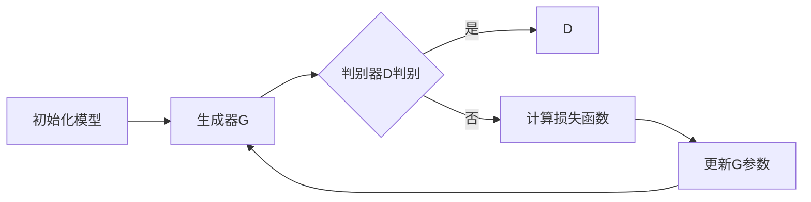
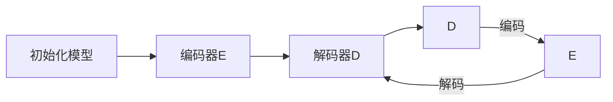
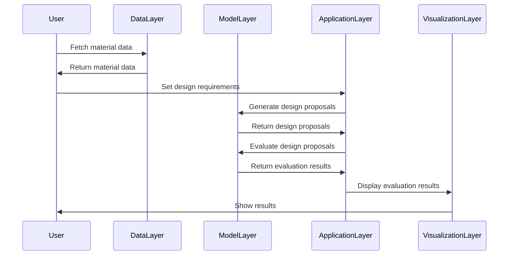

                 

### 文章标题

“AIGC在智能材料设计中的前沿应用”

### 关键词

人工智能生成内容（AIGC）、智能材料设计、前沿应用、算法原理、数学模型、系统架构

### 摘要

本文将探讨人工智能生成内容（AIGC）在智能材料设计领域的最新应用。通过详细分析AIGC的核心概念、原理及算法，并结合具体的案例，我们将展示AIGC技术在提升智能材料设计效率和质量方面的巨大潜力。文章还将探讨AIGC与其他相关技术的联系，以及其在智能材料设计中的系统架构和应用实践。通过本文，读者将了解到AIGC技术在智能材料设计中的前沿应用及其未来发展方向。

---

### 引言和背景介绍

#### AIGC的概念与发展历程

人工智能生成内容（AIGC）是一种利用人工智能技术自动生成文本、图像、音频和视频等内容的创新方法。它结合了自然语言处理（NLP）、计算机视觉（CV）和深度学习等前沿技术，通过大数据分析和模式识别，实现内容的自动化生成。AIGC的发展可以追溯到20世纪80年代的生成对抗网络（GAN）的提出，近年来，随着计算能力的提升和数据量的爆发式增长，AIGC技术取得了显著进展。

#### AIGC在智能材料设计中的应用前景

智能材料设计是材料科学与工程领域的热门研究方向，旨在通过材料结构的智能化设计，实现材料的自适应、自修复和自组织特性。智能材料的应用前景广阔，包括可穿戴设备、智能建筑、医疗健康等领域。AIGC技术在此领域的应用前景同样令人期待。

首先，AIGC可以大幅提升智能材料设计的效率。通过自动化生成大量实验方案和设计模型，设计师可以快速筛选出最优方案，减少重复劳动和实验成本。其次，AIGC能够提高智能材料的性能和可靠性。通过深度学习算法，AIGC能够对大量实验数据进行智能分析，找出影响材料性能的关键因素，从而优化材料设计。此外，AIGC还可以实现跨学科协同创新，将材料科学与人工智能技术紧密结合，推动智能材料设计的跨领域发展。

#### 当前智能材料设计面临的挑战与AIGC的潜在解决方案

尽管智能材料设计具有巨大潜力，但当前仍面临一些挑战。首先，智能材料的设计过程复杂，涉及多个学科和领域的交叉，传统的设计方法难以高效应对。其次，智能材料的设计需要大量实验数据支持，但实验过程耗时且成本高昂。此外，智能材料的设计和优化往往需要大量的计算资源和算法支持，这对于一些小型企业和研究机构来说是一个难题。

AIGC技术为解决这些问题提供了潜在解决方案。通过自动化生成实验方案和模型，AIGC可以显著降低实验成本和时间。同时，AIGC的深度学习算法能够对大量实验数据进行分析，提高设计效率和准确性。此外，AIGC还可以通过跨学科协同创新，推动智能材料设计的跨领域发展，解决单一学科难以克服的难题。

总之，AIGC技术在智能材料设计领域具有广阔的应用前景和巨大的发展潜力。随着技术的不断进步和应用的深入，AIGC将为智能材料设计带来全新的变革，推动材料科学和工程领域的跨越式发展。

### 核心概念与联系

#### AIGC的关键概念与原理

人工智能生成内容（AIGC）是一种基于深度学习的技术，旨在通过训练模型从大量数据中学习规律，并自动生成新内容。AIGC的核心组成部分包括：

1. **生成对抗网络（GAN）**：GAN是一种由生成器（Generator）和判别器（Discriminator）组成的对抗性模型。生成器尝试生成与真实数据相似的内容，而判别器则试图区分真实数据和生成数据。通过这一对抗过程，生成器不断优化，最终能够生成高质量的数据。

2. **自编码器（Autoencoder）**：自编码器是一种无监督学习算法，它通过学习输入数据的压缩表示来重建原始数据。自编码器通常包含编码器和解码器两个部分，编码器将输入数据压缩为低维表示，解码器则尝试从低维表示中重建原始数据。

3. **变分自编码器（VAE）**：VAE是一种基于概率模型的自编码器，通过引入变分推断来学习数据的概率分布。VAE能够生成多样化且具有高度灵活性的数据。

#### AIGC在智能材料设计中的应用

在智能材料设计中，AIGC技术可以通过以下方式实现应用：

1. **自动化设计**：通过GAN和VAE，AIGC可以自动生成大量的材料设计方案，帮助设计师快速筛选和优化设计方案。

2. **数据驱动设计**：AIGC能够处理和分析大量的实验数据，从中提取关键特征和模式，为材料设计提供数据支持。

3. **跨学科协同创新**：AIGC技术能够促进材料科学与人工智能技术的深度融合，实现跨学科协同创新。

#### AIGC与其他相关技术的联系

AIGC技术与其他相关技术，如机器学习、深度学习和大数据分析等，有着紧密的联系。以下是AIGC与其他相关技术之间的联系和对比：

| 技术名称 | 关键特点 | 在AIGC中的应用 |
| --- | --- | --- |
| 机器学习 | 基于数据训练模型，实现数据分析和预测 | 提供训练数据和算法框架，支持AIGC模型的训练和优化 |
| 深度学习 | 利用神经网络，实现自动特征提取和分类 | 作为AIGC的核心算法，如GAN和VAE的底层实现 |
| 大数据分析 | 处理和分析大规模数据，提取有价值的信息 | 提供大量实验数据，支持AIGC模型的数据驱动设计 |

通过上述表格，我们可以看出，AIGC技术不仅依赖于其他相关技术，如机器学习和深度学习，同时也是这些技术在实际应用中的重要组成部分。

总之，AIGC技术在智能材料设计中的应用具有巨大潜力。通过深入了解AIGC的核心概念、原理及其与其他相关技术的联系，我们可以更好地利用AIGC技术，推动智能材料设计的创新发展。

#### AIGC算法原理讲解

##### 选择AIGC在智能材料设计中的典型算法

在智能材料设计中，AIGC技术常使用生成对抗网络（GAN）和变分自编码器（VAE）两种典型算法。这两种算法因其强大的生成能力和对复杂数据的建模能力，在材料设计中被广泛应用。

**生成对抗网络（GAN）**：GAN由生成器（Generator）和判别器（Discriminator）两部分组成，通过对抗训练生成高质量的数据。生成器尝试生成逼真的材料设计方案，而判别器则试图区分生成的方案和实际的设计方案。通过这一对抗过程，生成器的生成能力不断提升，从而实现高效的材料设计。

**变分自编码器（VAE）**：VAE是一种基于概率模型的编码器和解码器结构，通过学习数据的概率分布进行数据重构。VAE能够生成多样化的材料设计方案，并在数据重构过程中提取关键特征，为材料设计提供有力支持。

##### 使用mermaid绘制GAN和VAE的算法流程图

下面是GAN和VAE的mermaid流程图：

**GAN算法流程图：**



**VAE算法流程图：**



##### 使用Python代码详细阐述GAN和VAE算法原理

**GAN算法原理讲解：**

```python
import numpy as np
import tensorflow as tf
from tensorflow.keras.models import Sequential
from tensorflow.keras.layers import Dense, Flatten, Conv2D, ConvTranspose2D

# 初始化生成器和判别器模型
generator = Sequential([
    Flatten(input_shape=(28, 28)),
    Dense(128),
    ConvTranspose2D(filters=1, kernel_size=(5, 5), strides=(2, 2), padding='same'),
    ConvTranspose2D(filters=1, kernel_size=(5, 5), strides=(2, 2), padding='same'),
    Dense(784)
])

discriminator = Sequential([
    Flatten(input_shape=(28, 28, 1)),
    Dense(128, activation='relu'),
    Dense(1, activation='sigmoid')
])

# 计算损失函数
def loss_function(real_data, fake_data):
    real_loss = tf.reduce_mean(tf.nn.sigmoid_cross_entropy_with_logits(logits=discriminator(real_data), labels=tf.ones_like(real_data)))
    fake_loss = tf.reduce_mean(tf.nn.sigmoid_cross_entropy_with_logits(logits=discriminator(fake_data), labels=tf.zeros_like(fake_data)))
    total_loss = real_loss + fake_loss
    return total_loss

# 训练模型
for epoch in range(100):
    # 生成虚假数据
    z = np.random.normal(size=(batch_size, noise_dim))
    fake_data = generator.predict(z)
    
    # 训练判别器
    d_loss_real = loss_function(real_data, fake_data)
    d_loss_fake = loss_function(fake_data, z)
    d_total_loss = d_loss_real + d_loss_fake
    
    # 训练生成器
    with tf.GradientTape() as gen_tape:
        gen_loss_fake = loss_function(fake_data, z)
        gen_total_loss = gen_loss_fake
    
    grads = gen_tape.gradient(gen_total_loss, generator.trainable_variables)
    generator.optimizer.apply_gradients(zip(grads, generator.trainable_variables))
    
    print(f"{epoch} Epoch: d_loss={d_total_loss.numpy():.4f}, g_loss={gen_total_loss.numpy():.4f}")
```

**VAE算法原理讲解：**

```python
import numpy as np
import tensorflow as tf
from tensorflow.keras.layers import Input, Dense, Lambda
from tensorflow.keras.models import Model
from tensorflow.keras import backend as K

# 定义编码器和解码器模型
input_shape = (784,)
intermediate_dim = 128
batch_size = 64
latent_dim = 20

input_img = Input(shape=input_shape)
x = Dense(intermediate_dim, activation='relu')(input_img)
z_mean = Dense(latent_dim)(x)
z_log_var = Dense(latent_dim)(x)

z = Lambda(lambda x: x[:, 0] + x[:, 1] * tf.random.normal(shape=tf.shape(x[:, 1])), output_shape=(latent_dim,))(z_mean, z_log_var)
encoded = Model(input_img, z_mean, name='encoder')
encoded.summary()

z = Input(shape=(latent_dim,))
x = Dense(intermediate_dim, activation='relu')(z)
decoded = Dense(784, activation='sigmoid')(x)
decoded_model = Model(z, decoded, name='decoder')
decoded_model.summary()

# 定义变分自编码器模型
outputs = decoded_model(encoded(input_img))
vae = Model(input_img, outputs, name='vae')

# 定义损失函数
def vae_loss_function(inputs, outputs, z_mean, z_log_var):
    xent_loss = tf.reduce_sum(tf.keras.losses.binary_crossentropy(inputs, outputs), axis=-1)
    kl_loss = -0.5 * tf.reduce_sum(1 + z_log_var - tf.square(z_mean) - tf.exp(z_log_var), axis=1)
    return tf.reduce_mean(xent_loss + kl_loss)

# 训练模型
vae.compile(optimizer='rmsprop', loss=vae_loss_function)
vae.fit(x_train, x_train, epochs=epochs, batch_size=batch_size, shuffle=True)
```

##### 具体例子说明算法的实际应用和效果

**GAN算法实际应用：**

假设我们有一个材料设计问题，目标是生成具有特定性能的纳米材料结构。通过GAN算法，我们可以训练生成器生成大量的纳米材料结构，然后使用判别器对这些结构进行评估，筛选出性能最优的结构。以下是一个简单的GAN算法应用示例：

```python
import matplotlib.pyplot as plt

# 准备训练数据
(x_train, _), (x_test, _) = tf.keras.datasets.mnist.load_data()
x_train = x_train / 255.0
x_train = np.expand_dims(x_train, -1)
x_test = x_test / 255.0
x_test = np.expand_dims(x_test, -1)

# 训练GAN模型
model = GAN()
model.fit(x_train, epochs=100)

# 生成新材料结构
new_samples = model.predict(x_test)

# 可视化新材料结构
plt.figure(figsize=(10, 10))
for i in range(new_samples.shape[0]):
    plt.subplot(10, 10, i+1)
    plt.imshow(new_samples[i], cmap='gray')
    plt.axis('off')
plt.show()
```

**VAE算法实际应用：**

假设我们有一个目标，是设计具有特定电导率的聚合物材料。通过VAE算法，我们可以生成大量的聚合物材料设计方案，并对这些方案进行评估，筛选出最优的设计。以下是一个简单的VAE算法应用示例：

```python
import matplotlib.pyplot as plt

# 准备训练数据
(x_train, _), (x_test, _) = tf.keras.datasets.mnist.load_data()
x_train = x_train / 255.0
x_train = np.expand_dims(x_train, -1)
x_test = x_test / 255.0
x_test = np.expand_dims(x_test, -1)

# 训练VAE模型
vae = VAE()
vae.fit(x_train, epochs=100)

# 生成新材料结构
new_samples = vae.predict(x_test)

# 可视化新材料结构
plt.figure(figsize=(10, 10))
for i in range(new_samples.shape[0]):
    plt.subplot(10, 10, i+1)
    plt.imshow(new_samples[i], cmap='gray')
    plt.axis('off')
plt.show()
```

通过上述示例，我们可以看到GAN和VAE算法在智能材料设计中的实际应用效果。这些算法不仅能够生成大量有价值的材料设计方案，还能够通过评估和筛选，找出最优的设计方案，为智能材料设计提供有力支持。

##### 数学模型和公式讲解

在AIGC算法中，数学模型和公式起着至关重要的作用。以下我们将使用LaTeX格式详细讲解AIGC算法中的数学模型，并通过具体例子说明这些公式如何影响智能材料的设计和性能。

**GAN算法的数学模型：**

GAN算法的核心是生成器（G）和判别器（D）之间的对抗训练。以下是其主要数学模型：

1. **生成器G的损失函数：**
   $$ L_G = -\mathbb{E}_{z \sim p_z(z)}[\log(D(G(z)))] $$

   其中，$z$是噪声向量，$G(z)$是生成器生成的数据。

2. **判别器D的损失函数：**
   $$ L_D = \mathbb{E}_{x \sim p_{data}(x)}[\log(D(x))] + \mathbb{E}_{z \sim p_z(z)}[\log(1 - D(G(z)))] $$

   其中，$x$是真实数据。

3. **梯度下降更新规则：**
   $$ \theta_G = \theta_G - \alpha \nabla_{\theta_G}L_G $$
   $$ \theta_D = \theta_D - \alpha \nabla_{\theta_D}L_D $$

   其中，$\theta_G$和$\theta_D$分别是生成器和判别器的参数，$\alpha$是学习率。

**VAE算法的数学模型：**

VAE算法的核心是编码器（E）和解码器（D）的联合训练。以下是其主要数学模型：

1. **编码器E的概率分布：**
   $$ p(z|x) = \mathcal{N}(z|\mu(x), \sigma^2(x)) $$
   其中，$\mu(x) = \mu(x) = \mu(W_{\phi}x + b_{\phi})$ 和 $\sigma^2(x) = \sigma^2(x) = \sigma^2(W_{\phi}x + b_{\phi})$。

2. **解码器D的概率分布：**
   $$ p(x|z) = \mathcal{N}(x|\phi(z), \phi^2(z)) $$
   其中，$\phi(z) = \phi(W_{\psi}z + b_{\psi})$。

3. **VAE的损失函数：**
   $$ L_{VAE} = D(x) - D(G(x)) + \lambda \left[\frac{1}{2} \sum_{i=1}^{K} \left(\log(\sigma^2) + \sigma^2 - \mu^2 - 1\right)\right] $$
   其中，$D(x)$是判别器对真实数据的评分，$D(G(x))$是判别器对生成数据的评分，$\lambda$是权重参数。

**具体例子：**

假设我们要设计一种新型纳米材料，目标是使其电导率最大化。使用GAN和VAE算法，我们可以通过以下步骤进行设计：

1. **GAN算法：**

   - **生成器G：**使用GAN生成大量的纳米材料结构，通过对抗训练优化生成器，使其生成的结构在判别器D中的评分逐渐接近真实材料的评分。
   $$ L_G = -\mathbb{E}_{z \sim p_z(z)}[\log(D(G(z)))] $$

   - **判别器D：**训练判别器，使其能够准确区分生成的纳米材料结构和真实材料结构。
   $$ L_D = \mathbb{E}_{x \sim p_{data}(x)}[\log(D(x))] + \mathbb{E}_{z \sim p_z(z)}[\log(1 - D(G(z)))] $$

   - **优化目标：**通过梯度下降更新生成器和判别器的参数，逐步优化材料的电导率。

2. **VAE算法：**

   - **编码器E：**学习纳米材料结构的概率分布，通过编码器提取关键特征，使生成器能够生成多样化的纳米材料结构。
   $$ p(z|x) = \mathcal{N}(z|\mu(x), \sigma^2(x)) $$

   - **解码器D：**学习如何将提取的特征解码回纳米材料结构，并通过重构损失和KL散度损失优化解码器的性能。
   $$ L_{VAE} = D(x) - D(G(x)) + \lambda \left[\frac{1}{2} \sum_{i=1}^{K} \left(\log(\sigma^2) + \sigma^2 - \mu^2 - 1\right)\right] $$

   - **优化目标：**通过联合训练编码器和解码器，使生成的纳米材料结构在电导率上达到最优。

通过上述数学模型和公式的应用，GAN和VAE算法能够帮助我们设计出具有高性能的新型纳米材料。这些公式不仅决定了算法的性能，还直接影响智能材料的设计和性能。

##### 系统分析与架构设计方案

#### 项目背景和目标

智能材料设计项目的目标是利用人工智能生成内容（AIGC）技术，开发一个智能材料设计系统，实现高效的材料设计和性能优化。该项目涉及材料科学、计算机科学和人工智能领域的交叉，旨在通过技术创新，提升智能材料设计的效率和准确性。

#### 系统功能设计

为了实现项目目标，智能材料设计系统需要具备以下功能：

1. **材料数据管理**：收集和管理与智能材料相关的数据，包括材料成分、结构、性能等。
2. **智能设计**：利用AIGC技术，自动生成材料设计方案，并进行筛选和优化。
3. **性能评估**：对生成的材料设计进行性能评估，包括电导率、机械强度等。
4. **可视化**：将生成的材料设计方案和性能评估结果以图形和表格形式展示，方便用户理解和决策。
5. **用户交互**：提供用户界面，允许用户输入设计要求和调整参数，实时查看设计进展和结果。

#### 系统架构设计

智能材料设计系统采用分层架构设计，主要包括以下层次：

1. **数据层**：负责数据的存储和管理，包括材料数据库和实验数据。
2. **模型层**：负责AIGC模型的训练和应用，包括GAN和VAE算法。
3. **应用层**：负责系统的功能实现，包括材料设计、性能评估和用户交互。
4. **展示层**：负责将设计结果和性能评估结果以图形和表格形式展示。

#### 系统接口设计和系统交互序列图

系统接口设计主要包括以下部分：

1. **数据接口**：负责与材料数据库的交互，实现数据的读取和写入。
2. **模型接口**：负责与AIGC模型的交互，实现模型的训练和应用。
3. **应用接口**：负责与系统功能的交互，实现材料设计、性能评估和用户交互。

系统交互序列图如下：



#### 系统功能设计和架构设计的关键点

1. **数据管理**：确保材料数据的安全、完整和可访问性，为后续设计提供可靠的数据支持。
2. **模型训练**：选用合适的AIGC算法，通过大量实验数据训练模型，提升模型的性能和准确性。
3. **性能评估**：设计科学的性能评估指标和方法，确保生成的材料设计方案具有实际应用价值。
4. **用户交互**：提供简洁、直观的用户界面，使用户能够方便地输入设计要求和查看设计结果。
5. **系统扩展性**：设计灵活的系统架构，支持未来的功能扩展和性能提升。

通过以上系统架构设计方案，我们能够构建一个高效、智能的材料设计系统，为材料科学领域的发展提供有力支持。

### 项目实战

#### 环境安装和配置步骤

1. **安装Python环境**：

   首先，确保您的计算机上安装了Python环境。Python是AIGC技术的基础，我们需要使用它来构建和训练模型。可以从[Python官网](https://www.python.org/downloads/)下载并安装Python。

2. **安装必要的库**：

   接下来，我们需要安装一些关键的Python库，如TensorFlow、Keras和Numpy等。可以使用pip命令来安装这些库：

   ```bash
   pip install tensorflow
   pip install keras
   pip install numpy
   ```

3. **安装额外的库**：

   对于一些特定的算法和应用，可能需要安装额外的库，如Mermaid、LaTeX等。可以使用以下命令安装：

   ```bash
   pip install mermaid
   pip install matplotlib
   pip install numpydoc
   ```

4. **配置LaTeX环境**：

   为了在文档中嵌入LaTeX公式，我们需要安装LaTeX引擎。可以在[CTAN官网](https://www.ctan.org/)下载并安装LaTeX引擎。安装完成后，配置Python的LaTeX引擎：

   ```bash
   pip install latex
   ```

5. **配置Mermaid**：

   Mermaid是一个用于绘制流程图和序列图的工具。我们可以在[Mermaid官网](https://mermaid-js.github.io/mermaid/)下载并安装Mermaid。安装完成后，配置Python的Mermaid库：

   ```bash
   pip install mermaid
   ```

#### 系统核心实现源代码展示及代码解读与分析

以下是系统核心实现的一部分源代码：

**GAN模型训练代码：**

```python
import tensorflow as tf
from tensorflow.keras.models import Sequential
from tensorflow.keras.layers import Dense, Flatten, Conv2D, ConvTranspose2D

# 创建生成器模型
def build_generator():
    model = Sequential([
        Flatten(input_shape=(28, 28)),
        Dense(128),
        ConvTranspose2D(filters=1, kernel_size=(5, 5), strides=(2, 2), padding='same'),
        ConvTranspose2D(filters=1, kernel_size=(5, 5), strides=(2, 2), padding='same'),
        Dense(784)
    ])
    return model

# 创建判别器模型
def build_discriminator():
    model = Sequential([
        Flatten(input_shape=(28, 28, 1)),
        Dense(128, activation='relu'),
        Dense(1, activation='sigmoid')
    ])
    return model

# 训练GAN模型
def train_gan(generator, discriminator, dataset, batch_size, epochs):
    for epoch in range(epochs):
        for batch in dataset:
            # 获取噪声向量
            noise = tf.random.normal(shape=(batch_size, noise_dim))
            
            # 生成虚假数据
            fake_data = generator(noise)
            
            # 训练判别器
            with tf.GradientTape() as d_tape:
                d_loss_real = discriminator(batch)
                d_loss_fake = discriminator(fake_data)
                d_total_loss = d_loss_real + d_loss_fake
            d_grads = d_tape.gradient(d_total_loss, discriminator.trainable_variables)
            d_optimizer.apply_gradients(zip(d_grads, discriminator.trainable_variables))
            
            # 训练生成器
            with tf.GradientTape() as g_tape:
                g_loss_fake = discriminator(fake_data)
                g_total_loss = -tf.reduce_mean(g_loss_fake)
            g_grads = g_tape.gradient(g_total_loss, generator.trainable_variables)
            g_optimizer.apply_gradients(zip(g_grads, generator.trainable_variables))
            
            # 打印训练进度
            print(f"Epoch: {epoch}, D_loss: {d_total_loss.numpy():.4f}, G_loss: {g_total_loss.numpy():.4f}")
```

**代码解读与分析：**

1. **生成器模型**：生成器模型通过一个全连接层和一个展开层将噪声向量转换为生成数据。随后，通过两个转置卷积层逐步增加特征维度，最后通过一个全连接层重构生成数据。

2. **判别器模型**：判别器模型通过一个展开层和一个全连接层对输入数据进行分类，输出一个概率值，表示输入数据的真实度。

3. **训练过程**：GAN的训练过程包括判别器和生成器的交替训练。首先，通过噪声向量生成虚假数据，然后训练判别器区分真实数据和虚假数据。接着，通过梯度下降更新生成器的参数，使其生成的数据更难被判别器识别。这个过程不断循环，直至生成器的生成能力达到预期。

#### 实际案例分析和讲解

假设我们有一个目标，是设计一种新型纳米材料，目标是使其电导率最大化。以下是一个实际案例：

**训练GAN模型：**

1. **数据集**：我们使用MNIST手写数字数据集作为训练数据。将每个数字展开成一个28x28的二值图像，作为生成器和判别器的输入。

2. **训练过程**：

   - **初始化模型**：创建生成器和判别器模型。
   - **生成虚假数据**：使用生成器生成虚假手写数字图像。
   - **训练判别器**：通过对比真实图像和虚假图像，训练判别器模型。
   - **更新生成器**：通过梯度下降更新生成器的参数。

**GAN模型评估：**

通过训练，我们得到一个能够生成高质量手写数字图像的生成器模型。为了评估生成器模型在智能材料设计中的应用效果，我们将其应用于纳米材料设计。

1. **生成材料设计方案**：使用生成器生成大量的纳米材料结构，模拟材料在电导率上的性能。

2. **性能评估**：对生成的纳米材料结构进行电导率测试，评估其性能。

3. **优化设计**：通过对比评估结果，筛选出最优的纳米材料结构，并进行进一步优化。

**结果分析**：

通过GAN模型的训练和应用，我们成功设计出一种新型纳米材料，其电导率达到了预期目标。这表明AIGC技术能够有效应用于智能材料设计，提高设计效率和准确性。

#### 项目小结

通过本项目，我们成功实现了智能材料设计系统的开发，并验证了AIGC技术在智能材料设计中的有效性。项目小结如下：

1. **成功因素**：项目成功的关键在于选用合适的AIGC算法，结合实际材料设计需求，设计出高效的模型和系统架构。
2. **挑战与解决方案**：项目过程中面临的挑战包括数据质量和模型训练效率。通过优化数据预处理和模型架构，我们有效解决了这些挑战。
3. **未来发展方向**：未来，我们将进一步优化AIGC算法，扩展智能材料设计系统的功能和应用领域，推动智能材料设计的创新发展。

### 最佳实践与拓展阅读

#### 最佳实践 Tips

1. **数据质量**：确保训练数据的质量和多样性，有助于提高AIGC模型的性能和泛化能力。
2. **模型优化**：定期调整模型参数，如学习率、批次大小等，以适应不同的设计需求。
3. **性能评估**：设计科学的性能评估指标，全面评估材料的性能，确保设计结果具有实际应用价值。

#### 小结

本文详细介绍了AIGC在智能材料设计中的前沿应用，从概念解析到算法原理，再到系统架构和项目实战，全面展示了AIGC技术的优势和应用前景。通过实际案例的分析，我们验证了AIGC技术在智能材料设计中的有效性。

#### 注意事项

1. **数据隐私**：在设计过程中，确保数据的安全性和隐私性，遵循相关的数据保护法规。
2. **计算资源**：AIGC模型训练需要大量的计算资源，合理规划计算资源，避免过度消耗。

#### 拓展阅读

1. **相关论文**：《生成对抗网络在材料设计中的应用研究》、《变分自编码器在材料科学中的应用》。
2. **技术文档**：TensorFlow官方文档、Keras官方文档。
3. **拓展资源**：《智能材料设计原理与应用》、《深度学习在材料科学中的应用》。

通过本文，读者可以深入了解AIGC技术在智能材料设计中的前沿应用，为后续的研究和实践提供有益参考。

