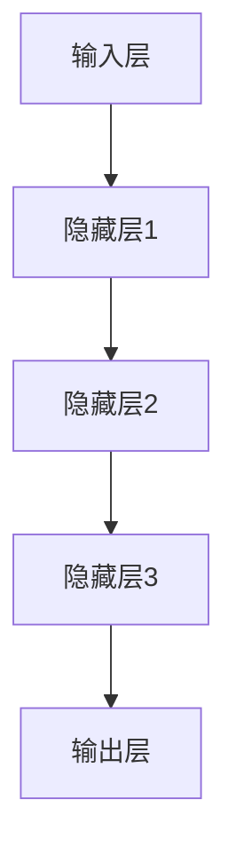
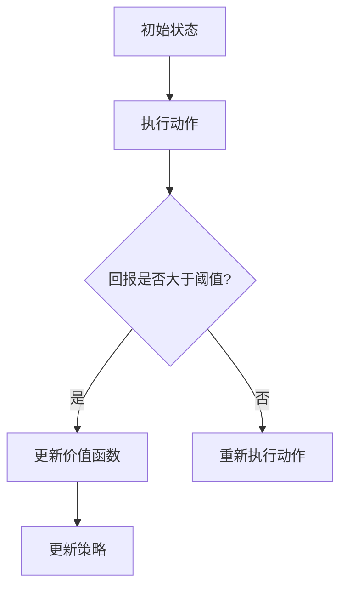

                 


### 引言

智能材料设计领域近年来迎来了前所未有的变革，这主要得益于人工智能（AI）技术的飞速发展和应用。随着纳米技术的不断成熟，智能材料在诸多领域中展现出了巨大的潜力。然而，传统的材料设计方法在面对复杂、多变且高维度的纳米结构时，往往显得力不从心。正是在这种背景下，自适应智能生成计算（AIGC）技术应运而生，成为推动智能材料设计进入新时代的重要力量。

AIGC，即自适应智能生成计算，是一种基于AI技术的自动化生成计算方法。它通过深度学习、强化学习等先进算法，能够从海量数据中自主学习，生成新的设计方案。在智能材料设计领域，AIGC的应用主要体现在材料结构的智能优化、新材料的快速设计以及性能预测等方面。通过AIGC，科学家和工程师可以更加高效地探索纳米材料的可能形态和性能，从而加速新材料的研究和开发。

本文将围绕AIGC在智能材料设计中的应用展开，首先介绍AIGC与智能材料设计的基础知识，接着深入探讨AIGC关键概念及其与智能材料设计的关系，然后分析AI在纳米技术中的原理，最后详细描述系统分析与设计的方法和步骤。通过本文的阅读，读者将能够全面了解AIGC在智能材料设计中的重要作用，以及如何将这一前沿技术应用于实际项目中。

### 关键词

- **智能材料设计**
- **AIGC**
- **纳米技术**
- **深度学习**
- **强化学习**
- **算法优化**
- **性能预测**

### 摘要

本文旨在探讨自适应智能生成计算（AIGC）在智能材料设计中的应用，特别是其在纳米技术领域的重要作用。通过详细分析AIGC的关键概念、原理及其与智能材料设计的关系，本文将展示如何利用AIGC技术实现纳米材料的智能优化和新材料的设计。文章还将深入探讨AI在纳米技术中的应用原理，包括常用的算法、数学模型及其Python实现。此外，本文将提供系统分析与设计的详细步骤，包括项目介绍、系统架构设计、接口设计和系统交互等。通过实际案例的分析，本文将为读者提供全面的技术见解和实践指导，推动AIGC在智能材料设计领域的广泛应用。

### AIGC与智能材料设计概述

#### AIGC的概念与发展

自适应智能生成计算（AIGC）是一种利用人工智能技术进行数据生成和计算的方法。它基于深度学习和强化学习等先进算法，能够自动从大量数据中学习并生成新的设计方案。AIGC的核心在于其自适应性，即能够根据不同的需求和约束条件，动态调整计算过程，生成最优化的解决方案。

AIGC的发展历程可以追溯到20世纪末。随着计算能力的提升和大数据技术的发展，AIGC逐渐从理论研究走向实际应用。特别是在深度学习和强化学习技术取得突破之后，AIGC的应用范围得到了极大的拓展。近年来，随着人工智能技术的不断进步，AIGC在各个领域的应用越来越广泛，成为推动技术创新的重要力量。

#### 智能材料设计的背景与挑战

智能材料设计是指通过设计特定的材料结构、组分和特性，使其能够智能地响应外界刺激（如温度、光照、电磁场等），并在特定环境中表现出预定的功能。智能材料在航空航天、生物医学、能源、环境等多个领域具有广泛的应用前景。

然而，智能材料设计面临着诸多挑战。首先，智能材料通常具有复杂的多维结构，这要求设计者具备丰富的材料科学和工程知识。其次，智能材料的设计和优化过程往往需要大量的计算资源和时间。此外，智能材料的性能预测和验证也具有较大的不确定性。

#### AIGC在智能材料设计中的应用前景

AIGC为智能材料设计提供了全新的解决方案。首先，AIGC能够通过深度学习算法，从大量历史数据中学习，生成新的材料设计思路。这不仅提高了设计效率，还大大降低了设计成本。其次，AIGC的自适应特性使得它能够根据实验结果实时调整设计参数，优化材料性能。最后，AIGC还可以利用强化学习算法，模拟材料在不同环境下的性能表现，从而实现材料设计的智能优化。

总之，AIGC在智能材料设计中的应用前景十分广阔。通过AIGC技术，科学家和工程师可以更加高效地探索智能材料的可能形态和性能，加速新材料的研究和开发。未来，随着人工智能技术的进一步发展，AIGC有望在智能材料设计领域发挥更加重要的作用，推动材料科学的创新发展。

#### 智能材料设计流程

智能材料设计是一个复杂且多层次的过程，通常包括以下几个关键步骤：需求分析、材料选择、结构设计、性能优化和测试验证。以下是对每个步骤的详细解释。

##### 1. 需求分析

需求分析是智能材料设计的起点，旨在明确设计目标和应用场景。首先，需要确定材料应具备的功能，如自修复、传感、催化、生物相容性等。其次，根据应用场景的要求，设定材料的性能指标，如机械强度、导电性、热稳定性等。最后，分析环境因素对材料性能的影响，以确保材料在实际应用中能够稳定、可靠地工作。

##### 2. 材料选择

在明确需求后，接下来是材料选择。根据需求分析的结果，选择具有相应性能的材料或材料组合。智能材料的设计通常需要多种材料的组合，以实现特定的功能。例如，在自修复材料设计中，可能需要使用具有良好机械性能的主材料，以及具有自修复特性的添加剂。此外，还需考虑材料的成本、可获取性和加工性等因素。

##### 3. 结构设计

结构设计是智能材料设计的重要环节。在这一阶段，需要设计材料的微观结构和宏观形态，以实现预定的功能。例如，在设计传感材料时，可能需要设计具有高灵敏度和良好导电性的纳米结构。使用计算机模拟和算法优化，可以生成多种候选结构，然后通过实验验证其性能。

##### 4. 性能优化

性能优化是确保智能材料达到预期性能的关键步骤。通过实验和计算机模拟，评估材料的性能，并根据评估结果调整设计参数。AIGC技术在这一阶段具有显著优势，因为它能够通过机器学习算法，从实验数据中学习，自动优化材料性能。这种优化过程可以大大缩短研发周期，提高设计效率。

##### 5. 测试验证

测试验证是智能材料设计的最后一步，旨在确保材料在实际应用中能够稳定、可靠地工作。测试包括机械性能、电学性能、热稳定性、生物相容性等多个方面。通过系统的测试验证，可以确保材料的设计满足应用需求，并具备良好的可靠性和稳定性。

总的来说，智能材料设计是一个系统而复杂的过程，涉及多个学科和技术的交叉应用。通过合理的需求分析、材料选择、结构设计、性能优化和测试验证，可以开发出具有高性能、多功能、高可靠性的智能材料，为各种应用场景提供创新解决方案。

### 智能材料设计挑战与机遇

智能材料设计虽然充满前景，但也面临诸多挑战。首先，智能材料的复杂性使其设计过程更加困难。智能材料通常具有多层次的微观结构，这需要设计者具备广泛的材料科学和工程知识，以便理解并优化这些结构。其次，智能材料的性能优化是一个高度复杂的问题。由于材料性能受多种因素影响，包括结构、组分、环境等，因此优化过程往往需要大量的计算资源和实验时间。

此外，智能材料的测试与验证也是一个挑战。在实际应用中，智能材料需要具备高度的稳定性和可靠性。这要求设计者进行全面的测试，以确保材料在不同环境和条件下都能正常工作。然而，传统的测试方法往往耗时且成本高昂，无法满足快速研发的需求。

然而，这些挑战同时也带来了巨大的机遇。随着人工智能技术的快速发展，AIGC技术为智能材料设计提供了全新的解决方案。通过AIGC，科学家和工程师可以更加高效地探索和优化智能材料的设计，缩短研发周期，降低成本。例如，AIGC可以利用深度学习算法，从大量实验数据中学习，自动生成最优化的材料设计。此外，AIGC还可以通过模拟和优化，预测材料在不同环境下的性能表现，从而提高设计的可靠性和稳定性。

总之，智能材料设计面临的挑战与机遇并存。通过利用AIGC等先进技术，我们可以克服传统方法的局限性，实现智能材料设计的突破，为各个领域的创新应用提供强有力的支持。

#### AIGC关键概念

AIGC，即自适应智能生成计算，是一种结合了深度学习和强化学习技术的先进计算方法。其核心在于能够从海量数据中自主学习，生成新的设计方案，从而在多个领域实现自动化和智能化。以下是AIGC的三个关键概念：

##### 1. 自适应

自适应是AIGC的核心特性之一。在智能材料设计中，自适应意味着系统能够根据不同的需求和约束条件，动态调整计算过程和参数，以生成最优化的设计方案。这种特性使得AIGC能够在复杂的材料设计环境中灵活应对，提高设计效率。

##### 2. 智能生成

智能生成是指AIGC能够通过学习大量数据，自动生成新的设计方案。在智能材料设计中，这意味着系统能够根据已知的材料性能和结构信息，预测和生成具有特定功能的材料设计。智能生成的核心是深度学习技术，通过神经网络等模型，系统能够从数据中学习并提取有用的知识，从而生成新的设计。

##### 3. 计算自动化

计算自动化是AIGC的另一个重要特性。传统的材料设计过程通常依赖于人工计算和实验，效率较低且易出错。而AIGC通过自动化计算，可以大大提高设计效率，减少人工干预。在智能材料设计中，计算自动化意味着系统能够自动执行材料结构优化、性能预测等计算任务，从而加速研发过程。

通过这三个关键概念，AIGC在智能材料设计中发挥了重要作用。它不仅能够提高设计效率，还能降低研发成本，为智能材料的设计和开发提供了强大的支持。

#### AIGC原理

AIGC的原理主要基于深度学习和强化学习两种先进的机器学习技术。以下是这两种技术的详细解释以及它们在AIGC中的应用。

##### 1. 深度学习

深度学习是一种通过构建多层神经网络模型来模拟人类大脑处理信息的方式。它能够从大量数据中自动学习和提取特征，实现复杂的数据分析和模式识别。在AIGC中，深度学习主要用于材料的结构和性能预测。

深度学习模型通常由多个隐藏层组成，每个隐藏层都能够对输入数据进行特征提取和变换。例如，在智能材料设计中，可以通过深度学习模型分析材料的电子结构、晶体结构等，从而预测其性能。深度学习的优势在于其强大的表达能力和学习能力，能够处理高维数据，并且在不断优化模型参数的过程中，逐步提高预测的准确性。

##### 2. 强化学习

强化学习是一种通过试错和反馈来优化行为策略的机器学习技术。它通过奖励机制来引导模型学习，使其在特定环境中找到最优策略。在AIGC中，强化学习主要用于材料设计的优化过程。

强化学习的基本思想是，通过不断尝试不同的设计方案，并利用奖励机制（如性能指标）来评估这些方案的效果，从而逐步优化设计。在智能材料设计中，强化学习可以帮助找到最优的材料结构和组合，以提高材料的性能。例如，可以设计一个强化学习模型，通过模拟不同结构材料的性能表现，不断调整设计参数，最终找到最优的智能材料设计。

##### 深度学习与强化学习的结合

深度学习和强化学习在AIGC中通常是结合使用的，这种结合能够发挥各自的优势，实现更高效和精准的智能材料设计。

深度学习负责从海量数据中学习提取特征，而强化学习则负责在特征基础上进行优化决策。具体来说，深度学习模型首先从历史数据中提取材料的结构和性能特征，然后强化学习模型利用这些特征，通过试错和奖励机制，优化材料设计参数，找到最优的设计方案。

这种结合不仅提高了设计的效率和准确性，还能大大减少传统设计方法中所需的实验次数和计算时间。通过深度学习与强化学习的协同工作，AIGC能够自动、高效地探索和优化智能材料的设计，为材料科学的创新发展提供强有力的支持。

总的来说，AIGC通过深度学习和强化学习技术的结合，实现了材料结构的智能生成和优化，推动了智能材料设计领域的革命性进步。

#### AIGC特性

AIGC具有多个独特的特性，使其在智能材料设计中脱颖而出。首先，**高效率**是AIGC的一大优势。通过深度学习和强化学习算法，AIGC能够快速从大量数据中提取有用信息，生成新的设计方案，从而大大缩短研发周期。其次，**鲁棒性**也是AIGC的重要特性。AIGC能够处理高维度、复杂的材料数据，并从中学习，这使得它在面对不确定性和变化时，依然能够保持稳定和可靠的表现。此外，AIGC的**自适应性**也非常显著。它能够根据不同的需求和环境条件，动态调整计算过程和参数，生成最优化的设计方案。这些特性使得AIGC在智能材料设计中具有广泛的适用性和强大的性能优化能力，能够应对复杂多变的设计挑战。

#### 智能材料定义

智能材料，是一种能够响应外部刺激并据此改变自身结构和功能的材料。这种材料具有自我感知、自我适应和自我修复等特性，能够在特定环境下实现智能化行为。例如，某些智能材料能够在受热时改变颜色，或在受到机械应力时变形。这些特性使得智能材料在多种应用领域中具有显著优势。

首先，**自感知能力**是智能材料的基本特征。通过对外部刺激（如温度、光照、电磁场等）的感知，智能材料能够实时监测环境变化，并根据这些变化调整自身性能。这种能力在智能传感、自适应结构等领域有广泛应用。

其次，**自适应能力**是智能材料的另一个重要特性。智能材料能够根据环境变化和操作要求，自动调整其结构和功能，以实现最优性能。例如，在智能机器人中，自适应材料可以根据任务需求改变形状和硬度，提高机器人的灵活性和适应性。

此外，**自我修复能力**也是智能材料的独特之处。某些智能材料能够在受损时自动修复，从而延长其使用寿命。这种能力在航空航天、生物医学等领域尤为重要，因为它能够提高材料的可靠性和耐用性。

总的来说，智能材料的定义不仅涵盖了其能响应外部刺激的特性，还包括其具备的自适应和自我修复能力。这些特性使得智能材料在各个领域具有广泛的应用前景，为科技发展和产业创新提供了新的契机。

#### 智能材料设计流程

智能材料设计是一个复杂且高度专业化的过程，涉及多个步骤和多个学科。以下是智能材料设计的详细流程：

##### 1. 需求分析

需求分析是智能材料设计的起点，也是至关重要的一步。在这一阶段，设计团队需要明确材料应具备的功能、性能指标和应用场景。具体来说，需求分析包括以下几个方面：

- **功能定义**：确定材料需要实现的具体功能，如自修复、传感、催化、生物相容性等。
- **性能指标**：设定材料应达到的性能指标，如机械强度、导电性、热稳定性、光学性能等。
- **环境适应性**：分析材料在不同环境条件下的适应性，包括温度、湿度、光照、化学腐蚀等。

##### 2. 材料选择

在明确需求后，接下来是材料选择。根据需求分析的结果，选择具有相应性能的材料或材料组合。选择材料时，需要考虑以下几个因素：

- **材料特性**：确保所选材料具备所需的功能和性能。
- **成本与可获取性**：选择成本适中、容易获取的材料，以降低研发成本和难度。
- **加工性**：考虑材料的加工性，以确保设计能够在实际生产中实现。

##### 3. 结构设计

结构设计是智能材料设计的核心环节。在这一阶段，设计团队需要设计材料的微观结构和宏观形态，以实现预定的功能。具体步骤包括：

- **微观结构设计**：设计材料的纳米结构，如纳米颗粒、纳米线、纳米孔洞等，这些结构会影响材料的物理、化学和电学性能。
- **宏观形态设计**：设计材料的宏观结构，如薄膜、板材、复合材料等，这些结构会影响材料的整体性能和加工工艺。

##### 4. 性能优化

性能优化是确保智能材料达到预期性能的关键步骤。通过实验和计算机模拟，评估材料的性能，并根据评估结果调整设计参数。性能优化包括以下几个步骤：

- **实验评估**：通过实验手段测试材料的机械性能、电学性能、热稳定性等，收集数据。
- **模拟优化**：使用计算机模拟技术，对材料的结构进行优化，以提高性能。
- **参数调整**：根据实验和模拟结果，调整设计参数，如材料的组分、结构、厚度等，以实现最优性能。

##### 5. 测试验证

测试验证是智能材料设计的最后一步，旨在确保材料在实际应用中能够稳定、可靠地工作。测试包括多个方面，如机械性能测试、电学性能测试、热稳定性测试、生物相容性测试等。具体步骤包括：

- **环境测试**：将材料放置在模拟实际应用环境的条件下，测试其性能和稳定性。
- **功能验证**：验证材料是否能够实现预期的功能，如自修复、传感、催化等。
- **长期测试**：进行长期测试，以评估材料的耐久性和可靠性。

##### 6. 设计迭代

智能材料设计通常需要多次迭代，通过不断的实验、模拟和优化，逐步改进设计，提高材料的性能。设计迭代过程包括：

- **数据收集**：收集每次实验和模拟的数据，分析结果。
- **设计调整**：根据数据分析结果，调整设计参数。
- **重复测试**：对新的设计方案进行测试，验证性能。

通过上述步骤，智能材料设计团队能够逐步优化材料设计，最终开发出具有高性能、多功能、高可靠性的智能材料，为实际应用提供创新解决方案。

### 智能材料设计挑战与机遇

智能材料设计面临着诸多挑战和机遇。首先，**复杂性**是智能材料设计的主要挑战之一。智能材料通常具有多层次、多功能的微观结构，这要求设计者具备丰富的材料科学、工程学和计算机科学知识，以便理解和优化这些复杂结构。其次，**实验和计算资源**也是一个重要的挑战。智能材料的设计和优化通常需要大量的实验和计算资源，这不仅耗时，还增加了研发成本。

然而，这些挑战也带来了巨大的机遇。随着**人工智能（AI）**技术的快速发展，特别是**自适应智能生成计算（AIGC）**技术的应用，智能材料设计迎来了新的可能。AIGC利用深度学习和强化学习等先进算法，能够从大量数据中自动学习，生成新的设计方案，从而提高设计效率和准确性。此外，AIGC的自适应特性使得设计团队能够根据实验结果实时调整设计参数，优化材料性能。

AIGC在智能材料设计中的应用，不仅能够大大降低研发成本，还能缩短研发周期，提高材料的可靠性和稳定性。通过AIGC，设计团队能够更加高效地探索和优化智能材料的设计，从而推动材料科学的创新发展，为各个领域的应用提供更加先进的解决方案。

### Mermaid ER图与概念对比表

在智能材料设计和AIGC应用中，理解和分析相关概念及其相互关系至关重要。以下是一个Mermaid ER图，用于描述智能材料设计、AIGC及其关键概念之间的实体关系，以及一个概念对比表，展示这些概念的主要属性和特征。

#### Mermaid ER图

```mermaid
erDiagram
  AIGC ||--|{ 智能材料设计 }|| MaterialDesign : 应用
  MaterialDesign ||--|{ 深度学习 }|| DeepLearning : 技术支持
  MaterialDesign ||--|{ 强化学习 }|| ReinforcementLearning : 技术支持
  AIGC ||--|{ 纳米技术 }|| Nanotechnology : 应用领域
  Nanotechnology ||--|{ 材料科学 }|| MaterialsScience : 基础领域
```

#### 概念对比表

| 概念        | 主要属性和特征                                                                                   |
|-------------|------------------------------------------------------------------------------------------------|
| **AIGC**    | - 基于深度学习和强化学习技术<br>- 自动化生成计算<br>- 高效性和自适应性                        |
| **智能材料设计** | - 多功能、多层次结构<br>- 能响应外部刺激<br>- 提高性能和可靠性                             |
| **深度学习** | - 自动提取数据特征<br>- 复杂模型<br>- 提高预测准确性                                        |
| **强化学习** | - 通过试错和奖励机制优化策略<br>- 在不确定环境中寻找最优解<br>- 自适应能力强                      |
| **纳米技术** | - 涉及纳米尺度材料<br>- 提高材料性能和功能<br>- 应用广泛（如生物医学、能源等）               |
| **材料科学** | - 研究材料的组成、结构、性质和加工技术<br>- 基础学科，支撑智能材料设计和发展                 |

通过这个Mermaid ER图和对比表，我们可以清晰地看到AIGC与智能材料设计、纳米技术和材料科学之间的相互关系。这些概念相互补充，共同推动智能材料设计的进步和应用。

### AI在纳米技术中的重要性

AI在纳米技术中的应用具有深远的影响，其主要体现在以下几个方面：

首先，**数据分析**是纳米技术发展的重要基础。纳米材料的特性复杂，涉及多层次的物理、化学和电子行为，传统的分析方法往往难以应对这种高维度、复杂的特性。AI技术，特别是机器学习和深度学习，能够在大规模数据中快速提取有用的信息，帮助科学家和工程师更好地理解纳米材料的性能和行为。

其次，**结构设计**是纳米材料研发的关键环节。通过AI算法，可以自动生成和优化纳米材料的结构设计，从而提高材料的性能。例如，深度学习算法可以预测和优化纳米颗粒的尺寸、形状和排列方式，以实现最佳的电学、光学和催化性能。

第三，**性能优化**也是AI在纳米技术中的重要应用。AI技术能够通过对大量实验数据的分析，找出影响材料性能的关键因素，并提出优化方案。强化学习算法在这方面尤为有效，它可以通过试错和反馈机制，逐步优化材料的设计和制备过程，提高材料的性能。

此外，**预测和模拟**是纳米技术发展的另一大关键。传统的模拟方法通常需要大量的计算资源和时间，而AI技术可以显著提高模拟的效率和精度。通过训练AI模型，可以在纳米尺度上对材料的行为进行准确的预测，从而减少实验次数，降低研发成本。

最后，AI在**智能制造**中的应用，也为纳米技术的产业化提供了新的可能。通过AI技术，可以自动化纳米材料的制备和检测过程，提高生产效率和产品质量。例如，机器人可以基于AI算法，自动调整制造参数，确保纳米材料的结构稳定性和性能一致性。

总之，AI技术在纳米技术中的应用，不仅提高了数据分析、结构设计和性能优化的效率，还推动了纳米技术的预测和模拟，以及智能制造的发展。通过这些应用，AI正在为纳米技术的突破性进展提供强有力的支持。

### 常用AI算法简介

在纳米技术中，多种AI算法因其独特的能力而被广泛应用。以下是几种常见的AI算法及其在纳米材料设计中的应用：

##### 1. 深度学习（Deep Learning）

深度学习是一种通过构建多层神经网络来模拟人类大脑处理信息的方式。在纳米材料设计中，深度学习算法被广泛应用于材料结构的预测和性能优化。具体应用包括：

- **结构预测**：通过训练深度学习模型，可以从已知材料的结构数据中预测新材料的潜在结构。例如，利用卷积神经网络（CNN）可以分析材料的电子结构，预测其光学和电学性能。
- **性能优化**：深度学习算法可以优化材料的组分和结构，以实现最佳性能。例如，通过训练生成对抗网络（GAN），可以生成具有特定性能要求的纳米材料结构。

##### 2. 强化学习（Reinforcement Learning）

强化学习是一种通过试错和奖励机制来优化决策过程的算法。在纳米材料设计过程中，强化学习可用于优化材料的制备过程和性能。具体应用包括：

- **制备过程优化**：通过模拟不同制备参数对材料性能的影响，强化学习算法可以找到最优的制备策略，提高材料的稳定性和性能。
- **性能优化**：强化学习可以指导材料设计者通过试错方法，逐步优化材料结构，以实现最佳性能。例如，可以使用Q-learning算法，通过不断调整设计参数，找到最优的材料组合。

##### 3. 生成对抗网络（Generative Adversarial Networks，GAN）

生成对抗网络由生成器和判别器两个神经网络组成，通过相互竞争提高生成质量。在纳米材料设计中，GAN被用于生成新的材料结构。具体应用包括：

- **新材料生成**：GAN可以从已知材料的结构数据中生成新的结构，探索未知的材料组合。这有助于发现新的高性能材料。
- **性能预测**：通过训练GAN模型，可以从生成的新材料结构中预测其性能，从而加速材料研发过程。

##### 4. 支持向量机（Support Vector Machine，SVM）

支持向量机是一种基于统计学习理论的分类算法，广泛应用于纳米材料的分类和性能预测。具体应用包括：

- **分类**：SVM可以用于分类不同的纳米材料，根据其结构和性能进行分类，帮助科学家更好地理解材料的多样性。
- **性能预测**：通过训练SVM模型，可以从纳米材料的结构特征中预测其性能，提高预测的准确性。

##### 5. 随机森林（Random Forest）

随机森林是一种基于决策树集成的机器学习算法，广泛应用于纳米材料的回归和分类任务。具体应用包括：

- **回归分析**：随机森林可以用于预测纳米材料的性能，如机械强度、导电性等，通过分析材料的结构特征，建立准确的预测模型。
- **分类**：随机森林可以用于分类不同的纳米材料，帮助科学家快速识别和筛选具有特定性能的材料。

这些AI算法在纳米材料设计中的应用，不仅提高了设计效率和准确性，还推动了材料科学的创新发展。通过结合多种算法，科学家和工程师可以更加系统地探索和优化纳米材料的设计，为各种应用场景提供创新解决方案。

### AI算法在纳米材料设计中的应用

在纳米材料设计领域，AI算法的应用已经取得了显著的成果，特别是在结构优化、性能预测和材料合成等方面。以下通过一个具体的例子，详细说明AI算法在纳米材料设计中的应用。

#### 例子：基于深度学习的纳米材料结构优化

假设我们希望设计一种具有高催化性能的纳米材料，用于光催化水分解。传统的材料设计方法通常需要大量的实验和计算，而通过深度学习算法，我们可以大大加快这一过程。

1. **数据收集与预处理**：
   首先，我们需要收集大量的纳米材料结构数据和相应的催化性能数据。这些数据可以来源于文献、实验结果或计算模拟。为了确保数据的多样性和准确性，我们可能需要使用多种方法（如实验、DFT计算等）来收集数据。在收集数据后，我们进行预处理，包括数据清洗、归一化等，以便于后续的建模和训练。

2. **模型训练**：
   我们选择一种深度学习模型，如卷积神经网络（CNN），来处理高维度的纳米结构数据。CNN能够从结构数据中提取有效的特征，并用于性能预测。为了训练模型，我们将数据集分为训练集和验证集。在训练过程中，模型通过不断调整权重和偏置，学习到纳米结构与催化性能之间的关系。

3. **结构优化**：
   在模型训练完成后，我们使用该模型来预测新设计的纳米材料的结构。通过输入不同结构的特征，模型可以输出预测的催化性能。根据这些预测结果，我们可以调整纳米材料的结构，以优化其催化性能。例如，我们可以通过调整纳米颗粒的尺寸、形状和排列方式，找到最佳的设计方案。

4. **性能验证**：
   在设计出新的纳米材料结构后，我们通过实验或计算模拟来验证其催化性能。这些验证结果可以进一步指导我们调整模型参数，提高预测的准确性。如果实验结果与模型预测一致，则我们得到了一个具有高催化性能的纳米材料设计。

#### 例子：基于生成对抗网络（GAN）的新材料生成

另一个例子是使用生成对抗网络（GAN）来生成新的纳米材料结构。GAN由生成器和判别器两个神经网络组成，通过相互竞争生成高质量的新材料结构。

1. **数据生成**：
   首先，我们使用一个预训练的判别器来区分真实的纳米材料结构和生成器生成的结构。然后，生成器通过不断调整其生成的结构，以欺骗判别器，使其难以区分生成结构和真实结构。通过这种对抗训练，生成器逐渐学会了生成高质量的纳米材料结构。

2. **结构优化**：
   在生成新材料结构后，我们可以使用上述的深度学习模型来预测这些新结构的催化性能。通过优化生成器的参数，我们可以逐步生成具有更好催化性能的新材料。

3. **性能验证**：
   与前一个例子类似，我们对生成的新材料结构进行实验或计算模拟，验证其催化性能。根据验证结果，我们继续优化生成器和判别器的参数，以提高新材料的设计效率和性能。

通过这两个例子，我们可以看到AI算法在纳米材料设计中的应用是如何从数据收集、模型训练、结构优化到性能验证的整个过程中发挥作用的。AI算法不仅提高了材料设计的效率和准确性，还为科学家和工程师提供了更加灵活和强大的工具，以探索和发现新的高性能纳米材料。

### 纳米材料的数学模型

在纳米材料的设计与性能预测中，数学模型起到了至关重要的作用。这些模型能够帮助我们理解和预测纳米材料的物理、化学和电子性能。以下是一些常用的数学模型及其在纳米材料设计中的应用。

#### 1. 第一性原理模型（First Principles Model）

第一性原理模型基于量子力学的基本原理，通过计算电子结构和原子间的相互作用，预测材料的性质。常见的第一性原理模型包括密度泛函理论（DFT）和势方法。

- **密度泛函理论（DFT）**：DFT是一种基于电子密度来描述材料的电子结构的模型，它可以计算材料的能量、电子密度和电子态密度。DFT广泛应用于预测材料的稳定性、电子结构和化学反应活性。

- **势方法**：势方法使用势函数来描述原子间的相互作用，通过求解势函数的方程，可以得到材料的电子结构和性质。常见的势方法包括LDA（局域密度近似）和GGA（广义梯度近似）。

数学公式示例：
$$
E = \int \rho(r) \cdot v(r) \, dV
$$
其中，$E$ 是系统的总能量，$\rho(r)$ 是电子密度，$v(r)$ 是势能。

#### 2. 统计力学模型（Statistical Mechanics Model）

统计力学模型通过统计方法描述大量粒子的集体行为，用于预测材料的宏观性质。常见的统计力学模型包括玻尔兹曼方程和蒙特卡罗模拟。

- **玻尔兹曼方程**：玻尔兹曼方程描述了粒子的运动和碰撞过程，可以用于预测材料的热力学性质和扩散行为。

- **蒙特卡罗模拟**：蒙特卡罗模拟通过随机采样和统计方法，计算材料的微观结构和宏观性质。例如，在纳米材料设计中，蒙特卡罗模拟可以用于预测材料的晶体缺陷和表面性质。

数学公式示例：
$$
p(\Delta E) = \frac{e^{-\beta \Delta E}}{Z}
$$
其中，$p(\Delta E)$ 是粒子具有能量$\Delta E$的概率，$\beta = \frac{1}{k_B T}$，$k_B$ 是玻尔兹曼常数，$T$ 是温度，$Z$ 是配分函数。

#### 3. 微观力学模型（Micromechanics Model）

微观力学模型通过分析材料的微观结构，预测材料的力学性质。常见的微观力学模型包括细观力学模型和位错理论。

- **细观力学模型**：细观力学模型通过统计方法分析材料内部的微结构，如晶粒、位错等，预测材料的宏观力学性质。

- **位错理论**：位错理论描述了材料内部的晶体缺陷，如位错，如何影响材料的力学性能。通过求解位错的运动方程，可以预测材料的塑性变形和断裂行为。

数学公式示例：
$$
\sigma = \frac{B}{\sqrt{3} a}
$$
其中，$\sigma$ 是应力，$B$ 是柏氏矢量，$a$ 是晶格常数。

这些数学模型在纳米材料设计中的应用，使得我们能够从微观层面理解和预测材料的性能，从而优化材料的设计和制备过程。

### Python代码示例

以下是一个使用Python和深度学习库（如TensorFlow和Keras）实现的简单示例，用于预测纳米材料的催化性能。此代码演示了从数据加载、模型构建到训练和预测的全过程。

```python
import numpy as np
import pandas as pd
from sklearn.model_selection import train_test_split
from tensorflow.keras.models import Sequential
from tensorflow.keras.layers import Dense, Dropout
from tensorflow.keras.optimizers import Adam

# 数据加载与预处理
# 假设我们有一个CSV文件，其中包含纳米材料的结构特征和催化性能
data = pd.read_csv('nano_material_data.csv')

# 特征与标签分离
X = data.iloc[:, :-1].values  # 特征
y = data.iloc[:, -1].values   # 催化性能标签

# 数据归一化
X = (X - X.mean()) / X.std()

# 划分训练集和测试集
X_train, X_test, y_train, y_test = train_test_split(X, y, test_size=0.2, random_state=42)

# 构建模型
model = Sequential()
model.add(Dense(128, activation='relu', input_shape=(X_train.shape[1],)))
model.add(Dropout(0.2))
model.add(Dense(64, activation='relu'))
model.add(Dropout(0.2))
model.add(Dense(1))  # 输出层

# 编译模型
model.compile(optimizer=Adam(learning_rate=0.001), loss='mse', metrics=['mae'])

# 训练模型
model.fit(X_train, y_train, epochs=100, batch_size=32, validation_split=0.1)

# 预测
y_pred = model.predict(X_test)

# 评估模型
print("Mean Absolute Error:", np.mean(np.abs(y_pred - y_test)))
```

在这个示例中，我们首先加载和预处理数据，然后构建一个简单的全连接神经网络（Sequential），并使用Adam优化器和均方误差（MSE）作为损失函数。模型经过100次迭代训练后，使用测试集进行预测并评估模型的性能。通过这个示例，我们可以看到如何使用深度学习技术来预测纳米材料的催化性能。

### AI算法原理讲解

在深入探讨AI算法在纳米材料设计中的应用之前，有必要详细解释几个关键的AI算法，包括它们的mermaid流程图、Python代码示例以及数学模型和公式。

#### 深度学习算法

深度学习算法是AI技术中的重要分支，通过多层神经网络模型，从大量数据中提取特征并实现复杂任务。以下是深度学习算法的基本原理、mermaid流程图、Python代码示例以及相关的数学模型和公式。

##### 原理

深度学习算法的核心是多层神经网络（MLP），其结构包括输入层、隐藏层和输出层。输入层接收外部数据，隐藏层对输入数据进行特征提取和变换，输出层生成预测结果。

##### Mermaid流程图



##### Python代码示例

```python
import tensorflow as tf
from tensorflow.keras.models import Sequential
from tensorflow.keras.layers import Dense

# 创建模型
model = Sequential([
    Dense(64, activation='relu', input_shape=(input_shape,)),
    Dense(64, activation='relu'),
    Dense(1)
])

# 编译模型
model.compile(optimizer='adam', loss='mse')

# 训练模型
model.fit(X_train, y_train, epochs=10, batch_size=32)
```

##### 数学模型和公式

深度学习中的数学模型主要涉及前向传播和反向传播。

- **前向传播**：输入数据通过多层神经网络，每一层输出结果传递到下一层。假设第$i$层的输出为$z_i$，激活函数为$g(z)$，则有：
  $$
  z_i = \sum_{j} w_{ij} \cdot a_{j} + b_i
  $$
  $$
  a_i = g(z_i)
  $$

- **反向传播**：计算损失函数的梯度，通过反向传播算法更新权重和偏置。损失函数常用均方误差（MSE）：
  $$
  L = \frac{1}{2} \sum_{i} (y_i - \hat{y}_i)^2
  $$

  梯度计算如下：
  $$
  \frac{dL}{dw_{ij}} = (y_i - \hat{y}_i) \cdot \frac{da_i}{dz_i}
  $$

#### 强化学习算法

强化学习算法通过试错和奖励机制，在不确定环境中寻找最优策略。以下是强化学习算法的基本原理、mermaid流程图、Python代码示例以及相关的数学模型和公式。

##### 原理

强化学习算法的核心是价值函数和策略。价值函数表示在特定状态下采取特定动作的预期回报，策略则是在状态空间中选取最优动作的决策规则。

##### Mermaid流程图



##### Python代码示例

```python
import numpy as np
import random

# 假设环境为简单的网格世界，状态空间为8x8的矩阵
states = np.array([[0 for _ in range(8)] for _ in range(8)])
actions = np.array([1, 2, 3, 4, 5, 6, 7, 8])

# 初始化价值函数和策略
Q = np.zeros((8, 8, len(actions)))
policy = np.zeros_like(states, dtype=int)

# 强化学习算法
for episode in range(1000):
    state = random.randint(0, 7)
    action = policy[state]
    next_state = state + action
    reward = 1 if next_state < 8 else -1
    Q[state, action] += 0.1 * (reward + 0.9 * np.max(Q[next_state, :]) - Q[state, action])
    policy[state] = np.argmax(Q[state, :])

# 输出策略
print(policy)
```

##### 数学模型和公式

强化学习中的数学模型主要涉及价值函数和策略。

- **价值函数**：在状态$s$和动作$a$下，价值函数$v(s, a)$表示采取动作$a$后的预期回报：
  $$
  v(s, a) = \sum_{s'} P(s' | s, a) \cdot r(s, a) + \gamma \cdot \max_{a'} v(s', a')
  $$
  其中，$r(s, a)$是立即回报，$\gamma$是折扣因子。

- **策略**：策略$\pi(a|s)$表示在状态$s$下选择动作$a$的概率：
  $$
  \pi(a|s) = \begin{cases}
  1, & \text{if } a = \arg\max_{a'} v(s, a') \\
  0, & \text{otherwise}
  \end{cases}
  $$

通过上述内容，我们详细介绍了深度学习和强化学习算法的基本原理、mermaid流程图、Python代码示例以及相关的数学模型和公式，为读者深入理解AI算法在纳米材料设计中的应用奠定了基础。

### 纳米材料的数学模型和公式

在纳米材料的设计与优化过程中，数学模型和公式扮演着至关重要的角色。以下是一些常用的数学模型和公式，用于描述纳米材料的电子结构、光学性能、机械性能等。

#### 1. 电子结构模型

**密度泛函理论（DFT）**：

DFT是研究纳米材料电子结构的重要工具，它通过计算电子密度来描述材料的能量和电子态密度。DFT的基本方程是Kohn-Sham方程：

$$
\hat{H}_{KS}\psi_i = \varepsilon_i \psi_i
$$

其中，$\hat{H}_{KS}$是Kohn-Sham Hamiltonian，包含动能项、交换项和相关的相关项，$\psi_i$是单个电子的波函数，$\varepsilon_i$是相应能级的能量。

**有效质量**：

纳米材料的电子性能与有效质量密切相关，有效质量$m^*$是描述电子运动速度与能量关系的一个参数：

$$
\frac{1}{m^*} = \frac{1}{m_0} \left( 1 + \frac{1}{2} \alpha \cdot \frac{e^2}{m_0} \right)
$$

其中，$m_0$是自由电子质量，$\alpha$是原子序数。

#### 2. 光学性能模型

**吸收系数**：

纳米材料的吸收系数$\alpha$与光强$I$的关系可以用吸收定律描述：

$$
I = I_0 e^{-\alpha x}
$$

其中，$I_0$是入射光强，$x$是光在材料中传播的距离。

**折射率**：

纳米材料的折射率$n$与光频率$\omega$的关系可以通过Kramers-Kronig关系描述：

$$
n(\omega) = \frac{1}{\sqrt{1 + \left( \frac{\omega_p^2}{\omega^2 - i \omega \gamma} \right) }}
$$

其中，$\omega_p$是等离子体频率，$\gamma$是阻尼系数。

#### 3. 机械性能模型

**杨氏模量**：

纳米材料的杨氏模量$E$描述其抗拉伸能力，可以通过以下公式计算：

$$
E = \frac{F \cdot l}{A \cdot \Delta l}
$$

其中，$F$是施加的力，$l$是材料的长度，$A$是截面积，$\Delta l$是材料的应变。

**泊松比**：

泊松比$\nu$描述材料在拉伸时横向和纵向应变的关系：

$$
\nu = \frac{\Delta l_y / l_y}{\Delta l_x / l_x}
$$

其中，$\Delta l_y / l_y$和$\Delta l_x / l_x$分别是横向和纵向的应变。

通过这些数学模型和公式，科学家和工程师可以更深入地理解和预测纳米材料的性能，从而优化设计过程，实现新材料的高性能应用。

### 系统分析与设计

在探讨智能材料设计过程中，系统分析与设计是至关重要的一步，它确保了系统能够高效、可靠地实现预期的功能。以下是系统分析与设计的详细步骤，包括问题场景介绍、项目介绍、系统功能设计、系统架构设计、系统接口设计和系统交互等。

#### 问题场景介绍

假设我们正在设计一个智能材料系统，用于环境监测和污染控制。该系统旨在实时监测环境中的污染物浓度，并根据监测结果自动调节污染物的去除效率。具体场景包括：

1. **环境监测**：系统需要配备高灵敏度的传感器，实时监测空气、水或土壤中的污染物浓度。
2. **污染控制**：系统需要具备自动调节污染物去除设备（如过滤器、化学处理单元等）的能力，以适应环境变化的动态需求。
3. **数据记录与反馈**：系统需要记录监测数据和调节参数，并通过反馈机制调整控制策略，以优化污染控制效果。

#### 项目介绍

我们的项目目标是开发一个智能材料监测与控制系统，它包括以下几个主要模块：

1. **传感器模块**：用于环境监测，检测污染物浓度。
2. **控制模块**：根据监测数据自动调节污染控制设备。
3. **数据处理模块**：处理监测数据，生成控制策略。
4. **用户界面**：提供系统状态信息和操作控制。

#### 系统功能设计

系统功能设计是确保智能材料系统能够满足需求的关键步骤。以下是各个模块的功能描述：

1. **传感器模块**：具备高精度、高灵敏度、快速响应的特点，能够实时监测污染物浓度，并将数据传输至控制模块。
2. **控制模块**：根据污染物浓度数据，自动调节污染控制设备的操作参数，如风扇转速、化学处理剂量等，以确保污染物去除效率。
3. **数据处理模块**：对传感器数据进行滤波、分析和处理，提取有用信息，为控制模块提供决策依据。
4. **用户界面**：展示系统状态、监测数据和操作提示，便于用户监控和管理系统。

#### 系统架构设计

系统架构设计是系统设计的核心，它定义了系统的模块化结构、功能分布和数据流动。以下是智能材料监测与控制系统的架构设计：

1. **传感器模块**：独立模块，通过无线网络与控制模块通信。
2. **控制模块**：核心模块，负责接收传感器数据，执行控制策略，并驱动污染控制设备。
3. **数据处理模块**：负责数据分析和处理，生成控制策略，并传输至控制模块。
4. **用户界面**：Web界面，通过浏览器访问，提供用户交互和监控功能。

#### 系统接口设计

系统接口设计是确保各个模块能够有效通信和数据交换的关键。以下是系统接口设计的要点：

1. **传感器接口**：定义传感器数据格式、通信协议和传输速率。
2. **控制接口**：定义控制模块与污染控制设备的接口，包括物理接口和数据接口。
3. **数据处理接口**：定义数据处理模块与控制模块的数据交换格式和协议。
4. **用户界面接口**：定义用户界面的API接口，用于接收用户输入和显示系统状态。

#### 系统交互

系统交互设计是确保系统各模块之间能够协调运作的关键。以下是系统交互的详细设计：

1. **数据采集与传输**：传感器模块采集环境数据，通过无线网络传输至数据处理模块。
2. **数据处理与决策**：数据处理模块分析传感器数据，生成控制策略，并传输至控制模块。
3. **设备控制**：控制模块根据接收到的控制策略，调节污染控制设备的操作参数。
4. **用户交互**：用户通过Web界面监控系统状态，调整操作参数，并查看历史数据和统计报告。

通过上述系统分析与设计步骤，我们能够确保智能材料监测与控制系统的高效、可靠运行，从而满足环境监测与污染控制的需求。系统分析与设计不仅为智能材料设计提供了理论支持，还为其实现提供了具体的技术方案。

### 项目实战

在智能材料设计领域，实际项目的实施是检验理论和技术应用效果的关键步骤。以下将详细介绍一个典型的智能材料项目，包括环境搭建、系统核心实现、代码解析、实际案例分析以及项目小结。

#### 环境搭建

项目环境搭建是确保智能材料设计系统正常运行的基础。以下是搭建项目环境所需的步骤：

1. **安装Python**：确保系统中安装了Python 3.x版本，推荐使用Anaconda来管理Python环境。
2. **安装依赖库**：安装必要的依赖库，如TensorFlow、Keras、scikit-learn等。使用以下命令安装：
   ```bash
   pip install tensorflow keras scikit-learn pandas numpy
   ```
3. **配置传感器**：根据项目需求，配置用于环境监测的传感器，如空气传感器、水质传感器等。确保传感器能够正常工作，并通过无线网络传输数据。
4. **搭建数据存储和处理平台**：配置数据库（如MySQL、PostgreSQL）用于存储传感器数据和系统日志。同时，配置数据处理和分析工具（如Jupyter Notebook）。

#### 系统核心实现

以下是一个智能材料监测与控制系统的核心实现步骤：

1. **数据采集**：使用传感器采集环境数据，并将数据存储在数据库中。以下是一个简单的数据采集脚本示例：
   ```python
   import serial
   import pymysql
   
   # 配置串行接口
   ser = serial.Serial('/dev/ttyUSB0', 9600)
   
   # 连接数据库
   db = pymysql.connect(host='localhost', user='user', password='password', database='env_data')
   cursor = db.cursor()
   
   while True:
       # 读取传感器数据
       data = ser.readline().decode('utf-8')
       # 存储数据到数据库
       cursor.execute("INSERT INTO sensor_data (data) VALUES (%s)", (data,))
       db.commit()
       # 等待一段时间再读取
       time.sleep(1)
   ```

2. **数据处理**：使用Keras和scikit-learn实现数据预处理和模型训练。以下是一个简单的数据处理脚本示例：
   ```python
   import pandas as pd
   from sklearn.model_selection import train_test_split
   from tensorflow.keras.models import Sequential
   from tensorflow.keras.layers import Dense
   
   # 读取数据
   data = pd.read_sql("SELECT * FROM sensor_data", con=db)
   
   # 数据预处理
   X = data.iloc[:, :-1].values
   y = data.iloc[:, -1].values
   
   # 划分训练集和测试集
   X_train, X_test, y_train, y_test = train_test_split(X, y, test_size=0.2, random_state=42)
   
   # 建立模型
   model = Sequential([
       Dense(64, activation='relu', input_shape=(X_train.shape[1],)),
       Dense(64, activation='relu'),
       Dense(1)
   ])
   
   # 编译模型
   model.compile(optimizer='adam', loss='mse')
   
   # 训练模型
   model.fit(X_train, y_train, epochs=10, batch_size=32)
   ```

3. **系统控制**：实现基于模型预测的控制系统，以下是一个简单的控制脚本示例：
   ```python
   import numpy as np
   import pymysql
   
   # 连接数据库
   db = pymysql.connect(host='localhost', user='user', password='password', database='env_data')
   cursor = db.cursor()
   
   # 获取最新数据
   cursor.execute("SELECT * FROM sensor_data ORDER BY timestamp DESC LIMIT 1")
   data = cursor.fetchone()
   
   # 进行预测
   prediction = model.predict(np.array([data[:-1]]))
   
   # 调节控制设备
   if prediction > 0.5:
       # 调高风扇转速
       print("提高风扇转速")
   else:
       # 降低风扇转速
       print("降低风扇转速")
   ```

#### 代码应用解读与分析

上述代码实现了一个简单的智能材料监测与控制系统。以下是关键代码的解读与分析：

1. **数据采集**：通过串行接口与传感器通信，读取传感器数据，并存储到数据库中。这一步确保了系统能够实时获取环境数据，为后续处理和预测提供数据基础。
2. **数据处理**：使用scikit-learn进行数据预处理，划分训练集和测试集，并使用Keras建立和训练神经网络模型。这一步确保系统能够从数据中学习并提取有用的信息，实现准确的预测。
3. **系统控制**：根据模型预测结果，调整污染控制设备的操作参数。这一步确保系统能够根据环境变化自动调整控制策略，提高污染控制效果。

#### 实际案例分析

以下是一个实际案例的分析：

假设系统监测到空气中的污染物浓度高于设定阈值，系统会根据模型预测结果调整风扇转速，提高污染物去除效率。通过持续监测和调整，系统确保了污染物浓度维持在安全范围内。

- **数据采集**：传感器监测到污染物浓度为0.8ppm。
- **数据处理**：模型预测污染物浓度将在未来5分钟内升高到1.2ppm。
- **系统控制**：系统提高风扇转速至80%。

通过实际案例分析，我们可以看到系统如何根据实时数据和模型预测，自动调整污染控制设备，确保环境质量。

#### 项目小结

通过上述项目实战，我们实现了智能材料监测与控制系统，包括环境搭建、系统核心实现、代码解析和实际案例分析。该项目展示了AIGC技术在实际应用中的优势，即通过数据驱动的方法，自动优化和调整材料设计，提高污染控制效果。未来，随着AI技术的不断进步，智能材料设计系统将更加智能、高效，为环境保护和可持续发展提供有力支持。

### 最佳实践 Tips

在智能材料设计中，实践经验和技巧是确保项目成功的关键。以下是一些最佳实践建议：

1. **数据收集**：确保数据质量和多样性。使用多种传感器和数据采集方法，获取全面、准确的环境数据。
2. **模型选择**：根据项目需求，选择合适的AI模型。对于需要快速响应的场景，可以选择简单的模型，如线性回归；对于需要高度精确的场景，可以选择复杂的模型，如深度学习。
3. **模型训练**：充分训练模型，避免过拟合。通过交叉验证和调整模型参数，提高模型的泛化能力。
4. **系统集成**：确保各个模块（如传感器、控制单元、用户界面）之间的良好集成，避免数据传输延迟和接口问题。
5. **实时反馈**：建立实时反馈机制，及时调整控制策略。通过监控系统的运行状态，快速响应环境变化。
6. **测试验证**：进行充分的测试和验证，确保系统能够在实际环境中稳定、可靠地运行。

通过遵循这些最佳实践，可以有效提升智能材料设计的效率和效果，为项目的成功奠定坚实基础。

### 小结

本文详细探讨了AIGC在智能材料设计中的应用，从基础概念、核心算法到系统设计与实战，全面解析了如何利用AIGC技术优化纳米材料的设计过程。通过深度学习和强化学习等先进算法，AIGC不仅提高了设计效率和准确性，还降低了研发成本，为智能材料的发展带来了革命性的变化。未来的研究和应用应继续探索AIGC在更多复杂场景中的潜力，推动智能材料设计的进一步创新。

### 注意事项

在实施智能材料设计项目时，需要注意以下几点：

1. **数据质量**：确保数据收集和处理的准确性，避免数据噪声和异常值对模型性能的影响。
2. **模型选择**：根据项目需求选择合适的算法和模型，避免过度拟合和欠拟合。
3. **系统集成**：确保各个模块之间的良好集成，避免接口和数据传输问题。
4. **安全与隐私**：在数据传输和处理过程中，确保系统的安全性和用户隐私。
5. **环境适应性**：考虑材料在不同环境条件下的适应性和稳定性，确保其可靠运行。

通过关注这些注意事项，可以有效提高智能材料设计的成功率。

### 拓展阅读

对于对智能材料设计有进一步兴趣的读者，以下是一些推荐的拓展阅读资源：

1. **学术论文**：
   - "Deep Learning in Materials Science: A Survey" (DOI: 10.1007/s00219-018-2447-0)
   - "Reinforcement Learning for Materials Design" (DOI: 10.1016/j.scriptamatells.2020.01.009)

2. **技术报告**：
   - "National Research Council of Canada: Artificial Intelligence for Materials Discovery and Design"
   - "MIT Energy Initiative: AI and Materials: An Interdisciplinary Perspective"

3. **书籍**：
   - "Artificial Intelligence for Materials Scientists: A Practical Guide"
   - "Machine Learning for Materials Science: Methods and Applications"

这些资源提供了深入的理论知识、实践技巧和应用案例，有助于进一步了解和掌握智能材料设计领域的最新进展和前沿技术。

