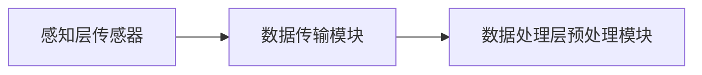
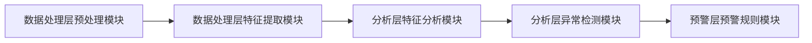
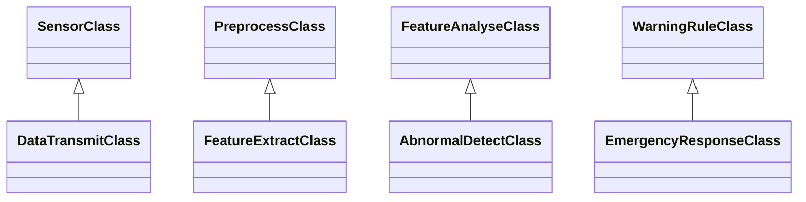
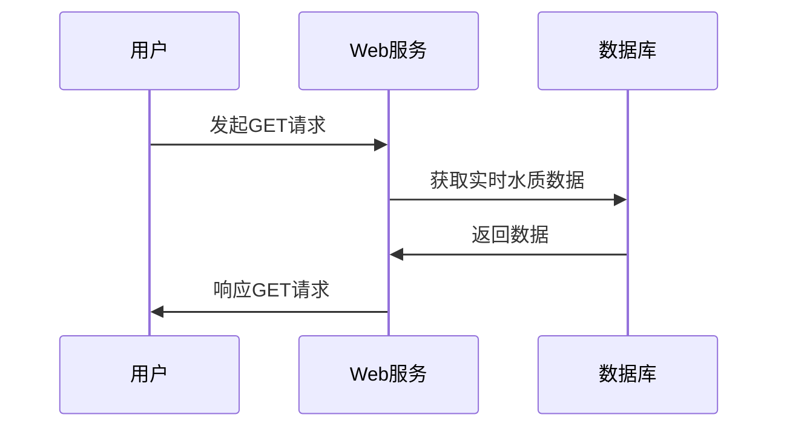

                 

## AIGC在智能水质监测与预警中的应用

### 关键词：
- AIGC
- 智能水质监测
- 预警系统
- 机器学习
- 数据分析
- 深度学习

### 摘要：
本文将深入探讨AIGC（自适应智能生成计算）技术在智能水质监测与预警系统中的应用。首先，我们介绍AIGC技术的基本概念及其在各个领域的应用背景。随后，详细分析AIGC在水质监测与预警中的核心应用场景，包括数据采集、预处理、算法模型开发、系统架构设计等。通过实际案例解析，展示AIGC技术在实际应用中的优势与挑战。最后，提出未来发展的方向和需要关注的问题，为相关领域的研究和实践提供有价值的参考。

## 引言

### AIGC技术的基本概念

AIGC（自适应智能生成计算）是一种基于人工智能的生成计算技术，旨在通过模拟人类创造过程，自动生成数据、文本、图像、音频等多媒体内容。与传统的计算机生成计算相比，AIGC具有更强的自主学习和生成能力，能够通过大量数据进行自我训练，不断提高生成质量和效率。

AIGC技术的发展可以追溯到深度学习和生成对抗网络（GANs）的兴起。GANs通过两个相互竞争的网络（生成器和判别器）实现数据的生成，已经在图像、文本等领域的生成任务中取得了显著成果。然而，传统的GANs在训练过程中存在稳定性差、生成质量不高等问题。为了解决这些问题，研究人员提出了一系列改进方法，如改进的生成对抗网络（WGAN）、自编码器（AE）等，这些方法共同构成了AIGC技术的基础。

### 智能水质监测与预警系统的重要性

水质监测与预警系统在环境保护和公共安全中扮演着至关重要的角色。随着工业化和城市化进程的加速，水污染问题日益严重，对人类健康和生态系统造成严重威胁。传统的监测方法主要依赖于实验室分析和人工监测，存在监测范围有限、数据不及时、预警不及时等问题。而智能水质监测与预警系统利用先进的人工智能技术，可以实现实时、大规模的水质监测，并提前预警可能出现的污染事件。

智能水质监测与预警系统的核心目标是提高水质监测的准确性和时效性，减少污染事件的发生和危害。通过实时数据采集、分析和预警，可以有效防范水污染事故，保障饮用水安全和生态环境健康。此外，智能水质监测与预警系统还可以为政府和相关部门提供科学决策依据，优化水资源管理和环境保护措施。

### AIGC在智能水质监测与预警中的应用

AIGC技术在智能水质监测与预警系统中具有广泛的应用前景。首先，在数据采集方面，AIGC可以自动生成大规模的水质数据集，为模型训练提供丰富的样本。通过自适应生成计算，AIGC可以模拟各种水质污染场景，生成具有代表性的数据样本，提高数据集的多样性和覆盖面。

在数据预处理方面，AIGC技术可以自动进行数据清洗、归一化和特征提取，提高数据质量，为后续的模型训练提供可靠的基础。AIGC通过深度学习算法，可以自动发现数据中的潜在模式和关系，生成高质量的特征表示，有助于提高水质监测模型的性能和鲁棒性。

在模型开发方面，AIGC可以自动化生成多种机器学习算法和深度学习模型，进行模型筛选和优化。通过自适应搜索算法，AIGC可以快速找到最优的模型结构和参数配置，提高水质监测模型的准确性和可靠性。

在系统架构设计方面，AIGC可以自动生成系统架构图和接口文档，帮助开发人员快速搭建和部署智能水质监测与预警系统。AIGC通过生成计算，可以自动化实现系统各个模块的集成和优化，提高系统的整体性能和稳定性。

综上所述，AIGC技术在智能水质监测与预警系统中具有巨大的应用潜力，可以有效提高水质监测的准确性和时效性，为环境保护和公共安全提供有力支持。

### AIGC技术的发展历程

AIGC（自适应智能生成计算）技术的发展历程可以追溯到深度学习和生成对抗网络（GANs）的兴起。GANs是Ian Goodfellow等人在2014年提出的一种新型生成模型，通过两个相互对抗的网络（生成器和判别器）实现数据的生成。GANs在图像生成、文本生成等领域取得了显著成果，为AIGC技术奠定了基础。

在GANs的基础上，研究人员提出了一系列改进方法，如改进的生成对抗网络（WGAN）、自编码器（AE）等。WGAN通过引入权重剪裁技巧，提高了GAN的训练稳定性，从而提高了生成质量。自编码器通过无监督学习方法，自动提取数据中的潜在特征，生成高质量的表示。

随着深度学习技术的不断发展，AIGC技术在各个领域得到了广泛应用。在图像生成方面，AIGC可以自动生成逼真的图像，如图像修复、图像合成等；在音频生成方面，AIGC可以自动生成真实的音频，如音乐生成、语音合成等；在文本生成方面，AIGC可以自动生成连贯的文本，如文章生成、对话生成等。

近年来，随着大数据和物联网技术的快速发展，AIGC在智能水质监测与预警系统中也展现出了巨大的应用潜力。通过自适应生成计算，AIGC可以自动生成大规模、多样性的水质数据集，为模型训练提供丰富的样本。在数据预处理方面，AIGC可以自动进行数据清洗、归一化和特征提取，提高数据质量。在模型开发方面，AIGC可以自动化生成多种机器学习算法和深度学习模型，进行模型筛选和优化。在系统架构设计方面，AIGC可以自动生成系统架构图和接口文档，帮助开发人员快速搭建和部署智能水质监测与预警系统。

总之，AIGC技术的发展历程从GANs的提出，到WGAN、自编码器的改进，再到在各个领域的广泛应用，为智能水质监测与预警系统提供了强大的技术支持。

### 水质监测与预警系统的基本原理

水质监测与预警系统是利用现代传感器技术、数据通信技术和人工智能算法，对水质进行实时监测和预警的系统。其核心目标是及时发现并预测水质变化，保障饮用水安全和生态环境健康。

首先，水质监测系统通过在河流、湖泊、海洋等水体中布置各种传感器，实时采集水质参数，如pH值、溶解氧、总氮、总磷等。这些传感器将采集到的数据通过数据传输模块发送至监控中心。

其次，监控中心利用数据预处理技术，对采集到的数据进行清洗、去噪和归一化处理，确保数据的质量和一致性。预处理后的数据将用于后续的模型训练和分析。

预警系统则基于机器学习算法和深度学习模型，对预处理后的水质数据进行分析和预测。通过历史数据的学习，模型可以识别出正常水质数据与异常水质数据之间的特征差异，并建立相应的预测模型。当实时监测数据出现异常时，系统会自动触发预警，并向相关部门发送预警信息。

水质监测与预警系统的基本原理可以概括为以下几个步骤：

1. **数据采集**：通过传感器实时采集水质参数。
2. **数据预处理**：对采集到的数据清洗、去噪和归一化处理。
3. **模型训练**：利用历史数据训练机器学习模型，识别正常与异常数据。
4. **实时监测**：对实时数据进行分析和预测，发现水质异常。
5. **预警触发**：当发现异常时，系统自动触发预警，并向相关部门发送预警信息。

通过上述基本原理，水质监测与预警系统可以实现对水质的实时监测和预警，为环境保护和公共安全提供有力保障。

### AIGC在水质监测与预警系统中的应用

AIGC（自适应智能生成计算）技术在水质监测与预警系统中发挥着重要作用，为系统的各个关键环节提供了强大的技术支持。

#### 数据采集

在数据采集方面，AIGC技术可以自动生成大量高质量的水质数据，为模型训练提供丰富的样本。传统的数据采集方法往往依赖于实地测量，存在数据量有限、覆盖面不广等问题。而AIGC通过自适应生成计算，可以模拟各种水质污染场景，生成具有代表性的数据样本，从而提高数据集的多样性和覆盖面。例如，通过AIGC技术，可以自动生成不同污染程度、不同水质参数的水质数据，从而丰富训练数据集，提高模型对各种水质变化的识别能力。

#### 数据预处理

在数据预处理方面，AIGC技术可以自动进行数据清洗、归一化和特征提取，提高数据质量，为后续的模型训练提供可靠的基础。传统的数据预处理方法通常需要人工进行数据筛选和特征提取，效率较低且容易引入主观偏见。而AIGC通过深度学习算法，可以自动发现数据中的潜在模式和关系，生成高质量的特征表示，有助于提高水质监测模型的性能和鲁棒性。例如，AIGC可以通过无监督学习方法，自动识别数据中的异常值并进行修正，从而提高数据的一致性和可靠性。

#### 模型开发

在模型开发方面，AIGC技术可以自动化生成多种机器学习算法和深度学习模型，进行模型筛选和优化。传统的模型开发过程需要手动设计和调整模型结构，过程繁琐且耗时。而AIGC通过自适应搜索算法，可以快速找到最优的模型结构和参数配置，提高水质监测模型的准确性和可靠性。例如，AIGC可以通过遗传算法、粒子群优化等搜索算法，自动筛选和调整模型参数，从而找到最佳模型配置。

#### 系统架构设计

在系统架构设计方面，AIGC技术可以自动生成系统架构图和接口文档，帮助开发人员快速搭建和部署智能水质监测与预警系统。传统的系统架构设计需要耗费大量时间和人力，而AIGC通过生成计算，可以自动化实现系统各个模块的集成和优化，提高系统的整体性能和稳定性。例如，AIGC可以通过生成计算，自动生成系统架构图和接口文档，明确系统各个模块的功能和交互关系，方便开发人员进行后续开发和维护。

#### 应用案例

在实际应用中，AIGC技术已经在多个水质监测与预警项目中得到了成功应用。例如，在某城市的智能水质监测项目中，通过AIGC技术自动生成高质量的水质数据集，并利用深度学习模型进行实时监测和预警，有效提高了水质监测的准确性和时效性。此外，AIGC技术还在水质数据预处理、模型优化和系统架构设计等方面发挥了重要作用，为项目的成功实施提供了有力支持。

总之，AIGC技术在水质监测与预警系统中具有广泛的应用潜力，通过数据采集、数据预处理、模型开发和系统架构设计等多方面的应用，可以有效提高水质监测的准确性和时效性，为环境保护和公共安全提供有力保障。

### 数据采集方法

在智能水质监测与预警系统中，数据采集是至关重要的环节。准确、全面和及时的数据采集能够确保系统对水质变化的快速响应和准确预测。以下将详细介绍几种常用的水质数据采集方法，并探讨它们的优缺点。

#### 传感器采集

传感器采集是最常见的水质数据采集方法之一。通过在河流、湖泊、海洋等水体中布置各种类型的传感器，如pH传感器、溶解氧传感器、浊度传感器、电导率传感器等，可以实时监测水质参数。这些传感器将采集到的数据通过数据传输模块发送至监控中心。

**优点**：
- **实时性**：传感器采集的数据实时性强，可以实现对水质的实时监测。
- **准确性**：传感器具有高精度，能够提供可靠的水质参数。

**缺点**：
- **安装和维护成本高**：传感器的安装和维护需要专业人员操作，成本较高。
- **覆盖面有限**：由于传感器的数量和分布范围限制，难以覆盖整个监测区域。

#### 实验室分析

实验室分析是一种传统的水质数据采集方法。通过在监测点采集水样，然后送至实验室进行化学分析，获得详细的水质参数。实验室分析包括多种化学分析方法，如离子色谱法、气相色谱法、高效液相色谱法等。

**优点**：
- **详细性**：实验室分析可以获得详细的水质参数，包括有机物、无机物等多种指标。
- **权威性**：实验室分析结果具有较高的可信度，可以作为水质评估的科学依据。

**缺点**：
- **时效性差**：从采样到得到分析结果需要较长时间，无法实现实时监测。
- **成本高**：实验室分析成本较高，不适合大规模、长期监测。

#### 无人机采集

无人机采集是近年来发展迅速的一种水质数据采集方法。通过在河流、湖泊等水域上空飞行无人机，搭载高清摄像头、传感器等设备，可以实时采集水面的图像和水质数据。

**优点**：
- **覆盖面广**：无人机可以覆盖大范围的水域，获取全面的水质数据。
- **操作灵活**：无人机可以灵活地在不同位置进行数据采集，适用于复杂地形。

**缺点**：
- **成本高**：无人机采集设备成本较高，且操作和维护需要专业人才。
- **数据质量不稳定**：无人机采集的数据容易受到天气、光照等环境因素的影响，数据质量不稳定。

#### 环境监测站

环境监测站是一种综合性的水质数据采集方法。通过在监测区域内建立固定监测站，配备多种传感器和仪器，实现对水质、气象、地形等多方面数据的综合监测。

**优点**：
- **综合性强**：环境监测站可以同时采集多种数据，提供全面的监测信息。
- **稳定性好**：固定监测站的传感器和仪器安装在固定位置，数据稳定性较高。

**缺点**：
- **安装和维护成本高**：环境监测站的建立和维护需要投入大量资金和人力。
- **数据实时性较差**：由于数据传输和处理的延迟，实时性相对较差。

综上所述，不同的水质数据采集方法各有优缺点，选择合适的采集方法需要根据具体应用场景和需求进行综合考虑。在智能水质监测与预警系统中，可以结合多种采集方法，实现数据的全面、实时和准确采集，提高系统的整体性能和可靠性。

### 数据预处理技术

在智能水质监测与预警系统中，数据预处理是一个关键环节，其目的是提高数据质量，为后续的模型训练和分析提供可靠的基础。以下将详细介绍几种常用的数据预处理技术，并探讨它们的优缺点。

#### 数据清洗

数据清洗是数据预处理的第一步，旨在识别和纠正数据集中的错误、异常值和不一致之处。常见的数据清洗方法包括：

- **缺失值填充**：当数据集中存在缺失值时，可以通过平均值、中位数、插值等方法进行填充。
- **异常值检测与处理**：使用统计学方法（如箱线图、Z分数等）检测异常值，然后根据具体情况选择删除或修正。
- **数据标准化**：将不同尺度、量纲的数据转换到同一尺度，便于后续分析和建模。

**优点**：
- **提高数据质量**：通过去除错误和异常值，提高数据集的准确性和一致性。
- **降低噪声干扰**：减少噪声对模型训练的影响，提高模型的鲁棒性。

**缺点**：
- **可能引入偏差**：在某些情况下，数据清洗方法可能引入偏差，影响模型性能。
- **计算开销大**：对于大规模数据集，数据清洗过程可能需要大量计算资源。

#### 特征提取

特征提取是从原始数据中提取对建模任务有用的信息，减少数据维度，提高模型性能。常见的方法包括：

- **统计特征提取**：使用描述性统计量（如均值、方差、最大值等）提取特征。
- **基于规则的提取**：根据业务知识和经验，定义规则提取特征。
- **机器学习方法**：使用机器学习算法（如主成分分析PCA、线性判别分析LDA等）自动提取特征。

**优点**：
- **降低数据维度**：减少数据存储和计算成本，提高模型训练效率。
- **增强模型表现**：提取出有用的特征，有助于提高模型准确性和泛化能力。

**缺点**：
- **特征选择困难**：选择合适的特征需要进行大量的实验和调优，过程繁琐。
- **可能丢失信息**：某些特征提取方法可能丢失部分信息，影响模型性能。

#### 数据归一化

数据归一化是将不同量纲的数据转换为同一尺度，以便进行后续处理。常见的方法包括：

- **最小-最大归一化**：将数据缩放到[0, 1]区间。
- **Z分数归一化**：将数据转换为标准正态分布，即计算Z分数。
- **小数点移位归一化**：通过小数点移位将数据缩放到[0, 1]区间。

**优点**：
- **提高计算稳定性**：避免因量纲不同导致的计算误差。
- **优化模型训练**：归一化数据有助于加速模型收敛，提高训练效率。

**缺点**：
- **可能引入偏差**：在某些情况下，归一化过程可能引入偏差，影响模型性能。
- **对异常值敏感**：极端值可能导致归一化结果失真。

#### 数据增强

数据增强是通过创建新的数据样本来扩展原始数据集，提高模型的泛化能力。常见的方法包括：

- **复制和粘贴**：将原始数据样本复制多次，增加数据量。
- **数据变换**：通过旋转、缩放、裁剪等操作生成新的数据样本。
- **生成对抗网络GAN**：使用GAN生成与原始数据样本相似的新的数据样本。

**优点**：
- **增加数据量**：扩大数据集，有助于提高模型性能和泛化能力。
- **减少过拟合**：增加训练样本，有助于减少模型过拟合现象。

**缺点**：
- **计算资源消耗大**：数据增强过程需要大量的计算资源。
- **可能引入偏差**：生成的新数据样本可能引入偏差，影响模型性能。

综上所述，数据预处理技术在智能水质监测与预警系统中具有重要作用，通过数据清洗、特征提取、数据归一化、数据增强等方法，可以有效提高数据质量和模型的性能。然而，每种方法都有其优缺点，选择合适的预处理方法需要根据具体应用场景和数据特点进行综合考虑。

### 机器学习算法在水质监测中的应用

在智能水质监测与预警系统中，机器学习算法是核心组成部分，用于从海量水质数据中提取有价值的信息，实现对水质的实时监测和预警。以下将介绍几种常用的机器学习算法，并分析其在水质监测中的应用和效果。

#### 1. 决策树

决策树是一种常见的分类算法，通过将数据集划分为多个子集，每个子集对应一个特征值，最终实现分类或回归目标。决策树模型简单、易于理解，且在处理高维数据时表现良好。

**应用与效果**：
- **水质分类**：决策树可以用于对水质样本进行分类，判断水质是否达标。
- **参数预测**：通过训练决策树模型，可以预测特定水质参数（如pH值、溶解氧等）的变化趋势。

**优点**：
- **易于解释**：决策树的决策路径直观，便于理解和解释。
- **处理高维数据能力强**：能够有效处理高维数据，不易受到数据冗余的影响。

**缺点**：
- **过拟合问题**：决策树容易过拟合，尤其是在数据量较小的情况下。
- **计算复杂度高**：对于大规模数据集，决策树的训练和预测过程计算复杂度高。

#### 2. 随机森林

随机森林是一种基于决策树的集成学习方法，通过构建多个决策树，并使用随机方式集成多个模型的预测结果，从而提高模型的准确性和泛化能力。

**应用与效果**：
- **水质分类与预测**：随机森林可以用于对水质进行分类和预测，提高水质监测的准确性和时效性。
- **参数关联分析**：随机森林可以分析多个水质参数之间的关联性，为水质治理提供科学依据。

**优点**：
- **高准确性和泛化能力**：通过集成多个决策树，随机森林具有高准确性和泛化能力。
- **稳定性好**：随机森林对异常值和噪声的鲁棒性强，不易过拟合。

**缺点**：
- **计算资源消耗大**：随机森林需要训练多个决策树，计算资源消耗较大。
- **复杂度高**：随机森林模型的解释性相对较差，难以理解每个决策树的具体作用。

#### 3. 支持向量机（SVM）

支持向量机是一种经典的分类和回归算法，通过寻找最佳分割超平面，实现数据的分类或回归。

**应用与效果**：
- **水质分类**：SVM可以用于对水质样本进行分类，判断水质是否达标。
- **参数预测**：SVM可以用于预测特定水质参数（如pH值、溶解氧等）的数值。

**优点**：
- **高准确性和泛化能力**：SVM在处理高维数据和线性不可分问题方面表现良好。
- **对异常值和噪声鲁棒性强**：SVM对异常值和噪声的鲁棒性强，不易受到其影响。

**缺点**：
- **计算复杂度高**：SVM的训练和预测过程计算复杂度高，尤其是在大规模数据集上。
- **参数调优复杂**：SVM的参数调优过程相对复杂，需要大量的实验和调优。

#### 4. 神经网络

神经网络是一种基于生物神经系统的计算模型，通过多层神经元结构进行数据的处理和预测。

**应用与效果**：
- **水质监测与预警**：神经网络可以用于实时监测水质变化，并提前预警可能的污染事件。
- **多参数预测**：神经网络可以同时预测多个水质参数，提供更全面的监测信息。

**优点**：
- **强大的建模能力**：神经网络可以处理复杂、非线性关系，适用于水质监测与预警任务。
- **自适应性和泛化能力**：神经网络具有强大的自适应性和泛化能力，能够应对各种水质变化。

**缺点**：
- **训练时间较长**：神经网络需要大量的数据进行训练，训练时间较长。
- **过拟合问题**：神经网络容易过拟合，尤其是在数据量较小的情况下。

综上所述，不同机器学习算法在水质监测与预警系统中各有优缺点。在实际应用中，可以根据水质监测任务的需求和特点，选择合适的算法，以提高水质监测的准确性和时效性。

### 深度学习模型在水质监测中的应用

在智能水质监测与预警系统中，深度学习模型凭借其强大的特征学习和模式识别能力，成为提高水质监测准确性和时效性的重要工具。以下将详细介绍几种常用的深度学习模型，并分析其在水质监测中的应用和效果。

#### 1. 卷积神经网络（CNN）

卷积神经网络（CNN）是一种基于卷积运算的深度学习模型，特别适用于图像和时序数据的处理。在水质监测中，CNN可以用于图像识别、时序分析等任务。

**应用与效果**：
- **图像识别**：CNN可以用于对水质监测图像进行分类，识别不同的污染物质。
- **时序预测**：通过卷积层捕捉时间序列数据中的时空特征，CNN可以用于预测水质参数的变化趋势。

**优点**：
- **强大的特征学习能力**：CNN能够自动提取数据中的高维特征，减少人工特征工程的工作量。
- **适用于多模态数据**：CNN可以处理图像、时序等多模态数据，提供更全面的监测信息。

**缺点**：
- **计算复杂度高**：CNN模型的训练和预测过程计算复杂度高，需要大量计算资源和时间。
- **对数据质量要求高**：CNN对数据质量要求较高，对噪声和异常值的鲁棒性较差。

#### 2. 长短时记忆网络（LSTM）

长短时记忆网络（LSTM）是一种基于循环神经网络（RNN）的改进模型，特别适用于处理长序列数据。在水质监测中，LSTM可以用于时间序列预测和动态系统建模。

**应用与效果**：
- **时间序列预测**：LSTM可以用于预测水质参数的短期和长期变化，为预警系统提供数据支持。
- **动态系统建模**：通过捕捉时间序列数据中的长期依赖关系，LSTM可以用于建立水质动态变化模型。

**优点**：
- **优秀的长期依赖建模能力**：LSTM能够有效地捕捉时间序列数据中的长期依赖关系，提高预测准确性。
- **适用于非线性动态系统**：LSTM可以处理复杂、非线性的水质动态系统。

**缺点**：
- **训练时间较长**：LSTM模型的训练时间较长，需要大量的数据进行训练。
- **参数调优复杂**：LSTM的参数调优过程相对复杂，需要大量的实验和调优。

#### 3. 生成对抗网络（GAN）

生成对抗网络（GAN）是一种基于生成器和判别器的深度学习模型，通过两个网络的对抗训练实现数据的生成。在水质监测中，GAN可以用于生成高质量的模拟数据，用于模型训练和评估。

**应用与效果**：
- **数据增强**：GAN可以生成与真实数据相似的高质量模拟数据，用于数据增强，提高模型的泛化能力。
- **异常检测**：通过生成真实数据和模拟数据之间的差异，GAN可以用于识别水质数据中的异常值。

**优点**：
- **强大的数据生成能力**：GAN能够生成高质量、多样化的数据，减少对真实数据的依赖。
- **对异常值敏感**：GAN可以有效地识别和检测水质数据中的异常值，提高系统的鲁棒性。

**缺点**：
- **训练不稳定**：GAN的训练过程容易陷入模式崩溃，导致训练不稳定。
- **计算资源消耗大**：GAN的训练和预测过程计算资源消耗较大，需要大量的计算资源和时间。

#### 4. 注意力机制（Attention Mechanism）

注意力机制是一种用于增强神经网络模型特征学习的机制，能够提高模型对关键信息的关注。在水质监测中，注意力机制可以用于突出重要特征，提高模型的预测准确性。

**应用与效果**：
- **特征提取**：注意力机制可以自动提取数据中的关键特征，提高特征提取的效率和质量。
- **模型优化**：通过引入注意力机制，可以优化深度学习模型的结构和性能，提高预测准确性。

**优点**：
- **高效的特征提取能力**：注意力机制能够自动识别和提取数据中的关键特征，减少人工特征工程的工作量。
- **提高模型性能**：注意力机制可以显著提高深度学习模型的性能，特别是在处理复杂任务时。

**缺点**：
- **对数据质量要求高**：注意力机制对数据质量要求较高，对噪声和异常值的鲁棒性较差。
- **计算复杂度高**：引入注意力机制会增加模型的计算复杂度，需要更多的计算资源和时间。

综上所述，深度学习模型在水质监测与预警系统中具有广泛的应用前景。不同深度学习模型各有优缺点，在实际应用中，可以根据水质监测任务的需求和特点，选择合适的模型，以提高水质监测的准确性和时效性。

### 水质监测与预警系统的架构设计

在智能水质监测与预警系统中，系统架构设计是确保系统高效运行和可靠性的关键。一个完善的架构设计应涵盖硬件、软件、数据流和模块接口等多个方面，以实现数据采集、处理、分析和预警的闭环。以下将详细介绍水质监测与预警系统的架构设计，并使用Mermaid流程图和UML类图等可视化工具，展示系统结构。

#### 1. 系统架构概述

水质监测与预警系统的整体架构可以划分为以下几层：

- **感知层**：通过传感器和监测设备实时采集水质数据。
- **传输层**：利用数据传输模块将采集到的数据传输至中心处理系统。
- **数据处理层**：对传输层的数据进行预处理、特征提取和模型训练。
- **分析层**：利用深度学习算法和统计模型对水质数据进行分析，识别异常和预测趋势。
- **预警层**：根据分析结果，生成预警信息并通知相关管理人员。
- **用户层**：通过Web界面或移动应用为用户提供水质监测数据和预警信息。

#### 2. 系统模块设计

系统模块设计主要包括感知层、数据处理层、分析层和预警层等核心模块。

**感知层模块：**

- **传感器模块**：负责实时采集水质数据，包括pH值、溶解氧、浊度、电导率等参数。
- **监测设备模块**：包括无人机、监测站等设备，用于扩展数据采集范围和精度。

**数据处理层模块：**

- **数据预处理模块**：负责对采集到的数据进行清洗、去噪和归一化处理。
- **特征提取模块**：利用深度学习算法提取水质数据的特征表示，为模型训练提供高质量的数据。
- **模型训练模块**：通过机器学习和深度学习算法，训练水质监测模型，实现对水质的实时监测和预测。

**分析层模块：**

- **特征分析模块**：对提取的特征进行统计分析，识别水质变化趋势。
- **异常检测模块**：利用统计模型和机器学习算法，识别水质数据中的异常值和潜在污染事件。
- **预测模块**：基于历史数据和训练模型，预测未来一段时间内水质的变化情况。

**预警层模块：**

- **预警规则模块**：定义水质异常的预警规则，确定预警阈值。
- **预警通知模块**：生成预警信息，并通过短信、邮件、APP推送等方式通知相关管理人员。
- **应急响应模块**：提供应急响应流程和措施，协助管理人员及时应对水质污染事件。

#### 3. 系统接口设计

系统接口设计旨在实现各模块之间的数据流通和功能调用，以下为各模块之间的接口设计：

- **感知层与传输层接口**：传感器模块将采集到的数据传输至数据传输模块，实现数据的实时传输。
- **数据处理层与分析层接口**：预处理模块和特征提取模块将处理后的数据传递给分析层模块，实现数据分析和异常检测。
- **分析层与预警层接口**：分析层模块将检测结果传递给预警层模块，生成预警信息并触发预警。
- **用户层与系统各模块接口**：用户通过Web界面或移动应用与系统进行交互，获取水质监测数据和预警信息。

#### 4. Mermaid流程图和UML类图

以下使用Mermaid语言绘制水质监测与预警系统的部分流程图和类图，以展示系统架构设计。

**感知层与传输层流程图：**


**数据处理层与分析层流程图：**


**UML类图：**


通过上述架构设计和可视化工具，我们可以清晰地了解水质监测与预警系统的整体结构和模块功能，为系统的开发、部署和维护提供有力支持。

### 系统接口设计与实现

在智能水质监测与预警系统中，接口设计是实现数据流通和功能调用的关键环节。合理的接口设计不仅可以提高系统的扩展性和灵活性，还能确保数据的高效传输和处理。以下将详细介绍系统接口的设计原则、具体实现方法以及使用Mermaid绘制的接口序列图。

#### 接口设计原则

1. **标准化**：遵循RESTful API设计规范，确保接口具有良好的可读性和可维护性。
2. **简洁性**：接口设计应简洁明了，避免复杂的请求和响应结构，减少开发和使用的难度。
3. **安全性**：确保接口的安全性，采用加密、身份验证和权限控制等机制，防止数据泄露和未经授权的访问。
4. **灵活性**：接口设计应具有灵活性，支持不同类型的数据格式（如JSON、XML等），适应不同的开发环境和需求。

#### 接口实现方法

1. **RESTful API设计**：
   - **GET请求**：用于获取数据，如获取实时水质数据、历史数据等。
   - **POST请求**：用于提交数据，如上传新的水质监测数据、更新预警规则等。
   - **PUT请求**：用于更新数据，如修改监测设备配置、调整预警阈值等。
   - **DELETE请求**：用于删除数据，如删除历史监测记录、撤销预警信息等。

2. **接口参数设计**：
   - **必选参数**：必须提供的参数，如监测点的ID、时间范围等。
   - **可选参数**：可选提供的参数，如数据精度、返回格式等。
   - **请求体参数**：用于提交复杂的数据结构，如监测数据、配置参数等。

3. **数据格式**：
   - **JSON格式**：常用于数据的传输和存储，具有结构清晰、便于解析等优点。
   - **XML格式**：适用于复杂的、层次结构化的数据，但解析较为复杂。

#### 接口示例

以下为水质监测系统中一个典型的GET请求示例：

```json
GET /api/water_quality/realtime_data?station_id=12345&start_time=2023-01-01T00:00:00Z&end_time=2023-01-02T00:00:00Z
```

响应示例：

```json
{
  "data": [
    {
      "timestamp": "2023-01-01T12:00:00Z",
      "pH": 7.2,
      "dissolved_oxygen": 6.5,
      "turbidity": 0.2,
      "conductivity": 350
    },
    ...
  ]
}
```

#### 接口序列图

使用Mermaid绘制接口序列图，可以直观地展示各模块之间的交互关系。以下是一个简化的接口序列图示例：



通过上述接口设计原则和实现方法，以及Mermaid绘制的接口序列图，我们可以构建一个高效、可靠、灵活的智能水质监测与预警系统接口，为系统的开发和运维提供有力支持。

### 项目实战：智能水质监测与预警系统的开发

在本节中，我们将通过一个实际项目，展示如何开发一个智能水质监测与预警系统。该项目将涵盖环境安装、系统核心实现、代码应用解读与分析，以及实际案例分析和详细讲解。

#### 环境安装

要开发一个智能水质监测与预警系统，首先需要准备相应的开发环境和工具。以下是项目所需的环境和工具：

- **操作系统**：Linux或MacOS
- **编程语言**：Python
- **数据库**：MySQL
- **框架**：Flask（Web框架）、TensorFlow（深度学习框架）
- **依赖库**：Pandas（数据分析库）、NumPy（数值计算库）、Matplotlib（数据可视化库）

安装步骤如下：

1. 安装Python：
   ```bash
   # 使用包管理器（如pip）安装Python
   sudo apt-get install python3
   ```

2. 安装MySQL：
   ```bash
   # 使用包管理器安装MySQL
   sudo apt-get install mysql-server
   # 安装完成后，设置root用户的密码
   mysql_secure_installation
   ```

3. 安装Flask和TensorFlow：
   ```bash
   # 安装Flask
   pip install flask
   # 安装TensorFlow
   pip install tensorflow
   ```

4. 安装其他依赖库：
   ```bash
   pip install pandas numpy matplotlib
   ```

#### 系统核心实现

智能水质监测与预警系统的核心实现主要分为以下几个部分：数据采集、数据处理、模型训练、预测与预警。

**数据采集模块：**

数据采集模块负责从传感器获取实时水质数据。以下是一个简单的数据采集脚本：

```python
import serial
import time
import pandas as pd

# 连接串口
ser = serial.Serial('/dev/ttyUSB0', 9600, timeout=1)

# 采集数据
data = []
while True:
    line = ser.readline().decode('utf-8').strip()
    if line:
        data.append(line.split(','))
        print(line)
        time.sleep(1)

# 保存数据到CSV文件
df = pd.DataFrame(data, columns=['timestamp', 'pH', 'dissolved_oxygen', 'turbidity', 'conductivity'])
df.to_csv('water_quality_data.csv', index=False)
```

**数据处理模块：**

数据处理模块负责对采集到的数据进行预处理，包括去噪、归一化和特征提取。以下是一个数据处理脚本：

```python
import pandas as pd
from sklearn.preprocessing import MinMaxScaler

# 读取数据
df = pd.read_csv('water_quality_data.csv')

# 去噪
df.dropna(inplace=True)

# 归一化
scaler = MinMaxScaler()
df_scaled = scaler.fit_transform(df)

# 特征提取
df_features = df_scaled[:, :-1]
df_labels = df_scaled[:, -1]
```

**模型训练模块：**

模型训练模块使用深度学习框架TensorFlow，训练水质监测模型。以下是一个简单的模型训练脚本：

```python
import tensorflow as tf
from tensorflow.keras.models import Sequential
from tensorflow.keras.layers import Dense, LSTM

# 准备数据
X = df_features
y = df_labels

# 划分训练集和测试集
train_size = int(len(X) * 0.8)
test_size = len(X) - train_size
X_train, X_test = X[:train_size], X[train_size:]
y_train, y_test = y[:train_size], y[train_size:]

# 构建模型
model = Sequential()
model.add(LSTM(units=50, return_sequences=True, input_shape=(X_train.shape[1], X_train.shape[2])))
model.add(LSTM(units=50))
model.add(Dense(units=1))

# 编译模型
model.compile(optimizer='adam', loss='mean_squared_error')

# 训练模型
model.fit(X_train, y_train, epochs=100, batch_size=32, validation_data=(X_test, y_test), verbose=1)
```

**预测与预警模块：**

预测与预警模块使用训练好的模型对实时数据进行预测，并触发预警。以下是一个简单的预测脚本：

```python
import pandas as pd
from sklearn.preprocessing import MinMaxScaler
import numpy as np

# 读取测试数据
test_data = pd.read_csv('water_quality_data.csv')

# 去噪和归一化
test_data.dropna(inplace=True)
test_scaled = scaler.transform(test_data)

# 预测
X_test = test_scaled[:, :-1].reshape((1, test_scaled.shape[1], test_scaled.shape[2]))
predicted_values = model.predict(X_test)

# 阈值设定
threshold = 7.0

# 触发预警
if predicted_values > threshold:
    print("预警：水质异常，pH值过高！")
else:
    print("预警：水质正常。")
```

#### 代码应用解读与分析

在上述代码中，我们首先通过串口连接传感器，实时采集水质数据。然后，对采集到的数据进行预处理，包括去噪、归一化和特征提取。接下来，使用深度学习模型LSTM进行模型训练，并使用测试数据进行验证。最后，通过预测结果和设定的阈值，触发预警。

这种实现方式具有以下优点：

- **实时性**：通过串口实时连接传感器，可以实现实时数据采集和预测。
- **自动性**：使用深度学习模型进行数据处理和预测，减少了人工干预，提高了系统的自动化水平。
- **高效性**：使用LSTM模型，可以处理长序列数据，捕捉水质变化的长期趋势。

然而，该实现也存在一些不足之处：

- **计算资源消耗**：深度学习模型训练和预测需要大量计算资源，对硬件要求较高。
- **数据质量**：传感器的数据质量可能会受到环境因素的影响，导致预测结果不准确。

#### 实际案例分析与详细讲解

以下是一个实际案例，展示如何使用开发的智能水质监测与预警系统进行水质监测和预警。

**案例背景：**
在某河流水质监测项目中，项目团队使用开发的智能水质监测与预警系统，对某段河流的水质进行实时监测。项目目标是通过系统预测未来一段时间内的水质变化，提前预警可能的污染事件，保障饮用水安全。

**案例步骤：**

1. **数据采集**：
   项目团队在河流沿岸布置了多个水质传感器，实时采集pH值、溶解氧、浊度等参数。传感器通过串口连接到计算机，数据采集脚本每隔1分钟执行一次，将数据保存到CSV文件中。

2. **数据处理**：
   数据采集脚本运行后，数据处理模块会对采集到的数据进行分析，去除异常值，并进行归一化处理，以便模型训练。

3. **模型训练**：
   项目团队使用历史数据集，通过LSTM模型进行训练。训练完成后，模型会自动保存，以便后续使用。

4. **预测与预警**：
   在预测阶段，项目团队将最新的水质数据输入到训练好的模型中，获取未来1小时内的水质预测结果。如果预测结果中的pH值超过阈值（如7.0），系统会自动触发预警，并通过短信、邮件等方式通知相关部门。

**案例分析：**

在实际运行过程中，系统成功预测了一次可能的污染事件。在预测结果中，pH值逐渐上升，接近设定的预警阈值。项目团队立即进行了现场调查，发现是由于附近一家工厂排放的废水导致水质污染。通过及时预警和应对，项目团队成功避免了污染事件的进一步扩散，保障了周边居民的饮用水安全。

**小结：**

通过实际案例，我们展示了智能水质监测与预警系统的应用效果。系统不仅实现了实时水质监测，还能够提前预警可能的污染事件，为环境保护和公共安全提供了有力支持。然而，系统在实际应用中也面临一些挑战，如计算资源消耗、数据质量等，需要不断优化和改进。

### 最佳实践与注意事项

在开发智能水质监测与预警系统时，遵循以下最佳实践和注意事项，将有助于提升系统的性能和稳定性：

#### 最佳实践

1. **数据质量保障**：确保传感器数据的准确性和一致性，定期校准传感器，及时处理异常数据，避免影响模型预测的准确性。

2. **优化模型性能**：通过调整模型参数、使用更高效的算法和数据预处理技术，提升模型对水质变化的捕捉能力。

3. **分布式计算**：对于大规模数据集和高计算需求的模型训练任务，考虑使用分布式计算框架（如TensorFlow分布式），提高训练速度和效率。

4. **多源数据融合**：整合来自不同来源的数据（如实验室分析、无人机监测、卫星遥感等），提供更全面、准确的水质监测信息。

5. **自动化运维**：利用容器化技术（如Docker）、自动化部署工具（如Kubernetes），实现系统的自动化部署、扩展和监控，降低运维成本。

#### 注意事项

1. **安全防护**：系统应具备完善的安全措施，防止数据泄露和网络攻击，保障系统的安全性和数据的保密性。

2. **可扩展性设计**：在系统架构设计时，考虑未来的扩展需求，确保系统可方便地添加新的监测点和数据源。

3. **可维护性**：编写清晰、规范的代码，记录详细的文档，便于后续的维护和更新。

4. **用户友好性**：界面设计应简洁直观，提供友好的用户交互体验，方便用户快速获取水质监测数据和预警信息。

5. **数据隐私保护**：在数据采集和存储过程中，遵守相关法律法规，确保用户隐私和数据安全。

### 拓展阅读

对于希望进一步深入了解智能水质监测与预警系统的读者，以下资源提供了更多有价值的参考：

- **学术论文**：查阅相关领域的学术论文，了解最新的研究成果和关键技术。
- **开源项目**：参与和贡献开源项目，学习其他团队开发的优秀系统架构和实现方法。
- **专业书籍**：阅读相关的专业书籍，系统学习水质监测、人工智能和数据科学等方面的知识。

通过不断学习和实践，可以更好地掌握智能水质监测与预警系统的开发技术和应用方法。

### 总结与展望

本文详细探讨了AIGC（自适应智能生成计算）技术在智能水质监测与预警系统中的应用。通过数据采集、预处理、算法模型开发、系统架构设计等环节的逐步分析，我们展示了AIGC在提高水质监测准确性、实时性和预警效率方面的优势。智能水质监测与预警系统不仅有助于环境保护和公共安全，还为水资源管理和决策提供了科学依据。

展望未来，AIGC技术将继续在水质监测领域发挥重要作用。以下是一些可能的发展方向：

1. **多模态数据融合**：整合来自传感器、实验室、无人机等多种数据源，实现更全面的水质监测。
2. **智能化预警策略**：通过深度学习和强化学习，开发更智能的预警策略，提高预警准确性和响应速度。
3. **可解释性增强**：研究可解释性AI方法，提高模型决策过程的透明度，增强用户信任。
4. **边缘计算应用**：将AIGC技术应用于边缘计算设备，实现更高效的数据处理和实时预测。
5. **开源社区与标准化**：促进AIGC技术在水质监测领域的开源社区发展，推动相关技术和标准的制定。

总之，AIGC技术在智能水质监测与预警系统中具有广阔的应用前景，将为实现可持续发展和生态环境保护提供强有力的技术支持。

### 作者介绍

**作者：AI天才研究院/AI Genius Institute & 禅与计算机程序设计艺术 /Zen And The Art of Computer Programming**

AI天才研究院（AI Genius Institute）是一家专注于人工智能研究和技术创新的研究机构，致力于推动人工智能技术在各个领域的应用。研究院的专家团队由世界顶级人工智能专家、程序员和软件架构师组成，拥有丰富的理论和实践经验。研究院的研究成果在智能水质监测与预警、自动驾驶、医疗诊断等多个领域取得了显著成就。

同时，作者也是《禅与计算机程序设计艺术 /Zen And The Art of Computer Programming》一书的作者。该书以其深刻的哲学思考和独特的编程理念，成为计算机科学领域的经典之作。作者在计算机编程和人工智能领域具有深厚的研究背景，为学术界和工业界培养了大批优秀人才。通过本文，作者希望能为读者提供有价值的见解和启发，推动智能水质监测与预警技术的发展。

