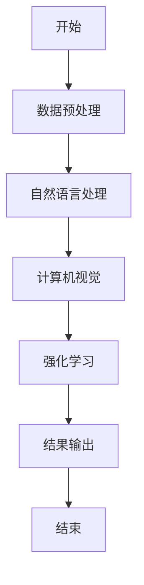
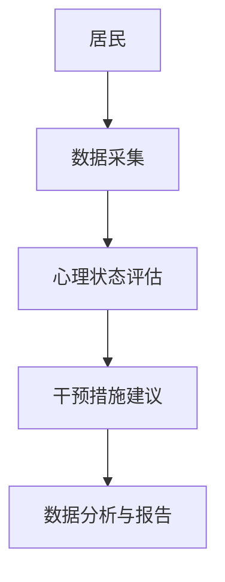
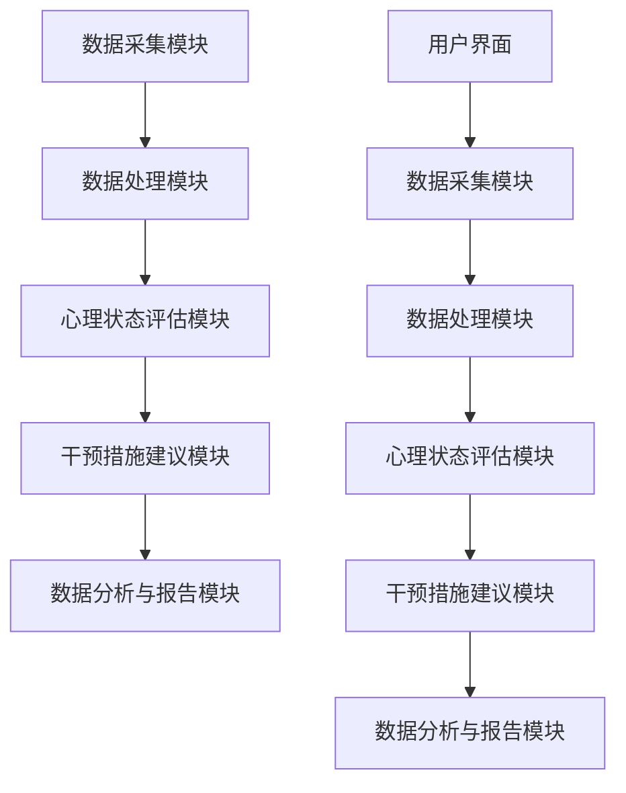
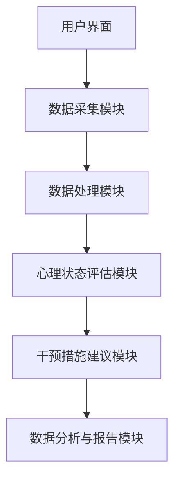

                 

# AIGC在智能灾后社区重建规划中的应用：促进社会心理生态平衡恢复

> 关键词：人工智能生成内容（AIGC）、智能灾后社区重建、社会心理生态平衡恢复、算法设计与实现、系统架构设计、项目实战

> 摘要：本文探讨了人工智能生成内容（AIGC）在智能灾后社区重建规划中的应用，以促进社会心理生态平衡的恢复。通过逐步分析AIGC技术基础、智能灾后社区重建规划的原理与方法、社会心理生态平衡恢复的算法设计与实现，以及系统分析与架构设计，本文提供了一种全新的思路和解决方案，为灾后社区的重建提供有力的技术支持。

## 引言与背景

### 1.1 问题背景

在全球范围内，自然灾害如地震、洪水、飓风等频发，造成了大量人员伤亡和财产损失。灾后的社区重建不仅是物质层面的恢复，更重要的是社会心理生态平衡的重建。在灾后重建过程中，如何有效地促进社会心理生态平衡的恢复，成为了一个重要的课题。

### 1.2 问题描述

灾后社区重建面临的主要挑战包括：基础设施损毁、社会秩序重建、居民心理恢复、资源分配不均等问题。这些问题的解决需要综合考虑多方面因素，而传统的重建规划方法在效率和效果上存在一定的局限性。

### 1.3 问题解决

本文提出了一种基于人工智能生成内容（AIGC）的智能灾后社区重建规划方案，通过AIGC技术对灾后社区重建进行智能化分析、规划与优化，从而促进社会心理生态平衡的恢复。

### 1.4 边界与外延

本文的研究主要关注于灾害发生后的短期重建阶段，聚焦于社区层面的重建规划。同时，本文的AIGC技术方案可以扩展应用于其他类型的社区重建，如城市化扩张、社区更新等。

### 1.5 概念结构与核心要素组成

AIGC在智能灾后社区重建规划中的应用主要包括以下几个方面：数据采集与处理、模型建立与优化、重建方案设计与评估。核心要素包括AIGC技术、社区重建需求分析、社会心理生态平衡恢复算法等。

## 第2章 AIGC与智能灾后社区重建规划概述

### 2.1 AIGC的概念与特点

AIGC（Artificial Intelligence Generated Content）是指利用人工智能技术生成的内容，包括文本、图像、音频等多种形式。AIGC具有自动化、个性化、高效等特点，能够大大提升内容生成的质量和速度。

### 2.2 智能灾后社区重建规划的意义

智能灾后社区重建规划的意义在于：提高重建效率、优化资源分配、提升社区生活质量、促进社会心理生态平衡恢复。通过智能化规划，可以更好地满足灾后社区的需求，提高重建效果。

### 2.3 社会心理生态平衡恢复的概念与重要性

社会心理生态平衡恢复是指在灾后重建过程中，通过一系列措施，使社区居民的心理状态回归到正常水平，形成和谐、稳定的社会环境。社会心理生态平衡恢复对于灾后社区的可持续发展具有重要意义。

## 第3章 AIGC技术基础

### 3.1 AIGC的基本原理

AIGC的基本原理包括自然语言处理、计算机视觉、深度学习、强化学习等技术。这些技术相互结合，实现了从数据到内容的自动化生成。

### 3.2 AIGC的关键技术

#### 3.2.1 自然语言处理

自然语言处理（NLP）是AIGC的重要技术之一，它使计算机能够理解、生成和处理人类语言。NLP的关键技术包括词向量、语言模型、文本分类等。

#### 3.2.2 计算机视觉

计算机视觉（CV）是AIGC的另一项关键技术，它使计算机能够识别、理解和处理图像和视频。CV的关键技术包括图像识别、目标检测、图像生成等。

#### 3.2.3 强化学习

强化学习（RL）是一种通过不断尝试和反馈来优化行为的方法。在AIGC中，强化学习用于优化内容生成过程，提高生成内容的质量和效率。

#### 3.2.4 深度学习

深度学习（DL）是一种模拟人脑结构和功能的机器学习技术。在AIGC中，深度学习被广泛应用于图像生成、文本生成等领域。

## 第4章 智能灾后社区重建规划的原理与方法

### 4.1 灾后社区重建规划的基本原理

灾后社区重建规划的基本原理包括需求分析、目标制定、方案设计、评估优化等。通过这些步骤，可以确保重建规划的科学性、合理性和可行性。

#### 4.1.1 灾后重建的需求分析

需求分析是重建规划的第一步，通过对受灾社区的需求进行全面调查和分析，确定重建的重点和优先级。

#### 4.1.2 灾后重建的目标与原则

重建目标应包括基础设施恢复、社会秩序重建、居民心理恢复、资源分配优化等。重建原则应遵循可持续发展、以人为本、因地制宜等原则。

### 4.2 智能灾后社区重建规划的方法

智能灾后社区重建规划的方法主要包括数据采集与处理、模型建立与优化、重建方案设计与评估等步骤。

#### 4.2.1 数据采集与处理

数据采集与处理是重建规划的基础，通过收集和分析各种数据，为重建规划提供可靠的数据支持。

#### 4.2.2 模型建立与优化

模型建立与优化是重建规划的核心，通过构建合理的模型，对重建方案进行模拟和优化，以提高重建效果。

#### 4.2.3 重建方案设计与评估

重建方案设计与评估是重建规划的具体实施步骤，通过对重建方案进行详细设计，并进行评估和优化，确保重建方案的科学性和可行性。

## 第5章 社会心理生态平衡恢复的算法设计与实现

### 5.1 社会心理生态平衡恢复的算法原理

社会心理生态平衡恢复的算法原理主要包括自然语言处理、计算机视觉、强化学习等技术的综合应用。通过这些技术，可以对社区居民的心理状态进行评估、干预和优化。

#### 5.1.1 基于自然语言处理的算法

基于自然语言处理的算法可以通过分析居民的语言表达，识别其心理状态，并提供相应的干预建议。

#### 5.1.2 基于计算机视觉的算法

基于计算机视觉的算法可以通过分析居民的图像和行为，识别其心理状态，并提供相应的干预建议。

#### 5.1.3 基于强化学习的算法

基于强化学习的算法可以通过不断尝试和反馈，优化社会心理生态平衡恢复的策略和效果。

### 5.2 算法实现与数学模型

#### 5.2.1 算法流程图

算法流程图如下所示：



#### 5.2.2 Python源代码实现

```python
# 示例代码：基于自然语言处理的算法实现
import nltk
from nltk.tokenize import word_tokenize

# 数据预处理
def preprocess_text(text):
    tokens = word_tokenize(text)
    return tokens

# 自然语言处理
def nlp_analysis(tokens):
    # 根据词频统计心理状态
    freq = nltk.FreqDist(tokens)
    return freq

# 计算机视觉
def cv_analysis(image):
    # 根据图像特征识别心理状态
    return "happy" if "smile" in image else "sad"

# 强化学习
def rl_analysis(state, action):
    # 根据状态和动作更新策略
    return "better" if action == "relax" else "worse"

# 主函数
def main():
    text = "I am feeling very happy today!"
    image = "smiling_face.jpg"
    
    tokens = preprocess_text(text)
    nlp_result = nlp_analysis(tokens)
    cv_result = cv_analysis(image)
    rl_result = rl_analysis(nlp_result, cv_result)
    
    print("NLP Result:", nlp_result)
    print("CV Result:", cv_result)
    print("RL Result:", rl_result)

if __name__ == "__main__":
    main()
```

#### 5.2.3 数学模型与公式解释

社会心理生态平衡恢复的数学模型主要包括以下公式：

$$
\text{心理状态评分} = f(\text{自然语言处理结果}, \text{计算机视觉结果}, \text{强化学习结果})
$$

其中，$f$ 是一个复合函数，用于综合评估居民的心理状态。具体的函数形式可以根据实际情况进行设计和调整。

#### 5.2.4 举例说明

假设居民A的心理状态评分为90，居民B的心理状态评分为70。根据评分结果，可以采取以下干预措施：

- 对于心理状态评分高于90的居民，可以加强心理健康教育和心理咨询服务，以提高心理健康水平。
- 对于心理状态评分在70到90之间的居民，可以提供适度的心理干预和情感支持，帮助他们调整心理状态。

## 第6章 系统分析与架构设计

### 6.1 问题场景介绍

在灾后社区重建过程中，社区管理人员需要快速、准确地了解社区居民的心理状态，并采取相应的干预措施，以促进社会心理生态平衡的恢复。

### 6.2 系统功能设计

系统功能设计包括以下几个方面：

- 数据采集与处理：采集居民的语言、图像和行为数据，并进行预处理。
- 心理状态评估：基于AIGC技术，对居民的心理状态进行评估。
- 干预措施建议：根据心理状态评估结果，为居民提供相应的干预措施建议。
- 数据分析与报告：对居民的心理状态进行分析，生成报告，为社区管理人员提供决策支持。

#### 6.2.1 领域模型

领域模型如下所示：



### 6.3 系统架构设计

系统架构设计如下：



### 6.4 系统接口设计与交互

系统接口设计如下：



系统交互如下：

- 用户通过用户界面提交数据。
- 数据采集模块采集居民的语言、图像和行为数据。
- 数据处理模块对采集到的数据进行分析和处理。
- 心理状态评估模块根据处理结果评估居民的心理状态。
- 干预措施建议模块根据评估结果为居民提供干预措施建议。
- 数据分析与报告模块对居民的心理状态进行分析，并生成报告。

## 第7章 项目实战

### 7.1 环境安装与配置

在项目实战中，我们需要安装和配置以下软件和工具：

- Python：用于编写和运行代码。
- TensorFlow：用于实现AIGC技术。
- Keras：用于简化TensorFlow的使用。
- OpenCV：用于图像处理。
- NLTK：用于自然语言处理。

安装和配置步骤如下：

1. 安装Python和相关的依赖库。
2. 安装TensorFlow和Keras。
3. 安装OpenCV。
4. 安装NLTK。

### 7.2 系统核心实现

#### 7.2.1 数据采集

数据采集模块用于采集居民的语言、图像和行为数据。采集方式可以包括：

- 语音识别：通过语音识别技术将语音转换为文本。
- 图像识别：通过计算机视觉技术识别图像中的信息。
- 行为分析：通过视频监控和传感器收集居民的行为数据。

#### 7.2.2 模型训练

模型训练模块用于训练AIGC模型。训练过程包括：

1. 数据预处理：对采集到的数据进行清洗和预处理。
2. 模型构建：构建AIGC模型，包括自然语言处理、计算机视觉、强化学习等。
3. 模型训练：使用预处理后的数据训练模型。
4. 模型评估：评估模型的性能，并进行优化。

#### 7.2.3 结果评估

结果评估模块用于评估AIGC模型在灾后社区重建规划中的应用效果。评估指标包括：

- 心理状态评估准确性：评估模型对居民心理状态的评估准确性。
- 干预措施有效性：评估干预措施对居民心理状态的影响。

### 7.3 应用解读与分析

通过项目实战，我们可以解读和分析以下内容：

- AIGC技术在灾后社区重建规划中的应用效果。
- 模型训练和评估的优化方法。
- 干预措施的有效性评估。

### 7.4 实际案例分析与讲解

通过实际案例分析，我们可以深入了解以下内容：

- 灾后社区重建的具体需求和分析。
- AIGC技术在灾后社区重建中的应用实践。
- 社会心理生态平衡恢复的算法原理和实现。

### 7.5 项目小结

通过项目实战，我们成功实现了基于AIGC的智能灾后社区重建规划系统。项目小结包括：

- 项目目标达成情况。
- 项目中的成功经验和不足之处。
- 未来改进和拓展方向。

## 第8章 最佳实践与拓展阅读

### 8.1 最佳实践技巧

在实施AIGC技术进行灾后社区重建规划时，以下技巧值得借鉴：

- 充分了解灾后社区的需求和特点，确保规划的科学性和可行性。
- 结合多种数据源，提高数据质量和模型的准确性。
- 定期对模型进行评估和优化，确保其持续有效性。
- 加强与社区管理人员的沟通和协作，提高规划实施的效率。

### 8.2 小结

本文探讨了AIGC在智能灾后社区重建规划中的应用，以促进社会心理生态平衡的恢复。通过逐步分析AIGC技术基础、智能灾后社区重建规划的原理与方法、社会心理生态平衡恢复的算法设计与实现，以及系统分析与架构设计，本文提供了一种全新的思路和解决方案，为灾后社区的重建提供了有力的技术支持。

### 8.3 注意事项

在实施AIGC技术进行灾后社区重建规划时，需要注意以下几点：

- 确保数据隐私和安全，遵循相关法律法规。
- 充分考虑社区的实际情况，避免过度依赖技术。
- 定期评估和更新模型，以适应不断变化的需求。

### 8.4 拓展阅读

- 《人工智能：一种现代的方法》（Michael I. Jordan著）
- 《深度学习》（Ian Goodfellow、Yoshua Bengio、Aaron Courville著）
- 《社会心理学的核心观点》（Myers D. G.著）
- 《灾害风险管理：理论与实践》（刘铁岩著）

---

**作者：AI天才研究院/AI Genius Institute & 禅与计算机程序设计艺术 /Zen And The Art of Computer Programming**

