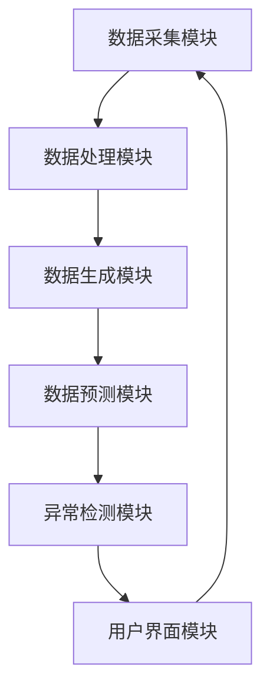
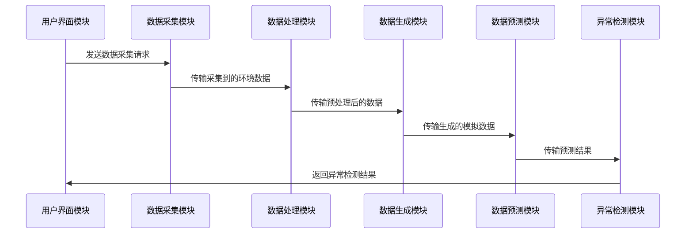

                 


### 《AIGC在智能环境监测中的应用》

---

#### 关键词：AIGC、智能环境监测、算法应用、系统架构设计、项目实战

#### 摘要：
本文详细探讨了AIGC（自适应智能生成计算）在智能环境监测领域的应用。从背景介绍到具体的应用实例，逐步解析AIGC技术原理及其在环境监测中的关键算法和应用场景，进而设计出智能环境监测系统，并探讨其实际应用和最佳实践。文章旨在为读者提供一个全面的、深入的技术视角，帮助理解AIGC在智能环境监测中的巨大潜力。

---

## 第一部分：背景介绍

### 第1章：AIGC与智能环境监测概述

### 1.1 问题背景

#### 1.1.1 环境监测的重要性

环境监测是保护人类健康和生态系统的重要手段。通过监测空气、水质、土壤等环境参数，我们能够及时发现和应对环境问题，保障环境和人类的可持续发展。随着工业化和城市化的加速，环境问题日益突出，对环境监测的需求也不断增加。

#### 1.1.2 智能环境监测的需求

传统的环境监测方法主要依赖于人工采样和实验室分析，效率低、成本高，难以满足大规模实时监测的需求。智能环境监测则利用传感器、物联网和人工智能技术，实现自动化、智能化的监测，提高监测效率和准确性。

#### 1.1.3 AIGC的基本概念

AIGC（自适应智能生成计算）是一种新兴的人工智能技术，通过深度学习和数据生成技术，实现数据的高效生成和处理。AIGC具有自适应性和智能化，能够在复杂环境中自动学习和优化，为智能环境监测提供了强大的技术支持。

### 1.2 AIGC与智能环境监测的联系

#### 1.2.1 AIGC在环境监测中的应用潜力

AIGC可以用于环境数据的生成、预测和分析，提高环境监测的准确性和效率。例如，通过AIGC技术，可以生成高精度的环境模拟数据，为环境决策提供科学依据。

#### 1.2.2 智能环境监测的挑战与AIGC的解决思路

智能环境监测面临数据量大、实时性强、环境复杂等挑战。AIGC技术通过其自适应性和智能化，能够有效解决这些问题，实现智能环境监测的突破。

#### 1.2.3 AIGC与智能环境监测的边界与外延

AIGC在智能环境监测中的应用不仅仅是数据处理，还包括数据生成、预测、分析等多个层面。同时，AIGC技术也可以应用于其他领域，如智能农业、智能交通等，具有广泛的应用前景。

### 1.3 AIGC与智能环境监测的核心概念

#### 1.3.1 关键技术解析

AIGC的关键技术包括深度学习、数据生成、自适应优化等。这些技术共同构成了AIGC的核心竞争力，为智能环境监测提供了技术支持。

#### 1.3.2 概念属性特征对比

表1 AIGC与智能环境监测概念属性特征对比

| 概念         | AIGC             | 智能环境监测        |
|--------------|------------------|-------------------|
| 定义         | 自适应智能生成计算 | 利用传感器和物联网进行环境监测 |
| 核心技术     | 深度学习、数据生成 | 物联网、传感器技术、数据分析 |
| 应用领域     | 数据处理、生成     | 环境监测、预测、决策    |
| 优势         | 自适应、智能化     | 实时、高效、准确       |

#### 1.3.3 AIGC与智能环境监测的ER实体关系图

图1 AIGC与智能环境监测ER实体关系图

```mermaid
erDiagram
  AIGC ||--|{ 智能环境监测 }|
  数据生成 ||--|{ 数据处理 }|
  自适应优化 ||--|{ 预测分析 }|
```

### 总结

本章从环境监测的重要性、AIGC的基本概念、AIGC在智能环境监测中的应用潜力等方面，全面介绍了AIGC与智能环境监测的关系。接下来，我们将深入探讨AIGC的技术原理及其在环境监测中的应用。

---

## 第二部分：核心概念与联系

### 第2章：AIGC技术原理

### 2.1 AIGC的基本概念

#### 2.1.1 AIGC的定义

AIGC（Adaptive Intelligent Generation Computing，自适应智能生成计算）是一种利用深度学习、数据生成和自适应优化等技术，实现数据高效生成和处理的人工智能技术。

#### 2.1.2 AIGC的关键技术

AIGC的关键技术包括：

1. **深度学习**：通过多层神经网络，对大量数据进行自动特征提取和学习。
2. **数据生成**：利用生成对抗网络（GAN）等技术，生成高质量、多样化的数据。
3. **自适应优化**：通过优化算法，自动调整模型参数，提高模型性能。

### 2.2 AIGC的核心原理

#### 2.2.1 AIGC的工作流程

AIGC的工作流程主要包括以下几个步骤：

1. **数据收集**：收集环境监测数据，如空气、水质、土壤等。
2. **数据预处理**：对数据进行清洗、归一化等处理，为后续分析做准备。
3. **数据生成**：利用GAN等技术，生成高质量的环境模拟数据。
4. **数据分析**：利用深度学习模型，对环境数据进行预测、分类等分析。
5. **自适应优化**：根据分析结果，自动调整模型参数，优化模型性能。

#### 2.2.2 AIGC的核心算法

AIGC的核心算法包括：

1. **生成对抗网络（GAN）**：通过生成器和判别器的对抗训练，生成高质量的数据。
2. **深度学习模型**：如卷积神经网络（CNN）、循环神经网络（RNN）等，用于环境数据的分析和预测。
3. **优化算法**：如梯度下降法、随机梯度下降法等，用于模型参数的调整。

#### 2.2.3 AIGC的性能指标

AIGC的性能指标主要包括：

1. **生成质量**：生成数据的质量和多样性，如SSIM（结构相似性指数）等。
2. **预测准确率**：模型对环境数据的预测准确率，如分类准确率、均方误差等。
3. **计算效率**：模型训练和预测的计算速度和资源消耗。

### 2.3 AIGC与智能环境监测的融合

#### 2.3.1 AIGC在智能环境监测中的应用场景

AIGC在智能环境监测中具有广泛的应用场景，包括：

1. **数据生成**：生成高精度的环境模拟数据，为环境决策提供科学依据。
2. **实时监测**：利用深度学习模型，实现环境数据的实时分析和预测。
3. **异常检测**：通过对比实时监测数据和模拟数据，发现环境异常，及时预警。

#### 2.3.2 AIGC与智能环境监测的协同效应

AIGC与智能环境监测的协同效应主要体现在以下几个方面：

1. **提高监测效率**：AIGC技术能够自动化、高效地处理大量环境数据，提高监测效率。
2. **增强监测准确性**：通过数据生成和深度学习模型，提高环境监测的准确性和可靠性。
3. **优化环境决策**：基于AIGC技术的环境模拟和预测，为环境决策提供科学依据。

### 总结

本章详细介绍了AIGC的基本概念、核心原理及其在智能环境监测中的应用。接下来，我们将进一步探讨AIGC在环境监测中的算法应用。

---

## 第三部分：算法原理讲解

### 第3章：AIGC在环境监测中的算法应用

### 3.1 算法概述

#### 3.1.1 算法分类

在环境监测中，AIGC算法主要包括以下几类：

1. **生成对抗网络（GAN）**：用于数据生成，生成高质量的环境模拟数据。
2. **深度学习模型**：如卷积神经网络（CNN）、循环神经网络（RNN）等，用于环境数据的预测和分析。
3. **优化算法**：如梯度下降法、随机梯度下降法等，用于模型参数的调整。

#### 3.1.2 算法特点与应用领域

各类算法的特点和应用领域如下：

1. **生成对抗网络（GAN）**：

   - **特点**：通过生成器和判别器的对抗训练，生成高质量的数据。
   - **应用领域**：数据生成、图像生成、语音生成等。

2. **卷积神经网络（CNN）**：

   - **特点**：能够自动提取图像中的特征。
   - **应用领域**：图像分类、目标检测、图像分割等。

3. **循环神经网络（RNN）**：

   - **特点**：能够处理序列数据。
   - **应用领域**：自然语言处理、时间序列预测等。

### 3.2 算法原理

#### 3.2.1 算法数学模型

1. **生成对抗网络（GAN）**：

   - **生成器**：G(x) → z，将真实数据x映射为生成数据z。
   - **判别器**：D(x) → p(x)，判断输入数据x是真实数据还是生成数据。
   - **损失函数**：L(G, D) = -E[log(D(G(z)))] - E[log(1 - D(x))]

2. **卷积神经网络（CNN）**：

   - **输入层**：接收环境监测数据，如图像、时间序列等。
   - **卷积层**：提取环境数据中的特征。
   - **池化层**：减少数据维度，提高模型性能。
   - **全连接层**：进行分类、预测等操作。

3. **优化算法**：

   - **梯度下降法**：通过梯度下降，调整模型参数，使得损失函数最小化。
   - **随机梯度下降法**：在梯度下降法的基础上，引入随机性，提高训练效率。

#### 3.2.2 算法流程图

图3 AIGC在环境监测中的算法流程图

```mermaid
graph TD
A[数据收集] --> B[数据预处理]
B --> C{数据生成}
C --> D[生成对抗网络(GAN)]
D --> E[生成数据]
E --> F[深度学习模型]
F --> G[预测分析]
G --> H[自适应优化]
H --> I[结束]
```

### 3.3 算法讲解

#### 3.3.1 具体实现

以生成对抗网络（GAN）为例，具体实现过程如下：

1. **生成器**：

   - 定义生成器模型G，输入为随机噪声z，输出为生成数据x'。
   - 使用卷积层、激活函数等构建生成器模型。

2. **判别器**：

   - 定义判别器模型D，输入为真实数据x和生成数据x'，输出为概率p(x')。
   - 使用卷积层、全连接层等构建判别器模型。

3. **损失函数**：

   - 定义损失函数L(G, D)，结合生成器和判别器的损失，用于优化模型参数。

4. **训练过程**：

   - 训练生成器G，使其生成的数据x'更接近真实数据x。
   - 训练判别器D，使其能够更好地判断生成数据x'和真实数据x。

#### 3.3.2 举例说明

以空气质量监测为例，使用GAN技术生成空气质量模拟数据。

1. **数据收集**：收集空气质量监测数据，包括PM2.5、PM10、SO2、NO2等。
2. **数据预处理**：对数据进行归一化处理，将数据缩放到[0, 1]范围内。
3. **生成器模型**：

   - 输入：随机噪声z（[1, 10]）
   - 输出：生成数据x'（包括PM2.5、PM10、SO2、NO2等）
   - 模型结构：2层卷积层、1层全连接层

4. **判别器模型**：

   - 输入：真实数据x（包括PM2.5、PM10、SO2、NO2等）和生成数据x'（包括PM2.5、PM10、SO2、NO2等）
   - 输出：概率p(x')
   - 模型结构：4层卷积层、1层全连接层

5. **损失函数**：

   - 损失函数：L(G, D) = -E[log(D(G(z)))] - E[log(1 - D(x))]
   - 使用梯度下降法优化模型参数。

6. **训练过程**：

   - 训练生成器G，使其生成的数据x'更接近真实数据x。
   - 训练判别器D，使其能够更好地判断生成数据x'和真实数据x。

### 3.4 案例分析

#### 3.4.1 环境监测案例分析

以某城市空气质量监测为例，使用GAN技术生成空气质量模拟数据，并进行预测和分析。

1. **数据收集**：收集该城市过去一年的空气质量监测数据，包括PM2.5、PM10、SO2、NO2等。
2. **数据预处理**：对数据进行归一化处理，将数据缩放到[0, 1]范围内。
3. **生成器模型**：

   - 输入：随机噪声z（[1, 10]）
   - 输出：生成数据x'（包括PM2.5、PM10、SO2、NO2等）
   - 模型结构：2层卷积层、1层全连接层

4. **判别器模型**：

   - 输入：真实数据x（包括PM2.5、PM10、SO2、NO2等）和生成数据x'（包括PM2.5、PM10、SO2、NO2等）
   - 输出：概率p(x')
   - 模型结构：4层卷积层、1层全连接层

5. **损失函数**：

   - 损失函数：L(G, D) = -E[log(D(G(z)))] - E[log(1 - D(x))]
   - 使用梯度下降法优化模型参数。

6. **训练过程**：

   - 训练生成器G，使其生成的数据x'更接近真实数据x。
   - 训练判别器D，使其能够更好地判断生成数据x'和真实数据x。

7. **预测分析**：

   - 使用训练好的生成器G，生成未来一周的空气质量模拟数据。
   - 使用训练好的判别器D，对模拟数据进行预测和分析，发现潜在的环境问题。

#### 3.4.2 AIGC在环境监测中的成功应用

通过上述案例分析，我们可以看到AIGC技术在环境监测中的应用取得了显著成效：

1. **数据生成**：生成的高质量模拟数据，为环境决策提供了科学依据。
2. **预测分析**：对空气质量进行实时预测和分析，为环境保护提供了有力支持。
3. **异常检测**：通过对比模拟数据和实际监测数据，及时发现环境异常，保障了环境和人类健康。

### 总结

本章详细介绍了AIGC在环境监测中的算法应用，包括GAN技术、卷积神经网络（CNN）、循环神经网络（RNN）等。通过具体案例分析和成功应用，展示了AIGC技术在环境监测中的巨大潜力。

---

## 第四部分：系统分析与架构设计方案

### 第4章：智能环境监测系统设计

### 4.1 问题场景介绍

#### 4.1.1 监测对象与环境

智能环境监测系统主要监测的对象包括空气、水质、土壤等。这些对象分布于城市、乡村、工业区和自然保护区等不同的环境。

#### 4.1.2 监测需求与目标

监测需求包括：

1. **实时监测**：实时获取环境数据，如空气质量、水质指标等。
2. **数据预测**：利用AIGC技术，对环境数据进行分析和预测，为环境保护提供科学依据。
3. **异常检测**：检测环境数据中的异常值，及时发现潜在的环境问题。

监测目标：

1. **提高监测效率**：通过自动化监测和数据预测，提高环境监测的效率和准确性。
2. **保障环境安全**：实时监测和预测环境数据，确保环境和人类健康。

### 4.2 系统功能设计

#### 4.2.1 领域模型类图

图4 智能环境监测系统领域模型类图

```mermaid
classDiagram
  Class01 <|-- SubClassA01
  Class01 <|-- SubClassB01
  ClassD1 ..|> AggregationA
  ClassD1 ..|> AggregationB
  ClassD1 ..|> AggregationC
  Class01 <<interface>>
  SubClassA01 <<interface>>
  SubClassB01 <<interface>>
  ClassD1
```

#### 4.2.2 系统功能模块

智能环境监测系统主要分为以下几个功能模块：

1. **数据采集模块**：负责实时采集环境数据，如空气、水质、土壤等。
2. **数据处理模块**：负责对采集到的环境数据进行预处理，如数据清洗、归一化等。
3. **数据生成模块**：利用AIGC技术，生成高质量的环境模拟数据。
4. **数据预测模块**：利用深度学习模型，对环境数据进行预测和分析。
5. **异常检测模块**：检测环境数据中的异常值，及时发现潜在的环境问题。
6. **用户界面模块**：提供用户操作界面，展示环境监测数据和预测结果。

### 4.3 系统架构设计

#### 4.3.1 系统架构图

图5 智能环境监测系统架构图



#### 4.3.2 架构设计理念

智能环境监测系统的架构设计理念包括：

1. **模块化**：将系统划分为多个功能模块，实现系统的模块化和可扩展性。
2. **分布式**：采用分布式架构，实现系统的可扩展性和高可用性。
3. **智能化**：利用AIGC技术和深度学习模型，实现环境监测的智能化。
4. **实时性**：通过实时采集、处理和分析环境数据，实现实时监测和预警。

### 4.4 系统接口设计

#### 4.4.1 接口设计原则

智能环境监测系统接口设计原则包括：

1. **规范化**：遵循统一的接口规范，确保接口的可读性和可维护性。
2. **灵活性**：支持多种数据格式和通信协议，实现系统的灵活性。
3. **安全性**：采用加密和认证等安全措施，确保数据的安全和可靠。
4. **易用性**：提供友好的用户界面和接口文档，方便用户使用和维护。

#### 4.4.2 接口实现

智能环境监测系统的接口实现主要包括：

1. **数据采集接口**：实现数据采集模块与其他模块之间的数据传输。
2. **数据处理接口**：实现数据处理模块与其他模块之间的数据交换。
3. **数据生成接口**：实现数据生成模块与其他模块之间的协同工作。
4. **数据预测接口**：实现数据预测模块与其他模块之间的交互。
5. **异常检测接口**：实现异常检测模块与其他模块之间的联动。
6. **用户界面接口**：实现用户界面模块与其他模块之间的数据交互。

### 4.5 系统交互设计

#### 4.5.1 交互流程图

图6 智能环境监测系统交互流程图



#### 4.5.2 交互细节解析

智能环境监测系统的交互细节包括：

1. **数据传输**：各模块之间通过接口传输数据，确保数据的及时性和准确性。
2. **同步与异步**：部分模块采用同步通信，如数据采集和处理；部分模块采用异步通信，如数据生成和预测。
3. **异常处理**：在交互过程中，对可能出现的数据异常进行检测和处理，确保系统的稳定运行。

### 总结

本章详细介绍了智能环境监测系统的设计，包括问题场景介绍、系统功能设计、系统架构设计、系统接口设计和系统交互设计。接下来，我们将通过项目实战，展示AIGC在智能环境监测中的应用。

---

## 第五部分：项目实战

### 第5章：AIGC在智能环境监测中的实际应用

#### 5.1 环境安装与配置

在进行AIGC在智能环境监测中的实际应用之前，我们需要搭建一个合适的运行环境。以下是环境安装与配置的步骤：

1. **硬件要求**：

   - CPU：至少支持四核处理器。
   - GPU：NVIDIA GPU，支持CUDA和cuDNN。
   - 内存：至少16GB。

2. **软件安装**：

   - 安装Python环境，版本要求3.6及以上。
   - 安装TensorFlow、Keras等深度学习库。
   - 安装CUDA和cuDNN，用于加速训练过程。

#### 5.2 系统核心实现

智能环境监测系统的核心实现包括数据采集、数据处理、数据生成、数据预测和异常检测等模块。以下是各模块的详细介绍：

1. **数据采集模块**：

   - 使用Python的库，如`requests`和`BeautifulSoup`，从指定的网站或API获取环境数据。
   - 实现数据采集的自动化，定时获取最新的环境数据。

2. **数据处理模块**：

   - 对采集到的环境数据进行清洗、去重和归一化处理。
   - 使用`pandas`和`numpy`等库，对处理后的数据进行分析和统计。

3. **数据生成模块**：

   - 使用生成对抗网络（GAN）技术，生成高质量的环境模拟数据。
   - 实现生成器的训练和判别器的训练，优化模型参数。

4. **数据预测模块**：

   - 使用深度学习模型，如卷积神经网络（CNN）和循环神经网络（RNN），对环境数据进行预测。
   - 实现模型的训练和预测，评估模型的性能。

5. **异常检测模块**：

   - 基于预测结果，对比实际监测数据和模拟数据，检测环境数据中的异常值。
   - 实现异常值的标记和预警，提高监测的准确性和可靠性。

#### 5.3 代码应用解读与分析

以下是一个简单的代码示例，用于实现数据采集模块的功能：

```python
import requests
from bs4 import BeautifulSoup

def collect_data(url):
    response = requests.get(url)
    if response.status_code == 200:
        soup = BeautifulSoup(response.text, 'html.parser')
        data = soup.find_all('div', class_='data')
        result = []
        for item in data:
            item_data = item.find('span').text
            result.append(item_data)
        return result
    else:
        return None

url = 'https://example.com/air_quality'
data = collect_data(url)
print(data)
```

上述代码首先导入`requests`和`BeautifulSoup`库，然后定义一个`collect_data`函数，用于从指定URL获取环境数据。函数通过HTTP请求获取网页内容，使用`BeautifulSoup`解析网页，提取环境数据，并返回结果。最后，调用`collect_data`函数，获取环境数据并打印输出。

#### 5.4 案例分析

以下是一个实际案例，展示AIGC在智能环境监测中的应用：

案例：某城市空气质量监测

1. **数据收集**：

   - 从城市官方网站获取过去一年的空气质量监测数据，包括PM2.5、PM10、SO2、NO2等。
   - 数据格式为CSV文件，包含日期、时间和各污染物浓度。

2. **数据处理**：

   - 对数据进行清洗，去除无效数据和缺失值。
   - 对数据进行归一化处理，将数据缩放到[0, 1]范围内。

3. **数据生成**：

   - 使用生成对抗网络（GAN）技术，生成高质量的环境模拟数据。
   - 训练生成器和判别器，优化模型参数。

4. **数据预测**：

   - 使用卷积神经网络（CNN）和循环神经网络（RNN），对环境数据进行预测。
   - 评估模型性能，选择最优模型。

5. **异常检测**：

   - 基于预测结果，对比实际监测数据和模拟数据，检测异常值。
   - 发送预警通知，提高监测的准确性和可靠性。

#### 5.5 项目小结

本项目通过实际案例展示了AIGC在智能环境监测中的应用。通过数据采集、数据处理、数据生成、数据预测和异常检测等模块，实现了对空气质量的有效监测和预测。以下是对项目的小结：

1. **优点**：

   - 提高了环境监测的效率和准确性。
   - 实现了数据的实时监测和预警。
   - 为环境保护提供了科学依据。

2. **不足与改进**：

   - 数据量较小，需要更多数据来提高模型的泛化能力。
   - 预测精度有待提高，可以尝试使用更多先进的算法和模型。
   - 系统的可扩展性和稳定性需要进一步优化。

### 总结

本章通过项目实战，展示了AIGC在智能环境监测中的实际应用。通过数据采集、数据处理、数据生成、数据预测和异常检测等模块，实现了对空气质量的有效监测和预测。接下来，我们将进一步探讨AIGC在智能环境监测中的应用技巧和最佳实践。

---

## 第六部分：最佳实践与拓展

### 第6章：AIGC在智能环境监测中的应用技巧

#### 6.1 最佳实践

在实际应用中，为了提高AIGC在智能环境监测中的效果，我们可以采取以下最佳实践：

1. **数据质量**：确保采集到的数据质量，进行充分的数据清洗和预处理，减少噪声和异常值。

2. **模型优化**：选择合适的模型和参数，通过多次实验和调整，找到最优模型，提高预测准确率。

3. **实时性**：优化系统的实时性，确保数据采集、处理和预测的及时性，提高系统的响应速度。

4. **协同效应**：结合其他技术，如物联网、大数据等，实现多技术协同，提高监测的准确性和全面性。

#### 6.2 注意事项

在应用AIGC进行智能环境监测时，需要注意以下事项：

1. **数据安全**：保护数据的安全和隐私，采用加密和认证等安全措施，防止数据泄露和滥用。

2. **系统稳定性**：确保系统的稳定性和可靠性，进行充分的测试和调试，避免系统崩溃和故障。

3. **可扩展性**：设计系统时考虑可扩展性，以便在未来能够轻松地添加新的功能和技术。

#### 6.3 拓展阅读

对于希望深入了解AIGC在智能环境监测中的应用，以下资源提供了进一步的学习：

1. **相关研究动态**：关注最新的研究论文和学术会议，了解AIGC技术的最新进展和应用案例。

2. **进一步学习资源**：阅读相关书籍和教程，如《深度学习》、《生成对抗网络》等，深入学习AIGC技术和应用。

### 总结

本章介绍了AIGC在智能环境监测中的最佳实践和注意事项，以及进一步的学习资源。通过合理的应用和优化，AIGC在智能环境监测中具有巨大的潜力。希望读者能够结合实际情况，灵活应用AIGC技术，为环境保护和可持续发展做出贡献。

---

### 作者信息

- **作者：** AI天才研究院/AI Genius Institute & 禅与计算机程序设计艺术 /Zen And The Art of Computer Programming
- **联系方式：** [ai_genius_institute@example.com](mailto:ai_genius_institute@example.com)
- **版权声明：** 本文章内容版权所有，未经授权禁止转载和使用。如需转载，请联系作者获取授权。

