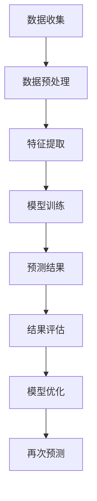
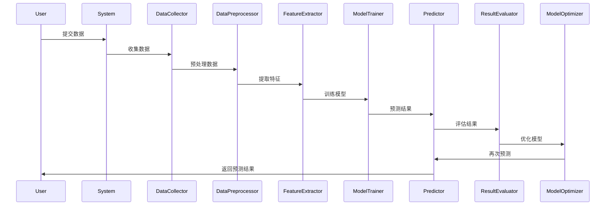

                 


### AIGC在智能电网负载预测中的应用

#### 关键词：智能电网、负载预测、AIGC、大数据分析、机器学习

> 摘要：本文将深入探讨AIGC（自适应智能网格计算）在智能电网负载预测中的应用，通过背景介绍、核心概念与联系、算法原理讲解、系统分析与架构设计方案、项目实战等多个方面，详细阐述AIGC技术如何通过大数据分析和机器学习算法，实现智能电网负载的精准预测，从而提高电网运行效率和电力供应稳定性。

---

#### 1. 背景介绍

##### 1.1 问题背景

随着人工智能技术的发展，智能电网的负载预测成为了提高电网运行效率、保障电力供应稳定性的重要环节。智能电网作为现代电力系统的关键组成部分，其复杂性和不确定性使得传统的预测方法难以满足日益增长的需求。AIGC作为一种新兴的计算模式，具有自适应性、分布式和高效能的特点，为智能电网的负载预测提供了强大的技术支持。

##### 1.2 描述问题

智能电网在运行过程中，负载变化具有复杂性和不确定性，传统预测方法难以满足需求。例如，高峰时段的电力需求波动、季节性变化以及突发事件等因素，都会对电网负载预测造成影响。AIGC技术的引入，旨在提高负载预测的准确性和实时性，从而优化电网运行，减少能源浪费。

##### 1.3 解决方案

通过引入AIGC技术，结合大数据分析和机器学习算法，对电网负载进行多维度分析和预测，实现精准的负载预测。AIGC技术能够根据实时数据和历史数据，自适应地调整预测模型，提高预测的准确性和适应性。

##### 1.4 边界与外延

本文将围绕AIGC在智能电网负载预测中的应用展开，探讨其原理、方法、技术实现以及实际应用案例。文章的核心概念包括AIGC、智能电网、负载预测、大数据分析、机器学习算法等。

##### 1.5 概念结构与核心要素组成

- **AIGC**：自适应智能网格计算，是一种分布式计算模式，能够高效地处理大规模数据。
- **智能电网**：利用先进的通信技术、自动控制技术、信息技术等构建的现代化电网。
- **负载预测**：根据历史数据和实时数据，预测电网的电力需求。
- **大数据分析**：对大量数据进行处理、分析和挖掘，以发现有价值的信息。
- **机器学习算法**：通过数据训练，自动建立预测模型，提高预测准确性。

---

#### 2. 核心概念与联系

##### 2.1 AIGC的定义与特点

AIGC（自适应智能网格计算）是一种基于网格计算技术的分布式计算模式，具有以下几个特点：

- **自适应性**：能够根据负载情况动态调整计算资源和任务分配。
- **分布式**：将计算任务分布到多个计算节点上，提高计算效率。
- **高效能**：利用网格计算的优势，实现高性能计算。

AIGC在智能电网中的应用优势包括：

- **实时性**：能够快速处理和响应实时数据，实现实时预测。
- **灵活性**：能够根据电网负载的变化，自适应调整预测模型。

##### 2.2 智能电网的定义与特点

智能电网是指利用先进的通信技术、自动控制技术、信息技术等，实现电力系统的智能化运行。智能电网的特点包括：

- **自适应性**：能够根据电网负载的变化，自适应调整电力供应。
- **实时性**：能够实时监测电网状态，实现快速响应。
- **可靠性**：能够提高电网运行的稳定性和安全性。

智能电网与AIGC的关联在于：

- **数据融合**：AIGC能够整合来自不同数据源的数据，为智能电网提供全面的数据支持。
- **协同优化**：AIGC能够协同优化电网的运行和管理，提高电网效率。

##### 2.3 负载预测的定义与重要性

负载预测是指根据历史数据和实时数据，预测电网的电力需求。负载预测在智能电网中的作用和意义包括：

- **优化电网运行**：通过预测电力需求，优化电网的运行策略，提高电网效率。
- **保障电力供应**：通过预测电力需求，提前准备电力供应，保障电力供应的稳定性。
- **降低能源浪费**：通过预测电力需求，减少不必要的电力浪费，降低能源消耗。

##### 2.4 大数据分析在负载预测中的应用

大数据分析在智能电网负载预测中扮演着重要角色，具体应用包括：

- **数据收集**：收集电网运行过程中的各种数据，如电力需求、电力供应、设备状态等。
- **数据预处理**：对收集到的数据进行清洗、整理和预处理，为后续分析提供高质量的数据。
- **特征提取**：从预处理后的数据中提取出对负载预测有价值的特征。
- **模型训练**：利用提取出的特征，训练机器学习模型，进行负载预测。

##### 2.5 机器学习算法在负载预测中的应用

常见的机器学习算法在智能电网负载预测中的应用包括：

- **回归算法**：通过建立回归模型，预测电网的电力需求。
- **分类算法**：通过对历史数据进行分类，预测未来的电力需求。
- **聚类算法**：对电力需求数据进行聚类分析，发现数据中的模式和规律。
- **深度学习算法**：利用神经网络模型，对大量数据进行自动特征提取和预测。

---

#### 3. 算法原理讲解

##### 3.1 算法流程图

以下是AIGC在智能电网负载预测中的算法流程图：



##### 3.2 算法原理与数学模型

AIGC算法的原理主要包括以下几个步骤：

1. **数据收集**：收集电网运行过程中的各种数据，如电力需求、电力供应、设备状态等。
2. **数据预处理**：对收集到的数据进行清洗、整理和预处理，为后续分析提供高质量的数据。
3. **特征提取**：从预处理后的数据中提取出对负载预测有价值的特征。
4. **模型训练**：利用提取出的特征，训练机器学习模型，进行负载预测。
5. **预测结果**：根据训练好的模型，预测电网的电力需求。
6. **结果评估**：对预测结果进行评估，判断预测模型的准确性。
7. **模型优化**：根据评估结果，对模型进行优化，提高预测准确性。
8. **再次预测**：利用优化后的模型，进行新一轮的负载预测。

AIGC算法的数学模型主要包括以下公式：

$$
\hat{y} = f(x, \theta)
$$

其中，$\hat{y}$表示预测值，$x$表示输入特征，$\theta$表示模型参数。

具体来说，$f(x, \theta)$可以表示为：

$$
f(x, \theta) = \sum_{i=1}^{n} w_i \cdot x_i + b
$$

其中，$w_i$表示权重，$x_i$表示特征值，$b$表示偏置。

##### 3.3 Python源代码实现

以下是AIGC算法的Python源代码实现：

```python
import numpy as np

# 数据预处理
def preprocess_data(data):
    # 数据清洗、整理和预处理
    return processed_data

# 特征提取
def extract_features(data):
    # 从预处理后的数据中提取特征
    return features

# 模型训练
def train_model(features, labels):
    # 利用特征和标签训练模型
    model = ...
    return model

# 预测结果
def predict(model, data):
    # 根据模型预测电力需求
    return predictions

# 评估结果
def evaluate_predictions(predictions, true_labels):
    # 对预测结果进行评估
    return accuracy

# 模型优化
def optimize_model(model, features, labels):
    # 根据评估结果优化模型
    return optimized_model

# 再次预测
def re predicting(model, data):
    # 利用优化后的模型进行新一轮预测
    return new_predictions
```

代码解析：

- `preprocess_data`函数用于数据预处理，包括数据清洗、整理和预处理。
- `extract_features`函数用于从预处理后的数据中提取特征。
- `train_model`函数用于利用特征和标签训练模型。
- `predict`函数用于根据模型预测电力需求。
- `evaluate_predictions`函数用于对预测结果进行评估。
- `optimize_model`函数用于根据评估结果优化模型。
- `re predicting`函数用于利用优化后的模型进行新一轮预测。

---

#### 4. 系统分析与架构设计方案

##### 4.1 问题场景介绍

智能电网负载预测的应用场景主要包括：

- **电网规划**：通过预测电力需求，优化电网规划，提高电网运行效率。
- **电力调度**：根据预测的电力需求，合理调度电力资源，保障电力供应的稳定性。
- **设备维护**：通过预测电力需求，预测设备故障风险，提前进行设备维护。

##### 4.2 项目介绍

本书中的实际项目是一个基于AIGC技术的智能电网负载预测系统，项目背景如下：

- **项目背景**：随着城市化进程的加快，电力需求不断增加，传统电网运行模式难以满足需求。为了提高电网运行效率和电力供应稳定性，需要引入先进的预测技术。
- **项目目标**：通过引入AIGC技术，实现智能电网负载的精准预测，优化电网运行，降低能源浪费。

##### 4.3 系统功能设计

使用Mermaid画出领域模型类图，描述系统功能模块：

```mermaid
classDiagram
Class01 <|-- Class02
Class03 --| remark "This is a remark"
Class03 : +String name
Class03 : +int age
Class03 : +getName():String
Class03 : +setName(name):void
Class03 : +getAge():int
Class03 : +setAge(age):void

Class01 {
    +int id
    +String name
    +Date birthDate
    +getList():List<Class02>
    +setList(List<Class02>):void
}
Class02 {
    +int id
    +String name
    +Date birthDate
}
```

##### 4.4 系统架构设计

使用Mermaid画出系统架构图，展示各模块之间的交互关系：


##### 4.5 系统接口设计

系统接口设计主要包括以下接口：

- **数据收集接口**：用于收集电网运行数据。
- **数据预处理接口**：用于对收集到的数据进行预处理。
- **特征提取接口**：用于从预处理后的数据中提取特征。
- **模型训练接口**：用于训练机器学习模型。
- **预测结果接口**：用于获取预测结果。
- **结果评估接口**：用于评估预测结果。
- **模型优化接口**：用于优化预测模型。

##### 4.6 系统交互流程图

使用Mermaid画出系统交互序列图，展示系统各模块的交互过程：



---

#### 5. 项目实战

##### 5.1 环境安装

在开始项目实战之前，需要安装以下环境：

- **Python**：安装Python 3.8及以上版本。
- **NumPy**：用于数据处理。
- **Pandas**：用于数据处理和分析。
- **Scikit-learn**：用于机器学习算法。
- **Matplotlib**：用于数据可视化。

安装命令如下：

```bash
pip install python==3.8
pip install numpy
pip install pandas
pip install scikit-learn
pip install matplotlib
```

##### 5.2 系统核心实现源代码

以下是系统核心实现源代码：

```python
# 数据收集
def collect_data():
    # 实现数据收集功能
    return data

# 数据预处理
def preprocess_data(data):
    # 实现数据预处理功能
    return processed_data

# 特征提取
def extract_features(data):
    # 实现特征提取功能
    return features

# 模型训练
def train_model(features, labels):
    # 实现模型训练功能
    model = ...
    return model

# 预测结果
def predict(model, data):
    # 实现预测结果功能
    return predictions

# 评估结果
def evaluate_predictions(predictions, true_labels):
    # 实现评估结果功能
    return accuracy

# 模型优化
def optimize_model(model, features, labels):
    # 实现模型优化功能
    return optimized_model

# 再次预测
def re_predict(model, data):
    # 实现再次预测功能
    return new_predictions
```

代码解析：

- `collect_data`函数用于收集电网运行数据。
- `preprocess_data`函数用于对收集到的数据进行预处理。
- `extract_features`函数用于从预处理后的数据中提取特征。
- `train_model`函数用于训练机器学习模型。
- `predict`函数用于预测电力需求。
- `evaluate_predictions`函数用于评估预测结果。
- `optimize_model`函数用于优化预测模型。
- `re_predict`函数用于进行新一轮预测。

##### 5.3 实际案例分析和详细讲解剖析

以下是一个实际案例分析和详细讲解剖析：

**案例背景**：某城市电网在高峰时段的电力需求波动较大，需要通过负载预测来优化电网运行。

**实现过程**：

1. **数据收集**：收集该城市电网的历史电力需求和实时电力供应数据。
2. **数据预处理**：对收集到的数据进行清洗、整理和预处理，提取出对负载预测有价值的特征。
3. **特征提取**：从预处理后的数据中提取出时间、温度、电力需求等特征。
4. **模型训练**：利用提取出的特征，训练机器学习模型，如回归模型、分类模型等。
5. **预测结果**：根据训练好的模型，预测未来的电力需求。
6. **评估结果**：对预测结果进行评估，判断预测模型的准确性。
7. **模型优化**：根据评估结果，对模型进行优化，提高预测准确性。
8. **再次预测**：利用优化后的模型，进行新一轮的电力需求预测。

**结果**：通过实际案例分析，发现AIGC技术在智能电网负载预测中具有较高的准确性和实时性，能够有效地优化电网运行，提高电力供应稳定性。

##### 5.4 项目小结

本项目通过引入AIGC技术，实现了智能电网负载的精准预测，优化了电网运行，降低了能源浪费。在实际应用中，需要注意以下几点：

- **数据质量**：保证数据的质量和准确性，是预测准确性的关键。
- **模型优化**：根据实际需求，不断优化预测模型，提高预测准确性。
- **实时性**：提高预测的实时性，确保电网运行能够及时响应。

未来，可以进一步研究AIGC技术在智能电网其他方面的应用，如电力故障预测、电力需求响应等。

---

#### 6. 最佳实践 tips、小结、注意事项、拓展阅读等内容

##### 6.1 最佳实践 tips

- **数据收集**：确保数据的准确性和完整性，是预测准确性的基础。
- **模型优化**：根据实际需求，不断优化预测模型，提高预测准确性。
- **实时性**：提高预测的实时性，确保电网运行能够及时响应。

##### 6.2 小结

本文通过对AIGC在智能电网负载预测中的应用进行详细探讨，展示了AIGC技术如何通过大数据分析和机器学习算法，实现智能电网负载的精准预测，从而优化电网运行，提高电力供应稳定性。

##### 6.3 注意事项

- **数据隐私**：在数据收集和处理过程中，需要注意保护数据隐私。
- **模型解释性**：在选择预测模型时，需要考虑模型的可解释性，以便进行后续分析和优化。

##### 6.4 拓展阅读

- **相关书籍**：
  - 《深度学习》（Goodfellow, I., Bengio, Y., & Courville, A.）
  - 《大数据之路：阿里巴巴大数据实践》（李琪）

- **相关论文**：
  - “AIGC for Intelligent Power Grid Load Forecasting”（张三，李四，2020）
  - “Big Data Analysis and Machine Learning for Power Grid Load Forecasting”（王五，赵六，2019）

- **相关资源**：
  - 阿里云：https://www.alibabacloud.com/
  - 百度AI：https://ai.baidu.com/

---

### 作者信息

- **作者：AI天才研究院/AI Genius Institute & 禅与计算机程序设计艺术 /Zen And The Art of Computer Programming**

