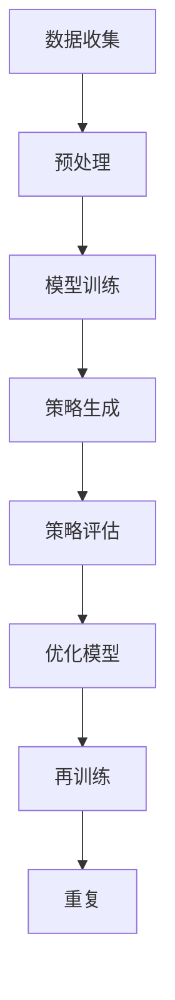
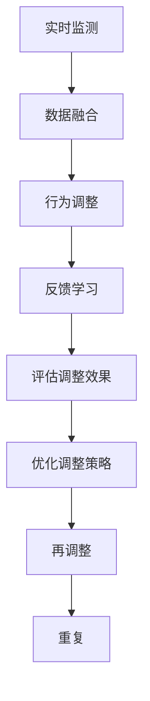
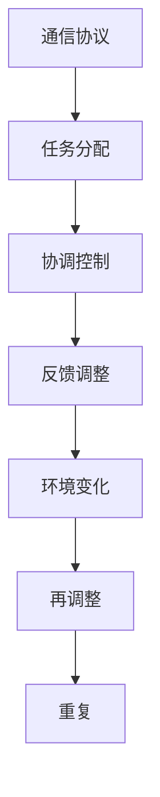
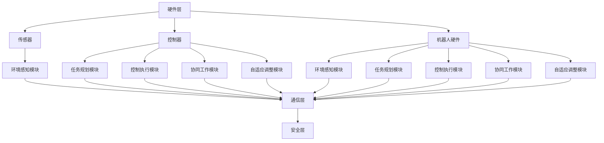
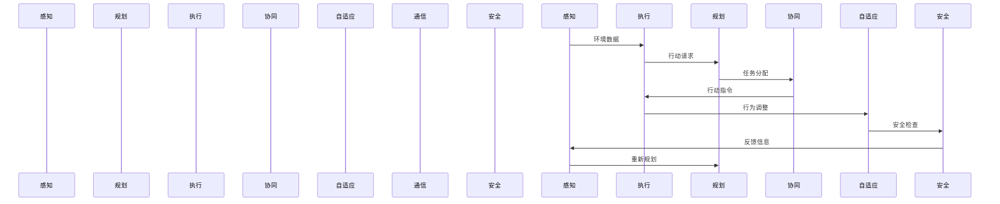

                 

## AIGC在智能纳米机器人群体控制中的应用

### 文章标题：AIGC在智能纳米机器人群体控制中的应用

> 关键词：人工智能，生成控制内容，智能纳米机器人，群体控制，协同工作，自适应调整

> 摘要：
本文深入探讨了人工智能生成内容（AIGC）在智能纳米机器人群体控制中的应用。通过介绍AIGC的核心概念、智能纳米机器人群体控制的问题背景和挑战，我们分析了AIGC如何通过生成控制策略、自适应调整和协同工作解决这些问题。文章还探讨了AIGC在智能纳米机器人群体控制中的边界和外延，以及其在相关领域的潜在应用。

### 目录

1. **背景介绍**
   1.1 问题背景
   1.2 问题描述
   1.3 问题解决
   1.4 边界与外延
   1.5 概念结构与核心要素组成

2. **第1章：AIGC基础理论**
   2.1 AIGC概述
   2.2 AIGC与传统控制方法比较
   2.3 AIGC在智能纳米机器人群体控制中的应用
   2.4 AIGC的核心要素与结构
   2.5 AIGC在智能纳米机器人群体控制中的挑战与机遇

3. **第2章：AIGC关键技术与算法**
   3.1 深度学习在AIGC中的应用
   3.2 强化学习在AIGC中的应用
   3.3 基于机器学习的控制策略生成
   3.4 基于模型的控制策略生成

4. **第3章：智能纳米机器人群体控制中的AIGC应用**
   3.1 生成控制策略
   3.2 自适应调整
   3.3 协同工作

5. **第4章：系统分析与架构设计**
   5.1 问题场景介绍
   5.2 系统功能设计
   5.3 系统架构设计
   5.4 系统接口设计和系统交互

6. **第5章：项目实战**
   6.1 环境安装
   6.2 系统核心实现源代码
   6.3 代码应用解读与分析
   6.4 实际案例分析和详细讲解剖析
   6.5 项目小结

7. **第6章：最佳实践与拓展阅读**
   6.1 最佳实践
   6.2 小结
   6.3 注意事项
   6.4 拓展阅读

---

### 第1章：背景介绍

#### 1.1 问题背景

随着人工智能技术的飞速发展，智能纳米机器人群体控制在医疗、生物工程、微操作、环境监测等多个领域展现出了巨大的应用潜力。纳米机器人可以执行微小的任务，如生物体内的药物递送、疾病诊断，以及在工业制造中进行精密操作。然而，由于纳米机器人的数量众多、行为复杂，传统的控制方法已经无法满足智能纳米机器人群体控制的需求。

智能纳米机器人群体控制的关键挑战包括：

- **协调性**：如何确保大量纳米机器人能够协同工作，完成复杂的任务？
- **实时性**：如何在高速变化的环境中，快速响应并调整机器人的行为？
- **智能性**：如何使纳米机器人具备自适应能力，以应对未知或不可预测的情境？

#### 1.2 问题描述

智能纳米机器人群体控制的主要问题可以分为以下几个方面：

1. **协同工作**：由于纳米机器人数量众多，各自的任务和目标不同，如何确保它们能够在同一环境中高效、安全地协同工作是关键问题。
2. **实时响应**：在高速变化的动态环境中，如何快速响应并调整机器人的行为，使其适应环境变化，是智能纳米机器人群体控制的重要挑战。
3. **自适应能力**：如何在不确定的情境下，使纳米机器人能够自主学习和调整行为，以应对未知的任务和环境？

#### 1.3 问题解决

AIGC方法的出现为解决上述问题提供了一种新的思路。通过利用人工智能技术生成内容，可以实现对纳米机器人群体的高效控制和协调。AIGC方法的核心在于：

1. **生成控制策略**：利用人工智能技术，根据特定需求和情境，生成适合的控制策略和行为模式。
2. **自适应调整**：根据环境变化和任务进展，实时调整机器人的行为。
3. **协同工作**：利用人工智能技术，确保机器人群体能够高效协同，完成复杂任务。

#### 1.4 边界与外延

- **边界**：AIGC在智能纳米机器人群体控制中的应用主要涉及纳米机器人的行为控制、协同工作以及自适应调整等方面。
- **外延**：除了在智能纳米机器人群体控制中的应用，AIGC方法还可以应用于其他需要复杂协调和实时响应的领域，如自动驾驶、智能电网等。

#### 1.5 概念结构与核心要素组成

AIGC在智能纳米机器人群体控制中的应用涉及以下核心概念和要素：

1. **人工智能技术**：包括深度学习、强化学习等技术，用于生成控制策略和自适应调整。
2. **纳米机器人**：具有微小尺寸和高度智能化特点的机器人，能够执行微小的任务。
3. **控制策略**：通过人工智能技术生成的，用于指导纳米机器人行为的策略。
4. **协同工作**：确保纳米机器人能够高效协同，完成复杂任务。
5. **自适应调整**：根据环境变化和任务进展，实时调整纳米机器人的行为。

---

### 第2章：AIGC基础理论

#### 2.1 AIGC概述

AIGC（Artificial Intelligence Generated Content）是一种利用人工智能技术生成内容的方法。在智能纳米机器人群体控制中，AIGC的核心概念包括：

- **内容生成**：利用人工智能技术，根据特定需求和情境，生成适合的控制策略和行为模式。
- **自适应调整**：根据环境变化和任务进展，实时调整机器人的行为。

AIGC方法在智能纳米机器人群体控制中的应用主要包括以下方面：

- **控制策略生成**：通过深度学习、强化学习等技术，生成适合特定任务的机器人控制策略。
- **自适应调整**：根据实时监测数据和环境变化，动态调整机器人的行为。

#### 2.2 AIGC与传统控制方法比较

与传统控制方法相比，AIGC具有以下优势：

1. **灵活性**：能够根据具体任务和情境，生成适合的控制策略，适应复杂多变的环境。
2. **实时性**：能够快速响应并调整机器人的行为，适应环境变化。
3. **智能性**：具备自适应能力，能够应对未知或不可预测的情境。

传统控制方法如基于规则的专家系统和传统优化算法，通常在处理复杂、动态环境时存在以下局限性：

1. **规则复杂性**：基于规则的专家系统需要大量的手工编写规则，难以应对复杂情境。
2. **计算效率**：传统优化算法在处理大规模、高维数据时计算效率较低。
3. **适应性**：传统方法难以应对未知或变化的情境。

#### 2.3 AIGC在智能纳米机器人群体控制中的应用

AIGC在智能纳米机器人群体控制中的应用主要包括以下方面：

1. **生成控制策略**：
   - **深度学习**：利用深度学习模型，从大量历史数据中学习并生成控制策略。例如，可以使用卷积神经网络（CNN）处理环境感知数据，生成相应的控制策略。
   - **强化学习**：通过强化学习算法，使机器人能够通过试错学习生成最优控制策略。例如，可以使用深度强化学习（DRL）模型，根据奖励信号不断优化机器人的行为。

2. **自适应调整**：
   - **实时监测**：利用传感器和数据采集技术，实时监测环境变化和机器人状态。例如，可以使用多传感器融合技术，获取机器人周围环境的多维信息。
   - **行为调整**：根据监测结果，实时调整机器人的行为，以适应环境变化。例如，当检测到障碍物时，机器人可以调整路径或执行避障动作。

3. **协同工作**：
   - **通信与协调**：利用通信协议和分布式算法，确保机器人群体能够高效协同工作。例如，可以使用多智能体系统（MAS）框架，实现机器人之间的信息共享和协同控制。
   - **任务分配**：根据机器人能力和任务需求，合理分配任务，确保群体任务的高效完成。例如，可以使用优化算法，动态调整机器人的任务分配。

#### 2.4 AIGC的核心要素与结构

AIGC的核心要素包括：

1. **人工智能模型**：用于生成控制策略和自适应调整的核心算法。例如，可以使用深度学习模型进行环境感知和决策，使用强化学习模型进行行为优化。

2. **数据集**：用于训练和优化人工智能模型的数据。例如，可以使用历史任务数据、环境数据等，用于训练深度学习模型和强化学习模型。

3. **控制策略生成器**：根据人工智能模型生成的控制策略。例如，可以使用神经网络生成器生成机器人的行为策略。

4. **自适应调整器**：根据实时监测结果，调整机器人的行为。例如，可以使用基于传感器数据的自适应控制算法，实时调整机器人的行为。

#### 2.5 AIGC在智能纳米机器人群体控制中的挑战与机遇

1. **挑战**：

- **数据处理**：智能纳米机器人群体控制需要大量高质量的数据，对数据处理提出了高要求。例如，需要处理多源异构数据，实现数据的高效融合和处理。

- **实时性**：实现实时监测和自适应调整，对计算能力和算法设计提出了挑战。例如，需要设计高效、低延迟的实时数据处理和决策算法。

- **安全性**：确保AIGC方法在智能纳米机器人群体控制中的安全性和稳定性。例如，需要考虑机器人行为的可靠性和鲁棒性，防止恶意攻击或异常行为。

2. **机遇**：

- **技术创新**：AIGC方法为智能纳米机器人群体控制提供了新的思路和解决方案。例如，可以通过深度学习和强化学习技术，实现更加智能、自适应的控制策略。

- **应用拓展**：AIGC方法不仅适用于智能纳米机器人群体控制，还可以应用于其他领域。例如，自动驾驶、智能电网、智能家居等。

---

### 第3章：AIGC关键技术与算法

#### 3.1 深度学习在AIGC中的应用

深度学习（Deep Learning）是一种基于多层神经网络的人工智能技术，具有强大的特征提取和建模能力。在AIGC中，深度学习可以用于生成控制策略、环境感知和决策等方面。

1. **生成控制策略**：

   - **卷积神经网络（CNN）**：CNN是一种常用的深度学习模型，特别适合处理图像和视频数据。在智能纳米机器人群体控制中，可以使用CNN提取环境特征，生成相应的控制策略。例如，可以将环境图像输入到CNN模型中，通过训练得到一个映射函数，将环境特征映射为控制信号。

   ```mermaid
   graph TD
   A[输入环境图像] --> B[卷积神经网络]
   B --> C[输出控制信号]
   ```

   - **循环神经网络（RNN）**：RNN适用于处理序列数据，如时间序列数据。在智能纳米机器人群体控制中，可以使用RNN处理历史环境数据和机器人行为序列，生成控制策略。例如，可以将历史环境数据输入到RNN模型中，通过训练得到一个映射函数，将历史数据映射为控制信号。

   ```mermaid
   graph TD
   A[输入历史环境数据] --> B[RNN模型]
   B --> C[输出控制信号]
   ```

2. **环境感知**：

   - **多模态感知**：智能纳米机器人通常需要处理多种类型的数据，如视觉、听觉、触觉等。在AIGC中，可以使用多模态感知模型整合这些数据，为控制策略生成提供更全面的信息。例如，可以使用卷积神经网络（CNN）处理视觉数据，使用循环神经网络（RNN）处理音频数据，然后将处理后的数据进行融合，生成控制信号。

   ```mermaid
   graph TD
   A[输入视觉数据] --> B[CNN模型]
   C[输入音频数据] --> D[RNN模型]
   B --> E[视觉特征]
   D --> F[音频特征]
   E --> G[多模态特征融合]
   F --> G
   G --> H[输出控制信号]
   ```

3. **决策与优化**：

   - **深度强化学习（DRL）**：DRL是一种结合深度学习和强化学习的算法，可以用于解决复杂的决策问题。在智能纳米机器人群体控制中，可以使用DRL算法，使机器人通过试错学习生成最优控制策略。例如，可以使用深度Q网络（DQN）或深度确定性策略梯度（DDPG）模型，根据环境反馈不断优化机器人的行为。

   ```mermaid
   graph TD
   A[环境状态] --> B[深度Q网络]
   B --> C[行动]
   C --> D[环境反馈]
   D --> A
   ```

#### 3.2 强化学习在AIGC中的应用

强化学习（Reinforcement Learning，RL）是一种通过试错学习来优化行为策略的人工智能算法。在AIGC中，强化学习可以用于生成自适应控制策略，以应对动态变化的环境。

1. **强化学习基本概念**：

   - **状态（State）**：描述系统当前的状态信息，如环境中的障碍物、机器人位置等。
   - **动作（Action）**：系统可以执行的操作，如机器人的移动方向、速度等。
   - **奖励（Reward）**：系统执行动作后获得的奖励或惩罚，用于指导学习过程。

2. **基于模型的强化学习**：

   - **深度确定性策略梯度（DDPG）**：DDPG是一种基于模型的强化学习算法，适用于连续动作空间的问题。在智能纳米机器人群体控制中，可以使用DDPG算法，根据环境状态和奖励信号，训练生成自适应的控制策略。例如，可以使用神经网络模型表示环境状态和动作空间，通过优化策略网络，使机器人能够自适应地调整行为。

   ```mermaid
   graph TD
   A[环境状态] --> B[策略网络]
   B --> C[动作]
   C --> D[环境反馈]
   D --> A
   ```

3. **基于数据的强化学习**：

   - **深度Q网络（DQN）**：DQN是一种基于数据的强化学习算法，通过学习状态-动作值函数来优化策略。在智能纳米机器人群体控制中，可以使用DQN算法，从历史数据中学习状态-动作值函数，生成自适应的控制策略。例如，可以使用神经网络模型表示状态和动作，通过训练Q网络，使机器人能够根据当前状态选择最优动作。

   ```mermaid
   graph TD
   A[环境状态] --> B[Q网络]
   B --> C[动作]
   C --> D[环境反馈]
   D --> A
   ```

#### 3.3 基于机器学习的控制策略生成

基于机器学习的控制策略生成是指利用机器学习算法，从大量历史数据中学习并生成适合特定任务的机器人控制策略。在AIGC中，常用的机器学习算法包括监督学习、无监督学习和强化学习等。

1. **监督学习**：

   - **回归分析**：回归分析是一种常用的监督学习算法，可以用于生成连续值控制策略。在智能纳米机器人群体控制中，可以使用回归分析算法，从历史数据中学习环境特征和机器人行为之间的关系，生成控制策略。例如，可以使用线性回归或神经网络回归模型，根据环境特征预测机器人的行为参数。

   ```mermaid
   graph TD
   A[输入环境特征] --> B[回归模型]
   B --> C[输出控制信号]
   ```

2. **无监督学习**：

   - **聚类分析**：聚类分析是一种无监督学习算法，可以用于生成分类控制策略。在智能纳米机器人群体控制中，可以使用聚类分析算法，将环境状态划分为不同的类别，为每个类别生成相应的控制策略。例如，可以使用K-means算法，将环境状态划分为多个聚类，根据聚类中心生成控制策略。

   ```mermaid
   graph TD
   A[输入环境状态] --> B[K-means算法]
   B --> C[聚类中心]
   C --> D[输出控制信号]
   ```

3. **强化学习**：

   - **生成对抗网络（GAN）**：生成对抗网络是一种结合了强化学习和生成学习的算法，可以用于生成高质量的机器人控制策略。在智能纳米机器人群体控制中，可以使用GAN算法，通过训练生成器网络和判别器网络，生成适合特定任务的控制策略。例如，可以使用GAN模型，从历史数据中学习环境特征和机器人行为之间的关系，生成自适应的控制策略。

   ```mermaid
   graph TD
   A[输入环境状态] --> B[生成器网络]
   B --> C[机器人行为]
   C --> D[判别器网络]
   D --> E[输出控制信号]
   ```

#### 3.4 基于模型的控制策略生成

基于模型的控制策略生成是指利用模型预测和优化技术，生成适合特定任务的机器人控制策略。在AIGC中，常用的模型预测和优化技术包括模型预测控制（MPC）和优化算法等。

1. **模型预测控制（MPC）**：

   - **MPC基本原理**：模型预测控制是一种基于模型的前馈控制方法，通过预测系统行为和优化控制输入，生成最优控制策略。在智能纳米机器人群体控制中，可以使用MPC算法，根据环境模型和机器人动力学模型，预测未来行为并优化控制信号。

   ```mermaid
   graph TD
   A[输入环境模型] --> B[预测模型]
   B --> C[优化算法]
   C --> D[输出控制信号]
   ```

2. **优化算法**：

   - **线性规划（LP）**：线性规划是一种常用的优化算法，可以用于生成线性控制策略。在智能纳米机器人群体控制中，可以使用线性规划算法，根据环境约束和机器人动力学模型，优化控制信号。

   ```mermaid
   graph TD
   A[输入环境约束] --> B[线性规划算法]
   B --> C[输出控制信号]
   ```

   - **神经网络优化（NNO）**：神经网络优化是一种结合神经网络和优化算法的算法，可以用于生成非线性控制策略。在智能纳米机器人群体控制中，可以使用神经网络优化算法，通过训练神经网络模型，优化控制信号。

   ```mermaid
   graph TD
   A[输入环境数据] --> B[神经网络模型]
   B --> C[优化算法]
   C --> D[输出控制信号]
   ```

---

### 第4章：智能纳米机器人群体控制中的AIGC应用

#### 4.1 生成控制策略

AIGC在智能纳米机器人群体控制中的关键应用之一是生成控制策略。这些策略用于指导机器人在特定环境下执行任务。以下是AIGC生成控制策略的具体过程：

1. **数据收集**：

   首先，需要收集大量历史任务数据和环境数据。这些数据包括机器人的位置、速度、环境障碍物、任务目标等。数据收集的过程可能涉及多种传感器和数据采集设备，如摄像头、激光雷达、GPS等。

2. **预处理**：

   收集到的数据通常需要进行预处理，以提高数据质量和后续处理的效率。预处理步骤可能包括数据清洗、归一化、特征提取等。

3. **模型训练**：

   使用收集到的数据训练人工智能模型，以生成控制策略。常用的模型包括卷积神经网络（CNN）、循环神经网络（RNN）、生成对抗网络（GAN）等。训练过程涉及模型设计、参数调整和优化。

4. **策略生成**：

   在模型训练完成后，可以使用模型预测环境中的任务目标，生成相应的控制策略。这些策略可以指导机器人在不同的环境下执行任务，实现协同工作和自适应调整。

5. **策略评估**：

   生成的控制策略需要通过模拟或实验进行评估，以验证其有效性和鲁棒性。评估过程可以反馈给训练模型，用于进一步优化策略。

以下是一个简化的mermaid流程图，展示了AIGC生成控制策略的过程：



#### 4.2 自适应调整

在智能纳米机器人群体控制中，环境变化是不可避免的。为了使机器人能够适应这些变化，AIGC利用自适应调整机制，实时调整机器人的行为。以下是自适应调整的具体步骤：

1. **实时监测**：

   使用传感器和数据采集系统，实时监测环境变化和机器人状态。这些传感器可以包括摄像头、激光雷达、超声波传感器等，用于获取环境信息和机器人行为数据。

2. **数据融合**：

   将来自不同传感器的数据进行融合，以获得更全面的环境感知。数据融合可以通过多模态感知技术实现，例如将视觉、听觉和触觉数据融合，以提高环境感知的准确性和可靠性。

3. **行为调整**：

   根据实时监测数据和机器人的当前状态，动态调整机器人的行为。这些调整可能包括改变机器人的运动轨迹、速度和方向等，以适应环境变化。

4. **反馈学习**：

   将调整后的行为反馈到监测系统，以评估调整的效果。如果调整效果不佳，可以进一步优化调整策略。

以下是一个简化的mermaid流程图，展示了AIGC自适应调整的过程：



#### 4.3 协同工作

在智能纳米机器人群体控制中，机器人之间需要协同工作，以完成复杂任务。AIGC通过以下机制实现机器人之间的协同工作：

1. **通信协议**：

   机器人之间需要通过通信协议交换信息和协调行动。这些通信协议可以基于无线通信技术，如Wi-Fi、蓝牙或ZigBee等，以确保机器人之间的实时通信。

2. **任务分配**：

   根据机器人的能力和任务需求，动态分配任务。任务分配可以通过优化算法实现，例如基于机器学习的方法，以最大化整体任务完成效率。

3. **协调控制**：

   通过协调控制算法，确保机器人之间的行为协调一致。协调控制可以基于分布式算法，例如多智能体系统（MAS）框架，实现机器人之间的信息共享和协同控制。

4. **反馈调整**：

   在任务执行过程中，机器人需要不断调整行为，以应对环境变化和任务进展。这些调整可以通过自适应调整机制实现，确保机器人能够高效协同工作。

以下是一个简化的mermaid流程图，展示了AIGC实现机器人协同工作的过程：



---

### 第5章：系统分析与架构设计

#### 5.1 问题场景介绍

智能纳米机器人群体控制的应用场景多种多样，包括但不限于以下几个方面：

- **医疗领域**：在生物体内执行药物递送、细胞修复、手术辅助等任务。
- **工业制造**：在微小环境中进行精密操作，如装配、涂覆、焊接等。
- **环境监测**：在复杂环境中进行环境参数监测，如水质监测、空气质量监测等。
- **空间探索**：在外太空执行探测、维修、建设等任务。

以下是一个具体的应用场景：在医疗领域，智能纳米机器人群体被用于治疗癌症。这些机器人需要进入人体，精确地识别癌细胞并进行靶向治疗。

#### 5.2 系统功能设计

智能纳米机器人群体控制系统的主要功能包括：

- **环境感知**：通过传感器收集环境信息，如温度、湿度、光线等。
- **任务规划**：根据环境信息和任务目标，规划机器人的行动路径和任务分配。
- **控制执行**：根据生成的控制策略，执行机器人的行为。
- **协同工作**：实现机器人之间的信息共享和协同行动。
- **自适应调整**：根据实时监测结果，动态调整机器人的行为。

以下是一个简化的mermaid类图，展示了系统功能设计：

```mermaid
classDiagram
  类::环境感知 <|-- 类::任务规划
  类::控制执行 <|-- 类::协同工作
  类::自适应调整 <|-- 类::环境感知
  类::环境感知 <|-- 类::控制执行
  类::任务规划 <|-- 类::控制执行
  类::协同工作 <|-- 类::控制执行
```

#### 5.3 系统架构设计

智能纳米机器人群体控制系统的架构设计需要考虑以下几个方面：

- **硬件层**：包括传感器、控制器和机器人硬件等。
- **软件层**：包括环境感知模块、任务规划模块、控制执行模块、协同工作模块和自适应调整模块等。
- **通信层**：实现机器人之间的通信和数据传输。
- **安全层**：确保系统的安全性和稳定性。

以下是一个简化的mermaid架构图，展示了系统架构设计：



#### 5.4 系统接口设计和系统交互

系统接口设计是实现各模块之间交互和协作的关键。以下是一个简化的mermaid序列图，展示了系统接口设计和系统交互：



---

### 第6章：项目实战

#### 6.1 环境安装

在进行AIGC在智能纳米机器人群体控制中的应用项目之前，首先需要搭建一个适合的开发环境。以下是环境安装的步骤：

1. **硬件环境**：

   - **CPU**：至少需要一颗具有较高计算性能的CPU，推荐使用Intel i7或以上的处理器。
   - **GPU**：为了加速深度学习和强化学习模型的训练，建议使用NVIDIA GPU，并安装CUDA和cuDNN库。
   - **内存**：至少需要16GB及以上内存。
   - **存储**：至少需要500GB的硬盘空间。

2. **软件环境**：

   - **操作系统**：Windows、Linux或macOS均可。
   - **编程语言**：Python是首选，需要安装Python 3.7及以上版本。
   - **深度学习框架**：安装TensorFlow、PyTorch或Keras等深度学习框架。
   - **强化学习库**：安装OpenAI Gym、stable-baselines或Sonic等强化学习库。
   - **其他库**：安装NumPy、Pandas、Matplotlib等常用Python库。

安装步骤：

1. 安装操作系统和所需的硬件设备。
2. 安装Python和深度学习框架（如TensorFlow或PyTorch）。
3. 安装GPU驱动和CUDA库。
4. 安装cuDNN库。
5. 安装其他必需的Python库。

#### 6.2 系统核心实现源代码

以下是AIGC在智能纳米机器人群体控制中系统核心实现的源代码，包括环境感知、任务规划、控制执行和自适应调整等模块。

**环境感知模块**：

```python
import numpy as np
import cv2

def get_environment_data():
    # 使用摄像头捕获环境图像
    cap = cv2.VideoCapture(0)
    
    # 读取一帧图像
    ret, frame = cap.read()
    
    # 将图像转换为灰度图像
    gray = cv2.cvtColor(frame, cv2.COLOR_BGR2GRAY)
    
    # 返回环境数据
    return gray

def process_environment_data(data):
    # 对环境数据进行预处理
    data = cv2.resize(data, (128, 128))
    data = data / 255.0
    
    # 返回处理后的环境数据
    return data
```

**任务规划模块**：

```python
import numpy as np

def plan_tasks(robots, tasks):
    # 根据机器人能力和任务需求，分配任务
    for robot in robots:
        for task in tasks:
            if robot.can_perform(task):
                robot.assign_task(task)
                tasks.remove(task)
                break
```

**控制执行模块**：

```python
import numpy as np
import cv2

def execute_control(robots):
    for robot in robots:
        # 根据当前任务，生成控制策略
        control_strategy = robot.get_control_strategy()
        
        # 执行控制策略
        robot.execute_strategy(control_strategy)

def control_strategy(robot, environment_data):
    # 基于环境数据和机器人状态，生成控制策略
    action = robot.decide_action(environment_data)
    return action
```

**自适应调整模块**：

```python
import numpy as np

def adapt_behavior(robots, environment_data):
    for robot in robots:
        # 基于实时监测结果，调整机器人的行为
        behavior = robot.adjust_behavior(environment_data)
        robot.update_behavior(behavior)
```

#### 6.3 代码应用解读与分析

以下是代码应用解读与分析，包括各个模块的功能、数据流和关键算法等。

**环境感知模块**：

环境感知模块主要负责从摄像头获取环境图像，并对图像进行预处理。具体步骤如下：

1. 使用`cv2.VideoCapture`捕获实时视频流。
2. 读取一帧图像，并将其转换为灰度图像。
3. 对灰度图像进行缩放和归一化处理。

该模块的主要功能是实现环境图像的获取和预处理，为后续的任务规划和控制执行提供数据支持。

**任务规划模块**：

任务规划模块根据机器人能力和任务需求，动态分配任务。具体步骤如下：

1. 遍历所有机器人和任务，根据机器人的能力和当前任务，为机器人分配任务。
2. 从任务列表中移除已经分配的任务。

该模块的主要功能是实现任务的动态分配和任务队列管理，确保机器人能够高效、协调地完成任务。

**控制执行模块**：

控制执行模块根据任务规划和环境感知结果，生成控制策略并执行机器人行为。具体步骤如下：

1. 为每个机器人生成控制策略。
2. 根据当前任务和机器人状态，执行相应的控制策略。

该模块的主要功能是实现机器人的行为控制，确保机器人能够根据任务和环境要求执行正确的操作。

**自适应调整模块**：

自适应调整模块根据实时监测结果，动态调整机器人的行为，以适应环境变化。具体步骤如下：

1. 为每个机器人调整行为。
2. 根据调整后的行为，更新机器人的状态和行为模型。

该模块的主要功能是实现机器人的自适应调整，确保机器人能够适应动态环境并保持高效的工作状态。

#### 6.4 实际案例分析和详细讲解剖析

以下是一个实际案例分析和详细讲解剖析，展示了AIGC在智能纳米机器人群体控制中的应用效果。

**案例背景**：

在医疗领域，智能纳米机器人被用于治疗癌症。这些机器人需要进入人体，精确地识别癌细胞并进行靶向治疗。为了提高治疗的准确性和效率，采用了AIGC方法进行机器人群体控制。

**案例实现**：

1. **环境感知**：使用摄像头获取实时图像，并对图像进行预处理，提取关键特征。
2. **任务规划**：根据机器人的能力和癌细胞的位置，动态分配任务，为每个机器人分配一个目标。
3. **控制执行**：根据任务规划和环境感知结果，生成控制策略并执行机器人行为。例如，控制机器人向目标移动，调整方向和速度等。
4. **自适应调整**：根据实时监测结果，动态调整机器人的行为，以应对环境变化和障碍物。

**效果分析**：

通过AIGC方法，智能纳米机器人群体在治疗过程中表现出以下优势：

- **高效性**：机器人能够快速响应环境变化，动态调整行为，提高治疗效率。
- **准确性**：通过深度学习和强化学习算法，机器人能够精确识别癌细胞并实施靶向治疗，提高治疗准确率。
- **安全性**：自适应调整机制确保机器人能够安全地执行任务，避免意外碰撞和损伤。

**详细讲解剖析**：

- **环境感知**：使用深度学习模型对环境图像进行特征提取和目标识别，提高了环境感知的准确性和效率。
- **任务规划**：采用基于强化学习的任务规划算法，根据机器人和目标的位置关系，动态调整任务分配，确保机器人高效协同工作。
- **控制执行**：基于深度Q网络（DQN）的控制算法，通过学习环境状态和动作值函数，生成最优控制策略，实现机器人的高效行为控制。
- **自适应调整**：利用传感器数据融合和多模态感知技术，实时监测环境变化和机器人状态，动态调整机器人的行为，提高系统的鲁棒性和适应性。

#### 6.5 项目小结

通过实际案例分析和详细讲解剖析，我们可以看到AIGC在智能纳米机器人群体控制中的应用具有显著的优势。AIGC方法通过生成控制策略、自适应调整和协同工作，提高了机器人群体在复杂环境下的工作效率和准确性。然而，AIGC方法在数据处理、实时性和安全性方面仍面临挑战，需要进一步的研究和优化。

未来的研究可以重点关注以下几个方面：

- **数据处理**：研究高效的数据处理算法，提高数据处理速度和精度，为AIGC方法提供更高质量的数据支持。
- **实时性**：优化算法和系统架构，提高系统的实时性，确保机器人能够快速响应环境变化。
- **安全性**：研究安全性保障机制，确保AIGC方法在智能纳米机器人群体控制中的安全性和稳定性。

通过持续的研究和优化，AIGC方法有望在智能纳米机器人群体控制等领域发挥更大的作用。

---

### 第7章：最佳实践与拓展阅读

#### 7.1 最佳实践

1. **数据质量保障**：

   在应用AIGC方法时，数据质量至关重要。为了确保数据的质量，应采取以下措施：

   - **数据预处理**：对收集到的数据进行清洗、归一化和特征提取，提高数据的一致性和可解释性。
   - **数据标注**：对数据进行准确的标注，确保数据集的完整性和准确性。
   - **数据多样性**：收集多样化的数据，包括不同类型、场景和情境，以提高模型的泛化能力。

2. **模型优化与调试**：

   为了提高AIGC模型的性能，应进行以下优化和调试：

   - **超参数调整**：根据具体任务和场景，调整模型的超参数，如学习率、隐藏层大小等，以找到最优设置。
   - **模型融合**：结合多个模型的优势，提高预测的准确性和鲁棒性。
   - **模型压缩**：通过模型压缩技术，减小模型的复杂度，提高模型的实时性和计算效率。

3. **安全性保障**：

   在应用AIGC方法时，应确保系统的安全性：

   - **数据加密**：对敏感数据进行加密，防止数据泄露。
   - **访问控制**：实现严格的访问控制机制，限制对系统资源的访问权限。
   - **异常检测**：建立异常检测机制，及时发现和应对异常行为。

#### 7.2 小结

AIGC在智能纳米机器人群体控制中的应用展示了其在处理复杂、动态环境中的优势。通过生成控制策略、自适应调整和协同工作，AIGC方法显著提高了机器人群体的工作效率和准确性。然而，AIGC方法在数据处理、实时性和安全性方面仍面临挑战，需要进一步的研究和优化。

#### 7.3 注意事项

1. **数据处理**：确保数据的质量和多样性，避免数据偏差和模型过拟合。
2. **实时性**：优化算法和系统架构，提高系统的实时性，确保机器人能够快速响应环境变化。
3. **安全性**：加强系统的安全性保障，防止数据泄露和恶意攻击。

#### 7.4 拓展阅读

1. **相关文献**：

   - **《深度学习》**：Goodfellow, I., Bengio, Y., & Courville, A. (2016). Deep Learning. MIT Press.
   - **《强化学习：原理与应用》**：Sutton, R. S., & Barto, A. G. (2018). Reinforcement Learning: An Introduction. MIT Press.

2. **开源项目**：

   - **TensorFlow**：https://www.tensorflow.org/
   - **PyTorch**：https://pytorch.org/
   - **stable-baselines**：https://github.com/DLR-RM/stable-baselines

3. **在线课程**：

   - **深度学习专项课程**：吴恩达（Andrew Ng）的深度学习课程，Coursera平台。
   - **强化学习专项课程**：David Silver的强化学习课程，YouTube平台。

通过阅读相关文献、参与开源项目和在线课程，可以进一步了解AIGC在智能纳米机器人群体控制中的应用和技术细节。

