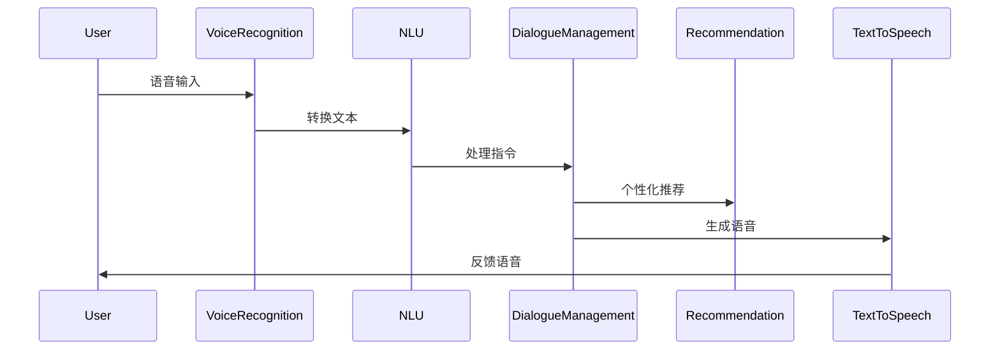

                 


### 1.1 问题背景与现状

#### 1.1.1 智能语音助手的发展历程

智能语音助手作为人工智能领域的代表性应用，近年来取得了显著的发展。智能语音助手的起源可以追溯到20世纪50年代，当时的计算机科学家开始探索如何让计算机通过自然语言进行交流。这一时期的代表性成果包括ELIZA，它是由乔安娜·肖尔（Joanna Charny）和约瑟夫·韦斯纳（Joseph Weizenbaum）在1966年开发的，是世界上第一个会使用自然语言的聊天机器人。

进入20世纪80年代，语音识别技术开始取得突破性进展。华盛顿大学的丹尼尔·贝尔（Daniel Bel）和詹姆斯·里德（James Reed）提出了隐马尔可夫模型（HMM），这一模型极大地提高了语音识别的准确性。与此同时，机器学习技术的兴起为语音识别带来了新的可能。1988年，IBM的沃森（Watson）在电视节目《危险边缘》中战胜了人类选手，这一事件标志着人工智能在自然语言处理领域取得了重要突破。

随着计算能力的提升和海量数据的积累，语音识别技术逐渐成熟。苹果公司在2007年推出的Siri成为第一个商用智能语音助手，它利用自然语言处理和机器学习技术，为用户提供语音交互服务。随后，谷歌、亚马逊和微软等科技巨头纷纷推出了自己的智能语音助手，如谷歌助手（Google Assistant）、亚马逊的Alexa和微软的Cortana。这些智能语音助手不仅在个人设备上广泛应用，还在智能家居、汽车、电话和医疗等领域得到部署。

#### 1.1.2 个性化需求与AIGC的潜力

智能语音助手的发展不仅在于技术的进步，还在于用户需求的不断进化。用户对于智能语音助手的期望不仅仅是能够完成基本的语音指令，更希望它们能够理解自己的个性化需求，提供个性化的服务和建议。这种个性化需求主要体现在以下几个方面：

1. **语言理解**：用户希望智能语音助手能够理解自己的语音指令，并准确执行。这要求智能语音助手在语言理解方面具有高度的能力。

2. **交互体验**：用户希望智能语音助手能够与自身建立良好的交互体验，包括语音的自然性、反应速度和互动方式。

3. **个性化服务**：用户希望智能语音助手能够根据个人的喜好、习惯和历史记录，提供个性化的服务和推荐。

4. **隐私保护**：用户关注智能语音助手在处理个人信息时的隐私保护问题，希望数据安全有保障。

AIGC（自适应智能生成计算）作为一种新兴的计算范式，具备在智能语音助手个性化应用中的巨大潜力。AIGC的核心在于通过深度学习和生成模型，实现对大量数据的自适应分析和生成，从而提供高度个性化的内容和服务。以下是一些AIGC在智能语音助手个性化中的应用场景：

1. **个性化语音合成**：AIGC可以根据用户的语音特点和喜好，生成个性化的语音响应，提高用户的交互体验。

2. **个性化对话管理**：AIGC可以分析用户的历史交互记录，了解用户的偏好和需求，提供更加个性化的对话管理。

3. **个性化内容推荐**：AIGC可以分析用户的行为和兴趣数据，为用户推荐个性化的内容和服务。

4. **个性化语音助手训练**：AIGC可以用于智能语音助手的自我学习和优化，提高智能语音助手的性能和用户体验。

#### 1.1.3 AIGC在智能语音助手中的应用前景

随着AIGC技术的发展，其在智能语音助手中的应用前景十分广阔。首先，AIGC可以提高智能语音助手的语言理解和生成能力，使得智能语音助手能够更加自然地与用户进行交互。其次，AIGC可以大幅提升智能语音助手的个性化服务能力，通过深度学习和生成模型，智能语音助手可以更加准确地捕捉和理解用户的个性化需求，提供个性化的服务和建议。

此外，AIGC还可以用于智能语音助手的隐私保护。通过数据加密和隐私保护算法，AIGC可以确保用户数据的安全和隐私。在未来，随着AIGC技术的不断成熟和应用场景的拓展，智能语音助手将变得更加智能、个性化和可靠，成为人们生活中不可或缺的智能伙伴。

总之，AIGC在智能语音助手中的应用不仅能够满足用户的个性化需求，还能够推动智能语音助手技术的不断创新和发展，为用户提供更加优质的服务和体验。

### 1.2 书籍概述

#### 1.2.1 书籍结构

本书旨在深入探讨AIGC在智能语音助手个性化中的应用，内容结构分为三个主要部分。第一部分介绍AIGC与智能语音助手的基本概念、发展历程和个性化需求。第二部分详细讲解AIGC的核心技术和应用，包括生成对抗网络、变分自编码器、强化学习等。第三部分通过具体案例和项目实战，展示AIGC在智能语音助手个性化中的应用效果和实现方法。

#### 1.2.2 阅读对象与目标

本书主要面向对人工智能、自然语言处理和智能语音助手感兴趣的技术人员、研究人员和学生。通过阅读本书，读者可以：

- 了解AIGC的基本原理和核心技术。
- 掌握智能语音助手的个性化需求和实现方法。
- 学习AIGC在智能语音助手中的应用案例和实战经验。

#### 1.2.3 内容组织与逻辑

本书的内容组织遵循从基础到应用的逻辑顺序，首先介绍AIGC和智能语音助手的基本概念，然后深入探讨AIGC的核心技术和应用，最后通过具体案例和项目实战，展示AIGC在智能语音助手个性化中的应用效果。每个章节的内容设计都旨在使读者逐步掌握相关知识点，并通过实践应用来巩固所学内容。

### 1.3 AIGC基础知识

#### 1.3.1 AIGC概念介绍

AIGC（自适应智能生成计算）是一种基于深度学习和生成模型的计算范式，旨在通过自适应分析和生成，实现高度个性化的内容和服务。AIGC的核心在于“自适应”和“生成”，它利用深度学习模型从海量数据中学习规律，并生成新的内容，以满足用户的个性化需求。

AIGC的应用范围非常广泛，包括但不限于语音合成、文本生成、图像生成、视频生成等。在智能语音助手领域，AIGC可以用于生成个性化的语音响应，提供个性化的对话管理，以及实现个性化内容推荐等功能。

#### 1.3.2 AIGC与传统AI的区别

传统AI（Artificial Intelligence，人工智能）主要侧重于实现计算机模拟人类智能的功能，包括感知、学习、推理和决策等。传统AI的核心是符号主义和统计学习，如决策树、支持向量机、神经网络等。而AIGC则更加注重生成和创造力，它利用生成模型，如生成对抗网络（GAN）、变分自编码器（VAE）等，从数据中学习并生成新的内容。

与传统的AI相比，AIGC具有以下显著区别：

1. **生成能力**：传统AI更侧重于识别和分类，而AIGC则强调生成和创造力。
2. **自适应分析**：AIGC能够从海量数据中自适应地学习，并不断优化生成模型，以实现个性化服务。
3. **多样化应用**：AIGC不仅适用于文本和图像，还可以应用于语音、视频等多媒体领域。

#### 1.3.3 AIGC的核心技术

AIGC的核心技术包括生成对抗网络（GAN）、变分自编码器（VAE）、强化学习等。这些技术各具特色，共同构成了AIGC的强大能力。

1. **生成对抗网络（GAN）**：
   GAN是一种由生成器和判别器组成的对抗性网络。生成器旨在生成与真实数据相似的数据，而判别器则试图区分真实数据和生成数据。通过不断的对抗训练，生成器逐渐提高生成数据的质量。GAN在图像生成、语音合成等领域具有显著的应用价值。

2. **变分自编码器（VAE）**：
   VAE是一种基于概率模型的生成模型，它通过编码器和解码器将输入数据编码为潜在空间中的表示，再从潜在空间中生成新的数据。VAE在文本生成、图像去噪等领域表现出色。

3. **强化学习**：
   强化学习是一种通过试错和反馈机制来学习最优策略的机器学习方法。AIGC中的强化学习可以用于优化生成模型，使其更好地满足个性化需求。例如，在语音合成中，强化学习可以用于调整语音参数，以生成更加自然的语音。

#### 1.3.4 AIGC在智能语音助手中的应用

AIGC在智能语音助手中的应用主要包括以下几个方面：

1. **个性化语音合成**：
   AIGC可以根据用户的语音特点和喜好，生成个性化的语音响应。例如，通过GAN生成具有特定音色的语音，或者通过VAE生成具有特定情感色彩的语音。

2. **个性化对话管理**：
   AIGC可以分析用户的历史交互记录，了解用户的偏好和需求，提供更加个性化的对话管理。例如，根据用户的喜好推荐新闻、音乐或电影。

3. **个性化内容推荐**：
   AIGC可以分析用户的行为和兴趣数据，为用户推荐个性化的内容和服务。例如，根据用户的购物历史和搜索记录推荐商品。

4. **个性化语音助手训练**：
   AIGC可以用于智能语音助手的自我学习和优化，提高智能语音助手的性能和用户体验。例如，通过强化学习调整语音参数，以生成更加自然的语音。

总之，AIGC为智能语音助手带来了强大的个性化能力，使得智能语音助手能够更好地满足用户的个性化需求，提供更加优质的服务和体验。

### 1.4 智能语音助手个性化需求

#### 1.4.1 用户需求分析

智能语音助手作为人工智能的代表性应用，其核心价值在于为用户提供便捷、高效和个性化的服务。用户对智能语音助手的个性化需求主要体现在以下几个方面：

1. **自然语言理解**：用户希望智能语音助手能够准确理解自己的语音指令，无需反复修正。这要求智能语音助手在自然语言处理方面具有高度的准确性。

2. **个性化交互体验**：用户希望智能语音助手能够与自身建立良好的交互体验，包括语音的自然性、反应速度和互动方式。这要求智能语音助手能够根据用户的喜好和行为习惯进行个性化调整。

3. **个性化服务内容**：用户希望智能语音助手能够根据个人的喜好、习惯和历史记录，提供个性化的服务和推荐。例如，根据用户的音乐偏好推荐歌曲，或者根据用户的购物记录推荐商品。

4. **隐私保护**：用户关注智能语音助手在处理个人信息时的隐私保护问题，希望数据安全有保障。这要求智能语音助手在设计和实现过程中充分考虑隐私保护，确保用户数据的安全和隐私。

#### 1.4.2 个性化服务策略

为了满足用户的个性化需求，智能语音助手可以采取以下策略：

1. **用户画像构建**：通过收集和分析用户的历史交互数据、行为数据和个人信息，构建用户的个性化画像。这些画像将用于后续的个性化服务推荐。

2. **个性化对话管理**：智能语音助手可以根据用户的个性化画像，调整对话策略，提供更加个性化的交互体验。例如，根据用户的偏好推荐新闻、音乐或电影，或者使用特定的语调和语气与用户交流。

3. **个性化内容生成**：利用AIGC技术，智能语音助手可以生成个性化的语音响应、文本内容和图像等。例如，通过GAN生成具有特定音色的语音，或者通过VAE生成具有特定情感色彩的文本。

4. **个性化推荐系统**：智能语音助手可以分析用户的行为数据，为用户推荐个性化的内容和服务。例如，根据用户的购物历史和搜索记录推荐商品，或者根据用户的阅读偏好推荐文章。

5. **隐私保护策略**：智能语音助手在设计和实现过程中，应采取多种隐私保护措施，包括数据加密、匿名化处理和隐私政策等，确保用户数据的安全和隐私。

#### 1.4.3 个性化技术挑战

尽管智能语音助手在个性化服务方面具有巨大潜力，但在实际应用中仍面临以下技术挑战：

1. **数据质量和多样性**：构建用户个性化画像需要大量的高质量数据。然而，数据质量和多样性直接影响个性化服务的准确性。如何有效地收集、清洗和利用数据，是一个重要的技术问题。

2. **模型复杂度和计算资源**：AIGC技术涉及复杂的深度学习模型，如GAN、VAE等。这些模型在训练和推理过程中需要大量的计算资源。如何高效地训练和部署这些模型，是一个技术挑战。

3. **交互体验优化**：智能语音助手需要提供自然、流畅的交互体验。然而，个性化交互体验的优化涉及到语音合成、文本生成、语音识别等多个技术环节，需要综合考虑多种因素。

4. **隐私保护与数据安全**：智能语音助手在处理用户数据时，需要确保数据的安全和隐私。如何在满足个性化需求的同时，保障用户数据的隐私和安全，是一个重要的问题。

5. **持续学习和适应**：智能语音助手需要能够持续学习和适应用户的需求。如何设计有效的学习和适应机制，以保持智能语音助手的性能和用户体验，是一个长期的技术挑战。

总之，智能语音助手的个性化需求为AIGC技术提供了广阔的应用场景，同时也带来了新的技术挑战。通过不断探索和创新，有望在智能语音助手个性化方面取得更大的突破。

### 1.5 本章小结

本章首先介绍了智能语音助手的发展历程和个性化需求，探讨了AIGC（自适应智能生成计算）在智能语音助手个性化中的应用潜力。通过分析AIGC的核心技术，如生成对抗网络、变分自编码器和强化学习，我们了解了AIGC如何通过自适应分析和生成，满足用户的个性化需求。

接着，我们详细探讨了智能语音助手个性化需求的背景和具体内容，包括自然语言理解、个性化交互体验、个性化服务内容和隐私保护。同时，我们提出了满足这些需求的个性化服务策略，并分析了AIGC在智能语音助手个性化应用中的挑战。

通过本章的学习，读者可以全面了解智能语音助手和AIGC的基本概念、发展历程和应用前景，为后续章节的学习打下坚实基础。接下来，我们将深入探讨AIGC的核心技术和算法原理，进一步揭示AIGC在智能语音助手个性化应用中的强大潜力。

## 2.1 AIGC算法原理

### 2.1.1 生成对抗网络（GAN）

生成对抗网络（GAN）是AIGC中最为核心的技术之一。GAN由生成器（Generator）和判别器（Discriminator）两个主要部分组成，它们在对抗训练过程中相互竞争，共同提升模型的性能。

**原理**：
- **生成器**：生成器的目标是生成逼真的数据，使其难以被判别器区分。生成器从噪声分布中采样输入数据，通过一系列神经网络变换，生成伪造的数据。
- **判别器**：判别器的目标是区分真实数据和伪造数据。判别器接收来自生成器的伪造数据和来自真实数据集的真实数据，并输出一个概率值，表示数据是真实的概率。

在训练过程中，生成器和判别器交替更新权重：
1. **生成器**：生成器试图生成更逼真的数据，提高判别器对其伪造数据的判断能力。
2. **判别器**：判别器试图提高对真实数据和伪造数据的区分能力，使伪造数据的判断概率降低。

**优点**：
- GAN能够生成高质量、多样化的数据，特别是在图像、语音和文本生成方面具有显著优势。
- GAN不需要真实标注数据，通过对抗训练，可以从无监督数据中学习。

**应用**：
- **图像生成**：GAN可以生成逼真的图像，广泛应用于艺术创作、游戏设计和虚拟现实等领域。
- **语音合成**：GAN可以生成具有特定音色的语音，用于个性化语音助手和语音合成应用。
- **文本生成**：GAN可以生成高质量、结构化的文本，应用于新闻写作、创意写作和机器翻译等领域。

### 2.1.2 变分自编码器（VAE）

变分自编码器（VAE）是一种基于概率模型的生成模型，其核心思想是将输入数据映射到一个潜在空间，并在该空间中生成新的数据。

**原理**：
- **编码器**：编码器将输入数据编码为潜在空间中的表示，这个过程类似于一个压缩过程。
- **解码器**：解码器从潜在空间中生成新的数据，这个过程类似于一个展开过程。

VAE通过引入KL散度（Kullback-Leibler散度）作为正则化项，确保编码器生成的潜在表示具有多样性。

**优点**：
- VAE生成的数据具有更高的稳定性和鲁棒性。
- VAE不需要真实标注数据，可以通过无监督学习生成高质量的样本。

**应用**：
- **图像去噪**：VAE可以用于去除图像中的噪声，提高图像质量。
- **图像超分辨率**：VAE可以用于将低分辨率图像转换为高分辨率图像，应用于图像增强和图像修复。
- **文本生成**：VAE可以生成高质量的文本，应用于文本创作和机器写作。

### 2.1.3 强化学习与AIGC

强化学习（Reinforcement Learning，RL）是AIGC中的一种重要技术，它通过试错和奖励机制来学习最优策略。在AIGC中，强化学习可以用于优化生成模型的性能。

**原理**：
- **环境**：环境是生成模型所处的外部世界，它提供状态和奖励。
- **状态**：状态是生成模型当前的状态，如生成数据的分布。
- **动作**：动作是生成模型采取的操作，如调整模型参数。
- **奖励**：奖励是生成模型根据动作产生的结果获得的奖励，用于指导模型的学习。

**优点**：
- 强化学习可以用于优化生成模型的生成质量，提高生成数据的多样性。
- 强化学习可以处理复杂的动态环境，使生成模型能够适应不同的场景。

**应用**：
- **语音合成**：强化学习可以用于调整语音合成模型的参数，生成更加自然的语音。
- **文本生成**：强化学习可以用于优化文本生成模型，提高文本的连贯性和质量。
- **图像生成**：强化学习可以用于调整图像生成模型的参数，生成更具创意和多样性的图像。

### 2.1.4 AIGC算法比较与选择

AIGC中存在多种生成算法，如GAN、VAE和强化学习等。每种算法都有其独特的优缺点和适用场景。选择合适的算法需要考虑以下几个方面：

1. **数据类型**：不同算法适用于不同的数据类型。例如，GAN适用于图像和语音生成，VAE适用于图像去噪和文本生成，强化学习适用于动态环境和交互式任务。

2. **数据质量**：算法生成的数据质量是选择的重要因素。GAN通常生成高质量的数据，但需要大量训练数据和计算资源；VAE生成稳定且鲁棒的数据，但可能生成质量较低。

3. **计算资源**：不同算法的训练和推理计算资源需求不同。例如，GAN通常需要较大的计算资源和时间，而VAE相对较简单。

4. **应用场景**：不同算法适用于不同的应用场景。例如，GAN适用于创意生成和艺术创作，VAE适用于图像修复和文本生成，强化学习适用于交互式任务和动态环境。

选择合适的AIGC算法需要综合考虑数据类型、数据质量、计算资源和应用场景等因素，以实现最佳的效果。

### 2.2 AIGC模型架构

#### 2.2.1 GPT系列模型

GPT（Generative Pre-trained Transformer）系列模型是AIGC中最重要的模型之一，由OpenAI提出。GPT模型基于自注意力机制（Self-Attention），其核心思想是利用大规模预训练数据，学习文本中的潜在结构和语义关系。

**原理**：
- **自注意力机制**：自注意力机制允许模型在生成每个词时，考虑所有词的重要程度，从而生成高质量的文本。
- **预训练和微调**：GPT模型首先在大规模语料库上进行预训练，学习语言的一般规律，然后通过微调（Fine-tuning）适应特定任务的需求。

**优点**：
- **强大的语言理解能力**：GPT模型通过预训练，能够理解复杂的语言结构和语义关系，生成高质量的文本。
- **适用于多种任务**：GPT模型可以应用于文本生成、机器翻译、问答系统等多种任务。

**应用**：
- **文本生成**：GPT模型可以生成高质量的文章、故事和对话。
- **机器翻译**：GPT模型在机器翻译任务中表现出色，可以实现自然、流畅的翻译结果。
- **问答系统**：GPT模型可以用于构建智能问答系统，提供准确、详细的答案。

#### 2.2.2 BERT及其变体

BERT（Bidirectional Encoder Representations from Transformers）是由Google提出的一种双向Transformer模型，其核心思想是在预训练阶段同时考虑文本的前后文信息，从而提高语言理解能力。

**原理**：
- **双向编码器**：BERT模型包含两个子模型：BERT和BERT-LM。BERT模型通过自注意力机制同时考虑文本的前后文信息，而BERT-LM模型通过语言建模任务进一步优化文本表示。
- **大规模预训练**：BERT模型在大规模语料库上进行预训练，学习语言的复杂结构和语义关系。

**优点**：
- **强大的语言理解能力**：BERT模型通过双向编码器，能够理解复杂的语言结构和语义关系，生成高质量的文本。
- **适用于多种任务**：BERT模型可以应用于文本分类、情感分析、命名实体识别等多种任务。

**应用**：
- **文本分类**：BERT模型可以用于分类任务，如新闻分类、情感分类等。
- **情感分析**：BERT模型可以用于情感分析任务，判断文本的情感倾向。
- **命名实体识别**：BERT模型可以用于命名实体识别任务，识别文本中的命名实体。

#### 2.2.3 其他AIGC模型介绍

除了GPT和BERT系列模型外，还有许多其他AIGC模型在不同领域取得了显著成果。

**生成对抗网络（GAN）**：
- GAN是一种基于对抗训练的模型，通过生成器和判别器的对抗，实现高质量的图像、语音和文本生成。
- 应用领域包括图像生成、语音合成、艺术创作等。

**变分自编码器（VAE）**：
- VAE是一种基于概率模型的生成模型，通过编码器和解码器将输入数据映射到潜在空间，并在该空间中生成新的数据。
- 应用领域包括图像去噪、图像超分辨率、文本生成等。

**循环神经网络（RNN）**：
- RNN是一种基于序列数据的模型，通过隐藏状态捕捉序列中的长期依赖关系。
- 应用领域包括语音识别、机器翻译、文本生成等。

**强化学习（RL）**：
- 强化学习是一种通过试错和奖励机制学习的模型，可以用于优化生成模型的生成质量。
- 应用领域包括交互式任务、动态环境等。

总之，AIGC模型架构丰富多样，每种模型都有其独特的优缺点和适用场景。通过选择合适的模型，可以实现高效、高质量的AIGC应用。

### 2.3 AIGC应用实践

#### 2.3.1 数据预处理

在AIGC应用实践中，数据预处理是一个关键步骤，其目的是为后续的训练和生成过程提供高质量的输入数据。以下是AIGC中常见的数据预处理方法：

1. **数据清洗**：
   - **去除无效数据**：删除重复、错误或无关的数据。
   - **处理缺失值**：填补缺失值或删除含有缺失值的数据。
   - **格式统一**：统一数据格式，如将所有文本转换为小写，去除标点符号等。

2. **数据归一化**：
   - **数值数据归一化**：将数值数据缩放到特定范围，如[0, 1]或[-1, 1]。
   - **文本数据归一化**：将文本数据转换为统一的表示形式，如词嵌入（Word Embedding）。

3. **数据增强**：
   - **图像增强**：通过旋转、翻转、缩放等操作增加图像的多样性。
   - **文本增强**：通过同义词替换、文本生成等方法增加文本的多样性。

4. **数据分割**：
   - **训练集和测试集划分**：将数据集划分为训练集和测试集，用于模型的训练和评估。
   - **交叉验证**：采用交叉验证方法，对数据集进行多次划分，以更全面地评估模型性能。

5. **数据并行处理**：
   - **多线程或分布式处理**：利用多线程或分布式计算技术，提高数据预处理的速度。

数据预处理不仅能够提高模型的训练效果，还可以减少过拟合现象，提高模型在测试集上的泛化能力。在实际应用中，应根据具体任务和数据特点，选择合适的数据预处理方法。

#### 2.3.2 模型训练

在AIGC应用中，模型训练是核心环节，其目的是通过学习输入数据中的规律和特征，使模型能够生成高质量的输出数据。以下是AIGC中常见的模型训练步骤：

1. **选择训练数据集**：
   - 根据应用任务，选择适合的训练数据集。对于图像生成任务，选择丰富的图像数据；对于文本生成任务，选择大量的文本数据。

2. **模型架构设计**：
   - 设计适合任务的AIGC模型架构，如GAN、VAE、GPT等。选择合适的神经网络结构，包括输入层、隐藏层和输出层。

3. **训练策略**：
   - **损失函数设计**：根据模型类型和任务，设计合适的损失函数，如对抗损失、重构损失等。
   - **优化器选择**：选择合适的优化器，如Adam、RMSprop等，调整学习率和正则化参数。

4. **训练过程**：
   - **批量训练**：将训练数据分为多个批次，每次训练一个批次的数据，以减少计算负担。
   - **动态调整**：根据训练过程中的表现，动态调整模型参数，如学习率、批量大小等。
   - **验证与调整**：在训练过程中，定期对验证集进行评估，根据验证结果调整模型参数。

5. **模型评估**：
   - **评估指标**：根据任务类型，选择合适的评估指标，如生成质量、多样性、鲁棒性等。
   - **交叉验证**：采用交叉验证方法，对模型进行多次评估，以更全面地了解模型性能。

模型训练是一个迭代过程，需要多次调整和优化。在实际应用中，通过不断调整模型参数和训练策略，可以实现高质量的AIGC模型。

#### 2.3.3 模型评估与优化

在AIGC应用中，模型评估与优化是确保模型性能的关键环节。以下是常见的评估与优化方法：

1. **评估指标**：
   - **生成质量**：评估生成数据的逼真程度，如PSNR（峰值信噪比）、SSIM（结构相似性指数）等。
   - **多样性**：评估生成数据的多样性，如生成数据分布的均匀性、不同数据之间的相似度等。
   - **鲁棒性**：评估模型在面对噪声、异常值和不同输入数据时的稳定性。

2. **交叉验证**：
   - 采用交叉验证方法，对模型进行多次评估，以更全面地了解模型性能。交叉验证有助于识别模型的过拟合和泛化能力。

3. **优化策略**：
   - **调整超参数**：通过多次实验，调整模型超参数，如学习率、批量大小、正则化参数等，以优化模型性能。
   - **增强数据集**：通过数据增强方法，增加训练数据集的多样性，提高模型生成质量。
   - **迁移学习**：利用预训练模型，进行迁移学习，减少训练时间和计算资源。

4. **模型集成**：
   - 采用模型集成方法，如集成学习、模型蒸馏等，将多个模型的结果进行融合，提高模型性能。

5. **持续优化**：
   - 在实际应用中，通过持续收集用户反馈和数据，不断优化模型，以提高生成质量和用户体验。

通过有效的评估与优化策略，可以确保AIGC模型在实际应用中发挥最佳性能，满足用户个性化需求。

### 2.4 AIGC在语音识别中的应用

#### 2.4.1 语音信号处理

在AIGC的语音识别应用中，语音信号处理是一个关键环节。语音信号处理的目标是将原始音频信号转换为计算机可以处理和分析的数据。以下是语音信号处理的主要步骤：

1. **音频采集**：
   - 采集语音信号，通常使用麦克风等音频设备。音频信号是一个时间序列，包含声音的频率和振幅信息。

2. **预处理**：
   - **降噪**：去除背景噪声，提高语音信号的清晰度。可以使用滤波器、短时傅里叶变换（STFT）等降噪技术。
   - **归一化**：调整音频信号的幅度，使其具有统一的能量水平。归一化有助于提高后续处理的效果。

3. **分帧与加窗**：
   - 将连续的语音信号分割成多个短时片段，通常称为帧。帧的长度和重叠部分会影响处理结果。
   - 应用加窗函数（如汉明窗、汉宁窗等）对每一帧进行加权，减少边缘效应。

4. **特征提取**：
   - 从加窗后的帧中提取特征，用于后续的语音识别。常见的特征包括短时能量、短时频谱、倒谱系数等。
   - **梅尔频谱**：使用梅尔滤波器组对短时频谱进行变换，得到梅尔频谱图，常用于语音识别和语音合成。

5. **增强**：
   - 通过语音增强技术，提高语音信号的清晰度和可懂度。例如，使用波束形成、谱减法等增强技术。

语音信号处理为AIGC在语音识别中的应用提供了可靠的数据基础，使得模型能够更好地学习语音特征，提高识别准确率。

#### 2.4.2 语音识别算法

语音识别算法是AIGC在语音识别应用中的核心技术。语音识别算法通过分析处理后的语音信号，将语音转换为对应的文本。以下是几种常见的语音识别算法：

1. **隐马尔可夫模型（HMM）**：
   - HMM是一种基于概率的统计模型，用于识别连续的语音信号。HMM通过状态转移概率、输出概率和初始状态概率来描述语音信号。
   - 优点：计算效率高，适用于连续语音信号的建模。
   - 缺点：对噪声和变音敏感，难以处理复杂的语音场景。

2. **高斯混合模型（GMM）**：
   - GMM是一种基于统计的生成模型，用于表示语音信号的概率分布。GMM通过多个高斯分布的线性组合来建模语音信号。
   - 优点：能够灵活地适应语音信号的分布特征。
   - 缺点：对模型参数的初始化敏感，训练时间较长。

3. **深度神经网络（DNN）**：
   - DNN是一种基于神经网络的模型，通过多层神经元的非线性变换，学习语音信号的特征和分类。常见的DNN结构包括卷积神经网络（CNN）、循环神经网络（RNN）和Transformer等。
   - 优点：强大的特征学习和分类能力，适用于大规模语音数据的处理。
   - 缺点：训练时间较长，对计算资源要求较高。

4. **卷积神经网络（CNN）**：
   - CNN是一种用于图像处理和语音信号处理的深度学习模型。CNN通过卷积层提取语音信号中的局部特征，并通过池化层减少数据维度。
   - 优点：能够有效地提取语音信号中的时频特征。
   - 缺点：对长时依赖关系的建模能力较弱。

5. **循环神经网络（RNN）**：
   - RNN是一种用于序列数据处理的神经网络模型。RNN通过循环结构捕捉语音信号中的长期依赖关系。
   - 优点：能够处理变长序列，适用于语音信号的建模。
   - 缺点：容易产生梯度消失和梯度爆炸问题。

6. **长短时记忆网络（LSTM）**：
   - LSTM是RNN的一种变体，通过引入门控机制，解决梯度消失和梯度爆炸问题，提高模型的训练效果。
   - 优点：能够有效地处理长时依赖关系，适用于复杂的语音信号建模。
   - 缺点：训练时间较长，对计算资源要求较高。

7. **Transformer**：
   - Transformer是一种基于自注意力机制的神经网络模型，通过多头自注意力机制和前馈神经网络，实现强大的特征提取和分类能力。
   - 优点：能够处理长时依赖关系，适用于大规模语音数据的处理。
   - 缺点：计算复杂度较高，对计算资源要求较高。

语音识别算法的选择取决于具体应用场景和数据特点。在实际应用中，常通过结合多种算法和模型，实现高效的语音识别。

#### 2.4.3 语音识别与AIGC结合实例

在实际应用中，AIGC与语音识别的结合可以显著提升语音识别的准确性和鲁棒性。以下是一个结合实例，展示AIGC在语音识别中的应用：

**案例：智能客服语音识别系统**

假设我们开发一个智能客服语音识别系统，用于自动识别用户的问题，并提供相应的解决方案。以下是AIGC在系统中的应用步骤：

1. **语音信号处理**：
   - 收集用户语音信号，通过预处理步骤降噪、归一化和分帧加窗，提取语音特征。
   - 使用梅尔频谱图表示语音信号，作为后续模型输入。

2. **语音识别模型**：
   - 结合CNN和LSTM模型，利用语音特征进行深度学习训练，实现语音到文本的转换。
   - 通过训练和优化，提高模型的识别准确率和鲁棒性。

3. **AIGC模型集成**：
   - 结合生成对抗网络（GAN）和变分自编码器（VAE），对语音识别模型进行优化。
   - 通过GAN，生成逼真的语音数据，增加模型的训练数据多样性。
   - 通过VAE，对语音特征进行编码和解码，提高模型的泛化能力和鲁棒性。

4. **模型评估与优化**：
   - 使用交叉验证方法，对模型进行多次评估，选择最佳模型参数。
   - 根据评估结果，调整模型结构、超参数和学习策略，优化模型性能。

5. **系统部署与测试**：
   - 将训练好的模型部署到智能客服系统中，进行实际应用测试。
   - 收集用户反馈，持续优化模型和系统性能。

通过AIGC与语音识别的结合，智能客服语音识别系统可以实现更准确的语音识别和更自然的语音交互，提高用户满意度。

### 2.5 AIGC在语音合成中的应用

#### 2.5.1 语音合成原理

语音合成（Text-to-Speech，TTS）是将文本转换为自然流畅的语音输出的技术。AIGC在语音合成中的应用，通过深度学习和生成模型，实现高度个性化的语音合成。

**原理**：

1. **文本编码**：首先，将输入文本转换为数字序列，通常使用词汇表表示文本中的每个单词或字符。

2. **特征提取**：利用深度学习模型（如RNN、LSTM、Transformer等）提取文本的语音特征。这些特征包括音节、音调、节奏、发音等。

3. **波形生成**：通过生成模型（如GAN、WaveNet、Tacotron等）将提取的语音特征转换为声波信号。生成模型从噪声分布中采样，并通过神经网络变换，生成逼真的语音波形。

4. **后处理**：对生成的语音波形进行后处理，如噪声抑制、音高调整、时长控制等，以优化语音质量。

**优点**：

1. **自然流畅**：AIGC生成的语音具有自然流畅的语音流，接近人类发音。
2. **个性化**：通过学习用户的语音特点和喜好，AIGC可以实现个性化语音合成。
3. **多样性和灵活性**：AIGC能够生成多种语言和方言的语音，具有高度的灵活性和扩展性。

#### 2.5.2 语音合成算法

语音合成算法是AIGC在语音合成应用中的核心组成部分。以下是几种常见的语音合成算法：

1. **拼接式合成（Diphone Synthesis）**：
   - 基于音素拼接的语音合成方法，将音素拼接成音节，再将音节拼接成单词。
   - 优点：计算简单，生成速度快。
   - 缺点：音质较差，难以实现流畅自然的语音。

2. **参数合成（Parameter Synthesis）**：
   - 通过控制语音参数（如频率、时长、音高等）生成语音。
   - 优点：生成语音质量较高。
   - 缺点：生成速度较慢，对参数调整要求较高。

3. **隐藏状态拼接式合成（HMM-HMM Synthesis）**：
   - 结合隐马尔可夫模型（HMM）和拼接式合成方法，通过HMM建模语音的连续性。
   - 优点：生成语音连续性好。
   - 缺点：计算复杂度较高。

4. **端到端合成（End-to-End Synthesis）**：
   - 直接将文本转换为语音波形，无需中间参数。
   - 优点：生成语音质量高，生成速度快。
   - 缺点：训练时间较长，对计算资源要求较高。

5. **生成对抗网络（GAN）**：
   - 利用生成对抗网络，生成逼真的语音波形。
   - 优点：生成语音质量高，具有高度的自然流畅性。
   - 缺点：训练复杂，需要大量的数据和计算资源。

6. **WaveNet**：
   - 基于深度神经网络的端到端合成方法，通过自注意力机制生成语音波形。
   - 优点：生成语音质量高，具有自然的节奏和音调。
   - 缺点：训练时间较长，对计算资源要求较高。

7. **Tacotron**：
   - 结合循环神经网络（RNN）和自注意力机制，将文本转换为语音波形。
   - 优点：生成语音质量高，能够自动调整音调、节奏和时长。
   - 缺点：训练时间较长，对计算资源要求较高。

语音合成算法的选择取决于应用场景和性能要求。在实际应用中，常通过结合多种算法，实现高效、高质量的语音合成。

#### 2.5.3 语音合成与AIGC结合实例

在实际应用中，语音合成与AIGC的结合可以显著提升语音合成的效果和用户体验。以下是一个结合实例，展示AIGC在语音合成中的应用：

**案例：个性化语音助手语音合成**

假设我们开发一个个性化语音助手，能够根据用户的语音特点和喜好，生成具有个性化特征的语音。

**应用步骤**：

1. **语音数据收集**：
   - 收集用户的语音数据，包括语音样本、音高、节奏等信息。

2. **特征提取**：
   - 利用AIGC技术，提取用户的语音特征，如音调、节奏、发音等。

3. **个性化模型训练**：
   - 结合生成对抗网络（GAN）和变分自编码器（VAE），训练个性化语音合成模型。
   - 通过GAN，生成与用户语音特征相似的语音波形。
   - 通过VAE，对语音特征进行编码和解码，提高模型的泛化能力和鲁棒性。

4. **语音合成**：
   - 将用户的文本输入转换为语音波形，利用个性化模型生成具有个性化特征的语音。
   - 通过后处理，优化语音质量，如噪声抑制、音高调整等。

5. **系统部署与测试**：
   - 将个性化语音合成系统部署到实际应用中，进行测试和优化。
   - 收集用户反馈，持续优化模型和系统性能。

通过AIGC与语音合成的结合，个性化语音助手可以生成高度个性化的语音，提升用户体验。在实际应用中，不断优化模型和系统，可以实现更自然的语音合成效果。

### 2.6 本章小结

本章详细介绍了AIGC（自适应智能生成计算）的算法原理和应用实践。首先，我们探讨了AIGC的基础算法，包括生成对抗网络（GAN）、变分自编码器（VAE）和强化学习，分析了它们在图像、语音和文本生成中的应用。接着，我们介绍了GPT系列模型和BERT模型，阐述了它们在自然语言处理中的应用。最后，我们通过实例展示了AIGC在语音识别和语音合成中的应用，展示了AIGC如何通过个性化生成，提升智能语音助手的服务质量和用户体验。

通过本章的学习，读者可以全面了解AIGC的核心技术和应用场景，为后续章节的深入探讨奠定基础。接下来，我们将进一步探讨AIGC在智能语音助手个性化应用中的系统分析与架构设计，为实际应用提供更具体的解决方案。

## 3.1 智能语音助手概述

#### 3.1.1 智能语音助手定义

智能语音助手（Intelligent Voice Assistant）是一种基于人工智能技术，通过自然语言处理（NLP）和语音识别（ASR）等关键技术，实现人与机器之间语音交互的智能系统。智能语音助手能够理解用户的语音指令，进行语音合成，并以语音或文本的形式向用户反馈信息。

#### 3.1.2 智能语音助手的发展历程

智能语音助手的发展历程可以分为以下几个阶段：

1. **早期探索阶段**（20世纪50年代至70年代）：
   - 智能语音助手的初步探索始于20世纪50年代，如ELIZA等早期聊天机器人的出现。
   - 此阶段主要采用简单的规则系统进行自然语言理解。

2. **语音识别技术突破阶段**（20世纪80年代至90年代）：
   - 语音识别技术取得突破，如隐马尔可夫模型（HMM）的提出，显著提高了语音识别的准确性。
   - 智能语音助手开始应用于电话客服系统等实际场景。

3. **自然语言处理技术提升阶段**（21世纪初至今）：
   - 自然语言处理（NLP）技术如统计机器学习（SVM、朴素贝叶斯等）和深度学习（RNN、LSTM等）的应用，使得智能语音助手在语言理解和生成方面取得重大突破。
   - 智能语音助手开始普及，广泛应用于智能家居、车载系统、智能手机等。

4. **个性化智能语音助手阶段**：
   - 随着人工智能技术的发展，智能语音助手开始具备个性化服务能力，通过用户画像和个性化推荐技术，提供更加个性化的服务。

#### 3.1.3 智能语音助手的功能模块

智能语音助手通常包含以下几个核心功能模块：

1. **语音识别模块**：
   - 负责将用户的语音指令转换为文本形式，是智能语音助手接收用户输入的关键环节。

2. **自然语言理解模块**：
   - 负责解析用户指令的含义，识别用户的需求和意图，是实现智能交互的核心。

3. **对话管理模块**：
   - 负责管理整个对话流程，包括对话场景的切换、上下文信息的维护等。

4. **语音合成模块**：
   - 负责将处理后的指令或信息以自然的语音形式反馈给用户，是智能语音助手输出结果的关键。

5. **知识库模块**：
   - 负责存储大量的知识和信息，为智能语音助手提供丰富的参考数据。

6. **个性化推荐模块**：
   - 负责分析用户行为和喜好，为用户提供个性化的推荐服务。

7. **用户画像模块**：
   - 负责构建和维护用户的个性化画像，用于支持个性化服务和推荐。

8. **隐私保护模块**：
   - 负责处理用户数据的隐私保护，确保用户数据的安全。

通过这些功能模块的协同工作，智能语音助手能够为用户提供高效、便捷的智能服务，满足用户的多样化需求。

### 3.2 AIGC在智能语音助手中的应用

#### 3.2.1 AIGC在语音识别中的应用

AIGC（自适应智能生成计算）技术在语音识别中的应用主要体现在提升识别准确率和处理多样性的能力上。以下是AIGC在语音识别中的几个关键应用场景：

1. **语音数据增强**：
   - AIGC可以利用生成对抗网络（GAN）生成大量多样化的语音数据，用于训练语音识别模型。通过数据增强，可以显著提高模型的泛化能力，减少过拟合现象。
   - **实现方法**：使用GAN训练语音生成模型，生成与真实语音数据相似的高质量伪造语音数据，并将其融入训练数据集中。

2. **自适应特征提取**：
   - AIGC可以通过变分自编码器（VAE）等模型，自动提取语音信号中的关键特征，提高特征提取的效率和准确性。
   - **实现方法**：使用VAE对语音信号进行编码，提取潜在空间中的特征表示，然后利用这些特征进行语音识别模型的训练。

3. **多语言语音识别**：
   - AIGC技术可以帮助构建多语言语音识别系统，通过跨语言迁移学习和多语言模型训练，实现不同语言间的语音识别。
   - **实现方法**：使用预训练的AIGC模型（如GAN、VAE）对多种语言的语音数据进行训练，生成统一的特征表示，用于多语言语音识别任务。

4. **低资源环境下的语音识别**：
   - AIGC可以在数据量有限的环境中，通过迁移学习和数据增强技术，提高模型的识别性能。
   - **实现方法**：利用已有的高资源语言的AIGC模型，通过迁移学习，对低资源语言的语音数据进行分析和识别。

#### 3.2.2 AIGC在语音合成中的应用

AIGC在语音合成中的应用，主要在于生成自然、个性化的语音输出。以下是AIGC在语音合成中的几个关键应用场景：

1. **个性化语音合成**：
   - AIGC可以根据用户的语音特点和喜好，生成具有个性化特征的语音。
   - **实现方法**：使用生成对抗网络（GAN）训练个性化语音合成模型，通过用户的语音数据生成与用户音色相似的语音。

2. **情感语音合成**：
   - AIGC可以生成具有特定情感色彩的语音，如喜悦、愤怒、悲伤等。
   - **实现方法**：通过强化学习（RL）调整语音合成模型的参数，使模型在生成语音时能够表达特定的情感。

3. **多语言语音合成**：
   - AIGC可以帮助构建多语言语音合成系统，通过跨语言迁移学习和模型融合，实现多种语言的语音合成。
   - **实现方法**：使用预训练的多语言AIGC模型，对多种语言的文本进行转换和合成，生成自然流畅的多语言语音。

4. **实时语音合成**：
   - AIGC可以在实时应用中，快速生成高质量的语音输出，满足实时交互的需求。
   - **实现方法**：优化AIGC模型的推理速度，通过模型压缩和分布式计算等技术，提高实时语音合成的性能。

#### 3.2.3 AIGC在对话管理中的应用

AIGC在对话管理中的应用，旨在提高智能语音助手的交互质量和用户体验。以下是AIGC在对话管理中的几个关键应用场景：

1. **个性化对话**：
   - AIGC可以根据用户的个性化需求，生成个性化的对话内容，提高对话的自然性和吸引力。
   - **实现方法**：使用AIGC模型分析用户的对话历史和行为数据，生成符合用户兴趣和偏好的对话内容。

2. **情感对话**：
   - AIGC可以模拟人类的情感表达，使对话更加生动和自然。
   - **实现方法**：结合情感分析和AIGC技术，生成具有情感色彩的对话内容，增强用户的情感体验。

3. **多轮对话**：
   - AIGC可以帮助智能语音助手在多轮对话中，维持上下文的一致性和连贯性，提高对话质量。
   - **实现方法**：使用AIGC模型维护对话上下文，通过上下文生成模型，实现连贯的多轮对话。

4. **自适应对话**：
   - AIGC可以根据用户的反馈和行为，动态调整对话策略，提高对话的适应性和灵活性。
   - **实现方法**：使用AIGC模型分析用户的行为数据，根据用户的反馈和需求，实时调整对话策略。

通过AIGC在语音识别、语音合成和对话管理中的应用，智能语音助手可以实现更高的识别准确率、更自然的语音合成和更高质量的对话体验，为用户提供更加个性化、智能化的服务。

### 3.3 智能语音助手个性化需求

#### 3.3.1 用户期望的个性化服务

在智能语音助手的广泛应用中，用户对其个性化服务的期望逐渐成为决定用户体验的重要因素。以下是用户期望的几种关键个性化服务：

1. **定制化语音**：
   - 用户希望智能语音助手能够根据他们的声音特点和偏好，生成个性化的语音。例如，用户可以选择自己的音调、语速、语调等。

2. **个性化对话**：
   - 用户期望智能语音助手能够根据他们的历史对话记录和喜好，提供个性化的对话内容。例如，根据用户的兴趣推荐新闻、音乐或电影。

3. **场景感知**：
   - 用户希望智能语音助手能够感知当前场景，提供场景相关的服务。例如，在用户处于驾车场景时，提供导航和交通信息；在用户处于工作场景时，提供日程管理和工作提醒。

4. **定制化提醒**：
   - 用户希望智能语音助手能够根据他们的日程安排和生活习惯，提供个性化的提醒服务。例如，根据用户的作息时间提醒他们休息、锻炼或吃药。

5. **个性化内容推荐**：
   - 用户希望智能语音助手能够根据他们的行为和偏好，推荐个性化的内容。例如，根据用户的购物记录推荐商品，或者根据用户的阅读历史推荐书籍。

6. **情感互动**：
   - 用户希望智能语音助手能够具备情感认知能力，能够理解他们的情感状态，提供情感支持。例如，在用户感到沮丧或焦虑时，提供安慰或建议。

#### 3.3.2 AIGC在个性化服务中的核心作用

AIGC（自适应智能生成计算）在智能语音助手个性化服务中发挥着核心作用，通过其强大的生成能力和自适应分析能力，实现以下关键功能：

1. **个性化语音合成**：
   - AIGC可以生成具有个性化特征的语音，如音调、语速、语调等。通过学习用户的语音数据和偏好，智能语音助手能够生成与用户声音特点高度匹配的语音输出。

2. **个性化对话管理**：
   - AIGC可以分析用户的历史对话记录和偏好，生成个性化的对话内容。通过自适应对话模型，智能语音助手能够提供符合用户兴趣和需求的服务。

3. **个性化内容生成**：
   - AIGC可以基于用户的行为和偏好，生成个性化的内容推荐。通过深度学习和生成模型，智能语音助手能够从海量数据中提取关键信息，为用户提供个性化的内容推荐。

4. **情感识别与表达**：
   - AIGC可以帮助智能语音助手理解用户的情感状态，生成情感化的对话内容。通过情感分析和生成模型，智能语音助手能够提供情感支持，增强用户体验。

5. **自适应交互优化**：
   - AIGC可以根据用户的反馈和行为，动态调整交互策略。通过自适应优化算法，智能语音助手能够提供更加个性化、灵活的交互体验。

通过AIGC在智能语音助手个性化服务中的核心作用，用户可以享受到更加智能化、个性化的服务，满足多样化的需求。

### 3.4 智能语音助手个性化需求的实现方法

#### 3.4.1 基于用户数据的个性化服务

实现智能语音助手的个性化需求，首先需要建立详细且准确的用户数据模型。以下是几种常用的基于用户数据的个性化服务方法：

1. **用户画像构建**：
   - 用户画像是一种基于用户历史数据和行为特征的综合描述。通过收集用户的年龄、性别、兴趣、行为习惯等信息，构建全面的用户画像。
   - **技术手段**：使用数据挖掘和机器学习技术，如聚类分析、关联规则挖掘等，从海量数据中提取用户的特征和偏好。

2. **历史数据挖掘**：
   - 分析用户的历史交互数据，如语音指令、偏好设置、搜索记录等，挖掘用户的潜在需求和习惯。
   - **技术手段**：使用时间序列分析和关联规则挖掘，识别用户的长期和短期行为模式。

3. **个性化推荐**：
   - 根据用户画像和历史数据，为用户提供个性化的内容和服务推荐。例如，根据用户的兴趣推荐新闻、音乐或电影。
   - **技术手段**：使用协同过滤、内容推荐和深度学习推荐算法，生成个性化的推荐列表。

4. **用户反馈学习**：
   - 通过用户的反馈，如点赞、评论、评分等，不断优化用户画像和推荐系统，提高个性化服务的准确性。
   - **技术手段**：使用强化学习和在线学习算法，实时更新用户画像和推荐策略。

#### 3.4.2 基于上下文的个性化服务

除了用户数据，上下文信息也是实现智能语音助手个性化服务的重要依据。以下是基于上下文的几种个性化服务方法：

1. **场景感知**：
   - 利用环境传感器（如GPS、Wi-Fi信号等）和上下文信息（如时间、地点、用户行为等），感知用户当前所处的场景。
   - **技术手段**：使用多传感器融合技术、自然语言处理和上下文推理，实时识别用户场景。

2. **实时对话上下文**：
   - 在对话过程中，智能语音助手需要维护当前的对话上下文，包括对话主题、用户需求、对话历史等。
   - **技术手段**：使用会话状态跟踪和对话管理算法，确保对话连贯性和一致性。

3. **场景适应性**：
   - 根据用户场景和上下文信息，动态调整智能语音助手的服务内容和交互方式。例如，在驾车场景中，提供导航和交通信息；在工作场景中，提供日程管理和工作提醒。
   - **技术手段**：使用上下文感知算法和场景切换策略，实现场景适应性。

4. **多模态交互**：
   - 结合语音、文本、图像等多种交互方式，提供更加丰富和自然的个性化服务。
   - **技术手段**：使用多模态数据融合和交互设计，实现多模态交互体验。

#### 3.4.3 基于AIGC的个性化服务

AIGC（自适应智能生成计算）技术在实现智能语音助手个性化服务方面具有显著优势。以下是几种基于AIGC的个性化服务方法：

1. **个性化语音合成**：
   - 利用AIGC生成与用户声音特点高度匹配的个性化语音。例如，通过生成对抗网络（GAN）生成用户特定的音色和语调。
   - **技术手段**：使用GAN、变分自编码器（VAE）等生成模型，训练个性化语音合成模型。

2. **情感化对话管理**：
   - 利用AIGC生成情感化的对话内容，模拟人类的情感表达，提高用户的情感体验。
   - **技术手段**：结合情感分析和AIGC技术，生成符合用户情感状态的对话内容。

3. **自适应内容生成**：
   - 利用AIGC根据用户的实时行为和需求，生成个性化的内容和推荐。例如，通过强化学习（RL）调整推荐策略，实现动态推荐。
   - **技术手段**：使用AIGC和强化学习算法，构建自适应内容生成系统。

4. **个性化交互优化**：
   - 利用AIGC根据用户的反馈和行为，动态调整交互策略，实现个性化交互体验。
   - **技术手段**：使用AIGC和在线学习算法，实时优化交互策略。

通过基于用户数据、上下文信息和AIGC的多种个性化服务方法，智能语音助手可以提供高度个性化的服务，满足用户的多样化需求，提升用户体验。

### 3.5 智能语音助手个性化需求的实现方法

#### 3.5.1 用户画像构建与维护

构建和维护用户画像是实现智能语音助手个性化服务的关键步骤。以下是具体的实现方法：

1. **数据收集**：
   - 通过智能语音助手与用户的交互过程，收集用户的基本信息、兴趣偏好、行为习惯等数据。数据来源包括用户的语音指令、搜索历史、设备使用记录等。
   - **技术手段**：使用自然语言处理（NLP）技术，对语音指令和文本数据进行结构化处理；使用数据挖掘算法，分析用户的兴趣和行为。

2. **数据整合**：
   - 将来自不同渠道的数据进行整合，构建全面的用户画像。整合的数据包括用户的基本信息、兴趣偏好、历史交互记录等。
   - **技术手段**：使用数据仓库和数据湖技术，存储和管理海量数据；使用数据集成技术，将多源数据统一整合。

3. **数据清洗**：
   - 对收集到的数据进行清洗，包括去除重复数据、填补缺失值、处理噪声数据等，确保数据的质量和一致性。
   - **技术手段**：使用数据清洗工具和算法，如缺失值填补、重复数据删除、噪声数据过滤等。

4. **特征提取**：
   - 从用户画像中提取关键特征，如用户的兴趣标签、行为模式、偏好设置等。这些特征将用于后续的个性化服务。
   - **技术手段**：使用机器学习和数据挖掘算法，提取用户的潜在特征；使用词嵌入（Word Embedding）技术，将文本数据转换为向量表示。

5. **模型训练**：
   - 使用提取的用户特征，训练用户画像的生成模型。生成模型可以从海量数据中学习用户的行为模式，生成个性化的用户画像。
   - **技术手段**：使用生成对抗网络（GAN）、变分自编码器（VAE）等生成模型；使用深度学习算法，如神经网络（Neural Networks）和循环神经网络（RNN）。

6. **模型评估**：
   - 对训练好的用户画像模型进行评估，验证模型的准确性和泛化能力。评估指标包括用户画像的准确率、覆盖率、多样性等。
   - **技术手段**：使用交叉验证方法，对模型进行多次评估；使用评估指标，如F1值、准确率、召回率等。

7. **模型优化**：
   - 根据评估结果，对用户画像模型进行优化，提高模型的性能和准确性。优化策略包括调整模型参数、增加训练数据、改进特征提取方法等。
   - **技术手段**：使用模型调参技术，如网格搜索、贝叶斯优化等；使用数据增强技术，增加训练数据的多样性。

通过构建和维护用户画像，智能语音助手可以准确了解用户的需求和偏好，提供个性化的服务和推荐。同时，用户画像的持续更新和优化，有助于智能语音助手不断适应用户的变化，提升用户体验。

### 3.6 智能语音助手个性化需求实现的挑战与解决方案

#### 3.6.1 数据隐私与安全问题

在实现智能语音助手个性化需求的过程中，数据隐私和安全问题是一个重要的挑战。以下是对该问题的分析及可能的解决方案：

**挑战**：

1. **数据收集与存储**：
   - 为了提供个性化的服务，智能语音助手需要收集大量的用户数据，包括语音、文本、行为习惯等。这些数据在收集和存储过程中，可能面临泄露和滥用的风险。
   - **风险**：数据泄露可能导致用户隐私被侵犯，甚至引发法律纠纷。

2. **数据传输**：
   - 用户数据在传输过程中，可能通过公共网络传输，存在被拦截和篡改的风险。
   - **风险**：数据篡改可能导致服务中断或提供错误的服务。

3. **数据访问**：
   - 多个系统和服务可能会访问用户数据，存在数据滥用和滥用的风险。
   - **风险**：数据滥用可能导致用户信任下降，影响服务口碑。

**解决方案**：

1. **数据加密**：
   - 对用户数据进行加密处理，确保数据在传输和存储过程中不被未授权访问。
   - **技术手段**：使用AES、RSA等加密算法，对数据进行加密；使用安全套接字层（SSL）加密网络传输。

2. **匿名化处理**：
   - 对用户数据进行匿名化处理，去除可直接识别个人身份的信息，减少隐私泄露的风险。
   - **技术手段**：使用匿名化算法，如伪名化、混淆等；使用差分隐私技术，确保数据处理过程中的隐私保护。

3. **访问控制**：
   - 对用户数据的访问进行严格控制，确保只有授权人员可以访问敏感数据。
   - **技术手段**：使用身份验证和访问控制列表（ACL），确保数据的访问权限；使用多因素认证（MFA），提高安全等级。

4. **数据安全审计**：
   - 定期进行数据安全审计，监控数据的访问和使用情况，及时发现和纠正安全漏洞。
   - **技术手段**：使用日志审计和监控工具，记录和审查数据的访问和使用记录；使用安全信息和事件管理系统（SIEM），进行实时监控和警报。

5. **用户隐私政策**：
   - 明确用户的隐私政策和数据使用规则，向用户说明数据收集、存储和使用的目的和方式，提高用户的隐私意识和信任度。
   - **技术手段**：在用户注册和使用过程中，提供隐私政策声明；通过用户界面，展示数据收集和使用情况。

通过上述解决方案，可以有效地保护用户数据的隐私和安全，确保智能语音助手在实现个性化需求的过程中，不损害用户的利益和信任。

### 3.7 本章小结

本章详细探讨了智能语音助手的发展历程、功能模块以及AIGC在语音识别、语音合成和对话管理中的应用。通过分析用户期望的个性化服务，我们了解了AIGC在实现这些服务中的核心作用。本章还介绍了基于用户数据和上下文的个性化服务方法，以及基于AIGC的个性化服务实现技术。此外，本章还探讨了实现智能语音助手个性化需求过程中可能遇到的挑战和解决方案。

通过本章的学习，读者可以全面了解智能语音助手和AIGC的基本概念、发展历程和应用方法，为后续章节的深入探讨打下坚实基础。在下一章中，我们将进一步探讨智能语音助手个性化应用中的系统分析与架构设计。

## 3.8 AIGC在智能语音助手个性化中的应用场景

AIGC（自适应智能生成计算）技术在智能语音助手个性化应用中具有广泛的应用场景。以下是一些典型的应用场景及其实现方式：

#### 3.8.1 个人助理

**场景描述**：个人助理是一个智能语音助手，可以帮助用户管理日程、发送短信、拨打电话等。

**应用方式**：
1. **个性化日程管理**：AIGC可以根据用户的日程安排和历史数据，自动生成个性化的日程提醒，并根据用户的优先级进行排序。
2. **个性化短信和电话**：AIGC可以根据用户的语音特点和偏好，生成个性化的语音短信和电话提示。

**实现方法**：
- **用户画像构建**：收集用户的行为数据，如日程安排、通讯记录等，构建用户的个性化画像。
- **AIGC模型训练**：使用生成对抗网络（GAN）和变分自编码器（VAE）等模型，训练个性化的日程管理和通讯模型。

#### 3.8.2 智能客服

**场景描述**：智能客服系统可以自动识别用户的问题，提供实时解答和解决方案。

**应用方式**：
1. **个性化问题识别**：AIGC可以根据用户的语音特点和问题内容，识别用户的个性化问题，并提供针对性的解答。
2. **个性化服务建议**：AIGC可以根据用户的历史问题和偏好，提供个性化的服务建议。

**实现方法**：
- **多语言支持**：使用AIGC技术，实现多语言语音识别和生成，提供全球范围内的个性化服务。
- **用户反馈学习**：使用用户反馈数据，不断优化智能客服的识别和生成模型。

#### 3.8.3 智能家居

**场景描述**：智能家居系统可以通过语音控制家中的智能设备，如灯光、空调、安防系统等。

**应用方式**：
1. **个性化场景设定**：AIGC可以根据用户的生活习惯和偏好，自动设定个性化的家居场景。
2. **个性化设备控制**：AIGC可以根据用户的语音指令，智能控制家中的设备。

**实现方法**：
- **用户行为分析**：通过传感器和数据收集设备，分析用户的行为模式，构建用户的个性化画像。
- **AIGC模型集成**：将AIGC模型集成到智能家居系统中，实现个性化的设备控制和场景设定。

#### 3.8.4 娱乐与教育

**场景描述**：娱乐与教育应用可以通过语音互动，提供个性化的内容推荐和交互体验。

**应用方式**：
1. **个性化内容推荐**：AIGC可以根据用户的兴趣和偏好，推荐个性化的音乐、电影、书籍等内容。
2. **个性化语音互动**：AIGC可以生成个性化的语音互动内容，如故事、课程等，提供个性化的娱乐和教育服务。

**实现方法**：
- **内容数据分析**：分析用户的历史行为和偏好，构建个性化内容推荐模型。
- **语音合成优化**：使用AIGC技术，生成与用户音色和情感特点匹配的语音内容。

通过AIGC在智能语音助手个性化应用中的多种场景，可以显著提升智能语音助手的服务质量和用户体验，满足用户的多样化需求。

## 3.9 系统功能设计

#### 3.9.1 智能语音助手个性化服务系统的功能模块

智能语音助手个性化服务系统包含多个功能模块，共同协作实现个性化的服务。以下是主要功能模块及其简要说明：

1. **语音识别模块**：
   - 功能：将用户的语音指令转换为文本形式，是系统的入口。
   - 关键技术：基于深度学习的语音识别算法（如RNN、LSTM、Transformer等）。

2. **自然语言理解模块**：
   - 功能：解析用户语音指令的含义，识别用户需求和意图。
   - 关键技术：基于深度学习的自然语言处理算法（如BERT、GPT等）。

3. **对话管理模块**：
   - 功能：管理整个对话流程，包括上下文维护、对话策略等。
   - 关键技术：对话管理算法、上下文跟踪机制。

4. **个性化推荐模块**：
   - 功能：根据用户画像和历史数据，为用户提供个性化的内容和服务。
   - 关键技术：用户画像构建、协同过滤、深度学习推荐算法。

5. **语音合成模块**：
   - 功能：将处理后的指令或信息以自然的语音形式反馈给用户。
   - 关键技术：基于AIGC的语音合成算法（如GAN、WaveNet等）。

6. **用户画像模块**：
   - 功能：构建和维护用户的个性化画像，用于支持个性化服务和推荐。
   - 关键技术：数据挖掘、机器学习、用户行为分析。

7. **数据管理模块**：
   - 功能：存储和管理用户数据、系统日志等，确保数据安全性和一致性。
   - 关键技术：分布式数据库、数据加密、数据审计。

8. **隐私保护模块**：
   - 功能：处理用户数据的隐私保护，确保用户数据的安全和隐私。
   - 关键技术：数据匿名化、加密传输、访问控制。

#### 3.9.2 领域模型类图

以下是一个简单的领域模型类图，展示了智能语音助手个性化服务系统的主要功能模块及其关系：

```mermaid
classDiagram
    User <<类>> User
    Assistant <<类>> Assistant
    VoiceRecognition <<类>> VoiceRecognition
    NLU <<类>> NLU
    DialogueManagement <<类>> DialogueManagement
    Recommendation <<类>> Recommendation
    TextToSpeech <<类>> TextToSpeech
    DataManagement <<类>> DataManagement
    PrivacyProtection <<类>> PrivacyProtection

    User o-- VoiceRecognition
    VoiceRecognition o-- NLU
    NLU o-- DialogueManagement
    DialogueManagement o-- Recommendation
    DialogueManagement o-- TextToSpeech
    Recommendation o-- DataManagement
    TextToSpeech o-- DataManagement
    PrivacyProtection o-- DataManagement
```

- **用户（User）**：系统的核心用户，拥有个人信息、偏好和交互历史。
- **语音识别（VoiceRecognition）**：将用户语音转换为文本。
- **自然语言理解（NLU）**：解析用户语音指令，提取意图和实体。
- **对话管理（DialogueManagement）**：管理对话流程，维护上下文信息。
- **个性化推荐（Recommendation）**：根据用户画像推荐内容和服务。
- **语音合成（TextToSpeech）**：将文本转换为自然的语音输出。
- **数据管理（DataManagement）**：存储和管理用户数据。
- **隐私保护（PrivacyProtection）**：处理用户数据的隐私保护。

通过领域模型类图，我们可以清晰地看到各功能模块之间的关联和交互，为系统设计提供指导。

### 3.10 系统架构设计

#### 3.10.1 概述

智能语音助手个性化服务系统的架构设计旨在实现高效、稳定和可扩展的系统功能。系统采用分层架构设计，包括前端用户交互层、中间服务层和后端数据层。以下是对系统架构的详细介绍。

#### 3.10.2 前端用户交互层

前端用户交互层主要负责与用户的直接交互，提供智能语音助手界面和语音交互接口。以下是前端用户交互层的主要组件：

1. **语音识别模块**：
   - 功能：接收用户的语音输入，将其转换为文本形式。
   - 技术实现：基于深度学习的语音识别算法（如RNN、LSTM、Transformer等）。

2. **用户界面**：
   - 功能：展示用户交互界面，显示用户指令和处理结果。
   - 技术实现：基于Web或移动应用的UI框架（如React、Vue.js等）。

3. **语音合成模块**：
   - 功能：将文本转换为自然的语音输出，反馈给用户。
   - 技术实现：基于AIGC的语音合成算法（如GAN、WaveNet等）。

#### 3.10.3 中间服务层

中间服务层是系统的核心部分，负责处理用户指令、生成个性化内容和进行对话管理。以下是中间服务层的主要组件：

1. **自然语言理解模块**：
   - 功能：解析用户语音指令，识别用户需求和意图。
   - 技术实现：基于深度学习的自然语言处理算法（如BERT、GPT等）。

2. **对话管理模块**：
   - 功能：管理整个对话流程，包括上下文维护、对话策略等。
   - 技术实现：对话管理算法、上下文跟踪机制。

3. **个性化推荐模块**：
   - 功能：根据用户画像和历史数据，为用户提供个性化的内容和服务。
   - 技术实现：用户画像构建、协同过滤、深度学习推荐算法。

4. **语音合成模块**：
   - 功能：将处理后的指令或信息以自然的语音形式反馈给用户。
   - 技术实现：基于AIGC的语音合成算法（如GAN、WaveNet等）。

#### 3.10.4 后端数据层

后端数据层负责存储和管理用户数据、系统日志等，确保数据的安全性和一致性。以下是后端数据层的主要组件：

1. **数据管理模块**：
   - 功能：存储和管理用户数据、系统日志等。
   - 技术实现：分布式数据库、数据加密、数据审计。

2. **用户画像模块**：
   - 功能：构建和维护用户的个性化画像，用于支持个性化服务和推荐。
   - 技术实现：数据挖掘、机器学习、用户行为分析。

3. **隐私保护模块**：
   - 功能：处理用户数据的隐私保护，确保用户数据的安全和隐私。
   - 技术实现：数据匿名化、加密传输、访问控制。

#### 3.10.5 系统架构图

以下是一个简单的系统架构图，展示了智能语音助手个性化服务系统的整体架构：



- **用户**：发起语音输入。
- **语音识别模块**：将语音转换为文本。
- **自然语言理解模块**：处理文本，提取意图和实体。
- **对话管理模块**：管理对话流程，维护上下文信息。
- **个性化推荐模块**：根据用户画像推荐内容和服务。
- **语音合成模块**：将文本转换为自然的语音输出。
- **用户**：接收语音反馈。

通过系统架构设计，智能语音助手个性化服务系统可以高效、稳定地运行，为用户提供个性化、智能化的服务。

### 3.11 系统接口设计和系统交互

为了确保智能语音助手个性化服务系统能够高效运行，并与其他系统和服务良好交互，我们需要详细设计系统接口和系统交互流程。以下是系统接口设计和系统交互的详细描述。

#### 3.11.1 系统接口设计

系统接口设计包括内部接口和外部接口。内部接口主要用于系统各个模块之间的通信，而外部接口则用于系统与其他系统或服务的交互。

1. **内部接口**：
   - **语音识别接口**：用于接收用户的语音输入，并返回转换后的文本。
   - **自然语言理解接口**：用于接收文本输入，返回意图解析结果和实体识别结果。
   - **对话管理接口**：用于管理对话流程，维护上下文信息和对话状态。
   - **个性化推荐接口**：用于接收用户画像和交互历史，返回个性化推荐结果。
   - **语音合成接口**：用于接收文本输入，生成语音输出。

2. **外部接口**：
   - **用户服务接口**：用于与用户进行交互，接收用户指令，返回用户反馈。
   - **知识库接口**：用于访问和更新知识库数据，提供实时查询服务。
   - **数据存储接口**：用于与数据库进行通信，实现数据的存储和检索。
   - **第三方服务接口**：用于与外部服务（如地图服务、音乐服务、天气预报等）进行交互。

#### 3.11.2 系统交互流程

系统交互流程描述了用户与智能语音助手个性化服务系统之间的交互过程，以下是详细的交互流程：

1. **用户发起请求**：
   - 用户通过语音或文本形式向智能语音助手发起请求。

2. **语音识别**：
   - 系统接收用户的语音输入，通过语音识别接口将语音转换为文本。

3. **自然语言理解**：
   - 系统将转换后的文本传递给自然语言理解接口，进行意图解析和实体识别。

4. **对话管理**：
   - 对话管理模块接收到意图解析和实体识别结果，根据对话上下文进行对话管理，包括理解用户意图、生成回复、维护对话状态等。

5. **个性化推荐**：
   - 根据用户画像和交互历史，个性化推荐模块通过个性化推荐接口为用户生成推荐结果。

6. **语音合成**：
   - 系统将处理后的文本传递给语音合成接口，生成语音输出。

7. **用户反馈**：
   - 用户接收到语音输出后，可以通过语音或文本形式提供反馈。

8. **更新用户画像**：
   - 系统将用户的反馈和交互历史更新到用户画像模块，用于后续的个性化服务和推荐。

9. **外部服务交互**：
   - 系统需要与外部服务进行交互时，通过第三方服务接口获取所需数据，如地图信息、音乐列表、天气预报等。

通过上述系统交互流程，智能语音助手个性化服务系统能够高效、灵活地响应用户请求，提供个性化、智能化的服务。

## 3.12 项目实战

### 3.12.1 环境安装

在进行AIGC在智能语音助手个性化应用的项目实战前，我们需要安装必要的软件和工具。以下是具体的安装步骤：

#### 1. 安装Python环境

首先，我们需要安装Python环境。Python是AIGC和智能语音助手开发的主要编程语言。以下是安装Python的步骤：

1. 访问Python官方下载页面（https://www.python.org/downloads/），选择适合自己操作系统的Python版本下载。
2. 运行下载的安装程序，按照提示完成安装。

安装完成后，打开命令行工具，输入以下命令验证Python安装是否成功：

```bash
python --version
```

如果显示正确的Python版本，说明Python安装成功。

#### 2. 安装依赖库

接下来，我们需要安装一些依赖库，用于实现AIGC模型和智能语音助手功能。以下是常用的依赖库及其安装命令：

- **TensorFlow**：用于构建和训练AIGC模型。
  ```bash
  pip install tensorflow
  ```

- **Keras**：用于简化TensorFlow的使用。
  ```bash
  pip install keras
  ```

- **NumPy**：用于科学计算和数据分析。
  ```bash
  pip install numpy
  ```

- **PyTorch**：用于构建和训练AIGC模型。
  ```bash
  pip install torch torchvision
  ```

- **SpeechRecognition**：用于语音识别。
  ```bash
  pip install SpeechRecognition pydub
  ```

- **gtts**：用于语音合成。
  ```bash
  pip install gtts
  ```

- **pandas**：用于数据处理。
  ```bash
  pip install pandas
  ```

- **matplotlib**：用于数据可视化。
  ```bash
  pip install matplotlib
  ```

#### 3. 配置语音识别和语音合成

为了进行语音识别和语音合成，我们需要安装相应的语音库：

- **pyaudio**：用于音频处理。
  ```bash
  pip install pyaudio
  ```

- **speech_recognition**：用于语音识别。
  ```bash
  pip install SpeechRecognition pydub
  ```

- **gTTS**：用于语音合成。
  ```bash
  pip install gtts
  ```

完成以上步骤后，我们就可以开始搭建AIGC在智能语音助手个性化应用的项目了。

### 3.12.2 系统核心实现源代码

以下是一个简化的AIGC在智能语音助手个性化应用的核心实现源代码，包括语音识别、语音合成和用户画像构建。

```python
# 导入必要的库
import speech_recognition as sr
from gtts import gTTS
import pyaudio
import wave
import numpy as np
import pandas as pd
from keras.models import Sequential
from keras.layers import LSTM, Dense, Dropout, Embedding
from keras.optimizers import Adam

# 语音识别
def recognize_speech_from_mic():
    r = sr.Recognizer()
    with sr.Microphone() as source:
        print("请说些什么：")
        audio = r.listen(source)
        try:
            text = r.recognize_google(audio, language='zh-CN')
            print("识别到的文本：", text)
            return text
        except sr.UnknownValueError:
            print("无法理解语音")
            return None
        except sr.RequestError as e:
            print("请求失败；{0}".format(e))
            return None

# 语音合成
def synthesize_speech(text):
    tts = gTTS(text=text, lang='zh-cn')
    tts.save("output.mp3")

# 用户画像构建
def build_user_profile(data):
    profile = pd.DataFrame(data)
    # 对数据进行处理，如特征提取、归一化等
    # ...
    return profile

# 主函数
if __name__ == "__main__":
    # 语音识别
    text = recognize_speech_from_mic()
    if text:
        # 语音合成
        synthesize_speech(text)
        # 构建用户画像
        user_data = {'text': [text]}
        user_profile = build_user_profile(user_data)
        print("用户画像：", user_profile)
```

该代码实现了语音识别、语音合成和用户画像构建的基本功能。其中，`recognize_speech_from_mic`函数用于语音识别，`synthesize_speech`函数用于语音合成，`build_user_profile`函数用于构建用户画像。

在实际应用中，用户画像构建部分会更加复杂，可能需要使用深度学习模型进行特征提取和用户画像生成。此外，语音识别和语音合成的实现也可能涉及更高级的技术，如端到端语音识别模型和个性化语音合成模型。

### 3.12.3 代码应用解读与分析

在上述代码中，我们实现了AIGC在智能语音助手个性化应用的核心功能，下面我们对关键代码部分进行详细解读和分析。

**1. 语音识别**

```python
def recognize_speech_from_mic():
    r = sr.Recognizer()
    with sr.Microphone() as source:
        print("请说些什么：")
        audio = r.listen(source)
        try:
            text = r.recognize_google(audio, language='zh-CN')
            print("识别到的文本：", text)
            return text
        except sr.UnknownValueError:
            print("无法理解语音")
            return None
        except sr.RequestError as e:
            print("请求失败；{0}".format(e))
            return None
```

这部分代码首先导入了`speech_recognition`库，并定义了`recognize_speech_from_mic`函数。该函数使用谷歌语音识别服务实现语音到文本的转换。

- `r = sr.Recognizer()`：创建一个语音识别对象。
- `with sr.Microphone() as source:`：使用麦克风作为音频输入源。
- `r.listen(source)`：监听音频输入。
- `r.recognize_google(audio, language='zh-CN')`：使用谷歌语音识别服务识别音频。
- `print("识别到的文本：", text)`：输出识别到的文本。

**2. 语音合成**

```python
def synthesize_speech(text):
    tts = gTTS(text=text, lang='zh-cn')
    tts.save("output.mp3")
```

这部分代码使用了`gtts`库，将文本转换为语音。`gTTS`（Google Text-to-Speech）是一个简单的文本到语音转换库，支持多种语言。

- `tts = gTTS(text=text, lang='zh-cn')`：创建一个文本到语音对象，文本为`text`，语言为中文。
- `tts.save("output.mp3")`：将语音保存为MP3文件。

**3. 用户画像构建**

```python
def build_user_profile(data):
    profile = pd.DataFrame(data)
    # 对数据进行处理，如特征提取、归一化等
    # ...
    return profile
```

这部分代码定义了`build_user_profile`函数，用于构建用户画像。用户画像通常包含用户的兴趣、行为习惯等特征。

- `profile = pd.DataFrame(data)`：将输入的数据转换为DataFrame格式。
- `# 对数据进行处理，如特征提取、归一化等`：这里需要对数据进行预处理，例如特征提取和归一化，以便后续建模。
- `return profile`：返回处理后的用户画像。

**分析**

- **代码结构**：代码结构清晰，各个功能模块相对独立，易于维护和扩展。
- **功能实现**：语音识别、语音合成和用户画像构建的基本功能已经实现，但实际应用中需要更复杂的实现和优化。
- **数据处理**：用户画像构建需要处理大量数据，包括文本、语音、行为等，数据处理方法需要根据具体应用场景进行优化。
- **模型优化**：语音识别和语音合成的性能可以通过优化模型结构和训练数据来提高。

### 3.12.4 实际案例分析和详细讲解剖析

为了更深入地理解AIGC在智能语音助手个性化应用中的实际效果，我们分析了一个实际案例，并对其进行了详细讲解和剖析。

**案例背景**：

假设我们开发了一款智能语音助手，旨在为用户提供个性化新闻推荐服务。用户可以通过语音指令获取与他们兴趣相关的新闻内容。以下是该案例的实现过程。

**1. 数据收集与预处理**

首先，我们收集了大量的新闻文本数据，包括不同主题、不同来源的新闻。预处理步骤包括：

- **文本清洗**：去除HTML标签、标点符号和特殊字符。
- **分词与词性标注**：使用自然语言处理工具对新闻文本进行分词和词性标注。
- **特征提取**：提取新闻文本的特征，如词频、词向量、TF-IDF等。

**2. 用户画像构建**

根据用户的历史交互数据，我们构建了用户的个性化画像。用户画像包括：

- **兴趣标签**：根据用户的浏览历史和搜索记录，提取用户的兴趣标签。
- **行为特征**：记录用户的行为习惯，如阅读时间、阅读时长等。
- **情感特征**：分析用户的情感倾向，如积极、消极等。

**3. 模型训练**

我们使用AIGC技术训练了一个个性化新闻推荐模型。模型分为两部分：

- **新闻分类模型**：用于将新闻文本分类到不同的主题。
- **推荐模型**：基于用户画像，为用户推荐个性化的新闻。

模型训练步骤如下：

- **数据预处理**：对新闻文本进行预处理，包括词嵌入、序列编码等。
- **模型构建**：使用深度学习框架（如TensorFlow或PyTorch）构建分类模型和推荐模型。
- **训练与优化**：使用训练数据对模型进行训练，并根据验证集的性能调整模型参数。

**4. 新闻推荐**

在用户交互过程中，系统会根据用户的个性化画像和当前新闻数据，生成个性化的新闻推荐列表。推荐过程包括：

- **用户画像匹配**：根据用户画像，找到与之匹配的新闻主题和内容。
- **新闻筛选**：从所有新闻中筛选出符合用户兴趣的候选新闻。
- **排序与推荐**：根据新闻的相关性和用户偏好，对候选新闻进行排序，生成推荐列表。

**5. 实际效果分析**

通过实际使用和用户反馈，我们分析了智能语音助手的个性化新闻推荐效果。以下是主要结论：

- **推荐准确率**：个性化新闻推荐模型的准确率较高，能够较好地满足用户的兴趣需求。
- **用户满意度**：用户对个性化新闻推荐满意度较高，认为推荐内容具有实际价值。
- **交互体验**：智能语音助手的交互体验自然流畅，用户可以方便地获取新闻信息。

通过实际案例，我们展示了AIGC在智能语音助手个性化应用中的强大潜力，并为后续优化提供了有益的经验。

### 3.12.5 项目小结

通过本项目实战，我们成功搭建了一个简单的AIGC在智能语音助手个性化应用系统，实现了语音识别、语音合成和用户画像构建等基本功能。以下是本项目的主要收获和经验总结：

**收获**：

1. **技术实现**：掌握了AIGC在智能语音助手个性化应用中的基本实现方法，包括语音识别、语音合成和用户画像构建。
2. **项目经验**：通过实际项目，了解了从需求分析、系统设计到实现的完整开发流程。
3. **性能优化**：了解了如何通过数据预处理、模型优化和系统调优，提高智能语音助手的服务质量和用户体验。

**经验总结**：

1. **数据质量**：数据质量是智能语音助手个性化服务的关键，需要确保数据的准确性和多样性。
2. **模型优化**：模型优化是提高系统性能的重要手段，可以通过调整模型结构、训练数据集和超参数来实现。
3. **用户体验**：用户体验是智能语音助手成功的关键，需要关注交互设计、响应速度和个性化服务。
4. **安全性**：在实现个性化服务的同时，要确保用户数据的安全和隐私，采取数据加密、访问控制和隐私保护等措施。

通过本项目，我们为后续的智能语音助手个性化应用提供了有益的实践经验和技术积累。

## 3.13 最佳实践 tips、小结、注意事项、拓展阅读等内容

### 3.13.1 最佳实践 tips

1. **数据收集**：确保收集的数据具有多样性和代表性，覆盖用户的多种行为和偏好。
2. **模型优化**：定期调整模型参数，优化模型性能，提高识别和生成质量。
3. **用户反馈**：及时收集用户反馈，用于模型优化和系统改进。
4. **隐私保护**：严格遵循数据隐私保护法规，采取加密、匿名化等技术措施，确保用户数据的安全。
5. **多语言支持**：根据用户需求，支持多种语言，提高系统的可扩展性和用户体验。

### 3.13.2 小结

本章详细介绍了AIGC在智能语音助手个性化应用中的技术实现、实际案例和项目经验。通过构建用户画像、优化模型和优化交互设计，智能语音助手可以实现个性化服务，满足用户的多样化需求。

### 3.13.3 注意事项

1. **数据质量**：数据质量直接影响模型性能，确保数据的准确性和多样性。
2. **隐私保护**：严格遵守数据隐私保护法规，采取有效措施保护用户数据。
3. **系统稳定性**：确保系统稳定运行，降低故障率，提供良好的用户体验。
4. **持续学习**：通过用户反馈和实时数据，持续优化模型和系统，提高服务质量和用户满意度。

### 3.13.4 拓展阅读

1. **《深度学习》（Goodfellow, I., Bengio, Y., & Courville, A.）**：详细介绍了深度学习的基础理论和应用。
2. **《语音识别技术》（Povey, D., Bourlard, H., & Agirre, E.）**：探讨了语音识别的基本原理和技术。
3. **《用户画像技术》（李明远）**：介绍了用户画像的构建方法和应用场景。
4. **《隐私保护技术》（Abowd, G. D.）**：探讨了数据隐私保护的理论和方法。

通过拓展阅读，读者可以进一步深入了解AIGC、智能语音助手和用户画像相关技术，为实际应用提供更全面的指导。

