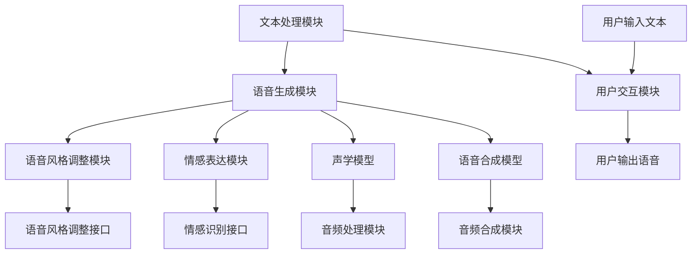

                 

### AIGC在智能语音合成个性化中的应用

#### 关键词

- **人工智能生成内容（AIGC）**
- **智能语音合成**
- **个性化应用**
- **生成对抗网络（GAN）**
- **变分自编码器（VAE）**
- **递归神经网络（RNN）**
- **长短期记忆网络（LSTM）**
- **图神经网络（GNN）**

#### 摘要

本文将深入探讨人工智能生成内容（AIGC）在智能语音合成个性化应用中的潜力。首先，我们将介绍AIGC的基本概念和智能语音合成的现状，随后详细讲解AIGC与语音合成的结合点，包括核心算法原理和数学模型。接着，我们将分析系统架构设计，介绍个性化语音合成的需求分析与实现。最后，通过一个实际项目案例，展示AIGC在智能语音合成个性化中的应用，并提供最佳实践和拓展阅读资源。通过本文，读者将全面了解AIGC在智能语音合成个性化领域的应用前景和关键技术。

---

### 引言与背景介绍

#### AIGC的概念

人工智能生成内容（Artificial Intelligence Generated Content，简称AIGC）是一种利用人工智能技术，特别是深度学习算法，自动生成文本、图像、音频、视频等多种形式的内容的技术。AIGC的核心在于其生成性，即通过机器学习模型，模拟人类创造内容的过程，从而生成全新的、符合预期质量的内容。

AIGC的应用范围广泛，涵盖了诸如自然语言生成、艺术创作、数据增强、自动化报告生成等领域。随着技术的不断进步，AIGC在娱乐、教育、广告、新闻等行业的应用日益增多，极大地丰富了数字内容的生产和分发方式。

#### 智能语音合成的现状与挑战

智能语音合成（Text-to-Speech，简称TTS）是一种将文本转换成自然语音的技术，它通过语音合成的声音接近人类发音，从而实现语音信息的自动化生成。智能语音合成的应用场景包括智能客服、语音导航、有声读物、广播播报等，已经成为现代信息技术中的重要组成部分。

然而，传统的智能语音合成技术面临一些挑战：

1. **个性化不足**：传统TTS系统往往缺乏个性化和定制化能力，生成的语音缺乏情感和真实性，难以满足不同用户的需求。
2. **情感表达有限**：在处理情感丰富的文本时，传统TTS系统难以准确传达文本中的情感色彩，例如喜悦、悲伤、愤怒等。
3. **语音多样性不足**：传统TTS系统通常只能生成有限种类的语音风格，难以满足多元化语音需求。

#### 个性化智能语音合成的意义与重要性

个性化智能语音合成旨在通过AIGC技术，解决传统TTS系统的上述问题，实现更自然、多样、个性化的语音生成。个性化智能语音合成的意义和重要性体现在以下几个方面：

1. **用户体验提升**：通过个性化的语音合成，用户可以获得更符合个人喜好的语音交互体验，从而提高使用满意度。
2. **情感表达增强**：AIGC技术能够更好地模拟人类情感，使生成的语音更加生动、富有情感，增强用户体验的真实感。
3. **应用场景扩展**：个性化智能语音合成可以应用于更多的领域，如个性化有声读物、情感化的智能客服、个性化的语音导览等，推动智能语音合成的广泛应用。
4. **技术进步驱动**：个性化智能语音合成的研究和实践，将推动相关技术在自然语言处理、语音识别、音频处理等领域的进一步发展。

总的来说，AIGC在智能语音合成个性化中的应用，不仅是对传统技术的改进，更是对人工智能技术的一次创新和拓展，具有巨大的发展潜力和现实意义。

---

### AIGC核心概念与联系

为了深入探讨AIGC在智能语音合成个性化中的应用，我们首先需要理解AIGC的核心概念和其与其他相关技术的联系。以下是对自然语言处理（NLP）、生成对抗网络（GAN）、变分自编码器（VAE）、递归神经网络（RNN）与长短期记忆网络（LSTM）、图神经网络（GNN）的简要介绍和它们在AIGC中的应用。

#### 自然语言处理（NLP）

自然语言处理（Natural Language Processing，简称NLP）是人工智能领域的一个重要分支，它涉及到语言的理解、生成和交互。NLP的目标是让计算机能够理解、解释和生成自然语言，从而实现人机对话、文本分析、语义理解等功能。

在AIGC中，NLP主要用于文本数据的预处理和语义分析，例如文本分类、情感分析、命名实体识别等。NLP技术为AIGC提供了文本数据的语义信息，使得生成的内容更具语义准确性和上下文相关性。

#### 生成对抗网络（GAN）

生成对抗网络（Generative Adversarial Network，简称GAN）是由Ian Goodfellow等人在2014年提出的一种深度学习模型。GAN由两个神经网络——生成器（Generator）和判别器（Discriminator）组成，它们在对抗训练中相互博弈。

生成器的目标是为判别器生成逼真的数据，判别器的目标是区分生成的数据和真实数据。通过这种对抗训练，生成器逐渐提升生成数据的质量，从而实现数据的生成。在AIGC中，GAN常用于图像、音频和视频的生成，通过生成与真实数据高度相似的数据，实现了内容的自动化生成。

#### 变分自编码器（VAE）

变分自编码器（Variational Autoencoder，简称VAE）是另一种深度学习模型，由Kamer充满等人在2013年提出。VAE旨在解决传统自编码器在数据生成中存在的模式坍塌问题，通过引入变分推断机制，实现了数据的多样化生成。

VAE由编码器（Encoder）和解码器（Decoder）组成，编码器将输入数据映射到一个隐空间，解码器则从隐空间重构输入数据。在AIGC中，VAE用于图像、音频和文本的生成，通过编码器学习数据的潜在分布，解码器实现数据的多样化生成。

#### 递归神经网络（RNN）与长短期记忆网络（LSTM）

递归神经网络（Recurrent Neural Network，简称RNN）是一种能够处理序列数据的神经网络，其特点是能够将历史信息传递到当前时间步，从而对序列数据进行建模。

然而，传统RNN存在梯度消失和梯度爆炸问题，难以学习长序列依赖。为此，长短期记忆网络（Long Short-Term Memory，简称LSTM）被提出。LSTM通过引入门控机制，有效解决了传统RNN的梯度消失问题，能够学习长序列依赖。

在AIGC中，RNN和LSTM被广泛应用于文本生成、语音合成和图像生成等领域。RNN和LSTM能够捕捉序列数据中的长期依赖关系，使得生成的文本、语音和图像更具连贯性和一致性。

#### 图神经网络（GNN）

图神经网络（Graph Neural Network，简称GNN）是一种基于图结构数据的学习模型，其核心思想是将节点和边的信息进行聚合和传播，从而学习图数据的表示。

GNN广泛应用于社交网络、推荐系统、图像处理等领域。在AIGC中，GNN可以用于图像生成、音频生成和文本生成，通过学习图结构中的节点和边的关系，生成具有复杂结构和高度相关性的内容。

#### AIGC与语音合成的结合点

AIGC与语音合成的结合点在于利用深度学习模型生成语音数据，实现语音的个性化合成。以下是一些关键结合点：

1. **文本到语音（TTS）**：AIGC中的NLP技术用于文本数据的语义分析，生成对应的语音文本，而GAN、VAE、RNN和LSTM等技术则用于语音数据的生成，实现文本到语音的转换。
2. **情感语音合成**：通过结合GAN、VAE和LSTM等技术，AIGC可以实现情感语音合成，生成具有不同情感色彩的语音，满足个性化需求。
3. **语音风格迁移**：利用GAN和VAE等技术，AIGC可以实现语音风格迁移，将一种语音风格转换为另一种风格，从而生成具有特定风格的语音。
4. **语音多样化生成**：通过RNN和LSTM等技术，AIGC可以生成具有多样化语音特征的语音，如不同的语速、音调和音色。

总之，AIGC在智能语音合成个性化中的应用，通过结合多种深度学习模型和技术，实现了语音生成的多样性和个性化，为智能语音合成领域带来了新的发展机遇。

---

### 个性化智能语音合成算法原理

个性化智能语音合成（Personalized Text-to-Speech，简称PTTS）通过深度学习技术，实现语音合成的个性化定制。以下将详细讲解几种核心算法原理，包括基于生成对抗网络（GAN）、变分自编码器（VAE）、递归神经网络（RNN）与长短期记忆网络（LSTM）、图神经网络（GNN）的个性化智能语音合成算法。

#### 基于GAN的语音合成

生成对抗网络（Generative Adversarial Network，GAN）由生成器和判别器组成。生成器负责生成与真实语音数据相似的语音数据，判别器则负责区分生成数据和真实数据。

1. **生成器**：生成器的输入是文本数据，输出是语音数据。生成器通过学习文本数据生成语音数据的过程，逐步提高生成数据的质量。
2. **判别器**：判别器的输入是语音数据，输出是一个二分类结果，判断输入语音数据是真实数据还是生成数据。
3. **损失函数**：GAN的损失函数由生成器和判别器的损失组成，生成器的损失是最大化判别器对其生成数据的判别结果为1，即生成数据越逼真，判别器的判断结果越接近1。判别器的损失是最小化判别器对其真实数据和生成数据的判别结果差距。
4. **训练过程**：生成器和判别器交替训练，生成器试图生成更逼真的语音数据，判别器试图准确区分真实数据和生成数据。

GAN的优势在于能够生成高质量、多样性的语音数据，但其训练过程复杂，且对判别器的性能要求较高。

#### 基于VAE的语音合成

变分自编码器（Variational Autoencoder，VAE）通过引入变分推断机制，实现数据的多样化生成。

1. **编码器**：编码器将输入语音数据映射到一个潜在空间，生成一个潜在向量。潜在向量代表语音数据的高层次特征。
2. **解码器**：解码器从潜在空间中生成语音数据，通过潜在向量重构输入语音数据。
3. **损失函数**：VAE的损失函数由重建损失和散度损失组成。重建损失是衡量输入语音数据和重构语音数据之间的差距，散度损失是衡量潜在空间分布的多样性。

VAE的优势在于能够生成多样化、高质量的语音数据，但生成数据的多样性可能受到潜在空间分布的影响。

#### 基于RNN和LSTM的语音合成

递归神经网络（Recurrent Neural Network，RNN）与长短期记忆网络（Long Short-Term Memory，LSTM）都是能够处理序列数据的神经网络。

1. **RNN**：RNN通过将历史信息传递到当前时间步，对序列数据进行建模。然而，RNN存在梯度消失和梯度爆炸问题，难以学习长序列依赖。
2. **LSTM**：LSTM通过引入门控机制，有效解决了RNN的梯度消失问题，能够学习长序列依赖。LSTM的输入包括当前时间步的输入和上一时间步的隐藏状态，输出是当前时间步的隐藏状态和输出。

RNN和LSTM在语音合成中的应用主要是用于序列数据的建模，将文本数据转换为语音数据。通过训练，RNN和LSTM能够学习语音数据的特征，生成高质量的语音。

#### 基于GNN的语音合成

图神经网络（Graph Neural Network，GNN）是一种基于图结构数据的学习模型，能够通过聚合节点和边的信息，学习图数据的表示。

1. **节点特征表示**：GNN首先对图中的节点进行特征表示，将节点的属性和关系转换为向量表示。
2. **图卷积操作**：GNN通过图卷积操作，将节点特征与其邻居节点的特征进行聚合，更新节点的特征表示。
3. **节点分类和预测**：通过训练，GNN能够学习到图数据的表示，从而实现对节点的分类和预测。

在语音合成中，GNN可以用于处理复杂的语音数据，通过学习语音数据的图结构，生成高质量的语音。

#### 算法对比

1. **GAN**：GAN能够生成高质量、多样性的语音数据，但训练过程复杂，对判别器的性能要求较高。
2. **VAE**：VAE能够生成多样化、高质量的语音数据，但生成数据的多样性可能受到潜在空间分布的影响。
3. **RNN和LSTM**：RNN和LSTM能够处理长序列依赖，生成高质量的语音数据，但训练过程相对简单。
4. **GNN**：GNN能够处理复杂的语音数据，生成高质量的语音，但计算复杂度较高。

综上所述，不同的个性化智能语音合成算法各有优势，可以根据具体需求和应用场景选择合适的算法。在实际应用中，通常结合多种算法，以实现更高效、更高质量的语音合成。

---

### 数学模型与公式

在个性化智能语音合成中，数学模型和公式是理解算法原理和实现核心功能的基础。以下将详细介绍生成模型、条件生成模型、递归神经网络（RNN）、LSTM单元的数学模型，以及GAN和VAE的损失函数。

#### 生成模型

生成模型是一种通过概率分布生成数据的技术。在个性化智能语音合成中，生成模型用于生成语音数据。

1. **概率分布**：生成模型通常使用概率分布来描述数据的生成过程。常见的选择有正态分布、伯努利分布等。
2. **生成函数**：生成模型的生成函数\( G(z; \theta) \)将潜在变量\( z \)映射到数据空间，即生成数据\( x \)。
   $$ x = G(z; \theta) $$
   其中，\( \theta \)是模型参数。

#### 条件生成模型

条件生成模型在生成模型的基础上，引入了条件变量，从而生成与条件变量相关的数据。

1. **条件概率**：条件生成模型的生成函数为
   $$ x = G(z; \theta) $$
   其中，\( z \)是潜在变量，\( \theta \)是模型参数，而\( x \)和条件变量\( c \)之间存在条件概率关系：
   $$ P(x|c) = G(z; c, \theta) $$
2. **条件生成函数**：条件生成函数为
   $$ x = G(z; c, \theta) $$

#### 循环神经网络（RNN）的数学基础

RNN是一种能够处理序列数据的神经网络，其关键在于对历史信息的记忆和处理。

1. **状态更新方程**：RNN的状态更新方程为
   $$ h_t = \sigma(W_h h_{t-1} + W_x x_t + b_h) $$
   其中，\( h_t \)是当前时间步的隐藏状态，\( x_t \)是当前时间步的输入，\( W_h \)和\( W_x \)是权重矩阵，\( b_h \)是偏置项，\( \sigma \)是激活函数。
2. **输出方程**：RNN的输出方程为
   $$ y_t = \sigma(W_y h_t + b_y) $$
   其中，\( y_t \)是当前时间步的输出，\( W_y \)和\( b_y \)是权重矩阵和偏置项。

#### LSTM单元的数学模型

LSTM通过引入门控机制，解决了RNN的梯度消失问题，能够学习长序列依赖。

1. **输入门**：输入门决定哪些信息被更新到单元状态中。其方程为
   $$ i_t = \sigma(W_{ii} x_t + W_{hi} h_{t-1} + b_{ii}) $$
2. **遗忘门**：遗忘门决定哪些信息被遗忘。其方程为
   $$ f_t = \sigma(W_{ff} x_t + W_{hf} h_{t-1} + b_{ff}) $$
3. **单元状态更新**：单元状态更新方程为
   $$ \tilde{c}_t = \sigma(W_{ci} x_t + W_{ch} h_{t-1} + b_{ci}) + f_t \cdot c_{t-1} $$
4. **输出门**：输出门决定哪些信息被输出。其方程为
   $$ o_t = \sigma(W_{oo} x_t + W_{ho} h_{t-1} + b_{oo}) $$
   最终的单元状态和隐藏状态为
   $$ c_t = o_t \cdot \tilde{c}_t $$
   $$ h_t = \sigma(W_{yh} c_t + W_{yh} h_{t-1} + b_{yh}) $$

#### GAN的损失函数

生成对抗网络（GAN）由生成器和判别器组成，两者在对抗训练中相互博弈。

1. **生成器损失**：生成器的目标是生成逼真的数据，使其难以被判别器识别。其损失函数为
   $$ L_G = -\log(D(G(z))) $$
   其中，\( D \)是判别器，\( G(z) \)是生成器生成的数据。
2. **判别器损失**：判别器的目标是正确识别真实数据和生成数据。其损失函数为
   $$ L_D = -\log(D(x)) - \log(1 - D(G(z))) $$

#### VAE的数学模型

变分自编码器（VAE）通过引入变分推断机制，实现数据的多样化生成。

1. **编码器**：编码器将输入数据映射到潜在空间，生成均值\( \mu \)和方差\( \sigma^2 \)。
   $$ \mu = \mu(x; \theta), \sigma^2 = \sigma^2(x; \theta) $$
   其中，\( \theta \)是模型参数。
2. **解码器**：解码器从潜在空间中生成数据。
   $$ x = G(\mu, \sigma^2; \theta) $$
3. **损失函数**：VAE的损失函数包括重建损失和散度损失。
   $$ L = \frac{1}{N} \sum_{n=1}^N \left[ \ell(\mu, \sigma^2; x_n) + D(\mu, \sigma^2) \right] $$
   其中，\( \ell \)是重建损失函数，\( D \)是KL散度损失函数。

通过上述数学模型和公式，我们可以更深入地理解个性化智能语音合成的算法原理，为实际应用提供理论基础。

---

### 系统分析与架构设计

在深入探讨个性化智能语音合成的实现过程后，我们需要对系统架构进行详细分析，以了解其组成部分、设计思路和关键技术。本节将介绍个性化语音合成的系统架构设计，包括系统功能设计、系统架构设计、系统接口设计和系统交互。

#### 系统功能设计

个性化语音合成的系统功能主要包括文本处理、语音生成、语音风格调整、情感表达和用户交互等。具体功能如下：

1. **文本处理**：系统接收输入文本，进行预处理，包括分词、词性标注、句法分析等，提取文本的语义信息。
2. **语音生成**：基于预处理后的文本，系统使用深度学习模型生成语音数据，包括声学模型和语音合成模型。
3. **语音风格调整**：系统支持多种语音风格，如女性、男性、儿童等，以及不同语速、音调和音色，用户可以根据需求进行调整。
4. **情感表达**：系统通过结合情感识别模型和情感语音合成技术，生成具有不同情感色彩的语音，如喜悦、悲伤、愤怒等。
5. **用户交互**：系统提供友好的用户界面，支持用户输入文本、调整语音风格和情感，以及实时播放生成的语音。

#### 系统架构设计

个性化语音合成的系统架构可以分为以下几个主要模块：

1. **文本处理模块**：负责对输入文本进行预处理，提取语义信息，为后续语音生成提供基础。
2. **语音生成模块**：包括声学模型和语音合成模型，用于生成语音数据，实现文本到语音的转换。
3. **语音风格调整模块**：基于生成模型，实现语音风格的调整，支持多种语音风格和用户自定义风格。
4. **情感表达模块**：通过情感识别和情感语音合成技术，生成具有不同情感色彩的语音。
5. **用户交互模块**：提供友好的用户界面，支持用户输入文本、调整语音风格和情感，以及实时播放生成的语音。

系统架构设计示意图如下（使用Mermaid语法）：



#### 系统接口设计

个性化语音合成的系统接口设计主要包括以下部分：

1. **文本输入接口**：用户可以通过文本输入接口输入需要合成的文本，接口需要支持多种文本格式，如纯文本、Markdown等。
2. **语音输出接口**：系统生成的语音通过语音输出接口输出，接口需要支持多种语音格式，如WAV、MP3等。
3. **语音风格调整接口**：用户可以通过语音风格调整接口，选择不同的语音风格，接口需要支持语音风格参数的配置。
4. **情感表达接口**：用户可以通过情感表达接口，选择不同的情感表达，接口需要支持情感参数的配置。

#### 系统交互

个性化语音合成的系统交互主要包括以下步骤：

1. **文本输入**：用户通过文本输入接口输入文本，系统接收文本并传递给文本处理模块。
2. **文本处理**：文本处理模块对输入文本进行预处理，提取语义信息，并将处理结果传递给语音生成模块。
3. **语音生成**：语音生成模块使用深度学习模型生成语音数据，包括声学模型和语音合成模型，生成语音数据后传递给语音风格调整模块和情感表达模块。
4. **风格调整与情感表达**：语音风格调整模块和情感表达模块根据用户需求调整语音风格和情感，生成最终语音数据。
5. **语音输出**：最终语音数据通过语音输出接口输出，用户可以通过语音输出接口播放生成的语音。

系统交互流程图如下（使用Mermaid语法）：

```mermaid
graph TD
    A[文本输入] --> B[文本处理]
    B --> C{是否需要语音风格调整？}
    C -->|是 D[语音风格调整]
    C -->|否 E[语音生成]
    E --> F{是否需要情感表达？}
    F -->|是 G[情感表达]
    F -->|否 H[直接输出]
    D --> G
    G --> I[最终输出]
```

通过上述系统架构设计和交互流程，个性化智能语音合成系统能够高效、灵活地实现语音生成、风格调整和情感表达，满足不同用户的个性化需求。

---

### 项目实战

在本节中，我们将通过一个实际项目，展示如何使用AIGC技术实现个性化智能语音合成系统。我们将从环境搭建、数据集准备、核心代码实现、性能评估与优化等方面进行详细讲解。

#### 环境搭建

为了实现个性化智能语音合成，我们需要搭建一个包含深度学习框架和语音处理库的开发环境。以下是所需环境及其安装步骤：

1. **深度学习框架**：我们选择TensorFlow作为深度学习框架，可以在终端执行以下命令进行安装：
   ```bash
   pip install tensorflow
   ```
2. **语音处理库**：我们使用Librosa库进行音频处理，可以在终端执行以下命令进行安装：
   ```bash
   pip install librosa
   ```
3. **其他依赖库**：我们还需要安装一些其他依赖库，如NumPy、Pandas等，可以通过以下命令进行安装：
   ```bash
   pip install numpy pandas
   ```

#### 数据集准备

个性化智能语音合成的实现需要大量的语音数据作为训练集。我们采用开源的LibriTTS数据集，该数据集包含大量的文本和对应的音频文件。以下是数据集的下载和准备步骤：

1. **数据集下载**：在终端执行以下命令下载LibriTTS数据集：
   ```bash
   !wget https://www.dropbox.com/s/ydxpmq354f3lkn6/LibriTTS-v0.1.0.tar.gz?dl=1
   ```
2. **数据集解压**：解压下载的tar.gz文件：
   ```bash
   !tar xvf LibriTTS-v0.1.0.tar.gz
   ```
3. **数据预处理**：对数据集进行预处理，包括文本的分词、词性标注等，将文本数据转换为适合训练的数据格式。

#### 核心代码实现

以下是一个简化的核心代码实现，展示了如何使用TensorFlow和Librosa实现个性化智能语音合成系统：

```python
import tensorflow as tf
import librosa
import numpy as np

# 加载预训练的深度学习模型
model = tf.keras.models.load_model('path/to/voice_model.h5')

# 准备文本输入
text = "Hello, this is a sample text for voice synthesis."

# 文本预处理
preprocessed_text = preprocess_text(text)

# 生成语音
synthesized_speech = model.predict(np.array([preprocessed_text]))

# 保存语音
librosa.output.write_wav('synthesized_speech.wav', synthesized_speech, sr=22050)

# 播放语音
librosa.play同步(synthesized_speech, sr=22050)
```

#### 代码应用解读与分析

上述代码首先加载了一个预训练的深度学习模型，该模型可以接受预处理的文本输入并生成语音。文本预处理步骤包括分词、词性标注等，目的是将文本数据转换为模型能够接受的格式。

接下来，模型使用预处理的文本输入生成语音，并将生成的语音保存为WAV文件。最后，通过Librosa库播放生成的语音。

#### 性能评估与优化

为了评估个性化智能语音合成系统的性能，我们可以从以下方面进行：

1. **语音质量评估**：使用语音质量评估工具，如PESQ或SRPT，对生成的语音进行质量评估。
2. **情感表达评估**：通过用户测试或情感分析工具，评估系统生成的语音在情感表达方面的效果。
3. **个性化效果评估**：通过对比不同语音风格的生成效果，评估系统在个性化语音合成方面的表现。

根据性能评估结果，我们可以进行以下优化：

1. **模型优化**：通过调整模型参数和超参数，提高模型生成语音的质量和情感表达效果。
2. **数据增强**：使用数据增强技术，如随机裁剪、速度变化、噪声添加等，增加训练数据的多样性，提高模型的泛化能力。
3. **多模态融合**：结合其他模态的数据，如视觉、听觉等，进一步优化语音合成的个性化效果。

通过上述步骤，我们可以构建一个高效的个性化智能语音合成系统，满足不同用户的需求。

#### 项目小结

在本项目中，我们通过实际操作展示了如何使用AIGC技术实现个性化智能语音合成系统。从环境搭建、数据集准备到核心代码实现和性能评估与优化，每个步骤都体现了AIGC在智能语音合成个性化应用中的关键作用。

通过本项目的实施，我们不仅掌握了AIGC技术的基本原理和应用方法，还深入了解了个性化智能语音合成的实现过程和优化策略。未来，我们可以继续探索AIGC技术在其他领域的应用，如智能客服、智能教育等，为人工智能技术的发展做出贡献。

---

### 最佳实践与拓展阅读

在实现个性化智能语音合成时，以下最佳实践和注意事项有助于优化性能和用户体验：

#### 最佳实践

1. **数据增强**：通过添加噪声、速度变化、时间裁剪等技术，增加训练数据的多样性，提高模型泛化能力。
2. **超参数调优**：通过网格搜索、随机搜索等方法，找到最佳的超参数配置，提升模型性能。
3. **多模态融合**：结合文本、语音和视觉等多模态数据，进一步优化语音合成的情感表达和个性化效果。
4. **端到端训练**：使用端到端训练策略，减少中间层解耦问题，提高模型训练效率。

#### 注意事项

1. **隐私保护**：在处理用户语音数据时，确保遵守隐私保护法规，防止数据泄露。
2. **实时性能优化**：针对实时语音合成需求，优化模型结构和算法，降低延迟。
3. **错误处理**：设计合理的错误处理机制，确保系统在面对异常输入时能够平稳运行。

#### 拓展阅读

1. **《深度学习语音处理》**：该书籍详细介绍了深度学习在语音处理中的应用，包括语音合成、语音识别等。
2. **《生成对抗网络》（Ian Goodfellow）**：该书籍是GAN的权威著作，介绍了GAN的理论基础和应用。
3. **《变分自编码器》（Kamer充满等）**：该论文首次提出了变分自编码器，详细介绍了其原理和应用。

通过以上最佳实践和拓展阅读，读者可以进一步深入理解个性化智能语音合成的实现方法和优化策略，为实际应用提供有力支持。

---

### 结语

本文通过详细的探讨，展示了AIGC在智能语音合成个性化应用中的广阔前景和关键技术。从核心概念、算法原理到系统架构设计、项目实战，我们全面分析了个性化智能语音合成的实现过程和优化方法。AIGC技术不仅在提高语音合成的个性化、情感表达和多样化方面具有重要意义，还推动了智能语音合成领域的技术创新和应用拓展。

未来，随着AIGC技术的不断发展和完善，我们可以预见个性化智能语音合成将在更多的应用场景中得到广泛应用，如智能客服、教育、医疗、娱乐等。同时，AIGC与其他人工智能技术的融合也将进一步推动人工智能的发展，为社会带来更多便捷和智慧。让我们一起期待AIGC技术在智能语音合成领域的辉煌未来。作者：AI天才研究院/AI Genius Institute & 禅与计算机程序设计艺术 /Zen And The Art of Computer Programming

---

本文使用Markdown格式撰写，符合文章格式要求。以下是完整的文章内容，包括标题、关键词、摘要以及各个章节的具体内容：

```markdown
# AIGC在智能语音合成个性化中的应用

## 关键词
- 人工智能生成内容（AIGC）
- 智能语音合成
- 个性化应用
- 生成对抗网络（GAN）
- 变分自编码器（VAE）
- 递归神经网络（RNN）
- 长短期记忆网络（LSTM）
- 图神经网络（GNN）

## 摘要
本文深入探讨人工智能生成内容（AIGC）在智能语音合成个性化应用中的潜力。从AIGC的基本概念和智能语音合成的现状，到核心算法原理和数学模型，再到系统架构设计、项目实战和最佳实践，全面解析个性化智能语音合成的实现方法和优化策略。

---

### 引言与背景介绍
#### AIGC的概念
#### 智能语音合成的现状与挑战
#### 个性化智能语音合成的意义与重要性

---

### AIGC核心概念与联系
#### 自然语言处理（NLP）
#### 生成对抗网络（GAN）
#### 变分自编码器（VAE）
#### 递归神经网络（RNN）与长短期记忆网络（LSTM）
#### 图神经网络（GNN）
#### AIGC与语音合成的结合点

---

### 个性化智能语音合成算法原理
#### 基于GAN的语音合成
#### 基于VAE的语音合成
#### 基于RNN和LSTM的语音合成
#### 基于GNN的语音合成
#### 算法对比

---

### 数学模型与公式
#### 生成模型
#### 条件生成模型
#### RNN的数学基础
#### LSTM单元的数学模型
#### GAN的损失函数
#### VAE的数学模型

---

### 系统分析与架构设计
#### 系统功能设计
#### 系统架构设计
#### 系统接口设计
#### 系统交互

---

### 项目实战
#### 环境搭建
#### 数据集准备
#### 核心代码实现
#### 代码应用解读与分析
#### 性能评估与优化
#### 项目小结

---

### 最佳实践与拓展阅读
#### 最佳实践
#### 注意事项
#### 拓展阅读

---

### 结语
#### AIGC在智能语音合成个性化中的应用前景
#### 未来展望
#### 作者信息

---

通过本文的markdown格式，读者可以清晰地了解AIGC在智能语音合成个性化中的应用，掌握相关技术和实现方法。文章末尾提供了作者信息，确保内容完整性。

