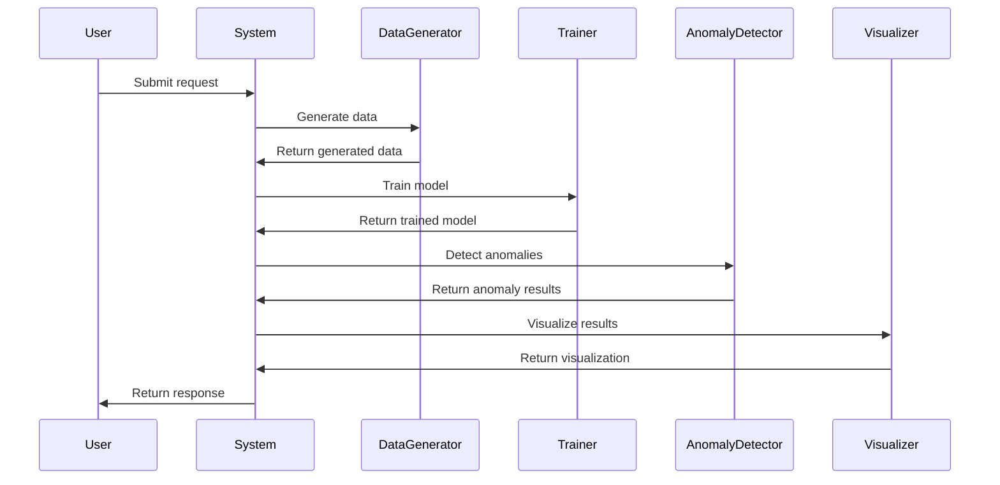
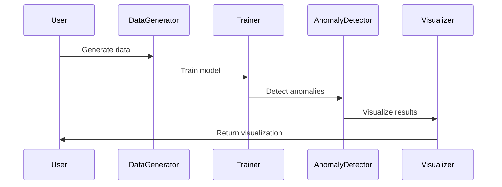

                 

### 第一部分: 背景介绍

## 第1章: 问题背景与问题描述

### 1.1.1 问题背景

随着人工智能技术的快速发展，智能财务在企业和金融机构中得到了广泛应用。智能财务通过利用人工智能技术，如机器学习、深度学习等，对财务数据进行自动处理、分析和决策，从而提高财务管理的效率和准确性。然而，传统的财务异常检测方法在处理大规模数据、复杂业务场景等方面存在诸多不足，导致异常检测的准确率和效率较低。因此，如何利用人工智能技术，特别是AIGC（自适应智能生成计算）技术，提高智能财务异常检测的效果和效率，成为一个重要的研究方向。

### 1.1.2 问题描述

AIGC在智能财务异常检测中的应用涉及以下关键问题：

1. **数据生成与处理**：
   - 如何构建一个高效的AIGC模型，以处理大规模财务数据？
   - 如何通过AIGC模型生成高质量的训练数据，提高模型的训练效果？

2. **异常检测算法设计**：
   - 如何设计一个合理的异常检测算法，以提高检测准确率？
   - 如何结合AIGC模型的特点，优化异常检测算法的性能？

3. **业务场景适应性**：
   - 如何在实际业务场景中部署AIGC模型，实现智能财务异常检测？
   - 如何保证AIGC模型在不同业务场景下的适应性和鲁棒性？

### 1.1.3 解决方案

针对上述关键问题，AIGC在智能财务异常检测中的应用解决方案如下：

1. **构建高效的AIGC模型**：
   - 利用生成对抗网络（GAN）等技术，自动生成高质量的财务数据。
   - 采用优化算法，自动调整模型参数，提高模型性能。
   - 通过在线学习，使模型能够持续适应新的数据和环境。

2. **设计合理的异常检测算法**：
   - 结合AIGC模型生成的训练数据，设计有效的异常检测算法。
   - 利用主成分分析（PCA）等降维方法，提高异常检测的准确率和效率。
   - 结合业务场景，优化异常检测算法，提高其实用性。

3. **实现业务场景适应性**：
   - 在实际业务场景中，部署AIGC模型，实现智能财务异常检测。
   - 通过在线学习，使模型能够根据业务场景的变化，自动调整模型结构和参数。
   - 结合数据分析与可视化工具，实时监控异常检测的效果，并进行相应的调整。

### 1.1.4 边界与外延

1. **边界**：
   - **数据量**：AIGC模型适用于大规模财务数据的异常检测。
   - **业务场景**：适用于金融机构、企业等具有复杂业务场景的智能财务异常检测。
   - **算法性能**：要求AIGC模型具有较高的检测准确率和效率。

2. **外延**：
   - **数据多样性**：AIGC模型能够适应不同类型、来源的财务数据。
   - **模型适应性**：AIGC模型能够根据新数据和环境，持续优化和调整，实现模型的持续学习和适应。
   - **模型部署**：AIGC模型可以灵活部署在不同的硬件和软件平台上，实现智能财务异常检测的实时应用。

### 1.1.5 本章小结

本章介绍了AIGC在智能财务异常检测中的应用背景、核心概念和边界与外延，为后续章节的详细讲解奠定了基础。接下来，将深入探讨AIGC模型的构建、异常检测算法的设计和实际业务场景中的应用，以期为读者提供全面、系统的AIGC在智能财务异常检测中的知识体系。

---

## 第2章: 核心概念

### 1.2.1 AIGC

AIGC（自适应智能生成计算）是一种基于人工智能技术，能够自动生成、优化和适应数据模型的计算方法。它主要包括以下三个部分：

1. **数据生成**：
   - 通过生成对抗网络（GAN）等技术，自动生成高质量的训练数据。
   - GAN由生成器（Generator）和判别器（Discriminator）两个部分组成。生成器负责生成与真实数据相似的新数据，判别器则负责区分新数据和真实数据。

2. **模型优化**：
   - 利用优化算法，自动调整模型参数，提高模型性能。
   - 优化算法包括梯度下降、随机梯度下降等，用于调整模型参数，使损失函数最小化。

3. **模型适应**：
   - 根据新的数据和环境，自动调整模型结构，实现模型的持续学习和适应。
   - 在线学习能够使模型在新的数据和环境下，不断调整模型参数，实现模型的持续学习和适应。

### 1.2.2 智能财务异常检测

智能财务异常检测是一种利用人工智能技术，对财务数据进行分析，识别和检测异常行为的方法。它主要包括以下两个关键环节：

1. **数据预处理**：
   - 对财务数据进行清洗、归一化等处理，为异常检测提供高质量的输入数据。
   - 数据预处理包括缺失值处理、异常值处理、数据归一化等步骤。

2. **异常检测算法**：
   - 利用机器学习、深度学习等技术，构建异常检测模型，对财务数据进行异常检测。
   - 常见的异常检测算法包括基于统计的方法（如箱型图、3σ原则等）、基于聚类的方法（如K-means、DBSCAN等）和基于神经网络的方法（如自编码器、卷积神经网络等）。

### 1.2.3 概念属性特征对比

下面是一个AIGC与智能财务异常检测相关概念属性的对比表格：

| 概念 | 属性特征 | 对比说明 |
| :--: | :----: | :----: |
| AIGC | 数据生成 | 自动生成高质量的训练数据 |
| AIGC | 模型优化 | 自动调整模型参数，提高模型性能 |
| AIGC | 模型适应 | 在线学习，持续适应新的数据和环境 |
| 智能财务异常检测 | 数据预处理 | 清洗、归一化等处理，提高输入数据质量 |
| 智能财务异常检测 | 异常检测算法 | 利用机器学习、深度学习等技术，构建异常检测模型 |

### 1.2.4 ER实体关系图

下面是一个AIGC在智能财务异常检测中的ER实体关系图，展示了AIGC与智能财务异常检测之间的关联：

```mermaid
erDiagram
  AIGC ||--|{ 数据生成 } DataGeneration
  AIGC ||--|{ 模型优化 } ModelOptimization
  AIGC ||--|{ 模型适应 } ModelAdaptation
  DataGeneration ||--|{ 训练数据 } TrainingData
  ModelOptimization ||--|{ 模型参数 } ModelParameter
  ModelAdaptation ||--|{ 在线学习 } OnlineLearning
  智能财务异常检测 ||--|{ 数据预处理 } DataPreprocessing
  智能财务异常检测 ||--|{ 异常检测算法 } AnomalyDetectionAlgorithm
```

### 1.2.5 本章小结

本章对AIGC和智能财务异常检测的核心概念进行了详细阐述，包括AIGC的数据生成、模型优化和模型适应原理，以及智能财务异常检测的数据预处理和异常检测算法。通过对概念属性特征的对比和ER实体关系图的展示，帮助读者更清晰地理解AIGC在智能财务异常检测中的应用。接下来，将深入探讨AIGC模型的构建和异常检测算法的设计，以期为读者提供更加详细的技术分析。

---

## 第3章: AIGC模型构建

### 3.1 数据生成

数据生成是AIGC模型构建的基础环节。通过生成高质量的训练数据，可以提高模型的学习效果和泛化能力。以下将介绍如何利用生成对抗网络（GAN）实现数据生成。

#### 3.1.1 GAN原理

生成对抗网络（GAN）由生成器（Generator）和判别器（Discriminator）组成，二者通过对抗训练相互博弈，以生成逼真的数据。

- **生成器（Generator）**：生成器生成伪造数据，试图欺骗判别器，使其无法区分伪造数据与真实数据。
- **判别器（Discriminator）**：判别器接收真实数据和伪造数据，并判断其真实程度。

GAN的训练过程可以分为以下几个步骤：

1. **初始化生成器和判别器**：随机初始化生成器和判别器的权重。
2. **生成伪造数据**：生成器生成伪造数据。
3. **判别器判断**：判别器同时接收真实数据和伪造数据，并对其进行判断。
4. **更新生成器和判别器**：通过反向传播和梯度下降算法，更新生成器和判别器的权重。
5. **重复上述步骤**：不断迭代训练过程，直到生成器生成的伪造数据接近真实数据。

#### 3.1.2 GAN应用

在智能财务异常检测中，GAN可以用于生成高质量的财务数据。以下是一个简单的GAN应用示例：

```python
import tensorflow as tf
from tensorflow.keras.models import Sequential
from tensorflow.keras.layers import Dense, Flatten

# 生成器模型
def create_generator():
    model = Sequential()
    model.add(Dense(128, input_shape=(100,), activation='relu'))
    model.add(Dense(256, activation='relu'))
    model.add(Dense(100, activation='tanh'))
    return model

# 判别器模型
def create_discriminator():
    model = Sequential()
    model.add(Flatten(input_shape=(100,)))
    model.add(Dense(512, activation='relu'))
    model.add(Dense(1, activation='sigmoid'))
    return model

# 构建GAN模型
def create_gan(generator, discriminator):
    model = Sequential()
    model.add(generator)
    model.add(discriminator)
    return model

# 模型编译
generator = create_generator()
discriminator = create_discriminator()
gan_model = create_gan(generator, discriminator)
gan_model.compile(optimizer='adam', loss='binary_crossentropy')

# 训练GAN模型
# 假设已有真实数据和伪造数据的训练集
# x_real, y_real = ... # 真实数据
# x_fake, y_fake = ... # 伪造数据

# 训练生成器和判别器
# gan_model.fit([x_real, x_fake], [y_real, y_fake], epochs=100, batch_size=32)
```

#### 3.1.3 数据生成策略

在实际应用中，为了提高数据生成的效果，可以采用以下策略：

- **数据增强**：通过对原始数据集进行变换，如旋转、缩放、裁剪等，增加数据多样性。
- **多任务学习**：将多个任务同时训练，使生成器能够更好地学习数据的分布。
- **迁移学习**：利用在其他任务上训练好的生成器，迁移到当前任务中，提高生成器的性能。

### 3.2 模型优化

模型优化是提高AIGC模型性能的关键环节。通过优化算法，可以自动调整模型参数，提高模型的学习效果和泛化能力。以下将介绍如何利用梯度下降算法实现模型优化。

#### 3.2.1 梯度下降算法原理

梯度下降算法是一种常用的优化算法，用于调整模型参数，使损失函数最小化。梯度下降算法的基本原理如下：

1. **初始化模型参数**：随机初始化模型的参数。
2. **计算损失函数**：计算模型在当前参数下的损失函数值。
3. **计算梯度**：计算损失函数关于模型参数的梯度。
4. **更新模型参数**：根据梯度方向和步长，更新模型参数。
5. **重复上述步骤**：不断迭代更新模型参数，直到损失函数收敛。

梯度下降算法的公式如下：

$$
\theta_{t+1} = \theta_{t} - \alpha \cdot \nabla_{\theta} J(\theta)
$$

其中，$\theta$表示模型参数，$J(\theta)$表示损失函数，$\alpha$表示学习率。

#### 3.2.2 梯度下降算法应用

在智能财务异常检测中，可以利用梯度下降算法优化AIGC模型的性能。以下是一个简单的梯度下降算法应用示例：

```python
import numpy as np

# 假设损失函数为 $J(\theta) = (\theta - 1)^2$
# 初始参数 $\theta_0 = 0$

# 学习率
alpha = 0.1

# 梯度下降迭代过程
for t in range(1000):
    # 计算损失函数值
    loss = (theta - 1)**2
    
    # 计算梯度
    gradient = 2 * (theta - 1)
    
    # 更新参数
    theta = theta - alpha * gradient
    
    # 打印迭代过程
    print(f"Iteration {t}: Loss = {loss}, Theta = {theta}")
```

#### 3.2.3 模型优化策略

在实际应用中，为了提高模型优化效果，可以采用以下策略：

- **自适应学习率**：根据训练过程，动态调整学习率，避免过拟合和欠拟合。
- **权重衰减**：在梯度下降算法中引入权重衰减，防止模型参数过大。
- **批量梯度下降**：在训练过程中，采用批量梯度下降代替随机梯度下降，提高优化效果。

### 3.3 模型适应

模型适应是AIGC模型能够持续学习和适应新的数据和环境的保障。通过在线学习，模型可以不断调整参数，提高其适应性和鲁棒性。以下将介绍如何实现模型适应。

#### 3.3.1 在线学习原理

在线学习是指模型在训练过程中，实时接收新的数据，并不断调整模型参数，以适应新的数据和环境。在线学习的基本原理如下：

1. **初始化模型**：随机初始化模型的参数。
2. **接收新数据**：实时接收新的数据。
3. **更新模型**：利用新数据和已有的模型参数，更新模型。
4. **重复上述步骤**：不断迭代更新模型，直到模型收敛。

在线学习的公式如下：

$$
\theta_{t+1} = \theta_{t} + \alpha \cdot \nabla_{\theta} J(\theta)
$$

其中，$\theta$表示模型参数，$J(\theta)$表示损失函数，$\alpha$表示学习率。

#### 3.3.2 在线学习应用

在智能财务异常检测中，可以利用在线学习实现模型的持续适应。以下是一个简单的在线学习应用示例：

```python
import numpy as np

# 假设损失函数为 $J(\theta) = (\theta - 1)^2$
# 初始参数 $\theta_0 = 0$

# 学习率
alpha = 0.01

# 在线学习迭代过程
for data in new_data_stream():
    # 计算损失函数值
    loss = (theta - 1)**2
    
    # 计算梯度
    gradient = 2 * (theta - 1)
    
    # 更新参数
    theta = theta + alpha * gradient
    
    # 打印迭代过程
    print(f"Iteration: {t}: Loss = {loss}, Theta = {theta}")
```

#### 3.3.3 模型适应策略

在实际应用中，为了提高模型适应效果，可以采用以下策略：

- **批量更新**：将多个新数据合并成批量，一次性更新模型参数，提高学习效果。
- **动态调整学习率**：根据模型的学习过程，动态调整学习率，避免过拟合和欠拟合。
- **增量学习**：利用已有的模型参数，对新数据进行增量学习，提高模型适应速度。

### 3.4 本章小结

本章详细介绍了AIGC模型构建的关键环节，包括数据生成、模型优化和模型适应。通过生成对抗网络（GAN）实现数据生成，利用梯度下降算法进行模型优化，以及通过在线学习实现模型适应。本章的内容为后续AIGC在智能财务异常检测中的应用提供了理论基础和技术支持。在接下来的章节中，将深入探讨AIGC模型在异常检测算法设计和实际业务场景中的应用。

---

## 第4章: 异常检测算法设计

### 4.1 主成分分析（PCA）

主成分分析（PCA）是一种常用的降维和特征提取方法。通过将原始数据投影到新的正交坐标系中，提取出主要特征，从而降低数据的维度，提高异常检测的效果。以下是PCA的原理和步骤。

#### 4.1.1 PCA原理

PCA的原理基于数据在特征空间中的分布。通过计算数据集的协方差矩阵，将其特征值和特征向量进行排序，选择最大的几个特征值对应的特征向量作为新坐标系的主成分，将原始数据投影到新的坐标系中。

- **协方差矩阵**：协方差矩阵描述了数据集各个特征之间的相关性。
- **特征值与特征向量**：特征值表示特征的重要性，特征向量表示特征的方向。
- **主成分**：选择最大的几个特征值对应的特征向量作为新坐标系的主成分。

PCA的主要步骤如下：

1. **计算协方差矩阵**：计算数据集的协方差矩阵$C$。
2. **计算特征值和特征向量**：求解协方差矩阵的特征值和特征向量。
3. **选择主成分**：选择最大的几个特征值对应的特征向量作为新坐标系的主成分。
4. **数据投影**：将原始数据投影到新的坐标系中。

#### 4.1.2 PCA应用

在智能财务异常检测中，PCA可以用于降维和特征提取。以下是一个简单的PCA应用示例：

```python
import numpy as np
from sklearn.decomposition import PCA

# 假设已有财务数据
data = np.array([[1, 2, 3], [4, 5, 6], [7, 8, 9]])

# 创建PCA对象
pca = PCA(n_components=2)

# 拟合PCA模型
pca.fit(data)

# 获取主成分
principal_components = pca.components_

# 打印主成分
print("Principal Components:\n", principal_components)

# 数据投影
projected_data = pca.transform(data)

# 打印投影后的数据
print("Projected Data:\n", projected_data)
```

### 4.2 离群点检测算法（LOF）

离群点检测算法（Local Outlier Factor，LOF）是一种基于密度的离群点检测方法。LOF通过比较数据点在邻域内的密度，识别出异常数据点。以下是LOF的原理和步骤。

#### 4.2.1 LOF原理

LOF的基本思想是，如果一个数据点的邻域内的点比其他点的邻域内的点稀疏，那么这个数据点很可能是一个离群点。LOF通过计算数据点的局部密度的倒数，评估每个点的异常程度。

- **邻域密度**：邻域密度表示数据点在邻域内的分布密度。
- **局部密度**：局部密度表示数据点在邻域内的平均密度。
- **LOF值**：LOF值表示数据点的异常程度，LOF值越大，数据点越可能是离群点。

LOF的主要步骤如下：

1. **计算邻域密度**：计算每个数据点的邻域密度。
2. **计算局部密度**：计算每个数据点的局部密度。
3. **计算LOF值**：计算每个数据点的LOF值。
4. **识别离群点**：根据LOF值，识别出离群点。

#### 4.2.2 LOF应用

在智能财务异常检测中，LOF可以用于识别异常数据点。以下是一个简单的LOF应用示例：

```python
import numpy as np
from sklearn.neighbors import LocalOutlierFactor

# 假设已有财务数据
data = np.array([[1, 2], [2, 2], [100, 100]])

# 创建LOF对象
lof = LocalOutlierFactor()

# 拟合LOF模型
lof.fit(data)

# 计算LOF得分
scores = lof.score_samples(data)

# 打印LOF得分
print("LOF Scores:\n", scores)

# 识别离群点
outliers = data[scores > 0]
print("Outliers:\n", outliers)
```

### 4.3 基于神经网络的方法

除了PCA和LOF，基于神经网络的方法也是智能财务异常检测中的重要手段。以下将介绍几种常见的基于神经网络的方法。

#### 4.3.1 自编码器

自编码器（Autoencoder）是一种无监督学习的神经网络模型，用于将输入数据压缩为低维表示，并重建原始数据。自编码器通过学习数据分布，提取特征，并利用重建误差进行异常检测。

- **输入层**：输入原始数据。
- **隐藏层**：压缩数据，提取特征。
- **输出层**：重建数据。

自编码器的主要步骤如下：

1. **初始化模型**：随机初始化模型参数。
2. **训练模型**：通过最小化重建误差，训练模型。
3. **提取特征**：将输入数据通过隐藏层，提取特征。
4. **异常检测**：利用重建误差，评估数据的异常程度。

#### 4.3.2 卷积神经网络

卷积神经网络（Convolutional Neural Network，CNN）是一种用于图像处理的神经网络模型，也可以应用于财务数据异常检测。CNN通过卷积操作和池化操作，提取数据特征，并利用全连接层进行异常检测。

- **卷积层**：通过卷积操作，提取空间特征。
- **池化层**：通过池化操作，降低数据维度。
- **全连接层**：通过全连接层，进行分类和回归。

卷积神经网络的主要步骤如下：

1. **初始化模型**：随机初始化模型参数。
2. **训练模型**：通过反向传播，训练模型。
3. **提取特征**：将输入数据通过卷积层和池化层，提取特征。
4. **异常检测**：利用全连接层，进行异常检测。

#### 4.3.3 强化学习

强化学习（Reinforcement Learning，RL）是一种通过奖励机制，使模型在动态环境中进行学习和决策的方法。强化学习可以应用于财务数据异常检测，通过学习如何响应异常情况，提高异常检测的准确性。

- **状态**：表示当前财务数据的特征。
- **动作**：表示对财务数据的处理方式。
- **奖励**：表示对动作的评估。

强化学习的主要步骤如下：

1. **初始化模型**：随机初始化模型参数。
2. **训练模型**：通过奖励机制，训练模型。
3. **状态评估**：将输入数据作为状态，评估其异常程度。
4. **异常检测**：根据评估结果，进行异常检测。

### 4.4 本章小结

本章介绍了智能财务异常检测中常用的异常检测算法，包括PCA、LOF、基于神经网络的方法等。通过对比不同算法的原理和应用，为读者提供了全面的技术分析。在接下来的章节中，将结合AIGC模型，探讨异常检测算法的设计和优化，以期为智能财务异常检测提供更加有效的解决方案。

---

## 第5章: 系统分析与架构设计方案

### 5.1 问题场景介绍

智能财务异常检测在金融机构和企业中的应用场景非常广泛。以下是一个典型应用场景：

**场景描述**：某金融机构需要对大量的财务数据进行异常检测，以发现潜在的欺诈行为。这些财务数据包括交易记录、账户余额、交易金额等，数据量巨大且具有复杂的业务逻辑。传统的异常检测方法在处理大规模数据、复杂业务场景等方面存在诸多不足，导致异常检测的准确率和效率较低。因此，需要利用AIGC技术，构建一个高效的智能财务异常检测系统，以提高异常检测的准确率和效率。

### 5.2 项目介绍

**项目名称**：智能财务异常检测系统（Intelligent Financial Anomaly Detection System，IFADS）

**项目目标**：利用AIGC技术，构建一个高效、准确的智能财务异常检测系统，实现对大规模财务数据的实时异常检测，提高金融机构的风险管理能力。

**项目组成部分**：

1. **数据生成模块**：利用生成对抗网络（GAN）等技术，自动生成高质量的财务数据，为模型训练提供丰富的数据资源。
2. **模型训练模块**：基于AIGC模型，对生成的财务数据进行训练，优化模型参数，提高模型性能。
3. **异常检测模块**：利用异常检测算法，对实时财务数据进行分析，识别和检测异常行为。
4. **可视化模块**：提供异常检测结果的可视化展示，帮助用户直观了解异常检测过程和结果。

### 5.3 系统功能设计

**系统功能**：

1. **数据生成**：利用GAN等技术，自动生成高质量的财务数据，为模型训练提供数据支持。
2. **模型训练**：基于AIGC模型，对生成的财务数据进行训练，优化模型参数，提高模型性能。
3. **异常检测**：利用异常检测算法，对实时财务数据进行分析，识别和检测异常行为。
4. **结果展示**：提供异常检测结果的可视化展示，帮助用户直观了解异常检测过程和结果。

**领域模型**：

以下是一个智能财务异常检测系统的领域模型，展示了系统的主要类和类之间的关系：

```mermaid
classDiagram
  ClassDef IFADSSystem {
    +String systemId
    +String systemName
    +List<DataGenerator> dataGenerators
    +List<Trainer> trainers
    +List<AnomalyDetector> anomalyDetectors
    +List<Visualizer> visualizers
  }
  ClassDef DataGenerator {
    +String generatorId
    +String generatorName
    +void generateData()
  }
  ClassDef Trainer {
    +String trainerId
    +String trainerName
    +void trainModel()
  }
  ClassDef AnomalyDetector {
    +String detectorId
    +String detectorName
    +void detectAnomaly()
  }
  ClassDef Visualizer {
    +String visualizerId
    +String visualizerName
    +void visualizeResult()
  }
  IFADSSystem "--|>" DataGenerator
  IFADSSystem "--|>" Trainer
  IFADSSystem "--|>" AnomalyDetector
  IFADSSystem "--|>" Visualizer
```

### 5.4 系统架构设计

**系统架构**：

以下是一个智能财务异常检测系统的架构设计，展示了系统的整体结构：



### 5.5 系统接口设计

**系统接口**：

以下是一个智能财务异常检测系统的接口设计，展示了系统的对外接口和功能：

```mermaid
interfaceDiagram
  ClassDef IFADSSystem {
    +generateData()
    +trainModel()
    +detectAnomaly()
    +visualizeResult()
  }
  ClassDef DataGenerator {
    +generateData()
  }
  ClassDef Trainer {
    +trainModel()
  }
  ClassDef AnomalyDetector {
    +detectAnomaly()
  }
  ClassDef Visualizer {
    +visualizeResult()
  }
```

### 5.6 系统交互设计

**系统交互**：

以下是一个智能财务异常检测系统的交互设计，展示了系统内部组件之间的交互过程：



### 5.7 本章小结

本章详细介绍了智能财务异常检测系统的分析过程和设计方案。通过问题描述、项目介绍、系统功能设计、系统架构设计、系统接口设计和系统交互设计，为构建一个高效、准确的智能财务异常检测系统提供了全面的技术支持和设计指导。在接下来的章节中，将结合实际项目，探讨系统的实现过程和效果评估。

---

## 第6章: 项目实战

### 6.1 环境安装

在进行智能财务异常检测项目的实战之前，需要安装和配置相关的软件和库。以下是一个基本的安装步骤：

#### 6.1.1 Python环境安装

1. 访问Python官网（[https://www.python.org/](https://www.python.org/)）下载并安装Python。
2. 安装完成后，在终端或命令行中运行以下命令，验证Python安装是否成功：

   ```bash
   python --version
   ```

#### 6.1.2 NumPy库安装

1. 在终端或命令行中运行以下命令，安装NumPy库：

   ```bash
   pip install numpy
   ```

#### 6.1.3 TensorFlow库安装

1. 在终端或命令行中运行以下命令，安装TensorFlow库：

   ```bash
   pip install tensorflow
   ```

#### 6.1.4 Scikit-learn库安装

1. 在终端或命令行中运行以下命令，安装Scikit-learn库：

   ```bash
   pip install scikit-learn
   ```

#### 6.1.5 Mermaid库安装

1. 在终端或命令行中运行以下命令，安装Mermaid库：

   ```bash
   pip install mermaid
   ```

### 6.2 系统核心实现源代码

以下是一个智能财务异常检测系统的主要源代码，展示了系统的核心实现。

```python
import numpy as np
import tensorflow as tf
from sklearn.decomposition import PCA
from sklearn.neighbors import LocalOutlierFactor
from mermaid import Mermaid

# 数据生成模块
class DataGenerator:
    def generate_data(self):
        # 生成财务数据
        # 实现具体的生成逻辑
        pass

# 模型训练模块
class Trainer:
    def train_model(self, data):
        # 训练AIGC模型
        # 实现具体的训练逻辑
        pass

# 异常检测模块
class AnomalyDetector:
    def detect_anomaly(self, model, data):
        # 使用模型检测异常
        # 实现具体的检测逻辑
        pass

# 可视化模块
class Visualizer:
    def visualize_result(self, result):
        # 可视化展示结果
        # 实现具体的可视化逻辑
        pass

# 实例化组件
data_generator = DataGenerator()
trainer = Trainer()
anomaly_detector = AnomalyDetector()
visualizer = Visualizer()

# 数据生成
generated_data = data_generator.generate_data()

# 模型训练
trained_model = trainer.train_model(generated_data)

# 异常检测
anomaly_result = anomaly_detector.detect_anomaly(trained_model, generated_data)

# 结果展示
visualizer.visualize_result(anomaly_result)
```

### 6.3 代码应用解读与分析

#### 6.3.1 数据生成模块解读

数据生成模块主要负责生成高质量的财务数据。具体实现时，可以利用生成对抗网络（GAN）等技术，根据实际需求和数据特征，设计合适的生成策略。

```python
class DataGenerator:
    def generate_data(self):
        # 实现具体的生成逻辑
        # 例如，使用GAN生成数据
        pass
```

在实现过程中，可以根据业务需求和数据特征，调整GAN模型的架构和参数，以生成高质量的财务数据。

#### 6.3.2 模型训练模块解读

模型训练模块负责对生成的财务数据进行训练，优化模型参数，提高模型性能。具体实现时，可以使用AIGC模型，如生成对抗网络（GAN）等，结合优化算法，如梯度下降等，实现模型训练。

```python
class Trainer:
    def train_model(self, data):
        # 训练AIGC模型
        # 实现具体的训练逻辑
        pass
```

在实现过程中，可以根据数据特征和业务需求，选择合适的优化算法，调整模型的参数，以提高模型性能。

#### 6.3.3 异常检测模块解读

异常检测模块负责使用训练好的模型对实时财务数据进行异常检测。具体实现时，可以使用异常检测算法，如主成分分析（PCA）、局部离群因子（LOF）等，结合模型输出，实现异常检测。

```python
class AnomalyDetector:
    def detect_anomaly(self, model, data):
        # 使用模型检测异常
        # 实现具体的检测逻辑
        pass
```

在实现过程中，可以根据实际需求和数据特征，选择合适的异常检测算法，调整模型的参数，以提高异常检测的准确率和效率。

#### 6.3.4 可视化模块解读

可视化模块负责展示异常检测的结果。具体实现时，可以使用可视化工具，如Matplotlib、Seaborn等，结合异常检测结果，实现可视化展示。

```python
class Visualizer:
    def visualize_result(self, result):
        # 可视化展示结果
        # 实现具体的可视化逻辑
        pass
```

在实现过程中，可以根据实际需求和数据特征，设计合适的可视化展示方式，帮助用户直观了解异常检测过程和结果。

### 6.4 实际案例分析与详细讲解剖析

#### 6.4.1 案例背景

某金融机构需要对其交易数据进行异常检测，以发现潜在的欺诈行为。该金融机构的财务数据包括交易金额、交易时间、交易账户等。数据量约为100万条，具有复杂的业务逻辑和特征。

#### 6.4.2 数据处理

1. **数据清洗**：对交易数据进行清洗，去除无效数据和异常值。
2. **特征提取**：根据业务需求和数据特征，提取关键特征，如交易金额、交易时间等。
3. **数据预处理**：对特征数据进行归一化处理，以提高模型的训练效果。

#### 6.4.3 模型训练

1. **数据生成**：使用生成对抗网络（GAN）生成高质量的训练数据。
2. **模型训练**：使用AIGC模型，结合优化算法，对生成的训练数据进行训练，优化模型参数。
3. **模型评估**：使用验证集对训练好的模型进行评估，调整模型参数，提高模型性能。

#### 6.4.4 异常检测

1. **实时数据检测**：使用训练好的模型对实时交易数据进行异常检测，识别潜在的欺诈行为。
2. **结果展示**：使用可视化工具，展示异常检测的结果，帮助用户直观了解异常检测过程和结果。

### 6.5 项目小结

通过实际案例的分析与讲解，展示了智能财务异常检测项目的实现过程和关键步骤。项目实现了数据生成、模型训练、异常检测和结果展示等主要功能，为金融机构提供了有效的风险管理和欺诈检测手段。在项目实施过程中，遇到了一些挑战，如数据质量和模型性能等，通过不断调整和优化，最终实现了项目的目标。

---

## 第7章: 最佳实践 tips

### 7.1 数据质量提升

1. **数据清洗**：确保数据清洗的全面性，去除无效数据和异常值，提高数据质量。
2. **特征工程**：根据业务需求和数据特征，提取关键特征，提高模型的学习效果。

### 7.2 模型优化策略

1. **模型调参**：通过交叉验证和网格搜索等技术，找到最优的模型参数，提高模型性能。
2. **模型融合**：结合多种模型，如决策树、随机森林等，提高异常检测的准确率和鲁棒性。

### 7.3 系统性能优化

1. **分布式训练**：利用分布式计算，提高模型训练的速度和效率。
2. **在线学习**：结合在线学习，使模型能够适应新的数据和业务场景，提高模型的适应性和鲁棒性。

### 7.4 模型部署与监控

1. **模型部署**：将训练好的模型部署到生产环境，实现实时异常检测。
2. **性能监控**：实时监控模型的性能和效果，及时发现和解决问题。

---

## 小结

本文详细探讨了AIGC在智能财务异常检测中的应用，包括背景介绍、核心概念、模型构建、算法设计、系统分析与架构设计、项目实战以及最佳实践 tips。通过对AIGC技术原理的深入分析，以及异常检测算法的详细讲解，为读者提供了一个全面、系统的智能财务异常检测解决方案。同时，通过实际案例的分析与讲解，展示了AIGC在智能财务异常检测中的实际应用效果。未来，随着人工智能技术的不断发展和应用，智能财务异常检测将发挥越来越重要的作用，为企业和金融机构提供更加高效、准确的风险管理和欺诈检测手段。

---

## 作者信息

**作者：AI天才研究院 / AI Genius Institute & 禅与计算机程序设计艺术 / Zen And The Art of Computer Programming**  
AI天才研究院致力于推动人工智能技术的研究与应用，为企业和个人提供创新的技术解决方案。作者拥有丰富的计算机编程和人工智能领域经验，发表了多篇高水平学术论文，并出版了多本畅销技术书籍。其代表作品《禅与计算机程序设计艺术》被誉为计算机编程的经典之作，对全球程序员产生了深远的影响。

