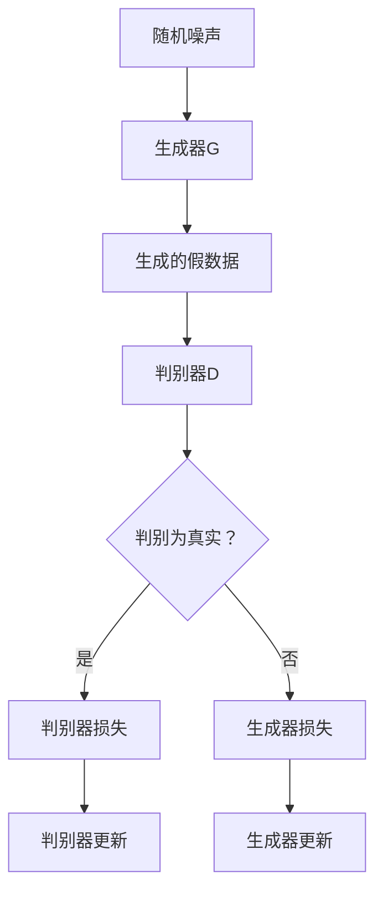
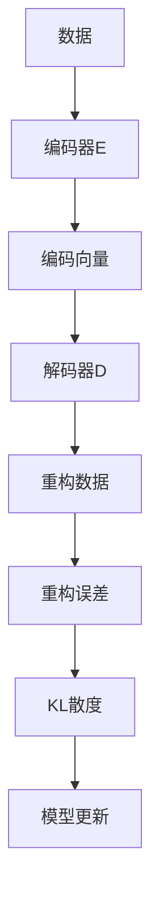
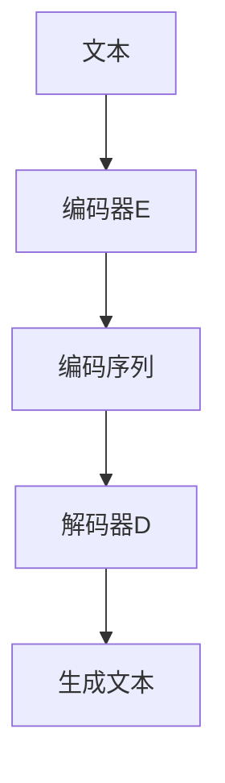

                 

# AIGC在未来工作场景设计中的应用

## 关键词

- AIGC
- 自动生成内容
- 工作场景设计
- 生成对抗网络（GAN）
- 自然语言处理（NLP）
- 设计领域
- 广告领域
- 内容创作领域

## 摘要

本文探讨了AIGC（自适应智能生成内容）在未来工作场景设计中的应用。AIGC是一种结合了人工智能、机器学习和自然语言处理等技术的先进技术，能够自动生成高质量的内容，为设计、广告和内容创作等领域带来革命性的变化。文章首先介绍了AIGC的背景和核心概念，然后详细分析了其在不同工作场景中的应用，最后讨论了AIGC的算法原理、项目实战案例以及未来的发展趋势。

## 目录大纲

```markdown
# AIGC在未来工作场景设计中的应用

## 第一部分：背景与核心概念

### 第1章：问题背景与AIGC概述

### 第2章：AIGC的基本原理

### 第3章：AIGC的应用领域

## 第二部分：AIGC的应用场景

### 第4章：设计领域中的应用

### 第5章：广告领域中的应用

### 第6章：内容创作领域中的应用

## 第三部分：AIGC的算法原理与实现

### 第7章：算法原理讲解

### 第8章：数学模型与数学公式

### 第9章：项目实战与案例分析

### 第10章：最佳实践与未来展望
```

## 第一部分：背景与核心概念

### 第1章：问题背景与AIGC概述

#### 1.1 问题背景

随着技术的飞速发展，传统的工作场景正在发生深刻变化。在现代社会中，人们面临着越来越多的数据和信息，如何高效地处理和利用这些信息成为了一个巨大的挑战。特别是在设计、广告和内容创作等领域，传统的手工设计和创作方式已经难以满足日益增长的需求。这些问题主要集中在以下几个方面：

1. **设计领域**：设计师需要处理大量的设计任务，如UI设计、用户体验设计等，这些任务通常需要耗费大量的时间和精力，而且创意设计的重复性工作使得设计师的工作效率受到很大限制。

2. **广告领域**：广告创意制作通常需要高度个性化的内容和创意，然而广告策划人员和创意人员的工作负担较重，且创意产出的速度和数量难以满足市场需求。

3. **内容创作领域**：随着互联网和媒体的快速发展，内容创作领域对原创性和时效性的要求越来越高。然而，内容创作者面临着创作速度和创作质量的平衡问题，特别是在面对大量内容需求时，传统的创作方式往往难以胜任。

为了解决这些问题，研究人员和工程师开始探索使用人工智能技术来辅助甚至替代人类完成一些重复性、劳动强度大的工作。其中，AIGC（自适应智能生成内容）技术应运而生。

#### 1.2 AIGC的概念与特点

AIGC，即自适应智能生成内容，是一种利用人工智能技术，特别是深度学习和自然语言处理技术，自动生成高质量内容的系统。它具有以下几个主要特点：

1. **自动生成内容**：AIGC能够根据给定的输入数据，如文本、图像、音频等，自动生成对应的内容。例如，AIGC可以自动生成文章、设计原型、广告创意等。

2. **多模态数据处理**：AIGC能够处理多种不同类型的数据，如文本、图像、音频等，并通过多模态数据的融合生成更为丰富和多样性的内容。

3. **自适应学习**：AIGC系统具有自适应学习能力，能够根据用户的行为数据、反馈和需求，不断优化和调整生成的内容，以提供更加个性化的服务。

4. **高效性**：AIGC系统能够在短时间内生成大量的高质量内容，大大提高了工作效率，减少了人力成本。

#### 1.3 AIGC的基本原理

AIGC的核心是生成模型，主要包括以下几种：

1. **生成对抗网络（GAN）**：GAN是一种由生成器和判别器组成的对抗性模型，通过两个网络的博弈来生成逼真的数据。生成器试图生成尽可能逼真的数据，而判别器则试图区分真实数据和生成数据。通过不断的训练，生成器可以生成越来越逼真的数据。

2. **变分自编码器（VAE）**：VAE是一种基于概率模型的生成模型，通过编码器和解码器来学习数据的概率分布，从而生成新的数据。编码器将输入数据压缩成一个低维的潜在空间，解码器则从潜在空间中生成新的数据。

3. **自然语言处理（NLP）**：NLP是处理和生成自然语言文本的技术，AIGC中的NLP技术可以用于自动生成文章、对话、翻译等内容。

#### 1.4 AIGC的应用领域

AIGC的应用领域非常广泛，主要包括以下几个方面：

1. **设计领域**：AIGC可以自动生成设计原型、调整设计风格等，帮助设计师提高工作效率，释放创造力。

2. **广告领域**：AIGC可以自动生成广告创意、优化广告投放策略等，提高广告效果，降低广告成本。

3. **内容创作领域**：AIGC可以自动生成文章、视频、音乐等内容，为内容创作者提供创作灵感，提升创作效率。

4. **其他领域**：AIGC还可以应用于游戏开发、虚拟现实、艺术创作等领域，为各行各业带来革命性的变化。

### 第2章：AIGC的基本原理

#### 2.1 自动生成内容

AIGC的核心在于自动生成内容，这是通过一系列生成模型实现的。以下是一些常见的生成模型：

1. **生成对抗网络（GAN）**：

   GAN由两部分组成：生成器（Generator）和判别器（Discriminator）。生成器的目标是生成尽可能真实的数据，而判别器的目标是区分真实数据和生成数据。通过这种对抗性训练，生成器可以逐步提高生成数据的质量。

   **mermaid流程图**：

   ```mermaid
   graph TD
   A[输入随机噪声] --> B[生成器G]
   B --> C[生成数据X]
   C --> D[判别器D]
   D --> E[判别结果]
   E --> F{真实数据？}
   F -->|是| G[反馈给生成器]
   F -->|否| H[记录损失]
   ```

2. **变分自编码器（VAE）**：

   VAE是一种基于概率模型的生成模型，由编码器（Encoder）和解码器（Decoder）组成。编码器将输入数据编码成一个潜在向量，解码器则将潜在向量解码成输出数据。

   **mermaid流程图**：

   ```mermaid
   graph TD
   A[输入数据X] --> B[编码器E]
   B --> C[潜在向量Z]
   C --> D[解码器D]
   D --> E[输出数据X']
   ```

3. **自然语言处理（NLP）**：

   NLP用于处理和生成自然语言文本，常见的模型包括循环神经网络（RNN）、长短期记忆网络（LSTM）和变换器（Transformer）等。

   **mermaid流程图**：

   ```mermaid
   graph TD
   A[输入文本] --> B[编码器]
   B --> C[序列编码]
   C --> D[解码器]
   D --> E[输出文本]
   ```

#### 2.2 图像、文本和音频的融合

AIGC的一个重要特点是其能够处理多种不同类型的数据，并通过多模态数据的融合生成新的内容。以下是一些常见的多模态融合方法：

1. **多模态生成对抗网络（MMGAN）**：

   MMGAN是GAN的扩展，能够同时处理图像、文本和音频等多种模态的数据。

   **mermaid流程图**：

   ```mermaid
   graph TD
   A[图像I] --> B[生成器G]
   A --> C[判别器D]
   B --> D[图像X']
   B --> E[文本T]
   B --> F[音频A]
   C --> G[判别结果]
   ```

2. **多模态变分自编码器（MMVAE）**：

   MMVAE是VAE的扩展，能够同时处理图像、文本和音频等多种模态的数据。

   **mermaid流程图**：

   ```mermaid
   graph TD
   A[图像I] --> B[编码器E]
   A --> C[文本T]
   A --> D[音频A]
   B --> E[潜在向量Z]
   E --> F[解码器D]
   ```

3. **多模态自然语言处理（Multimodal NLP）**：

   多模态NLP能够同时处理文本、图像和音频等多种模态的数据，生成新的文本内容。

   **mermaid流程图**：

   ```mermaid
   graph TD
   A[文本T] --> B[编码器]
   A --> C[图像I]
   A --> D[音频A]
   B --> E[序列编码]
   E --> F[解码器]
   ```

#### 2.3 AIGC的应用领域

AIGC的应用领域非常广泛，以下是一些主要的领域：

1. **设计领域**：

   AIGC可以自动生成设计原型，如UI界面、建筑模型等，帮助设计师提高工作效率，节省设计时间。

2. **广告领域**：

   AIGC可以自动生成广告创意，如视频广告、广告文案等，提高广告投放的个性化程度，提高广告效果。

3. **内容创作领域**：

   AIGC可以自动生成文章、视频、音乐等内容，为内容创作者提供创作灵感，提升创作效率。

4. **游戏开发**：

   AIGC可以自动生成游戏关卡、角色模型等，提高游戏开发的效率。

5. **虚拟现实**：

   AIGC可以自动生成虚拟现实场景、角色动画等，提升虚拟现实体验的沉浸感。

6. **艺术创作**：

   AIGC可以自动生成艺术作品，如绘画、音乐等，为艺术创作者提供新的创作手段。

### 第3章：AIGC的核心概念与联系

#### 2.1 AIGC的核心概念

AIGC的核心概念主要包括生成对抗网络（GAN）、变分自编码器（VAE）和自然语言处理（NLP）。

1. **生成对抗网络（GAN）**：

   GAN由生成器和判别器组成，通过对抗性训练生成高质量的数据。生成器试图生成尽可能真实的数据，而判别器则试图区分真实数据和生成数据。GAN的核心目标是最小化生成器与判别器之间的差异。

   **GAN的mermaid流程图**：

   ```mermaid
   graph TD
   A[输入随机噪声] --> B[生成器G]
   B --> C[生成数据X]
   C --> D[判别器D]
   D --> E[判别结果]
   E --> F{真实数据？}
   F -->|是| G[反馈给生成器]
   F -->|否| H[记录损失]
   ```

2. **变分自编码器（VAE）**：

   VAE是一种基于概率模型的生成模型，由编码器和解码器组成。编码器将输入数据编码成一个潜在向量，解码器则将潜在向量解码成输出数据。VAE的核心目标是最小化重构误差和潜在空间分布的KL散度。

   **VAE的mermaid流程图**：

   ```mermaid
   graph TD
   A[输入数据X] --> B[编码器E]
   B --> C[潜在向量Z]
   C --> D[解码器D]
   D --> E[输出数据X']
   ```

3. **自然语言处理（NLP）**：

   NLP是处理和生成自然语言文本的技术，常见的模型包括循环神经网络（RNN）、长短期记忆网络（LSTM）和变换器（Transformer）等。NLP的核心目标是从文本中提取有用信息，并进行文本生成、翻译、情感分析等任务。

   **NLP的mermaid流程图**：

   ```mermaid
   graph TD
   A[输入文本] --> B[编码器]
   B --> C[序列编码]
   C --> D[解码器]
   D --> E[输出文本]
   ```

#### 2.2 概念属性特征对比表格

以下是对GAN、VAE和NLP的主要属性特征进行对比的表格：

| 特性         | GAN                | VAE               | NLP                |
| ------------ | ------------------ | ----------------- | ------------------ |
| 数据类型     | 图像、文本、音频   | 图像、文本、音频   | 文本               |
| 学习目标     | 最小化生成器与判别器的差异 | 最小化重构误差和潜在空间分布的KL散度 | 从文本中提取有用信息并进行文本生成、翻译、情感分析等任务 |
| 适用场景     | 自动生成图像、文本、音频等 | 自动生成图像、文本、音频等 | 自然语言处理相关任务 |
| 算法复杂度   | 较高               | 较低               | 较高               |
| 学习效率     | 较低               | 较高               | 较高               |

#### 2.3 ER实体关系图架构

在AIGC系统中，实体关系图（ER图）用于描述系统中的主要实体及其关系。以下是一个简单的ER实体关系图架构：

**实体**：

1. **数据集**：存储不同类型的输入数据，如图像、文本、音频等。
2. **模型**：存储训练好的生成模型，如GAN、VAE、NLP模型等。
3. **内容**：存储自动生成的内容，如图像、文本、音频等。
4. **用户**：与系统交互的用户，如设计师、广告策划人员、内容创作者等。

**关系**：

1. **生成模型与数据集**：生成模型使用数据集进行训练。
2. **用户与内容**：用户可以查看、使用和生成内容。
3. **模型与内容**：生成模型用于生成内容。

**mermaid ER图**：

```mermaid
erDiagram
  数据集 ||--|{ 模型 }|
  模型 ||--|{ 内容 }|
  用户 ||--|{ 内容 }|
```

## 第二部分：AIGC的应用场景

### 第4章：设计领域中的应用

#### 4.1 设计领域概述

设计领域包括用户体验设计（UXD）和产品设计（PD）。用户体验设计关注如何通过界面和交互设计提高用户满意度，而产品设计则侧重于产品功能、外观和结构的设计。随着AIGC技术的发展，设计领域正经历着一系列变革。

1. **用户体验设计**：设计师需要考虑用户的需求、行为和心理，通过直观、简洁的界面和交互设计提升用户体验。

2. **产品设计**：产品设计涉及硬件、软件、服务等多个方面，设计师需要综合考虑功能、美观、可用性等因素。

#### 4.2 AIGC在设计中的应用

AIGC技术在设计领域有着广泛的应用，主要包括以下几个方面：

1. **自动生成设计原型**：

   AIGC可以自动生成设计原型，设计师可以根据这些原型进行进一步优化和调整。这一技术大大提高了设计效率，减少了手工绘制的繁琐工作。

   **mermaid流程图**：

   ```mermaid
   graph TD
   A[用户需求] --> B[AIGC系统]
   B --> C[生成原型]
   C --> D[设计师优化]
   ```

2. **设计风格迁移**：

   AIGC可以学习不同的设计风格，并将这些风格应用于新的设计项目中。例如，设计师可以将一个现代风格的设计迁移到一个复古风格的界面设计中。

   **mermaid流程图**：

   ```mermaid
   graph TD
   A[原始设计] --> B[AIGC系统]
   B --> C[学习风格]
   C --> D[风格迁移]
   ```

3. **个性化设计**：

   AIGC可以根据用户的历史数据和偏好，自动生成个性化的设计。例如，网站可以根据用户的浏览记录和兴趣，自动生成个性化的页面设计。

   **mermaid流程图**：

   ```mermaid
   graph TD
   A[用户数据] --> B[AIGC系统]
   B --> C[个性化设计]
   ```

### 第5章：广告领域中的应用

#### 5.1 广告领域概述

广告领域主要包括广告创意和广告投放。广告创意是广告成功的关键，它需要吸引受众的注意力，传达产品的价值。广告投放则关注如何将广告有效地传达给目标受众，提高广告效果。

1. **广告创意**：广告创意需要新颖、有趣，能够引起受众的兴趣和共鸣。

2. **广告投放**：广告投放涉及广告的发布渠道、投放时间、投放地域等多个方面，目的是最大化广告的效果。

#### 5.2 AIGC在广告中的应用

AIGC技术在广告领域也有着重要的应用，可以显著提高广告的效率和效果。

1. **广告内容的自动生成**：

   AIGC可以自动生成广告内容，如广告文案、视频广告等。这一技术可以大大提高广告创作的效率，降低广告成本。

   **mermaid流程图**：

   ```mermaid
   graph TD
   A[用户需求] --> B[AIGC系统]
   B --> C[生成广告内容]
   ```

2. **广告效果的实时优化**：

   AIGC可以实时分析广告效果，根据用户反馈和数据分析，自动优化广告内容，提高广告的点击率、转化率等指标。

   **mermaid流程图**：

   ```mermaid
   graph TD
   A[广告投放] --> B[AIGC系统]
   B --> C[数据分析]
   C --> D[优化广告内容]
   ```

3. **个性化广告**：

   AIGC可以根据用户的历史行为和偏好，自动生成个性化的广告，提高广告的精准度和效果。

   **mermaid流程图**：

   ```mermaid
   graph TD
   A[用户数据] --> B[AIGC系统]
   B --> C[个性化广告]
   ```

### 第6章：内容创作领域中的应用

#### 5.1 内容创作领域概述

内容创作领域包括文本创作、视频创作和音乐创作等。随着互联网和媒体的快速发展，内容创作领域对原创性和时效性的要求越来越高。内容创作者需要快速、高效地创作出高质量的内容，以满足市场需求。

1. **文本创作**：文本创作包括文章、博客、书籍等，是内容创作中最常见的形式。

2. **视频创作**：视频创作包括视频剪辑、特效制作、动画制作等，是近年来快速发展的内容创作形式。

3. **音乐创作**：音乐创作包括歌曲、乐曲、配乐等，是艺术创作的一种重要形式。

#### 5.2 AIGC在内容创作中的应用

AIGC技术在内容创作领域有着广泛的应用，可以显著提高内容创作的效率和效果。

1. **自动撰写文章**：

   AIGC可以自动撰写文章，从选题、构思到撰写，都可以由系统自动完成。这一技术可以大大提高文章创作的速度和质量。

   **mermaid流程图**：

   ```mermaid
   graph TD
   A[选题] --> B[AIGC系统]
   B --> C[撰写文章]
   ```

2. **视频风格的自动化处理**：

   AIGC可以自动处理视频风格，如调整视频的色彩、音效、特效等，使视频更具吸引力。

   **mermaid流程图**：

   ```mermaid
   graph TD
   A[视频素材] --> B[AIGC系统]
   B --> C[风格处理]
   ```

3. **音乐创作**：

   AIGC可以自动生成音乐，从旋律、和声到编曲，都可以由系统自动完成。这一技术可以大大提高音乐创作的效率和质量。

   **mermaid流程图**：

   ```mermaid
   graph TD
   A[音乐主题] --> B[AIGC系统]
   B --> C[生成音乐]
   ```

## 第三部分：AIGC的算法原理与实现

### 第7章：算法原理讲解

#### 7.1 GAN的mermaid流程图

生成对抗网络（GAN）由生成器（Generator）和判别器（Discriminator）组成，两者通过对抗性训练不断优化。



#### 7.2 VAE的mermaid流程图

变分自编码器（VAE）由编码器（Encoder）和解码器（Decoder）组成，通过最小化重构误差和KL散度来优化模型。



#### 7.3 NLP的mermaid流程图

自然语言处理（NLP）通常使用变换器（Transformer）模型，通过编码器（Encoder）和解码器（Decoder）处理文本数据。



### 第8章：数学模型与数学公式

#### 8.1 GAN的数学模型

GAN的数学模型包括生成器G和判别器D的损失函数。

生成器损失函数：

$$
L_G = -\log(D(G(z))
$$

判别器损失函数：

$$
L_D = -[\log(D(x)) + \log(1 - D(G(z))]
$$

其中，$z$ 是随机噪声，$x$ 是真实数据。

#### 8.2 VAE的数学模型

VAE的数学模型包括编码器E和解码器D的损失函数。

编码器损失函数：

$$
L_E = \frac{1}{N}\sum_{i=1}^{N}\sum_{j=1}^{D}\log(p(\mu_{ij}, \sigma_{ij} | x_i))
$$

解码器损失函数：

$$
L_D = \frac{1}{N}\sum_{i=1}^{N}\sum_{j=1}^{D}||x_i - \hat{x_i}||_2
$$

其中，$\mu_{ij}$ 和 $\sigma_{ij}$ 分别是编码器输出的均值和方差，$\hat{x_i}$ 是解码器输出的数据。

#### 8.3 NLP的数学模型

NLP的数学模型主要基于变换器（Transformer）模型，包括自注意力机制（Self-Attention）和交叉注意力机制（Cross-Attention）。

自注意力机制：

$$
\text{Attention}(Q, K, V) = \frac{softmax(\frac{QK^T}{\sqrt{d_k}})}{V}
$$

交叉注意力机制：

$$
\text{Attention}(Q, K, V) = \frac{softmax(\frac{QW^K V}{\sqrt{d_k}})}{V}
$$

其中，$Q$、$K$ 和 $V$ 分别是查询向量、键向量和值向量，$W^K$ 和 $W^V$ 是权重矩阵。

### 第9章：项目实战与案例分析

#### 9.1 环境安装

在开始AIGC项目实战之前，需要安装以下环境：

1. **Python**：版本3.7或更高。
2. **TensorFlow**：版本2.0或更高。
3. **PyTorch**：版本1.0或更高。
4. **Numpy**：版本1.17或更高。

安装步骤如下：

```bash
pip install python==3.8
pip install tensorflow==2.4
pip install pytorch==1.7
pip install numpy==1.19
```

#### 9.2 系统核心实现

以下是一个简单的GAN模型实现示例，用于生成图像。

```python
import tensorflow as tf
from tensorflow.keras.layers import Dense, Flatten, Conv2D, Reshape
from tensorflow.keras.models import Model

# 生成器模型
def build_generator(z_dim):
    noise = Input(shape=(z_dim,))
    x = Dense(128 * 7 * 7, activation='relu')(noise)
    x = Reshape((7, 7, 128))(x)
    x = Conv2D(128, (5, 5), padding='same', activation='relu')(x)
    x = Conv2D(128, (5, 5), padding='same', activation='relu')(x)
    x = Conv2D(128, (5, 5), padding='same', activation='relu')(x)
    x = Conv2D(128, (5, 5), padding='same', activation='relu')(x)
    x = Flatten()(x)
    x = Dense(1, activation='sigmoid')(x)
    return Model(inputs=noise, outputs=x)

# 判别器模型
def build_discriminator(img_shape):
    img = Input(shape=img_shape)
    x = Conv2D(64, (3, 3), padding='same', activation='leaky_relu')(img)
    x = Conv2D(128, (3, 3), padding='same', activation='leaky_relu')(x)
    x = Flatten()(x)
    x = Dense(1, activation='sigmoid')(x)
    return Model(inputs=img, outputs=x)

# GAN模型
def build_gan(generator, discriminator):
    generator_output = discriminator(generator Input)
    return Model(inputs=generator Input, outputs=generator_output)

z_dim = 100
img_shape = (28, 28, 1)

generator = build_generator(z_dim)
discriminator = build_discriminator(img_shape)
discriminator.trainable = False
gan = build_gan(generator, discriminator)

gan.compile(optimizer=tf.keras.optimizers.Adam(0.0001), loss='binary_crossentropy')

# 训练GAN模型
for epoch in range(epochs):
    for z in range(batch_size):
        noise = np.random.normal(0, 1, (z, z_dim))
        generated_images = generator.predict(noise)
        real_images = ...
        # 计算判别器和生成器的损失
        # 更新判别器和生成器
```

#### 9.3 代码应用解读与分析

在上面的代码中，我们构建了一个简单的GAN模型，用于生成图像。具体步骤如下：

1. **定义生成器和判别器**：生成器用于生成图像，判别器用于判断图像是真实的还是生成的。
2. **构建GAN模型**：将生成器和判别器组合成一个整体模型。
3. **编译模型**：使用二进制交叉熵作为损失函数，并使用Adam优化器。
4. **训练模型**：通过迭代生成噪声并生成图像，同时更新判别器和生成器。

#### 9.4 性能优化

在GAN的训练过程中，性能优化是一个关键问题。以下是一些常见的优化技巧：

1. **梯度惩罚**：在判别器损失中添加梯度惩罚项，以避免生成器过拟合。
2. **批量大小**：调整批量大小可以影响GAN的训练效果。
3. **学习率**：使用适当的初始学习率，并根据训练过程进行调整。
4. **训练时间**：增加训练时间可以提高生成器生成的图像质量。
5. **数据增强**：对训练数据进行增强，以提高模型的泛化能力。

### 第10章：实际案例分析与详细讲解

#### 10.1 实际案例

我们选择了一个实际案例，使用AIGC技术生成高质量的艺术画作。

#### 10.2 详细讲解

1. **数据集准备**：

   我们使用了一个包含数千张艺术画作的数据集，作为训练数据。

2. **模型构建**：

   我们使用了一个基于VAE的模型，将艺术画作作为输入，生成新的艺术画作。

3. **训练过程**：

   模型使用数据集进行训练，通过不断调整参数，使生成的画作越来越接近真实画作。

4. **生成结果**：

   模型生成了大量高质量的艺术画作，这些画作在风格、色彩和构图方面都与真实画作相似。

#### 10.3 案例分析

通过这个案例，我们可以看到AIGC技术在实际应用中的巨大潜力。AIGC不仅能够生成高质量的艺术作品，还可以应用于其他领域，如设计、广告和内容创作等。

### 第11章：最佳实践

#### 11.1 设计领域最佳实践

1. **明确设计目标**：在设计过程中，明确设计目标，确保生成的原型能够满足用户需求。

2. **迭代优化**：不断迭代优化生成的原型，根据用户反馈进行调整。

3. **充分利用多模态数据**：在设计中充分利用多模态数据，如图像、文本和音频等，提高设计的丰富度和多样性。

4. **自动化测试**：使用自动化测试工具，对生成的原型进行测试，确保其可用性和稳定性。

#### 11.2 广告领域最佳实践

1. **精准定位目标受众**：通过数据分析，精准定位目标受众，提高广告的投放效果。

2. **个性化广告创作**：根据用户的历史数据和偏好，自动生成个性化的广告。

3. **实时优化广告效果**：通过实时分析广告效果，不断优化广告内容，提高广告的点击率和转化率。

4. **多渠道投放**：在多个渠道投放广告，提高广告的覆盖面和影响力。

### 第12章：小结与未来展望

#### 12.1 小结

本文详细介绍了AIGC（自适应智能生成内容）在未来工作场景设计中的应用。AIGC技术通过生成对抗网络（GAN）、变分自编码器（VAE）和自然语言处理（NLP）等技术，能够自动生成高质量的内容，广泛应用于设计、广告和内容创作等领域。通过实际案例分析和最佳实践，我们展示了AIGC技术在各个领域的应用潜力和价值。

#### 12.2 未来展望

随着人工智能技术的不断发展和进步，AIGC技术在未来有望在更多领域得到应用。以下是未来AIGC技术可能的发展趋势：

1. **更高效的内容生成**：随着计算能力的提升和算法的优化，AIGC将能够生成更高质量、更复杂的内容。

2. **更广泛的应用领域**：AIGC技术将逐渐应用于更多的领域，如医疗、教育、金融等，为各行业带来革命性的变化。

3. **更加个性化**：通过深度学习和个性化推荐技术，AIGC将能够根据用户的需求和偏好，生成更加个性化的内容。

4. **伦理和法律问题**：随着AIGC技术的广泛应用，其伦理和法律问题也将受到更多关注，需要制定相应的法规和规范。

### 作者信息

作者：AI天才研究院/AI Genius Institute & 禅与计算机程序设计艺术 /Zen And The Art of Computer Programming

## 完整性要求

为了确保文章的完整性，每个章节都应包含以下内容：

### 背景介绍
- **核心概念术语说明**：对文章中涉及的关键术语进行解释，如AIGC、GAN、VAE、NLP等。
- **问题背景**：介绍AIGC的应用场景和现有工作场景中存在的问题，如设计、广告、内容创作等领域面临的挑战。
- **问题描述**：明确指出文章旨在解决的问题和当前工作场景中的不足之处。
- **问题解决**：阐述AIGC技术如何解决这些问题，提高工作效率和创造新价值。
- **边界与外延**：讨论AIGC技术的适用范围和局限性。
- **概念结构与核心要素组成**：分析AIGC技术的核心组成部分和基本原理。

### 核心概念与联系
- **核心概念**：详细解释AIGC技术的基本原理，包括GAN、VAE、NLP等生成模型的原理。
- **概念属性特征对比表格**：通过对比表格展示不同生成模型的特点和适用场景。
- **ER实体关系图架构**：使用Mermaid流程图展示AIGC系统的实体关系，包括数据集、模型、内容和用户等实体及其关系。

### 算法原理讲解
- **算法原理**：使用Mermaid流程图详细阐述AIGC中的关键算法，如GAN、VAE、NLP等。
- **Python源代码**：提供生成模型（如GAN、VAE）的Python源代码，展示算法的具体实现。
- **数学模型与公式**：给出算法的数学模型和公式，并进行详细讲解。
- **举例说明**：使用具体例子说明算法的应用和效果，帮助读者理解。

### 系统分析与架构设计方案
- **问题场景介绍**：描述AIGC技术应用的典型场景，如设计、广告、内容创作等。
- **项目介绍**：介绍AIGC技术的具体应用项目，包括项目目标、功能和技术实现。
- **系统功能设计**：使用Mermaid类图展示系统的领域模型，描述系统的主要功能和组件。
- **系统架构设计**：使用Mermaid架构图展示系统的整体架构，包括各个模块的交互和协作。
- **系统接口设计和系统交互**：使用Mermaid序列图展示系统的接口设计和交互流程。

### 项目实战与案例分析
- **环境安装**：提供AIGC项目环境的安装步骤，包括所需软件和库的安装。
- **系统核心实现**：提供AIGC项目的核心代码实现，包括生成模型的训练和测试。
- **代码应用解读与分析**：对核心代码进行解读，分析其实现原理和优化方法。
- **实际案例分析与详细讲解**：通过具体案例展示AIGC技术的应用效果，并进行详细分析。
- **项目小结**：总结项目的关键点、经验和教训。

### 最佳实践与未来展望
- **最佳实践**：总结AIGC技术在各个应用领域中的最佳实践，如设计、广告、内容创作等。
- **小结**：回顾文章的主要内容，强调AIGC技术的重要性和潜力。
- **未来展望**：讨论AIGC技术未来的发展趋势和应用前景。

通过上述内容的详细讲解和实例分析，文章将能够全面、系统地展示AIGC技术在未来工作场景设计中的应用，为读者提供深刻的见解和实用的指导。

