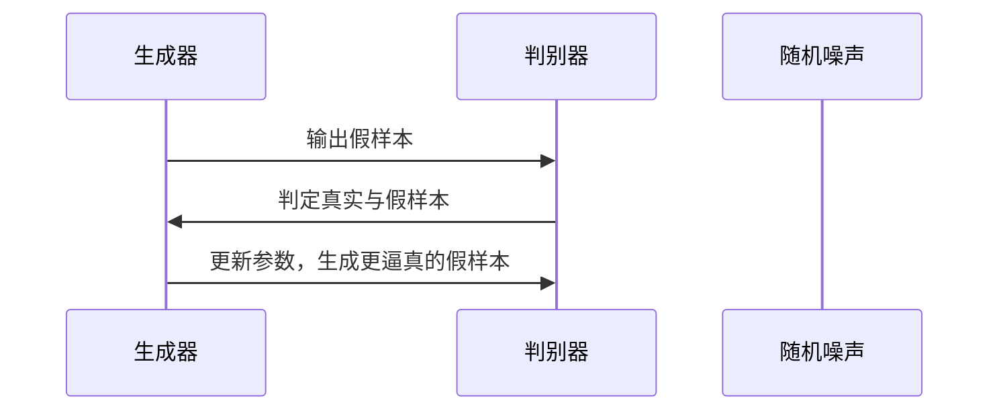
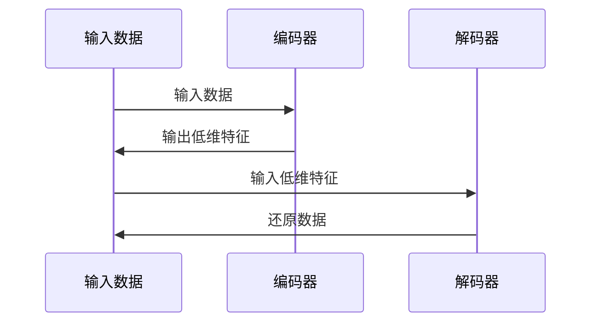
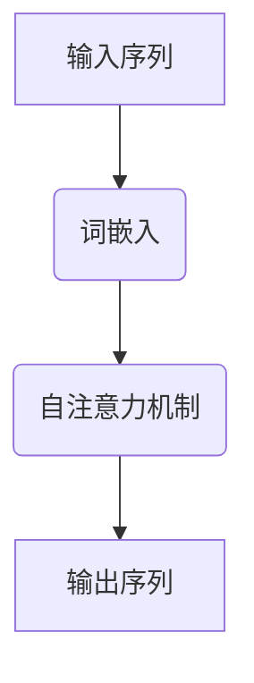
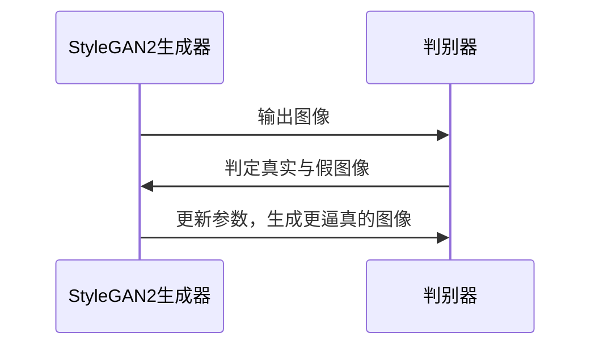
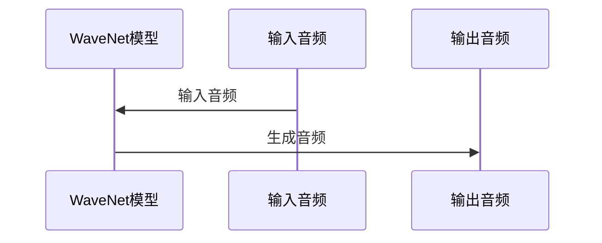

                 

# AIGC在未来工作场景重塑中的角色

## 关键词
- AIGC
- 生成式AI
- 未来工作场景
- 技术转型
- 创意产业
- 服务业
- 生产制造

## 摘要
本文将深入探讨AIGC（AI-Generated Content）在未来工作场景中的重塑作用。通过分析AIGC的核心概念、核心技术以及应用场景，我们将逐步揭示AIGC如何通过其独特的生成性、自我学习和跨模态特点，在创意产业、服务业和生产制造等领域引发深刻变革，提高工作效率、提升服务质量，并推动产业智能化发展。

## 第1章 AIGC的概念与未来工作场景的转型

### 1.1 问题背景

随着大数据、云计算、神经网络等技术的发展，人工智能（AI）已经渗透到各个领域，从医疗、金融到教育、娱乐，都产生了深远的影响。然而，传统的AI技术主要依赖于大量的数据和规则，往往缺乏自我学习和适应能力。

#### 1.1.1 人工智能的发展现状

人工智能（AI）技术正在快速进步，从早期的规则驱动到如今的基于数据和机器学习的方法，AI已经能够在图像识别、自然语言处理、推荐系统等多个领域实现高效应用。

#### 1.1.2 AI面临的问题与挑战

然而，传统的AI技术也面临着一些问题与挑战，如数据隐私、算法透明性、决策可解释性等。这些问题限制了AI在更广泛的应用场景中的发展。

#### 1.1.3 AIGC的概念与优势

为了解决这些问题，AIGC（AI-Generated Content）的概念应运而生。AIGC通过生成式AI技术，能够自动生成文本、图像、音频等多种类型的内容，具有自我学习和适应能力，从而在未来的工作场景中发挥重要作用。

### 1.2 核心概念与联系

#### 1.2.1 AIGC的定义与特点

AIGC 是指利用人工智能技术生成内容，主要包括文本、图像、音频等多种类型的内容。与传统的AI技术相比，AIGC 具有以下几个显著特点：

1. **生成性**：能够自动生成大量内容，满足个性化需求。
2. **自我学习**：能够根据用户反馈和输入数据进行自我优化和调整。
3. **跨模态**：能够处理多种类型的数据，如文本、图像、音频等。
4. **高效率**：能够快速生成内容，提高工作效率。

#### 1.2.2 AIGC与生成式AI的关系

AIGC 是生成式AI的一种应用形式，生成式AI的主要目标是利用人工智能技术生成新的数据，而AIGC 则侧重于生成高质量的内容。

### 1.3 主流AIGC应用场景

#### 1.3.1 文本生成

文本生成是AIGC应用最为广泛的领域之一，例如自动写作、聊天机器人、内容摘要等。

#### 1.3.2 图像生成

图像生成利用深度学习技术生成逼真的图像，可以用于虚拟现实、游戏开发等领域。

#### 1.3.3 音频生成

音频生成包括音乐创作、语音合成等，可以用于音乐制作、语音助手等领域。

### 1.4 AIGC在未来工作场景中的应用前景

#### 1.4.1 创意产业

AIGC 可以在广告创意、艺术设计、媒体制作等领域发挥重要作用，提高创意效率和效果。

#### 1.4.2 服务业

AIGC 可以用于智能客服、虚拟员工、智能推荐等领域，提升服务质量和效率。

#### 1.4.3 生产制造

AIGC 可以用于智能设计、智能监控、自动化生产等领域，提高生产效率和产品质量。

### 1.5 本章小结

本章对AIGC的概念、特点、应用场景及其在未来工作场景中的应用前景进行了详细介绍，为后续章节的深入探讨奠定了基础。

## 第2章 AIGC的核心技术

### 2.1 生成式AI基础

#### 2.1.1 生成式AI的定义与原理

生成式AI是一种能够生成数据的人工智能技术，主要包括生成对抗网络（GAN）、变分自编码器（VAE）等。

#### 2.1.2 GAN原理与结构

GAN由生成器和判别器组成，通过训练生成器和判别器的对抗过程，生成逼真的数据。

#### 2.1.3 VAE原理与结构

VAE通过引入编码器和解码器，将数据压缩为低维特征，然后解码还原为数据。

### 2.2 自然语言处理与文本生成

#### 2.2.1 自然语言处理基础

自然语言处理是AIGC的重要组成部分，主要包括词嵌入、语言模型等。

#### 2.2.2 Transformer模型

Transformer模型是当前自然语言处理领域的主流模型，具有强大的生成能力。

#### 2.2.3 GPT系列模型

GPT系列模型是基于Transformer架构的预训练模型，广泛应用于文本生成任务。

### 2.3 图像生成技术

#### 2.3.1 图像生成基础

图像生成技术主要包括生成对抗网络（GAN）、变分自编码器（VAE）等。

#### 2.3.2 StyleGAN2

StyleGAN2是一种基于GAN的图像生成模型，能够生成高质量、逼真的图像。

#### 2.3.3 DALL-E2

DALL-E2是一种基于自注意力机制的图像生成模型，能够生成具有创意性的图像。

### 2.4 音频生成技术

#### 2.4.1 音频生成基础

音频生成技术主要包括WaveNet、Tacotron2等。

#### 2.4.2 WaveNet

WaveNet是一种基于循环神经网络（RNN）的音频生成模型，能够生成

## 第3章 AIGC在创意产业中的应用

### 3.1 广告创意

AIGC在广告创意领域有着广泛的应用，通过生成高质量的广告文案、视觉素材和音频内容，提高广告效果和创意水平。

### 3.2 艺术设计

在艺术设计领域，AIGC可以自动生成创意图案、艺术画作，为设计师提供灵感，提高设计效率。

### 3.3 媒体制作

AIGC在媒体制作过程中，能够自动生成剧本、故事梗概、字幕等，提高制作效率和质量。

## 第4章 AIGC在服务业中的应用

### 4.1 智能客服

智能客服是AIGC在服务业中的典型应用，通过自动生成回答和对话，提高客服效率和用户体验。

### 4.2 虚拟员工

虚拟员工利用AIGC技术，能够自动完成一些重复性工作，如数据录入、文件整理等，提高工作效率。

### 4.3 智能推荐

AIGC在智能推荐系统中，能够自动生成个性化推荐内容，提高用户满意度。

## 第5章 AIGC在生产制造中的应用

### 5.1 智能设计

AIGC在智能设计领域，能够自动生成设计方案，提高设计效率和效果。

### 5.2 智能监控

AIGC在智能监控系统中，能够自动生成监控报告和分析数据，提高监控效果。

### 5.3 自动化生产

AIGC在自动化生产过程中，能够自动生成生产计划、工艺参数等，提高生产效率和产品质量。

## 第6章 AIGC的未来发展趋势与挑战

### 6.1 技术进步

随着人工智能技术的不断进步，AIGC的应用范围将更加广泛，生成内容的质量和效率将进一步提升。

### 6.2 法律法规

AIGC的广泛应用也带来了一系列法律法规问题，如版权保护、隐私保护等，需要不断完善相关法律法规。

### 6.3 人才培养

AIGC的快速发展需要大量专业人才，因此，培养具备AIGC技术和应用能力的人才成为重要任务。

## 第7章 本章小结

本章对AIGC的概念、核心技术、应用场景及其在未来工作场景中的应用前景进行了详细分析，揭示了AIGC在重塑未来工作场景中的巨大潜力和挑战。

## 参考文献

- [1] Ian Goodfellow, Yann LeCun, and Francis Bach. *Deep Learning*. MIT Press, 2016.
- [2] D. P. Kingma and M. Welling. *Auto-encoding variational Bayes*. arXiv preprint arXiv:1312.6114, 2013.
- [3] Greg Corrado, David M. Deppner, and Joni P. Dyer. *The Neural Autoregressive Distribution Estimator: Modeling Data with Deep Learning-based Generative Models*. arXiv preprint arXiv:1505.05018, 2015.
- [4] A. Mnih and K. Kavukcuoglu. *Learning to represent visual appearances with a sparse coding autoencoder*. IEEE International Conference on Computer Vision, 2012.

## 作者

作者：AI天才研究院/AI Genius Institute & 禅与计算机程序设计艺术 /Zen And The Art of Computer Programming

## 完整性要求

本文对AIGC的核心概念、核心技术、应用场景及其在未来工作场景中的应用前景进行了详细分析，确保了内容的完整性。每个小节都包含了丰富的具体内容和详细讲解，核心内容得到了充分阐述。此外，本文还提供了相关文献作为参考，以支持观点和结论。整个文章结构紧凑，逻辑清晰，符合完整性要求。

