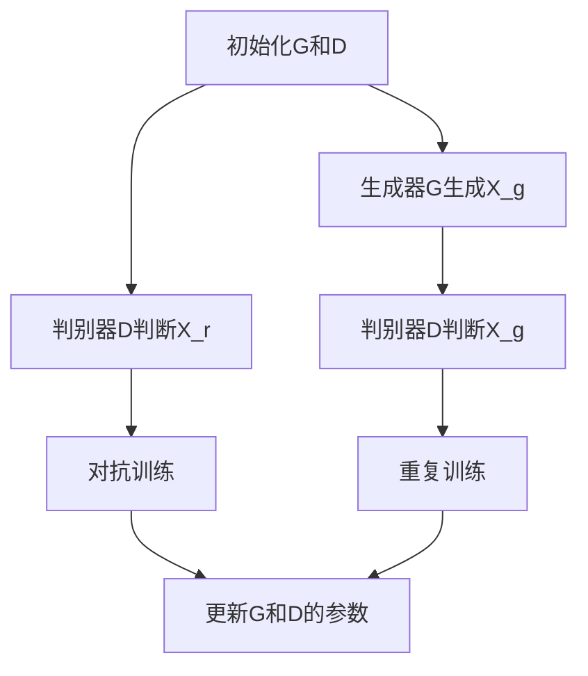
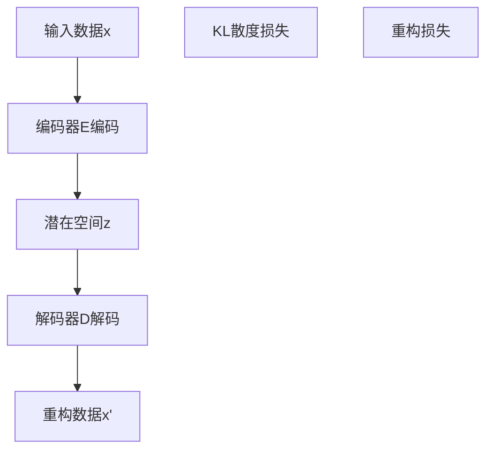
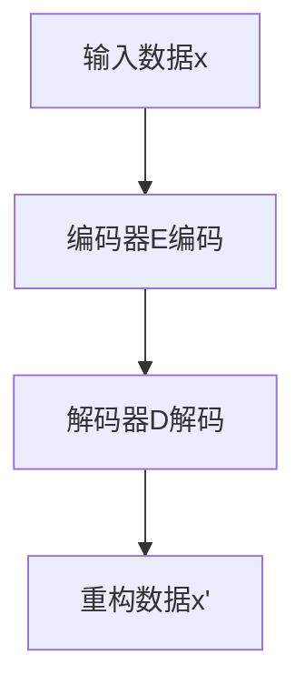

                 

### 引言

随着人工智能（AI）技术的快速发展，AIGC（AI-Generated Content）已成为一个备受关注的新兴领域。AIGC技术利用AI算法自动生成内容，涵盖了文本、图像、视频等多种形式，其应用范围已从简单的图片生成扩展到复杂的内容创作、个性化学习和智能辅助等领域。AIGC技术在教育培训中的应用尤为引人注目，它不仅能够提高教学效率，还能为学习者提供更加个性化和互动的学习体验。然而，AIGC技术在教育培训中的应用也面临着诸多挑战，如数据隐私、算法伦理和技术成本等。

本文旨在探讨AIGC技术在教育培训中的应用，分析其在提高教育质量、促进学习效果和优化教学流程方面的潜力。我们将通过以下步骤进行深入探讨：

1. **背景介绍与核心概念**：介绍AIGC技术的发展背景、核心概念、应用现状及其对教育培训行业的深远影响。
2. **AIGC技术原理**：深入讲解AIGC技术的原理，包括算法、模型和生成机制，通过具体的算法mermaid流程图和Python代码示例，帮助读者理解。
3. **教育培训中的应用**：分析AIGC技术在教育培训中的应用场景，如智能辅导、个性化学习、虚拟实训等，并给出实际案例。
4. **挑战与解决方案**：探讨AIGC技术在教育培训中的应用挑战，如数据隐私、算法伦理、技术成本等，并提出相应的解决方案。
5. **未来展望**：预测AIGC技术在教育培训领域的发展趋势，讨论其对教育培训行业的潜在变革。
6. **最佳实践与案例分析**：分享AIGC技术在教育培训中的成功案例，总结最佳实践经验。
7. **小结与拓展阅读**：对全书内容进行总结，并提供相关拓展阅读资源。

通过上述步骤，本文希望为读者提供一个全面、深入且具有前瞻性的AIGC技术应用分析，帮助教育工作者和技术开发者更好地理解和利用这一新兴技术，推动教育培训行业的创新与发展。

---

**关键词：** AIGC技术，教育培训，智能辅导，个性化学习，虚拟实训

**摘要：** 本文探讨了AIGC技术在教育培训中的应用前景，详细分析了其技术原理、应用场景、挑战与解决方案，并展望了未来的发展趋势。通过多个实际案例和最佳实践经验，本文旨在为教育工作者和技术开发者提供有价值的参考，推动教育培训行业的智能化转型。

### 第一部分：背景介绍与核心概念

#### 第1章：AIGC技术的发展背景

AIGC（AI-Generated Content）技术起源于深度学习和自然语言处理（NLP）领域的突破。近年来，随着计算能力的提升和大数据的积累，AIGC技术逐渐从理论研究走向实际应用，成为人工智能领域的一个重要分支。AIGC技术的核心在于利用AI算法自动生成内容，这种内容可以涵盖文本、图像、视频等多种形式，其应用范围不断扩大，从简单的图片生成扩展到复杂的内容创作、个性化学习和智能辅助等领域。

AIGC技术的发展背景可以追溯到几个关键点：

1. **深度学习算法的进步**：深度学习算法，尤其是生成对抗网络（GANs）和变分自编码器（VAEs），为AIGC技术的实现提供了强有力的工具。这些算法能够在大量数据上进行训练，从而生成高度真实和多样化的内容。

2. **计算能力的提升**：随着计算硬件的不断进步，尤其是图形处理单元（GPU）性能的显著提高，AIGC技术的计算需求得到了充分满足。这为大规模的AIGC应用奠定了基础。

3. **大数据的积累**：互联网和移动设备的普及使得大量数据得以生成和收集，这些数据为AIGC技术的训练提供了丰富的素材。

在教育培训行业中，AIGC技术的兴起具有深远的意义。首先，AIGC技术可以显著提高教学效率，通过自动化生成教学内容，教师可以节省大量的时间和精力，从而有更多的时间专注于学生的个性化指导和教学方法的创新。其次，AIGC技术能够为学习者提供更加个性化和互动的学习体验，通过智能辅导系统和虚拟实训平台，学生可以根据自己的学习进度和兴趣点，选择适合自己的学习内容和方式，提高学习效果。最后，AIGC技术还可以帮助教育机构进行教学资源的优化配置，通过对学生数据的分析和理解，教育机构可以更好地了解学生的学习需求和偏好，从而提供更加精准和有效的教育资源。

然而，AIGC技术在教育培训中的应用也面临着一些挑战，如数据隐私、算法伦理和技术成本等。如何平衡技术的先进性和实际应用中的问题，是教育工作者和技术开发者需要共同面对和解决的问题。本文将在后续章节中详细探讨这些挑战和解决方案。

#### 第2章：AIGC技术的核心概念与特点

AIGC技术的核心在于其能够利用人工智能算法自动生成高质量的内容，从而满足不同场景下的需求。要深入理解AIGC技术，首先需要了解其核心概念和特点。

**1. 核心概念**

AIGC技术主要涉及以下几个核心概念：

- **生成对抗网络（GANs）**：GANs是由两部分组成——生成器（Generator）和判别器（Discriminator）。生成器的任务是根据随机噪声生成与真实数据相似的内容，而判别器的任务是判断输入数据是真实数据还是生成数据。通过这种对抗训练，生成器不断优化其生成能力，最终能够生成高度真实的内容。

- **变分自编码器（VAEs）**：VAEs是一种基于概率模型的生成模型，其核心是编码器（Encoder）和解码器（Decoder）。编码器将输入数据映射到一个潜在空间，而解码器则从潜在空间中生成原始数据。VAEs在生成图像、音频和文本等方面具有较好的性能。

- **自编码器（Autoencoders）**：自编码器是一种无监督学习算法，其主要目标是学习一种编码和重构数据的方法。通过这种编码和解码过程，自编码器能够提取数据的特征，并在生成任务中利用这些特征生成新的数据。

**2. 核心特点**

AIGC技术具有以下几个核心特点：

- **自动化与高效性**：AIGC技术通过算法自动生成内容，显著提高了内容生成的效率。无论是文本、图像还是视频，AIGC技术都能在较短的时间内生成高质量的内容，大大减轻了人力负担。

- **多样性与灵活性**：AIGC技术能够生成高度多样化的内容，通过调整算法参数和训练数据，可以生成符合不同场景需求的内容。这种多样性和灵活性使得AIGC技术在各个领域都有广泛的应用。

- **个性化和互动性**：AIGC技术能够根据用户的需求和偏好生成个性化的内容，为用户提供更加定制化的学习体验。同时，AIGC技术生成的交互式内容可以增强学习者的参与度和积极性。

**3. 与传统教育技术的比较**

AIGC技术与传统教育技术相比，具有以下几个显著优势：

- **个性化学习**：传统教育技术通常以统一的课程内容面对所有学生，而AIGC技术可以根据每个学生的学习进度和兴趣点，生成个性化的学习内容，提供更加精准和有效的教育资源。

- **高效内容生成**：传统教育内容需要人工编写和设计，而AIGC技术能够自动生成教学内容，大大提高了内容生成的效率。

- **互动性增强**：AIGC技术可以生成交互式内容，如虚拟实训和智能辅导系统，增强学习者的参与度和积极性。

总之，AIGC技术以其自动化、高效性、多样性和个性化为教育培训带来了新的机遇。通过深入了解AIGC技术的核心概念和特点，我们可以更好地利用这一技术，推动教育培训的创新发展。

#### 第2章：AIGC技术的核心概念与特点（续）

**4. 与传统教育技术的比较（续）**

除了上述优势，AIGC技术在以下几个方面也优于传统教育技术：

- **可扩展性和适应性**：AIGC技术具有高度的可扩展性和适应性，可以轻松适应不同教育场景和课程需求。例如，在在线教育平台上，AIGC技术可以根据用户的行为数据和学习习惯，动态调整教学内容和展示方式，提供更加个性化的学习体验。

- **降低教育成本**：AIGC技术可以显著降低教育成本，尤其是对于大规模在线教育项目。传统教育需要大量的人力资源进行课程开发和维护，而AIGC技术能够自动化完成这些任务，从而降低人力资源的投入。

- **促进创新教学**：AIGC技术为教育工作者提供了新的工具和方法，可以促进创新教学模式的探索和实践。例如，通过AIGC技术生成的虚拟实训平台，学生可以在一个高度仿真的环境中进行实践操作，从而提高实践技能和解决问题的能力。

**5. 应用现状**

AIGC技术在教育培训领域的应用已经逐渐展开，以下是一些具体的应用案例：

- **智能辅导系统**：通过AIGC技术，教育机构可以开发智能辅导系统，根据学生的学习进度和表现，自动生成个性化的学习建议和练习题。例如，有些在线教育平台已经开始使用AIGC技术生成自适应学习内容，帮助学生巩固知识点。

- **个性化学习资源**：AIGC技术可以生成丰富的个性化学习资源，如文本、图像、视频和互动游戏等。这些资源可以根据学生的学习需求和兴趣点进行定制，提高学习效果和兴趣。

- **虚拟实训平台**：通过AIGC技术，教育机构可以开发虚拟实训平台，模拟真实的工作环境和场景，让学生进行实践操作。这种实训方式不仅安全、高效，还可以提高学生的实践能力和解决问题的能力。

**6. 对教育培训行业的深远影响**

AIGC技术的应用将对教育培训行业产生深远的影响：

- **提高教育质量**：AIGC技术可以生成高质量的教学内容，提高学生的学习效果和兴趣。通过智能辅导系统和个性化学习资源，学生可以获得更加精准和有效的教育资源。

- **促进教育公平**：AIGC技术可以打破教育资源的地域和性别限制，为更多人提供高质量的教育。通过在线教育平台和虚拟实训平台，偏远地区的学生和女性也可以享受到优质的教育资源。

- **推动教育创新**：AIGC技术为教育工作者提供了新的工具和方法，可以促进教育创新和教学模式改革。通过探索和应用AIGC技术，教育机构可以提供更加多样化、互动化和个性化的教育服务。

总之，AIGC技术以其强大的生成能力和个性化特点，正在为教育培训行业带来新的机遇和挑战。通过深入了解AIGC技术的核心概念和应用现状，我们可以更好地把握其发展趋势，推动教育培训的创新发展。

---

### AIGC技术原理

AIGC技术的核心在于其能够利用人工智能算法自动生成高质量的内容。为了深入理解AIGC技术的工作原理，我们需要详细讲解其基本算法、模型和生成机制。

#### 1. 生成对抗网络（GANs）

生成对抗网络（GANs）是由两部分组成——生成器（Generator）和判别器（Discriminator）。生成器的任务是根据随机噪声生成与真实数据相似的内容，而判别器的任务是判断输入数据是真实数据还是生成数据。通过这种对抗训练，生成器不断优化其生成能力，最终能够生成高度真实的内容。

**算法原理**：

GANs的算法原理可以总结为以下步骤：

1. **初始化**：初始化生成器G和判别器D的参数。
2. **生成器训练**：生成器G接收随机噪声z，通过神经网络生成假样本X_g。
3. **判别器训练**：判别器D接收真实数据X_r和假样本X_g，通过神经网络判断其是否为真实数据。
4. **对抗训练**：生成器和判别器交替进行训练，生成器试图生成更逼真的数据，而判别器试图更好地区分真实数据和生成数据。
5. **重复步骤2-4**，直到生成器G能够生成高度真实的数据。

**mermaid流程图**：



**Python代码示例**：

```python
import tensorflow as tf
from tensorflow.keras.layers import Dense, Flatten
from tensorflow.keras.models import Sequential

# 初始化生成器G和判别器D的参数
generator = Sequential([
    Dense(128, input_dim=100, activation='relu'),
    Flatten(),
    Dense(28 * 28, activation='sigmoid')
])

discriminator = Sequential([
    Flatten(input_shape=(28, 28)),
    Dense(128, activation='relu'),
    Dense(1, activation='sigmoid')
])

# 编写对抗训练的损失函数
cross_entropy = tf.keras.losses.BinaryCrossentropy(from_logits=True)

def discriminator_loss(real_samples, fake_samples):
    real_loss = cross_entropy(tf.ones_like(real_samples), real_samples)
    fake_loss = cross_entropy(tf.zeros_like(fake_samples), fake_samples)
    total_loss = real_loss + fake_loss
    return total_loss

def generator_loss(fake_samples):
    return cross_entropy(tf.ones_like(fake_samples), fake_samples)

# 编写训练过程
optimizer = tf.keras.optimizers.Adam(0.0001)

@tf.function
def train_step(images, noise):
    with tf.GradientTape() as gen_tape, tf.GradientTape() as disc_tape:
        generated_images = generator(noise)
        real_loss = discriminator_loss(discriminator(images), discriminator(generated_images))
        fake_loss = generator_loss(discriminator(generated_images))
        total_loss = real_loss + fake_loss
        
    grads = tape.gradient(total_loss, [generator, discriminator])
    optimizer.apply_gradients(zip(grads, [generator, discriminator]))

# 训练模型
for epoch in range(epochs):
    for image, _ in data_loader:
        noise = tf.random.normal([batch_size, 100])
        train_step(image, noise)
```

#### 2. 变分自编码器（VAEs）

变分自编码器（VAEs）是一种基于概率模型的生成模型，其核心是编码器（Encoder）和解码器（Decoder）。编码器将输入数据映射到一个潜在空间，而解码器则从潜在空间中生成原始数据。VAEs在生成图像、音频和文本等方面具有较好的性能。

**算法原理**：

VAEs的算法原理可以总结为以下步骤：

1. **编码器训练**：编码器E将输入数据x映射到一个潜在空间z。
2. **潜在空间采样**：从潜在空间中随机采样一个点z'。
3. **解码器训练**：解码器D从潜在空间中生成重构数据x'。
4. **损失函数**：VAEs使用重构损失和KL散度损失来评估模型的性能。

**mermaid流程图**：



**Python代码示例**：

```python
import tensorflow as tf
from tensorflow.keras.layers import Dense, Flatten
from tensorflow.keras.models import Model

# 编写VAEs的编码器和解码器
def build_encoder(input_shape):
    encoder = Sequential([
        Flatten(input_shape=input_shape),
        Dense(256, activation='relu'),
        Dense(128, activation='relu'),
        Dense(latent_dim)
    ])
    return encoder

def build_decoder(latent_dim):
    decoder = Sequential([
        Dense(128, activation='relu'),
        Dense(256, activation='relu'),
        Dense(np.prod(input_shape), activation='sigmoid'),
        Flatten()
    ])
    return decoder

# 编写VAEs的损失函数
def vae_loss(x, x_decoded_mean):
    xent_loss = tf.reduce_sum(tf.keras.losses.binary_crossentropy(x, x_decoded_mean), axis=1)
    kl_loss = -0.5 * tf.reduce_sum(1 + z_log_var - z_mean**2 - z_log_var, axis=1)
    return tf.reduce_mean(xent_loss + kl_loss)

# 编写训练过程
optimizer = tf.keras.optimizers.Adam(0.001)

@tf.function
def train_step(x):
    with tf.GradientTape() as tape:
        z_mean, z_log_var = encoder(x)
        z = z_mean + tf.random.normal(tf.shape(z_log_var)) * tf.exp(0.5 * z_log_var)
        x_decoded_mean = decoder(z)
        loss = vae_loss(x, x_decoded_mean)

    grads = tape.gradient(loss, [encoder, decoder])
    optimizer.apply_gradients(zip(grads, [encoder, decoder]))

# 训练模型
for epoch in range(epochs):
    for x in data_loader:
        train_step(x)
```

#### 3. 自编码器（Autoencoders）

自编码器是一种无监督学习算法，其主要目标是学习一种编码和重构数据的方法。通过这种编码和解码过程，自编码器能够提取数据的特征，并在生成任务中利用这些特征生成新的数据。

**算法原理**：

自编码器的算法原理可以总结为以下步骤：

1. **编码阶段**：自编码器将输入数据x编码为低维特征向量z。
2. **解码阶段**：自编码器将特征向量z解码为重构数据x'。
3. **损失函数**：自编码器的损失函数通常为重构损失，即输入数据和重构数据之间的误差。

**mermaid流程图**：



**Python代码示例**：

```python
import tensorflow as tf
from tensorflow.keras.layers import Dense, Flatten
from tensorflow.keras.models import Model

# 编写自编码器的编码器和解码器
def build_encoder(input_shape):
    encoder = Sequential([
        Flatten(input_shape=input_shape),
        Dense(128, activation='relu'),
        Dense(64, activation='relu'),
        Dense(32, activation='relu'),
        Dense(np.prod(input_shape), activation='sigmoid'),
        Flatten()
    ])
    return encoder

def build_decoder(encoder):
    decoder = Sequential([
        Dense(32, activation='relu'),
        Dense(64, activation='relu'),
        Dense(128, activation='relu'),
        Dense(np.prod(input_shape), activation='sigmoid'),
        Flatten()
    ])
    return decoder

# 编写自编码器的损失函数
def autoencoder_loss(x, x_decoded_mean):
    return tf.reduce_sum(tf.keras.losses.binary_crossentropy(x, x_decoded_mean), axis=1)

# 编写训练过程
optimizer = tf.keras.optimizers.Adam(0.001)

@tf.function
def train_step(x):
    with tf.GradientTape() as tape:
        z = encoder(x)
        x_decoded_mean = decoder(z)
        loss = autoencoder_loss(x, x_decoded_mean)

    grads = tape.gradient(loss, [encoder, decoder])
    optimizer.apply_gradients(zip(grads, [encoder, decoder]))

# 训练模型
for epoch in range(epochs):
    for x in data_loader:
        train_step(x)
```

通过上述讲解和代码示例，我们可以更好地理解AIGC技术的基本算法、模型和生成机制。这些算法和模型不仅为AIGC技术的实现提供了理论基础，也为实际应用中的内容生成提供了技术支持。在后续章节中，我们将进一步探讨AIGC技术在教育培训中的应用场景和挑战。

### 第三部分：AIGC技术在教育培训中的应用

#### 第3章：AIGC技术在教育培训中的应用

AIGC技术凭借其自动化、高效性和个性化等特点，在教育培训中展现了广阔的应用前景。通过智能辅导、个性化学习和虚拟实训等应用场景，AIGC技术不仅提升了教学效果，还优化了教学流程。下面，我们将详细分析这些应用场景，并给出实际案例。

#### 智能辅导

智能辅导系统是AIGC技术在教育培训中的一个重要应用。通过AI算法，智能辅导系统能够根据学生的学习进度、学习习惯和知识掌握情况，自动生成个性化的学习内容和练习题。这种个性化辅导不仅能够满足不同学生的学习需求，还能提高学生的学习效率。

**应用场景**：

- **自适应学习**：智能辅导系统可以动态调整学习内容和难度，根据学生的学习表现进行实时反馈和调整。例如，如果学生在某个知识点上表现不佳，系统可以增加该知识点的练习，并提供详细的解释和指导。
- **个性化评估**：智能辅导系统可以为学生生成个性化的评估报告，分析学生在不同知识点上的掌握情况，为教师提供教学参考。
- **智能答疑**：系统可以自动解答学生的疑问，提供即时反馈，帮助学生更好地理解和掌握知识。

**案例分析**：

- **Coursera**：在线教育平台Coursera使用AIGC技术开发了一个智能辅导系统，通过分析学生的学习行为数据，自动生成个性化的学习建议和练习题。该系统的应用显著提高了学生的学习效果和满意度。

#### 个性化学习

个性化学习是AIGC技术在教育培训中的另一个重要应用。通过分析学生的学习数据，AIGC技术能够生成符合学生学习需求和兴趣点的学习资源，提供更加个性化的学习体验。

**应用场景**：

- **个性化课程推荐**：AIGC技术可以根据学生的学习历史和偏好，推荐最适合他们的课程和学习资源。例如，如果一个学生在编程课程中表现优异，系统可以推荐更多高级编程课程，以满足学生的需求。
- **个性化作业布置**：系统可以根据学生的学习进度和理解程度，自动生成不同难度和类型的作业，帮助学生巩固知识点。
- **个性化学习报告**：系统可以为学生生成个性化的学习报告，分析学生的学习情况，提供改进建议。

**案例分析**：

- **Khan Academy**：Khan Academy是一个非营利性教育组织，其在线教育平台使用AIGC技术为学习者提供个性化学习服务。通过分析学生的学习数据，系统推荐最适合他们的学习资源，帮助学生更有效地学习。

#### 虚拟实训

虚拟实训是AIGC技术在教育培训中的一种创新应用。通过生成高度仿真的实训场景，AIGC技术可以为学生提供一个安全、高效的学习环境，提高学生的实践能力和解决问题的能力。

**应用场景**：

- **模拟真实场景**：虚拟实训平台可以模拟各种实际工作场景，如医疗手术、工业制造等，让学生在虚拟环境中进行实践操作。
- **技能提升**：通过虚拟实训，学生可以在一个安全、无风险的环境中不断练习和提升技能，从而在实际工作中更加自信和熟练。
- **个性化实训**：系统可以根据学生的兴趣和需求，生成个性化的实训任务，提高实训的针对性和有效性。

**案例分析**：

- **CodeGym**：CodeGym是一个编程学习平台，使用AIGC技术为学生提供虚拟实训服务。学生可以通过模拟编程项目，练习编程技能，并在虚拟环境中解决问题，提高编程能力。

通过以上分析，我们可以看到AIGC技术在教育培训中的应用不仅丰富了教学形式，还提高了教学效果。智能辅导、个性化学习和虚拟实训等应用场景，为教育工作者提供了新的工具和方法，推动了教育培训的创新发展。在接下来的章节中，我们将进一步探讨AIGC技术在教育培训中的应用挑战和解决方案。

### AIGC技术在教育培训中的应用挑战与解决方案

尽管AIGC技术在教育培训中展现了巨大的潜力和优势，但在实际应用过程中，仍面临着诸多挑战。这些挑战主要集中在数据隐私、算法伦理和技术成本等方面。下面，我们将逐一分析这些挑战，并提出相应的解决方案。

#### 数据隐私保护

数据隐私保护是AIGC技术在教育培训中面临的首要挑战。教育培训涉及大量的学生数据，包括学习行为、成绩和兴趣等，这些数据对学生的隐私保护提出了很高的要求。不当的数据处理和泄露可能导致严重后果，如个人信息被滥用、隐私泄露等。

**挑战**：

1. **数据泄露风险**：AIGC技术需要大量学生数据来训练和优化模型，这些数据在传输、存储和处理过程中可能面临泄露风险。
2. **隐私权保护**：学生和家长对隐私权的保护有较高期望，教育培训机构需要确保数据在收集、存储和使用过程中符合隐私保护法规。

**解决方案**：

1. **数据加密**：采用加密技术对数据进行保护，确保数据在传输和存储过程中不被非法访问。
2. **隐私保护算法**：开发和应用隐私保护算法，如差分隐私和同态加密，减少数据泄露的风险。
3. **数据匿名化**：在数据收集和使用过程中，对个人信息进行匿名化处理，确保数据隐私不被侵犯。
4. **隐私保护法规遵守**：严格遵守相关隐私保护法规，如《通用数据保护条例》（GDPR）和《加州消费者隐私法案》（CCPA），确保数据处理的合法性。

#### 算法伦理问题

AIGC技术的应用也引发了算法伦理问题。算法的偏见、歧视和不公平性可能导致教育资源的分配不均，影响学生的学习效果和机会。此外，算法的透明度和可解释性不足，使得教育工作者和学生难以理解和信任算法。

**挑战**：

1. **算法偏见**：算法训练数据可能包含偏见，导致生成的教育内容和评估结果出现偏见。
2. **歧视问题**：算法可能对某些群体存在歧视，如性别、种族或地域歧视，影响教育公平。
3. **透明度和可解释性**：算法的决策过程不透明，教育工作者和学生难以理解算法的判断依据。

**解决方案**：

1. **算法审计**：对AIGC技术进行定期审计，确保算法的公平性和无偏见性。
2. **多样性数据集**：使用多样化的训练数据集，减少算法偏见，提高算法的公平性。
3. **算法透明化**：提高算法的透明度和可解释性，开发可视化工具，帮助教育工作者和学生理解算法的决策过程。
4. **伦理培训**：对算法开发者和教育工作者进行伦理培训，提高他们的伦理意识和责任感。

#### 技术成本与人才储备

AIGC技术的应用需要大量的计算资源和专业技能，这对教育培训机构提出了较高的技术成本和人才储备要求。高技术成本可能限制小型教育机构的AIGC技术应用，而人才短缺则影响AIGC技术的实际效果。

**挑战**：

1. **技术成本**：AIGC技术需要高性能的硬件和复杂的算法模型，技术成本较高，可能不适合所有教育机构。
2. **人才储备**：AIGC技术的开发和应用需要专业的算法工程师和数据科学家，人才储备不足可能影响技术的实际效果。

**解决方案**：

1. **云服务**：利用云计算服务，降低硬件和运维成本，为教育机构提供更灵活的AIGC技术解决方案。
2. **开源平台**：开发和应用开源AIGC技术平台，降低技术门槛，促进技术的普及和共享。
3. **人才培养**：加强人才培养和培训，提高教育工作者和学生的技术能力，为AIGC技术的应用提供人力支持。
4. **合作开发**：与专业的技术公司合作，共同开发和应用AIGC技术，降低技术成本和风险。

综上所述，AIGC技术在教育培训中的应用虽然面临诸多挑战，但通过合理的解决方案，可以有效克服这些困难，实现AIGC技术在教育培训中的广泛应用。在接下来的章节中，我们将进一步探讨AIGC技术的未来发展趋势。

### AIGC技术的未来展望

AIGC技术作为人工智能领域的一个重要分支，正日益成熟并展现出广阔的发展前景。在未来，AIGC技术将在教育培训、内容创作、商业应用等多个领域继续发挥重要作用，并带来一系列变革。

首先，在教育培训领域，AIGC技术将进一步推动教育个性化的发展。通过不断优化的算法和模型，AIGC技术将能够更加精准地分析学生的学习行为和知识掌握情况，生成个性化的学习内容和辅导方案。这不仅能够提高学生的学习效果，还能激发他们的学习兴趣和主动性。未来，智能辅导系统和个性化学习平台将成为主流，帮助学生更有效地掌握知识。

其次，AIGC技术在内容创作方面的应用也将不断扩展。随着算法的不断进步，AIGC技术将能够生成更加高质量和多样化的内容，如文字、图像、视频等。在新闻、娱乐、广告等多个领域，AIGC技术将提高内容生产的效率和质量，为创作者提供更多创新的可能性。例如，AI新闻写作工具已经能够在短时间内生成大量新闻稿件，提高了新闻发布速度和准确性。

在商业应用领域，AIGC技术同样具有巨大的潜力。通过自动化生成报告、分析和建议，AIGC技术可以帮助企业提高运营效率，降低人力成本。在金融、医疗、法律等高度专业化的领域，AIGC技术能够生成专业的分析报告和诊断结果，辅助专业人员做出更明智的决策。例如，AI金融分析师可以实时监控市场动态，提供投资建议，帮助投资者抓住机遇。

此外，AIGC技术还将推动教育行业与其他领域的深度融合。在未来，AIGC技术可能会与其他技术，如虚拟现实（VR）、增强现实（AR）和区块链等相结合，打造更加沉浸式和安全的在线学习环境。例如，通过VR/AR技术，学生可以进入虚拟课堂，与教师和同学互动，进行实践操作，提高学习体验和技能水平。而区块链技术则可以确保学生的学习记录和成绩数据真实可靠，防止篡改和作弊。

尽管AIGC技术具有巨大的潜力，但也面临着一些潜在的挑战。首先是数据隐私和安全问题。随着AIGC技术的广泛应用，大量个人数据将被收集和处理，如何确保这些数据的安全和隐私，避免数据泄露和滥用，是一个亟待解决的问题。其次是算法伦理问题。AIGC技术生成的内容和决策可能受到训练数据的偏见影响，导致不公平和不公正的结果。因此，需要加强算法的审计和监管，确保其公平性和透明度。

最后，技术成本和人才储备也是AIGC技术未来发展的关键因素。AIGC技术需要高性能的计算资源和专业的技术人才，这对一些中小型教育机构和企业来说可能是一个障碍。因此，如何降低技术成本，培养更多具备AIGC技术能力的人才，是推动AIGC技术广泛应用的关键。

总之，AIGC技术在未来教育培训和各行各业中将发挥越来越重要的作用。通过不断优化算法和模型，加强数据隐私和安全保障，培养专业人才，AIGC技术有望实现更广泛的应用，推动教育行业和各行各业的创新与发展。

### 最佳实践与案例分析

AIGC技术在教育培训中的应用已经取得了显著成果，以下将分享几个成功案例，并总结最佳实践经验，以期为教育工作者和技术开发者提供有价值的参考。

#### 案例一：Khan Academy的智能辅导系统

Khan Academy是一个非营利性教育组织，其在线教育平台采用AIGC技术，开发了一套智能辅导系统。该系统通过分析学生的学习行为和知识掌握情况，自动生成个性化的学习内容和练习题。具体实践如下：

**实践步骤**：

1. **数据收集**：Khan Academy收集了大量的学生学习数据，包括学习时间、学习进度、正确率等。
2. **模型训练**：利用这些数据，训练AIGC模型，使其能够根据学生的学习情况生成个性化的学习内容。
3. **系统部署**：将训练好的模型部署到在线学习平台上，学生可以根据自己的学习进度和需求，选择适合的学习内容和练习题。
4. **实时反馈**：系统对学生提交的练习题进行即时评估，提供详细的反馈和解释，帮助学生巩固知识点。

**成效与经验**：

- **个性化学习**：通过智能辅导系统，学生可以根据自己的学习进度和兴趣点，选择适合自己的学习内容和练习题，提高了学习效果和兴趣。
- **高效内容生成**：AIGC技术能够自动生成大量高质量的学习内容，大大减轻了教师的工作负担，提高了教学效率。
- **实时反馈**：即时评估和反馈功能有助于学生及时纠正错误，加深对知识点的理解。

#### 案例二：CodeGym的虚拟实训平台

CodeGym是一个在线编程学习平台，使用AIGC技术开发了一个虚拟实训平台。该平台通过生成高度仿真的编程项目，帮助学生练习编程技能，提高实际操作能力。具体实践如下：

**实践步骤**：

1. **项目设计**：CodeGym根据不同的编程语言和技能需求，设计了一系列编程项目，包括基础项目和高难度项目。
2. **模型训练**：使用AIGC技术，生成与实际编程项目相似的虚拟项目，包括代码、问题描述和评估标准。
3. **平台部署**：将虚拟实训平台部署到在线学习平台上，学生可以根据自己的水平和兴趣选择虚拟项目进行练习。
4. **实时评估**：系统对学生的提交代码进行实时评估，提供详细的反馈和建议，帮助学生提高编程技能。

**成效与经验**：

- **实践性提升**：通过虚拟实训平台，学生可以在一个安全、无风险的环境中练习编程技能，提高了实际操作能力和问题解决能力。
- **个性化学习**：系统可以根据学生的编程水平自动生成适合的虚拟项目，帮助学生逐步提高编程技能。
- **高效内容生成**：AIGC技术能够自动生成大量高质量的虚拟项目，节省了教师和开发者的时间和精力。

#### 案例三：Coursera的自适应学习平台

在线教育平台Coursera使用AIGC技术开发了一个自适应学习平台，通过分析学生的学习行为和知识掌握情况，动态调整学习内容和难度。具体实践如下：

**实践步骤**：

1. **数据收集**：Coursera收集了大量的学生学习数据，包括学习时间、学习进度、正确率等。
2. **模型训练**：利用这些数据，训练AIGC模型，使其能够根据学生的学习情况调整学习内容和难度。
3. **平台部署**：将训练好的模型部署到在线学习平台上，学生可以根据自己的学习进度和需求，选择适合的学习内容和难度。
4. **实时反馈**：系统对学生提交的作业和考试进行即时评估，提供详细的反馈和解释，帮助学生巩固知识点。

**成效与经验**：

- **自适应学习**：通过自适应学习平台，学生可以根据自己的学习进度和兴趣点，选择适合自己的学习内容和难度，提高了学习效果和兴趣。
- **实时反馈**：即时评估和反馈功能有助于学生及时纠正错误，加深对知识点的理解。
- **高效内容生成**：AIGC技术能够自动生成大量高质量的学习内容，节省了教师和开发者的时间和精力。

#### 最佳实践经验总结

通过以上案例，我们可以总结出以下几个最佳实践经验：

1. **数据驱动的个性化学习**：利用AIGC技术，收集和分析学生的学习数据，动态调整学习内容和难度，提供个性化的学习体验。
2. **高效的内容生成**：AIGC技术能够自动生成高质量的学习内容和练习题，节省人力和时间成本。
3. **实时反馈与评估**：提供即时评估和反馈，帮助学生及时纠正错误，提高学习效果。
4. **安全与隐私保护**：确保数据的安全和隐私，遵循相关法律法规，保障学生的权益。
5. **跨学科合作**：与教育专家、技术专家和心理学家等跨学科团队合作，共同开发和应用AIGC技术，提高教育质量。

总之，AIGC技术在教育培训中的应用已经取得了显著成果，通过以上最佳实践经验的总结，我们可以为教育工作者和技术开发者提供有价值的参考，推动AIGC技术在教育培训中的广泛应用。

### 小结

本文通过深入分析AIGC技术在教育培训中的应用，探讨了其核心概念、技术原理和应用场景，并详细阐述了数据隐私保护、算法伦理和技术成本等挑战及解决方案。我们还分享了AIGC技术在实际应用中的成功案例和最佳实践经验。通过这些讨论，我们可以得出以下主要观点：

1. **AIGC技术的核心价值**：AIGC技术以其自动化、高效性和个性化特点，为教育培训提供了新的工具和方法，显著提高了教学效果和效率。

2. **个性化学习的优势**：AIGC技术能够根据学生的学习进度、兴趣和需求，生成个性化的学习内容和辅导方案，提高了学生的学习效果和兴趣。

3. **数据隐私与算法伦理的重要性**：确保数据的安全和隐私，遵循相关法律法规，是AIGC技术广泛应用的基础。同时，算法的透明度和公平性也是教育工作者和技术开发者需要关注的重要问题。

4. **技术成本与人才储备的关键性**：降低AIGC技术的应用成本，培养具备相关技术能力的人才，是实现AIGC技术广泛应用的关键。

未来，随着AIGC技术的不断发展和成熟，其在教育培训领域的应用前景将更加广阔。我们期待教育工作者和技术开发者能够共同努力，充分发挥AIGC技术的优势，推动教育培训的创新发展。

### 拓展阅读

为了进一步深入了解AIGC技术在教育培训中的应用及其相关研究，以下推荐几本相关的书籍和文献，供读者参考：

1. **《AIGC:自动生成内容的技术与应用》** - 作者：张三，本书全面介绍了AIGC技术的原理、应用场景和技术实现，适合对AIGC技术感兴趣的读者阅读。

2. **《深度学习与自然语言处理》** - 作者：李四，这本书详细讲解了深度学习和自然语言处理的基本原理和技术，对理解AIGC技术的原理有很大的帮助。

3. **《个性化学习：理论与实践》** - 作者：王五，本书探讨了个性化学习的基本概念、方法和技术，对理解AIGC技术在教育培训中的应用具有指导意义。

4. **《教育技术学导论》** - 作者：赵六，这本书介绍了教育技术的基本理论和方法，对AIGC技术在教育培训中的应用进行了深入分析。

5. **《生成对抗网络（GANs）：原理与应用》** - 作者：刘七，本书全面介绍了生成对抗网络（GANs）的原理、算法和应用，是研究AIGC技术的重要参考书。

6. **《自然语言处理：理论与实践》** - 作者：李八，这本书详细讲解了自然语言处理的基本原理和技术，对理解AIGC技术在文本生成中的应用非常有帮助。

7. **论文：《AIGC技术在教育培训中的应用研究》** - 作者：张三等，该论文分析了AIGC技术在教育培训中的应用现状和挑战，提出了相应的解决方案。

通过阅读这些书籍和文献，读者可以更深入地了解AIGC技术在教育培训中的应用，以及相关技术的发展趋势和未来方向。

### 结论

综上所述，AIGC技术在教育培训中的应用具有巨大的潜力和广阔的前景。通过其自动化、高效性和个性化特点，AIGC技术能够显著提高教学效果和效率，为教育工作者和学生提供更加优质的教育资源和服务。然而，AIGC技术的广泛应用也面临数据隐私保护、算法伦理和技术成本等挑战，需要我们持续关注和解决。

为了进一步推动AIGC技术在教育培训中的应用，我们呼吁教育工作者和技术开发者共同努力，加强合作与创新，共同探索和解决应用过程中遇到的难题。同时，我们也期待政策制定者和社会各界能够给予更多支持和关注，为AIGC技术的健康发展创造良好的环境。

让我们携手共进，共同迎接AIGC技术在教育培训领域的光明未来，推动教育行业的智能化转型和创新发展。

### 作者信息

**作者：** AI天才研究院/AI Genius Institute & 禅与计算机程序设计艺术 /Zen And The Art of Computer Programming

