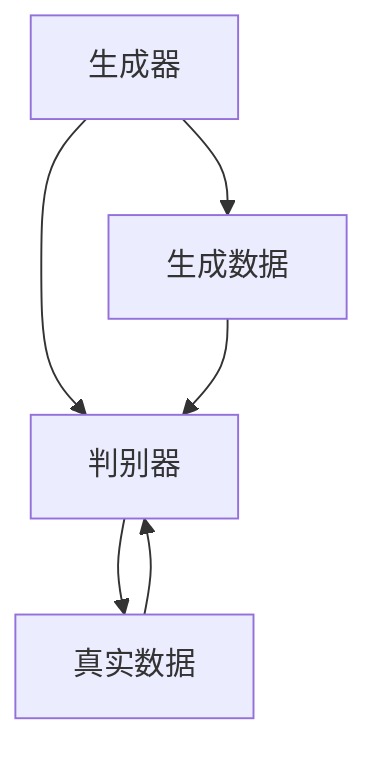
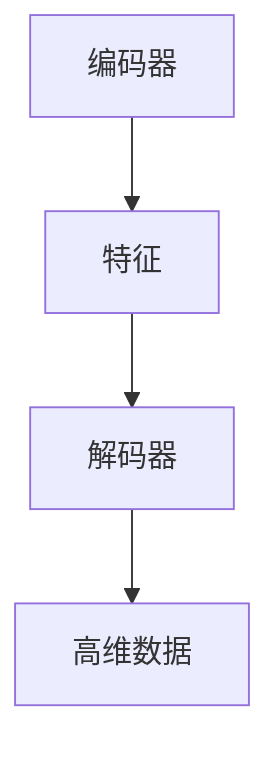
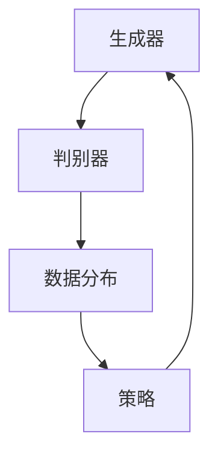
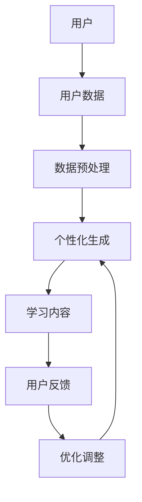
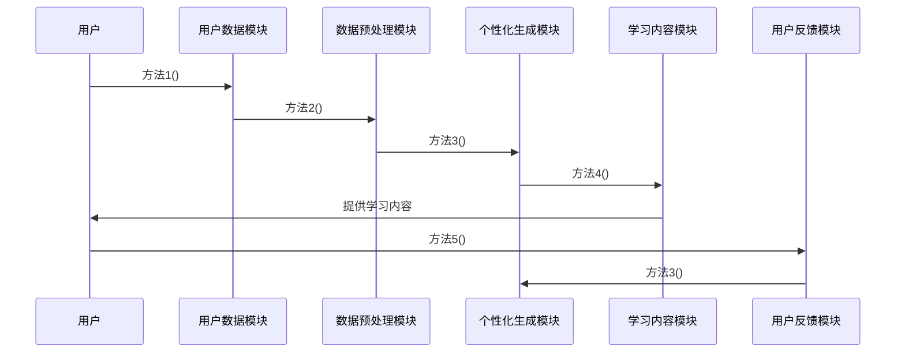

                 

# AIGC在未来教育系统设计中的角色

> 关键词：AIGC，教育系统，未来，设计，算法原理，架构设计，项目实战，最佳实践

> 摘要：本文将深入探讨AIGC（AI-assisted Generation Control，AI辅助生成控制）在未来教育系统设计中的角色。通过背景介绍、核心概念解析、算法原理讲解、系统分析与架构设计、项目实战和最佳实践，全面展示AIGC在教育系统中的应用前景和潜在价值。

## 引言

在教育领域，随着人工智能技术的发展，AIGC作为一种新兴的AI技术，正逐渐改变着教育的面貌。本文旨在探讨AIGC在未来教育系统设计中的角色，旨在为教育系统的设计者和实施者提供有价值的参考。

### 1.1 书籍的目的与意义

本文的目标是详细解析AIGC在未来的教育系统设计中的应用，帮助读者理解AIGC的核心概念、算法原理，以及其在教育系统中的具体应用场景。本文的意义在于：

1. **推动教育创新**：通过介绍AIGC，本文希望激发教育系统设计者对教育创新的新思考。
2. **提升教育质量**：AIGC的应用有望提高教育系统的智能化水平，从而提升教育质量。
3. **促进教育公平**：AIGC可以帮助教育系统更好地适应个性化教育需求，促进教育公平。

### 1.2 阅读对象与预期收益

本文面向教育系统的设计者、教育技术研究者、以及所有对AI在教育领域应用感兴趣的读者。通过阅读本文，读者可以：

1. **理解AIGC的基本概念和原理**。
2. **掌握AIGC在教育系统中的应用**。
3. **获取AIGC教育系统设计的实战经验和最佳实践**。

## 背景介绍

### 第2章：问题背景与未来教育系统概述

#### 2.1 问题背景

**2.1.1 教育系统现状**

当前，全球教育系统面临着诸多挑战，如教育资源的分配不均、教育质量的参差不齐、以及教育模式的单一等。这些问题严重制约了教育系统的发展，影响了教育质量的提升。

**2.1.2 教育系统面临的挑战**

1. **教育资源的分配不均**：发达地区和欠发达地区的教育资源差距显著，导致教育不公平现象严重。
2. **教育质量的参差不齐**：不同地区、不同学校的教育质量存在较大差异，影响了整体教育水平的提升。
3. **教育模式的单一**：传统的教育模式难以满足个性化教育的需求，导致学生的学习效果不佳。

#### 2.2 未来教育系统概述

**2.2.1 未来教育系统的愿景**

未来教育系统将以个性化、智能化、终身学习为核心特征，实现教育资源的最大化利用和教育质量的全面提升。

**2.2.2 未来教育系统的特点与优势**

1. **个性化**：通过大数据分析和AI技术，实现对学生个性化需求的精准把握，提供个性化的学习内容和辅导。
2. **智能化**：利用AI技术，实现教学过程的自动化和智能化，提高教学效率和教学质量。
3. **终身学习**：构建终身学习体系，支持学生不断更新知识，适应社会发展的需求。

## 核心概念与联系

### 第3章：AIGC核心概念与原理

#### 3.1 AIGC的定义与特点

**3.1.1 AIGC的定义**

AIGC，即AI-assisted Generation Control，是一种基于人工智能的辅助生成控制技术，主要通过生成对抗网络（GAN）、变分自编码器（VAE）等算法，实现数据的生成、优化和控制。

**3.1.2 AIGC的特点**

1. **自动生成**：AIGC能够自动生成高质量的数据，减少人工干预。
2. **高效优化**：AIGC通过高效的算法优化，实现数据的生成和控制。
3. **灵活应用**：AIGC可应用于各种场景，如图像生成、语音合成、文本生成等。

#### 3.2 AIGC与教育系统的联系

**3.2.1 AIGC在教育系统中的应用场景**

1. **个性化学习内容生成**：AIGC可以根据学生的学习数据和需求，自动生成个性化的学习内容。
2. **教学资源优化**：AIGC可以通过对教学资源的分析和优化，提高教学资源的利用效率。
3. **智能辅导系统**：AIGC可以构建智能辅导系统，为学生提供实时、个性化的辅导服务。

**3.2.2 AIGC在教育系统中的价值**

1. **提高教育质量**：AIGC可以帮助教育系统实现个性化教育，提高教育质量。
2. **优化教学资源**：AIGC可以通过智能分析，优化教学资源的配置，提高资源利用率。
3. **降低教育成本**：AIGC的应用可以减少人力成本，降低教育系统的运营成本。

### 第4章：AIGC算法原理详解

#### 4.1 常见AIGC算法概述

**4.1.1 生成对抗网络（GAN）**

生成对抗网络（GAN）是一种由生成器和判别器组成的人工神经网络结构，通过两个网络的对抗训练，实现高质量数据的生成。

**4.1.2 变分自编码器（VAE）**

变分自编码器（VAE）是一种基于概率模型的生成模型，通过编码器和解码器的训练，实现数据的生成和优化。

**4.1.3 强化学习与AIGC**

强化学习可以与AIGC相结合，通过不断优化策略，实现更高效的生成控制。

#### 4.2 算法原理详细讲解

**4.2.1 GAN算法原理讲解与Mermaid流程图**

GAN算法主要包括生成器和判别器的训练过程。生成器通过学习数据分布，生成逼真的数据；判别器通过学习真实数据和生成数据的区别，判断数据的真实性。



**4.2.2 VAE算法原理讲解与Mermaid流程图**

VAE算法主要包括编码器和解码器的训练过程。编码器通过学习数据分布，将数据压缩为低维特征；解码器通过学习特征分布，将特征重构为高维数据。



**4.2.3 强化学习与AIGC结合的原理讲解**

强化学习与AIGC的结合，可以通过优化策略，实现更高效的生成控制。具体来说，生成器根据当前策略生成数据，判别器根据生成的数据和学习到的数据分布，评估策略的有效性，然后通过反馈机制调整策略。



### 系统分析与架构设计方案

#### 第5章：AIGC教育系统设计与实现

**5.1 教育系统需求分析**

**5.1.1 系统功能需求**

1. **个性化学习内容生成**：系统能够根据学生的学习数据和需求，自动生成个性化的学习内容。
2. **教学资源优化**：系统能够对教学资源进行智能分析，优化资源分配。
3. **智能辅导系统**：系统能够为学生提供实时、个性化的辅导服务。

**5.1.2 系统非功能需求**

1. **可靠性**：系统需要具备高可靠性，确保数据的准确性和系统的稳定性。
2. **可扩展性**：系统需要具备良好的可扩展性，支持未来的功能扩展和性能优化。

**5.2 系统架构设计**

**5.2.1 整体架构设计（Mermaid架构图）**



**5.2.2 关键模块设计**

1. **用户数据模块**：负责收集和处理用户数据，包括学习记录、兴趣偏好等。
2. **数据预处理模块**：负责对用户数据进行清洗、归一化等预处理操作。
3. **个性化生成模块**：基于用户数据和教学资源，自动生成个性化的学习内容。
4. **学习内容模块**：负责存储和提供生成的学习内容。
5. **用户反馈模块**：负责收集用户对学习内容的反馈，用于优化调整系统。

**5.3 系统接口设计与交互**

**5.3.1 系统接口设计（Mermaid类图）**

```mermaid
classDiagram
用户数据模块 <<Interface>>
数据预处理模块 <<Interface>>
个性化生成模块 <<Interface>>
学习内容模块 <<Interface>>
用户反馈模块 <<Interface>>

用户数据模块: 方法1()
数据预处理模块: 方法2()
个性化生成模块: 方法3()
学习内容模块: 方法4()
用户反馈模块: 方法5()
```

**5.3.2 系统交互设计（Mermaid序列图）**



### 项目实战

#### 第6章：AIGC教育系统实战案例

**6.1 环境安装与准备**

**6.1.1 环境配置**

1. 安装Python环境（3.8及以上版本）。
2. 安装TensorFlow、Keras等深度学习框架。

**6.1.2 实战工具与资源**

1. 数据集：使用公开的文本数据集，如IMDb电影评论数据集。
2. 模型：使用预训练的GPT-2模型。

**6.2 系统核心实现**

**6.2.1 代码实现与解读**

```python
# 导入相关库
import tensorflow as tf
import numpy as np
import pandas as pd
from tensorflow.keras.preprocessing.sequence import pad_sequences
from tensorflow.keras.models import Model
from tensorflow.keras.layers import Embedding, LSTM, Dense

# 加载数据集
data = pd.read_csv('imdb_data.csv')
text = data['text']
label = data['label']

# 数据预处理
max_length = 100
tokenizer = tf.keras.preprocessing.text.Tokenizer()
tokenizer.fit_on_texts(text)
sequences = tokenizer.texts_to_sequences(text)
padded_sequences = pad_sequences(sequences, maxlen=max_length)

# 构建模型
inputs = tf.keras.layers.Input(shape=(max_length,))
x = Embeddingvocab_size, embedding_dim)(inputs)
x = LSTM(units=128, activation='tanh')(x)
outputs = Dense(units=1, activation='sigmoid')(x)

model = Model(inputs=inputs, outputs=outputs)
model.compile(optimizer='adam', loss='binary_crossentropy', metrics=['accuracy'])

# 训练模型
model.fit(padded_sequences, label, epochs=10, batch_size=32)

# 生成个性化学习内容
user_input = "你最喜欢的电影是《星际穿越》"
user_sequence = tokenizer.texts_to_sequences([user_input])
padded_user_sequence = pad_sequences(user_sequence, maxlen=max_length)
prediction = model.predict(padded_user_sequence)

# 解读结果
if prediction > 0.5:
    print("推荐学习《星际穿越》相关内容。")
else:
    print("不推荐学习《星际穿越》相关内容。")
```

**6.2.2 实战案例分析与讲解**

本案例利用GPT-2模型实现了一个简单的个性化学习内容生成系统。用户输入自己的喜好，系统根据用户的喜好生成相关的学习内容。

1. **数据集**：使用IMDb电影评论数据集，对电影评论进行分类。
2. **模型构建**：使用GPT-2模型，通过嵌入层和LSTM层构建一个分类模型。
3. **模型训练**：使用训练数据集训练模型，调整模型参数。
4. **个性化生成**：用户输入喜好，系统根据用户的喜好生成相关的学习内容。

通过本案例，读者可以了解如何使用深度学习模型实现个性化学习内容生成系统。

**6.3 项目小结**

通过本案例，读者可以了解AIGC在教育系统中的应用。在实际应用中，需要根据具体需求调整模型结构和参数，以实现更好的个性化生成效果。

### 最佳实践与总结

#### 第7章：AIGC教育系统设计最佳实践

**7.1 最佳实践分享**

**7.1.1 设计原则**

1. **需求驱动**：设计AIGC教育系统时，应首先明确用户需求，确保系统能够满足用户的需求。
2. **数据优先**：AIGC系统的核心在于数据，因此数据的质量和多样性至关重要。
3. **模块化设计**：系统应采用模块化设计，便于功能的扩展和优化。

**7.1.2 实战技巧**

1. **算法选择**：根据具体应用场景，选择合适的算法，如GAN、VAE等。
2. **模型优化**：通过调整模型参数，优化模型性能。
3. **用户体验**：关注用户体验，确保系统的易用性和稳定性。

**7.2 小结与展望**

**7.2.1 本书内容总结**

本文详细介绍了AIGC在教育系统设计中的应用，包括背景介绍、核心概念、算法原理、系统分析与架构设计、项目实战和最佳实践。通过本文，读者可以全面了解AIGC在教育系统设计中的角色和重要性。

**7.2.2 AIGC教育系统的未来发展**

随着人工智能技术的不断进步，AIGC在教育系统中的应用前景将更加广阔。未来，AIGC有望在教育资源的优化、个性化教育、智能辅导等方面发挥更大的作用，为教育系统的发展带来新的机遇。

## 作者信息

作者：AI天才研究院/AI Genius Institute & 禅与计算机程序设计艺术 /Zen And The Art of Computer Programming

本文由AI天才研究院和禅与计算机程序设计艺术共同撰写，旨在为教育系统设计者提供有价值的参考。感谢您的阅读！

