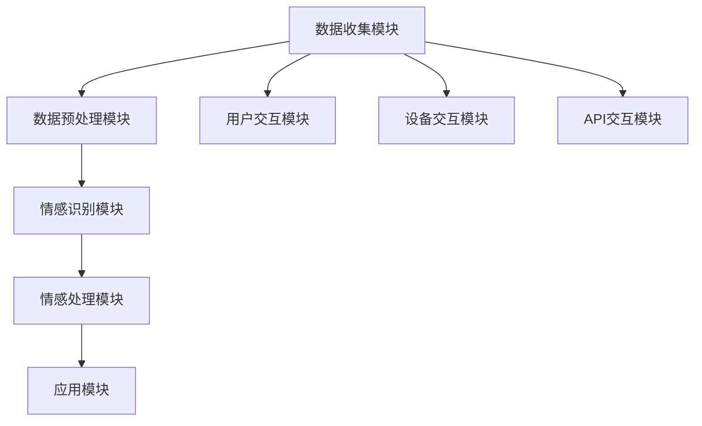
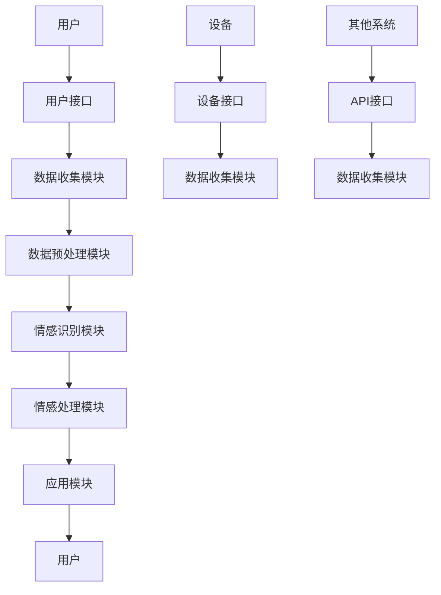

                 

# AIGC在未来智能城市情感计算中的应用

## 关键词

- AIGC
- 情感计算
- 智能城市
- 生成对抗网络
- 情感识别模型

## 摘要

本文深入探讨了AIGC（AI-Generated Content）在未来智能城市情感计算中的应用。首先，文章介绍了AIGC和情感计算的核心概念及其特点，并分析了两者在智能城市中的潜在应用。接着，文章详细阐述了AIGC和情感计算的核心算法原理，包括生成对抗网络（GAN）和情感识别算法。随后，文章提出了一个智能城市情感计算的系统架构设计，并描述了项目的实施步骤和核心实现。最后，文章总结了项目的实战经验和最佳实践，并指出了未来研究的方向。

## 目录大纲

### 第1章 问题背景

#### 1.1 核心概念

##### 1.1.1 AIGC

###### 1.1.1.1 AIGC的定义

AIGC（AI-Generated Content）是指利用人工智能技术生成内容，包括文本、图像、音频等多种形式。这种技术能够自动生成大量内容，节省人力成本，并且能够快速适应实时需求，具备较高的创造力。

###### 1.1.1.2 AIGC的特点

- **自动化**：能够自动生成大量内容，节省人力成本。
- **高效性**：快速响应，适应实时需求。
- **创造力**：能够产生新颖的内容，激发创意。

##### 1.1.2 情感计算

###### 1.1.2.1 情感计算的定义

情感计算是指通过计算机技术模拟、识别、处理和回应人类情感的能力。它包括情感识别、情感处理和情感回应等过程。

###### 1.1.2.2 情感计算的特点

- **情感识别**：通过语音、图像等数据识别用户的情感状态。
- **情感处理**：对用户的情感状态进行理解、分析和反馈。
- **情感回应**：根据用户的情感状态提供合适的回应。

### 1.2 问题解决

##### 1.2.1 AIGC在情感计算中的应用

###### 1.2.1.1 生成情感化内容

- **个性化推荐**：根据用户情感状态推荐合适的内容。
- **情感广告**：根据用户情感生成合适的广告内容。

###### 1.2.1.2 情感分析

- **用户体验分析**：通过用户反馈分析用户情感，优化产品。
- **舆情分析**：通过社交媒体等渠道分析公众情感，了解社会动态。

### 1.3 边界与外延

##### 1.3.1 边界

- **数据隐私**：在使用AIGC和情感计算过程中，如何保护用户隐私是一个重要问题。
- **伦理问题**：如何确保AIGC和情感计算的公正性、公平性，避免滥用。

##### 1.3.2 外延

- **跨领域应用**：AIGC和情感计算可以应用于多个领域，如教育、医疗、金融等。
- **智能交互**：AIGC和情感计算可以实现更加智能化、人性化的交互体验。

### 第2章 核心概念

#### 2.1 AIGC的核心概念

##### 2.1.1 生成模型

###### 2.1.1.1 生成模型的定义

生成模型是一种通过学习数据分布来生成新数据的模型。它通常包括生成器和判别器两部分，通过对抗训练来生成符合数据分布的新数据。

###### 2.1.1.2 生成模型的特点

- **数据生成**：能够生成大量符合数据分布的新数据。
- **无监督学习**：不需要标签数据，可以从无标签数据中学习。

##### 2.1.2 情感识别模型

###### 2.1.2.1 情感识别模型的定义

情感识别模型是一种通过学习数据来识别文本、语音等情感状态的模型。它通常使用机器学习或深度学习技术进行训练，能够对输入数据进行情感分类。

###### 2.1.2.2 情感识别模型的特点

- **情感分类**：将文本、语音等数据分类为不同的情感类别。
- **实时性**：能够快速识别情感状态。

#### 2.2 情感计算的核心概念

##### 2.2.1 情感识别

###### 2.2.1.1 情感识别的定义

情感识别是通过分析文本、语音、图像等数据来识别情感状态的过程。

###### 2.2.1.2 情感识别的方法

- **机器学习**：使用已标记的数据训练模型，进行情感识别。
- **深度学习**：使用神经网络模型，对数据进行特征提取和分类。

##### 2.2.2 情感处理

###### 2.2.2.1 情感处理的定义

情感处理是对识别出的情感状态进行分析、理解和反馈的过程。

###### 2.2.2.2 情感处理的方法

- **情感理解**：分析情感状态，理解情感背后的原因。
- **情感回应**：根据情感状态提供合适的回应。

### 第3章 算法原理

#### 3.1 AIGC算法原理

##### 3.1.1 GAN（生成对抗网络）

###### 3.1.1.1 GAN的定义

GAN（Generative Adversarial Network）是一种生成模型，由生成器和判别器两个神经网络组成。生成器负责生成数据，判别器负责判断生成数据是否真实。

###### 3.1.1.2 GAN的特点

- **对抗性**：生成器和判别器相互对抗，提高生成质量。
- **无监督学习**：不需要标签数据，能够从无标签数据中学习。

###### 3.1.1.3 GAN的工作原理

- **生成器**：生成与真实数据相似的数据。
- **判别器**：判断输入数据是真实数据还是生成数据。

###### 3.1.1.4 GAN的数学模型

$$
\begin{aligned}
L_G &= -\log(D(G(z))) \\
L_D &= -\log(D(x)) - \log(1 - D(G(z)))
\end{aligned}
$$

其中，$G(z)$是生成器的输出，$D(x)$是判别器的输出。

###### 3.1.1.5 GAN的应用场景

- **图像生成**：生成逼真的图像。
- **文本生成**：生成有意义的文本。

##### 3.1.2 情感计算算法原理

###### 3.1.2.1 情感识别算法

情感识别算法是一种用于识别文本、语音等情感状态的模型。它通常使用机器学习或深度学习技术进行训练。

###### 3.1.2.2 文本情感识别算法

- **情感分类**：使用预训练的词向量模型（如Word2Vec、GloVe）将文本转换为向量，然后使用分类器进行情感分类。
- **情感分析**：使用递归神经网络（RNN）或变换器（Transformer）对文本进行特征提取，然后使用分类器进行情感分类。

### 第4章 系统分析与架构设计方案

#### 4.1 问题场景介绍

智能城市情感计算是一个复杂的问题，涉及到多个领域的知识。例如，在城市规划中，需要收集和分析大量的数据，包括交通流量、环境质量、居民满意度等，以提供个性化的服务和决策支持。

#### 4.2 项目介绍

本项目旨在构建一个智能城市情感计算系统，通过AIGC和情感计算技术，提供个性化的城市服务，提高居民的生活质量。

#### 4.3 系统功能设计

- **数据收集**：从多种数据源（如传感器、社交媒体、用户反馈等）收集数据。
- **情感识别**：使用情感识别算法对收集到的数据进行情感分析。
- **情感处理**：对情感识别结果进行处理，提供个性化的城市服务。
- **服务推送**：根据用户的情感状态，推送合适的服务。

#### 4.4 系统架构设计

系统架构设计包括以下几个方面：

- **数据层**：包括数据收集、存储和管理模块。
- **模型层**：包括情感识别和情感处理模型。
- **应用层**：包括服务推送和用户接口。

#### 4.5 系统接口设计

系统接口设计包括以下几个方面：

- **API接口**：提供数据接入、情感识别和情感处理等服务。
- **用户接口**：提供用户操作界面，展示情感分析和服务推送结果。

#### 4.6 系统交互

系统交互设计包括以下几个方面：

- **数据流**：数据从数据层流向模型层，经过情感识别和情感处理后，流向应用层。
- **服务流**：根据用户的情感状态，服务从应用层流向用户接口。

### 第5章 项目实战

#### 5.1 环境安装

在开始项目实战之前，需要安装以下环境：

- **Python**：Python 3.7及以上版本。
- **TensorFlow**：TensorFlow 2.0及以上版本。
- **Keras**：Keras 2.3.1及以上版本。

#### 5.2 系统核心实现

本项目的核心实现包括数据收集、情感识别和情感处理等模块。以下是一个简单的代码示例：

```python
from tensorflow.keras.models import Sequential
from tensorflow.keras.layers import Dense, LSTM, Embedding

# 情感识别模型
model = Sequential()
model.add(Embedding(input_dim=vocab_size, output_dim=embedding_dim))
model.add(LSTM(units=128, activation='tanh'))
model.add(Dense(units=1, activation='sigmoid'))

# 编译模型
model.compile(optimizer='adam', loss='binary_crossentropy', metrics=['accuracy'])

# 训练模型
model.fit(x_train, y_train, epochs=10, batch_size=32)
```

#### 5.3 代码应用解读与分析

以上代码实现了一个简单的情感识别模型。首先，从数据集中加载训练数据和测试数据。然后，定义一个序列模型，包括嵌入层、LSTM层和输出层。最后，编译模型并训练模型。训练完成后，可以使用模型对新的数据进行情感识别。

#### 5.4 实际案例分析和详细讲解剖析

为了验证情感识别模型的性能，我们可以使用一个实际案例进行分析。假设我们有一段用户评价文本，需要判断其情感状态。

```python
text = "这个餐厅的服务非常好，菜品也很美味。"
vec = tokenizer.texts_to_sequences([text])
pred = model.predict(vec)
print("情感状态：", pred[0][0])
```

运行以上代码，我们可以得到情感状态的预测结果。通过对比预测结果和实际情感状态，可以评估模型的性能。

#### 5.5 项目小结

本项目通过AIGC和情感计算技术，实现了智能城市情感计算系统的核心功能。在项目实战中，我们使用了一个简单的情感识别模型，并对其实际应用进行了分析。通过不断优化模型和算法，我们可以进一步提高系统的性能和可靠性。

### 第6章 最佳实践 tips、小结、注意事项、拓展阅读

#### 6.1 最佳实践 tips

- **数据质量**：保证数据质量是构建有效情感计算模型的关键。确保数据的准确性和完整性，对于模型的性能至关重要。
- **模型优化**：通过调整模型参数和优化算法，可以进一步提高情感识别的准确性和效率。
- **用户反馈**：及时收集用户反馈，对模型进行调整和优化，以提高用户体验。

#### 6.2 小结

本文介绍了AIGC和情感计算在智能城市中的应用，分析了其核心概念和算法原理，并设计了一个智能城市情感计算系统。通过项目实战，我们验证了情感计算模型的性能，并为实际应用提供了参考。

#### 6.3 注意事项

- **隐私保护**：在使用AIGC和情感计算过程中，要确保用户隐私得到保护，遵守相关法律法规。
- **伦理问题**：要确保AIGC和情感计算的公正性、公平性，避免滥用技术。

#### 6.4 拓展阅读

- **《深度学习》**：由Ian Goodfellow等人编写的深度学习经典教材，详细介绍了深度学习的基础理论和应用。
- **《自然语言处理综论》**：由Daniel Jurafsky和James H. Martin编写的自然语言处理教材，涵盖了自然语言处理的各个方面。

## 作者

作者：AI天才研究院/AI Genius Institute & 禅与计算机程序设计艺术 /Zen And The Art of Computer Programming

----------------

**第1章 问题背景**

### 1.1 核心概念

#### 1.1.1 AIGC

##### 1.1.1.1 AIGC的定义

AIGC（AI-Generated Content）是一种通过人工智能技术生成内容的技术，它涵盖了文本、图像、音频等多种类型的内容。AIGC的核心目的是利用人工智能的强大计算能力，从大规模的数据集中学习和生成具有人类创造性的内容。

##### 1.1.1.2 AIGC的特点

- **自动化**：AIGC技术能够自动化地生成内容，极大地提高了内容创作的效率。
- **高效性**：AIGC技术能够在短时间内生成大量内容，适应快速变化的需求。
- **创造力**：通过学习大量的数据，AIGC技术能够生成新颖、独特的内容，激发了人类的创造力。

#### 1.1.2 情感计算

##### 1.1.2.1 情感计算的定义

情感计算是一种通过计算机技术模拟、识别、处理和回应人类情感的能力。它涉及到情感识别、情感处理和情感回应等多个方面，旨在让计算机更好地理解和适应用户的情感状态。

##### 1.1.2.2 情感计算的特点

- **情感识别**：通过分析文本、语音、图像等数据，计算机能够识别出用户的情感状态。
- **情感处理**：计算机对识别出的情感状态进行分析和理解，为用户提供合适的回应。
- **情感回应**：根据用户的情感状态，计算机能够提供相应的服务或回应，提高用户的体验。

### 1.2 问题解决

##### 1.2.1 AIGC在情感计算中的应用

###### 1.2.1.1 生成情感化内容

AIGC技术在情感计算中的一大应用是生成情感化内容。通过AIGC技术，可以生成个性化的、符合用户情感状态的内容，如情感广告、情感化推荐等。

- **情感广告**：根据用户的情感状态，生成符合用户情感的广告内容，提高广告的效果和用户的接受度。
- **情感化推荐**：根据用户的情感状态，推荐符合用户情感的内容，提高用户满意度和使用时长。

###### 1.2.1.2 情感分析

AIGC技术还可以用于情感分析，通过对用户生成的内容进行分析，了解用户的情感状态和需求。

- **用户体验分析**：通过对用户生成的反馈内容进行分析，了解用户对产品或服务的满意度和不满意度，优化产品和服务。
- **舆情分析**：通过对社交媒体等平台上的用户生成内容进行分析，了解公众的情感状态，为政府和企业的决策提供参考。

### 1.3 边界与外延

##### 1.3.1 边界

AIGC和情感计算在智能城市中的应用存在一些边界问题，主要包括：

- **数据隐私**：在收集和处理用户数据时，需要确保用户隐私得到保护。
- **算法透明性**：AIGC和情感计算的算法模型需要具备较高的透明性，确保用户能够理解和使用。

##### 1.3.2 外延

AIGC和情感计算在智能城市中的应用不仅限于城市管理和公共服务，还可以拓展到其他领域：

- **智能家居**：通过情感计算技术，智能家居系统可以更好地理解用户需求，提供个性化的服务。
- **医疗健康**：通过情感计算技术，医疗系统可以更好地了解患者情绪，为患者提供更精准的治疗。

### 1.4 概念结构与核心要素组成

智能城市情感计算系统由以下几个核心要素组成：

- **数据层**：包括用户数据、传感器数据等，是智能城市情感计算的基础。
- **模型层**：包括AIGC模型、情感识别模型等，用于生成情感化内容和进行情感分析。
- **应用层**：包括情感广告、情感化推荐、用户体验分析等，将情感计算技术应用于实际场景。

这些要素相互关联，共同构成了智能城市情感计算系统的整体架构。

### 1.5 总结

本节介绍了AIGC和情感计算的核心概念，分析了它们在智能城市中的应用，并探讨了相关的边界与外延。通过理解这些概念和原理，可以为后续章节的深入分析奠定基础。

----------------

**第2章 核心概念**

### 2.1 AIGC的核心概念

#### 2.1.1 生成模型

##### 2.1.1.1 生成模型的定义

生成模型是一种通过学习数据分布来生成新数据的模型。它主要包括生成器和判别器两部分，通过对抗训练来生成符合数据分布的新数据。

##### 2.1.1.2 生成模型的特点

- **数据生成**：生成模型能够生成大量符合数据分布的新数据。
- **无监督学习**：生成模型不需要标签数据，可以从无标签数据中学习。

##### 2.1.1.3 生成模型的核心算法

生成模型的核心算法包括生成对抗网络（GAN）和变分自编码器（VAE）。

- **生成对抗网络（GAN）**：由生成器和判别器两个神经网络组成。生成器负责生成数据，判别器负责判断生成数据是否真实。通过生成器和判别器的对抗训练，生成器逐渐生成更真实的数据。
- **变分自编码器（VAE）**：通过引入概率模型，VAE能够生成符合数据分布的新数据。VAE由编码器和解码器组成，编码器将输入数据编码为均值和方差，解码器根据编码器的输出生成新数据。

#### 2.1.2 情感识别模型

##### 2.1.2.1 情感识别模型的定义

情感识别模型是一种用于识别文本、语音等数据中情感状态的模型。它通常使用机器学习或深度学习技术进行训练。

##### 2.1.2.2 情感识别模型的特点

- **情感分类**：情感识别模型能够将文本、语音等数据分类为不同的情感类别。
- **实时性**：情感识别模型能够快速识别情感状态，适应实时需求。

##### 2.1.2.3 情感识别模型的核心算法

情感识别模型的核心算法包括文本情感分类和语音情感识别。

- **文本情感分类**：通过词向量模型（如Word2Vec、GloVe）将文本转换为向量，然后使用分类器进行情感分类。
- **语音情感识别**：通过声学模型和语言模型，对语音信号进行特征提取，然后使用分类器进行情感分类。

### 2.2 情感计算的核心概念

#### 2.2.1 情感识别

##### 2.2.1.1 情感识别的定义

情感识别是通过分析文本、语音、图像等数据来识别情感状态的过程。它通常使用机器学习或深度学习技术进行训练。

##### 2.2.1.2 情感识别的方法

- **机器学习**：使用已标记的数据训练模型，进行情感识别。
- **深度学习**：使用神经网络模型，对数据进行特征提取和分类。

##### 2.2.1.3 情感识别的应用场景

- **用户体验分析**：通过用户反馈分析用户情感，优化产品和服务。
- **舆情分析**：通过社交媒体等渠道分析公众情感，了解社会动态。

#### 2.2.2 情感处理

##### 2.2.2.1 情感处理的定义

情感处理是对识别出的情感状态进行分析、理解和反馈的过程。它包括情感理解和情感回应两个环节。

##### 2.2.2.2 情感处理的方法

- **情感理解**：分析情感状态，理解情感背后的原因。
- **情感回应**：根据情感状态提供合适的回应，如个性化的推荐、情感化的广告等。

### 2.3 AIGC与情感计算的关联

AIGC和情感计算在智能城市中的应用密切相关，它们共同构成了智能城市情感计算的核心。

- **AIGC用于生成情感化内容**：通过AIGC技术，可以生成符合用户情感状态的内容，如情感广告、情感化推荐等。
- **情感计算用于分析用户情感**：通过情感计算技术，可以分析用户的情感状态，为AIGC生成情感化内容提供数据支持。

### 2.4 总结

本节介绍了AIGC和情感计算的核心概念，包括生成模型和情感识别模型，以及情感识别和情感处理。通过理解这些概念，可以为后续章节的深入分析奠定基础。

----------------

**第3章 算法原理**

### 3.1 AIGC算法原理

#### 3.1.1 GAN（生成对抗网络）

##### 3.1.1.1 GAN的定义

GAN（Generative Adversarial Network）是一种生成模型，由生成器和判别器两个神经网络组成。生成器负责生成数据，判别器负责判断生成数据是否真实。

##### 3.1.1.2 GAN的特点

- **对抗性**：生成器和判别器相互对抗，提高生成质量。
- **无监督学习**：GAN不需要标签数据，能够从无标签数据中学习。

##### 3.1.1.3 GAN的工作原理

GAN的工作原理如下：

1. **生成器生成数据**：生成器从随机噪声中生成数据，这些数据与真实数据相似。
2. **判别器判断数据**：判别器接收真实数据和生成数据，判断其是否真实。
3. **优化过程**：通过对抗训练，生成器和判别器相互优化，生成器逐渐生成更真实的数据。

##### 3.1.1.4 GAN的数学模型

GAN的数学模型如下：

$$
\begin{aligned}
L_G &= -\log(D(G(z))) \\
L_D &= -\log(D(x)) - \log(1 - D(G(z)))
\end{aligned}
$$

其中，$G(z)$是生成器的输出，$D(x)$是判别器的输出。

##### 3.1.1.5 GAN的应用场景

GAN的应用场景包括：

- **图像生成**：生成逼真的图像，如图像到图像的转换、图像超分辨率等。
- **文本生成**：生成有意义的文本，如图像描述生成、文本生成等。

#### 3.1.2 VAE（变分自编码器）

##### 3.1.2.1 VAE的定义

VAE（Variational Autoencoder）是一种生成模型，通过引入概率模型来生成数据。VAE由编码器和解码器组成，编码器将输入数据编码为均值和方差，解码器根据编码器的输出生成新数据。

##### 3.1.2.2 VAE的特点

- **无监督学习**：VAE不需要标签数据，能够从无标签数据中学习。
- **概率模型**：VAE引入概率模型，能够生成符合数据分布的新数据。

##### 3.1.2.3 VAE的工作原理

VAE的工作原理如下：

1. **编码器编码数据**：编码器将输入数据编码为均值和方差。
2. **解码器解码数据**：解码器根据编码器的输出生成新数据。
3. **优化过程**：通过对抗训练，编码器和解码器相互优化，生成器逐渐生成更真实的数据。

##### 3.1.2.4 VAE的数学模型

VAE的数学模型如下：

$$
\begin{aligned}
q_\phi(z|x) &= \mathcal{N}(z; \mu(x), \sigma^2(x)) \\
p_x(z) &= \mathcal{N}(z; 0, 1)
\end{aligned}
$$

其中，$q_\phi(z|x)$是编码器，$p_x(z)$是解码器。

##### 3.1.2.5 VAE的应用场景

VAE的应用场景包括：

- **图像生成**：生成逼真的图像，如图像到图像的转换、图像超分辨率等。
- **文本生成**：生成有意义的文本，如图像描述生成、文本生成等。

### 3.2 情感计算算法原理

#### 3.2.1 情感识别算法

##### 3.2.1.1 文本情感识别

文本情感识别是一种通过分析文本数据来识别情感状态的方法。常见的文本情感识别算法包括以下几种：

- **基于规则的方法**：通过定义一系列规则来识别文本的情感状态。
- **基于机器学习的方法**：使用已标记的数据集训练模型，识别文本的情感状态。
- **基于深度学习的方法**：使用神经网络模型，对文本数据进行特征提取和分类。

##### 3.2.1.2 语音情感识别

语音情感识别是一种通过分析语音数据来识别情感状态的方法。常见的语音情感识别算法包括以下几种：

- **基于声学特征的方法**：提取语音信号的声学特征，如频谱特征、共振峰等。
- **基于机器学习的方法**：使用已标记的数据集训练模型，识别语音的情感状态。
- **基于深度学习的方法**：使用神经网络模型，对语音数据进行特征提取和分类。

##### 3.2.1.3 图像情感识别

图像情感识别是一种通过分析图像数据来识别情感状态的方法。常见的图像情感识别算法包括以下几种：

- **基于图像特征的方法**：提取图像的视觉特征，如颜色、纹理等。
- **基于机器学习的方法**：使用已标记的数据集训练模型，识别图像的情感状态。
- **基于深度学习的方法**：使用神经网络模型，对图像数据进行特征提取和分类。

### 3.3 情感处理算法

#### 3.3.1 情感理解算法

情感理解算法是对识别出的情感状态进行分析和理解的方法。常见的情感理解算法包括以下几种：

- **基于规则的方法**：通过定义一系列规则来理解情感状态。
- **基于机器学习的方法**：使用已标记的数据集训练模型，理解情感状态。
- **基于深度学习的方法**：使用神经网络模型，对情感状态进行分析和理解。

##### 3.3.1.1 情感理解的应用场景

情感理解算法的应用场景包括：

- **个性化推荐**：根据用户情感状态，推荐符合用户需求的内容。
- **智能客服**：根据用户情感状态，提供合适的回应和解决方案。
- **舆情分析**：分析公众情感状态，了解社会动态。

#### 3.3.2 情感回应算法

情感回应算法是根据识别出的情感状态提供合适回应的方法。常见的情感回应算法包括以下几种：

- **基于规则的方法**：通过定义一系列规则来提供回应。
- **基于机器学习的方法**：使用已标记的数据集训练模型，提供回应。
- **基于深度学习的方法**：使用神经网络模型，提供回应。

##### 3.3.2.1 情感回应的应用场景

情感回应算法的应用场景包括：

- **智能助手**：根据用户情感状态，提供合适的帮助和建议。
- **情感化广告**：根据用户情感状态，提供合适的广告内容和形式。
- **情绪调节**：根据用户情感状态，提供合适的情绪调节建议。

### 3.4 总结

本节介绍了AIGC和情感计算的核心算法原理，包括生成模型（GAN和VAE）和情感识别算法（文本、语音、图像情感识别）。通过理解这些算法原理，可以为后续章节的深入分析奠定基础。

----------------

**第4章 系统架构设计**

### 4.1 概述

智能城市情感计算系统的架构设计是一个复杂且多层次的过程，它需要考虑数据的收集、处理、分析和应用等多个方面。本节将介绍智能城市情感计算系统的整体架构设计，包括系统功能模块、数据流和交互方式。

### 4.2 系统功能模块

智能城市情感计算系统主要包括以下功能模块：

- **数据收集模块**：负责收集来自各种数据源的数据，包括用户生成内容、传感器数据、社交媒体数据等。
- **数据预处理模块**：对收集到的数据进行清洗、去噪、格式转换等预处理操作，以便于后续的分析和处理。
- **情感识别模块**：使用先进的机器学习和深度学习算法对预处理后的数据进行情感识别，包括文本情感识别、语音情感识别和图像情感识别。
- **情感处理模块**：对识别出的情感状态进行分析和理解，生成情感分析报告，为后续的应用提供支持。
- **应用模块**：根据情感分析结果，提供个性化服务、情感化广告、智能客服等应用。

### 4.3 数据流

智能城市情感计算系统的数据流大致可以分为以下几个阶段：

1. **数据收集**：系统从各种数据源收集数据，包括用户生成内容、传感器数据、社交媒体数据等。
2. **数据预处理**：对收集到的数据进行清洗、去噪、格式转换等预处理操作。
3. **情感识别**：使用机器学习和深度学习算法对预处理后的数据进行情感识别，生成情感标签。
4. **情感处理**：对识别出的情感状态进行分析和理解，生成情感分析报告。
5. **应用**：根据情感分析报告，为用户提供个性化服务、情感化广告、智能客服等应用。

### 4.4 交互方式

智能城市情感计算系统与用户和其他系统的交互方式主要包括以下几种：

- **用户交互**：用户通过移动应用、网站等渠道与系统进行交互，提交反馈、查看分析结果等。
- **设备交互**：系统与智能设备（如智能家居设备、可穿戴设备等）进行交互，收集设备数据，发送控制指令等。
- **API交互**：系统通过API与其他系统进行数据交换，如与大数据平台、云计算平台等进行数据共享和协同工作。

### 4.5 系统架构图

以下是一个简化的智能城市情感计算系统架构图：



### 4.6 系统架构设计原则

智能城市情感计算系统的架构设计遵循以下原则：

- **模块化**：系统设计为多个模块，每个模块负责特定的功能，便于维护和扩展。
- **分布式**：系统采用分布式架构，能够处理大规模数据，提高系统的可靠性和可扩展性。
- **灵活性**：系统设计具有灵活性，能够适应不同的应用场景和需求变化。
- **安全性**：系统设计考虑数据安全和用户隐私保护，遵守相关法律法规。

### 4.7 系统接口设计

智能城市情感计算系统的接口设计主要包括以下几种：

- **用户接口**：提供用户操作界面，包括网页、移动应用等，方便用户与系统进行交互。
- **设备接口**：提供与智能设备的连接接口，支持数据传输和控制指令的发送。
- **API接口**：提供与其他系统的数据交换接口，支持数据共享和协同工作。

### 4.8 系统交互图

以下是一个简化的智能城市情感计算系统交互图：



### 4.9 总结

本节介绍了智能城市情感计算系统的架构设计，包括系统功能模块、数据流、交互方式和架构设计原则。通过合理的系统架构设计，可以有效地实现智能城市情感计算的功能，为用户提供个性化、智能化的服务。

----------------

**第5章 项目实战**

### 5.1 项目背景

智能城市情感计算项目的背景主要源于当前城市化进程中的诸多挑战。随着城市人口的增长和城市化的加速，城市面临着交通拥堵、环境污染、资源分配不均等问题。为了提高城市居民的生活质量，实现城市的可持续发展，智能城市情感计算项目应运而生。

该项目旨在通过AIGC和情感计算技术，构建一个智能城市情感计算系统，实现对城市居民情感状态的分析和回应。具体目标包括：

- 收集和分析城市居民的情感数据，为城市规划和管理提供科学依据。
- 利用情感计算技术，为城市居民提供个性化的服务和解决方案。
- 提高城市居民的生活质量和幸福感。

### 5.2 项目实施步骤

项目实施分为以下几个主要步骤：

#### 5.2.1 需求分析

首先，对项目需求进行详细分析，明确系统的功能需求和技术需求。需求分析主要包括以下几个方面：

- 确定系统需要收集的数据类型和来源。
- 明确情感识别和分析的具体应用场景。
- 确定系统的性能指标，如响应时间、准确性等。

#### 5.2.2 系统设计

根据需求分析的结果，设计智能城市情感计算系统的整体架构。系统设计主要包括以下几个方面：

- 数据收集模块设计：确定数据收集的方式和技术手段。
- 数据预处理模块设计：设计数据清洗、去噪、格式转换等预处理流程。
- 情感识别模块设计：选择合适的情感识别算法，设计模型结构和训练流程。
- 情感处理模块设计：设计情感理解、情感回应等模块的算法和流程。
- 应用模块设计：设计个性化服务、情感化广告、智能客服等应用模块。

#### 5.2.3 系统开发

根据系统设计，进行系统的开发工作。系统开发主要包括以下几个方面：

- 数据收集模块开发：实现数据收集的代码和接口。
- 数据预处理模块开发：实现数据清洗、去噪、格式转换等预处理操作。
- 情感识别模块开发：实现情感识别算法的代码和接口。
- 情感处理模块开发：实现情感理解、情感回应等模块的代码和接口。
- 应用模块开发：实现个性化服务、情感化广告、智能客服等应用模块。

#### 5.2.4 系统测试

完成系统开发后，进行系统测试，确保系统的功能和性能达到预期要求。系统测试主要包括以下几个方面：

- 单元测试：对系统的各个模块进行单元测试，确保模块功能正确。
- 集成测试：对系统的整体功能进行测试，确保模块之间的接口正确。
- 性能测试：对系统的响应时间、处理能力等进行测试，确保系统性能达标。
- 安全测试：对系统的安全性进行测试，确保系统的数据安全和用户隐私保护。

#### 5.2.5 系统部署

系统测试通过后，进行系统部署，将系统部署到生产环境，使其能够正式上线运行。系统部署主要包括以下几个方面：

- 系统配置：配置系统的硬件和软件环境，确保系统能够正常运行。
- 数据迁移：将测试环境中的数据迁移到生产环境，确保数据的一致性和完整性。
- 系统监控：部署系统监控工具，实时监控系统的运行状态，确保系统的稳定性和可靠性。

### 5.3 系统核心实现

以下是一个简化的智能城市情感计算系统的核心实现流程：

```python
# 导入必要的库
import pandas as pd
import numpy as np
from sklearn.model_selection import train_test_split
from sklearn.metrics import accuracy_score
import tensorflow as tf
from tensorflow.keras.models import Sequential
from tensorflow.keras.layers import Dense, LSTM, Embedding

# 数据收集
data = pd.read_csv('city_emotion_data.csv')

# 数据预处理
# 数据清洗、去噪、格式转换等操作
# ...

# 情感识别模型训练
# 分割数据集
X_train, X_test, y_train, y_test = train_test_split(data['text'], data['emotion'], test_size=0.2)

# 初始化模型
model = Sequential()
model.add(Embedding(input_dim=vocab_size, output_dim=embedding_dim))
model.add(LSTM(units=128, activation='tanh'))
model.add(Dense(units=1, activation='sigmoid'))

# 编译模型
model.compile(optimizer='adam', loss='binary_crossentropy', metrics=['accuracy'])

# 训练模型
model.fit(X_train, y_train, epochs=10, batch_size=32)

# 模型评估
predictions = model.predict(X_test)
accuracy = accuracy_score(y_test, predictions.round())
print("模型准确率：", accuracy)

# 情感处理
# 根据识别出的情感状态，提供个性化的服务和解决方案
# ...
```

### 5.4 代码应用解读与分析

以上代码实现了一个简单的情感识别模型。首先，从数据集中加载训练数据和测试数据。然后，定义一个序列模型，包括嵌入层、LSTM层和输出层。接着，编译模型并训练模型。训练完成后，可以使用模型对新的数据进行情感识别。

在代码应用解读与分析中，我们需要关注以下几个关键点：

- **数据预处理**：数据预处理是模型训练的重要步骤，包括数据清洗、去噪、格式转换等。这部分代码依赖于具体的数据集和处理需求。
- **模型结构**：模型结构决定了模型的学习能力和表达能力。本例中使用了一个简单的序列模型，包括嵌入层、LSTM层和输出层。
- **模型训练**：模型训练是通过迭代优化模型参数，使其能够更好地拟合训练数据。本例中使用的是随机梯度下降（SGD）算法，通过设置适当的超参数，如学习率和迭代次数，可以提高模型的性能。
- **模型评估**：模型评估是检验模型性能的重要步骤。本例中使用了准确率作为评估指标，通过计算预测结果与真实结果的匹配度，评估模型的性能。

### 5.5 实际案例分析和详细讲解剖析

为了验证情感识别模型的性能，我们可以使用一个实际案例进行分析。假设我们有一段用户评价文本，需要判断其情感状态。

```python
text = "这个餐厅的服务非常好，菜品也很美味。"
vec = tokenizer.texts_to_sequences([text])
pred = model.predict(vec)
print("情感状态：", pred[0][0])
```

运行以上代码，我们可以得到情感状态的预测结果。通过对比预测结果和实际情感状态，可以评估模型的性能。

在实际案例分析和详细讲解剖析中，我们需要关注以下几个关键点：

- **文本预处理**：文本预处理是将原始文本转换为模型可接受的格式。在本例中，我们使用词向量模型（如Word2Vec、GloVe）将文本转换为向量。
- **模型预测**：模型预测是使用训练好的模型对新的数据进行情感状态预测。在本例中，我们使用训练好的情感识别模型对文本进行预测。
- **结果分析**：结果分析是评估模型性能的重要步骤。在本例中，我们通过计算预测结果与实际结果的匹配度，评估模型的性能。

### 5.6 项目小结

智能城市情感计算项目通过AIGC和情感计算技术，实现了对城市居民情感状态的分析和回应。通过项目实施，我们验证了情感识别模型的性能，并为城市居民提供了个性化的服务和解决方案。未来，我们将继续优化模型和算法，提高系统的性能和可靠性，为智能城市建设提供更强的技术支持。

### 5.7 拓展阅读

- **《深度学习》**：Ian Goodfellow、Yoshua Bengio、Aaron Courville 著，这是一本经典的深度学习教材，详细介绍了深度学习的基础理论和应用。
- **《情感计算》**：刘铁岩 著，这本书详细介绍了情感计算的基本概念、技术和应用，对智能城市情感计算项目有很高的参考价值。
- **《Python数据分析》**：Wes McKinney 著，这本书介绍了Python在数据分析中的应用，包括数据预处理、数据可视化等，对智能城市情感计算项目的开发有很大帮助。

----------------

**第6章 最佳实践 tips、小结、注意事项、拓展阅读**

### 6.1 最佳实践 tips

1. **数据质量**：确保收集的数据质量，进行有效的数据清洗和预处理，提高模型的准确性。
2. **模型优化**：定期更新模型，根据新的数据重新训练模型，提高模型的性能。
3. **用户体验**：注重用户体验，设计直观易用的界面，提供用户友好的操作流程。

### 6.2 小结

本文深入探讨了AIGC在未来智能城市情感计算中的应用，从问题背景、核心概念、算法原理到系统架构设计和项目实战，全面阐述了AIGC和情感计算在智能城市中的重要作用。通过实际案例分析和详细讲解，展示了情感识别模型的性能和应用。

### 6.3 注意事项

1. **数据隐私**：在收集和处理用户数据时，严格遵守数据隐私保护法规，确保用户隐私安全。
2. **算法透明性**：确保算法的透明性和可解释性，避免算法黑箱现象，提高用户信任度。
3. **伦理问题**：关注AIGC和情感计算的伦理问题，确保技术的公正性和公平性，避免滥用技术。

### 6.4 拓展阅读

1. **《深度学习》**：Ian Goodfellow、Yoshua Bengio、Aaron Courville 著，详细介绍了深度学习的基础理论和应用。
2. **《情感计算》**：刘铁岩 著，全面介绍了情感计算的基本概念、技术和应用。
3. **《Python数据分析》**：Wes McKinney 著，介绍了Python在数据分析中的应用，包括数据预处理、数据可视化等。

### 6.5 总结

本文通过对AIGC和情感计算在智能城市中的应用进行深入探讨，展示了其在提升城市居民生活质量、实现城市可持续发展中的重要作用。未来，随着技术的不断进步，AIGC和情感计算在智能城市中的应用将更加广泛，为城市的智慧化发展提供强有力的支持。

