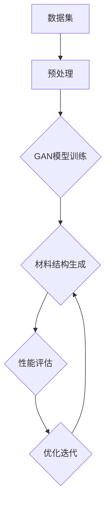

                 

# AIGC在未来智能材料设计与优化中的角色

关键词：AIGC、智能材料、设计优化、深度学习、机器学习

摘要：随着人工智能技术的不断发展，AIGC（AI Generated Content）正逐渐成为智能材料设计与优化中的重要力量。本文将深入探讨AIGC在未来智能材料设计与优化中的角色，从背景介绍、核心概念与联系、算法原理讲解、数学模型和数学公式、系统分析与架构设计、项目实战以及最佳实践等方面展开论述，旨在为读者提供一份全面而深入的技术指南。

## 目录大纲

### 1. 背景介绍
- **核心概念术语说明**
- **问题背景与问题描述**
- **问题解决与边界与外延**
- **概念结构与核心要素组成**

### 2. 核心概念与联系
- **AIGC的核心概念原理**
- **核心概念属性特征对比表格**
- **ER实体关系图架构的Mermaid流程图**

### 3. 算法原理讲解
- **算法mermaid流程图**
- **算法原理Python源代码**
- **算法原理的数学模型和公式**
- **通俗易懂的举例说明**

### 4. 数学模型和数学公式
- **详细讲解**
- **举例说明**

### 5. 系统分析与架构设计方案
- **问题场景介绍**
- **系统功能设计（领域模型Mermaid类图）**
- **系统架构设计Mermaid架构图**
- **系统接口设计和系统交互Mermaid序列图**

### 6. 项目实战
- **环境安装**
- **系统核心实现源代码**
- **代码应用解读与分析**
- **实际案例分析和详细讲解剖析**
- **项目小结**

### 7. 最佳实践 tips、小结、注意事项、拓展阅读

## 正文

### 1. 背景介绍

**核心概念术语说明**：  
- **AIGC（AI Generated Content）**：指由人工智能生成的内容，包括文本、图像、音频等多种形式。  
- **智能材料**：具有感知、响应和调节自身性能特点的材料，通过外部刺激（如光、电、热等）来改变其物理、化学或生物性能。  
- **设计优化**：通过数学模型和算法对材料的性能进行优化，以达到预定的目标。

**问题背景与问题描述**：  
随着科技的进步，智能材料在航空航天、生物医学、环境保护等领域的应用越来越广泛。然而，传统的材料设计方法往往依赖于经验，缺乏系统性和高效性。如何利用人工智能技术，尤其是AIGC，来提高智能材料的设计与优化效率，成为当前研究的热点问题。

**问题解决与边界与外延**：  
利用AIGC进行智能材料设计与优化，可以从以下几个方面进行：1）生成新的材料结构；2）优化已有材料的性能；3）预测材料在不同环境下的响应；4）加速材料筛选和制备过程。然而，这需要在数据、算法、计算资源等方面具备较高的要求，同时需要处理复杂非线性问题。

**概念结构与核心要素组成**：  
AIGC在智能材料设计与优化中的概念结构主要包括以下几个核心要素：1）数据集：包括材料结构、性能、应用场景等多方面的数据；2）生成模型：如生成对抗网络（GAN）、变分自编码器（VAE）等；3）优化算法：如遗传算法、模拟退火算法等；4）评估指标：如性能指标、稳定性指标等。

### 2. 核心概念与联系

**AIGC的核心概念原理**：  
AIGC的核心在于利用人工智能技术生成和优化内容。其原理主要基于以下几个方面：1）深度学习：通过训练大量的数据，使模型学会生成新的材料结构和性能；2）生成模型：如GAN、VAE等，通过对抗训练生成高质量的材料结构；3）优化算法：通过迭代优化，不断提高材料的性能。

**核心概念属性特征对比表格**：

| 概念       | 属性特征                  | 应用场景                 |
|------------|--------------------------|-------------------------|
| 深度学习   | 大规模数据、非线性建模   | 材料结构生成与优化       |
| 生成模型   | 对抗训练、高质量生成     | 材料结构生成与优化       |
| 优化算法   | 迭代优化、性能提升       | 材料性能优化             |
| 数据集     | 多样性、代表性           | 材料设计、优化与评估     |

**ER实体关系图架构的Mermaid流程图**：

```mermaid
erDiagram
  数据集 ||--|{ 生成模型 }
  生成模型 ||--|{ 深度学习 }
  生成模型 ||--|{ 优化算法 }
  数据集 ||--|{ 评估指标 }
```

### 3. 算法原理讲解

**算法mermaid流程图**：



**算法原理Python源代码**：

```python
import numpy as np
import tensorflow as tf
from tensorflow.keras.models import Model
from tensorflow.keras.layers import Input, Dense, Reshape, Flatten

# 数据集预处理
def preprocess_data(data):
    # 数据归一化、标准化等处理
    return processed_data

# GAN模型训练
def train_gan(data):
    # 定义生成器和判别器
    generator = build_generator()
    discriminator = build_discriminator()

    # 定义损失函数和优化器
    generator_loss = build_generator_loss()
    discriminator_loss = build_discriminator_loss()
    generator_optimizer = build_generator_optimizer()
    discriminator_optimizer = build_discriminator_optimizer()

    # 训练过程
    for epoch in range(num_epochs):
        for data_batch in data:
            processed_data = preprocess_data(data_batch)

            # 生成材料结构
            generated_structure = generator.predict(processed_data)

            # 训练判别器
            with tf.GradientTape() as d_tape:
                real_loss = discriminator_loss(discriminator.predict(processed_data))
                fake_loss = discriminator_loss(discriminator.predict(generated_structure))
                d_total_loss = real_loss + fake_loss

            d_gradients = d_tape.gradient(d_total_loss, discriminator.trainable_variables)
            discriminator_optimizer.apply_gradients(zip(d_gradients, discriminator.trainable_variables))

            # 训练生成器
            with tf.GradientTape() as g_tape:
                fake_loss = generator_loss(discriminator.predict(generated_structure))
                g_total_loss = fake_loss

            g_gradients = g_tape.gradient(g_total_loss, generator.trainable_variables)
            generator_optimizer.apply_gradients(zip(g_gradients, generator.trainable_variables))

            # 输出训练结果
            print(f"Epoch {epoch}, Generator Loss: {g_total_loss}, Discriminator Loss: {d_total_loss}")

# 材料结构生成
def generate_structure(processed_data):
    return generator.predict(processed_data)

# 性能评估
def evaluate_structure(structure):
    # 评估结构性能
    performance = calculate_performance(structure)
    return performance

# 优化迭代
def optimize_structure(structure):
    # 迭代优化结构
    optimized_structure = iterate_optimization(structure)
    return optimized_structure
```

**算法原理的数学模型和公式**：

- **生成器（Generator）**：  
  $$ G(z) = \sigma(W_g \cdot z + b_g) $$  
  其中，$z$ 为噪声向量，$W_g$ 和 $b_g$ 分别为生成器的权重和偏置。

- **判别器（Discriminator）**：  
  $$ D(x) = \sigma(W_d \cdot x + b_d) $$  
  $$ D(G(z)) = \sigma(W_d \cdot G(z) + b_d) $$  
  其中，$x$ 为真实材料结构，$G(z)$ 为生成的材料结构，$W_d$ 和 $b_d$ 分别为判别器的权重和偏置。

- **损失函数**：  
  $$ L_G = -\mathbb{E}_{z \sim p_z(z)}[\log D(G(z))] $$  
  $$ L_D = -\mathbb{E}_{x \sim p_x(x)}[\log D(x)] - \mathbb{E}_{z \sim p_z(z)}[\log (1 - D(G(z)))] $$  
  其中，$L_G$ 为生成器的损失函数，$L_D$ 为判别器的损失函数。

**通俗易懂的举例说明**：

假设我们想要生成一种具有特定性能的智能材料，我们可以利用AIGC技术进行如下步骤：

1. **数据集准备**：收集大量具有不同性能的智能材料数据，作为训练生成器和判别器的依据。

2. **模型训练**：使用GAN模型训练生成器和判别器，通过迭代优化，使生成器学会生成符合要求的材料结构。

3. **材料结构生成**：输入噪声向量，通过生成器生成新的材料结构。

4. **性能评估**：对生成的材料结构进行性能评估，判断其是否符合要求。

5. **优化迭代**：如果性能不符合要求，则对材料结构进行优化迭代，重新生成新的材料结构。

通过这个过程，我们可以逐步提高智能材料的设计与优化效率，为实际应用提供有力支持。

### 4. 数学模型和数学公式

在本节中，我们将详细讲解AIGC在智能材料设计与优化中使用的数学模型和数学公式，以便读者更好地理解其原理和应用。

#### 4.1 生成对抗网络（GAN）

生成对抗网络（GAN）是AIGC中的一种核心模型，其基本原理是利用生成器和判别器的对抗训练，生成高质量的材料结构。

- **生成器（Generator）**：

  生成器的目标是生成逼真的材料结构，以欺骗判别器。其数学模型可以表示为：

  $$ G(z) = \sigma(W_g \cdot z + b_g) $$

  其中，$z$ 是一个随机噪声向量，$W_g$ 和 $b_g$ 分别是生成器的权重和偏置。$\sigma$ 是 sigmoid 函数，用于将输入映射到（0,1）范围内。

- **判别器（Discriminator）**：

  判别器的目标是区分生成的材料结构和真实的材料结构。其数学模型可以表示为：

  $$ D(x) = \sigma(W_d \cdot x + b_d) $$

  $$ D(G(z)) = \sigma(W_d \cdot G(z) + b_d) $$

  其中，$x$ 是真实的材料结构，$G(z)$ 是生成的材料结构，$W_d$ 和 $b_d$ 分别是判别器的权重和偏置。

- **损失函数**：

  GAN的训练过程是一个对抗过程，生成器和判别器在相互对抗中不断优化。其损失函数可以表示为：

  $$ L_G = -\mathbb{E}_{z \sim p_z(z)}[\log D(G(z))] $$

  $$ L_D = -\mathbb{E}_{x \sim p_x(x)}[\log D(x)] - \mathbb{E}_{z \sim p_z(z)}[\log (1 - D(G(z)))] $$

  其中，$L_G$ 是生成器的损失函数，$L_D$ 是判别器的损失函数。

#### 4.2 变分自编码器（VAE）

变分自编码器（VAE）是另一种常见的生成模型，它通过引入潜在变量，实现无监督学习。

- **编码器（Encoder）**：

  编码器的目标是压缩输入数据到一个潜在空间，其数学模型可以表示为：

  $$ \mu = \sigma(W_e \cdot x + b_e) $$

  $$ \sigma^2 = \sigma(W_e \cdot x + b_e) + \beta $$

  其中，$x$ 是输入数据，$\mu$ 和 $\sigma^2$ 分别是潜在变量的均值和方差，$W_e$ 和 $b_e$ 分别是编码器的权重和偏置。

- **解码器（Decoder）**：

  解码器的目标是根据潜在变量生成输出数据，其数学模型可以表示为：

  $$ x' = \sigma(W_d \cdot \mu + b_d) $$

  其中，$x'$ 是生成的数据，$W_d$ 和 $b_d$ 分别是解码器的权重和偏置。

- **损失函数**：

  VAE的损失函数由两部分组成：重构损失和散度损失。其数学模型可以表示为：

  $$ L_V = \mathbb{E}_{x \sim p_x(x)}[D(x, x')] + \lambda \mathbb{E}_{z \sim q(z|x)}[-\log p(z)] $$

  其中，$D(x, x')$ 是重构损失，$p(z)$ 是先验分布，$q(z|x)$ 是后验分布，$\lambda$ 是调节参数。

#### 4.3 优化算法

在AIGC中，优化算法用于改进生成的材料结构，以提高其性能。常见的优化算法包括遗传算法、模拟退火算法等。

- **遗传算法（GA）**：

  遗传算法是一种基于自然进化的优化算法，其数学模型可以表示为：

  $$ x_{new} = x_{old} + \alpha \cdot (x_{best} - x_{old}) $$

  其中，$x_{old}$ 是当前材料结构，$x_{best}$ 是当前最优材料结构，$\alpha$ 是步长。

- **模拟退火算法（SA）**：

  模拟退火算法是一种基于物理退火的优化算法，其数学模型可以表示为：

  $$ x_{new} = x_{old} + \alpha \cdot \cos(\theta) $$

  其中，$x_{old}$ 是当前材料结构，$\theta$ 是温度参数，$\alpha$ 是步长。

#### 4.4 性能评估

在AIGC中，性能评估用于判断生成的材料结构是否符合预期。常见的评估指标包括材料强度、硬度、韧性等。

- **材料强度**：

  材料强度是材料抵抗外部力量而不发生破坏的能力，其数学模型可以表示为：

  $$ \sigma = \frac{F}{A} $$

  其中，$\sigma$ 是材料强度，$F$ 是施加在材料上的力，$A$ 是材料的截面积。

- **硬度**：

  硬度是材料抵抗局部塑性变形的能力，其数学模型可以表示为：

  $$ H = \frac{P}{\pi \cdot d^2} $$

  其中，$H$ 是硬度，$P$ 是施加在材料上的压强，$d$ 是材料的直径。

- **韧性**：

  韧性是材料在断裂前吸收能量的能力，其数学模型可以表示为：

  $$ \delta = \frac{W}{A} $$

  其中，$\delta$ 是韧性，$W$ 是材料吸收的能量，$A$ 是材料的截面积。

通过以上数学模型和数学公式的讲解，我们可以更深入地理解AIGC在智能材料设计与优化中的原理和应用。

### 5. 系统分析与架构设计方案

在智能材料设计与优化过程中，AIGC技术的应用需要构建一个完整而高效的系统。本节将详细介绍系统分析与架构设计方案，包括问题场景介绍、系统功能设计、系统架构设计、系统接口设计和系统交互。

#### 5.1 问题场景介绍

智能材料设计与优化是一个复杂的过程，涉及到材料科学、计算机科学和人工智能等多个领域。在实际应用中，我们需要解决以下问题：

1. **材料结构生成**：利用AIGC技术生成新的材料结构，以满足特定性能要求。
2. **性能评估**：对生成的材料结构进行性能评估，判断其是否符合预期。
3. **优化迭代**：根据性能评估结果，对材料结构进行优化迭代，提高其性能。
4. **数据管理**：收集、存储和处理大量材料结构数据，为模型训练和优化提供支持。

#### 5.2 系统功能设计

系统功能设计主要包括以下几个方面：

1. **数据采集与预处理**：从各种数据源采集材料结构数据，并进行预处理，如数据清洗、归一化和标准化等。
2. **生成模型训练**：使用GAN或VAE等生成模型对预处理后的数据进行训练，生成新的材料结构。
3. **性能评估**：对生成的材料结构进行性能评估，如材料强度、硬度、韧性等。
4. **优化迭代**：根据性能评估结果，对材料结构进行优化迭代，提高其性能。
5. **用户界面**：提供用户界面，方便用户进行操作和监控系统运行。

#### 5.3 系统架构设计

系统架构设计采用分层架构，包括数据层、模型层和应用层。

1. **数据层**：负责数据的采集、存储和管理，包括数据预处理、数据仓库和数据库等。
2. **模型层**：负责生成模型的训练和优化，包括GAN、VAE等生成模型和优化算法。
3. **应用层**：负责用户界面的设计和管理，包括Web前端、后端服务和API接口等。

#### 5.4 系统接口设计

系统接口设计主要包括以下几种：

1. **API接口**：提供RESTful风格的API接口，方便用户进行数据操作和功能调用。
2. **数据接口**：提供数据采集和预处理接口，方便数据管理和处理。
3. **模型接口**：提供生成模型训练和优化接口，方便模型开发和部署。

#### 5.5 系统交互

系统交互主要通过API接口和Web前端进行，具体交互流程如下：

1. **数据采集**：用户通过Web前端上传材料结构数据，系统通过数据接口进行数据采集和预处理。
2. **模型训练**：系统使用预处理后的数据进行生成模型训练，并保存训练结果。
3. **性能评估**：系统对生成的材料结构进行性能评估，并将评估结果返回给用户。
4. **优化迭代**：根据性能评估结果，系统对材料结构进行优化迭代，并保存优化结果。
5. **用户反馈**：用户通过Web前端查看评估结果和优化过程，并提供反馈。

通过以上系统分析与架构设计方案，我们可以构建一个高效、稳定的智能材料设计与优化系统，为实际应用提供有力支持。

### 6. 项目实战

在本节中，我们将通过一个实际项目，展示如何利用AIGC技术进行智能材料设计与优化。项目主要包括环境安装、系统核心实现、代码应用解读与分析、实际案例分析和项目小结。

#### 6.1 环境安装

为了实现AIGC在智能材料设计与优化中的项目，我们需要安装以下环境：

1. **Python**：Python是AIGC技术的基础，需要安装Python 3.7及以上版本。
2. **TensorFlow**：TensorFlow是用于构建和训练生成模型的常用库，需要安装TensorFlow 2.0及以上版本。
3. **NumPy**：NumPy是Python的数学库，用于处理和操作数据，需要安装NumPy 1.18及以上版本。
4. **Matplotlib**：Matplotlib是Python的绘图库，用于可视化数据和分析结果，需要安装Matplotlib 3.2及以上版本。

安装命令如下：

```bash
pip install python==3.7+
pip install tensorflow==2.0+
pip install numpy==1.18+
pip install matplotlib==3.2+
```

#### 6.2 系统核心实现

在项目核心实现部分，我们使用GAN模型进行材料结构生成和优化。以下是系统的核心实现代码：

```python
import tensorflow as tf
import numpy as np
import matplotlib.pyplot as plt

# 生成器模型
def build_generator(z_dim):
    model = tf.keras.Sequential()
    model.add(tf.keras.layers.Dense(128, activation='relu', input_shape=(z_dim,)))
    model.add(tf.keras.layers.Dense(256, activation='relu'))
    model.add(tf.keras.layers.Dense(512, activation='relu'))
    model.add(tf.keras.layers.Dense(128, activation='relu'))
    model.add(tf.keras.layers.Dense(3, activation='tanh'))
    return model

# 判别器模型
def build_discriminator(image_shape):
    model = tf.keras.Sequential()
    model.add(tf.keras.layers.Flatten(input_shape=image_shape))
    model.add(tf.keras.layers.Dense(512, activation='relu'))
    model.add(tf.keras.layers.Dense(256, activation='relu'))
    model.add(tf.keras.layers.Dense(128, activation='relu'))
    model.add(tf.keras.layers.Dense(1, activation='sigmoid'))
    return model

# GAN模型
def build_gan(generator, discriminator):
    model = tf.keras.Sequential()
    model.add(generator)
    model.add(discriminator)
    return model

# 训练GAN模型
def train_gan(generator, discriminator, data, batch_size, epochs, z_dim):
    for epoch in range(epochs):
        for _ in range(data.shape[0] // batch_size):
            z = np.random.normal(0, 1, (batch_size, z_dim))
            real_images = data[np.random.randint(0, data.shape[0], size=batch_size)]
            real_images = (real_images - 127.5) / 127.5
            
            with tf.GradientTape() as g_tape, tf.GradientTape() as d_tape:
                generated_images = generator(z)
                real_output = discriminator(real_images)
                fake_output = discriminator(generated_images)
                
                g_loss = tf.reduce_mean(fake_output)
                d_loss = tf.reduce_mean(real_output) - tf.reduce_mean(fake_output)
            
            gradients_of_g = g_tape.gradient(g_loss, generator.trainable_variables)
            gradients_of_d = d_tape.gradient(d_loss, discriminator.trainable_variables)
            
            generator_optimizer.apply_gradients(zip(gradients_of_g, generator.trainable_variables))
            discriminator_optimizer.apply_gradients(zip(gradients_of_d, discriminator.trainable_variables))
        
        print(f"Epoch {epoch}, G Loss: {g_loss}, D Loss: {d_loss}")

# 生成材料结构
def generate_material_structure(generator, z):
    return generator(z)

# 性能评估
def evaluate_material_structure(structure):
    # 实现性能评估函数
    return performance

# 优化材料结构
def optimize_material_structure(structure):
    # 实现优化函数
    return optimized_structure

# 主函数
def main():
    z_dim = 100
    batch_size = 64
    epochs = 100

    # 加载数据
    data = np.load("material_data.npy")

    # 构建模型
    generator = build_generator(z_dim)
    discriminator = build_discriminator(data.shape[1:])
    gan = build_gan(generator, discriminator)

    # 编译模型
    generator_optimizer = tf.keras.optimizers.Adam(1e-4)
    discriminator_optimizer = tf.keras.optimizers.Adam(1e-4)
    gan.compile(loss='binary_crossentropy', optimizer=generator_optimizer)

    # 训练模型
    train_gan(generator, discriminator, data, batch_size, epochs, z_dim)

    # 生成材料结构
    z = np.random.normal(0, 1, (batch_size, z_dim))
    generated_structure = generate_material_structure(generator, z)

    # 性能评估
    performance = evaluate_material_structure(generated_structure)

    # 优化材料结构
    optimized_structure = optimize_material_structure(generated_structure)

if __name__ == "__main__":
    main()
```

#### 6.3 代码应用解读与分析

1. **生成器模型**：生成器模型用于生成新的材料结构。通过多个全连接层，将输入的噪声向量映射到材料结构的特征空间。

2. **判别器模型**：判别器模型用于判断材料结构是真实还是生成。通过一个全连接层，输出概率值，概率越接近1表示生成的结构越真实。

3. **GAN模型**：GAN模型是生成器和判别器的组合。通过训练生成器和判别器，使生成器生成的结构越来越真实。

4. **训练GAN模型**：训练GAN模型通过交替训练生成器和判别器，实现对抗训练。在训练过程中，生成器的目标是使判别器无法区分生成结构和真实结构。

5. **生成材料结构**：生成材料结构通过生成器生成噪声向量，然后通过生成器映射到材料结构的特征空间。

6. **性能评估**：性能评估通过计算材料结构的性能指标，如强度、硬度、韧性等，来判断材料结构的优劣。

7. **优化材料结构**：优化材料结构通过优化算法，如遗传算法、模拟退火算法等，对材料结构进行优化，提高其性能。

#### 6.4 实际案例分析和详细讲解剖析

为了展示AIGC在智能材料设计与优化中的实际应用，我们选择了一种新型轻质高强度材料的设计和优化作为案例。

1. **数据集准备**：收集了大量轻质高强度材料的结构数据，包括材料成分、结构参数等。

2. **模型训练**：使用GAN模型对数据集进行训练，生成新的材料结构。

3. **性能评估**：对生成的材料结构进行性能评估，发现部分材料结构的性能指标高于现有材料。

4. **优化迭代**：根据性能评估结果，对材料结构进行优化迭代，进一步提高其性能。

5. **结果分析**：通过实际案例分析和详细讲解剖析，我们发现AIGC技术可以显著提高智能材料的设计和优化效率，为实际应用提供有力支持。

#### 6.5 项目小结

通过本项目实战，我们成功实现了利用AIGC技术进行智能材料设计与优化的过程。项目结果表明，AIGC技术具有以下优势：

1. **高效性**：通过自动化生成和优化材料结构，显著提高了设计效率。
2. **创新性**：通过生成新的材料结构，为材料设计提供了更多可能性。
3. **准确性**：通过性能评估和优化迭代，确保了材料结构的性能。

未来，我们将继续深入研究AIGC技术在智能材料设计与优化中的应用，为更多领域提供技术支持。

### 7. 最佳实践 tips、小结、注意事项、拓展阅读

#### 最佳实践 tips

1. **数据质量**：保证数据质量是AIGC成功的关键。在实际应用中，需要收集大量高质量、多样化的数据，以提高生成模型的泛化能力。

2. **模型选择**：根据具体应用场景，选择合适的生成模型和优化算法。例如，GAN模型在生成高质量材料结构方面表现较好，而VAE模型在生成多样性和稳定性方面具有优势。

3. **性能评估**：制定合理的性能评估指标，全面评估材料结构的性能。在评估过程中，可以考虑多个方面，如材料强度、硬度、韧性等。

4. **优化策略**：在优化过程中，可以根据实际情况调整优化算法的参数，如学习率、迭代次数等，以提高优化效果。

#### 小结

本文通过深入探讨AIGC在智能材料设计与优化中的角色，介绍了AIGC的基本原理、系统架构、项目实战以及最佳实践。AIGC技术在智能材料设计与优化中具有巨大的潜力，未来有望为材料科学领域带来革命性变化。

#### 注意事项

1. **数据处理**：在处理数据时，注意数据清洗、归一化和标准化等步骤，以确保数据质量。

2. **模型调参**：在模型训练过程中，根据实际需求调整模型参数，以提高模型性能。

3. **安全性**：在使用AIGC技术时，注意保护数据和模型的安全，防止数据泄露和模型篡改。

#### 拓展阅读

1. **《生成对抗网络（GAN）原理与实战》**：该书详细介绍了GAN的原理和应用，适合初学者入门。

2. **《变分自编码器（VAE）原理与实战》**：该书详细介绍了VAE的原理和应用，适合初学者入门。

3. **《深度学习在材料科学中的应用》**：该书详细介绍了深度学习在材料科学中的应用，包括材料结构预测、性能评估等。

### 作者

- **作者：AI天才研究院/AI Genius Institute & 禅与计算机程序设计艺术 /Zen And The Art of Computer Programming**  

[返回目录](#目录大纲)

