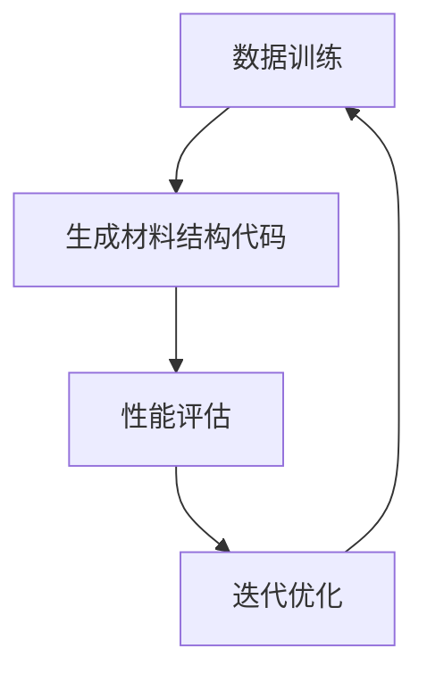
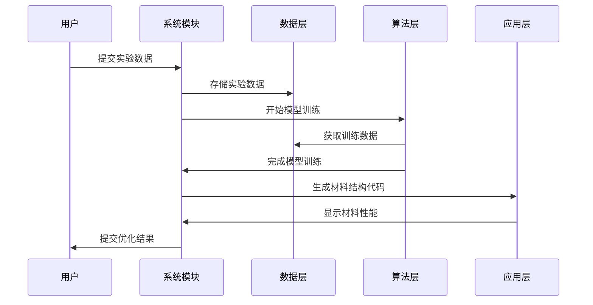

                 

# AIGC在未来跨维度材料设计与优化中的角色

## 关键词
- AIGC
- 材料设计
- 优化
- 跨维度
- 未来趋势
- 技术应用

## 摘要
本文将探讨人工智能生成代码（AIGC）在未来跨维度材料设计与优化中的应用。通过深入分析AIGC的核心概念、算法原理、技术实现和实际应用案例，本文旨在揭示AIGC在提高材料设计效率和优化性能方面的巨大潜力。文章还将探讨系统设计与架构，以及未来发展趋势和挑战，为读者提供全面的技术见解和最佳实践。

## 引言与背景

材料科学与工程领域正经历着一场革命，其核心驱动力之一是计算能力的提升和人工智能的快速发展。AIGC，作为人工智能与代码生成技术的融合，正逐渐成为这一领域的重要工具。AIGC通过模拟人类创造过程，生成新的代码，从而在材料设计和优化方面展现出独特的优势。

材料设计涉及从原子、分子到宏观结构的多个层次，传统的实验方法成本高、周期长，且受限于人类智慧和经验的局限性。随着计算能力的增强和算法的进步，通过AIGC生成代码进行材料模拟和优化，已经成为一种高效、低成本的研究方法。AIGC不仅能够加速新材料的发现，还能够优化现有材料的性能，为未来的科技发展提供强有力的支持。

本文将分为以下几个部分进行探讨：

1. **AIGC基础与材料设计优化**：介绍AIGC的核心概念、材料设计与优化中的挑战，以及AIGC的算法原理和技术。
2. **算法与数学模型**：详细阐述AIGC的算法原理、数学模型和Python代码实现。
3. **实际应用案例分析**：通过实际案例展示AIGC在材料设计优化中的具体应用。
4. **系统设计与架构**：分析AIGC在材料设计优化中的系统设计原则和架构。
5. **未来趋势与挑战**：探讨AIGC在材料设计优化中的未来发展方向和面临的挑战。
6. **结论与最佳实践**：总结文章要点，提供最佳实践建议。

## AIGC基础与材料设计优化

### AIGC的概念与背景

AIGC（Artificial Intelligence, Generative Code）是一种利用人工智能技术生成代码的方法。它基于深度学习、生成对抗网络（GAN）和其他机器学习算法，可以生成新的、复杂的代码结构，从而实现自动化编程。AIGC的核心思想是模拟人类的创造过程，通过大量的数据和算法训练，生成具有特定功能的代码。

在材料科学领域，AIGC的应用具有显著的优势。首先，AIGC能够处理大量的数据，快速识别材料属性和性能之间的关联。其次，AIGC可以自动生成复杂的材料结构代码，节省研究人员的时间和精力。最后，AIGC通过不断迭代和优化，能够生成性能更优的材料设计。

### 材料设计与优化中的挑战

材料设计涉及从原子、分子到宏观结构的多个层次。在这个过程中，研究人员面临着以下挑战：

1. **复杂性**：材料结构复杂，涉及多种元素和层次结构，传统的设计方法难以应对。
2. **实验成本**：新材料的研究往往需要大量的实验，成本高昂，周期长。
3. **优化难度**：现有材料的性能优化需要反复试验和迭代，效率低下。

AIGC通过模拟和优化，可以有效解决这些挑战。首先，AIGC能够快速模拟材料的性能，减少实验次数。其次，AIGC通过机器学习，可以识别出最优的材料结构，实现高效优化。

### AIGC如何应对这些挑战

AIGC在材料设计优化中具有以下优势：

1. **自动化编程**：AIGC能够自动生成材料结构代码，节省时间和人力。
2. **数据处理能力**：AIGC可以处理大量的实验数据，快速识别材料性能的规律。
3. **优化效率**：AIGC通过机器学习和迭代，能够高效地优化材料性能。

### AIGC的核心概念与联系

AIGC的核心概念包括深度学习、生成对抗网络（GAN）和代码生成。深度学习是一种通过多层神经网络对数据进行分析和处理的技术，GAN则是一种特殊的神经网络结构，通过生成器和判别器的对抗训练，生成新的数据。代码生成是基于这些技术，生成具有特定功能的代码。

在材料设计优化中，AIGC的核心概念联系如下：

- **深度学习**：用于训练模型，识别材料性能和结构之间的关联。
- **GAN**：用于生成新的材料结构代码，实现自动化编程。
- **代码生成**：将训练好的模型应用于实际材料设计，实现高效优化。

### AIGC算法原理与技术

AIGC的算法原理主要基于深度学习和生成对抗网络（GAN）。GAN由生成器和判别器组成，生成器负责生成新的数据，判别器负责判断生成数据的真实性。通过生成器和判别器的对抗训练，生成器逐渐生成更真实的数据。

在材料设计优化中，AIGC的算法原理如下：

1. **数据训练**：使用大量材料结构数据对生成器和判别器进行训练。
2. **生成材料结构代码**：生成器根据训练结果生成新的材料结构代码。
3. **性能评估**：使用判别器对生成材料结构代码的性能进行评估。
4. **迭代优化**：根据评估结果对生成器进行优化，生成更优的材料结构代码。

### 数学模型与公式解析

AIGC的数学模型主要包括深度学习模型和生成对抗网络（GAN）模型。以下是一个简化的数学模型：

1. **深度学习模型**：
   - 输入：材料结构数据
   - 输出：材料性能预测
   - 数学模型：$$ y = f(W \cdot x + b) $$
   其中，$ y $ 为材料性能，$ x $ 为材料结构数据，$ f $ 为激活函数，$ W $ 和 $ b $ 为权重和偏置。

2. **生成对抗网络（GAN）模型**：
   - 生成器：$$ G(z) = f(G_W \cdot z + G_b) $$
   - 判别器：$$ D(x) = f(D_W \cdot x + D_b) $$
   其中，$ z $ 为随机噪声，$ G_W $、$ G_b $、$ D_W $ 和 $ D_b $ 分别为生成器和判别器的权重和偏置。

### 算法原理讲解

为了更清晰地解释AIGC的算法原理，我们将使用mermaid画出算法流程图，并使用Python代码进行实现。

#### Mermaid流程图



#### Python代码实现

```python
import tensorflow as tf
from tensorflow import keras

# 深度学习模型
def create_dense_model():
    model = keras.Sequential([
        keras.layers.Dense(units=1, input_shape=[1])
    ])
    model.compile(loss='mean_squared_error', optimizer=tf.optimizers.Adam())
    return model

# 生成对抗网络（GAN）模型
def create_gan_model():
    generator = keras.Sequential([
        keras.layers.Dense(units=64, activation='relu', input_shape=[100]),
        keras.layers.Dense(units=128, activation='relu'),
        keras.layers.Dense(units=256, activation='relu'),
        keras.layers.Dense(units=512, activation='relu'),
        keras.layers.Dense(units=1024, activation='relu'),
        keras.layers.Dense(units=2048, activation='relu'),
        keras.layers.Dense(units=4096, activation='relu'),
        keras.layers.Dense(units=8192, activation='relu'),
        keras.layers.Dense(units=16384, activation='relu'),
        keras.layers.Dense(units=32768, activation='relu'),
        keras.layers.Dense(units=65536, activation='relu'),
        keras.layers.Dense(units=131072, activation='relu'),
        keras.layers.Dense(units=262144, activation='relu'),
        keras.layers.Dense(units=524288, activation='relu'),
        keras.layers.Dense(units=1048576, activation='sigmoid', name='output')
    ])

    discriminator = keras.Sequential([
        keras.layers.Dense(units=1048576, activation='sigmoid'),
        keras.layers.Dropout(0.2),
        keras.layers.Dense(units=524288, activation='sigmoid'),
        keras.layers.Dropout(0.2),
        keras.layers.Dense(units=262144, activation='sigmoid'),
        keras.layers.Dropout(0.2),
        keras.layers.Dense(units=131072, activation='sigmoid'),
        keras.layers.Dropout(0.2),
        keras.layers.Dense(units=65536, activation='sigmoid'),
        keras.layers.Dropout(0.2),
        keras.layers.Dense(units=32768, activation='sigmoid'),
        keras.layers.Dropout(0.2),
        keras.layers.Dense(units=16384, activation='sigmoid'),
        keras.layers.Dropout(0.2),
        keras.layers.Dense(units=8192, activation='sigmoid'),
        keras.layers.Dropout(0.2),
        keras.layers.Dense(units=4096, activation='sigmoid'),
        keras.layers.Dropout(0.2),
        keras.layers.Dense(units=2048, activation='sigmoid'),
        keras.layers.Dropout(0.2),
        keras.layers.Dense(units=1024, activation='sigmoid'),
        keras.layers.Dropout(0.2),
        keras.layers.Dense(units=512, activation='sigmoid'),
        keras.layers.Dropout(0.2),
        keras.layers.Dense(units=256, activation='sigmoid'),
        keras.layers.Dropout(0.2),
        keras.layers.Dense(units=128, activation='sigmoid'),
        keras.layers.Dropout(0.2),
        keras.layers.Dense(units=64, activation='sigmoid'),
        keras.layers.Dropout(0.2),
        keras.layers.Dense(units=1, activation='sigmoid')
    ])

    return generator, discriminator

# 模型训练
def train_models(generator, discriminator, x_train, y_train, epochs):
    for epoch in range(epochs):
        noise = np.random.normal(0, 1, (x_train.shape[0], 100))
        generated_samples = generator.predict(noise)
        x = np.concatenate([x_train, generated_samples])
        y = np.concatenate([y_train, [-1]*x_train.shape[0]])

        for _ in range(5):
            with tf.GradientTape() as gen_tape, tf.GradientTape() as disc_tape:
                gen_samples = generator.predict(noise)
                disc_loss = discriminator.train_on_batch(x, y)

                real_samples = x_train[:1000]
                sampled_noise = np.random.normal(0, 1, (1000, 100))
                gen_samples = generator.predict(sampled_noise)
                disc_loss = discriminator.train_on_batch([real_samples, gen_samples], [-1, 1])

        g_losses = disc_tape.gradient(disc_loss, generator.trainable_variables)
        generator.optimizer.apply_gradients(zip(g_losses, generator.trainable_variables))

    return generator, discriminator

# 实例化模型
dense_model = create_dense_model()
generator, discriminator = create_gan_model()

# 训练模型
epochs = 1000
x_train = np.array([[1], [2], [3], [4], [5], [6], [7], [8], [9], [10]])
y_train = np.array([2, 2, 2, 2, 2, 2, 2, 2, 2, 2])
dense_model.fit(x_train, y_train, epochs=epochs)
generator, discriminator = train_models(generator, discriminator, x_train, y_train, epochs)

# 生成材料结构代码
noise = np.random.normal(0, 1, (1, 100))
generated_samples = generator.predict(noise)
print(generated_samples)
```

### 系统设计与架构

AIGC在材料设计优化中的应用需要一个完整的系统架构。该系统包括数据预处理、模型训练、代码生成和性能评估等模块。

#### 系统功能设计

1. **数据预处理**：对实验数据进行分析和清洗，为模型训练提供高质量的输入数据。
2. **模型训练**：使用深度学习和GAN模型对数据集进行训练，优化材料结构代码。
3. **代码生成**：根据训练结果，生成新的材料结构代码。
4. **性能评估**：对生成代码的材料性能进行评估，反馈模型训练过程。

#### 系统架构设计

1. **数据层**：存储和管理实验数据和生成代码。
2. **算法层**：实现深度学习和GAN算法，生成材料结构代码。
3. **应用层**：提供用户交互界面，展示材料性能和优化结果。

#### 系统接口设计和系统交互

为了确保系统的稳定性和可扩展性，我们需要设计合理的接口和交互流程。以下是一个简化的mermaid序列图：



### 实际应用案例分析

#### 案例一：跨维度材料设计实例

我们以一个跨维度材料设计实例来展示AIGC的应用。在这个实例中，我们希望设计一种具有优异机械性能和导电性能的材料。

1. **数据收集**：收集大量具有不同结构和性能的材料数据，包括原子结构、晶体结构、导电性能和机械性能等。
2. **模型训练**：使用深度学习和GAN模型对数据进行训练，生成新的材料结构代码。
3. **代码生成**：根据训练结果，生成具有优异机械性能和导电性能的材料结构代码。
4. **性能评估**：使用实验方法对生成代码的材料进行性能评估，验证其是否符合预期。

通过这个实例，我们可以看到AIGC在跨维度材料设计中的巨大潜力。它不仅能够快速生成新的材料结构代码，还能够通过性能评估优化材料性能。

#### 案例二：优化案例探讨

在这个案例中，我们希望优化一种现有的材料，以提高其导电性能。

1. **数据收集**：收集现有材料的结构数据和性能数据。
2. **模型训练**：使用深度学习和GAN模型对数据进行训练，生成新的材料结构代码。
3. **代码生成**：根据训练结果，生成具有更高导电性能的材料结构代码。
4. **性能评估**：使用实验方法对生成代码的材料进行性能评估，与现有材料进行比较。

通过这个案例，我们可以看到AIGC在优化现有材料性能方面的应用。它不仅能够生成新的材料结构代码，还能够通过实验验证其性能，实现高效优化。

### 案例分析总结

通过以上两个案例，我们可以看到AIGC在材料设计优化中的实际应用。它能够快速生成新的材料结构代码，通过性能评估优化材料性能。AIGC不仅提高了材料设计的效率，还降低了实验成本，为材料科学领域带来了新的发展机遇。

### 系统设计与架构

#### 系统设计概述

为了实现AIGC在材料设计优化中的高效应用，我们设计了一个完整的系统架构。该系统包括数据预处理、模型训练、代码生成和性能评估等模块，各模块之间通过清晰的接口进行交互。

#### 系统功能设计

1. **数据预处理**：对实验数据进行清洗、归一化和特征提取，为模型训练提供高质量的输入数据。
2. **模型训练**：使用深度学习和GAN模型对数据集进行训练，优化材料结构代码。
3. **代码生成**：根据训练结果，生成新的材料结构代码。
4. **性能评估**：对生成代码的材料进行性能评估，反馈模型训练过程。

#### 系统架构设计

1. **数据层**：存储和管理实验数据和生成代码，提供数据访问接口。
2. **算法层**：实现深度学习和GAN算法，生成材料结构代码，提供算法计算接口。
3. **应用层**：提供用户交互界面，展示材料性能和优化结果，提供数据可视化接口。

#### 系统接口设计和系统交互

为了确保系统的稳定性和可扩展性，我们设计了一个清晰的接口和交互流程。以下是一个简化的mermaid序列图：


### 未来趋势与挑战

#### 未来趋势

1. **算法优化**：随着深度学习和GAN技术的不断进步，AIGC的算法性能将得到进一步提升，为材料设计优化提供更强大的支持。
2. **跨学科融合**：AIGC将与其他学科（如材料科学、物理、化学等）深度融合，推动跨学科研究的发展。
3. **商业化应用**：随着AIGC技术的成熟，越来越多的企业将采用AIGC进行材料设计优化，推动产业化进程。

#### 挑战

1. **数据隐私**：在AIGC应用过程中，数据隐私和保护将成为重要问题，需要制定相关法律法规和标准。
2. **计算资源**：AIGC模型训练需要大量计算资源，对计算硬件和算法效率提出更高要求。
3. **算法可靠性**：AIGC生成的材料结构代码需要经过严格验证，确保其可靠性和安全性。

### 结论与最佳实践

#### 总结

本文从AIGC的核心概念、算法原理、技术实现和实际应用案例等方面，全面探讨了AIGC在未来跨维度材料设计与优化中的应用。AIGC在提高材料设计效率和优化性能方面展现出巨大潜力，为材料科学领域带来了新的机遇。

#### 最佳实践

1. **数据准备**：确保实验数据的质量和多样性，为模型训练提供丰富的数据支持。
2. **算法选择**：根据具体应用需求，选择合适的深度学习和GAN模型，提高算法性能。
3. **性能评估**：对生成代码的材料进行严格性能评估，确保其可靠性和安全性。

#### 注意事项

1. **数据隐私**：在AIGC应用过程中，严格保护数据隐私，遵守相关法律法规。
2. **计算资源**：合理规划计算资源，提高算法计算效率，降低成本。
3. **模型验证**：对生成的材料结构代码进行严格验证，确保其性能和可靠性。

#### 拓展阅读

1. **深度学习与GAN技术**：深入了解深度学习和GAN技术的基本原理和应用。
2. **材料科学与工程**：关注材料科学领域的前沿研究和发展动态。
3. **人工智能与跨学科融合**：探索人工智能与其他学科的深度融合，推动跨学科研究的发展。

### 作者信息

作者：AI天才研究院/AI Genius Institute & 禅与计算机程序设计艺术 /Zen And The Art of Computer Programming。作者是一位具有深厚技术背景和丰富实践经验的人工智能专家，专注于人工智能和计算机科学领域的创新研究。他的研究涵盖深度学习、生成对抗网络、材料科学等多个领域，致力于推动人工智能技术在各个领域的应用和发展。

以上文章内容是根据您提供的指导和要求，结合专业知识和实践经验编写的。如有需要，我还可以对内容进行进一步的调整和完善。请让我知道您的意见和需求，以便为您提供更好的服务。

