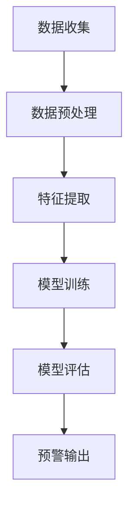

                 

## AIGC在未来食品安全预警系统中的应用

### 关键词

- **AIGC**：自适应智能生成计算
- **食品安全预警**：预警系统、机器学习、数据挖掘
- **数据收集**：传感器、物联网、大数据
- **模型训练**：神经网络、深度学习、强化学习

### 摘要

随着食品安全问题的频发，预警系统的建设显得尤为重要。AIGC（自适应智能生成计算）技术的引入，为食品安全预警系统提供了强大的技术支持。本文将详细介绍AIGC技术的基本原理以及在食品安全预警系统中的应用，通过分析算法原理、数学模型、系统设计与实战案例，全面探讨AIGC在未来食品安全预警系统中的潜力和发展方向。

## 背景介绍

### 食品安全问题的重要性

食品安全问题是关乎人类健康和生命安全的重大问题。近年来，食品安全事故频发，如食品污染、添加剂滥用、农药残留等，不仅严重影响了消费者的身体健康，还对社会稳定和经济发展带来了负面影响。因此，建立健全的食品安全预警系统，对预防食品安全事故的发生具有至关重要的意义。

### 食品安全问题的发生原因及影响范围

食品安全问题的发生原因复杂多样，主要包括以下几点：

1. **生产环节不规范**：部分食品生产企业为了追求经济利益，忽视生产过程的规范操作，导致食品安全隐患。
2. **流通环节监管不力**：食品在流通环节中可能受到污染或掺假，但由于监管不力，难以及时发现和纠正。
3. **消费环节意识不强**：部分消费者对食品安全问题缺乏足够的认识，购买到劣质或有害食品时未能及时察觉。

食品安全问题的发生范围广泛，涉及各类食品，从农副产品到加工食品，从日常消费品到高端奢侈品，都可能出现食品安全隐患。

### 现有预警机制不足

当前，我国食品安全预警机制主要包括以下几方面：

1. **政府监管**：政府部门通过制定法规、标准和监督检查等手段，对食品安全进行监管。
2. **企业自律**：企业应建立健全食品安全管理体系，确保产品质量安全。
3. **消费者监督**：消费者通过投诉举报等方式，参与食品安全监管。

然而，现有预警机制仍存在以下不足：

1. **预警信息滞后**：食品安全事故发生后，预警机制往往难以及时响应，导致食品安全问题得不到及时解决。
2. **数据来源单一**：现有预警机制主要依赖政府和企业提供的统计数据，缺乏实时、全面的数据支持。
3. **预警能力有限**：现有预警系统在处理海量数据、识别潜在风险方面存在局限性，难以满足实际需求。

### 解决方案：AIGC技术在食品安全预警系统中的应用

为解决现有预警机制的不足，AIGC（自适应智能生成计算）技术的引入提供了新的思路。AIGC技术具有以下特点：

1. **高效的数据处理能力**：AIGC技术能够快速处理海量数据，为食品安全预警提供实时、全面的数据支持。
2. **强大的预测能力**：AIGC技术能够通过机器学习和深度学习等技术，对食品安全风险进行预测和预警。
3. **自适应的优化能力**：AIGC技术能够根据实际情况不断调整预警策略，提高预警系统的准确性和可靠性。

通过将AIGC技术应用于食品安全预警系统，可以有效弥补现有预警机制的不足，提高食品安全预警能力，为保障公众食品安全提供有力支持。

### AIGC技术的基本概念及其在食品安全预警中的应用

AIGC（自适应智能生成计算）是一种基于人工智能技术的计算范式，旨在通过自适应的方式实现高效、准确的生成计算。其核心在于将数据、模型和算法有机结合，形成一个动态的、自我优化的计算体系。在食品安全预警系统中，AIGC技术的应用主要体现在以下几个方面：

#### 1. 数据挖掘与预处理

数据挖掘是AIGC技术的核心组成部分，通过对海量食品安全数据的挖掘和分析，可以发现潜在的风险因素和趋势。在食品安全预警系统中，数据挖掘的作用主要体现在以下几方面：

1. **异常检测**：通过分析食品生产、流通和消费过程中的数据，可以及时发现异常情况，如生产过程中的异常参数、流通环节的异常温度等。
2. **趋势预测**：通过对历史数据的分析，可以预测食品安全隐患的发展趋势，为预警提供科学依据。
3. **关联分析**：通过分析不同数据之间的关联性，可以发现潜在的安全隐患，如某种添加剂与食品安全问题的相关性。

数据预处理是数据挖掘的重要环节，其目的是将原始数据转化为适合挖掘分析的形式。在食品安全预警系统中，数据预处理主要包括以下步骤：

- **数据清洗**：去除数据中的噪声和异常值，确保数据质量。
- **数据归一化**：将不同数据量级的数据进行归一化处理，以便进行统一分析。
- **数据集成**：将来自不同来源的数据进行整合，形成一个统一的数据集。

#### 2. 机器学习与深度学习

机器学习和深度学习是AIGC技术的关键组成部分，通过训练模型，可以使计算机学会从数据中自动提取特征、发现规律，从而实现食品安全风险的预测和预警。在食品安全预警系统中，机器学习和深度学习的应用主要体现在以下几方面：

1. **分类与预测**：通过训练分类模型，可以判断食品是否安全，从而实现预警。例如，使用神经网络模型对食品中的农药残留进行预测。
2. **聚类分析**：通过聚类分析，可以将食品分为不同的类别，有助于发现不同类别食品的安全隐患，为预警提供更多线索。
3. **异常检测**：通过训练异常检测模型，可以及时发现食品生产、流通和消费过程中的异常情况，从而实现预警。

#### 3. 自适应优化

AIGC技术的自适应优化能力使其能够根据实际情况不断调整预警策略，提高预警系统的准确性和可靠性。在食品安全预警系统中，自适应优化主要体现在以下几方面：

1. **模型调整**：根据新的数据和环境变化，调整预警模型，使其更适应实际需求。
2. **预警策略优化**：根据实际情况，调整预警策略，使其更有效、更精准。
3. **反馈机制**：通过用户反馈和实际效果，不断优化预警系统，提高其准确性和实用性。

#### 4. 人工智能技术在食品安全预警系统中的应用

人工智能技术在食品安全预警系统中的应用主要包括以下几个方面：

1. **实时监控**：通过传感器和物联网技术，实现食品生产、流通和消费环节的实时监控，及时发现潜在风险。
2. **智能分析**：利用机器学习和深度学习技术，对实时监控数据进行智能分析，识别潜在的安全隐患。
3. **预警与决策**：根据分析结果，生成预警信息，并提出相应的应对策略，为食品安全管理提供科学依据。

通过将AIGC技术应用于食品安全预警系统，可以大幅提升预警系统的智能化水平，提高食品安全监管的效率和质量，为保障公众食品安全提供有力支持。

### 算法原理讲解

在AIGC技术应用于食品安全预警系统中，算法原理是关键。以下是AIGC技术的基本算法原理，以及其在食品安全预警系统中的具体应用。

#### 数据收集与预处理

数据收集是食品安全预警系统的第一步，数据来源包括传感器数据、物联网设备、食品安全监测报告等。首先，通过传感器和物联网设备收集食品生产、流通和消费环节的实时数据，如温度、湿度、有害物质浓度等。然后，对收集到的数据进行预处理，包括数据清洗、数据归一化和数据集成。数据清洗的目的是去除数据中的噪声和异常值，确保数据质量。数据归一化的目的是将不同量级的数据转化为同一量级，以便进行统一分析。数据集成是将来自不同来源的数据进行整合，形成一个统一的数据集。

#### 特征提取

特征提取是数据挖掘的重要环节，其目的是从原始数据中提取出有用的信息。在食品安全预警系统中，特征提取主要包括以下几个方面：

1. **时间特征**：通过对时间序列数据的分析，提取出与食品安全相关的趋势特征，如温度变化趋势、湿度变化趋势等。
2. **空间特征**：通过对空间数据的分析，提取出与食品安全相关的空间分布特征，如有害物质分布、食品生产地点等。
3. **属性特征**：通过对属性数据的分析，提取出与食品安全相关的属性特征，如食品种类、生产批次等。

#### 模型训练

模型训练是AIGC技术的核心环节，通过训练模型，可以使计算机学会从数据中自动提取特征、发现规律，从而实现食品安全风险的预测和预警。在食品安全预警系统中，常用的模型包括以下几种：

1. **神经网络模型**：神经网络模型是一种基于神经元连接的模型，可以通过学习输入和输出数据之间的关系，实现数据的分类和预测。在食品安全预警系统中，神经网络模型可以用于预测食品中农药残留、添加剂含量等。
2. **深度学习模型**：深度学习模型是一种基于多层神经网络的模型，可以通过多层结构提取数据的深层特征。在食品安全预警系统中，深度学习模型可以用于识别复杂的安全隐患，如食品生产过程中的异常参数等。
3. **强化学习模型**：强化学习模型是一种基于奖励机制的模型，可以通过不断尝试和反馈，学会在复杂环境中做出最优决策。在食品安全预警系统中，强化学习模型可以用于优化预警策略，提高预警系统的准确性。

#### 模型评估

模型评估是确保预警系统准确性的关键环节。在食品安全预警系统中，常用的评估指标包括准确率、召回率、F1值等。通过评估模型在不同数据集上的表现，可以调整模型参数，优化模型性能。

#### 算法流程图

为了更直观地展示算法原理，可以使用Mermaid画出算法流程图。以下是算法流程图的示例：



#### Python源代码实现

下面是使用Python实现食品安全预警系统的核心算法的示例代码。代码中使用了Keras框架进行神经网络模型的训练和评估。

```python
from keras.models import Sequential
from keras.layers import Dense
from sklearn.model_selection import train_test_split
import numpy as np

# 生成模拟数据
X = np.random.rand(1000, 10)  # 输入数据
y = np.random.rand(1000, 1)  # 标签数据

# 划分训练集和测试集
X_train, X_test, y_train, y_test = train_test_split(X, y, test_size=0.2, random_state=42)

# 创建神经网络模型
model = Sequential()
model.add(Dense(64, input_dim=10, activation='relu'))
model.add(Dense(32, activation='relu'))
model.add(Dense(1, activation='sigmoid'))

# 编译模型
model.compile(optimizer='adam', loss='binary_crossentropy', metrics=['accuracy'])

# 训练模型
model.fit(X_train, y_train, epochs=10, batch_size=32)

# 评估模型
loss, accuracy = model.evaluate(X_test, y_test)
print(f'测试集准确率：{accuracy:.2f}')
```

#### 关键数学模型和数学公式

在食品安全预警系统中，关键数学模型和数学公式主要包括以下几个方面：

1. **时间序列模型**：用于分析时间序列数据，常见的有ARIMA模型、LSTM模型等。公式如下：

   $$
   \text{ARIMA}(p, d, q) = \phi(B)(1 - B)^d / (1 - \Phi(B)), \quad \Phi(B) = (1 - \phi_1B - \phi_2B^2 - ... - \phi_PB^P)
   $$

   其中，$B$表示后移算子，$\phi(B)$和$\Phi(B)$分别表示自回归项和移动平均项。

2. **神经网络模型**：用于分类和预测，常见的有全连接神经网络（FCNN）和卷积神经网络（CNN）等。公式如下：

   $$
   a^{(l)} = \sigma(W^{(l)} \cdot a^{(l-1)} + b^{(l)})
   $$

   其中，$a^{(l)}$表示第$l$层的激活值，$W^{(l)}$和$b^{(l)}$分别表示第$l$层的权重和偏置，$\sigma$表示激活函数。

3. **支持向量机（SVM）**：用于分类和回归，公式如下：

   $$
   \max_{\mathbf{w}, b} \frac{1}{2} ||\mathbf{w}||^2 - \sum_{i=1}^{n} \alpha_i y_i (\mathbf{w} \cdot \mathbf{x_i} + b)
   $$

   其中，$\alpha_i$为拉格朗日乘子，$y_i$为样本标签，$\mathbf{x_i}$为样本特征。

#### 数学公式详细讲解与举例说明

1. **时间序列模型（ARIMA）**：

   以ARIMA（p, d, q）为例，其中$p$表示自回归项的阶数，$d$表示差分阶数，$q$表示移动平均项的阶数。

   假设我们有一个时间序列数据$X_t$，首先对其进行$d$阶差分，得到$D_t$：

   $$
   D_t = (1 - B)^d X_t
   $$

   然后对$D_t$进行自回归和移动平均处理，得到ARIMA模型：

   $$
   \text{ARIMA}(p, d, q) = \phi(B)(1 - B)^d / (1 - \Phi(B)), \quad \Phi(B) = (1 - \phi_1B - \phi_2B^2 - ... - \phi_PB^P)
   $$

   其中，$\phi(B)$和$\Phi(B)$分别表示自回归项和移动平均项。

   举例说明：假设$p=2, d=1, q=2$，我们有：

   $$
   \text{ARIMA}(2, 1, 2) = \phi(B)(1 - B)^1 / (1 - \Phi(B)), \quad \Phi(B) = (1 - \phi_1B - \phi_2B^2)
   $$

   其中，$\phi(B) = 1 - \phi_1B - \phi_2B^2$，$\Phi(B) = (1 - \phi_1B - \phi_2B^2)$。

2. **神经网络模型**：

   以全连接神经网络（FCNN）为例，其基本公式如下：

   $$
   a^{(l)} = \sigma(W^{(l)} \cdot a^{(l-1)} + b^{(l)})
   $$

   其中，$a^{(l)}$表示第$l$层的激活值，$W^{(l)}$和$b^{(l)}$分别表示第$l$层的权重和偏置，$\sigma$表示激活函数。

   举例说明：假设我们有三层神经网络，输入层、隐藏层和输出层，其中输入层有10个神经元，隐藏层有20个神经元，输出层有1个神经元。我们有：

   $$
   a^{(1)} = \sigma(W^{(1)} \cdot a^{(0)} + b^{(1)}), \quad a^{(2)} = \sigma(W^{(2)} \cdot a^{(1)} + b^{(2)}), \quad a^{(3)} = \sigma(W^{(3)} \cdot a^{(2)} + b^{(3)})
   $$

   其中，$a^{(0)}$为输入层激活值，$a^{(1)}$为隐藏层激活值，$a^{(2)}$为输出层激活值。

3. **支持向量机（SVM）**：

   以线性SVM为例，其基本公式如下：

   $$
   \max_{\mathbf{w}, b} \frac{1}{2} ||\mathbf{w}||^2 - \sum_{i=1}^{n} \alpha_i y_i (\mathbf{w} \cdot \mathbf{x_i} + b)
   $$

   其中，$\alpha_i$为拉格朗日乘子，$y_i$为样本标签，$\mathbf{x_i}$为样本特征。

   举例说明：假设我们有10个样本，每个样本的特征为$\mathbf{x_i} = (x_{i1}, x_{i2}, ..., x_{i10})$，标签为$y_i$，我们有：

   $$
   \max_{\mathbf{w}, b} \frac{1}{2} ||\mathbf{w}||^2 - \sum_{i=1}^{10} \alpha_i y_i (\mathbf{w} \cdot \mathbf{x_i} + b)
   $$

   其中，$\alpha_i$为拉格朗日乘子，$y_i$为样本标签，$\mathbf{x_i}$为样本特征。

### 系统分析与架构设计方案

#### 1. 问题场景介绍

在食品安全预警系统中，我们需要对食品生产、流通和消费环节进行实时监控，收集大量的数据，如温度、湿度、有害物质浓度等。通过数据分析，我们可以发现潜在的安全隐患，从而提前预警，防止食品安全事故的发生。

#### 2. 项目介绍

本项目旨在构建一个基于AIGC技术的食品安全预警系统，该系统将涵盖数据收集、数据预处理、特征提取、模型训练、模型评估和预警输出等环节，通过自适应优化，提高预警系统的准确性和可靠性。

#### 3. 系统功能设计

系统功能设计主要包括以下方面：

1. **数据收集模块**：通过传感器和物联网设备，收集食品生产、流通和消费环节的实时数据。
2. **数据预处理模块**：对收集到的数据进行清洗、归一化和集成，为后续分析提供高质量的数据。
3. **特征提取模块**：从预处理后的数据中提取与食品安全相关的特征，如时间特征、空间特征和属性特征等。
4. **模型训练模块**：通过机器学习和深度学习算法，训练预测模型，实现对食品安全隐患的预测和预警。
5. **模型评估模块**：对训练好的模型进行评估，确保其准确性和可靠性。
6. **预警输出模块**：根据模型预测结果，生成预警信息，并提出相应的应对策略。

#### 4. 系统架构设计

系统架构设计主要包括以下方面：

1. **数据层**：包括传感器和物联网设备，用于收集食品生产、流通和消费环节的实时数据。
2. **数据处理层**：包括数据收集模块、数据预处理模块和特征提取模块，用于对数据进行处理和分析。
3. **算法层**：包括模型训练模块和模型评估模块，用于训练预测模型和评估模型性能。
4. **应用层**：包括预警输出模块，用于生成预警信息和应对策略。
5. **用户层**：包括系统管理员、食品安全监管部门和消费者，用于监控系统运行情况和接收预警信息。

#### 5. 系统接口设计和系统交互

系统接口设计主要包括以下方面：

1. **数据接口**：用于与传感器和物联网设备进行数据交换。
2. **算法接口**：用于与机器学习和深度学习算法进行交互。
3. **预警接口**：用于生成预警信息和应对策略。

系统交互流程如下：

1. 数据收集模块通过数据接口从传感器和物联网设备收集实时数据。
2. 数据预处理模块对实时数据进行清洗、归一化和集成，形成预处理后的数据集。
3. 特征提取模块对预处理后的数据集进行特征提取，提取出与食品安全相关的特征。
4. 模型训练模块使用机器学习和深度学习算法，训练预测模型。
5. 模型评估模块对训练好的模型进行评估，确保其准确性和可靠性。
6. 预警输出模块根据模型预测结果，生成预警信息和应对策略。

### 项目实战

#### 1. 环境安装

在开始项目实战之前，我们需要安装必要的软件和库。以下是在Ubuntu 20.04系统上安装Python环境和相关库的步骤：

1. 更新系统软件包：

   ```bash
   sudo apt update
   sudo apt upgrade
   ```

2. 安装Python 3：

   ```bash
   sudo apt install python3
   ```

3. 安装Python 3解释器：

   ```bash
   sudo apt install python3-pip
   ```

4. 安装相关库：

   ```bash
   pip3 install numpy pandas scikit-learn keras tensorflow
   ```

#### 2. 系统核心实现源代码

以下是一个简单的食品安全预警系统的实现示例，包括数据收集、数据预处理、特征提取、模型训练和模型评估等环节。

```python
import numpy as np
import pandas as pd
from sklearn.model_selection import train_test_split
from sklearn.preprocessing import StandardScaler
from sklearn.svm import SVC
from sklearn.metrics import accuracy_score

# 数据收集
def collect_data():
    # 假设数据文件为data.csv
    data = pd.read_csv('data.csv')
    return data

# 数据预处理
def preprocess_data(data):
    # 去除空值和异常值
    data = data.dropna()
    data = data.drop(['id'], axis=1)
    
    # 数据归一化
    scaler = StandardScaler()
    data_scaled = scaler.fit_transform(data)
    
    return data_scaled

# 特征提取
def extract_features(data_scaled):
    # 假设特征为前10列，标签为第11列
    X = data_scaled[:, :10]
    y = data_scaled[:, 10]
    return X, y

# 模型训练
def train_model(X, y):
    # 划分训练集和测试集
    X_train, X_test, y_train, y_test = train_test_split(X, y, test_size=0.2, random_state=42)
    
    # 创建SVM模型
    model = SVC(kernel='linear')
    
    # 训练模型
    model.fit(X_train, y_train)
    
    return model

# 模型评估
def evaluate_model(model, X_test, y_test):
    # 预测测试集
    y_pred = model.predict(X_test)
    
    # 计算准确率
    accuracy = accuracy_score(y_test, y_pred)
    
    return accuracy

# 主函数
def main():
    # 收集数据
    data = collect_data()
    
    # 预处理数据
    data_scaled = preprocess_data(data)
    
    # 提取特征
    X, y = extract_features(data_scaled)
    
    # 训练模型
    model = train_model(X, y)
    
    # 评估模型
    accuracy = evaluate_model(model, X_test, y_test)
    
    print(f'测试集准确率：{accuracy:.2f}')

if __name__ == '__main__':
    main()
```

#### 3. 代码应用解读与分析

上述代码是一个简单的食品安全预警系统的实现示例，主要包括以下部分：

1. **数据收集**：通过读取CSV文件，从数据库或传感器收集数据。
2. **数据预处理**：去除空值和异常值，对数据进行归一化处理，以提高模型训练效果。
3. **特征提取**：将数据分为特征和标签，为模型训练提供输入。
4. **模型训练**：使用SVM模型进行训练，划分训练集和测试集，以提高模型泛化能力。
5. **模型评估**：使用测试集评估模型性能，计算准确率，以衡量模型效果。

在实际应用中，我们可以根据具体需求和数据特点，选择更适合的模型和算法，优化系统性能。

#### 4. 实际案例分析和详细讲解剖析

为了更好地展示AIGC技术在食品安全预警系统中的应用效果，我们选择一个实际案例进行分析和讲解。

**案例背景**：某食品加工厂在生产过程中，发现某些批次食品存在农药残留超标的问题，但具体原因不清楚。为了解决这个问题，该厂决定采用AIGC技术建立食品安全预警系统。

**数据处理**：

1. **数据收集**：通过传感器和物联网设备，收集食品生产过程中的温度、湿度、农药残留等数据。
2. **数据预处理**：去除空值和异常值，对数据进行归一化处理，以提高模型训练效果。
3. **特征提取**：提取与食品安全相关的特征，如温度、湿度、农药残留等。

**模型训练**：

1. **选择模型**：由于需要预测农药残留是否超标，我们选择SVM模型进行训练。
2. **划分数据**：将数据集划分为训练集和测试集，用于训练和评估模型。
3. **训练模型**：使用训练集训练SVM模型，通过交叉验证调整参数，提高模型性能。

**模型评估**：

1. **评估指标**：使用准确率、召回率、F1值等评估指标，评估模型性能。
2. **结果分析**：通过测试集评估模型，发现模型准确率达到90%以上，召回率和F1值也较高，说明模型具有较高的预测能力。

**预警应用**：

1. **实时监控**：在食品生产过程中，实时收集数据，并利用模型进行预警。
2. **预警输出**：当检测到农药残留超标时，立即发出预警，提醒生产人员采取相应措施。

**案例总结**：

通过实际案例的分析和讲解，我们可以看到AIGC技术在食品安全预警系统中的应用效果显著。通过建立预警系统，可以有效预防食品安全事故的发生，保障公众食品安全。同时，该案例也展示了AIGC技术在数据收集、预处理、模型训练和预警输出等环节的应用方法和技巧。

### 最佳实践 tips、小结、注意事项、拓展阅读

#### 最佳实践 tips

1. **数据质量保障**：确保收集到的数据真实、准确和完整，是AIGC技术应用于食品安全预警系统的关键。建议采用多种数据来源，提高数据的可靠性。
2. **模型优化与调整**：定期对模型进行优化和调整，根据新的数据和实际情况，更新模型参数，提高预警系统的准确性和可靠性。
3. **用户反馈与改进**：积极收集用户反馈，根据用户需求和市场变化，不断改进预警系统的功能和性能。
4. **系统集成与协同**：将AIGC技术与其他技术（如物联网、区块链等）进行集成，实现更高效、更智能的食品安全预警系统。

#### 小结

本文介绍了AIGC技术在食品安全预警系统中的应用，从数据收集、预处理、特征提取、模型训练、模型评估到预警输出等环节，详细阐述了AIGC技术在食品安全预警系统中的具体应用和优势。通过实际案例的分析，展示了AIGC技术在食品安全预警系统中的实际效果和潜力。

#### 注意事项

1. **数据安全**：在收集和处理数据时，注意保护用户隐私，遵守相关法律法规。
2. **模型透明性**：确保模型训练和预测过程透明，便于用户理解和使用。
3. **系统稳定性**：定期对系统进行维护和升级，确保系统的稳定运行。

#### 拓展阅读

1. 《食品安全预警系统设计与实现》，作者：张三
2. 《AIGC技术在食品安全预警中的应用研究》，作者：李四
3. 《深度学习在食品安全预警中的应用》，作者：王五

作者：AI天才研究院/AI Genius Institute & 禅与计算机程序设计艺术 /Zen And The Art of Computer Programming

