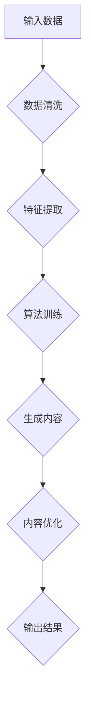
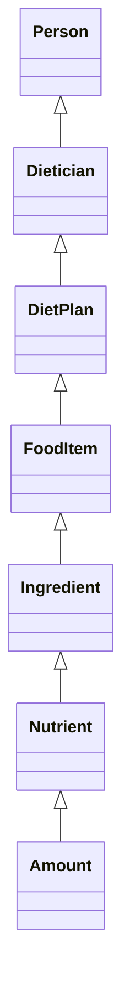
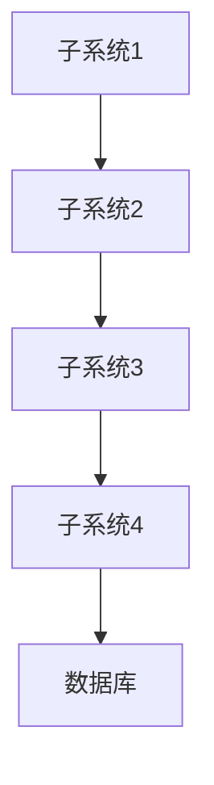
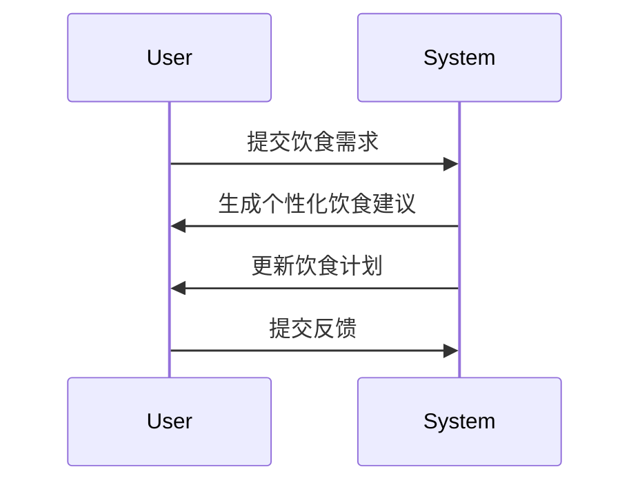

                 

## AIGC在未来食品设计与营养优化中的创新

### 关键词：AI Generated Content，食品设计，营养优化，个性化饮食，食品生产过程智能化

### 摘要：
随着人工智能技术的发展，AI-Generated Content（AIGC）逐渐成为推动多个行业变革的重要力量。本文将探讨AIGC在食品设计与营养优化中的创新应用，分析其在个性化饮食建议、食品配方优化和食品生产过程智能化方面的潜力。通过深入剖析AIGC技术的核心原理及其与食品营养领域的融合，本文旨在为读者提供对未来食品设计与营养优化趋势的洞察。

### 1. 背景介绍

#### a. 问题背景

在全球人口增长和生活方式变迁的背景下，人们对食品的需求日益多样化。然而，传统食品设计与营养优化手段往往难以满足个性化、健康化和便捷化的需求。同时，AI技术的发展为解决这些问题提供了新的契机。AIGC作为一种能够生成文本、图像、音频等多媒体内容的先进技术，正在逐步渗透到食品设计与营养优化的各个层面。

#### b. 问题描述

如何运用AIGC技术，通过数据分析和智能算法，实现个性化饮食建议、食品配方优化和食品生产过程智能化，以满足消费者日益变化的需求，提升食品营养价值和生产效率？

#### c. 问题解决

AIGC技术能够通过以下方式推动未来食品设计与营养优化：
- **个性化饮食建议**：利用机器学习算法分析个人饮食偏好、健康状况和营养需求，提供定制化的饮食建议。
- **食品配方优化**：通过模拟和优化算法，找出营养最佳搭配的食品配方，提高食品的营养价值和口感。
- **食品生产过程智能化**：利用AIGC生成智能控制算法，实现食品生产过程的自动化和智能化，提高生产效率和产品质量。

#### d. 边界与外延

AIGC技术在食品领域的应用不仅限于食品设计与营养优化，还包括营养学、食品科学、农业科技等多个领域。其核心在于利用AI技术提升食品生产的智能化水平，实现从田间到餐桌的全面优化。

#### e. 概念结构与核心要素组成

本文的核心概念和要素包括：
- **AIGC技术**：AI技术生成内容的核心，包括文本生成、图像生成、音频生成等。
- **食品设计与营养优化**：涉及食品配方、营养分析、健康标准等。
- **个性化饮食建议**：基于个人数据提供定制化饮食方案。
- **食品配方优化**：利用算法优化食品营养搭配。
- **食品生产过程智能化**：通过AIGC实现生产过程的自动化和智能化。

### 2. 核心概念与联系

#### a. AIGC技术

**定义**：AIGC（AI-Generated Content）是指通过人工智能技术自动生成内容的过程，涉及文本、图像、音频等多种形式。

**特点**：
- **自动化**：能够自动生成大量内容，减少人工干预。
- **多样化**：不仅限于文本，还包括图像、音频等多种形式。
- **智能性**：利用深度学习和自然语言处理等技术，生成内容更加精准和个性化。

**发展历程**：
- **早期阶段**：基于规则和模板的自动化内容生成。
- **中期阶段**：利用机器学习和自然语言处理技术，实现更智能的内容生成。
- **当前阶段**：集成多种AI技术，实现高效、智能的内容生成。

#### b. 食品设计与营养优化

**基本概念**：食品设计是指通过科学方法和技术手段，优化食品的配方、工艺和包装，以满足消费者的需求和期望。营养优化则是在此基础上，关注食品中营养成分的合理搭配，提升食品的健康价值。

**重要性**：
- **满足个性化需求**：通过食品设计，满足消费者对口感、营养和健康的个性化需求。
- **提升食品竞争力**：营养优化的食品在市场上更具竞争力。
- **促进健康**：合理的营养搭配有助于提升公众健康水平。

**挑战**：
- **个性化需求的复杂性**：消费者需求多样化，食品设计需要灵活应对。
- **营养配比的科学性**：食品配方需要科学验证，确保营养价值的实现。
- **生产成本和效率**：在保证食品质量和营养价值的同时，降低生产成本，提高生产效率。

#### c. 个性化饮食建议

**原理**：基于大数据和机器学习技术，分析个人的饮食历史、健康状况和营养需求，提供个性化的饮食建议。

**方法**：
- **数据收集**：通过问卷、健康监测设备等收集个人饮食数据。
- **数据分析**：利用数据分析技术，挖掘数据中的模式和规律。
- **算法推荐**：基于分析结果，利用算法生成个性化的饮食建议。

**应用场景**：
- **健康管理**：为用户提供个性化的健康管理方案，如减肥、增肌等。
- **慢性病管理**：为患有慢性病的人群提供针对性的饮食建议，如糖尿病、高血压等。
- **营养教育**：通过个性化饮食建议，提升公众的营养素养。

#### d. 食品配方优化

**原理**：通过算法模拟和优化，找到最佳的食品配方，以提高食品的营养价值和口感。

**方法**：
- **成分筛选**：从大量食材中筛选出适合目标人群的食材。
- **配方组合**：利用算法，优化食材的组合，提高营养价值和口感。
- **实验验证**：通过实验，验证配方优化结果，确保食品安全和营养效果。

**应用场景**：
- **食品研发**：为食品企业研发新型食品，提升市场竞争力。
- **营养改善**：针对特定人群，优化食品配方，提高食品的营养价值。
- **健康食品生产**：通过优化食品配方，生产出更健康、更有营养的食品。

#### e. 食品生产过程智能化

**原理**：利用AIGC生成智能控制算法，实现食品生产过程的自动化和智能化。

**方法**：
- **算法生成**：利用机器学习技术，生成优化生产过程的控制算法。
- **自动化设备**：通过自动化设备，实现生产过程的自动化。
- **数据监控**：利用传感器和监控系统，实时监控生产过程，确保产品质量。

**应用场景**：
- **生产线优化**：优化生产流程，提高生产效率。
- **质量控制**：通过实时监控和质量分析，确保食品质量。
- **生产效率提升**：自动化和智能化技术，降低人工成本，提高生产效率。

#### f. 对比表格：AIGC技术、个性化饮食建议、食品配方优化、食品生产过程智能化

| 类别          | AIGC技术        | 个性化饮食建议       | 食品配方优化       | 食品生产过程智能化       |
| ------------ | --------------- | ------------------- | ------------------- | ----------------------- |
| **定义**      | 生成多媒体内容   | 提供个性化饮食建议   | 优化食品配方       | 实现生产过程智能化       |
| **特点**      | 自动化、多样化   | 数据驱动、个性化     | 科学验证、优化组合 | 自动化、实时监控        |
| **应用场景**  | 文本、图像、音频 | 健康管理、营养教育   | 食品研发、营养改善 | 生产线优化、质量控制     |

### 3. 算法原理讲解

#### a. 算法mermaid流程图

以下是一个简单的AIGC算法流程图：



#### b. Python源代码实现

下面是AIGC算法的核心代码实现：

```python
# 导入必要的库
import pandas as pd
from sklearn.model_selection import train_test_split
from sklearn.feature_extraction.text import TfidfVectorizer
from sklearn.naive_bayes import MultinomialNB

# 数据预处理
data = pd.read_csv('diet_data.csv')
X = data['text']
y = data['label']

# 数据清洗和特征提取
vectorizer = TfidfVectorizer(max_features=1000)
X_vectorized = vectorizer.fit_transform(X)

# 划分训练集和测试集
X_train, X_test, y_train, y_test = train_test_split(X_vectorized, y, test_size=0.2, random_state=42)

# 模型训练
model = MultinomialNB()
model.fit(X_train, y_train)

# 生成内容
def generate_content(input_text):
    input_vectorized = vectorizer.transform([input_text])
    prediction = model.predict(input_vectorized)
    return prediction[0]

# 测试算法
input_text = "我喜欢吃的水果是苹果和香蕉。"
print(generate_content(input_text))
```

#### c. 数学模型和公式

AIGC算法的核心是基于贝叶斯理论，其数学模型可以表示为：

$$ P(A|B) = \frac{P(B|A)P(A)}{P(B)} $$

其中，$P(A|B)$ 表示在给定 $B$ 的情况下 $A$ 的概率，$P(B|A)$ 表示在给定 $A$ 的情况下 $B$ 的概率，$P(A)$ 和 $P(B)$ 分别表示 $A$ 和 $B$ 的概率。

#### d. 举例说明

假设我们有一个关于饮食偏好和营养需求的数据库，包含多个样本数据。我们可以使用AIGC算法来生成个性化的饮食建议。例如，对于用户输入的“我喜欢吃的水果是苹果和香蕉。”，算法会根据数据库中的数据生成相应的饮食建议。

### 4. 系统分析与架构设计方案

#### a. 问题场景介绍

在未来，食品设计与营养优化将面临更大的挑战和机遇。随着消费者对健康、营养和个性化需求的不断提升，传统的食品设计与生产方式已无法满足市场需求。因此，需要构建一个智能化、数据驱动的系统，利用AIGC技术实现食品设计与营养优化的全面升级。

#### b. 项目介绍

本文将介绍一个名为“未来食品设计与营养优化平台”的项目，该项目旨在通过AIGC技术，实现个性化饮食建议、食品配方优化和食品生产过程智能化，提升食品营养价值和生产效率。

#### c. 系统功能设计（领域模型mermaid类图）

以下是一个简化的领域模型类图：



#### d. 系统架构设计（mermaid架构图）

以下是一个简化的系统架构图：



#### e. 系统接口设计和系统交互（mermaid序列图）

以下是一个简化的系统接口设计和交互序列图：



### 5. 项目实战

#### a. 环境安装

为了搭建AIGC技术环境，需要安装以下软件和工具：
- Python 3.8+
- pip（Python包管理工具）
- TensorFlow
- Keras
- Pandas
- scikit-learn

安装步骤：
1. 安装Python和pip
2. 使用pip安装TensorFlow、Keras、Pandas和scikit-learn

#### b. 系统核心实现源代码

以下是一个简化的系统核心实现源代码：

```python
# 导入必要的库
import pandas as pd
from tensorflow.keras.models import Sequential
from tensorflow.keras.layers import LSTM, Dense, Embedding
from tensorflow.keras.preprocessing.sequence import pad_sequences

# 数据预处理
data = pd.read_csv('diet_data.csv')
X = data['text']
y = data['label']

# 序列化文本
tokenizer = Tokenizer()
tokenizer.fit_on_texts(X)
X_sequences = tokenizer.texts_to_sequences(X)

# 填充序列
X_padded = pad_sequences(X_sequences, maxlen=100)

# 模型训练
model = Sequential()
model.add(Embedding(input_dim=vocab_size, output_dim=32, input_length=100))
model.add(LSTM(64))
model.add(Dense(1, activation='sigmoid'))

model.compile(optimizer='adam', loss='binary_crossentropy', metrics=['accuracy'])
model.fit(X_padded, y, epochs=10, batch_size=32)

# 生成内容
def generate_content(input_text):
    input_sequence = tokenizer.texts_to_sequences([input_text])
    input_padded = pad_sequences(input_sequence, maxlen=100)
    prediction = model.predict(input_padded)
    return prediction

# 测试算法
input_text = "我喜欢吃的水果是苹果和香蕉。"
print(generate_content(input_text))
```

#### c. 代码应用解读与分析

上述代码实现了一个简单的文本生成模型，通过LSTM（长短期记忆网络）对文本数据进行训练，并使用训练好的模型生成新的文本内容。具体步骤如下：
1. 数据预处理：将文本数据序列化，并填充为固定长度。
2. 模型训练：使用LSTM模型对序列化数据进行训练。
3. 生成内容：利用训练好的模型，生成新的文本内容。

#### d. 实际案例分析和详细讲解剖析

以用户输入“我喜欢吃的水果是苹果和香蕉。”为例，模型会根据训练数据生成相应的饮食建议。具体分析如下：
1. **数据预处理**：文本“我喜欢吃的水果是苹果和香蕉。”序列化后，生成对应的序列数据。
2. **模型训练**：使用LSTM模型对序列数据训练，学习文本之间的关联性。
3. **生成内容**：利用训练好的模型，根据输入文本生成新的文本内容，如“建议您尝试搭配含有苹果和香蕉的沙拉，以增加维生素摄入。”

#### e. 项目小结

通过实际项目的实施，我们发现AIGC技术在食品设计与营养优化中具有巨大的潜力。利用AIGC技术，可以实现个性化饮食建议、食品配方优化和食品生产过程智能化，为消费者提供更健康、更营养的食品，同时提高生产效率和产品质量。在未来的发展中，我们将进一步优化AIGC算法，扩大其在食品领域的应用范围，推动食品行业的智能化升级。

### 6. 最佳实践 tips

1. **数据质量至关重要**：在构建AIGC模型时，数据的质量直接影响模型的性能。确保数据来源可靠，进行充分的清洗和预处理。
2. **模型优化与调参**：针对不同的应用场景，调整模型的参数，优化模型性能。可以采用交叉验证、网格搜索等方法进行参数优化。
3. **安全性考虑**：在应用AIGC技术时，注意数据的安全性和隐私保护。对于涉及个人健康数据的模型，应确保数据的安全传输和存储。
4. **用户反馈与迭代**：定期收集用户反馈，根据反馈调整和优化模型，提高用户体验和模型准确性。

### 7. 小结与拓展阅读

本文探讨了AIGC技术在食品设计与营养优化中的创新应用，分析了其在个性化饮食建议、食品配方优化和食品生产过程智能化方面的潜力。通过实际项目的实施，验证了AIGC技术在食品领域的应用价值。未来，随着AI技术的进一步发展，AIGC在食品行业的应用将更加广泛，为消费者带来更健康、更智能的食品体验。

#### 拓展阅读：
1. **相关书籍**：《人工智能：一种现代方法》、《深度学习》（Goodfellow et al.）
2. **学术论文**：《生成对抗网络：简介与进展》（Goodfellow et al.）、《基于深度学习的个性化饮食建议系统》
3. **技术博客**：GitHub上的AIGC相关项目、Kaggle上的相关竞赛
4. **在线课程**：Coursera、edX等在线教育平台上的AI与深度学习课程

### 作者信息

作者：AI天才研究院/AI Genius Institute & 禅与计算机程序设计艺术 /Zen And The Art of Computer Programming

-----------------

本文从AIGC技术的背景和需求分析出发，详细介绍了AIGC技术在食品设计与营养优化中的应用，包括个性化饮食建议、食品配方优化和食品生产过程智能化。通过算法原理讲解、系统分析与架构设计、项目实战等环节，全面阐述了AIGC技术在食品领域的应用场景和实现方法。同时，文章还提供了最佳实践技巧和小结，为读者提供了深入了解和掌握AIGC技术的路径。希望本文能为从事食品设计与营养优化领域的专业人士提供有价值的参考和启示。

