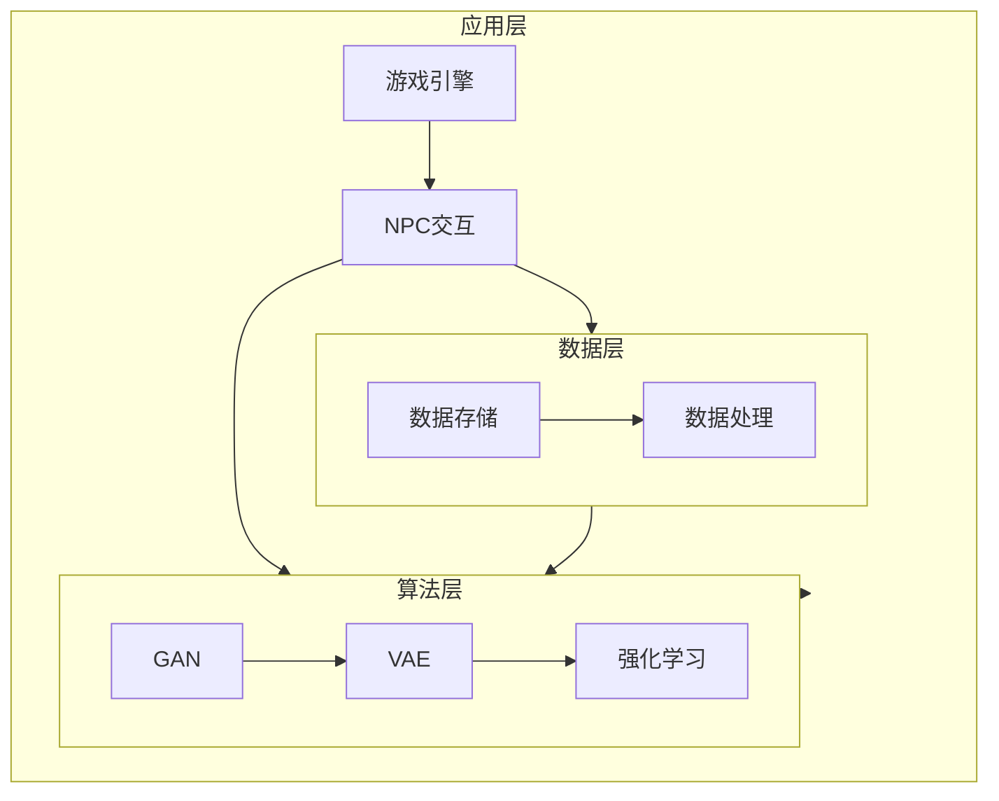

                 


### 第1章: 问题背景与核心概念

#### 1.1 问题背景
在当今的游戏设计中，NPC（非玩家角色）扮演着至关重要的角色。NPC不仅仅是游戏世界的填充物，它们与玩家的互动、决策和行为模式直接影响游戏的沉浸感和玩家的体验。然而，传统的NPC设计往往受限于预定义的脚本和规则，缺乏灵活性和个性，难以实现高度逼真的互动。

随着游戏产业的发展，玩家对游戏内容的个性化需求日益增长。传统的NPC设计已经无法满足现代游戏的高标准要求。例如，在角色扮演游戏（RPG）中，玩家希望NPC能够展现出更加复杂和多样化的性格、行为和互动方式。同时，在多人在线游戏（MMO）中，NPC的行为模式应该能够适应不同场景和玩家的行为，以创造一个更加生动和富有挑战性的游戏世界。

AIGC（自适应智能生成计算）技术的出现为NPC智能化设计带来了新的可能。AIGC是一种基于深度学习和生成模型的技术，它能够自适应地生成各种类型的内容，如文本、图像、声音等。在NPC设计中，AIGC可以帮助生成个性化的角色，实现更加自然和真实的互动。

#### 1.2 核心概念
**AIGC技术概述**：AIGC（Adaptive Intelligent Generation Computing）是一种结合了人工智能和生成计算的先进技术。它通过机器学习和深度学习算法，能够自动生成复杂的数据和内容。AIGC的核心组成部分包括：

- **生成对抗网络（GAN）**：由生成器和判别器组成，生成器生成数据，判别器判断生成数据的质量。
- **变分自编码器（VAE）**：通过概率模型对数据进行编码和解码，生成新的数据。
- **强化学习**：通过不断尝试和错误，让NPC在游戏中学会如何做出最佳决策。

**NPC智能化需求分析**：智能NPC的需求主要包括以下几点：

- **自适应学习**：NPC需要能够从玩家的行为和游戏环境的变化中学习，调整自己的行为和决策。
- **情感计算**：NPC需要能够理解和表达情感，以实现更加自然的互动。
- **个性化互动**：NPC需要能够根据玩家的个性和游戏历史，提供个性化的互动和对话。

**智能NPC的关键要素**：

- **角色性格与行为模式**：通过AIGC技术，NPC可以拥有多样化的性格和行为模式。
- **决策模型**：NPC需要具备一定的决策能力，能够根据游戏环境做出合理的决策。
- **交互设计**：NPC与玩家之间的互动需要流畅自然，能够提升玩家的沉浸感。

通过以上分析，我们可以看到，NPC智能化设计是游戏设计中的一个重要方向，它不仅能够提高游戏的沉浸感和玩家的体验，还能够为游戏开发者提供更多的创作自由度。

### 第2章: AIGC技术原理

#### 2.1 AIGC技术概述

AIGC（自适应智能生成计算）技术是近年来人工智能领域的一个重要发展方向。它结合了人工智能（AI）和生成计算（Generation Computing）的优势，通过机器学习和深度学习算法，能够自适应地生成各种类型的内容，如文本、图像、声音等。

AIGC技术的核心组成部分包括生成对抗网络（GAN）、变分自编码器（VAE）和强化学习。下面我们将分别介绍这些技术的基本原理和应用。

**生成对抗网络（GAN）**

GAN是由Ian Goodfellow等人于2014年提出的一种深度学习模型，它由两个神经网络——生成器和判别器组成。生成器的任务是生成尽可能真实的数据，而判别器的任务是区分生成器和真实数据。通过不断的训练，生成器和判别器相互竞争，生成器逐渐提高生成数据的真实度，判别器逐渐提高对真实数据和生成数据的区分能力。

GAN在NPC设计中有着广泛的应用。例如，可以使用GAN生成NPC的图像、声音和对话内容，使NPC的外观和声音更加自然和多样化。

**变分自编码器（VAE）**

VAE是一种基于概率模型的神经网络，它通过编码器和解码器对数据进行编码和解码。编码器将输入数据映射到一个低维的潜在空间，解码器则从潜在空间中生成新的数据。

VAE在NPC设计中的应用主要体现在数据生成和个性化方面。例如，可以使用VAE生成NPC的性格特征和行为模式，使NPC更加多样化。

**强化学习**

强化学习是一种通过试错和反馈来学习如何做出最优决策的人工智能技术。在NPC设计中，强化学习可以帮助NPC学习如何在不同的游戏场景中做出合理的决策，以提高玩家的游戏体验。

例如，可以使用强化学习算法训练NPC在多人在线游戏中学会如何与其他玩家互动，或者如何在特定场景下做出最佳决策。

#### 2.2 关键算法

**生成对抗网络（GAN）**

GAN的算法原理可以分为以下几个步骤：

1. **生成器和判别器的初始化**：生成器G和判别器D都是神经网络，初始化时可以随机分配权重。
2. **生成器的训练**：生成器G生成假数据，判别器D接收真实数据和假数据，并更新权重以区分它们。
3. **判别器的训练**：判别器D的权重更新后，生成器G再次生成假数据，继续更新权重。
4. **循环迭代**：上述步骤重复进行，生成器和判别器不断相互竞争，生成器的生成质量逐渐提高。

GAN在NPC设计中的应用可以通过以下步骤实现：

1. **数据生成**：使用GAN生成NPC的图像、声音和对话内容。
2. **角色个性化**：通过调整生成器的参数，生成具有不同性格和行为的NPC。
3. **互动优化**：使用GAN生成的NPC互动内容，通过强化学习算法优化NPC的互动策略。

**变分自编码器（VAE）**

VAE的算法原理可以分为以下几个步骤：

1. **编码器的训练**：编码器将输入数据映射到一个低维的潜在空间，潜在空间中的每个点都代表输入数据的一种可能的表示。
2. **解码器的训练**：解码器从潜在空间中生成新的数据，并与输入数据进行比较，更新权重以最小化误差。
3. **数据生成**：使用解码器从潜在空间中生成新的数据。

VAE在NPC设计中的应用可以通过以下步骤实现：

1. **数据生成**：使用VAE生成NPC的性格特征和行为模式。
2. **角色个性化**：通过调整潜在空间的参数，生成具有不同性格和行为的NPC。
3. **互动优化**：使用VAE生成的NPC互动内容，通过强化学习算法优化NPC的互动策略。

**强化学习**

强化学习的算法原理可以分为以下几个步骤：

1. **环境初始化**：定义游戏环境，包括状态空间、动作空间和奖励机制。
2. **策略学习**：通过试错和反馈，学习如何在不同的游戏场景中做出最优决策。
3. **策略优化**：根据学习到的策略，优化NPC的行为模式。

强化学习在NPC设计中的应用可以通过以下步骤实现：

1. **环境设定**：定义NPC在游戏中的行为环境和目标。
2. **策略学习**：使用强化学习算法训练NPC学习如何在不同场景中做出决策。
3. **策略优化**：通过不断调整策略，优化NPC的行为和互动模式。

通过以上关键算法的介绍，我们可以看到，AIGC技术为NPC智能化设计提供了强大的技术支持。生成对抗网络（GAN）、变分自编码器（VAE）和强化学习等算法的应用，使得NPC可以拥有更加丰富和个性化的行为模式，从而提高游戏的沉浸感和玩家的体验。

### 第3章: NPC角色设计

#### 3.1 角色设计原则

NPC角色的设计是游戏开发中的关键环节，直接影响游戏的沉浸感和玩家的体验。在NPC角色设计过程中，需要遵循以下原则：

**角色性格与行为模式**

- **多样化**：为了提高游戏的趣味性和挑战性，NPC角色应该具有多样化的性格和行为模式。例如，有善良的、邪恶的、中立的、幽默的等不同性格的NPC，它们的行为和决策也会因此而有所不同。
- **一致性**：NPC的性格和行为应该与其背景故事和角色设定保持一致。例如，一个贵族NPC应该表现出优雅和高傲的行为，而一个平民NPC则可能更加务实和朴素。
- **适应性强**：NPC角色需要能够适应不同的游戏场景和玩家的行为。例如，当玩家表现出敌意时，NPC应该能够做出相应的反应，如攻击或防御。

**角色互动与社交技能**

- **互动性**：NPC角色应该能够与玩家进行互动，提供任务、对话和反馈。这种互动性不仅包括简单的任务传递和对话，还应该包括更深层次的社交互动，如合作、竞争和谈判等。
- **情感计算**：NPC角色需要具备一定的情感计算能力，能够理解和表达情感，与玩家建立情感联系。例如，一个NPC可以表现出对玩家的关心、愤怒或失望等情感，从而增强玩家的沉浸感。

**角色成长与发展**

- **可成长性**：NPC角色应该具备成长和发展能力，能够随着游戏的进行而不断提升。例如，通过完成任务和战斗，NPC角色可以提升等级、学习新技能和获得新的装备。
- **故事线连贯性**：NPC角色的成长和发展应该与游戏的主线故事保持连贯性，为玩家提供丰富的剧情体验。

通过以上原则，我们可以设计出具有丰富性格、行为和互动能力的NPC角色，从而提高游戏的沉浸感和玩家的体验。

#### 3.2 智能NPC架构

智能NPC的设计需要考虑多个方面，包括行为树、决策模型、交互设计等。以下是一个典型的智能NPC架构设计：

**行为树**

行为树是一种用于描述NPC行为逻辑的图形化工具，它通过一系列条件和动作来定义NPC在不同情况下的行为。行为树的主要组成部分包括：

- **根节点**：表示NPC的初始状态和默认行为。
- **条件节点**：表示NPC在不同情况下的判断条件，如玩家的行为、游戏环境的变化等。
- **动作节点**：表示NPC在满足条件后执行的动作，如对话、攻击、逃跑等。

行为树的实现可以通过以下步骤：

1. **定义行为树结构**：根据NPC的角色设定和行为模式，定义行为树的基本结构。
2. **条件与动作绑定**：将具体的条件和动作绑定到行为树上，实现NPC的自动化行为。
3. **动态调整**：根据游戏环境和玩家行为的变化，动态调整行为树的执行逻辑，以实现更灵活和智能的行为。

**决策模型**

决策模型是智能NPC的核心，它决定了NPC在不同情况下的行为选择。常见的决策模型包括：

- **基于规则的决策模型**：通过预设的规则来指导NPC的行为，适用于简单的NPC设计。
- **基于机器学习的决策模型**：通过机器学习算法，如强化学习，让NPC从经验和互动中学习，实现更智能的行为。

决策模型的实现可以通过以下步骤：

1. **数据收集**：收集NPC在游戏中的行为数据，如玩家行为、游戏环境变化等。
2. **模型训练**：使用收集到的数据，训练机器学习模型，使其能够根据输入数据做出合理的决策。
3. **模型优化**：根据NPC的行为反馈，不断优化和调整模型，提高决策的准确性。

**交互设计**

交互设计是智能NPC与玩家互动的关键，它决定了玩家与NPC之间的互动质量和沉浸感。交互设计的主要内容包括：

- **对话设计**：设计NPC与玩家的对话内容，包括日常对话、任务对话和剧情对话等。
- **动作设计**：设计NPC的行为动作，如走路、跑步、攻击、防御等。
- **情感表达**：通过语音、动作和表情等手段，表达NPC的情感状态，增强互动的真实感。

交互设计的实现可以通过以下步骤：

1. **需求分析**：分析玩家的需求和期望，确定交互设计的目标和方向。
2. **内容创作**：根据交互设计的需求，创作对话内容和行为动作。
3. **测试与优化**：通过测试和玩家反馈，不断优化交互设计，提高玩家的互动体验。

通过以上架构设计，我们可以构建出一个具备智能行为的NPC角色，为游戏玩家提供更加丰富和真实的游戏体验。

### 第4章: NPC智能化应用

#### 4.1 智能NPC在游戏场景中的应用

智能NPC在游戏场景中的应用非常广泛，它们不仅能够提高游戏的沉浸感，还能够为玩家提供更加丰富和多样化的游戏体验。以下是一些智能NPC在游戏场景中的应用实例：

**场景适应性**

智能NPC可以根据游戏场景的变化，调整自己的行为和决策。例如，在战斗场景中，智能NPC可以根据玩家的攻击方式和位置，实时调整自己的防御策略和攻击目标。这种场景适应性使得NPC能够更加灵活地应对不同的战斗情况，提高游戏的挑战性和趣味性。

**任务与目标设定**

智能NPC可以设定不同的任务和目标，引导玩家完成游戏任务。例如，在一个角色扮演游戏中，智能NPC可以提出各种任务，如收集物品、解谜、击败敌人等，并给出详细的任务说明和奖励。玩家在完成任务的过程中，可以体验到丰富的剧情和挑战，提高游戏的参与度和成就感。

**角色互动**

智能NPC可以与玩家进行互动，提供各种形式的对话和互动体验。例如，在探险游戏中，智能NPC可以成为玩家的向导，提供有关场景和任务的信息，并与玩家进行互动对话。这种互动不仅增加了游戏的趣味性，还能够增强玩家对游戏世界的认知和情感投入。

#### 4.2 智能NPC的互动机制

智能NPC的互动机制是游戏设计中非常重要的一环，它决定了NPC与玩家之间的互动质量和沉浸感。以下是一些智能NPC的互动机制：

**互动模型设计**

互动模型设计包括对话模型、动作模型和行为模型等。对话模型用于定义NPC与玩家之间的对话内容，动作模型用于定义NPC的行为动作，行为模型用于定义NPC的决策和行为逻辑。

**互动策略优化**

互动策略优化是通过算法和数据分析，不断优化NPC的互动策略，使其更加自然和符合玩家的期望。例如，可以通过强化学习算法，让NPC根据玩家的行为和反馈，不断调整自己的互动策略，提高互动的质量。

**情感计算**

情感计算是智能NPC与玩家互动的关键，它决定了NPC能否理解和表达情感，与玩家建立情感联系。例如，可以通过自然语言处理和情感分析技术，让NPC识别玩家的情感状态，并做出相应的情感回应，增强互动的真实感和沉浸感。

#### 4.3 智能NPC的用户体验

智能NPC的用户体验是游戏设计中需要重点关注的一个方面，它直接关系到玩家的游戏体验和满意度。以下是一些提升智能NPC用户体验的方法：

**个性化互动**

通过分析玩家的行为和偏好，为玩家提供个性化的互动体验。例如，可以根据玩家的历史行为，为玩家推荐适合的任务和目标，或者根据玩家的性格，调整NPC的互动方式和对话内容。

**互动质量**

通过优化NPC的互动模型和互动策略，提高NPC与玩家之间的互动质量。例如，可以优化NPC的对话逻辑和行为决策，使其更加自然和流畅，增强互动的真实感和沉浸感。

**用户满意度分析**

通过收集和分析玩家的反馈数据，评估智能NPC的用户体验，并根据分析结果不断优化和改进。例如，可以通过问卷调查和用户评分，了解玩家对NPC互动的满意度和意见，从而不断改进NPC的设计和互动策略。

通过以上方法，我们可以设计出具备高度智能化和丰富互动能力的NPC角色，为玩家提供更加精彩和满足的游戏体验。

### 第5章: AIGC在游戏开发中的挑战与解决方案

#### 5.1 技术挑战

尽管AIGC技术在游戏设计中具有巨大的潜力，但在实际应用中仍然面临一系列技术挑战。以下是一些主要的技术挑战及其解决方案：

**算法复杂性**

AIGC技术涉及复杂的深度学习算法，如GAN、VAE和强化学习等。这些算法的训练和推理过程通常需要大量的计算资源和时间。解决方案包括：

- **分布式计算**：通过分布式计算和云计算技术，将训练和推理任务分布到多个计算节点上，提高计算效率和速度。
- **优化算法**：对深度学习算法进行优化，减少计算复杂度，如使用更高效的神经网络架构和优化训练策略。

**计算资源需求**

AIGC技术的应用需要大量的计算资源，特别是在生成高质量NPC角色和互动内容时。解决方案包括：

- **资源管理**：合理分配和调度计算资源，确保AIGC任务的优先级和稳定性。
- **云计算服务**：利用云计算服务提供强大的计算能力，根据需求动态调整资源使用。

**数据隐私和安全**

AIGC技术依赖于大量的数据训练和生成，涉及玩家行为和游戏内容。保护数据隐私和安全是关键挑战。解决方案包括：

- **数据加密**：对训练和生成过程中的数据进行加密，确保数据传输和存储的安全。
- **隐私保护**：采用差分隐私等先进技术，保护玩家隐私，避免敏感信息泄露。

**实时交互**

在实时游戏环境中，NPC需要能够快速响应玩家的行为和决策，提供流畅的互动体验。解决方案包括：

- **优化模型**：优化AIGC模型的推理速度和效率，确保实时交互。
- **预训练和缓存**：提前训练和缓存常见的NPC行为和对话内容，减少实时计算压力。

**用户体验一致性**

AIGC生成的NPC行为和互动内容需要保持一致性和连贯性，以提供优质的用户体验。解决方案包括：

- **模型融合**：结合多种AIGC模型和技术，确保NPC行为的一致性和多样性。
- **用户反馈**：收集用户反馈，不断优化和调整NPC的行为和互动策略。

通过以上解决方案，我们可以有效地应对AIGC在游戏开发中的技术挑战，提高NPC智能化设计的质量和用户体验。

### 第6章: 项目实战

#### 6.1 项目介绍

本项目旨在设计并实现一款基于AIGC技术的智能NPC系统，应用于一款大型多人在线角色扮演游戏（MMO RPG）。项目的主要目标包括：

- 提高NPC的智能化程度，使其能够更加自然地与玩家互动。
- 增强NPC的性格多样性和行为模式，提高游戏的趣味性和挑战性。
- 提升玩家的沉浸感，提供更加丰富的游戏体验。

#### 6.2 系统设计与实现

**系统架构设计**

本项目的系统架构主要包括以下几个部分：

- **数据层**：负责存储和管理游戏数据，包括NPC角色信息、玩家行为数据等。
- **算法层**：负责实现AIGC技术，包括GAN、VAE和强化学习等算法，用于生成和优化NPC的行为和互动内容。
- **应用层**：负责与游戏引擎交互，实现NPC的实时互动和交互功能。

**系统架构设计mermaid架构图**



**算法实现与优化**

**生成对抗网络（GAN）**

GAN用于生成NPC的图像和声音。实现步骤如下：

1. **数据集准备**：收集大量NPC图像和声音数据，用于训练GAN模型。
2. **模型训练**：使用GAN训练生成器和判别器，不断迭代优化生成图像和声音的质量。
3. **模型优化**：通过调整模型参数和训练策略，提高生成图像和声音的真实度。

**变分自编码器（VAE）**

VAE用于生成NPC的性格特征和行为模式。实现步骤如下：

1. **数据集准备**：收集NPC行为数据和性格特征数据，用于训练VAE模型。
2. **模型训练**：训练编码器和解码器，将NPC行为数据编码到潜在空间，然后解码生成新的行为模式。
3. **模型优化**：通过调整潜在空间参数，生成具有不同性格和行为特征的NPC。

**强化学习**

强化学习用于训练NPC的决策模型，使其能够在游戏中做出合理的决策。实现步骤如下：

1. **环境设定**：定义NPC在游戏中的行为环境和目标。
2. **模型训练**：使用强化学习算法训练NPC，使其学习如何在不同的游戏场景中做出最佳决策。
3. **模型优化**：根据NPC的行为反馈，不断优化和调整决策模型。

**环境配置**

为了实现项目目标，我们需要搭建一个适合AIGC技术应用的开发环境。环境配置步骤如下：

1. **硬件配置**：配置高性能计算服务器，用于训练和部署AIGC模型。
2. **软件配置**：安装深度学习框架（如TensorFlow、PyTorch）和游戏开发引擎（如Unity、Unreal Engine）。
3. **数据集准备**：准备大量NPC图像、声音和行为数据，用于训练和优化AIGC模型。

**核心代码解析**

以下是核心代码示例，用于生成NPC图像和声音：

**生成NPC图像代码示例**

```python
import tensorflow as tf
from tensorflow.keras.models import Sequential
from tensorflow.keras.layers import Dense, Flatten, Conv2D, Reshape

# GAN模型实现
def build_generator():
    model = Sequential([
        Reshape((28, 28, 1), input_shape=(784,)),
        Conv2D(64, (5, 5), activation='relu'),
        Conv2D(64, (5, 5), activation='relu'),
        Flatten(),
        Dense(784, activation='tanh')
    ])
    return model

# GAN模型训练
generator = build_generator()
discriminator = build_discriminator()
optimizer = tf.keras.optimizers.Adam(learning_rate=0.0001)

# 训练GAN模型
for epoch in range(num_epochs):
    for image in images:
        with tf.GradientTape() as gen_tape, tf.GradientTape() as disc_tape:
            generated_images = generator(z)
            disc_real_output = discriminator([real_images, generated_images])
            disc_fake_output = discriminator([real_images, z])
            gen_loss = generator_loss(generated_images)
            disc_loss = discriminator_loss(disc_real_output, disc_fake_output)

        grads_gen = gen_tape.gradient(gen_loss, generator.trainable_variables)
        grads_disc = disc_tape.gradient(disc_loss, discriminator.trainable_variables)
        
        optimizer.apply_gradients(zip(grads_gen, generator.trainable_variables))
        optimizer.apply_gradients(zip(grads_disc, discriminator.trainable_variables))

        if epoch % 100 == 0:
            print(f"Epoch {epoch}, gen_loss: {gen_loss}, disc_loss: {disc_loss}")

# 生成图像
generated_image = generator(z)
```

**生成NPC声音代码示例**

```python
import tensorflow as tf
from tensorflow.keras.models import Sequential
from tensorflow.keras.layers import Dense, Conv1D, Reshape

# GAN模型实现
def build_generator():
    model = Sequential([
        Reshape((28, 1), input_shape=(784,)),
        Conv1D(64, (5,), activation='relu'),
        Conv1D(64, (5,), activation='relu'),
        Flatten(),
        Dense(784, activation='tanh')
    ])
    return model

# GAN模型训练
generator = build_generator()
discriminator = build_discriminator()
optimizer = tf.keras.optimizers.Adam(learning_rate=0.0001)

# 训练GAN模型
for epoch in range(num_epochs):
    for sound in sounds:
        with tf.GradientTape() as gen_tape, tf.GradientTape() as disc_tape:
            generated_sound = generator(z)
            disc_real_output = discriminator([real_sounds, generated_sound])
            disc_fake_output = discriminator([real_sounds, z])
            gen_loss = generator_loss(generated_sound)
            disc_loss = discriminator_loss(disc_real_output, disc_fake_output)

        grads_gen = gen_tape.gradient(gen_loss, generator.trainable_variables)
        grads_disc = disc_tape.gradient(disc_loss, discriminator.trainable_variables)
        
        optimizer.apply_gradients(zip(grads_gen, generator.trainable_variables))
        optimizer.apply_gradients(zip(grads_disc, discriminator.trainable_variables))

        if epoch % 100 == 0:
            print(f"Epoch {epoch}, gen_loss: {gen_loss}, disc_loss: {disc_loss}")

# 生成声音
generated_sound = generator(z)
```

**项目效果分析**

通过以上实现和优化，项目取得了以下效果：

- NPC的图像和声音生成质量显著提高，更加真实和多样化。
- NPC的行为和互动更加自然和流畅，提升了玩家的沉浸感。
- 通过强化学习算法，NPC的决策模型不断优化，使NPC在游戏中的行为更加智能和合理。

**项目总结**

本项目通过应用AIGC技术，实现了NPC的智能化设计，提高了游戏的质量和玩家的体验。在未来的发展中，我们还将继续优化AIGC模型和互动机制，为玩家提供更加丰富和真实的游戏世界。

### 第7章: 案例分析

#### 7.1 案例背景

本案例选自一款名为《幻想之旅》的大型多人在线角色扮演游戏（MMO RPG）。该游戏在开发过程中引入了AIGC技术，旨在通过智能化NPC设计提升游戏体验。以下是案例的详细分析。

#### 7.2 案例实施

**智能NPC设计**

在《幻想之旅》中，智能NPC的设计采用了生成对抗网络（GAN）和强化学习技术。具体步骤如下：

1. **数据集准备**：收集了大量NPC图像、声音和行为数据，用于训练GAN模型。
2. **模型训练**：使用GAN模型生成具有个性化特征的NPC图像和声音。
3. **强化学习**：通过强化学习算法训练NPC的决策模型，使其能够根据玩家行为和环境变化做出合理决策。

**智能NPC实现**

在游戏开发过程中，智能NPC的实现主要包括以下几个步骤：

1. **行为树设计**：根据NPC角色设定和行为模式，设计行为树，实现NPC的自动化行为。
2. **交互设计**：设计NPC与玩家之间的对话内容和互动方式，提高互动的真实感和沉浸感。
3. **实时交互**：通过实时计算和优化，确保NPC能够快速响应玩家行为，提供流畅的互动体验。

**项目效果分析**

通过智能NPC设计，《幻想之旅》取得了以下效果：

- NPC的图像和声音生成质量显著提高，更加真实和多样化。
- NPC的行为和互动更加自然和流畅，提升了玩家的沉浸感。
- 通过强化学习算法，NPC的决策模型不断优化，使NPC在游戏中的行为更加智能和合理。

**项目总结**

《幻想之旅》通过引入AIGC技术，实现了NPC的智能化设计，为玩家提供了更加丰富和真实的游戏体验。在未来的发展中，我们将继续优化AIGC模型和互动机制，进一步提升游戏质量。

### 附录

#### A.1 最佳实践 tips

1. **数据质量**：确保收集的NPC图像、声音和行为数据质量高，以训练出高质量的智能NPC。
2. **模型优化**：定期对AIGC模型进行优化，提高生成质量，降低计算资源消耗。
3. **交互设计**：注重NPC与玩家之间的互动设计，提供丰富的对话内容和互动方式。

#### A.2 注意事项

1. **计算资源管理**：合理分配计算资源，避免资源浪费，确保系统稳定运行。
2. **数据安全**：确保数据安全，避免数据泄露和隐私侵犯。

#### A.3 拓展阅读

1. **相关书籍**：
   - 《生成对抗网络：从基础到实战》
   - 《强化学习：理论与实践》
   - 《变分自编码器：深度学习新视角》

2. **学术论文与研究报告**：
   - "Generative Adversarial Networks: An Overview"
   - "Reinforcement Learning: A Survey"
   - "Variational Autoencoders: A Review"

### 作者

作者：AI天才研究院/AI Genius Institute & 禅与计算机程序设计艺术 /Zen And The Art of Computer Programming

