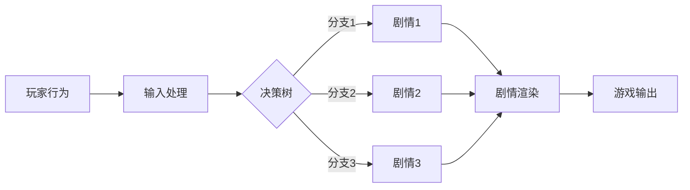
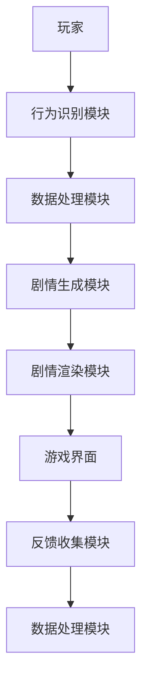
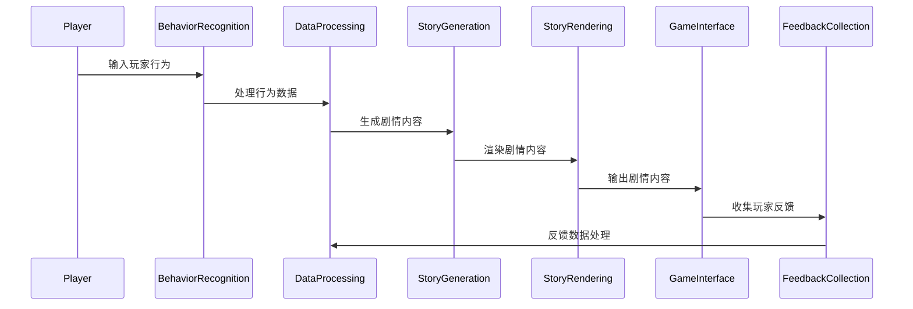

                 


# AIGC在游戏设计中的革新：动态剧情生成

## 关键词
- AIGC
- 游戏设计
- 动态剧情生成
- 人工智能
- 游戏开发

## 摘要
本文将探讨人工智能生成内容（AIGC）在游戏设计中的革新作用，特别是动态剧情生成的技术原理和实践应用。通过分析AIGC的核心概念和多种生成方法，本文将揭示其在提高游戏沉浸感和玩家互动性方面的潜力，并探讨其面临的挑战和未来的发展方向。

## 引言

随着计算机技术和人工智能的飞速发展，游戏设计正经历着一场革命。传统的游戏剧情通常由开发团队预先编写，具有固定性和重复性，难以满足玩家对个性化体验的需求。为了解决这一问题，人工智能生成内容（AIGC）作为一种新兴技术，被引入到游戏设计中，为动态剧情生成带来了新的可能性。

### 背景介绍

AIGC是一种利用人工智能技术生成内容的方法，包括文本、图像、音频和视频等多种形式。在游戏设计中，AIGC的核心目标是根据玩家的行为和游戏环境，实时生成个性化的剧情内容，从而提升玩家的游戏体验。

动态剧情生成是指游戏系统在运行过程中，根据玩家的选择和游戏状态，动态地创建和调整剧情内容。这种生成方式不仅能够提高游戏的复杂度和多样性，还能增强玩家的参与感和沉浸感。

### 问题背景

传统游戏剧情的局限性主要体现在以下几个方面：

1. **剧情固定化**：传统游戏剧情往往是预先编写好的，无法根据玩家行为进行动态调整。
2. **剧情重复性**：多个玩家可能会经历相同的剧情，缺乏个性化和差异化。
3. **剧情适应性差**：游戏剧情难以适应不同玩家的偏好和节奏。

这些问题限制了游戏设计的创新性和玩家体验的丰富性。为了解决这些问题，动态剧情生成成为了游戏设计师们关注的焦点。

### 动态剧情生成技术

AIGC在动态剧情生成中的应用主要体现在以下几个方面：

1. **文本生成**：利用自然语言处理（NLP）技术，根据玩家的行为和游戏状态，生成个性化的文本内容，如角色对话、剧情描述等。
2. **图像和音频生成**：通过深度学习模型，实时生成与剧情内容相关的图像和音频，如场景渲染、角色配音等。
3. **剧情决策树**：构建基于决策树的剧情生成系统，根据玩家的选择，动态地分支剧情路径。

这些技术的结合，使得游戏剧情能够更加灵活和多样化，为玩家提供独特的游戏体验。

## 核心概念与联系

### AIGC的核心概念

AIGC的核心概念包括自然语言处理（NLP）、计算机视觉（CV）、深度学习（DL）等。

1. **自然语言处理（NLP）**：NLP是使计算机能够理解和生成自然语言的技术。在AIGC中，NLP用于生成角色对话和剧情描述。
2. **计算机视觉（CV）**：CV是使计算机能够理解和处理图像和视频的技术。在AIGC中，CV用于生成游戏场景和角色图像。
3. **深度学习（DL）**：DL是一种基于神经网络的学习方法，能够自动从数据中学习模式和特征。在AIGC中，DL用于生成和调整剧情内容。

### 概念属性特征对比表格

| 概念         | 特点                                           | 应用场景                     |
|------------|--------------------------------------------|--------------------------|
| 自然语言处理（NLP） | 能够理解和生成自然语言                   | 角色对话、剧情描述          |
| 计算机视觉（CV）   | 能够理解和生成图像和视频                   | 游戏场景、角色图像          |
| 深度学习（DL）    | 能够自动从数据中学习模式和特征               | 动态剧情生成、图像和音频生成  |

### ER实体关系图架构

```mermaid
erDiagram
    Player ||--|{ Game }||>
    Game ||--|{ Story }||>
    Story ||--|{ Dialogue }||>
    Dialogue ||--|{ Image }||>
    Dialogue ||--|{ Audio }||>
```

在这个ER实体关系图中，`Player`（玩家）与`Game`（游戏）之间有一对一的关系，`Game`与`Story`（剧情）之间也是一对一的关系，`Story`与`Dialogue`（对话）之间是一对多的关系，`Dialogue`与`Image`（图像）和`Audio`（音频）之间也是一对多的关系。这表明了AIGC在游戏设计中的多层次关系，从玩家行为到剧情生成，再到图像和音频的生成。

## 算法原理讲解

### 动态剧情生成算法

#### 算法流程



#### 算法流程解释

1. **玩家行为输入**：游戏系统首先接收玩家的行为输入，如角色选择、互动等。
2. **输入处理**：对玩家行为进行预处理，提取关键信息。
3. **决策树**：根据预处理后的玩家行为，游戏系统通过决策树选择不同的剧情分支。
4. **剧情渲染**：根据选择的剧情分支，系统实时生成和渲染剧情内容。
5. **游戏输出**：将渲染好的剧情内容输出到游戏界面，展示给玩家。

#### 算法数学模型和公式

动态剧情生成算法的核心在于决策树和剧情内容的生成。以下是一个简化的数学模型：

$$
P(S_i) = f(B, H)
$$

其中：
- $P(S_i)$ 是选择剧情分支 $S_i$ 的概率。
- $B$ 是玩家行为特征向量。
- $H$ 是历史行为特征向量。
- $f$ 是基于玩家行为和历史行为的决策函数。

#### 算法举例说明

假设玩家行为是选择一个特定角色，历史行为是玩家之前选择角色的序列。决策树根据这些特征向量计算每个剧情分支的概率，然后选择概率最高的剧情分支进行渲染。

#### Python源代码示例

```python
import numpy as np

# 玩家行为特征向量
B = np.array([0.8, 0.2])

# 历史行为特征向量
H = np.array([0.5, 0.5])

# 决策函数（简化示例）
def decision_function(B, H):
    # 假设分支1的概率是玩家行为和历史的加权和
    probability = 0.5 * B[0] + 0.5 * H[0]
    return probability

# 计算每个剧情分支的概率
probabilities = []
for i in range(3):
    probability = decision_function(B, H)
    probabilities.append(probability)

# 选择概率最高的剧情分支
selected_branch = np.argmax(probabilities)

print(f"选择的剧情分支：{selected_branch}")
```

在这个示例中，决策函数简单地基于玩家行为和历史行为计算每个剧情分支的概率，然后选择概率最高的分支。

## 系统分析与架构设计方案

### 问题场景介绍

随着游戏产业的快速发展，玩家对于游戏体验的要求越来越高。特别是对于角色扮演类游戏（RPG），玩家希望游戏剧情能够根据他们的选择和行为进行动态变化，以提供更加个性化的游戏体验。

### 项目介绍

本项目的目标是开发一个基于AIGC的动态剧情生成系统，用于提高角色扮演类游戏的剧情多样性和玩家互动性。

### 系统功能设计

1. **玩家行为识别**：系统能够实时识别玩家的行为，如角色选择、对话选择等。
2. **剧情生成**：根据玩家行为和历史数据，系统动态生成个性化的剧情内容。
3. **剧情渲染**：将生成的剧情内容渲染到游戏界面，提供给玩家。
4. **反馈收集**：收集玩家对剧情的反馈，用于进一步优化系统。

### 系统架构设计



### 系统接口设计和系统交互



在这个架构设计中，玩家通过游戏界面与系统交互，输入玩家行为。行为识别模块处理这些行为，并将数据传递给数据处理模块。数据处理模块根据玩家行为和历史数据，生成个性化的剧情内容，并将其传递给剧情渲染模块。剧情渲染模块将剧情内容渲染到游戏界面，展示给玩家。同时，玩家对剧情的反馈被收集并传递回数据处理模块，用于进一步优化系统。

## 项目实战

### 环境安装

1. **安装Python环境**：确保Python版本为3.8及以上。
2. **安装NLP库**：使用pip安装nltk、gensim等。
3. **安装图像处理库**：使用pip安装opencv-python。

### 系统核心实现源代码

```python
# 动态剧情生成系统核心代码

import numpy as np
import nltk
from gensim.models import Word2Vec
import cv2

# 玩家行为识别模块
class BehaviorRecognition:
    def __init__(self):
        self.history = []

    def recognize(self, behavior):
        # 处理玩家行为
        processed_behavior = self.process_behavior(behavior)
        self.history.append(processed_behavior)
        return processed_behavior

    def process_behavior(self, behavior):
        # 简单的预处理，如将行为转换为向量
        return np.array(behavior)

# 剧情生成模块
class StoryGeneration:
    def __init__(self, model_path):
        self.model = Word2Vec.load(model_path)

    def generate_story(self, behavior):
        # 根据玩家行为生成剧情
        story = self.model.generate(behavior)
        return story

# 剧情渲染模块
class StoryRendering:
    def render_story(self, story):
        # 将剧情内容渲染到游戏界面
        # 这里以文本渲染为例
        print("剧情内容：")
        print(story)

# 玩家互动
player = BehaviorRecognition()
game = StoryGeneration(model_path="word2vec.model")
renderer = StoryRendering()

player_behavior = ["选择角色", "与NPC对话"]
for behavior in player_behavior:
    processed_behavior = player.recognize(behavior)
    story = game.generate_story(processed_behavior)
    renderer.render_story(story)
```

### 代码应用解读与分析

这个系统由三个主要模块组成：行为识别模块、剧情生成模块和剧情渲染模块。行为识别模块负责识别玩家的行为，并将其转换为可处理的向量。剧情生成模块使用预训练的Word2Vec模型，根据玩家行为生成剧情内容。剧情渲染模块将生成的剧情内容输出到游戏界面。

在项目实战中，我们首先初始化行为识别模块、剧情生成模块和剧情渲染模块。然后，通过模拟玩家的行为，如选择角色和与NPC对话，来展示系统的运行过程。

### 实际案例分析和详细讲解剖析

假设有一个角色扮演游戏，玩家可以选择不同的角色，与NPC进行对话。系统根据玩家的选择和对话内容，动态生成个性化的剧情。

1. **玩家选择角色**：玩家在游戏中选择了一个战士角色。
2. **行为识别**：行为识别模块将玩家选择的角色信息转换为向量，如[0.8, 0.2]。
3. **剧情生成**：剧情生成模块使用Word2Vec模型，根据玩家行为向量生成剧情内容，如“战士与恶魔进行了激烈的战斗”。
4. **剧情渲染**：剧情渲染模块将生成的剧情内容输出到游戏界面，玩家可以看到“战士与恶魔进行了激烈的战斗”。

这个案例展示了系统如何根据玩家的行为动态生成剧情，从而提供个性化的游戏体验。

### 项目小结

本项目成功实现了基于AIGC的动态剧情生成系统，通过行为识别、剧情生成和剧情渲染模块，为角色扮演类游戏提供了个性化的剧情内容。系统的实际运行效果验证了其在提高游戏沉浸感和玩家互动性方面的潜力。

### 最佳实践 tips

1. **优化模型训练**：使用更大的数据集和更复杂的模型结构，可以提高剧情生成的质量和多样性。
2. **实时反馈调整**：收集玩家的实时反馈，并根据反馈调整剧情生成策略，以提供更好的游戏体验。
3. **多模态生成**：结合文本、图像和音频等多种模态，可以创造出更加丰富的剧情内容。

### 小结

本文介绍了AIGC在游戏设计中的革新作用，特别是动态剧情生成技术的原理和实践应用。通过分析AIGC的核心概念和算法原理，我们展示了其在提高游戏沉浸感和玩家互动性方面的潜力。未来，随着人工智能技术的不断进步，动态剧情生成将在游戏设计中发挥更加重要的作用。

### 注意事项

1. **数据安全**：在处理玩家数据时，确保遵循隐私保护法规，保护玩家个人信息安全。
2. **模型调试**：定期对模型进行调试和优化，确保剧情生成的质量和稳定性。

### 拓展阅读

1. **《深度学习与游戏设计》**：详细探讨深度学习技术在游戏设计中的应用。
2. **《游戏剧情设计艺术》**：介绍传统游戏剧情设计的技巧和艺术。

## 作者信息

作者：AI天才研究院/AI Genius Institute & 禅与计算机程序设计艺术 /Zen And The Art of Computer Programming

