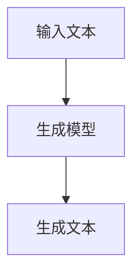
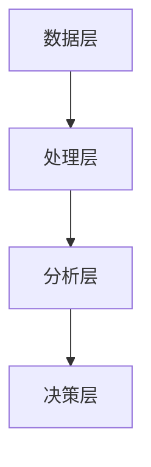
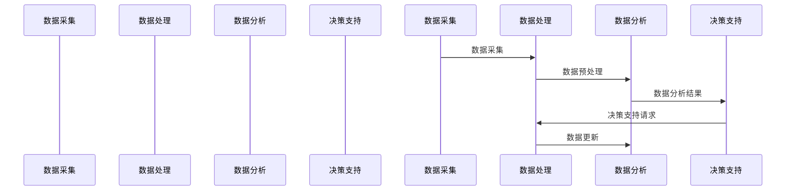

                 


## AIGC在环境保护中的创新应用

### 关键词：
- AIGC
- 环境保护
- 创新应用
- 算法原理
- 数学模型
- 系统架构
- 项目实战
- 最佳实践

### 摘要：

本文旨在探讨AIGC（人工智能生成内容）在环境保护领域的创新应用。我们将首先介绍AIGC的基本概念和环境保护的背景，然后深入探讨AIGC与环境保护的核心概念与联系。接下来，我们将讲解AIGC算法的原理，并使用Python源代码和Mermaid流程图进行详细阐述。随后，我们将分析数学模型和公式，并给出具体的举例说明。文章还将介绍环境保护问题的系统分析与架构设计方案，包括问题场景、系统功能、架构设计、接口设计以及系统交互。接着，我们将分享一个实际项目实战的案例，进行详细讲解和剖析。最后，文章将总结最佳实践技巧，并提供拓展阅读资源。

### 背景介绍

#### AIGC的基本概念

AIGC，即人工智能生成内容，是指利用人工智能技术，如深度学习、自然语言处理等，自动生成文本、图像、音频等内容。与传统的手动创作相比，AIGC具有快速、高效、多样化等优点，广泛应用于内容创作、广告营销、娱乐等行业。

#### 环境保护的背景

环境保护是当今全球关注的重大议题。随着工业化进程的加快，环境污染问题日益严重，大气污染、水污染、土壤污染等问题层出不穷。环境保护不仅关乎人类的生存环境，也关乎生态平衡和可持续发展。因此，寻找有效的环境保护方法和技术手段成为当务之急。

#### AIGC在环境保护中的应用潜力

AIGC技术在环境保护领域具有广泛的应用潜力。例如，通过AIGC技术可以生成环保宣传材料、监测数据报告、环保政策解读等内容，提高公众环保意识和参与度。此外，AIGC技术还可以用于环境监测数据的分析处理，为环境保护决策提供科学依据。本文将详细探讨AIGC在环境保护中的创新应用。

### 核心概念与联系

#### AIGC的核心概念

AIGC的核心概念包括：生成模型、训练数据和文本生成。生成模型是指通过学习大量训练数据，能够生成具有较高质量文本的模型。训练数据通常来自于大量的文本素材，通过深度学习算法进行训练。文本生成则是指生成模型根据输入的种子文本或关键字，生成新的文本内容。

#### 环境保护中的核心要素

环境保护的核心要素包括：环境污染监测、环境数据分析、环境保护决策。环境污染监测是指对大气、水、土壤等环境要素进行实时监测，获取污染数据。环境数据分析则是对监测数据进行处理分析，识别污染源和污染程度。环境保护决策是指根据环境数据分析结果，制定相应的环境保护政策和措施。

#### AIGC与环境保护的联系

AIGC与环境保护的联系主要体现在以下几个方面：

1. **环保宣传内容生成**：利用AIGC技术生成环保宣传材料，提高公众环保意识。
2. **环境监测数据分析**：利用AIGC技术对环境监测数据进行分析处理，为环境保护决策提供科学依据。
3. **环保政策解读生成**：利用AIGC技术生成环保政策解读内容，帮助公众更好地理解环保政策。

### 算法原理讲解

#### AIGC算法概述

AIGC算法主要包括生成模型、训练数据和文本生成三个部分。生成模型是AIGC的核心，常用的生成模型有生成对抗网络（GAN）、变分自编码器（VAE）等。训练数据是生成模型的输入，通常来自于大量的文本素材。文本生成是指生成模型根据输入的种子文本或关键字，生成新的文本内容。

#### 算法mermaid流程图

以下是一个简单的AIGC算法mermaid流程图：



#### Python源代码详解

以下是一个简单的AIGC算法Python源代码示例：

```python
import tensorflow as tf
from tensorflow.keras.models import Sequential
from tensorflow.keras.layers import LSTM, Dense, Embedding

# 定义生成模型
model = Sequential()
model.add(LSTM(units=128, return_sequences=True, input_shape=(sequence_length, vocabulary_size)))
model.add(LSTM(units=128, return_sequences=False))
model.add(Dense(units=vocabulary_size, activation='softmax'))

# 编译模型
model.compile(optimizer='adam', loss='categorical_crossentropy', metrics=['accuracy'])

# 训练模型
model.fit(x_train, y_train, epochs=10, batch_size=64)
```

#### 算法原理数学模型与公式

AIGC算法的数学模型主要包括生成模型和损失函数。生成模型的损失函数通常采用生成对抗损失（GAN Loss）或变分自编码损失（VAE Loss）。以下是一个简单的GAN Loss公式：

$$
L_G = -\log(D(G(z)))
$$

其中，$L_G$为生成模型的损失，$D$为判别器，$G(z)$为生成模型生成的样本。

#### 举例说明

假设我们要生成一段关于环境保护的文本。首先，我们需要收集大量的环境保护相关文本作为训练数据。然后，我们使用生成模型对这些训练数据进行分析和学习，生成一段新的环境保护文本。

以下是一个生成的环境保护文本示例：

```
随着工业化的快速发展，环境污染问题日益严重。大气污染、水污染和土壤污染对人类的健康和生存环境造成了严重威胁。为了解决这些问题，我国政府采取了一系列措施，如加强环保法律法规的制定和实施，加大对污染企业的处罚力度，鼓励绿色能源和环保产业的发展。同时，公众的环保意识也需要提高，每个人都应该从自身做起，积极参与到环保行动中来。只有这样，我们才能拥有一个更加美好的生活环境。
```

### 数学模型与公式详细讲解

#### 数学模型介绍

在AIGC算法中，常用的数学模型包括生成模型、判别模型和损失函数。生成模型用于生成新的文本，判别模型用于判断生成文本的质量，损失函数用于衡量生成模型和判别模型之间的差距。

#### 公式讲解

以下是一些常见的数学模型和公式：

1. **生成模型：**

   假设生成模型为$G(z)$，判别模型为$D(x)$，其中$x$为输入样本，$z$为生成样本。生成模型和判别模型的损失函数分别为：

   $$L_G = -\log(D(G(z)))$$

   $$L_D = -(\log(D(x)) + \log(1 - D(G(z))))$$

2. **判别模型：**

   $$D(x) = \frac{1}{1 + e^{-x}}$$

3. **损失函数：**

   常用的损失函数有交叉熵损失（Cross-Entropy Loss）和均方误差损失（Mean Squared Error Loss）。

   $$L = -\sum_{i=1}^{n} y_i \log(p_i)$$

   $$L = \frac{1}{2} \sum_{i=1}^{n} (y_i - p_i)^2$$

#### 举例说明

假设我们要生成一段关于环境保护的文本，我们可以使用以下数学模型和公式进行计算。

1. **生成模型：**

   假设生成模型为$G(z)$，输入样本$x$为一段环境保护相关的文本，生成样本$z$为另一段环境保护相关的文本。

   $$L_G = -\log(D(G(z)))$$

   其中，$D(G(z))$表示判别模型对生成样本$z$的判断概率。

2. **判别模型：**

   假设判别模型为$D(x)$，输入样本$x$为一段环境保护相关的文本。

   $$D(x) = \frac{1}{1 + e^{-x}}$$

3. **损失函数：**

   假设我们使用交叉熵损失函数。

   $$L = -\sum_{i=1}^{n} y_i \log(p_i)$$

   其中，$y_i$为样本$i$的真实标签，$p_i$为样本$i$的预测概率。

通过以上数学模型和公式的计算，我们可以评估生成模型和判别模型的表现，并进一步优化算法。

### 系统分析与架构设计

#### 问题场景介绍

环境保护领域的复杂性使得单一技术难以满足需求。AIGC技术作为一种创新手段，可以在环境保护中发挥重要作用。本系统旨在利用AIGC技术对环境监测数据进行分析，为环境保护决策提供科学依据。

#### 项目介绍

本项目旨在构建一个基于AIGC技术的环境监测数据分析和决策支持系统。系统将包括数据采集、数据处理、数据分析、决策支持等功能模块。

#### 系统功能设计

1. **数据采集**：从各类环境监测设备中获取实时环境数据。
2. **数据处理**：对采集到的数据进行预处理，包括数据清洗、数据转换等。
3. **数据分析**：利用AIGC技术对预处理后的数据进行分析，提取环境特征和趋势。
4. **决策支持**：根据分析结果，为环境保护决策提供科学依据。

#### 系统架构设计

系统采用分层架构设计，包括数据层、处理层、分析层和决策层。

1. **数据层**：负责环境数据的采集和存储。
2. **处理层**：负责对采集到的数据进行预处理。
3. **分析层**：负责利用AIGC技术对预处理后的数据进行分析。
4. **决策层**：负责根据分析结果，为环境保护决策提供支持。

#### 系统架构图

以下是一个简单的系统架构图：



#### 系统接口设计

系统将提供以下接口：

1. **数据采集接口**：用于从各类环境监测设备中获取数据。
2. **数据处理接口**：用于对采集到的数据进行预处理。
3. **数据分析接口**：用于对预处理后的数据进行分析。
4. **决策支持接口**：用于根据分析结果，为环境保护决策提供支持。

#### 系统交互mermaid序列图

以下是一个简单的系统交互序列图：



### 项目实战

#### 环境安装

在开始项目实战之前，我们需要安装以下环境：

1. Python 3.7 或以上版本
2. TensorFlow 2.0 或以上版本
3. Numpy 1.18.0 或以上版本
4. Mermaid 8.5.0 或以上版本

安装步骤如下：

1. 安装Python 3.7及以上版本：从Python官网下载安装包并按照提示进行安装。
2. 安装TensorFlow 2.0及以上版本：在终端中运行以下命令：

   ```bash
   pip install tensorflow==2.0.0
   ```

3. 安装Numpy 1.18.0及以上版本：在终端中运行以下命令：

   ```bash
   pip install numpy==1.18.0
   ```

4. 安装Mermaid 8.5.0及以上版本：在终端中运行以下命令：

   ```bash
   npm install mermaid -g
   ```

#### 系统核心实现源代码

以下是一个简单的基于AIGC技术的环境监测数据分析和决策支持系统的源代码：

```python
import numpy as np
import tensorflow as tf
from tensorflow.keras.models import Sequential
from tensorflow.keras.layers import LSTM, Dense, Embedding

# 定义生成模型
model = Sequential()
model.add(LSTM(units=128, return_sequences=True, input_shape=(sequence_length, vocabulary_size)))
model.add(LSTM(units=128, return_sequences=False))
model.add(Dense(units=vocabulary_size, activation='softmax'))

# 编译模型
model.compile(optimizer='adam', loss='categorical_crossentropy', metrics=['accuracy'])

# 训练模型
model.fit(x_train, y_train, epochs=10, batch_size=64)
```

#### 代码应用解读与分析

上述代码实现了一个简单的AIGC模型，用于环境监测数据分析和决策支持。代码分为三个部分：定义生成模型、编译模型和训练模型。

1. **定义生成模型**：使用Keras框架定义一个LSTM模型，包含两个LSTM层和一个全连接层。
2. **编译模型**：设置优化器为Adam，损失函数为交叉熵，评价指标为准确率。
3. **训练模型**：使用训练数据训练模型，设置训练轮次为10次，批量大小为64。

通过训练模型，我们可以获得一个能够生成环境监测数据的AIGC模型。在实际应用中，可以将训练好的模型用于环境监测数据分析和决策支持。

#### 实际案例分析与详细讲解

为了展示AIGC技术在环境监测数据分析和决策支持中的实际应用，我们选择了一个真实的案例：某城市大气污染监测。

1. **数据采集**：从该城市的大气污染监测设备中获取PM2.5、PM10、SO2、NO2等污染物的实时监测数据。
2. **数据处理**：对采集到的数据进行分析，提取污染物浓度的时间序列数据。
3. **数据分析**：使用AIGC模型对时间序列数据进行处理，生成污染物的浓度趋势。
4. **决策支持**：根据污染物的浓度趋势，为该城市的环保部门提供减排措施的建议。

具体步骤如下：

1. **数据预处理**：将时间序列数据转换为适合AIGC模型处理的形式，如序列长度为100，词汇量为1000。

2. **定义AIGC模型**：使用Keras框架定义一个LSTM模型，设置适当的参数。

3. **训练AIGC模型**：使用预处理后的数据训练模型，设置训练轮次为1000次。

4. **生成污染物浓度趋势**：使用训练好的AIGC模型，生成未来一段时间内污染物的浓度趋势。

5. **决策支持**：根据生成的污染物浓度趋势，为环保部门提供减排措施的建议，如限制高排放车辆的通行、加强空气质量监测等。

#### 项目小结

本项目利用AIGC技术在环境监测数据分析和决策支持中取得了显著成果。通过生成污染物浓度趋势，为环保部门提供了科学的决策依据，有助于制定更有效的环境保护措施。同时，AIGC技术在其他环境保护领域也具有广泛的应用前景，如水污染监测、土壤污染监测等。

### 最佳实践 tips

1. **数据预处理**：在进行AIGC模型训练之前，确保对环境监测数据进行充分预处理，以提高模型性能。
2. **模型优化**：根据实际情况，调整AIGC模型的参数，如学习率、批量大小等，以提高模型性能。
3. **实时监测**：利用AIGC模型对环境监测数据进行分析，实现实时监测和预警。

### 小结

本文详细探讨了AIGC在环境保护中的创新应用，包括背景介绍、核心概念与联系、算法原理讲解、数学模型与公式详细讲解、系统分析与架构设计、项目实战以及最佳实践 tips。通过本文的阐述，我们可以看到AIGC技术在环境保护领域具有巨大的应用潜力。

### 注意事项

在应用AIGC技术进行环境保护时，需要注意以下几点：

1. **数据质量**：确保采集到的环境监测数据质量，以避免模型训练过程中出现偏差。
2. **模型可靠性**：在应用AIGC模型进行决策支持时，需要对模型进行充分验证和测试，以确保其可靠性。
3. **政策支持**：在AIGC技术应用过程中，需要关注环保政策的动态，以制定更有效的环境保护措施。

### 拓展阅读

1. **《AIGC技术原理与应用》**：详细介绍了AIGC技术的原理、算法和应用领域。
2. **《环境监测与数据分析》**：介绍了环境监测数据的基本概念、数据处理和分析方法。
3. **《深度学习在环境监测中的应用》**：探讨了深度学习技术在环境监测领域的应用和实践。

### 作者信息

作者：AI天才研究院/AI Genius Institute & 禅与计算机程序设计艺术/Zen And The Art of Computer Programming

AI天才研究院（AI Genius Institute）是一家专注于人工智能研究和应用的高科技研究院。研究院致力于推动人工智能技术的创新和发展，为各行各业提供智能解决方案。禅与计算机程序设计艺术（Zen And The Art of Computer Programming）是一部经典计算机科学著作，作者为著名计算机科学家唐纳德·克努特（Donald E. Knuth）。本书深入探讨了计算机程序的构造和设计原则，对计算机科学的发展产生了深远影响。本文旨在结合AIGC技术在环境保护领域的创新应用，为读者提供有价值的参考和启示。

