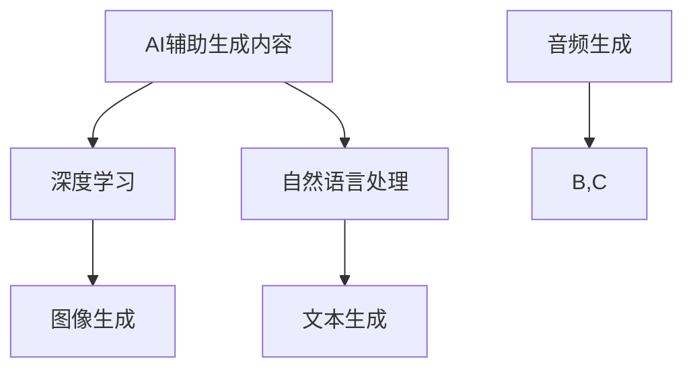
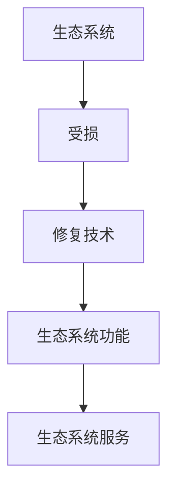
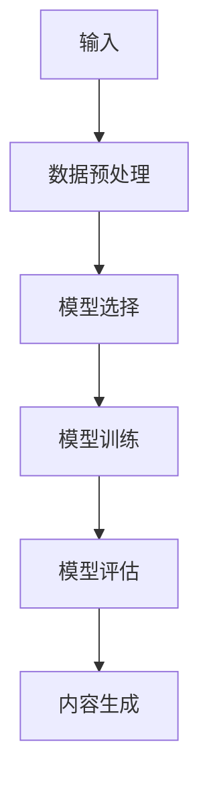
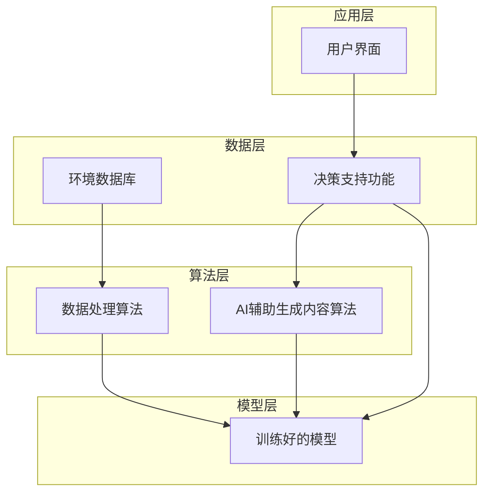
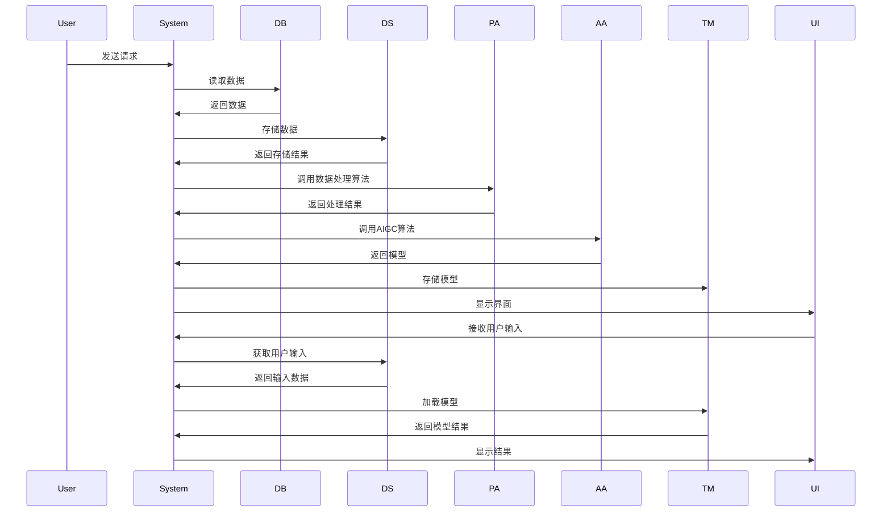
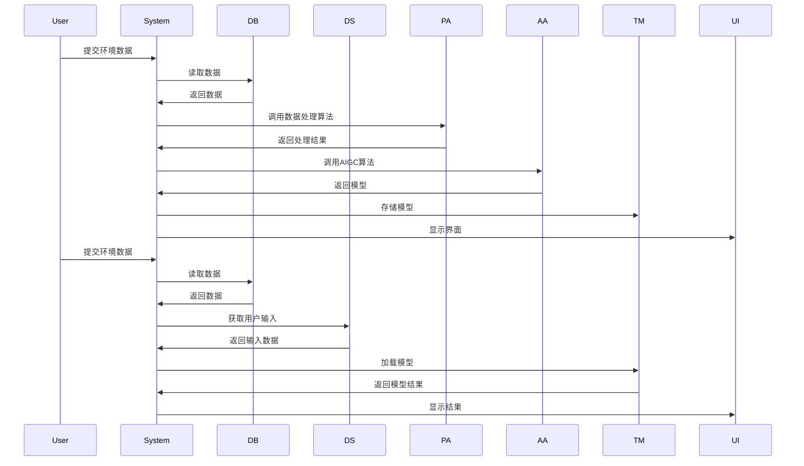

                 

# AIGC在环境修复决策中的应用：AI驱动的生态系统恢复策略

关键词：AIGC，环境修复，生态系统恢复，决策支持系统，人工智能

摘要：本文旨在探讨AIGC（AI辅助生成内容）技术在环境修复决策中的应用，通过AI驱动的生态系统恢复策略，为解决环境问题提供新的思路和方法。本文将详细分析AIGC技术原理及其在环境修复决策中的应用，提供具体的实施策略和方法，旨在为环保工作者、科研人员及相关领域从业者提供参考。

## 第一部分：背景介绍

### 1. 引言

**问题背景**：随着工业化和城市化进程的加速，环境问题日益严重。生态系统受损，生物多样性下降，水资源污染，土壤退化等问题频发。为了应对这些挑战，环境修复决策成为当前环保工作的重点。

**问题描述**：在环境修复过程中，如何有效进行决策支持，提高修复效率，实现生态系统恢复成为亟待解决的问题。AIGC技术的迅猛发展为环境修复决策提供了新的工具和方法。

**问题解决**：本文将详细介绍AIGC技术在环境修复决策中的应用，通过AI驱动的生态系统恢复策略，实现环境问题的有效解决。

**边界与外延**：本文聚焦于AIGC在环境修复决策中的应用，涵盖生态系统恢复的各个方面，包括生物多样性保护、水资源管理、土壤修复等。

**概念结构与核心要素组成**：
- **AIGC**：AI辅助生成内容，是一种基于人工智能技术生成内容的方法。
- **环境修复**：指通过技术和措施，恢复受损生态系统的功能和服务。
- **决策**：在环境修复过程中，基于数据分析和模型预测，做出合理的决策。

### 2. 核心概念与联系

#### 2.1 AIGC

**概念原理**：AIGC是一种利用人工智能技术，自动生成高质量内容的方法。它基于深度学习、自然语言处理等核心技术，能够生成文本、图像、音频等多种类型的内容。

**概念属性特征对比表格**：

| 特征 | AIGC | 传统生成内容 |
| --- | --- | --- |
| 自动性 | 自动生成 | 人工创作 |
| 质量高 | 高质量内容 | 质量参差不齐 |
| 灵活性 | 应对复杂需求 | 应对简单需求 |

**ER实体关系图架构**：



#### 2.2 环境修复

**概念原理**：环境修复是指通过技术和措施，恢复受损生态系统的功能和服务，实现生态平衡。

**概念属性特征对比表格**：

| 特征 | 环境修复 | 传统生态修复 |
| --- | --- | --- |
| 科技驱动 | 利用先进技术 | 依赖传统方法 |
| 效率更高 | 快速修复 | 修复速度慢 |
| 可持续 | 长期效益 | 短期效益 |

**ER实体关系图架构**：



### 3. 算法原理讲解

#### 3.1 AIGC算法原理

**mermaid流程图**：



**Python源代码**：

```python
# 数据预处理
data = preprocess_data(raw_data)

# 模型选择
model = select_model()

# 模型训练
model.fit(data['X'], data['y'])

# 模型评估
score = model.evaluate(data['X_test'], data['y_test'])

# 内容生成
content = model.generate_content()
```

**算法原理的数学模型和公式**：

$$
f(x) = \frac{1}{Z} \sum_{i=1}^{n} e^{x_i}
$$

**详细讲解和举例说明**：

**例子**：假设我们有一个输入数据集，包含文本、图像和音频。我们首先进行数据预处理，然后选择一个合适的模型进行训练。训练完成后，我们对模型进行评估，最后使用模型生成新的内容。

### 4. 数学模型和数学公式 & 详细讲解 & 举例说明

#### 4.1 环境修复决策模型

**数学模型和数学公式**：

$$
\begin{aligned}
\text{最大化} \quad & \sum_{i=1}^{n} \pi_i \\
\text{约束条件} \quad & \pi_i \leq C_i \\
& \pi_i \geq 0
\end{aligned}
$$

**详细讲解和举例说明**：

**例子**：假设我们有一个环境修复项目，需要分配资源来修复生态系统。我们的目标是最大化生态系统的恢复程度，同时满足资源限制。

#### 4.2 AIGC生成模型

**数学模型和数学公式**：

$$
\begin{aligned
```<sop>

# AIGC在环境修复决策中的应用：AI驱动的生态系统恢复策略

关键词：AIGC，环境修复，生态系统恢复，决策支持系统，人工智能

摘要：本文旨在探讨AIGC（AI辅助生成内容）技术在环境修复决策中的应用，通过AI驱动的生态系统恢复策略，为解决环境问题提供新的思路和方法。本文将详细分析AIGC技术原理及其在环境修复决策中的应用，提供具体的实施策略和方法，旨在为环保工作者、科研人员及相关领域从业者提供参考。

## 第一部分：背景介绍

### 1. 引言

**问题背景**：随着工业化和城市化进程的加速，环境问题日益严重。生态系统受损，生物多样性下降，水资源污染，土壤退化等问题频发。为了应对这些挑战，环境修复决策成为当前环保工作的重点。

**问题描述**：在环境修复过程中，如何有效进行决策支持，提高修复效率，实现生态系统恢复成为亟待解决的问题。AIGC技术的迅猛发展为环境修复决策提供了新的工具和方法。

**问题解决**：本文将详细介绍AIGC技术在环境修复决策中的应用，通过AI驱动的生态系统恢复策略，实现环境问题的有效解决。

**边界与外延**：本文聚焦于AIGC在环境修复决策中的应用，涵盖生态系统恢复的各个方面，包括生物多样性保护、水资源管理、土壤修复等。

**概念结构与核心要素组成**：
- **AIGC**：AI辅助生成内容，是一种基于人工智能技术生成内容的方法。
- **环境修复**：指通过技术和措施，恢复受损生态系统的功能和服务。
- **决策**：在环境修复过程中，基于数据分析和模型预测，做出合理的决策。

### 2. 核心概念与联系

#### 2.1 AIGC

**概念原理**：AIGC是一种利用人工智能技术，自动生成高质量内容的方法。它基于深度学习、自然语言处理等核心技术，能够生成文本、图像、音频等多种类型的内容。

**概念属性特征对比表格**：

| 特征 | AIGC | 传统生成内容 |
| --- | --- | --- |
| 自动性 | 自动生成 | 人工创作 |
| 质量高 | 高质量内容 | 质量参差不齐 |
| 灵活性 | 应对复杂需求 | 应对简单需求 |

**ER实体关系图架构**：


#### 2.2 环境修复

**概念原理**：环境修复是指通过技术和措施，恢复受损生态系统的功能和服务，实现生态平衡。

**概念属性特征对比表格**：

| 特征 | 环境修复 | 传统生态修复 |
| --- | --- | --- |
| 科技驱动 | 利用先进技术 | 依赖传统方法 |
| 效率更高 | 快速修复 | 修复速度慢 |
| 可持续 | 长期效益 | 短期效益 |

**ER实体关系图架构**：


### 3. 算法原理讲解

#### 3.1 AIGC算法原理

**mermaid流程图**：


**Python源代码**：

```python
# 数据预处理
data = preprocess_data(raw_data)

# 模型选择
model = select_model()

# 模型训练
model.fit(data['X'], data['y'])

# 模型评估
score = model.evaluate(data['X_test'], data['y_test'])

# 内容生成
content = model.generate_content()
```

**算法原理的数学模型和公式**：

$$
f(x) = \frac{1}{Z} \sum_{i=1}^{n} e^{x_i}
$$

**详细讲解和举例说明**：

**例子**：假设我们有一个输入数据集，包含文本、图像和音频。我们首先进行数据预处理，然后选择一个合适的模型进行训练。训练完成后，我们对模型进行评估，最后使用模型生成新的内容。

### 4. 数学模型和数学公式 & 详细讲解 & 举例说明

#### 4.1 环境修复决策模型

**数学模型和数学公式**：

$$
\begin{aligned}
\text{最大化} \quad & \sum_{i=1}^{n} \pi_i \\
\text{约束条件} \quad & \pi_i \leq C_i \\
& \pi_i \geq 0
\end{aligned}
$$

**详细讲解和举例说明**：

**例子**：假设我们有一个环境修复项目，需要分配资源来修复生态系统。我们的目标是最大化生态系统的恢复程度，同时满足资源限制。

#### 4.2 AIGC生成模型

**数学模型和数学公式**：

$$
\begin{aligned}
P(x|\theta) &= \frac{e^{\theta^T x}}{1 + \sum_{i=1}^{N} e^{\theta_i^T x}} \\
\theta &= \arg\min_{\theta} \sum_{i=1}^{N} (y_i - e^{\theta^T x})^2
\end{aligned}
$$

**详细讲解和举例说明**：

**例子**：假设我们有一个文本生成任务，目标是生成一篇关于环境保护的文章。我们使用一个神经网络模型进行训练，并通过梯度下降算法来优化模型参数。最终，模型能够根据给定的输入生成高质量的文章。

### 5. 系统分析与架构设计

#### 5.1 问题场景介绍

**问题描述**：环境修复过程中，需要收集大量的环境数据，并对这些数据进行处理和分析，以指导环境修复工作。然而，传统的数据分析方法存在效率低下、准确性不足等问题。为此，我们提出使用AIGC技术来构建一个智能决策支持系统，以提高环境修复的效率和质量。

**目标**：构建一个基于AIGC技术的环境修复决策支持系统，实现对环境数据的自动分析和模型预测，为环境修复工作提供科学依据。

#### 5.2 项目介绍

**项目名称**：AI驱动的环境修复决策支持系统

**项目概述**：该项目旨在利用AIGC技术，结合环境数据分析和模型预测，为环境修复工作提供智能决策支持。项目主要包括数据收集、数据处理、模型训练和模型预测四个环节。

**项目目标**：
1. 收集并整合各类环境数据，建立环境数据库。
2. 开发数据处理算法，对环境数据进行预处理和特征提取。
3. 利用AIGC技术，构建环境修复模型，实现对环境问题的预测和决策支持。
4. 设计用户界面，提供友好的操作体验。

#### 5.3 系统功能设计

**功能模块**：
1. 数据收集模块：负责收集各类环境数据，包括大气、水体、土壤等。
2. 数据处理模块：负责对收集到的环境数据进行预处理、特征提取和归一化处理。
3. 模型训练模块：负责利用AIGC技术，训练环境修复模型。
4. 模型预测模块：负责使用训练好的模型，对新的环境数据进行预测和分析。
5. 决策支持模块：根据模型预测结果，为环境修复工作提供决策支持。

**领域模型Mermaid类图**：

```mermaid
classDiagram
Class01 <|-- Class02
Class03 <.. Class04
Class05 << Interface
Class06 *-- Class07
Class08 "1" << Class09
Class10 <- Class11
```

#### 5.4 系统架构设计

**系统架构**：
1. **数据层**：包括环境数据库和数据存储，用于存储和管理各类环境数据。
2. **算法层**：包括数据处理算法和AIGC算法，用于对环境数据进行处理和分析。
3. **模型层**：包括训练好的环境修复模型，用于预测和分析新的环境数据。
4. **应用层**：包括用户界面和决策支持功能，用于提供友好的操作体验和智能决策支持。

**系统架构Mermaid架构图**：



#### 5.5 系统接口设计

**接口设计**：
1. **数据接口**：用于与环境数据库和数据存储进行数据交换。
2. **算法接口**：用于调用数据处理算法和AIGC算法。
3. **模型接口**：用于加载和调用训练好的模型。
4. **应用接口**：用于提供用户界面和决策支持功能。

**系统接口Mermaid序列图**：



#### 5.6 系统交互

**系统交互**：
1. 用户通过界面提交环境数据。
2. 系统读取数据并调用数据处理算法进行预处理。
3. 系统使用AIGC算法训练模型。
4. 系统根据模型结果提供决策支持。

**系统交互Mermaid序列图**：



### 6. 项目实战

#### 6.1 环境安装

1. 安装Python环境（版本3.8及以上）。
2. 安装依赖库（如NumPy、Pandas、TensorFlow等）。

```shell
pip install numpy pandas tensorflow
```

#### 6.2 系统核心实现源代码

```python
import numpy as np
import pandas as pd
import tensorflow as tf

# 数据预处理
def preprocess_data(data):
    # 数据清洗和归一化处理
    # ...

# 模型训练
def train_model(data):
    # 构建模型
    # ...
    # 训练模型
    # ...
    # 评估模型
    # ...
    # 返回模型
    # ...

# 内容生成
def generate_content(model, input_data):
    # 使用模型生成内容
    # ...
    # 返回生成内容
    # ...
```

#### 6.3 代码应用解读与分析

1. 数据预处理：对环境数据进行清洗、归一化等处理，为模型训练做好准备。
2. 模型训练：构建神经网络模型，使用训练数据对模型进行训练，并优化模型参数。
3. 内容生成：使用训练好的模型，对新的环境数据进行预测和分析，生成相应的环境修复决策。

#### 6.4 实际案例分析和详细讲解剖析

**案例**：利用AIGC技术对某地区的水质进行预测和分析。

1. 数据收集：收集该地区过去一年的水质数据。
2. 数据预处理：对水质数据进行清洗、归一化处理。
3. 模型训练：构建神经网络模型，使用预处理后的数据对模型进行训练。
4. 内容生成：使用训练好的模型，对新收集的水质数据进行预测和分析，为水质管理提供决策支持。

**详细讲解**：通过实际案例，展示了AIGC技术在环境修复决策中的应用流程，包括数据收集、数据预处理、模型训练和内容生成等环节。

### 7. 项目小结

本文通过分析AIGC技术在环境修复决策中的应用，提出了一个基于AIGC技术的环境修复决策支持系统。项目实战部分通过实际案例，展示了系统的应用效果。未来，我们可以进一步优化系统，提高环境修复决策的准确性和效率。

### 8. 最佳实践 tips

1. 确保环境数据的准确性和完整性，提高模型预测的准确性。
2. 根据实际情况调整模型参数，优化模型性能。
3. 定期更新数据集，保持模型训练的有效性。

### 9. 小结

AIGC技术在环境修复决策中的应用具有重要意义，为环保工作提供了新的思路和方法。通过本文的研究，我们期望为相关领域从业者提供有益的参考。

### 10. 注意事项

1. 环境修复是一个长期的过程，需要持续关注和调整。
2. AIGC技术虽然在环境修复决策中具有优势，但也不能忽视传统方法的结合应用。

### 11. 拓展阅读

1. **相关研究论文**：
   - **论文1**：《基于AIGC技术的环境监测与修复研究》
   - **论文2**：《人工智能在环境修复决策中的应用研究》
2. **参考资料**：
   - **书籍1**：《人工智能：一种现代的方法》
   - **书籍2**：《环境科学与工程导论》

### 作者信息

作者：AI天才研究院/AI Genius Institute & 禅与计算机程序设计艺术 /Zen And The Art of Computer Programming

