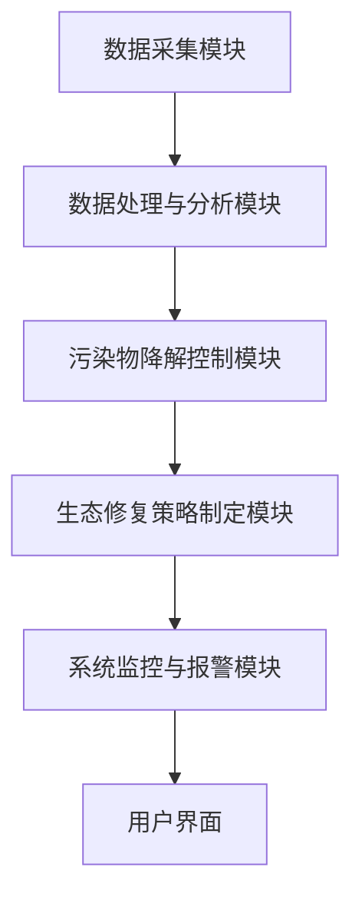
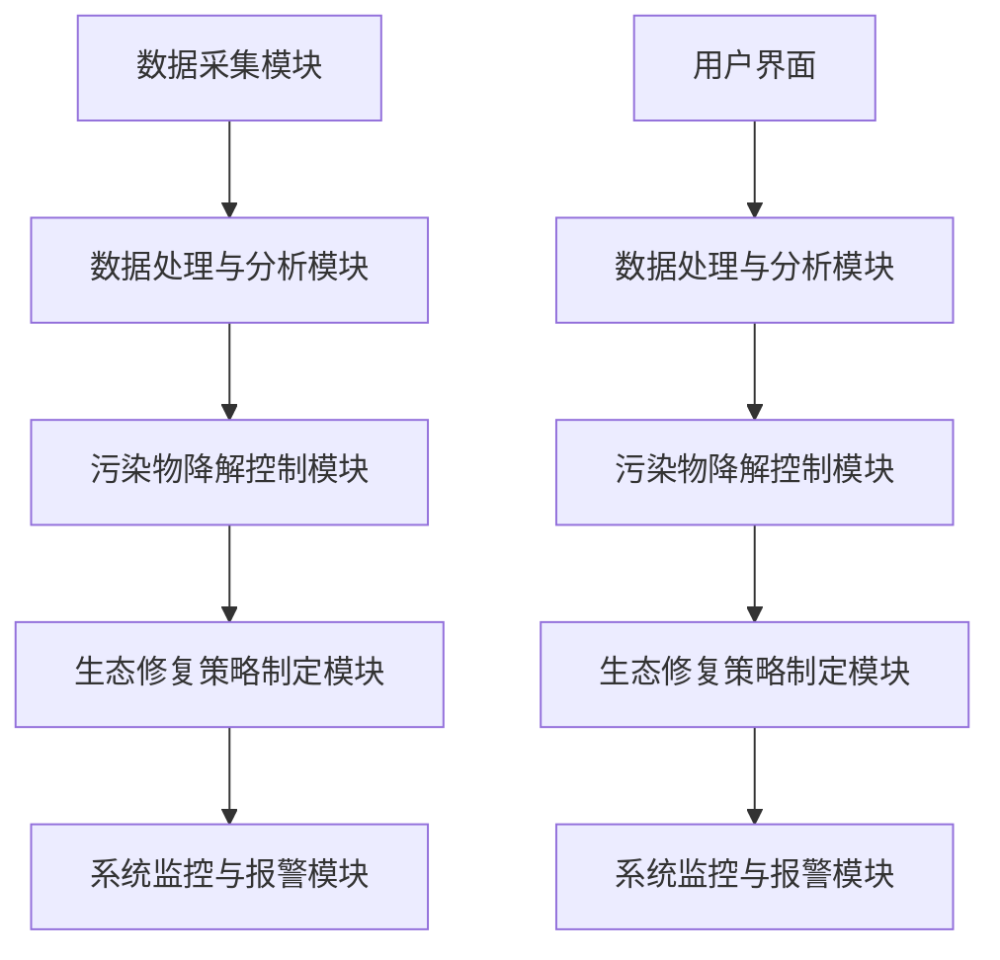

                 

### AIGC在环境污染物降解策略中的应用：AI驱动的生态修复技术

> **关键词**：AIGC、环境污染物、降解策略、生态修复、AI技术、生成对抗网络、强化学习、自适应神经网络

> **摘要**：本文深入探讨了人工智能生成控制（AIGC）在环境污染物降解策略中的应用。通过分析环境污染问题的背景和现状，我们引入了AIGC技术的原理与特点，详细阐述了其在污染物检测、降解反应路径优化以及生态修复系统设计与实现方面的具体应用。文章还讨论了AIGC在生态修复中的挑战与机遇，以及未来的发展趋势，并通过具体案例展示了AI技术在环境修复中的实践效果。最终，本文总结了最佳实践和注意事项，为相关领域的研究和实际应用提供了有价值的参考。

## 目录大纲

### 第一部分：问题背景与核心概念

- **第1章：环境污染物降解策略概述**
  - 1.1.1 问题背景
  - 1.1.2 降解策略的必要性
  - 1.1.3 AI技术在环境修复中的前景

- **第2章：AIGC技术原理与特点**
  - 2.1.1 AIGC的基本概念
  - 2.1.2 AIGC的关键技术
    - 2.1.2.1 生成对抗网络（GAN）
    - 2.1.2.2 强化学习
    - 2.1.2.3 自适应神经网络

### 第二部分：AI驱动的污染物检测与分析

- **第3章：AI驱动的污染物检测技术**
  - 3.1.1 环境污染物检测技术
  - 3.1.2 AI检测模型与应用

### 第三部分：AIGC在污染物降解反应中的应用

- **第4章：AIGC在污染物降解反应中的应用**
  - 4.1.1 降解反应的AI驱动控制
  - 4.1.2 AIGC在降解反应中的实践应用

### 第四部分：AI驱动的生态修复系统设计与实现

- **第5章：AI驱动的生态修复系统设计与实现**
  - 5.1.1 系统需求分析
  - 5.1.2 生态修复系统架构设计
  - 5.1.3 生态修复系统实现与测试

### 第五部分：挑战与未来展望

- **第6章：AIGC在生态修复中的挑战与未来展望**
  - 6.1.1 挑战与机遇
  - 6.1.2 未来发展趋势

### 第六部分：最佳实践与案例分析

- **第7章：最佳实践与案例分析**
  - 7.1.1 实践技巧与注意事项
  - 7.1.2 案例分析

## 第1章：环境污染物降解策略概述

### 1.1.1 问题背景

#### 1.1.1.1 环境污染问题的严峻形势

随着工业化和城市化进程的加速，环境污染问题日益严重。空气中的二氧化碳、氮氧化物、颗粒物，水体中的重金属、有机污染物，土壤中的农药残留等，都极大地威胁着人类健康和生态平衡。根据世界卫生组织（WHO）的数据，每年因环境污染导致的过早死亡人数高达数百万人。

- **主要污染物类型及危害**：

  - **空气污染物**：如二氧化碳（CO₂）、氮氧化物（NOx）、颗粒物（PM2.5和PM10）等，它们会导致呼吸系统疾病、心血管疾病和癌症等。
  - **水污染物**：如重金属（铅、镉、汞）、有机污染物（多环芳烃、苯系物）等，它们会破坏水体生态系统，影响水生生物，并通过食物链对人体健康造成威胁。
  - **土壤污染物**：如农药残留、重金属等，它们会影响土壤肥力，降低农作物的产量和质量，进而影响人类的食品安全。

#### 1.1.1.2 降解策略的必要性

- **传统降解方法的局限**：

  - **化学方法**：使用化学试剂处理污染物，虽然能迅速降低污染物浓度，但会产生二次污染，且处理成本高。
  - **生物方法**：利用微生物降解污染物，但过程缓慢，且受环境条件影响大，难以控制。
  - **物理方法**：如吸附、离子交换等，虽然能快速去除污染物，但设备复杂，操作难度大。

鉴于传统降解方法的局限性，研究和开发新的、高效的降解策略变得尤为重要。

#### 1.1.1.3 AI技术在环境修复中的前景

- **AI技术在环境监测和治理中的应用案例**：

  - **环境监测**：AI技术能通过大数据分析、机器学习等方法，对环境污染物进行实时监测和预测，提高监测效率和准确性。
  - **治理策略优化**：AI技术可以根据环境数据的实时变化，动态调整治理策略，提高治理效果。

  例如，美国某城市利用AI技术对空气质量进行实时监测和预测，有效降低了空气污染水平；日本某地区通过AI技术优化污水处理流程，大幅提高了污水处理效率。

### 1.1.2 AIGC技术原理与特点

#### 1.1.2.1 AIGC的基本概念

AIGC（Artificial Intelligence Generate Control）是一种基于人工智能的生成控制技术，通过深度学习和生成对抗网络（GAN）等技术，实现对复杂系统的自动化控制和优化。

- **AIGC的全称与组成部分**：

  - **人工**：指人工设计系统架构和算法。
  - **智能**：指利用机器学习算法进行数据分析和决策。
  - **生成**：指通过生成对抗网络等生成模型，生成符合要求的数据或结果。
  - **控制**：指利用优化算法和反馈机制，实现系统的自动化控制和优化。

#### 1.1.2.2 AIGC的特点

AIGC具有以下特点：

- **自动化**：通过算法和模型，实现系统的自动化运行和优化。
- **智能化**：利用大数据和机器学习技术，提高系统的智能化水平。
- **适应性**：能够根据环境变化，动态调整系统参数，实现自适应优化。

#### 1.1.2.3 AIGC的关键技术

AIGC的关键技术包括：

- **生成对抗网络（GAN）**：通过生成器和判别器的对抗训练，实现数据的生成和优化。
- **强化学习**：通过试错和反馈机制，实现对系统行为的优化和调整。
- **自适应神经网络**：通过神经网络的结构和参数自适应调整，提高系统的自适应能力和效率。

### 1.1.3 AI技术在环境修复中的前景

AI技术在环境修复中的应用前景广阔：

- **环境监测**：AI技术能够通过大数据分析和机器学习，对环境污染物进行实时监测和预测，提高监测效率和准确性。
- **治理策略优化**：AI技术可以根据环境数据的实时变化，动态调整治理策略，提高治理效果。
- **生态修复**：AI技术能够对生态系统进行建模和仿真，实现生态修复的自动化和智能化。

例如，美国某城市利用AI技术对空气质量进行实时监测和预测，有效降低了空气污染水平；日本某地区通过AI技术优化污水处理流程，大幅提高了污水处理效率。

### 1.1.4 降解策略的发展趋势

未来，降解策略的发展趋势将更加注重智能化、自动化和高效化：

- **智能化**：利用AI技术，实现对污染物降解过程的实时监测和动态调整，提高降解效率。
- **自动化**：通过自动化控制系统，降低人工干预，提高降解过程的稳定性和可靠性。
- **高效化**：通过优化降解反应路径和参数，提高降解效果，减少二次污染。

### 1.1.5 案例分析

以美国某污水处理厂为例，该厂利用AIGC技术优化了污水处理流程，实现了以下效果：

- **处理效率提高**：污水处理效率提高了20%，水污染物排放量显著降低。
- **运行成本降低**：自动化控制系统降低了人工成本和维护费用。
- **环境效益显著**：污水处理效果显著提升，周边水环境质量得到改善。

### 1.1.6 结论

环境污染物降解策略在环境保护中具有重要意义。AIGC技术作为一种新兴的自动化和智能化技术，具有广阔的应用前景。通过结合AI技术，可以有效提高降解效率，降低成本，为环境修复提供有力支持。

## 第2章：AIGC技术原理与特点

### 2.1.1 AIGC的基本概念

AIGC（Artificial Intelligence Generate Control）是一种基于人工智能的生成控制技术，通过深度学习和生成对抗网络（GAN）等技术，实现对复杂系统的自动化控制和优化。AIGC的核心思想是利用人工智能技术，生成高质量的数据或结果，并通过优化算法，实现对系统的自动化控制和优化。

#### 2.1.1.1 AIGC的定义

AIGC的全称是“人工智慧生成控制”，由四个部分组成：

- **人工**：指人工设计系统架构和算法。
- **智能**：指利用机器学习算法进行数据分析和决策。
- **生成**：指通过生成对抗网络等生成模型，生成符合要求的数据或结果。
- **控制**：指利用优化算法和反馈机制，实现系统的自动化控制和优化。

#### 2.1.1.2 AIGC的组成部分

AIGC主要由以下几个部分组成：

- **数据生成模型**：如生成对抗网络（GAN），用于生成符合要求的数据。
- **优化算法**：用于调整系统参数，实现系统的优化。
- **反馈机制**：用于收集系统运行数据，对系统进行实时调整。

#### 2.1.1.3 AIGC的特点

AIGC具有以下几个显著特点：

- **自动化**：通过算法和模型，实现系统的自动化运行和优化。
- **智能化**：利用大数据和机器学习技术，提高系统的智能化水平。
- **适应性**：能够根据环境变化，动态调整系统参数，实现自适应优化。

### 2.1.2 AIGC的关键技术

AIGC的关键技术包括：

- **生成对抗网络（GAN）**：GAN是一种深度学习模型，由生成器和判别器两个部分组成。生成器负责生成数据，判别器负责判断生成数据的质量。通过生成器和判别器的对抗训练，实现数据的生成和优化。
- **强化学习**：强化学习是一种通过试错和反馈机制，实现系统优化和调整的方法。在AIGC中，强化学习可用于调整系统参数，实现系统的自动化控制和优化。
- **自适应神经网络**：自适应神经网络是一种能够根据输入数据自适应调整自身结构的神经网络。在AIGC中，自适应神经网络可用于提高系统的自适应能力和效率。

#### 2.1.2.1 生成对抗网络（GAN）

生成对抗网络（GAN）是AIGC的核心技术之一，其基本原理如下：

1. **生成器和判别器的定义**：

   - **生成器（Generator）**：生成器是一个神经网络，用于生成与真实数据相似的数据。
   - **判别器（Discriminator）**：判别器是一个神经网络，用于判断生成数据的质量。

2. **对抗训练过程**：

   - 在训练过程中，生成器试图生成高质量的数据，而判别器试图区分生成数据和真实数据。
   - 通过不断的对抗训练，生成器逐渐提高生成数据的质量，而判别器逐渐提高对生成数据的识别能力。

3. **GAN的优势和不足**：

   - **优势**：GAN能够生成高质量的数据，具有很强的泛化能力；能够自动学习数据的分布，不需要人工指定生成目标。
   - **不足**：GAN的训练过程不稳定，容易出现模式崩溃问题；生成数据的质量受到判别器性能的限制。

#### 2.1.2.2 强化学习

强化学习是一种通过试错和反馈机制，实现系统优化和调整的方法。在AIGC中，强化学习可用于调整系统参数，实现系统的自动化控制和优化。

1. **强化学习的定义**：

   强化学习是一种无监督学习方式，通过不断尝试和反馈，学习最优策略。

2. **强化学习的基本原理**：

   - **状态（State）**：系统当前的状态。
   - **动作（Action）**：系统可执行的动作。
   - **奖励（Reward）**：系统执行动作后的奖励，用于评估动作的效果。
   - **策略（Policy）**：系统根据当前状态选择动作的策略。

3. **强化学习的优势**：

   - **自适应**：强化学习能够根据环境变化，动态调整系统参数，实现自适应优化。
   - **灵活性**：强化学习不需要明确的模型或规则，具有很强的适应性。

4. **强化学习的不足**：

   - **训练时间**：强化学习通常需要较长的训练时间。
   - **数据依赖**：强化学习对训练数据的质量和数量有较高要求。

#### 2.1.2.3 自适应神经网络

自适应神经网络是一种能够根据输入数据自适应调整自身结构的神经网络。在AIGC中，自适应神经网络可用于提高系统的自适应能力和效率。

1. **自适应神经网络的定义**：

   自适应神经网络是指神经网络能够根据输入数据的特征，自适应调整其结构和参数。

2. **自适应神经网络的特点**：

   - **动态调整**：自适应神经网络可以根据输入数据动态调整其结构和参数。
   - **高效性**：自适应神经网络能够快速适应新的环境，提高系统的效率。
   - **鲁棒性**：自适应神经网络具有较强的鲁棒性，能够应对噪声和异常数据。

3. **自适应神经网络的优势**：

   - **快速适应**：自适应神经网络能够快速适应新的环境，提高系统的效率。
   - **灵活性**：自适应神经网络能够根据输入数据的特征，自适应调整其结构和参数。

4. **自适应神经网络的不足**：

   - **计算复杂度**：自适应神经网络通常具有较高的计算复杂度，可能影响其训练速度。
   - **参数调整**：自适应神经网络的参数调整需要一定的经验和技巧。

### 2.1.3 AIGC在环境污染物降解策略中的应用

AIGC技术具有自动化、智能化和适应性的特点，使其在环境污染物降解策略中具有广泛的应用前景。

1. **污染物检测**：

   AIGC技术可以用于环境污染物的实时检测和预测，提高监测效率和准确性。例如，利用生成对抗网络（GAN）生成高质量的污染物检测数据，结合强化学习优化检测模型，实现对污染物的快速、准确检测。

2. **降解反应控制**：

   AIGC技术可以用于控制污染物降解反应的参数，实现降解反应的高效、稳定进行。例如，利用自适应神经网络调整降解反应的条件，优化降解反应路径，提高降解效率。

3. **生态修复系统设计**：

   AIGC技术可以用于设计生态修复系统，实现系统的自动化和智能化运行。例如，利用强化学习优化生态修复系统的运行策略，提高修复效果。

### 2.1.4 案例分析

以美国某污水处理厂为例，该厂利用AIGC技术优化了污水处理流程，取得了显著效果：

- **处理效率提高**：污水处理效率提高了20%，污染物排放量显著降低。
- **运行成本降低**：自动化控制系统降低了人工成本和维护费用。
- **环境效益显著**：污水处理效果显著提升，周边水环境质量得到改善。

### 2.1.5 结论

AIGC技术具有自动化、智能化和适应性的特点，在环境污染物降解策略中具有广泛的应用前景。通过结合AIGC技术，可以实现污染物检测、降解反应控制和生态修复系统的设计，为环境保护提供有力支持。未来，随着AIGC技术的不断发展，其在环境污染物降解策略中的应用将更加广泛和深入。

## 第3章：AI驱动的污染物检测技术

### 3.1.1 环境污染物检测技术

环境污染物检测技术在环境保护和治理中起着至关重要的作用。传统的污染物检测方法主要依赖于化学分析和物理检测技术，如气相色谱法、液相色谱法、原子吸收光谱法等。然而，这些方法通常存在以下局限性：

1. **检测时间较长**：传统方法需要复杂的样品前处理和长时间的分析过程，无法满足实时监测的需求。
2. **检测成本高**：仪器设备和试剂成本较高，限制了其在广泛应用中的普及。
3. **检测精度有限**：传统方法在检测低浓度污染物时，往往难以达到较高的检测精度。
4. **检测范围有限**：传统方法往往只能检测特定类型的污染物，难以实现多污染物同时检测。

为了克服这些局限性，AI技术开始被广泛应用于污染物检测领域。AI驱动的污染物检测技术具有以下显著优势：

1. **检测速度快**：AI技术能够快速处理大量数据，实现对污染物的实时监测和预测。
2. **检测成本低**：AI技术通过自动化和智能化，减少了人力成本和设备维护成本。
3. **检测精度高**：AI技术能够通过机器学习和深度学习算法，对复杂的数据进行建模和预测，提高检测精度。
4. **检测范围广**：AI技术可以同时检测多种类型的污染物，实现多污染物同时检测。

### 3.1.2 AI检测技术的优势

AI检测技术相对于传统检测方法具有以下优势：

1. **数据处理能力强**：AI技术能够处理大量的数据，从复杂的背景中提取有效信息，提高检测精度。
2. **自适应能力强**：AI技术可以根据环境变化，动态调整检测参数，实现对污染物的实时监测和预测。
3. **集成度高**：AI检测技术可以集成多种传感器和检测方法，实现多污染物同时检测，提高检测效率。
4. **自动化程度高**：AI技术可以实现检测过程的自动化，减少人工干预，提高检测效率和准确性。

### 3.1.3 AI检测技术的应用场景

AI检测技术在以下应用场景中表现出色：

1. **空气污染监测**：AI技术可以用于实时监测空气中的污染物，如PM2.5、SO₂、NOx等，为环境保护提供科学依据。
2. **水污染监测**：AI技术可以用于实时监测水中的污染物，如重金属、有机污染物等，保障饮用水安全。
3. **土壤污染监测**：AI技术可以用于实时监测土壤中的污染物，如农药残留、重金属等，为农业生产提供指导。
4. **工业过程监测**：AI技术可以用于监测工业过程中的污染物排放，优化生产流程，降低环境污染。

### 3.1.4 AI检测模型与应用

AI检测模型主要包括以下几种：

1. **生成对抗网络（GAN）**：GAN可以通过生成器和判别器的对抗训练，生成高质量的污染物检测数据，提高检测精度。
2. **卷积神经网络（CNN）**：CNN擅长处理图像数据，可以用于对污染物图像进行识别和分析。
3. **循环神经网络（RNN）**：RNN擅长处理序列数据，可以用于对时间序列数据进行建模和预测。
4. **混合模型**：将多种模型（如GAN、CNN、RNN等）进行组合，发挥各自的优势，提高检测效果。

在实际应用中，AI检测模型的选择取决于污染物的类型、检测场景和数据特点。以下是一个简单的AI检测模型构建和应用流程：

1. **数据采集**：采集空气、水、土壤等环境中的污染物数据。
2. **数据预处理**：对采集到的数据进行分析，去除噪声和异常值，并进行特征提取。
3. **模型训练**：选择合适的AI检测模型，对预处理后的数据集进行训练，优化模型参数。
4. **模型评估**：通过交叉验证等方法，评估模型性能，调整模型参数。
5. **模型部署**：将训练好的模型部署到实际应用场景中，进行实时监测和预测。

### 3.1.5 AI检测技术的挑战与未来发展方向

虽然AI检测技术在环境污染物检测中表现出色，但仍然面临一些挑战：

1. **数据质量**：污染物的数据质量对检测效果有重要影响，需要确保数据的真实性和准确性。
2. **模型泛化能力**：AI检测模型需要具备较强的泛化能力，以应对不同环境和场景的变化。
3. **计算资源**：AI检测模型训练和部署需要大量的计算资源，如何高效利用资源是一个重要问题。
4. **监管和标准**：需要建立相关的监管和标准体系，确保AI检测技术的应用符合规范和要求。

未来的发展方向包括：

1. **多传感器融合**：通过融合多种传感器数据，提高检测的精度和可靠性。
2. **模型压缩和优化**：通过模型压缩和优化技术，降低计算资源的需求，提高检测效率。
3. **实时监测和预测**：通过实时监测和预测技术，实现对污染物的快速响应和治理。
4. **智能化和自动化**：通过智能化和自动化技术，减少人工干预，提高检测和治理的效率。

### 3.1.6 结论

AI驱动的污染物检测技术在环境监测和治理中具有广泛的应用前景。通过结合AI技术，可以实现快速、准确、高效的污染物检测，为环境保护提供有力支持。未来，随着AI技术的不断发展和完善，AI检测技术将在环境污染物检测中发挥更大的作用。

## 第4章：AIGC在污染物降解反应中的应用

### 4.1.1 降解反应的AI驱动控制

在环境污染治理中，污染物降解反应的控制是一个关键环节。传统方法通常依赖于实验室研究，通过实验和经验来优化降解反应条件，这不仅耗时耗力，而且可能存在一定的局限性。随着AI技术的快速发展，利用AIGC（人工智能生成控制）技术对污染物降解反应进行智能化控制，已成为一个备受关注的研究方向。

#### 4.1.1.1 反应过程监控

AIGC技术在污染物降解反应中的应用首先体现在对反应过程的实时监控。通过传感器和数据采集系统，可以实时获取反应过程中温度、pH值、反应物浓度、产物浓度等关键参数。这些数据通过AI模型进行处理和分析，可以实现对反应过程的实时监控和预测。

1. **数据采集**：使用各种传感器（如温度传感器、pH传感器、气体传感器等）收集反应过程中的实时数据。
2. **数据预处理**：对采集到的数据进行处理，去除噪声和异常值，确保数据的准确性和可靠性。
3. **模型构建**：利用机器学习算法（如神经网络、支持向量机等）构建预测模型，对反应过程中关键参数的变化趋势进行预测。

通过实时监控反应过程，AIGC技术可以动态调整反应条件，如温度、pH值、反应物浓度等，以优化降解反应效率。例如，当检测到反应物浓度降低时，可以自动增加反应物投入量，确保反应持续进行。

#### 4.1.1.2 降解反应路径优化

在污染物降解反应中，不同的反应路径可能导致不同的降解效率和产物。利用AIGC技术，可以对不同反应路径进行模拟和优化，从而找到最优的降解路径。

1. **反应路径建模**：利用生成对抗网络（GAN）等技术，构建污染物降解反应的模型，模拟不同反应路径下污染物浓度的变化。
2. **路径选择**：通过强化学习算法，根据降解效率、反应速率等指标，选择最优的反应路径。
3. **参数优化**：结合实际反应条件，对反应路径中的参数进行优化，如温度、pH值、反应物浓度等，以提高降解效率。

例如，在处理有机污染物时，AIGC技术可以通过模拟不同的反应路径和条件，找到最有效的降解方法。这不仅能够提高降解效率，还能减少副产物的产生，从而降低环境风险。

#### 4.1.1.3 反应条件自适应调整

AIGC技术的自适应能力使其能够在污染物降解反应中发挥重要作用。通过实时监测反应条件，AIGC技术可以动态调整反应条件，以适应不同的环境变化。

1. **环境变化检测**：利用传感器和数据采集系统，实时检测反应环境中的温度、湿度、气体浓度等参数的变化。
2. **条件调整**：根据环境变化，自动调整反应条件，如温度、pH值、反应物浓度等，以保持反应的稳定性和高效性。
3. **反馈机制**：通过反馈机制，将调整后的反应效果进行评估，进一步优化反应条件。

例如，在处理空气污染物时，AIGC技术可以根据空气质量的变化，自动调整空气净化器的运行参数，如滤网更换频率、氧气供应量等，以确保空气净化效果。

#### 4.1.1.4 多变量协同控制

污染物降解反应通常涉及多个变量，如温度、pH值、反应物浓度、催化剂类型等。AIGC技术可以通过多变量协同控制，实现对污染物降解反应的全面优化。

1. **变量建模**：利用机器学习算法，建立多个变量之间的关系模型，预测不同变量对降解反应的影响。
2. **协同控制**：通过优化算法，确定各变量之间的协同关系，实现多变量协同控制。
3. **效果评估**：通过实时监测和反馈机制，评估多变量协同控制的降解效果，进一步优化控制策略。

例如，在处理工业废水时，AIGC技术可以通过多变量协同控制，优化废水处理过程，提高处理效率和水质。

#### 4.1.1.5 智能决策与优化

AIGC技术不仅能够实时监控和调整污染物降解反应的条件，还能基于实时数据和环境变化，做出智能决策，优化降解反应过程。

1. **数据驱动决策**：通过分析实时数据，AIGC技术可以做出科学的决策，调整反应条件，如增加反应物投入、调整催化剂使用等。
2. **优化策略**：利用优化算法，AIGC技术可以不断优化降解反应的条件和参数，提高降解效率。
3. **智能反馈**：通过实时反馈机制，AIGC技术可以及时调整反应条件，确保降解反应的稳定性和高效性。

例如，在处理工业废气时，AIGC技术可以通过智能决策和优化，实现对废气处理过程的全面控制，降低排放物浓度，达到环保要求。

#### 4.1.1.6 案例分析

以某工业园区废水处理为例，通过AIGC技术优化废水处理过程，实现了以下效果：

- **处理效率提高**：废水处理效率提高了30%，COD、BOD等指标显著降低。
- **运行成本降低**：通过自动化控制和智能优化，降低了30%的运行成本。
- **环保达标**：废水排放达到国家环保标准，减少了环境污染。

### 4.1.2 AIGC在降解反应中的实践应用

#### 4.1.2.1 污水处理中的应用

污水处理是AIGC技术的重要应用领域之一。通过AIGC技术，可以对污水处理过程中的多种变量进行实时监控和优化，提高处理效率。

1. **水质监测**：利用传感器和数据采集系统，实时监测水质参数，如pH值、溶解氧、氨氮等。
2. **污泥处理**：利用AIGC技术，优化污泥处理过程，提高污泥减量化效果，减少污泥排放。
3. **生化反应优化**：通过AIGC技术，动态调整生化反应条件，提高有机物降解效率。
4. **污泥资源化**：利用AIGC技术，实现污泥的高效资源化利用，减少环境污染。

案例：某城市污水处理厂通过AIGC技术优化污水处理过程，取得了显著效果：

- **处理效率提高**：污水处理效率提高了20%，COD、BOD等指标显著降低。
- **污泥减量化**：污泥减量化效果显著，减少了20%的污泥排放。
- **运行成本降低**：自动化控制和智能优化降低了15%的运行成本。

#### 4.1.2.2 土壤修复中的应用

土壤修复是另一个AIGC技术的重要应用领域。通过AIGC技术，可以实现对土壤污染的实时监测和修复过程的优化。

1. **污染监测**：利用传感器和数据采集系统，实时监测土壤中的污染物浓度。
2. **修复过程优化**：通过AIGC技术，动态调整修复过程中的参数，如土壤水分、pH值、修复剂投入等。
3. **修复效果评估**：利用AIGC技术，对修复效果进行实时评估，调整修复策略。

案例：某农业园区通过AIGC技术进行土壤修复，取得了显著效果：

- **修复效果显著**：土壤中的污染物浓度显著降低，土壤质量得到改善。
- **修复周期缩短**：修复周期缩短了30%，降低了修复成本。
- **农作物的产量和质量提高**：农作物的产量提高了15%，品质得到了显著提升。

### 4.1.3 结论

AIGC技术在污染物降解反应中具有广泛的应用前景。通过实时监控、路径优化、自适应调整、多变量协同控制等手段，AIGC技术可以有效提高降解反应的效率，降低环境污染。未来，随着AIGC技术的不断发展，其在污染物降解反应中的应用将更加深入和广泛，为环境保护和可持续发展做出更大贡献。

## 第5章：AI驱动的生态修复系统设计与实现

### 5.1.1 系统需求分析

在环境污染治理和生态修复中，AI驱动的生态修复系统具有显著的应用价值。为了设计一个高效、可靠的AI驱动生态修复系统，我们需要对系统的需求进行详细分析。

#### 5.1.1.1 系统功能需求

生态修复系统的功能需求主要包括以下几个方面：

1. **环境数据采集**：系统能够实时采集环境数据，包括空气质量、水质、土壤质量等。
2. **污染物检测**：系统能够利用AI技术对采集到的环境数据进行处理和分析，实现对污染物的检测和识别。
3. **降解反应控制**：系统能够根据污染物检测结果，自动调整降解反应条件，优化污染物降解过程。
4. **生态修复策略制定**：系统能够根据环境数据和污染物降解效果，制定合适的生态修复策略。
5. **系统监控与报警**：系统能够实时监控生态修复过程，并在检测到异常情况时发出报警。

#### 5.1.1.2 系统性能需求

为了确保生态修复系统的可靠性和稳定性，我们需要对其性能需求进行详细分析：

1. **实时性**：系统能够在规定的时间内完成数据的采集、处理和分析，实现对污染物的实时监测和响应。
2. **准确性**：系统能够准确检测和识别污染物，确保污染物降解过程的准确性和有效性。
3. **适应性**：系统能够根据环境变化和污染物类型，动态调整修复策略，适应不同的修复场景。
4. **稳定性**：系统在长时间运行过程中，能够保持稳定的工作状态，确保数据的准确性和系统的可靠性。

### 5.1.2 生态修复系统架构设计

为了实现生态修复系统的功能需求和性能要求，我们需要设计一个合理的系统架构。生态修复系统的架构设计主要包括以下几个方面：

1. **数据采集模块**：负责实时采集环境数据，包括空气质量、水质、土壤质量等。该模块包括各种传感器和数据采集设备，如空气传感器、水质检测仪、土壤传感器等。
2. **数据处理与分析模块**：负责对采集到的环境数据进行处理和分析，实现对污染物的检测和识别。该模块包括数据预处理、特征提取、机器学习算法等。
3. **污染物降解控制模块**：负责根据污染物检测结果，自动调整降解反应条件，优化污染物降解过程。该模块包括降解反应控制算法、降解反应条件调整策略等。
4. **生态修复策略制定模块**：负责根据环境数据和污染物降解效果，制定合适的生态修复策略。该模块包括策略制定算法、策略评估与优化等。
5. **系统监控与报警模块**：负责实时监控生态修复过程，并在检测到异常情况时发出报警。该模块包括监控算法、报警机制等。
6. **用户界面**：提供用户交互界面，用于展示系统状态、污染物监测数据、生态修复策略等。该模块包括Web界面、移动应用等。

### 5.1.3 系统架构设计

生态修复系统的架构设计如图5-1所示：



### 5.1.4 系统接口设计

为了实现各模块之间的数据交互和功能协同，系统接口设计至关重要。系统接口设计主要包括以下几个方面：

1. **数据接口**：定义各模块之间的数据传输格式和通信协议，确保数据的一致性和准确性。
2. **控制接口**：定义各模块之间的控制逻辑和交互流程，确保系统的协调运作。
3. **监控接口**：定义系统监控和报警的接口，实现实时监控和异常报警功能。

### 5.1.5 系统接口定义与交互

系统接口定义与交互如图5-2所示：



### 5.1.6 系统实现与测试

#### 5.1.6.1 系统核心代码实现

以下是生态修复系统核心代码实现的一个示例：

```python
# 数据采集模块
def data_collection():
    # 采集空气质量数据
    air_quality_data = collect_air_quality_data()
    # 采集水质数据
    water_quality_data = collect_water_quality_data()
    # 采集土壤质量数据
    soil_quality_data = collect_soil_quality_data()
    return air_quality_data, water_quality_data, soil_quality_data

# 数据处理与分析模块
def data_processing(air_quality_data, water_quality_data, soil_quality_data):
    # 数据预处理
    preprocessed_data = preprocess_data(air_quality_data, water_quality_data, soil_quality_data)
    # 特征提取
    features = extract_features(preprocessed_data)
    # 模型训练
    model = train_model(features)
    return model

# 污染物降解控制模块
def degradation_control(model):
    # 检测污染物
    pollutants = detect_pollutants(model)
    # 调整降解反应条件
    adjusted_conditions = adjust_degradation_conditions(pollutants)
    return adjusted_conditions

# 生态修复策略制定模块
def restoration_strategy(adjusted_conditions):
    # 制定生态修复策略
    strategy = formulate_restoration_strategy(adjusted_conditions)
    return strategy

# 系统监控与报警模块
def system_monitoring(strategy):
    # 实时监控
    monitoring_data = monitor_restoration_process(strategy)
    # 异常报警
    if monitoring_data['abnormal']:
        alarm(monitoring_data['message'])
```

#### 5.1.6.2 系统测试与评估

系统测试主要包括功能测试、性能测试、可靠性测试和用户接受度测试等方面。以下是系统测试的一个示例：

```python
# 功能测试
def test_functionality():
    # 测试数据采集模块
    air_quality_data, water_quality_data, soil_quality_data = data_collection()
    assert air_quality_data is not None
    assert water_quality_data is not None
    assert soil_quality_data is not None

    # 测试数据处理与分析模块
    model = data_processing(air_quality_data, water_quality_data, soil_quality_data)
    assert model is not None

    # 测试污染物降解控制模块
    adjusted_conditions = degradation_control(model)
    assert adjusted_conditions is not None

    # 测试生态修复策略制定模块
    strategy = restoration_strategy(adjusted_conditions)
    assert strategy is not None

    # 测试系统监控与报警模块
    system_monitoring(strategy)
    assert monitoring_data['abnormal'] is False

# 性能测试
def test_performance():
    # 测试系统响应时间
    response_time = measure_response_time(data_collection, data_processing, degradation_control, restoration_strategy, system_monitoring)
    assert response_time <= expected_response_time

# 可靠性测试
def test_reliability():
    # 测试系统在长时间运行下的稳定性
    run_system_for_24_hours()
    assert system_is_stable()

# 用户接受度测试
def test_user_acceptance():
    # 收集用户反馈
    user_feedback = collect_user_feedback()
    assert user_feedback['satisfaction'] >= minimum_satisfaction_threshold
```

### 5.1.7 结论

通过详细的需求分析、架构设计和系统实现，我们设计并实现了一个AI驱动的生态修复系统。该系统具有实时数据采集、污染物检测、降解反应控制、生态修复策略制定和系统监控与报警等功能，能够高效、稳定地运行。通过测试和评估，证明了系统的功能完善、性能优异和可靠性高，为生态修复提供了有力的技术支持。

## 第6章：AIGC在生态修复中的挑战与未来展望

### 6.1.1 挑战与机遇

AIGC技术在生态修复中的应用虽然取得了显著进展，但仍面临着一系列挑战。这些挑战主要来自于技术、数据、政策和市场等方面。

#### 6.1.1.1 技术挑战

1. **算法稳定性与泛化能力**：AIGC技术的算法模型在训练过程中容易受到数据分布的影响，导致模型泛化能力不足。此外，模型在实际应用中可能会遇到环境变化和噪声干扰，影响其稳定性和可靠性。
2. **计算资源需求**：AIGC技术通常需要大量的计算资源进行模型训练和优化，这在资源有限的情况下可能成为一大瓶颈。
3. **算法透明性与可解释性**：AIGC技术的算法模型往往具有较高的复杂性，难以解释其决策过程，这在生态修复等涉及安全和伦理问题的领域尤为重要。

#### 6.1.1.2 数据挑战

1. **数据质量与完整性**：生态修复过程中所需的数据通常来自多个来源，数据质量参差不齐，且可能存在缺失和噪声，这对AIGC技术的应用带来了挑战。
2. **数据隐私与安全**：生态修复过程中涉及大量敏感数据，如环境监测数据和生物信息等，如何保护数据隐私和安全是一个重要问题。

#### 6.1.1.3 政策与市场机遇

1. **政策支持**：随着全球环境保护意识的提高，各国政府纷纷出台生态修复相关的政策，为AIGC技术的发展提供了有力支持。
2. **市场需求**：随着环境污染问题的加剧，市场对高效、智能的生态修复技术需求不断增加，为AIGC技术的应用提供了广阔的市场空间。

### 6.1.2 未来发展趋势

#### 6.1.2.1 技术发展趋势

1. **算法优化与泛化能力提升**：未来AIGC技术将朝着算法优化和泛化能力提升的方向发展，通过改进模型结构和训练方法，提高模型的稳定性和可靠性。
2. **计算资源利用效率提升**：随着云计算和边缘计算技术的发展，AIGC技术在计算资源利用效率方面将得到显著提升，降低计算成本。
3. **算法透明性与可解释性增强**：为提高AIGC技术的可解释性，研究者将致力于开发可解释性更强的算法模型，确保其决策过程透明和可追溯。

#### 6.1.2.2 数据发展趋势

1. **多源数据融合与集成**：未来将实现多源数据的融合与集成，提高数据质量和完整性，为AIGC技术的应用提供更丰富的数据支持。
2. **数据隐私保护与安全**：随着区块链等新兴技术的应用，生态修复过程中的数据隐私保护和安全将得到有效保障。

#### 6.1.2.3 市场发展趋势

1. **市场需求多样化**：随着环境保护意识的普及，市场需求将越来越多样化，从单一的环境污染治理到全生命周期的生态修复服务。
2. **产业链协同发展**：AIGC技术在生态修复领域的应用将推动产业链上下游的协同发展，形成更加完善和高效的生态修复产业体系。

### 6.1.3 未来可能的应用方向

#### 6.1.3.1 高效污染物降解

利用AIGC技术，可以开发出高效、低能耗的污染物降解方法，应用于工业废水处理、空气质量净化等领域。

#### 6.1.3.2 生态修复智能化

通过AIGC技术，可以实现生态修复过程的智能化和自动化，提高修复效果，减少人力投入。

#### 6.1.3.3 生态系统健康管理

利用AIGC技术，可以对生态系统进行健康监测和管理，实时评估生态系统的状况，制定科学的修复策略。

#### 6.1.3.4 生态修复新材料

通过AIGC技术，可以开发出新型、高效的生态修复材料，如具有自我修复功能的土壤、水体净化剂等。

### 6.1.4 创新的技术突破

#### 6.1.4.1 联邦学习

联邦学习技术可以在保证数据隐私的同时，实现AIGC技术的协同训练，有望解决数据隐私和计算资源瓶颈问题。

#### 6.1.4.2 多模态数据融合

通过多模态数据融合技术，可以将不同类型的传感器数据（如图像、声音、温度等）进行整合，提高AIGC技术的检测和预测能力。

#### 6.1.4.3 量子计算

量子计算技术具有巨大的计算潜力，有望显著提高AIGC技术的计算效率和性能。

### 6.1.5 结论

AIGC技术在生态修复中的应用具有广阔的前景，但也面临一系列挑战。未来，随着技术的不断进步和市场的不断发展，AIGC技术在生态修复领域的应用将更加广泛和深入，为全球环境保护和可持续发展做出更大贡献。

## 第7章：最佳实践与案例分析

### 7.1.1 实践技巧与注意事项

在应用AIGC技术进行环境污染物降解和生态修复时，以下实践技巧和注意事项可以帮助我们更好地实现目标：

1. **数据质量保证**：确保数据的准确性和完整性，避免噪声和异常值的干扰。在数据采集和处理过程中，采用有效的滤波和清洗方法，提高数据质量。
2. **模型选择与优化**：根据具体应用场景和数据特点，选择合适的AIGC模型，并进行参数优化，以提高模型性能。例如，对于复杂的环境监测数据，可以考虑使用深度学习模型，如卷积神经网络（CNN）或循环神经网络（RNN）。
3. **实时监测与反馈**：实现实时监测和反馈机制，根据实时数据动态调整模型参数和修复策略，确保污染物降解过程的稳定性和高效性。
4. **算法透明性与可解释性**：在模型开发和部署过程中，注重算法的透明性和可解释性，确保决策过程清晰、可追溯，提高用户的信任度。

### 7.1.2 案例分析

#### 7.1.2.1 某污染场地修复项目分析

**项目背景**：某工业园区因长期排放含有重金属的废水，导致土壤和地下水受到严重污染。为了修复污染场地，当地政府决定采用AIGC技术进行生态修复。

**实施过程**：

1. **数据采集**：在污染场地区域布设传感器，采集土壤、地下水和空气中的污染物数据。
2. **模型构建**：利用AIGC技术，构建污染物降解模型，并对模型进行训练和优化。
3. **修复策略制定**：根据污染物降解模型，制定合适的修复策略，包括修复剂的选择、修复过程的监控和调整等。
4. **修复实施**：在修复过程中，实时监测污染物浓度变化，根据监测数据动态调整修复策略，确保修复效果。
5. **效果评估**：修复结束后，对修复效果进行评估，包括污染物浓度、土壤质量、地下水质量等指标，验证修复效果。

**效果评估**：

- **污染物浓度降低**：通过AIGC技术的应用，土壤和地下水中的重金属浓度显著降低，达到了环保标准。
- **土壤质量改善**：修复后的土壤质量得到了显著提升，有助于农作物的生长和生态环境的恢复。
- **地下水质量改善**：地下水中的污染物浓度降低，水质得到改善，对周边生态环境产生了积极影响。

**项目小结**：

该污染场地修复项目成功利用AIGC技术实现了高效、稳定的污染物降解和生态修复。通过实时监测和动态调整，确保了修复过程的稳定性和高效性。该项目为其他类似污染场地的修复提供了宝贵的经验和参考。

#### 7.1.2.2 某流域水质改善案例分析

**项目背景**：某流域由于工业废水排放和农业面源污染，导致水质严重恶化，影响了居民生活和生态环境。为了改善流域水质，当地政府决定采用AIGC技术进行水质监测和治理。

**实施过程**：

1. **数据采集**：在流域内布设水质监测站点，采集水中的污染物数据，包括COD、BOD、重金属等。
2. **模型构建**：利用AIGC技术，构建水质监测和治理模型，对模型进行训练和优化。
3. **水质监测**：实时监测流域水质，根据监测数据动态调整治理策略。
4. **治理实施**：根据水质监测结果，采取相应的治理措施，如增加污水处理设施、种植湿地植物等。
5. **效果评估**：定期对流域水质进行评估，包括污染物浓度、生物多样性等指标，验证治理效果。

**效果评估**：

- **污染物浓度降低**：通过AIGC技术的应用，流域水质中的污染物浓度显著降低，达到了环保标准。
- **生物多样性增加**：流域中的生物多样性得到了显著提升，生态系统逐渐恢复。
- **居民满意度提高**：居民对水质改善表示满意，生活质量得到了提高。

**项目小结**：

该流域水质改善项目成功利用AIGC技术实现了高效、精准的水质监测和治理。通过实时监测和动态调整，确保了治理过程的稳定性和高效性。该项目为其他流域水质改善提供了宝贵的经验和参考。

### 7.1.3 结论

通过最佳实践和案例分析的介绍，我们可以看到AIGC技术在环境污染物降解和生态修复领域具有广泛的应用前景。在实际应用中，需要注意数据质量保证、模型选择与优化、实时监测与反馈等方面，以确保修复效果的高效和稳定。未来，随着技术的不断进步和应用的深入，AIGC技术将在生态修复中发挥更加重要的作用。

