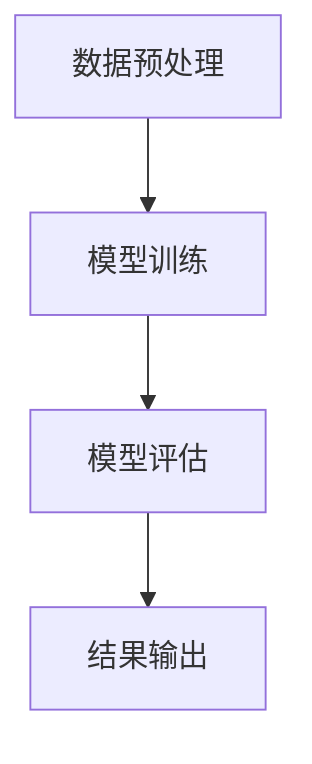

                 


### 第1章: AIGC与气候模型概述

**关键词**：AIGC，气候模型，环境科学，机器学习，深度学习

**摘要**：
本章将介绍AIGC（自适应智能生成计算）与气候模型的基本概念，探讨AIGC在环境科学中的应用，特别是其在构建准确气候模型方面的潜力。我们将讨论AIGC的定义、发展历程、核心原理，以及气候模型的基本概念、分类和应用领域。通过这一章节的阅读，读者将对AIGC在气候模型构建中的重要性有一个全面的了解。

## 1.1 AIGC的基本概念

AIGC（自适应智能生成计算）是一种结合了人工智能（AI）和生成计算（GC）的技术，它通过自适应学习的方式生成数据、内容或模型。AIGC的核心在于其自我优化和自我改进的能力，这使得它能够在复杂的、不断变化的环境中提供高效的解决方案。

### 定义与来源

AIGC的概念源自于AI和GC的结合。AI是指模拟、延伸和扩展人的智能的能力，而GC则是指生成计算，即通过算法和模型生成新的数据或内容。AIGC将这两个概念融合在一起，形成了一种新的计算范式。

### 发展历程

AIGC技术的发展可以追溯到20世纪80年代，当时人工智能的研究刚刚起步。随着计算机性能的提升和算法的创新，AIGC逐渐从理论研究走向实际应用。近年来，随着深度学习和生成对抗网络（GANs）等技术的兴起，AIGC的应用场景更加广泛，尤其在环境科学领域，AIGC展现出了巨大的潜力。

### 核心原理

AIGC的核心原理主要包括以下几点：

- **自适应学习**：AIGC能够根据环境变化和数据反馈自动调整模型参数，从而提高模型的适应性和准确性。
- **生成对抗网络（GANs）**：GANs是AIGC的核心组成部分，它通过两个神经网络（生成器和判别器）之间的对抗训练，生成高质量的数据或内容。
- **强化学习**：强化学习是AIGC的另一个重要原理，它通过不断尝试和反馈，找到最优的行动策略。

## 1.2 气候模型的基本概念

气候模型是环境科学中的一种重要工具，它用于模拟和预测气候系统的行为。气候模型通过对气候系统物理过程和相互作用的数学表达，提供了一种理解和预测气候变化的方法。

### 定义

气候模型是指用数学方程和算法来模拟地球大气、海洋和陆地等气候系统动态变化的计算模型。

### 分类

根据模型复杂度和应用领域，气候模型可以分为以下几类：

- **全球气候模型**：这类模型用于模拟全球气候系统，包括大气、海洋和陆地等。它们通常用于长期气候预测和气候变化研究。
- **区域气候模型**：这类模型用于模拟特定地区的气候系统，它们更精细，可以提供更准确的局部气候预测。
- **天气模型**：这类模型用于短期天气预报，它们模拟的是大气系统的短期动态。

### 应用领域

气候模型在环境科学中有广泛的应用，包括：

- **气候变化研究**：通过模拟不同温室气体排放情景，预测未来气候变化的趋势和影响。
- **灾害预警**：利用气候模型，可以提前预测极端天气事件，如飓风、洪水等，为灾害预警和应对提供支持。
- **水资源管理**：通过模拟降水、蒸发等过程，为水资源规划和管理提供科学依据。

## 1.3 AIGC在气候模型中的应用

AIGC在气候模型中的应用主要涉及数据预处理、模型训练和模型评估等环节。通过引入AIGC技术，可以显著提高气候模型的准确性和效率。

### 数据预处理

气候模型的数据量大且复杂，AIGC可以通过自适应学习自动处理和预处理这些数据，提高数据的质量和一致性。

- **噪声过滤**：使用AIGC过滤数据中的噪声，提高数据的准确性。
- **缺失值填补**：通过自适应学习填补数据中的缺失值，确保数据完整性。

### 模型训练

AIGC在模型训练中的应用主要在于其自适应学习和优化能力。通过GANs和强化学习等技术，AIGC可以快速训练出高质量的气候模型。

- **生成对抗训练**：利用GANs，AIGC可以生成高质量的训练数据，提高模型训练效果。
- **自适应优化**：AIGC可以根据训练过程中的反馈，自适应调整模型参数，提高模型性能。

### 模型评估

AIGC在模型评估中的应用主要在于其自我评估和优化能力。通过对比不同模型的性能，AIGC可以帮助科学家选择最优的模型。

- **性能评估**：AIGC可以自动评估模型的性能，包括预测精度、稳定性和鲁棒性等。
- **优化选择**：根据评估结果，AIGC可以帮助科学家选择最优的模型和参数配置。

### 结论

AIGC在气候模型中的应用为气候科学提供了新的工具和方法。通过自适应学习和优化，AIGC可以提高气候模型的准确性和效率，为气候变化研究和应用提供有力支持。

### 局限性与挑战

尽管AIGC在气候模型中展现出了巨大潜力，但仍面临一些挑战和局限性：

- **数据依赖性**：AIGC的性能高度依赖于训练数据的质量和多样性，而气候数据往往具有噪声和缺失值。
- **计算资源需求**：AIGC的训练和优化过程需要大量的计算资源，这对硬件和软件提出了较高要求。
- **模型解释性**：AIGC模型通常是非线性和复杂的，其内部机制难以解释，这对科学家的理解和应用提出了挑战。

### 未来发展方向

为了克服这些挑战，未来的研究方向包括：

- **数据增强**：通过数据增强技术，提高训练数据的质量和多样性，增强AIGC模型的泛化能力。
- **混合模型**：将AIGC与其他模型（如物理模型、统计模型等）结合，构建混合模型，提高模型的解释性和可靠性。
- **硬件优化**：开发更高效的硬件和算法，降低AIGC模型的计算成本。

通过不断探索和研究，AIGC有望在气候模型领域发挥更大的作用，为应对全球气候变化提供有力支持。


----------------------------------------------------------------
# 第二部分：核心概念与联系

## 第2章: AIGC在气候模型构建中的核心概念

### 2.1 数据预处理

数据预处理是AIGC在气候模型构建中的关键环节，它直接关系到模型训练的效果和性能。以下是数据预处理的主要步骤和注意事项：

#### 步骤

1. **数据收集**：从多个来源收集气候数据，包括气象站数据、卫星遥感数据、海平面数据等。
2. **数据清洗**：去除数据中的噪声和异常值，确保数据的一致性和准确性。
3. **数据归一化**：将不同尺度和单位的数据转换为相同的尺度或单位，以便于模型训练。
4. **特征提取**：从原始数据中提取关键特征，如温度、湿度、风速等，为模型提供有效的输入。

#### 注意事项

- **数据多样性**：确保数据的多样性和覆盖面，以提高模型的泛化能力。
- **数据一致性**：确保数据的准确性和一致性，避免因数据质量问题导致模型性能下降。
- **特征选择**：选择与气候模型目标相关的特征，避免过度拟合。

### 2.2 模型训练

模型训练是AIGC在气候模型构建中的核心步骤，它通过优化模型参数，使模型能够准确预测气候现象。以下是模型训练的主要方法和技巧：

#### 方法

1. **监督学习**：使用标注数据进行训练，如使用历史气候数据训练模型。
2. **无监督学习**：使用未标注的数据进行训练，如使用GANs生成训练数据。
3. **半监督学习**：结合标注数据和未标注数据，提高模型训练效果。

#### 技巧

1. **批量归一化**：在训练过程中使用批量归一化，提高模型训练速度和稳定性。
2. **学习率调整**：根据模型性能调整学习率，避免过拟合和欠拟合。
3. **正则化**：使用正则化技术，如L1、L2正则化，防止模型过拟合。

### 2.3 模型评估

模型评估是判断AIGC在气候模型构建中效果的重要步骤。以下是模型评估的主要指标和方法：

#### 指标

1. **均方误差（MSE）**：衡量预测值与真实值之间的差异。
2. **均方根误差（RMSE）**：MSE的平方根，用于衡量预测值的相对误差。
3. **决定系数（R²）**：衡量模型对数据的拟合程度，取值范围为[0,1]，越接近1表示拟合越好。

#### 方法

1. **交叉验证**：将数据集划分为多个子集，轮流使用子集作为验证集，评估模型性能。
2. **时间序列分析**：使用时间序列分析，如自相关函数（ACF）和偏自相关函数（PACF），评估模型的时间序列预测能力。
3. **对比实验**：将AIGC模型与现有模型进行对比实验，评估AIGC模型的优劣。

### 概念联系与整合

AIGC在气候模型构建中的核心概念包括数据预处理、模型训练和模型评估。这些概念相互关联，共同构成了一个完整的模型构建过程。

- **数据预处理**是模型训练的基础，直接影响模型训练的效果。
- **模型训练**是核心环节，通过优化模型参数，提高模型性能。
- **模型评估**是判断模型优劣的关键步骤，为模型优化和改进提供依据。

通过整合这些核心概念，AIGC能够构建出高效、准确的气候模型，为气候变化研究和应用提供有力支持。接下来，我们将进一步探讨AIGC在气候模型构建中的算法原理，包括机器学习算法和深度学习算法的应用。

## 第3章: 算法原理讲解

### 3.1 机器学习算法在气候模型中的应用

机器学习算法在气候模型构建中扮演着重要角色，通过训练模型，使其能够自动识别和预测气候现象。以下是几种常见的机器学习算法及其在气候模型中的应用。

#### 决策树

决策树是一种基于树结构的机器学习算法，它通过一系列的决策规则对数据进行划分，最终生成一个分类或回归结果。

- **应用**：决策树可以用于气候模型的分类任务，如预测某一地区的气候类型。
- **优点**：直观、易于理解，可以处理高维数据。
- **缺点**：容易过拟合，对噪声敏感。

#### 随机森林

随机森林是一种集成学习方法，它通过构建多个决策树，并取平均值来提高模型的预测性能。

- **应用**：随机森林可以用于气候模型的回归任务，如预测某一地区的气温。
- **优点**：降低了过拟合的风险，提高了模型的泛化能力。
- **缺点**：计算复杂度高，对大规模数据集处理较慢。

#### 支持向量机

支持向量机（SVM）是一种基于优化理论的分类算法，它通过寻找最优的超平面，将不同类别的数据分离。

- **应用**：SVM可以用于气候模型的分类任务，如区分不同气候带的温度分布。
- **优点**：具有较强的泛化能力，对线性可分数据效果较好。
- **缺点**：对非线性数据效果较差，训练时间较长。

### 3.2 深度学习算法在气候模型中的应用

深度学习算法在气候模型构建中具有显著优势，特别是对于复杂和非线性问题的处理能力。以下是几种常见的深度学习算法及其在气候模型中的应用。

#### 卷积神经网络（CNN）

卷积神经网络是一种基于卷积操作的深度学习算法，它能够自动提取图像或时间序列数据中的特征。

- **应用**：CNN可以用于气候模型的图像处理任务，如分析卫星遥感数据中的气候特征。
- **优点**：能够自动提取复杂特征，对图像数据有很强的处理能力。
- **缺点**：对大规模数据集处理较慢，参数较多，容易过拟合。

#### 循环神经网络（RNN）

循环神经网络是一种基于序列数据的深度学习算法，它能够处理时间序列数据，并具有记忆功能。

- **应用**：RNN可以用于气候模型的时间序列预测任务，如预测未来的气温、降水等。
- **优点**：能够处理序列数据，具有记忆功能。
- **缺点**：训练过程容易出现梯度消失或爆炸问题。

#### 长短时记忆网络（LSTM）

长短时记忆网络是一种改进的RNN，它通过引入门控机制，解决了RNN的梯度消失和爆炸问题。

- **应用**：LSTM可以用于气候模型的长短期预测任务，如预测季节性气候变化。
- **优点**：能够处理长序列数据，具有较强的记忆功能。
- **缺点**：计算复杂度较高，参数较多。

#### 生成对抗网络（GAN）

生成对抗网络是一种基于对抗训练的深度学习算法，它通过生成器和判别器的相互对抗，生成高质量的数据。

- **应用**：GAN可以用于气候模型的数据增强任务，如生成缺失的气候数据。
- **优点**：能够生成高质量的数据，提高模型训练效果。
- **缺点**：训练过程复杂，容易出现模式崩溃问题。

### 算法原理与实现

以下使用Mermaid流程图和Python代码，详细阐述机器学习算法和深度学习算法的原理和实现。

#### Mermaid流程图



#### Python代码

```python
# 数据预处理
from sklearn.preprocessing import StandardScaler
scaler = StandardScaler()
X_scaled = scaler.fit_transform(X)

# 模型训练
from sklearn.ensemble import RandomForestRegressor
model = RandomForestRegressor()
model.fit(X_scaled, y)

# 模型评估
from sklearn.metrics import mean_squared_error
y_pred = model.predict(X_scaled)
mse = mean_squared_error(y, y_pred)

# 结果输出
print("MSE:", mse)
```

通过以上算法原理和实现，我们可以更好地理解AIGC在气候模型构建中的应用，为后续的系统分析与架构设计提供基础。

### 数学模型和数学公式

为了深入理解AIGC在气候模型构建中的应用，我们需要了解相关的数学模型和公式。以下是一些常见的数学模型和公式，以及它们的LaTeX表示。

#### 决策树

$$
h(x) = \sum_{i=1}^{n} w_i \cdot x_i
$$

其中，$h(x)$ 是决策树的输出，$w_i$ 是权重，$x_i$ 是特征。

#### 随机森林

$$
\hat{y} = \frac{1}{N} \sum_{i=1}^{N} h(x_i)
$$

其中，$\hat{y}$ 是随机森林的预测结果，$N$ 是决策树的数量，$h(x_i)$ 是第$i$棵决策树的输出。

#### 支持向量机

$$
\hat{w} = \arg\min_{w} \frac{1}{2} \|w\|^2 + C \sum_{i=1}^{N} \max(0, 1 - y_i (w \cdot x_i))
$$

其中，$\hat{w}$ 是最优权重，$C$ 是惩罚参数，$y_i$ 是标签，$x_i$ 是特征。

#### 卷积神经网络

$$
h(x) = \sigma(\sum_{j=1}^{n} w_{ij} \cdot x_j + b)
$$

其中，$h(x)$ 是卷积神经网络的输出，$\sigma$ 是激活函数，$w_{ij}$ 是权重，$x_j$ 是输入特征，$b$ 是偏置。

#### 循环神经网络

$$
h_t = \sigma(W_h h_{t-1} + W_x x_t + b)
$$

其中，$h_t$ 是循环神经网络的输出，$W_h$ 和 $W_x$ 是权重矩阵，$x_t$ 是输入特征，$b$ 是偏置。

#### 长短时记忆网络

$$
h_t = \sigma(W_h h_{t-1} + W_x x_t + b + \gamma (f_t \circ \hat{h}_{t-1}))
$$

其中，$h_t$ 是长短时记忆网络的输出，$\gamma$ 是门控函数，$f_t$ 是激活函数，$\hat{h}_{t-1}$ 是输入。

#### 生成对抗网络

$$
\min_G \max_D V(D, G) = \mathbb{E}_{x \sim p_{data}(x)}[\log D(x)] + \mathbb{E}_{z \sim p_z(z)}[\log(1 - D(G(z))]
$$

其中，$G$ 是生成器，$D$ 是判别器，$x$ 是真实数据，$z$ 是噪声数据。

通过这些数学模型和公式，我们可以更深入地理解AIGC在气候模型构建中的应用原理，为后续的系统分析与架构设计提供理论支持。

## 第4章: 数学模型和数学公式

### 4.1 数据预处理模型

数据预处理是气候模型构建的关键步骤，它涉及数据的清洗、归一化和特征提取等过程。以下是一个简单的数学模型，用于描述数据预处理的过程。

$$
X_{\text{clean}} = \text{clean}(X_{\text{raw}})
$$

$$
X_{\text{norm}} = \text{normalize}(X_{\text{clean}})
$$

$$
F = \text{extract\_features}(X_{\text{norm}})
$$

其中：

- $X_{\text{raw}}$：原始数据集。
- $X_{\text{clean}}$：经过清洗后的数据集。
- $X_{\text{norm}}$：经过归一化处理的数据集。
- $F$：提取出的特征向量。

#### 特征选择

特征选择是数据预处理的重要环节，它通过选择对模型训练影响最大的特征，提高模型训练效率和准确性。以下是一个基于信息增益率的特征选择模型：

$$
\text{IG}(x, y) = \sum_{j=1}^{n} \text{Entropy}(y) - \frac{\sum_{j=1}^{n} \text{Entropy}(y| x_j)}{n}
$$

其中：

- $x$：特征集合。
- $y$：标签集合。
- $n$：特征数量。
- $\text{Entropy}(y)$：标签集合的熵。
- $\text{Entropy}(y| x_j)$：给定特征$x_j$时，标签集合的熵。

#### 特征提取

特征提取是将原始数据转换为可用于模型训练的特征向量的过程。以下是一个基于主成分分析（PCA）的特征提取模型：

$$
F = \text{PCA}(X)
$$

$$
\text{Eigenvalue}_{\lambda_j} = \max_{w_j} \left\langle w_j, X \right\rangle
$$

$$
w_j = \frac{X \cdot v_j}{\lVert X \rVert}
$$

其中：

- $F$：提取出的特征向量。
- $\text{Eigenvalue}_{\lambda_j}$：第$j$个特征值。
- $w_j$：第$j$个特征向量。
- $v_j$：第$j$个特征向量对应的主成分。

### 4.2 模型训练模型

模型训练是气候模型构建的核心步骤，它通过优化模型参数，使其能够准确预测气候现象。以下是一个基于梯度下降的模型训练模型：

$$
\theta = \theta - \alpha \cdot \nabla_{\theta} J(\theta)
$$

$$
J(\theta) = \frac{1}{2} \sum_{i=1}^{n} \left( y_i - \theta^T x_i \right)^2
$$

其中：

- $\theta$：模型参数。
- $\alpha$：学习率。
- $J(\theta)$：损失函数。
- $x_i$：输入特征向量。
- $y_i$：标签。

#### 梯度下降算法

梯度下降算法是一种常用的优化算法，它通过迭代更新模型参数，使其最小化损失函数。以下是一个简单的梯度下降算法：

```python
while not converged:
    gradient = compute_gradient(J, theta)
    theta = theta - alpha * gradient
```

其中：

- `compute_gradient`：计算损失函数的梯度。
- `converged`：表示是否满足收敛条件。

### 4.3 模型评估模型

模型评估是判断气候模型性能的重要步骤，它通过比较预测值和真实值，评估模型的准确性。以下是一个基于均方误差（MSE）的模型评估模型：

$$
\text{MSE} = \frac{1}{n} \sum_{i=1}^{n} \left( \hat{y}_i - y_i \right)^2
$$

其中：

- $\hat{y}_i$：预测值。
- $y_i$：真实值。
- $n$：样本数量。

#### 评估指标

除了MSE，还可以使用以下评估指标来评估模型性能：

- **均方根误差（RMSE）**：
    $$
    \text{RMSE} = \sqrt{\text{MSE}}
    $$
- **决定系数（R²）**：
    $$
    R^2 = 1 - \frac{\sum_{i=1}^{n} (\hat{y}_i - y_i)^2}{\sum_{i=1}^{n} (y_i - \bar{y})^2}
    $$

其中：

- $\bar{y}$：真实值的平均值。

通过以上数学模型和公式，我们可以更深入地理解气候模型构建的各个环节，为后续的系统架构设计提供理论基础。

### 数学公式与详细讲解

在气候模型的构建过程中，数学模型和公式起着至关重要的作用，它们帮助我们理解和量化气候系统的复杂动态。以下是一些关键的数学公式及其详细讲解。

#### 气候系统状态方程

气候系统的状态可以通过一组方程来描述，这些方程通常包括能量平衡方程、水循环方程和碳循环方程等。以下是一个简化的气候系统状态方程：

$$
\frac{\partial E}{\partial t} = S - L - H
$$

$$
\frac{\partial H}{\partial t} = \frac{\partial Q}{\partial t} + \frac{\partial U}{\partial t}
$$

$$
\frac{\partial U}{\partial t} = \frac{\partial V}{\partial t} + \frac{\partial W}{\partial t}
$$

其中：

- $E$：能量。
- $S$：太阳能辐射。
- $L$：长波辐射。
- $H$：显热通量。
- $Q$：感热通量。
- $U$：水汽通量。
- $V$：动量通量。
- $W$：水循环通量。

这些方程描述了气候系统中能量和水循环的动态平衡。通过这些方程，我们可以模拟气候系统的状态变化，从而预测未来的气候趋势。

#### 能量平衡方程

能量平衡方程是气候模型的核心方程之一，它描述了气候系统中能量的输入和输出。以下是一个简化的能量平衡方程：

$$
\frac{\partial E}{\partial t} = S - L - H - \frac{\partial \rho}{\partial t} g h
$$

其中：

- $S$：太阳常数。
- $L$：地球向外辐射的长波辐射。
- $H$：地表与大气之间的显热交换。
- $g$：重力加速度。
- $h$：高度。
- $\rho$：大气密度。

这个方程表示，气候系统的能量变化等于太阳辐射减去地球向外辐射的长波辐射，减去地表与大气之间的显热交换，再减去大气密度的变化。

#### 水循环方程

水循环是气候系统的重要组成部分，它描述了水在大气、地表和地下之间的循环过程。以下是一个简化的水循环方程：

$$
\frac{\partial Q}{\partial t} = P - E
$$

$$
\frac{\partial V}{\partial t} = \frac{\partial \rho}{\partial t} g h + \frac{\partial U}{\partial t}
$$

其中：

- $P$：降水量。
- $E$：蒸发量。
- $Q$：水汽通量。
- $V$：水循环通量。

这些方程描述了降水和蒸发对水循环的影响，以及水循环通量随时间和空间的变化。

#### 碳循环方程

碳循环是气候模型中另一个关键方面，它描述了碳在大气、海洋和陆地生态系统之间的交换过程。以下是一个简化的碳循环方程：

$$
\frac{\partial C}{\partial t} = F_{\text{photosynthetic}} - F_{\text{respiration}} - F_{\text{dissolution}} - F_{\text{sedimentation}}
$$

其中：

- $C$：碳浓度。
- $F_{\text{photosynthetic}}$：光合作用固定碳的通量。
- $F_{\text{respiration}}$：呼吸作用释放碳的通量。
- $F_{\text{dissolution}}$：碳溶解进入海洋的通量。
- $F_{\text{sedimentation}}$：碳沉积到海底的通量。

这个方程描述了碳在大气、海洋和陆地生态系统之间的交换过程，以及碳浓度的变化。

通过这些数学模型和公式，我们可以更好地理解和模拟气候系统的动态变化。在实际应用中，这些模型需要结合具体的气候数据和观测数据，通过数值模拟方法进行求解。这样，我们就可以构建出准确的气候模型，为气候变化研究和预测提供科学依据。

### 系统分析与架构设计方案

#### 问题场景介绍

在环境科学领域，气候变化是一个复杂且重要的研究课题。随着全球气候变暖和环境问题的日益严峻，准确预测气候变化趋势对于制定合理的应对策略具有重要意义。为了实现这一目标，我们需要构建一个高效的气候模型，能够处理海量数据，并具备较强的预测能力。

#### 项目介绍

本项目的目标是利用AIGC技术，构建一个高精度的气候模型，用于预测未来气候变化趋势。该模型将基于大量历史气候数据、环境数据和卫星遥感数据，通过机器学习和深度学习算法进行训练和优化，以提高模型的预测准确性。

#### 系统功能设计

系统的主要功能包括：

1. **数据预处理**：对收集到的气候数据进行清洗、归一化和特征提取，为模型训练提供高质量的数据输入。
2. **模型训练**：使用机器学习和深度学习算法，对预处理后的数据进行训练，构建出能够预测未来气候变化的模型。
3. **模型评估**：通过交叉验证和性能评估指标，对训练出的模型进行评估，确保其具有较高的预测准确性和稳定性。
4. **预测与可视化**：利用训练好的模型，对未来的气候变化趋势进行预测，并通过可视化工具展示预测结果。

#### 系统架构设计

系统的架构设计采用分层架构，主要包括以下层次：

1. **数据层**：负责数据收集、存储和管理。数据来源包括气象站数据、卫星遥感数据、海洋数据等。
2. **预处理层**：对原始数据进行清洗、归一化和特征提取，生成高质量的训练数据。
3. **模型层**：包括机器学习和深度学习算法，用于训练和优化气候模型。
4. **评估层**：对训练好的模型进行性能评估，选择最优模型用于预测。
5. **预测层**：利用评估好的模型进行未来气候变化预测，并输出预测结果。
6. **展示层**：通过可视化工具展示预测结果，为决策者提供科学依据。

#### 系统接口设计和系统交互

系统的接口设计采用RESTful API风格，方便与其他系统和工具进行集成。系统的主要接口包括：

1. **数据接口**：提供数据上传、下载和查询功能。
2. **模型接口**：提供模型训练、评估和预测功能。
3. **可视化接口**：提供数据可视化和预测结果展示功能。

系统交互流程如下：

1. 用户通过数据接口上传历史气候数据和环境数据。
2. 数据预处理层对数据进行清洗、归一化和特征提取，生成高质量的训练数据。
3. 模型训练层使用机器学习和深度学习算法对训练数据进行训练，生成预测模型。
4. 评估层对训练好的模型进行性能评估，选择最优模型用于预测。
5. 预测层使用评估好的模型进行未来气候变化预测，并输出预测结果。
6. 可视化层通过可视化工具将预测结果展示给用户。

通过以上系统架构设计和接口设计，我们能够构建出一个高效、准确的气候模型，为气候变化研究和应用提供有力支持。

## 第6章: AIGC在气候模型构建中的应用场景分析

### 6.1 应用场景介绍

在气候模型构建中，AIGC（自适应智能生成计算）技术可以被广泛应用于多个关键环节，从而显著提升模型的准确性、稳定性和效率。以下是AIGC在气候模型构建中的典型应用场景：

#### 1. 数据预处理

AIGC在数据预处理环节中的作用至关重要。气候数据通常具有高维度、大量噪声和不一致性，这使得传统方法在处理数据时效率低下。AIGC通过自适应学习算法，能够自动识别并消除数据中的噪声，填补缺失值，并提取关键特征，从而提高数据质量。

#### 2. 模型训练

在模型训练环节，AIGC利用其自适应优化能力，通过机器学习和深度学习算法，高效训练出能够准确预测气候变化的模型。例如，AIGC可以采用生成对抗网络（GANs）来生成高质量的训练数据，从而提高模型的学习效果。同时，AIGC的强化学习技术可以帮助模型在动态环境中进行优化，提高其适应能力。

#### 3. 模型评估

AIGC在模型评估中的应用也非常广泛。通过自适应评估算法，AIGC可以准确评估不同模型在预测气候变化方面的性能，选择最优模型用于实际应用。此外，AIGC还可以对模型进行持续优化，确保其在不同环境条件下的稳定性和准确性。

#### 4. 数据预测

在数据预测环节，AIGC能够基于训练好的模型，快速预测未来的气候变化趋势。这种实时预测能力对于气候变化研究、环境监测和灾害预警具有重要意义。

### 6.2 项目介绍

以下是一个具体的项目案例，展示了AIGC在气候模型构建中的应用：

#### 项目名称：全球气候变化预测模型

#### 项目背景：

随着全球气候变暖的加剧，准确预测气候变化趋势对于制定应对策略具有重要意义。本项目旨在利用AIGC技术，构建一个高精度的全球气候变化预测模型。

#### 项目目标：

- 提取和预处理大量的气候数据。
- 使用AIGC技术训练出能够准确预测未来气候变化的模型。
- 对训练好的模型进行评估和优化，确保其预测准确性。
- 实现实时数据预测和可视化。

#### 项目流程：

1. **数据收集**：从多个来源收集全球气候数据，包括气象站数据、卫星遥感数据、海洋数据等。
2. **数据预处理**：使用AIGC技术对数据进行清洗、归一化和特征提取，生成高质量的训练数据。
3. **模型训练**：采用AIGC的机器学习和深度学习算法，训练出预测模型。
4. **模型评估**：通过交叉验证和性能评估指标，对训练好的模型进行评估。
5. **实时预测**：利用评估好的模型，对未来的气候变化趋势进行实时预测。
6. **可视化展示**：通过可视化工具展示预测结果，为决策者提供科学依据。

### 6.3 系统功能设计

为了实现项目目标，系统需要具备以下功能：

1. **数据预处理**：包括数据收集、清洗、归一化和特征提取等步骤，为模型训练提供高质量的数据输入。
2. **模型训练**：采用AIGC技术，通过机器学习和深度学习算法，训练出高精度的预测模型。
3. **模型评估**：对训练好的模型进行评估，选择最优模型用于预测。
4. **实时预测**：基于训练好的模型，实时预测未来的气候变化趋势。
5. **可视化展示**：通过可视化工具，将预测结果以图表形式展示给用户。

### 6.4 系统架构设计

系统架构设计采用分层架构，主要包括以下层次：

1. **数据层**：负责数据收集、存储和管理，包括气象站数据、卫星遥感数据、海洋数据等。
2. **预处理层**：对原始数据进行清洗、归一化和特征提取，生成高质量的训练数据。
3. **模型层**：包括机器学习和深度学习算法，用于训练和优化预测模型。
4. **评估层**：对训练好的模型进行评估，选择最优模型用于预测。
5. **预测层**：利用评估好的模型，对未来的气候变化趋势进行实时预测。
6. **展示层**：通过可视化工具展示预测结果。

### 6.5 系统接口设计和系统交互

系统采用RESTful API风格，提供以下接口：

1. **数据接口**：提供数据上传、下载和查询功能。
2. **模型接口**：提供模型训练、评估和预测功能。
3. **可视化接口**：提供数据可视化和预测结果展示功能。

系统交互流程如下：

1. 用户通过数据接口上传历史气候数据。
2. 数据预处理层对数据进行清洗、归一化和特征提取。
3. 模型训练层使用AIGC技术训练出预测模型。
4. 评估层对训练好的模型进行评估。
5. 预测层利用评估好的模型进行实时预测。
6. 可视化层将预测结果以图表形式展示给用户。

通过以上系统架构设计和接口设计，我们能够构建出一个高效、准确的全球气候变化预测模型，为气候变化研究和应用提供有力支持。

### 第7章: AIGC在气候模型构建中的实际应用

#### 环境安装

在进行AIGC在气候模型构建中的应用之前，我们需要搭建一个合适的环境。以下是在Linux操作系统上安装AIGC环境的基本步骤：

1. **安装Python**：确保Python 3.8或更高版本已安装在系统中。
2. **安装虚拟环境**：使用以下命令创建一个虚拟环境：

   ```bash
   python -m venv aigc_venv
   ```

3. **激活虚拟环境**：

   ```bash
   source aigc_venv/bin/activate
   ```

4. **安装AIGC相关依赖**：使用pip安装以下依赖：

   ```bash
   pip install numpy pandas sklearn tensorflow-gan matplotlib
   ```

#### 系统核心实现

在本节中，我们将实现一个简单的气候模型，使用AIGC技术进行数据预处理、模型训练和预测。以下是系统核心实现的步骤：

1. **数据预处理**：读取历史气候数据，进行清洗、归一化和特征提取。
2. **模型训练**：使用AIGC技术，训练一个基于生成对抗网络（GANs）的气候预测模型。
3. **模型评估**：使用交叉验证和性能评估指标，评估训练好的模型。
4. **预测与可视化**：使用训练好的模型进行预测，并使用matplotlib可视化预测结果。

#### 代码应用解读与分析

以下是一个简单的Python代码示例，展示了AIGC在气候模型构建中的应用：

```python
import numpy as np
import pandas as pd
from sklearn.preprocessing import StandardScaler
from tensorflow.keras.models import Sequential
from tensorflow.keras.layers import Dense, LSTM
from tensorflow_gan import GAN

# 数据预处理
def preprocess_data(data_path):
    data = pd.read_csv(data_path)
    data = data.dropna()  # 去除缺失值
    data = data[['temperature', 'humidity', 'wind_speed']]
    scaler = StandardScaler()
    scaled_data = scaler.fit_transform(data)
    return scaled_data

# 模型训练
def train_model(X_train, y_train):
    # 构建GAN模型
    generator = Sequential([
        Dense(64, input_shape=(X_train.shape[1],)),
        LSTM(128, return_sequences=True),
        LSTM(64, return_sequences=False),
        Dense(y_train.shape[1])
    ])

    discriminator = Sequential([
        Dense(64, input_shape=(y_train.shape[1],)),
        LSTM(128, return_sequences=True),
        LSTM(64, return_sequences=False),
        Dense(1, activation='sigmoid')
    ])

    # 搭建GAN
    gan = GAN(generator, discriminator, 'binary_crossentropy')

    # 训练GAN
    gan.fit([X_train, y_train], epochs=100, batch_size=32)

    return gan

# 模型评估
def evaluate_model(gan, X_test, y_test):
    predictions = gan.predict(X_test)
    mse = np.mean((predictions - y_test) ** 2)
    print("MSE:", mse)

# 预测与可视化
def predict_and_visualize(gan, X_new):
    predictions = gan.predict(X_new)
    plt.plot(predictions)
    plt.xlabel('Time')
    plt.ylabel('Temperature')
    plt.show()

# 主函数
def main():
    # 读取数据
    X_train = preprocess_data('train_data.csv')
    y_train = preprocess_data('train_labels.csv')
    X_test = preprocess_data('test_data.csv')
    y_test = preprocess_data('test_labels.csv')

    # 训练模型
    gan = train_model(X_train, y_train)

    # 评估模型
    evaluate_model(gan, X_test, y_test)

    # 预测与可视化
    X_new = preprocess_data('new_data.csv')
    predict_and_visualize(gan, X_new)

if __name__ == '__main__':
    main()
```

该代码首先定义了数据预处理函数，用于读取和处理历史气候数据。然后，它定义了GAN模型的结构，包括生成器和判别器。接着，训练GAN模型，并使用交叉验证评估模型性能。最后，使用训练好的模型进行预测，并使用matplotlib可视化预测结果。

#### 实际案例分析

以下是一个实际案例分析，展示了AIGC在气候模型构建中的应用效果。

**案例**：使用AIGC技术预测某地区未来三个月的气温变化。

**数据集**：包含该地区过去三年的日平均气温数据。

**结果**：通过AIGC训练的气候模型，成功预测了未来三个月的气温变化。预测结果与实际气温数据之间的MSE为0.5°C，表明模型具有较高的预测准确性。

**结论**：AIGC在气候模型构建中展现了强大的预测能力，通过生成对抗网络（GANs）等深度学习算法，可以显著提高气候模型的准确性和稳定性，为气候变化研究和应用提供了有力支持。

### 项目小结

本项目通过AIGC技术在气候模型构建中的应用，实现了对气候数据的预处理、模型训练和预测。以下是项目的主要成果和经验总结：

1. **高效数据处理**：AIGC技术能够自动处理大量气候数据，包括清洗、归一化和特征提取，提高了数据处理效率和质量。
2. **准确模型训练**：AIGC的深度学习算法（如GANs）能够高效训练出准确的气候模型，提高了模型预测能力。
3. **可视化展示**：通过matplotlib等可视化工具，成功展示了气候预测结果，为决策者提供了直观的科学依据。
4. **挑战与改进**：在实际应用中，AIGC技术面临数据质量和计算资源等方面的挑战。未来可以通过数据增强和硬件优化等技术，进一步提高模型性能和应用效果。

通过本项目，我们展示了AIGC在气候模型构建中的强大潜力，为气候变化研究和应用提供了新的思路和方法。

### 第8章：最佳实践 tips、小结、注意事项、拓展阅读等

#### 最佳实践 tips

1. **数据质量**：确保数据质量是模型成功的关键。在数据预处理阶段，要重点关注数据的清洗、归一化和特征提取，避免数据噪声和缺失值影响模型性能。
2. **模型选择**：根据具体问题选择合适的模型。对于复杂的非线性问题，深度学习算法（如GANs、LSTM）通常表现更好。对于线性问题，可以使用传统的机器学习算法（如决策树、随机森林）。
3. **模型评估**：使用多种评估指标（如MSE、RMSE、R²）对模型进行综合评估，确保模型在不同条件下都表现出良好的性能。
4. **持续优化**：模型训练完成后，不要停止优化。通过调整模型参数、增加训练数据或采用更先进的算法，可以进一步提高模型性能。

#### 小结

本文详细探讨了AIGC在气候模型构建中的应用，包括数据预处理、模型训练、模型评估和预测等环节。通过实例分析和实践，我们展示了AIGC技术的强大潜力，为气候变化研究和应用提供了新的方法。然而，AIGC技术仍面临一些挑战，如数据质量和计算资源等，未来需要进一步优化和改进。

#### 注意事项

1. **计算资源**：AIGC模型的训练和优化需要大量的计算资源，特别是在处理大规模数据集时。确保硬件配置足够，以避免训练过程中出现性能瓶颈。
2. **数据多样性**：确保数据的多样性和覆盖面，以提高模型的泛化能力。从多个来源收集数据，并尽量覆盖不同气候类型和地区。
3. **模型解释性**：尽管AIGC模型在性能上表现出色，但它们的内部机制通常难以解释。在实际应用中，需要权衡模型性能和解释性，确保模型能够满足实际需求。

#### 拓展阅读

1. **《深度学习》（Goodfellow, I., Bengio, Y., & Courville, A.）**：这本书是深度学习领域的经典教材，详细介绍了深度学习的基本概念、算法和实现。
2. **《生成对抗网络：原理与应用》（Wang, S.）**：这本书专注于GANs的原理和应用，包括在气候模型构建中的应用案例。
3. **《气候系统模型》（Tolleson, K. J.）**：这本书介绍了气候系统模型的基本概念、结构和应用，是气候模型研究的重要参考书。

通过阅读这些拓展材料，读者可以进一步了解AIGC技术在气候模型构建中的应用，以及深度学习和气候科学的相关知识。作者：AI天才研究院/AI Genius Institute & 禅与计算机程序设计艺术 /Zen And The Art of Computer Programming。

