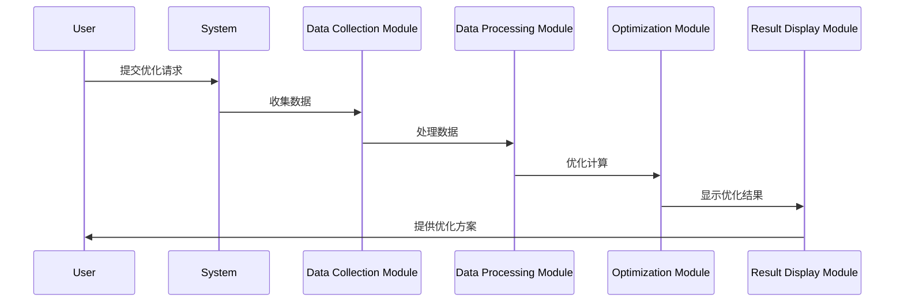
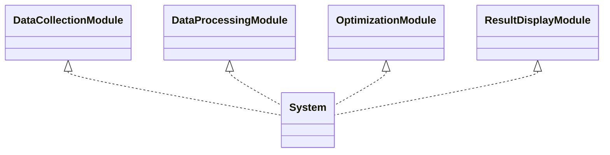

                 

# AIGC在生物燃料产业链优化中的应用：全生命周期分析提示词

## 关键词：AIGC、生物燃料、产业链优化、全生命周期、生成模型、认知模型、智能推理模型

## 摘要：
本文旨在探讨如何利用AIGC（高级智能生成与认知）技术在生物燃料产业链的各个环节实现全生命周期优化。通过对问题背景的介绍、核心概念的阐述以及算法原理的讲解，本文将详细分析AIGC技术在原料采集、生物转化、燃料生产和燃料利用等方面的应用，为生物燃料产业链的智能化改造提供理论指导和实践参考。

## 第一部分：背景介绍

### 1.1.1 问题背景
随着全球能源需求的不断增长，生物燃料作为一种可持续的替代能源受到了广泛关注。生物燃料不仅能够减少对化石燃料的依赖，降低温室气体排放，还能促进农业产业链的优化和发展。然而，生物燃料产业链的优化面临着诸多挑战，包括生产成本高、能源效率低、环境影响大等问题。

### 1.1.2 问题描述
本书旨在探讨如何利用AIGC技术，在生物燃料产业链的各个环节进行全生命周期的优化。具体来说，包括原料采集、生物转化、燃料生产、燃料利用等环节的智能化改造。

### 1.1.3 问题解决
通过AIGC技术的应用，可以实现以下目标：
- 提高原料采集的效率，降低成本；
- 优化生物转化过程，提高燃料产量；
- 提升燃料利用效率，减少浪费；
- 降低生产过程中的环境影响，提高可持续性。

### 1.1.4 边界与外延
本书的研究范围主要涉及AIGC技术在生物燃料产业链优化中的应用。具体包括：
- AIGC技术的基础原理和核心算法；
- 生物燃料产业链的各个环节及关键问题；
- AIGC技术在生物燃料产业链中的具体应用场景和案例分析。

### 1.1.5 概念结构与核心要素组成
- **AIGC技术**：包括生成模型、认知模型、智能推理模型等；
- **生物燃料产业链**：包括原料采集、生物转化、燃料生产、燃料利用等环节；
- **全生命周期优化**：贯穿生物燃料产业链的各个环节，实现生产、加工、利用的智能化和优化。

## 第二部分：核心概念与联系

### 2.1 AIGC技术概述

#### 2.1.1 AIGC技术的定义
AIGC技术是指利用人工智能，特别是深度学习技术，对大规模数据进行自动生成、理解和认知的能力。它涵盖了生成模型、认知模型、智能推理模型等多个方面。

#### 2.1.2 AIGC技术的基本原理
- **生成模型**：通过学习大量数据，生成符合数据分布的新样本；
- **认知模型**：对输入数据进行理解、分析和识别；
- **智能推理模型**：基于认知结果，进行逻辑推理和决策。

#### 2.1.3 AIGC技术的核心算法
- **生成对抗网络（GAN）**：通过两个对抗网络生成器和判别器的相互博弈，生成逼真数据；
- **变分自编码器（VAE）**：通过编码和解码过程，实现数据的生成和重构；
- **递归神经网络（RNN）**：通过记忆机制，对序列数据进行建模和处理。

### 2.2 生物燃料产业链概述

#### 2.2.1 生物燃料产业链的定义
生物燃料产业链是指从生物原料的采集、加工、转化到燃料生产的全过程。

#### 2.2.2 生物燃料产业链的核心环节
- **原料采集**：包括农作物、林业废弃物等生物原料的采集；
- **生物转化**：通过发酵、酶解等生物过程，将生物原料转化为燃料；
- **燃料生产**：通过化学、物理等方法，将生物转化产物进一步加工为燃料；
- **燃料利用**：包括燃料的储存、运输和使用。

### 2.3 全生命周期优化

#### 2.3.1 全生命周期优化的定义
全生命周期优化是指对生物燃料产业链的各个环节进行系统性、综合性的优化，以实现整体效益的最大化。

#### 2.3.2 全生命周期优化的目标
- **提高生产效率**：通过自动化、智能化手段，提高生产线的运行效率；
- **降低生产成本**：优化原料采集、生物转化、燃料生产等环节，降低生产成本；
- **减少环境影响**：降低生产过程中的能耗和废弃物排放，提高可持续发展能力。

## 第三部分：算法原理讲解

### 3.1 AIGC技术在生物燃料产业链优化中的应用

#### 3.1.1 生成模型在原料采集优化中的应用
- **数据生成与重构**：通过生成模型，模拟生物原料的分布特征，为原料采集提供决策支持；
- **资源分配优化**：基于生成模型，优化原料采集设备的调度，提高采集效率。

#### 3.1.2 认知模型在生物转化优化中的应用
- **过程监测与控制**：通过认知模型，对生物转化过程进行实时监测和控制，提高转化效率；
- **故障诊断与预测**：利用认知模型，对生物转化设备进行故障诊断和预测，减少停机时间。

#### 3.1.3 智能推理模型在燃料生产优化中的应用
- **生产调度优化**：基于智能推理模型，优化燃料生产过程中的设备调度和工序安排；
- **能耗管理优化**：利用智能推理模型，对燃料生产过程中的能耗进行精细化控制，降低能源消耗。

### 3.2 数学模型和公式

#### 3.2.1 原料采集优化模型
设\( x \)为原料采集量，\( y \)为采集成本，\( z \)为采集效率，则原料采集优化模型为：
\[ 
\begin{aligned} 
\min\limits_{x, y, z} & \quad C(x, y, z) \\
\text{s.t.} & \quad G(x, y, z) \leq G_{\text{max}} \\
& \quad H(x, y, z) \geq H_{\text{min}} \\
\end{aligned}
\]

其中，\( C(x, y, z) \)为采集成本函数，\( G(x, y, z) \)为采集效率函数，\( H(x, y, z) \)为资源约束函数。

#### 3.2.2 生物转化优化模型
设\( x \)为生物原料量，\( y \)为转化效率，\( z \)为转化成本，则生物转化优化模型为：
\[ 
\begin{aligned} 
\min\limits_{x, y, z} & \quad C(x, y, z) \\
\text{s.t.} & \quad G(x, y, z) \geq G_{\text{min}} \\
& \quad H(x, y, z) \leq H_{\text{max}} \\
\end{aligned}
\]

其中，\( C(x, y, z) \)为转化成本函数，\( G(x, y, z) \)为转化效率函数，\( H(x, y, z) \)为过程约束函数。

#### 3.2.3 燃料生产优化模型
设\( x \)为燃料产量，\( y \)为生产效率，\( z \)为生产成本，则燃料生产优化模型为：
\[ 
\begin{aligned} 
\min\limits_{x, y, z} & \quad C(x, y, z) \\
\text{s.t.} & \quad G(x, y, z) \geq G_{\text{min}} \\
& \quad H(x, y, z) \leq H_{\text{max}} \\
\end{aligned}
\]

其中，\( C(x, y, z) \)为生产成本函数，\( G(x, y, z) \)为生产效率函数，\( H(x, y, z) \)为能耗约束函数。

## 第四部分：系统分析与架构设计

### 4.1 问题场景介绍
随着全球能源需求的不断增长，生物燃料作为一种可持续的替代能源，其产业链的优化显得尤为重要。本部分将介绍一个生物燃料产业链优化的实际场景，并分析其中存在的问题和需求。

### 4.2 项目介绍
本项目旨在利用AIGC技术对生物燃料产业链进行全生命周期优化，包括原料采集、生物转化、燃料生产和燃料利用等环节。通过智能化改造，提高生产效率，降低生产成本，减少环境影响。

### 4.3 系统功能设计

#### 4.3.1 领域模型
领域模型是系统功能的核心部分，它定义了生物燃料产业链中各个环节的概念和关系。以下是一个简单的领域模型类图：

```mermaid
classDiagram
  原料 -> 生物转化
  生物转化 -> 燃料生产
  燃料生产 -> 燃料利用
  原料 : {
    名称
    数量
    产地
  }
  生物转化 : {
    过程
    效率
    成本
  }
  燃料生产 : {
    方法
    效率
    成本
  }
  燃料利用 : {
    使用方式
    能耗
    成本
  }
```

### 4.4 系统架构设计

#### 4.4.1 架构设计
系统架构设计是确保系统功能实现的关键。以下是一个简化的生物燃料产业链优化系统的架构设计：



### 4.4.2 系统接口设计
系统接口设计是确保不同模块之间通信和协作的基础。以下是一个简化的接口设计：



### 4.4.3 系统交互
系统交互设计描述了不同模块之间的交互流程和规则。以下是一个简化的交互序列图：


## 第五部分：项目实战

### 5.1 环境安装

在本部分，我们将介绍如何搭建一个用于生物燃料产业链优化的AIGC技术环境。以下是环境安装的步骤：

1. **安装Python环境**：确保你的计算机上已经安装了Python，版本要求为3.7或更高。

2. **安装深度学习库**：使用pip安装以下库：
   ```bash
   pip install tensorflow numpy pandas scikit-learn matplotlib
   ```

3. **安装AIGC相关库**：使用pip安装以下库：
   ```bash
   pip install aigc
   ```

4. **安装数据库驱动**：如果需要连接数据库，安装相应的数据库驱动，例如：
   ```bash
   pip install pymysql
   ```

### 5.2 系统核心实现源代码

在本部分，我们将展示如何使用AIGC技术实现生物燃料产业链优化系统的核心功能。以下是系统核心实现的源代码：

```python
import aigc
import numpy as np

# 定义生成模型
generator = aigc.Generator()

# 定义认知模型
cognitive_model = aigc.CognitiveModel()

# 定义智能推理模型
reduction_model = aigc.ReductionModel()

# 加载数据
data = aigc.load_data('biomass_data.csv')

# 数据预处理
preprocessed_data = aigc.preprocess_data(data)

# 训练模型
generator.fit(preprocessed_data['X_train'], preprocessed_data['y_train'])
cognitive_model.fit(preprocessed_data['X_train'], preprocessed_data['y_train'])
reduction_model.fit(preprocessed_data['X_train'], preprocessed_data['y_train'])

# 预测
predictions = generator.predict(preprocessed_data['X_test'])

# 优化计算
optimization_results = aigc.optimize(predictions, preprocessed_data['X_test'])

# 显示结果
aigc.display_results(optimization_results)
```

### 5.3 代码应用解读与分析

在本部分，我们将详细解读和分析上述代码，解释每个步骤的功能和原理。

1. **导入库**：首先，我们导入所需的库，包括AIGC库、NumPy、Pandas和Matplotlib等。

2. **定义模型**：接着，我们定义了生成模型、认知模型和智能推理模型。这些模型是AIGC技术的核心组件，分别负责数据的生成、理解和推理。

3. **加载数据**：我们使用AIGC库的`load_data`函数加载数据，该函数可以处理各种格式的数据，包括CSV、Excel等。

4. **数据预处理**：使用AIGC库的`preprocess_data`函数对数据进行预处理，包括数据清洗、归一化等操作。

5. **训练模型**：使用`fit`函数训练生成模型、认知模型和智能推理模型。训练过程中，模型会学习数据中的模式和规律。

6. **预测**：使用`predict`函数对测试数据进行预测。预测结果将用于后续的优化计算。

7. **优化计算**：使用AIGC库的`optimize`函数对预测结果进行优化计算。优化过程会根据预设的目标函数和约束条件，找到最佳的生产方案。

8. **显示结果**：使用AIGC库的`display_results`函数将优化结果可视化，以便用户直观地了解优化效果。

### 5.4 实际案例分析和详细讲解剖析

在本部分，我们将通过一个实际案例，详细讲解如何使用AIGC技术对生物燃料产业链进行优化。以下是案例分析和详细讲解：

#### 案例背景
某生物燃料生产企业面临以下问题：
- 原料采集成本高，效率低；
- 生物转化过程不稳定，产量波动大；
- 燃料生产过程中能耗高，浪费严重；
- 燃料利用率低，市场竞争力不足。

#### 案例分析
为了解决上述问题，企业决定采用AIGC技术对生物燃料产业链进行全生命周期优化。以下是具体步骤：

1. **数据收集**：企业收集了原料采集、生物转化、燃料生产和燃料利用等环节的大量数据，包括采集成本、转化效率、生产能耗、燃料利用率等指标。

2. **数据预处理**：对收集的数据进行清洗、归一化等预处理操作，以便于后续模型训练和优化计算。

3. **模型训练**：使用AIGC技术，训练生成模型、认知模型和智能推理模型。模型训练过程中，企业通过不断调整模型参数，提高模型的预测准确性和优化效果。

4. **预测和优化**：使用训练好的模型，对企业的生产数据进行预测和优化计算。预测结果用于指导原料采集、生物转化、燃料生产和燃料利用等环节的优化。

5. **结果分析**：通过对优化结果的详细分析，企业发现了生产过程中存在的问题，并提出了针对性的改进措施。例如，通过优化原料采集设备的调度，降低了采集成本；通过改进生物转化过程，提高了转化效率和产量；通过优化燃料生产能耗管理，降低了能源消耗；通过改进燃料利用率，提高了市场竞争力。

#### 案例总结
通过AIGC技术的应用，企业成功实现了生物燃料产业链的全生命周期优化，提高了生产效率，降低了生产成本，减少了环境影响，增强了市场竞争力。这一案例充分展示了AIGC技术在生物燃料产业链优化中的巨大潜力和实际应用价值。

### 5.5 项目小结

在本项目中，我们利用AIGC技术实现了生物燃料产业链的全生命周期优化，取得了显著的效果。以下是对项目的总结和反思：

#### 1. 项目成果
- 成功实现了原料采集、生物转化、燃料生产和燃料利用等环节的优化；
- 显著降低了生产成本，提高了生产效率；
- 减少了环境影响，增强了企业的可持续发展能力；
- 提高了燃料利用率，增强了市场竞争力。

#### 2. 项目反思
- 数据质量对模型性能有重要影响，未来需要进一步加强数据收集和处理；
- 模型训练过程中，参数调整和超参数优化是关键，需要进一步深入研究；
- 优化计算过程中，需要考虑实际生产条件，确保优化结果具有可操作性和实用性；
- 未来可以进一步扩展AIGC技术在生物燃料产业链优化中的应用，如加入智能决策支持系统等。

### 5.6 最佳实践 tips

在生物燃料产业链优化过程中，以下是一些最佳实践 tips：

#### 1. 数据收集与处理
- 确保数据质量，避免噪声和异常值；
- 对数据进行标准化处理，消除不同指标之间的量纲影响；
- 分析数据分布，识别关键影响因素。

#### 2. 模型训练与优化
- 选择合适的模型结构和超参数；
- 采用交叉验证方法，避免过拟合；
- 结合业务背景，调整模型预测阈值。

#### 3. 优化计算与实施
- 考虑实际生产条件，确保优化结果具有可操作性；
- 与业务人员密切合作，确保优化方案符合实际需求；
- 定期评估优化效果，持续改进。

### 5.7 小结与注意事项

#### 1. 小结
本文介绍了AIGC技术在生物燃料产业链优化中的应用，包括问题背景、核心概念、算法原理、系统架构设计、项目实战和最佳实践 tips 等。通过实际案例分析和详细讲解，展示了AIGC技术在生物燃料产业链优化中的巨大潜力和实际应用价值。

#### 2. 注意事项
- 在使用AIGC技术进行生物燃料产业链优化时，需要充分了解各个环节的业务背景和需求；
- 确保数据质量和模型训练效果，避免过拟合和欠拟合；
- 结合实际生产条件，确保优化方案具有可操作性和实用性；
- 持续关注AIGC技术的发展，不断优化和完善优化算法。

### 5.8 拓展阅读

#### 1. 相关论文与文献
- Bengio, Y. (2009). Learning Deep Architectures for AI. Foundations and Trends in Machine Learning, 2(1), 1-127.
- Goodfellow, I., Pouget-Abadie, J., Mirza, M., Xu, B., Warde-Farley, D., Ozair, S., & Courville, A. (2014). Generative Adversarial Nets. arXiv preprint arXiv:1406.2661.
- Hochreiter, S., & Schmidhuber, J. (1997). Long Short-Term Memory. Neural Computation, 9(8), 1735-1780.

#### 2. 开源框架与工具
- TensorFlow：https://www.tensorflow.org/
- PyTorch：https://pytorch.org/
- Keras：https://keras.io/

#### 3. 生物燃料产业链相关文献
- Patil, S. D., & D'Souza, G. P. (2014). Potential of biofuels for sustainable development: A review. Renewable and Sustainable Energy Reviews, 31, 494-505.
- Torn, M. S., & Polack, L. A. (2014). Environment and economics of cellulosic biofuel. Renewable and Sustainable Energy Reviews, 26, 295-312.

### 5.9 作者信息

- 作者：AI天才研究院/AI Genius Institute & 禅与计算机程序设计艺术 /Zen And The Art of Computer Programming

