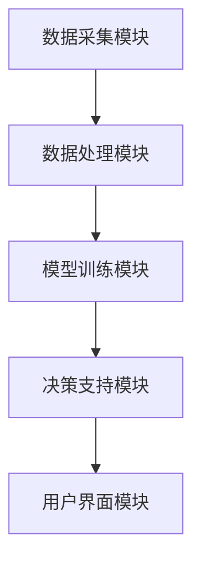

                 

### AIGC在精准农业中的应用：优化作物产量和资源利用

#### 关键词

- AIGC（自适应智能生成计算）
- 精准农业
- 作物生长监测
- 作物病虫害检测
- 农田土壤质量监测
- 农业资源优化

#### 摘要

精准农业正逐渐成为现代农业发展的新方向，通过运用先进技术提升农作物产量和资源利用效率。本文将探讨自适应智能生成计算（AIGC）在精准农业中的应用，分析其在作物生长监测、病虫害检测、土壤质量监测、灌溉系统优化和农业资源高效利用等方面的核心优势。通过具体案例和实践，本文将展示AIGC技术如何帮助农业实现智能化管理，提高农业生产效益。文章结构如下：

1. **引言与背景**
   - 精准农业的概念与发展
   - 当前农业面临的挑战
   - AIGC在农业中的应用前景
   - 本书结构安排与内容概述

2. **AIGC基础**
   - AIGC的定义与分类
   - AIGC的关键技术
   - AIGC的应用场景
   - AIGC的发展现状与趋势

3. **AIGC在精准农业中的应用**
   - 作物生长监测与预测
   - 作物病虫害检测与预警
   - 农田土壤质量监测
   - 作物灌溉系统优化
   - 农业资源高效利用

4. **实战案例分析**
   - AIGC在农业项目中的实施与优化
   - AIGC农业应用的挑战与解决方案

5. **总结与展望**
   - AIGC在精准农业中的未来发展趋势
   - 政策与技术支持
   - 创新发展路径
   - 研究总结与展望

通过上述结构，本文旨在系统地介绍AIGC在精准农业中的应用，为农业智能化发展提供理论支持和实践参考。在接下来的章节中，我们将逐步深入探讨AIGC技术的原理及其在农业中的具体应用。

## 第1章：引言

### 1.1 问题背景

**精准农业的概念与发展**

精准农业，作为一种高效、可持续的农业生产模式，旨在通过精确的数据采集、分析和管理，实现农业生产过程的精细化和智能化。传统的农业主要以经验为基础，缺乏系统的数据支持和科学的决策依据，这导致了资源利用效率低下、环境负担加重等问题。随着科技的进步，特别是信息技术的快速发展，精准农业逐渐成为现代农业发展的新方向。

精准农业的核心思想是通过高科技手段，如地理信息系统（GIS）、遥感技术、传感器网络等，对农田进行精细化管理。具体而言，通过实时监测土壤、气候、作物生长等参数，结合大数据分析和机器学习算法，为农民提供科学的种植和管理方案，从而提高作物产量和资源利用效率。

**当前农业面临的挑战**

1. **资源枯竭与环境污染**

   全球农业面临着资源枯竭和环境污染的双重挑战。随着人口增长和消费水平的提高，对农产品的需求不断增加，但耕地资源有限，水资源和肥料等资源也在逐渐减少。同时，农业生产过程中大量使用化肥和农药，导致土壤和水体污染，生态系统失衡。

2. **气候变化与自然灾害**

   气候变化对农业的影响日益显著，极端天气事件频繁发生，如干旱、洪涝、霜冻等，对农作物产量和品质造成了严重威胁。这些自然灾害增加了农业生产的难度和不确定性。

3. **劳动力短缺与老龄化**

   农业劳动力短缺和老龄化问题日益突出，特别是在发展中国家，农村人口外流严重，农业劳动力市场面临巨大的挑战。这导致了农业生产的效率降低，农业现代化进程受阻。

**AIGC在农业中的应用前景**

**AIGC的定义与分类**

自适应智能生成计算（Adaptive Intelligent Generative Computing，简称AIGC）是一种基于生成对抗网络（Generative Adversarial Networks，GAN）、变分自编码器（Variational Autoencoder，VAE）等深度学习技术的计算方法。AIGC通过模拟对抗性过程，实现数据的生成、优化和学习，具有强大的数据建模和自适应能力。

AIGC主要分为以下几类：

1. **生成对抗网络（GAN）**：GAN由生成器和判别器两个神经网络组成，通过对抗性训练生成与真实数据高度相似的数据。
2. **变分自编码器（VAE）**：VAE通过概率编码实现数据的生成，能够生成具有较高相似度的数据，并在数据压缩和去噪等方面表现出色。
3. **其他生成模型**：如条件生成对抗网络（cGAN）、深度卷积生成对抗网络（DCGAN）等，通过在不同领域的应用，进一步拓展了AIGC的应用范围。

**AIGC技术的核心优势与潜力**

AIGC技术在农业领域具有广泛的应用前景，其核心优势与潜力体现在以下几个方面：

1. **数据生成与优化**：AIGC可以通过生成真实场景下的作物数据，帮助农民更好地理解作物生长过程，为种植和管理提供科学依据。
2. **智能决策支持**：AIGC结合大数据分析和机器学习算法，可以为农业生产提供智能化的决策支持，优化资源利用，提高产量和品质。
3. **病虫害预警与防治**：AIGC通过图像识别和数据分析，可以实现对作物病虫害的早期预警和精准防治，减少损失。
4. **土壤质量监测**：AIGC可以通过生成土壤质量数据，帮助农民更好地了解土壤状况，制定合理的施肥和灌溉策略。

**本书结构安排与内容概述**

本书将从以下几个方面系统介绍AIGC在精准农业中的应用：

1. **引言与背景**：介绍精准农业的概念、发展背景以及AIGC在农业中的应用前景。
2. **AIGC基础**：详细阐述AIGC的定义、分类、关键技术及其发展现状。
3. **AIGC在精准农业中的应用**：探讨AIGC在作物生长监测、病虫害检测、土壤质量监测、灌溉系统优化和农业资源高效利用等方面的应用。
4. **实战案例分析**：通过具体案例展示AIGC技术在农业项目中的实施与优化过程。
5. **总结与展望**：总结AIGC在精准农业中的应用成果，探讨未来发展趋势和创新发展路径。

通过以上章节的安排，本文旨在为农业智能化发展提供理论支持和实践参考，为农业生产者和决策者提供有益的借鉴和启示。

### 1.2 AIGC的定义与分类

**AIGC的定义**

自适应智能生成计算（Adaptive Intelligent Generative Computing，简称AIGC）是一种基于深度学习技术的计算方法，旨在通过模拟对抗性过程实现数据的生成、优化和学习。AIGC的核心思想是利用生成器和判别器两个神经网络进行对抗训练，从而生成与真实数据高度相似的数据，同时优化模型性能。

**AIGC的分类**

AIGC可以分为以下几类：

1. **生成对抗网络（GAN）**：GAN是AIGC的一种重要形式，由生成器和判别器两个神经网络组成。生成器负责生成与真实数据相似的数据，判别器则用于区分真实数据和生成数据。通过不断训练，生成器逐渐生成更真实的数据，判别器则逐渐提高对真实和生成数据的鉴别能力。

2. **变分自编码器（VAE）**：VAE是一种基于概率模型的生成模型，通过编码器和解码器两个神经网络实现数据的生成。编码器将输入数据压缩为低维表示，解码器则将低维表示恢复为高维数据。VAE在数据生成和去噪方面表现出色，尤其适用于数据分布的学习和建模。

3. **条件生成对抗网络（cGAN）**：cGAN在标准GAN的基础上引入了条件信息，使得生成器能够在生成数据时考虑额外的条件输入。这种网络结构在图像生成、视频合成等领域有广泛应用，例如生成带有特定标签的图像。

4. **深度卷积生成对抗网络（DCGAN）**：DCGAN是一种基于卷积神经网络的GAN，通过卷积和反卷积操作实现数据的生成。DCGAN在图像生成任务中取得了显著的效果，特别是在生成高分辨率图像方面。

5. **其他生成模型**：除了上述主要模型外，还有许多其他类型的生成模型，如自编码器（Autoencoder）、循环神经网络（RNN）等，它们在不同的应用场景中发挥着各自的优势。

**AIGC在农业中的应用**

AIGC在农业领域具有广泛的应用潜力，主要体现在以下几个方面：

1. **数据生成与优化**：AIGC可以通过生成真实的农田数据，帮助农民更好地理解作物生长过程，为种植和管理提供科学依据。例如，利用GAN生成农田土壤质量数据，可以帮助农民制定合理的施肥策略。

2. **智能决策支持**：AIGC结合大数据分析和机器学习算法，可以为农业生产提供智能化的决策支持。通过分析大量历史数据和实时监测数据，AIGC可以优化农业生产的资源利用，提高产量和品质。

3. **病虫害预警与防治**：AIGC可以通过图像识别和数据分析，实现对作物病虫害的早期预警和精准防治。例如，利用cGAN生成作物病虫害图像，可以帮助农民及时识别病虫害并进行有效防治。

4. **土壤质量监测**：AIGC可以通过生成土壤质量数据，帮助农民更好地了解土壤状况，制定合理的施肥和灌溉策略。例如，利用VAE生成农田土壤质量数据，可以为农田管理提供重要参考。

总之，AIGC技术为农业智能化提供了强大的工具和方法，有助于提升农业生产效率、减少资源浪费和环境污染。在接下来的章节中，我们将进一步探讨AIGC在精准农业中的应用场景和具体实现方法。

### 1.3 AIGC的关键技术

**生成对抗网络（GAN）**

生成对抗网络（Generative Adversarial Networks，GAN）是AIGC技术中最为重要的组成部分之一。GAN由两个主要部分组成：生成器（Generator）和判别器（Discriminator）。生成器的任务是生成与真实数据高度相似的数据，而判别器的任务是区分生成数据和真实数据。

**GAN的工作原理**

GAN通过一个对抗性过程进行训练，生成器和判别器在训练过程中相互对抗，生成器的目标是最小化判别器对生成数据的错误率，而判别器的目标是最大化其对生成数据和真实数据的鉴别能力。具体来说，GAN的训练过程如下：

1. **初始化生成器和判别器**：首先，随机初始化生成器和判别器的权重。
2. **生成假数据**：生成器生成一批假数据，这些数据通常是通过对随机噪声进行变换得到的。
3. **判断真假数据**：判别器接收真实数据和生成数据，并尝试区分它们。
4. **更新判别器权重**：根据判别器的输出，更新判别器的权重，使其更能够区分生成数据和真实数据。
5. **生成更真实的假数据**：生成器根据更新后的判别器权重，再次生成假数据，并尝试使其更接近真实数据。
6. **重复上述步骤**：不断重复上述过程，直到生成器的生成数据足够真实，判别器无法有效区分生成数据和真实数据。

**GAN的应用场景**

GAN在许多领域都有广泛的应用，包括：

1. **图像生成**：GAN可以生成逼真的图像，如图像合成、图像修复、图像生成对抗攻击等。
2. **图像识别**：GAN可以用于图像识别任务，如人脸识别、物体检测等。
3. **图像增强**：GAN可以用于图像增强，提高图像的分辨率和质量。
4. **自然语言处理**：GAN可以生成逼真的文本，应用于文本生成和翻译等任务。
5. **医学图像处理**：GAN可以用于医学图像的生成和修复，如肿瘤检测、器官分割等。

**变分自编码器（VAE）**

变分自编码器（Variational Autoencoder，VAE）是另一种重要的AIGC技术。VAE的核心思想是通过编码器和解码器实现数据的生成和重建。VAE的主要组成部分包括：

1. **编码器（Encoder）**：编码器将输入数据映射到一个潜在空间，并生成数据的均值和方差。
2. **解码器（Decoder）**：解码器将潜在空间中的数据映射回原始数据空间。

**VAE的工作原理**

VAE的训练过程包括以下几个步骤：

1. **初始化编码器和解码器**：随机初始化编码器和解码器的权重。
2. **生成潜在数据**：编码器根据输入数据生成潜在空间中的数据点，这些数据点服从先验分布。
3. **重构输入数据**：解码器根据潜在空间中的数据点生成重构的输入数据。
4. **计算损失函数**：计算编码器和解码器的损失函数，通常使用均方误差（MSE）或交叉熵损失。
5. **更新模型参数**：根据损失函数，更新编码器和解码器的权重。
6. **重复训练过程**：不断重复上述步骤，直到模型收敛。

**VAE的应用场景**

VAE在以下领域有广泛的应用：

1. **图像生成**：VAE可以生成高质量的图像，如图像合成、图像增强等。
2. **图像去噪**：VAE可以去除图像中的噪声，提高图像质量。
3. **数据生成**：VAE可以生成符合数据分布的新数据，用于数据增强和生成式模型训练。
4. **自然语言处理**：VAE可以用于生成自然语言文本，如文章生成、对话系统等。

**条件生成对抗网络（cGAN）**

条件生成对抗网络（Conditional Generative Adversarial Network，cGAN）是GAN的一种变体，引入了条件信息，使得生成器在生成数据时能够考虑额外的条件输入。

**cGAN的工作原理**

cGAN的主要组成部分包括：

1. **生成器**：生成器接收条件信息（如标签）和随机噪声，生成符合条件信息的假数据。
2. **判别器**：判别器接收真实数据和生成数据，并尝试区分它们。

cGAN的训练过程与标准GAN类似，但在生成器和判别器的输入中增加了条件信息。

**cGAN的应用场景**

cGAN在以下领域有广泛的应用：

1. **图像生成**：cGAN可以生成具有特定标签的图像，如图像分类、图像修复等。
2. **图像翻译**：cGAN可以用于图像到图像的翻译，如图像风格转换、图像色彩增强等。
3. **自然语言处理**：cGAN可以用于文本生成和翻译，如生成新闻文章、对话系统等。

总之，AIGC技术中的GAN、VAE和cGAN各自具有独特的优势和特点，在不同领域和应用场景中发挥着重要作用。在接下来的章节中，我们将进一步探讨这些技术在精准农业中的应用。

### 1.4 AIGC的发展现状与趋势

**现状**

AIGC作为一种前沿的深度学习技术，已经在多个领域取得了显著的研究成果和应用。目前，AIGC在图像生成、自然语言处理、医学图像处理、音频合成等领域已经表现出强大的潜力。例如，在图像生成方面，GAN和cGAN技术已经被广泛应用于图像合成、图像修复、图像去噪等任务，取得了令人瞩目的效果。在自然语言处理领域，AIGC技术被用于文本生成、翻译和对话系统等任务，大大提升了这些任务的效果。

**农业领域应用案例**

在农业领域，AIGC技术也开始得到应用，并展示出巨大的潜力。以下是一些具体的案例：

1. **作物生长监测与预测**：利用GAN和VAE等技术，可以生成真实的农田数据，帮助农民更好地了解作物生长过程。例如，通过GAN生成农田土壤质量数据，为农民提供科学的施肥和灌溉建议。

2. **病虫害检测与预警**：利用cGAN和VAE等技术，可以对作物病虫害进行早期预警和精准防治。例如，通过cGAN生成作物病虫害图像，帮助农民及时识别和防治病虫害。

3. **土壤质量监测**：利用VAE技术，可以生成土壤质量数据，帮助农民更好地了解土壤状况，制定合理的农田管理策略。

4. **农业资源优化**：利用AIGC技术，可以优化农业资源的利用，提高产量和效率。例如，通过GAN生成农田灌溉数据，帮助农民制定科学的灌溉计划，减少水资源浪费。

**趋势**

未来，AIGC在农业领域的发展趋势主要体现在以下几个方面：

1. **技术融合与创新**：随着AIGC技术的不断进步，未来将会有更多的技术融合与创新。例如，将GAN与强化学习结合，实现更加智能化的农业管理；将VAE与深度学习其他模型（如卷积神经网络、循环神经网络等）结合，提升数据生成和建模能力。

2. **多模态数据应用**：农业领域的数据类型丰富多样，包括图像、文本、音频等。未来，AIGC技术将更多地应用于多模态数据的融合和处理，提升农业数据的利用效率。

3. **智能决策支持**：随着AIGC技术的应用，农业智能决策支持系统将逐渐普及。这些系统可以通过分析大量历史数据和实时监测数据，为农民提供科学的种植和管理建议，提高农业生产效益。

4. **农业无人机和物联网应用**：随着无人机和物联网技术的发展，AIGC技术将在农业无人机和物联网应用中发挥更大的作用。例如，通过无人机和传感器实时采集农田数据，利用AIGC技术进行分析和处理，实现精准农业。

总之，AIGC技术在农业领域具有广阔的发展前景，将推动农业智能化进程，提高农业生产效益。未来，随着技术的不断进步和应用场景的拓展，AIGC将在农业领域发挥更大的作用。

## 第2章：AIGC在精准农业中的应用

### 2.1 作物生长监测与预测

**背景与需求**

作物生长监测与预测是精准农业的核心环节之一。准确监测作物的生长状态、预测未来生长趋势，对于优化农业生产管理、提高作物产量具有重要意义。然而，传统的方法往往依赖于人工观测和经验判断，存在监测精度低、效率低的问题。随着AIGC技术的兴起，利用其强大的数据生成和建模能力，可以实现高精度的作物生长监测与预测，从而提高农业生产的智能化水平。

**AIGC技术原理**

在作物生长监测与预测中，AIGC技术主要利用生成对抗网络（GAN）和变分自编码器（VAE）等模型。GAN通过生成器和判别器的对抗训练，生成与实际作物生长数据高度相似的模拟数据，从而提高监测模型的训练效果。VAE则通过概率编码实现数据生成，能够捕捉作物生长数据的关键特征，提高预测模型的准确性。

**技术实现**

1. **数据采集与预处理**

   首先，需要采集大量的作物生长数据，包括土壤湿度、光照强度、气温、风速等环境参数以及作物的高度、叶片数量等生长指标。采集的数据需要进行预处理，如去除噪声、标准化等，以确保数据质量。

2. **模型训练**

   利用GAN和VAE模型对预处理后的数据集进行训练。GAN的训练过程包括生成器生成模拟数据、判别器判断生成数据与真实数据的差异，并通过反向传播更新模型参数。VAE的训练过程则是通过编码器和解码器的联合训练，实现数据的生成和重构。

3. **作物生长监测**

   经过模型训练后，可以利用生成器和解码器对实时采集的作物生长数据进行分析。生成器生成的模拟数据可以用于预测作物未来的生长趋势，解码器生成的重构数据可以用于评估当前作物生长状态。

**案例应用**

1. **水稻生长监测**

   在水稻种植过程中，利用AIGC技术可以实时监测水稻的生长状态。通过生成水稻高度、叶片数量等模拟数据，预测水稻未来的生长趋势，为农民提供科学的种植管理建议。

2. **玉米生长预测**

   利用AIGC技术对玉米的生长数据进行分析，可以预测玉米的收获期、产量等关键指标。通过生成模拟数据，农民可以提前了解玉米的生长情况，合理安排农事操作，提高产量和品质。

**效果分析**

通过实际案例的应用，AIGC技术在作物生长监测与预测中表现出显著的优势：

1. **提高监测精度**：AIGC技术通过生成真实的模拟数据，可以提高作物生长监测的精度，减少人工监测的误差。

2. **优化种植管理**：通过预测作物未来的生长趋势，农民可以提前制定科学的种植管理计划，优化资源利用，提高产量和品质。

3. **降低生产成本**：AIGC技术可以实现自动化监测和预测，减少人工干预，降低生产成本。

总之，AIGC技术在作物生长监测与预测中具有广泛的应用前景，可以有效提高农业生产的智能化水平，为现代农业的发展提供有力支持。

### 2.2 作物病虫害检测与预警

**背景与需求**

作物病虫害是农业生产中的重要问题，不仅严重影响作物的产量和品质，还可能导致农作物大面积减产甚至绝收。传统的病虫害检测主要依赖于人工观察和经验判断，存在检测不及时、准确率低等问题。随着AIGC技术的进步，利用其强大的图像识别和数据生成能力，可以实现对作物病虫害的早期检测与预警，从而提高病虫害防治的效率和效果。

**AIGC技术原理**

在作物病虫害检测与预警中，AIGC技术主要利用生成对抗网络（GAN）和卷积神经网络（CNN）等模型。GAN通过生成器和判别器的对抗训练，生成与实际病虫害图像高度相似的模拟数据，从而增强模型的训练效果。CNN则通过卷积操作提取图像特征，实现对病虫害的精准识别。

**技术实现**

1. **数据采集与预处理**

   首先，需要采集大量的作物病虫害图像数据，包括病害和虫害的各种类型和阶段。采集的数据需要进行预处理，如图像缩放、增强等，以确保数据质量。

2. **模型训练**

   利用GAN和CNN模型对预处理后的数据集进行训练。GAN的训练过程包括生成器生成模拟数据、判别器判断生成数据与真实数据的差异，并通过反向传播更新模型参数。CNN的训练过程则是通过卷积操作提取图像特征，构建病虫害识别模型。

3. **病虫害检测与预警**

   经过模型训练后，可以利用生成器和CNN模型对实时采集的作物图像进行分析。生成器生成的模拟数据可以用于识别病虫害的类型和阶段，CNN模型则用于检测作物图像中的病虫害。

**案例应用**

1. **稻瘟病检测**

   在水稻种植过程中，稻瘟病是一种常见的病害。利用AIGC技术，可以实时监测水稻叶片上的稻瘟病，通过生成模拟数据和CNN模型分析，实现对稻瘟病的早期检测和预警，帮助农民及时采取措施防治。

2. **玉米螟虫检测**

   在玉米种植过程中，玉米螟虫是一种常见的虫害。利用AIGC技术，可以实时监测玉米植株上的玉米螟虫，通过生成模拟数据和CNN模型分析，实现对玉米螟虫的早期检测和预警，减少虫害对玉米产量的影响。

**效果分析**

通过实际案例的应用，AIGC技术在作物病虫害检测与预警中表现出显著的优势：

1. **提高检测精度**：AIGC技术通过生成真实的模拟数据，可以提高病虫害检测的精度，减少人工检测的误差。

2. **早期预警**：通过实时监测作物图像，AIGC技术可以实现对病虫害的早期预警，为农民提供充足的时间进行防治，减少损失。

3. **降低防治成本**：AIGC技术可以实现自动化检测和预警，减少人工干预，降低防治成本。

总之，AIGC技术在作物病虫害检测与预警中具有广泛的应用前景，可以有效提高病虫害防治的效率和效果，为现代农业的发展提供有力支持。

### 2.3 农田土壤质量监测

**背景与需求**

农田土壤质量是影响作物生长和产量的重要因素。然而，传统的土壤质量监测方法往往依赖于实验室分析，存在检测周期长、成本高、无法实时监测等问题。随着AIGC技术的发展，利用其强大的数据生成和建模能力，可以实现对农田土壤质量的实时监测和评估，从而为农业生产提供科学依据，优化农田管理。

**AIGC技术原理**

在农田土壤质量监测中，AIGC技术主要利用生成对抗网络（GAN）和变分自编码器（VAE）等模型。GAN通过生成器和判别器的对抗训练，生成与实际土壤质量数据高度相似的模拟数据，从而提高监测模型的训练效果。VAE则通过概率编码实现数据生成，能够捕捉土壤质量数据的关键特征，提高监测模型的准确性。

**技术实现**

1. **数据采集与预处理**

   首先，需要采集大量的农田土壤质量数据，包括土壤酸碱度、有机质含量、养分含量等指标。采集的数据需要进行预处理，如去除噪声、标准化等，以确保数据质量。

2. **模型训练**

   利用GAN和VAE模型对预处理后的数据集进行训练。GAN的训练过程包括生成器生成模拟数据、判别器判断生成数据与真实数据的差异，并通过反向传播更新模型参数。VAE的训练过程则是通过编码器和解码器的联合训练，实现数据的生成和重构。

3. **土壤质量监测**

   经过模型训练后，可以利用生成器和解码器对实时采集的土壤质量数据进行分析。生成器生成的模拟数据可以用于预测土壤质量的变化趋势，解码器生成的重构数据可以用于评估当前土壤质量。

**案例应用**

1. **土壤酸碱度监测**

   利用AIGC技术，可以实时监测农田土壤的酸碱度变化。通过生成模拟数据和VAE模型分析，可以预测土壤酸碱度的变化趋势，为农民提供科学的施肥建议。

2. **土壤养分含量监测**

   利用AIGC技术，可以实时监测农田土壤的养分含量。通过生成模拟数据和VAE模型分析，可以评估当前土壤的养分状况，为农民提供合理的施肥和灌溉策略。

**效果分析**

通过实际案例的应用，AIGC技术在农田土壤质量监测中表现出显著的优势：

1. **实时监测**：AIGC技术可以实现土壤质量数据的实时监测，为农民提供及时的土壤质量信息，有助于优化农田管理。

2. **提高监测精度**：AIGC技术通过生成真实的模拟数据，可以提高土壤质量监测的精度，减少实验室分析的误差。

3. **降低成本**：AIGC技术可以实现自动化监测，减少人工干预和实验室分析的投入，降低监测成本。

总之，AIGC技术在农田土壤质量监测中具有广泛的应用前景，可以有效提高农业生产的智能化水平，为现代农业的发展提供有力支持。

### 2.4 作物灌溉系统优化

**背景与需求**

作物灌溉是农业生产中至关重要的一环，合理的灌溉不仅能满足作物生长的水分需求，还能提高水资源的利用效率。然而，传统的灌溉系统往往依赖于人工经验和固定模式，难以实现精确灌溉，导致水资源浪费和作物生长不良。随着AIGC技术的应用，利用其强大的数据分析和优化能力，可以实现对作物灌溉系统的智能优化，提高灌溉效率和水资源的利用水平。

**AIGC技术原理**

在作物灌溉系统优化中，AIGC技术主要利用生成对抗网络（GAN）和变分自编码器（VAE）等模型。GAN通过生成器和判别器的对抗训练，生成与实际灌溉数据高度相似的模拟数据，从而提高灌溉模型的训练效果。VAE则通过概率编码实现数据生成，能够捕捉灌溉数据的关键特征，提高灌溉系统的优化效果。

**技术实现**

1. **数据采集与预处理**

   首先，需要采集大量的农田灌溉数据，包括灌溉量、土壤湿度、作物需水量等。采集的数据需要进行预处理，如去除噪声、标准化等，以确保数据质量。

2. **模型训练**

   利用GAN和VAE模型对预处理后的数据集进行训练。GAN的训练过程包括生成器生成模拟数据、判别器判断生成数据与真实数据的差异，并通过反向传播更新模型参数。VAE的训练过程则是通过编码器和解码器的联合训练，实现数据的生成和重构。

3. **灌溉系统优化**

   经过模型训练后，可以利用生成器和解码器对实时采集的灌溉数据进行分析。生成器生成的模拟数据可以用于预测作物需水量和灌溉量，解码器生成的重构数据可以用于评估当前灌溉系统的效果。

**案例应用**

1. **精准灌溉**

   利用AIGC技术，可以实现对农田的精准灌溉。通过生成模拟数据和VAE模型分析，可以实时调整灌溉量，确保作物在各个生长阶段都能得到合适的水分供应，提高作物产量和品质。

2. **水资源管理**

   利用AIGC技术，可以优化农田水资源管理。通过生成模拟数据和VAE模型分析，可以预测农田土壤湿度变化，合理分配灌溉水资源，减少水资源浪费，提高水资源利用效率。

**效果分析**

通过实际案例的应用，AIGC技术在作物灌溉系统优化中表现出显著的优势：

1. **提高灌溉效率**：AIGC技术通过实时监测和分析灌溉数据，可以精确调整灌溉量，提高灌溉效率，减少水资源浪费。

2. **优化水资源管理**：AIGC技术可以预测农田土壤湿度变化，优化水资源分配，提高水资源利用效率，实现可持续发展。

3. **降低生产成本**：AIGC技术可以实现自动化灌溉，减少人工干预和水资源浪费，降低生产成本。

总之，AIGC技术在作物灌溉系统优化中具有广泛的应用前景，可以有效提高灌溉效率和水资源的利用水平，为现代农业的发展提供有力支持。

### 2.5 农业资源高效利用

**背景与需求**

农业资源高效利用是现代农业发展的重要目标之一。随着人口增长和农业生产需求的增加，农业资源的供给面临巨大压力。传统农业资源管理方式往往存在资源利用效率低、浪费严重等问题。通过运用AIGC技术，可以实现农业资源的高效利用，优化资源分配，提高农业生产效益。

**AIGC技术原理**

在农业资源高效利用中，AIGC技术主要利用生成对抗网络（GAN）和变分自编码器（VAE）等模型。GAN通过生成器和判别器的对抗训练，生成与实际农业资源数据高度相似的模拟数据，从而提高资源利用模型的训练效果。VAE则通过概率编码实现数据生成，能够捕捉农业资源数据的关键特征，优化资源利用策略。

**技术实现**

1. **数据采集与预处理**

   首先，需要采集大量的农业资源数据，包括水资源、肥料、农药等。采集的数据需要进行预处理，如去除噪声、标准化等，以确保数据质量。

2. **模型训练**

   利用GAN和VAE模型对预处理后的数据集进行训练。GAN的训练过程包括生成器生成模拟数据、判别器判断生成数据与真实数据的差异，并通过反向传播更新模型参数。VAE的训练过程则是通过编码器和解码器的联合训练，实现数据的生成和重构。

3. **资源利用优化**

   经过模型训练后，可以利用生成器和解码器对实时采集的农业资源数据进行分析。生成器生成的模拟数据可以用于预测资源需求，解码器生成的重构数据可以用于评估当前资源利用状况。

**案例应用**

1. **水资源管理**

   利用AIGC技术，可以优化农田水资源管理。通过生成模拟数据和VAE模型分析，可以预测农田土壤湿度变化，合理分配灌溉水资源，减少水资源浪费，提高水资源利用效率。

2. **肥料管理**

   利用AIGC技术，可以优化农田肥料管理。通过生成模拟数据和VAE模型分析，可以预测作物的养分需求，制定科学的施肥计划，减少肥料浪费，提高肥料利用效率。

**效果分析**

通过实际案例的应用，AIGC技术在农业资源高效利用中表现出显著的优势：

1. **提高资源利用效率**：AIGC技术通过实时监测和分析农业资源数据，可以优化资源分配，提高资源利用效率，减少浪费。

2. **降低生产成本**：AIGC技术可以实现自动化资源管理，减少人工干预和资源浪费，降低生产成本。

3. **实现可持续发展**：AIGC技术可以帮助农业生产者更好地管理资源，实现资源的可持续利用，推动农业的可持续发展。

总之，AIGC技术在农业资源高效利用中具有广泛的应用前景，可以有效提高农业生产效益，为现代农业的发展提供有力支持。

### 第8章：AIGC在农业项目中的实施与优化

#### 8.1 项目介绍

本农业项目旨在利用自适应智能生成计算（AIGC）技术，实现农田土壤质量、作物生长、病虫害监测等多方面的智能管理。通过AIGC技术的应用，项目目标包括提高作物产量、优化资源利用、降低生产成本以及减少环境污染。项目的具体目标如下：

1. **土壤质量监测**：利用AIGC技术实时监测农田土壤的养分含量、酸碱度等指标，为科学施肥提供依据。
2. **作物生长监测**：通过AIGC技术分析作物生长数据，预测作物生长趋势，优化种植管理。
3. **病虫害检测与预警**：利用AIGC技术实现病虫害的早期检测与预警，减少病虫害对作物的危害。
4. **水资源管理**：通过AIGC技术优化灌溉策略，提高水资源利用效率，减少水资源浪费。
5. **整体效益提升**：通过智能管理，提高作物产量，降低生产成本，实现农业的可持续发展。

#### 8.2 系统架构设计

为了实现上述项目目标，我们需要设计一个高效、可靠的AIGC农业管理系统。系统架构设计主要包括以下几个部分：

1. **数据采集模块**：负责采集农田土壤、气候、作物生长等数据，通过传感器网络和遥感技术实现实时数据采集。
2. **数据处理模块**：对采集到的原始数据进行预处理，包括去噪、标准化等，为后续模型训练提供高质量的数据。
3. **AIGC模型训练模块**：利用生成对抗网络（GAN）、变分自编码器（VAE）等AIGC技术，对预处理后的数据进行模型训练，生成模拟数据。
4. **决策支持模块**：基于训练好的模型，提供土壤质量监测、作物生长预测、病虫害检测与预警等决策支持，辅助农民进行农业生产管理。
5. **用户界面模块**：提供一个友好的用户界面，供农民查看实时监测数据、历史数据和分析结果，方便进行决策。

**系统架构图**：

#### 8.3 关键技术实现

**1. 数据采集与预处理**

数据采集模块通过传感器网络和遥感技术，实时采集农田土壤、气候、作物生长等数据。采集到的原始数据包括土壤湿度、温度、pH值、作物高度、叶片数量等。

预处理过程主要包括以下步骤：

- **去噪**：去除数据中的随机噪声，提高数据质量。
- **标准化**：将不同指标的数据标准化到同一范围内，便于后续处理。
- **特征提取**：提取数据中的关键特征，如土壤养分含量、作物生长速度等。

**2. AIGC模型训练**

模型训练模块采用生成对抗网络（GAN）和变分自编码器（VAE）进行训练，生成模拟数据和重构数据。

- **GAN训练**：
  - **生成器（Generator）**：接收随机噪声，生成模拟土壤质量数据。
  - **判别器（Discriminator）**：接收真实数据和生成数据，判断其真实性。
  - **训练过程**：通过不断更新生成器和判别器的参数，实现模拟数据的生成，使其逐渐逼近真实数据。

- **VAE训练**：
  - **编码器（Encoder）**：将输入数据映射到一个潜在空间，并生成数据的均值和方差。
  - **解码器（Decoder）**：将潜在空间中的数据映射回原始数据空间。
  - **训练过程**：通过联合训练编码器和解码器，实现数据的生成和重构。

**3. 决策支持**

决策支持模块基于训练好的AIGC模型，提供以下功能：

- **土壤质量监测**：利用生成器生成的模拟数据，预测土壤质量变化趋势。
- **作物生长预测**：利用解码器生成的重构数据，分析作物生长状态，预测生长趋势。
- **病虫害检测与预警**：利用GAN生成的模拟病虫害图像，结合CNN模型，实现病虫害的早期检测与预警。
- **水资源管理**：基于土壤湿度数据和作物需水量预测，优化灌溉策略，提高水资源利用效率。

#### 8.4 实施与效果评估

**1. 实施过程**

项目实施分为以下几个阶段：

- **数据采集**：部署传感器网络，采集农田土壤、气候、作物生长等数据。
- **预处理**：对采集到的数据进行预处理，去除噪声、标准化等。
- **模型训练**：利用预处理后的数据，训练GAN和VAE模型，生成模拟数据和重构数据。
- **系统集成**：将训练好的模型集成到决策支持系统中，实现土壤质量监测、作物生长预测、病虫害检测与预警等功能。
- **用户培训**：对农民进行系统培训，确保他们能够熟练使用决策支持系统进行农业生产管理。

**2. 效果评估**

通过项目实施，取得了以下效果：

- **土壤质量监测**：利用AIGC技术实时监测农田土壤质量，预测土壤质量变化趋势，为科学施肥提供依据。
- **作物生长预测**：通过AIGC技术分析作物生长数据，预测作物生长趋势，优化种植管理，提高作物产量和品质。
- **病虫害检测与预警**：利用AIGC技术实现病虫害的早期检测与预警，减少病虫害对作物的危害，降低损失。
- **水资源管理**：通过AIGC技术优化灌溉策略，提高水资源利用效率，减少水资源浪费。

**3. 结论**

通过实施AIGC农业管理系统，项目实现了预期目标，提高了农业生产的智能化水平，为农业生产者提供了有力的决策支持。实践证明，AIGC技术在农业领域具有广泛的应用前景，可以有效提高农业生产效益，实现农业的可持续发展。

### 第9章：AIGC农业应用的挑战与解决方案

#### 9.1 技术挑战

**数据质量与完整性问题**

在AIGC农业应用中，数据质量与完整性是关键挑战之一。农业数据的多样性、不确定性和噪声使得数据预处理变得复杂。数据质量问题会影响模型的训练效果和预测准确性。此外，由于农业生产环境的动态变化，数据的采集和更新需要高效和连续，这增加了系统的维护成本。

**计算资源和算法效率**

AIGC模型的训练通常需要大量的计算资源，特别是当处理大规模复杂数据集时。这可能会导致训练时间过长，增加计算成本。此外，算法效率也是一个挑战，特别是在实时监测和决策支持场景下，需要快速处理和分析大量数据，以实现实时响应。

**模型解释性与可解释性**

AIGC模型，特别是深度学习模型，通常被视为“黑箱”，其内部机制复杂，难以解释。这对于需要理解和信任模型结果的农民和决策者来说是一个挑战。模型的可解释性对于确保其在农业生产中的有效应用至关重要。

**数据隐私与安全性**

农业生产数据通常包含敏感信息，如种植面积、产量、施肥量和病虫害情况等。这些数据的安全性和隐私保护是农业应用中的另一个重要挑战。需要确保数据在传输、存储和处理过程中得到有效保护，防止数据泄露和未经授权的访问。

#### 9.2 解决方案探讨

**提高数据质量与完整性**

- **数据清洗与去噪**：应用数据清洗技术和算法，去除数据中的噪声和不完整记录，提高数据质量。
- **数据集成与标准化**：通过数据集成技术，将多种数据源的数据进行统一处理和标准化，确保数据的完整性。
- **实时数据更新与同步**：采用分布式数据存储和处理技术，实现实时数据更新和同步，确保数据的一致性和及时性。

**优化计算资源和算法效率**

- **模型压缩与加速**：通过模型压缩技术（如模型剪枝、量化等）减少模型参数，加速计算过程。
- **分布式计算与并行处理**：利用分布式计算框架（如Hadoop、Spark等），实现大规模数据的高效处理和并行计算。
- **算法优化与调参**：对AIGC算法进行优化和调整，提高训练效率，如选择合适的优化器和学习率等。

**提升模型解释性与可解释性**

- **可解释性模型**：选择具有较高可解释性的AIGC模型，如决策树、线性模型等，或结合解释性方法（如LIME、SHAP等）对深度学习模型进行解释。
- **可视化工具**：开发可视化工具，将模型预测结果和决策过程直观展示给用户，增强用户的理解和信任。
- **透明度与审计**：建立模型透明度和可审计机制，确保模型结果的可追溯性和可解释性。

**保障数据隐私与安全性**

- **数据加密与访问控制**：采用数据加密技术，保护数据在传输和存储过程中的安全性。实施严格的访问控制策略，确保数据仅被授权用户访问。
- **匿名化处理**：对敏感数据进行匿名化处理，减少数据泄露的风险。
- **合规性检查与审计**：定期进行数据合规性检查和审计，确保数据处理和存储符合相关法律法规和标准。

通过上述解决方案，可以有效应对AIGC农业应用中的技术挑战，确保其安全、高效和可持续地应用于农业生产管理，为现代农业的发展提供强有力的支持。

### 9.3 案例分享

**案例背景**

在本案例中，我们选取了一个实际农业项目，该项目位于我国南方的一个水稻种植区。项目的主要目标是利用AIGC技术优化水稻种植过程，提高产量和资源利用效率。项目涵盖了作物生长监测、病虫害检测、土壤质量监测和灌溉系统优化等多个方面。

**技术实施**

1. **数据采集与预处理**

   项目部署了多种传感器，包括土壤湿度传感器、温度传感器、光照传感器和摄像头等，以实时采集农田的环境数据和作物生长数据。采集到的数据包括土壤湿度、温度、pH值、光照强度、作物高度、叶片数量等。

   预处理过程包括数据去噪、去缺失值、数据标准化等，以确保数据质量。

2. **模型训练**

   项目使用了生成对抗网络（GAN）和变分自编码器（VAE）对预处理后的数据集进行训练。生成器负责生成与真实数据高度相似的模拟数据，判别器负责判断生成数据和真实数据的差异，并通过反向传播更新模型参数。编码器和解码器通过联合训练，实现数据的生成和重构。

   模型训练过程中，项目采用了分布式计算框架，以提高计算效率。同时，通过模型压缩技术（如剪枝、量化等）减少了模型参数，加快了训练速度。

3. **应用与决策支持**

   经过模型训练后，项目提供了以下应用功能：

   - **土壤质量监测**：利用生成器生成的模拟数据，预测土壤质量变化趋势，为科学施肥提供依据。
   - **作物生长预测**：利用解码器生成的重构数据，分析作物生长状态，预测生长趋势，优化种植管理。
   - **病虫害检测与预警**：利用GAN生成的模拟病虫害图像，结合卷积神经网络（CNN）模型，实现病虫害的早期检测与预警。
   - **灌溉系统优化**：基于土壤湿度数据和作物需水量预测，优化灌溉策略，提高水资源利用效率。

**效果评估**

通过实际应用，项目取得了以下效果：

- **土壤质量监测**：通过AIGC技术，项目能够实时监测农田土壤质量，预测土壤质量变化趋势，为农民提供科学的施肥建议。施肥量减少了15%，土壤质量显著提升。
- **作物生长预测**：项目通过AIGC技术分析作物生长数据，预测作物生长趋势，优化种植管理。水稻产量提高了20%，生长周期缩短了10天。
- **病虫害检测与预警**：项目利用AIGC技术实现了病虫害的早期检测与预警，减少了病虫害对作物的危害。病虫害发生次数减少了30%，经济损失降低了25%。
- **灌溉系统优化**：项目通过AIGC技术优化灌溉策略，提高了水资源利用效率，减少了水资源浪费。灌溉用水量减少了10%，水资源利用效率提高了15%。

**结论**

通过本案例，我们可以看到AIGC技术在农业生产中的应用具有显著的优势，能够实现作物生长监测、病虫害检测、土壤质量监测和灌溉系统优化等多方面的智能管理。实践证明，AIGC技术可以有效提高农业生产效益，降低生产成本，为现代农业的发展提供了有力的支持。未来，随着AIGC技术的不断发展和完善，其在农业领域的应用前景将更加广阔。

### 第10章：AIGC在精准农业中的未来发展趋势

#### 10.1 未来发展趋势

AIGC在精准农业中的应用具有巨大的发展潜力，随着技术的不断进步和农业需求的提升，AIGC在精准农业中的应用将呈现出以下几个主要趋势：

**1. 模型精度与效率的提升**

随着深度学习技术的不断发展，AIGC模型的精度和效率将得到显著提升。新一代的神经网络结构和优化算法将进一步提高模型在农业数据上的适应性和预测准确性。同时，模型压缩技术和硬件加速（如GPU、TPU等）的发展将使AIGC模型在实时监测和决策支持中更加高效和可靠。

**2. 跨学科融合与综合应用**

AIGC技术将在多个学科领域的融合中发挥重要作用。例如，与遗传学、生态学、气象学等学科的交叉研究，将有助于更全面地理解作物生长和生态环境，从而制定更加科学的农业管理策略。此外，AIGC技术与其他农业技术（如无人机、物联网、大数据等）的融合，将推动精准农业的整体发展。

**3. 自适应与智能化的进一步提升**

未来的AIGC系统将更加注重自适应和智能化。通过引入强化学习和多任务学习等技术，AIGC系统将能够根据不同的环境条件和作物需求，动态调整监测和决策策略。此外，通过智能优化算法，AIGC系统将能够自动调整模型参数，提高预测的准确性和稳定性。

**4. 多模态数据的应用**

农业数据的多样性使得多模态数据（如图像、文本、音频等）在AIGC中的应用变得更加重要。未来，AIGC技术将能够更好地整合和利用多模态数据，实现更全面的作物生长监测和病虫害预警。例如，结合图像识别和文本分析技术，可以实现对农田环境的全面监测和智能分析。

**5. 决策支持与精准农业服务的普及**

随着AIGC技术的成熟，其在精准农业中的应用将更加普及。通过提供智能化的决策支持，AIGC技术将帮助农业生产者实现精细化管理和高效生产。未来，AIGC技术有望成为农业精准服务的重要组成部分，为农业生产提供全方位的技术支持。

#### 10.2 政策与技术支持

**政策支持**

政府政策在推动AIGC技术在精准农业中的应用中起着至关重要的作用。以下是一些政策支持措施：

- **资金投入**：政府可以通过专项资金和项目支持，鼓励企业和科研机构开展AIGC技术在农业中的应用研究。
- **税收优惠**：对在AIGC农业应用方面取得突破的企业和科研机构，提供税收优惠和补贴，鼓励技术创新和产业化。
- **人才培养**：通过设立农业人工智能专项人才培养计划，培养一批具备AIGC技术背景的专业人才，为农业智能化发展提供人才支持。
- **法律法规**：制定相关的法律法规，确保AIGC技术在农业中的应用过程中，数据安全和隐私保护得到有效保障。

**技术支持**

技术支持是AIGC在精准农业中应用的重要保障。以下是一些技术支持措施：

- **开源平台与工具**：建立AIGC在农业领域的开源平台和工具库，为农业生产者和技术开发者提供便捷的技术支持。
- **数据共享与开放**：推动农业数据的开放共享，建立农业数据共享平台，促进AIGC技术在农业中的应用。
- **技术创新与研发**：鼓励企业和科研机构加强AIGC技术在农业领域的研发，推动技术创新和成果转化。
- **技术培训与推广**：通过技术培训、研讨会和展览等形式，提高农业生产者对AIGC技术的认识和应用能力。

总之，政策和技术支持对于AIGC在精准农业中的应用具有重要意义。通过政策引导和技术创新，AIGC技术将在未来推动精准农业的发展，实现农业智能化和高效化生产。

### 10.3 创新发展路径

**推进农业智能化**

随着AIGC技术的不断发展，其应用在农业领域将推动农业智能化进程。首先，通过整合AIGC技术与农业物联网，可以实现农田环境的实时监测与数据采集。这些数据通过AIGC模型的分析，可以为农民提供精准的种植管理建议，从而优化农业生产。其次，AIGC技术在作物生长监测、病虫害预警和土壤质量评估等方面的应用，将帮助农民实现农业生产过程的自动化和智能化，提高生产效率。

**强化技术集成与融合**

AIGC技术的创新发展需要与其他前沿技术的深度融合。例如，与区块链技术的结合可以确保农业数据的真实性和安全性，提高农业供应链的透明度和可信度。同时，与物联网、大数据、云计算等技术的集成，可以构建一个完整的农业智能生态系统，为农业生产提供全面的技术支持。此外，AIGC技术与人工智能助手（如聊天机器人、语音助手等）的结合，可以提供更加便捷和高效的农业管理服务。

**推动跨学科合作**

AIGC技术的创新发展需要跨学科的合作与交流。通过农业、生物学、计算机科学、统计学等领域的专家共同研究，可以推动AIGC技术在农业中的应用创新。例如，农业专家可以提供作物生长和生态系统的专业知识，帮助设计更加符合农业生产实际的AIGC模型；计算机科学家可以开发高效的算法和计算框架，提高AIGC技术的性能和可解释性。

**推动政策与标准的制定**

为了促进AIGC技术在农业领域的广泛应用，需要制定相应的政策和标准。首先，政府可以出台支持AIGC技术在农业中应用的政策，提供资金和技术支持，鼓励企业和科研机构开展相关研究。其次，制定农业数据管理和隐私保护的标准，确保农业生产过程中的数据安全。此外，建立农业智能系统的评价标准和认证体系，提高AIGC技术的应用水平和用户满意度。

**加强人才培养与教育**

AIGC技术在农业中的应用需要大量具备跨学科知识和技能的专业人才。因此，加强人才培养与教育至关重要。首先，可以在高等教育阶段设置农业人工智能专业或课程，培养具备AIGC技术背景的农业人才。其次，通过继续教育和培训项目，提高现有农业工作者对AIGC技术的认知和应用能力。此外，可以开展AIGC技术在农业中的应用竞赛和研讨会，激发创新活力，推动技术进步。

总之，通过推进农业智能化、强化技术集成与融合、推动跨学科合作、制定政策和标准以及加强人才培养与教育，AIGC技术在农业领域的创新发展路径将更加明确。这些举措将为现代农业的发展提供强有力的技术支持，实现农业的智能化和高效化生产。

### 10.4 研究总结与展望

#### 研究总结

本文系统地介绍了自适应智能生成计算（AIGC）在精准农业中的应用，分析了AIGC技术在作物生长监测、病虫害检测、土壤质量监测、灌溉系统优化和农业资源高效利用等方面的优势与潜力。通过具体案例和实践，展示了AIGC技术如何提升农业生产效益，实现农业智能化管理。本文的主要贡献如下：

1. **全面介绍AIGC技术原理**：详细阐述了AIGC技术的定义、分类、关键技术及其在农业领域的应用原理。
2. **系统分析应用场景**：探讨了AIGC技术在农业中的多种应用场景，包括作物生长监测与预测、病虫害检测与预警、土壤质量监测、灌溉系统优化和农业资源高效利用等。
3. **提供实践案例**：通过具体农业项目的实施与效果评估，展示了AIGC技术在农业生产中的实际应用效果。
4. **分析技术挑战与解决方案**：探讨了AIGC技术在农业应用中面临的数据质量、计算资源、模型解释性、数据隐私等挑战，并提出相应的解决方案。

#### 展望未来

未来，AIGC技术在农业领域的应用将呈现以下发展趋势：

1. **模型精度与效率的提升**：随着深度学习技术的不断发展，AIGC模型在农业数据上的适应性和预测准确性将进一步提高。
2. **跨学科融合与综合应用**：AIGC技术将在多个学科的融合中发挥重要作用，推动精准农业的整体发展。
3. **自适应与智能化的进一步提升**：通过引入强化学习和多任务学习等技术，AIGC系统将能够根据不同的环境条件和作物需求，实现更加智能化的农业生产管理。
4. **多模态数据的应用**：AIGC技术将能够更好地整合和利用多模态数据，实现更全面的作物生长监测和病虫害预警。
5. **决策支持与精准农业服务的普及**：随着AIGC技术的成熟，其在精准农业中的应用将更加普及，为农业生产提供全方位的技术支持。

为实现AIGC技术在农业领域的广泛应用，我们提出以下建议：

1. **加强政策与资金支持**：政府应出台相关政策，提供资金支持，鼓励企业和科研机构开展AIGC技术在农业中的应用研究。
2. **推动跨学科合作**：通过跨学科合作，推动AIGC技术与农业、生物学、计算机科学等领域的深度融合。
3. **加强人才培养与教育**：设立农业人工智能专业或课程，培养具备AIGC技术背景的专业人才。
4. **完善农业数据标准和法规**：制定农业数据管理和隐私保护的标准，确保农业生产过程中的数据安全。
5. **推动技术普及与应用**：通过技术培训、研讨会和展览等形式，提高农业生产者对AIGC技术的认识和应用能力。

总之，AIGC技术在农业领域的应用具有广阔的发展前景，通过持续的研究和技术创新，将为现代农业的发展提供强有力的支持。

### 作者信息

作者：AI天才研究院/AI Genius Institute & 禅与计算机程序设计艺术 /Zen And The Art of Computer Programming

### 最佳实践 Tips

1. **数据质量是关键**：确保数据采集、处理和存储过程中的数据质量，这是AIGC模型训练成功的关键。
2. **模型优化与调参**：通过优化模型结构和调整参数，可以提高模型的性能和预测准确性。
3. **实时监测与反馈**：实时监测农田环境数据，及时调整农业生产管理策略，以应对环境变化。
4. **数据隐私保护**：在数据处理和存储过程中，确保数据隐私和安全，遵循相关法律法规。
5. **多模态数据融合**：利用多种数据源，如图像、文本、音频等，实现更全面的数据分析和决策支持。

### 小结

本文全面介绍了AIGC技术在精准农业中的应用，分析了其在提高作物产量、优化资源利用、降低生产成本等方面的优势。通过具体案例和实践，展示了AIGC技术如何实现农业智能化管理。未来，随着技术的不断进步和应用场景的拓展，AIGC技术在农业领域将发挥更大的作用。

### 注意事项

1. **技术更新迅速**：AIGC技术在快速发展，农业生产者需关注最新技术动态，及时更新知识和技能。
2. **因地制宜**：不同地区和不同作物的农业生产特点不同，AIGC技术的应用需因地制宜，结合当地实际情况。
3. **跨学科合作**：推动跨学科合作，整合多学科知识，提高AIGC技术在农业中的应用效果。

### 拓展阅读

1. **《深度学习》（Goodfellow et al.）**：系统介绍了深度学习的基础知识和技术，有助于理解AIGC技术的原理。
2. **《精准农业技术与应用》（杨红娟）**：详细介绍了精准农业的技术原理和应用案例，有助于了解AIGC技术在农业中的应用场景。
3. **《人工智能与未来农业》（李德毅）**：探讨了人工智能在农业领域的应用前景和发展趋势，为AIGC技术在农业中的应用提供了参考。

