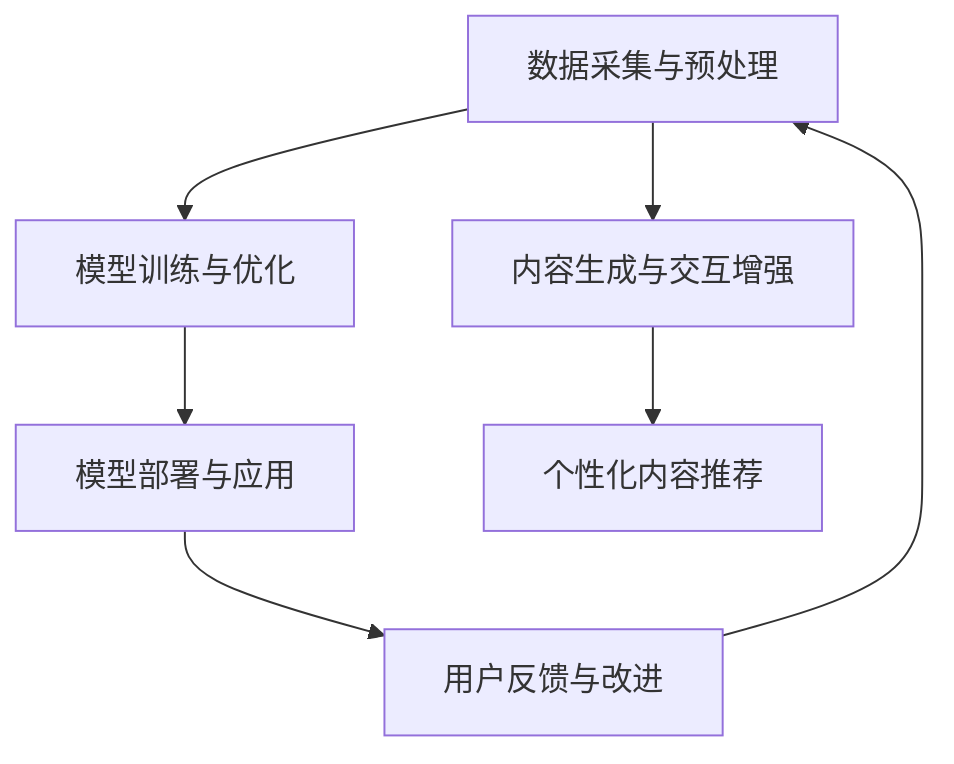

                 

# AIGC在虚拟世界构建中的革命性应用

## 关键词

- AIGC
- 虚拟世界
- 虚拟现实
- 增强现实
- 数据生成
- 交互式内容

## 摘要

本文将深入探讨AIGC（AI-Generated Content，人工智能生成内容）在虚拟世界构建中的革命性应用。虚拟世界，包括虚拟现实（VR）和增强现实（AR），正在迅速成为现代技术的前沿领域，它们通过模拟和增强现实体验，改变了人们与数字世界交互的方式。AIGC技术的引入，极大地提升了虚拟世界的构建效率和沉浸感，使得内容生成的过程更加智能和自动化。本文将逐步分析AIGC的概念、原理及其在虚拟世界中的具体应用，通过实际案例展示AIGC在虚拟世界中的潜力和挑战，为读者提供一个全面的技术视角。

## 第一部分: AIGC在虚拟世界构建中的背景与概念

### 第1章: AIGC与虚拟世界概述

#### 1.1 问题背景与问题描述

##### 1.1.1 虚拟世界的崛起

虚拟世界的发展历程可以追溯到20世纪80年代的虚拟现实概念提出，以及90年代虚拟现实设备的初步商业化。虚拟现实（Virtual Reality，VR）通过模拟用户的视觉、听觉、触觉等感官，使用户沉浸在由计算机生成的三维环境中。增强现实（Augmented Reality，AR）则是在现实世界的基础上，叠加计算机生成的信息，如文字、图像、视频等，增强用户的感知体验。

##### 1.1.1.2 虚拟世界的重要性

虚拟世界在娱乐、教育、医疗、军事、设计等多个领域具有重要应用。例如，在医疗领域，虚拟现实技术被用于手术模拟和患者心理治疗；在教育领域，虚拟现实提供了沉浸式的学习体验，帮助学生更好地理解复杂概念。

##### 1.1.1.3 当前虚拟世界的主要挑战

尽管虚拟世界有着广泛的应用前景，但当前仍面临一些挑战。首先是硬件设备的高昂成本和复杂的使用门槛，限制了虚拟世界的大规模普及。其次是内容生成和交互的效率问题，目前大多数虚拟世界的内容和交互方式仍然依赖于人工操作，这大大降低了构建和使用的效率。

#### 1.1.2 AIGC的概念与特点

AIGC（AI-Generated Content）是指利用人工智能技术生成内容的一种方法。与传统的手动内容创建相比，AIGC具有以下特点：

1. **自动化程度高**：AIGC可以自动生成文本、图像、音频等多种类型的内容，大大减少了人工干预的需求。
2. **效率提升**：通过自动化生成内容，AIGC能够显著提高内容生成的效率，减少开发和生产周期。
3. **个性化定制**：AIGC可以根据用户的需求和偏好生成个性化的内容，提高用户体验。
4. **多样性与创新性**：AIGC可以生成多样化的内容，激发创意和创新的潜力。

##### 1.1.2.1 AIGC的定义

AIGC是一种利用人工智能技术，如机器学习、自然语言处理、计算机视觉等，自动化生成文本、图像、音频等数字内容的技术。

##### 1.1.2.2 AIGC的核心特点

- 自动化：通过算法和模型，自动分析和生成内容，减少人为干预。
- 高效性：快速生成大量内容，提高生产效率。
- 个性化：根据用户需求定制内容，提供个性化体验。
- 创新性：生成新颖的内容，推动创意和创新的实现。

##### 1.1.2.3 AIGC与传统AI的区别

传统AI主要关注的是任务执行，如图像识别、语音识别等。而AIGC则更加侧重于内容的生成，包括文本、图像、音频等多种形式的内容。传统AI依赖于大量的标注数据进行训练，而AIGC则可以通过无监督学习、生成对抗网络（GAN）等技术，从海量未标注的数据中提取有价值的信息。

#### 1.1.3 AIGC在虚拟世界中的应用前景

AIGC在虚拟世界构建中的应用前景非常广阔。首先，在虚拟现实（VR）中，AIGC可以自动生成丰富的虚拟环境和交互内容，提高用户的沉浸感和体验。例如，在虚拟旅游中，AIGC可以生成逼真的景点图像和声音，让用户仿佛身临其境。在教育培训中，AIGC可以生成个性化的教学材料，帮助学生更好地理解和掌握知识。

在增强现实（AR）中，AIGC可以用于增强现实内容的生成和交互。例如，在增强现实广告中，AIGC可以自动生成与用户兴趣相关的广告内容，提高广告的效果和用户参与度。在医疗诊断中，AIGC可以通过分析患者的影像数据，生成诊断报告和治疗方案，提高诊断的准确性和效率。

##### 1.1.3.1 AIGC在虚拟世界构建中的潜在应用领域

- **虚拟旅游**：通过AIGC自动生成景点的三维模型和交互内容，提供沉浸式的旅游体验。
- **教育培训**：生成个性化的教学材料，提高学习效果和效率。
- **娱乐游戏**：自动生成游戏场景和交互内容，增强游戏体验。
- **医疗诊断**：通过AIGC分析影像数据，生成诊断报告和治疗方案。

##### 1.1.3.2 企业采用AIGC在虚拟世界构建中的优势

- **降低成本**：通过自动化生成内容，减少人力成本和开发周期。
- **提高效率**：快速生成大量内容，提高生产效率。
- **个性化体验**：根据用户需求定制内容，提高用户体验。
- **创新性应用**：生成新颖的内容，推动业务创新。

##### 1.1.3.3 AIGC在虚拟世界构建中的挑战与机遇

尽管AIGC在虚拟世界构建中具有巨大的潜力，但也面临一些挑战。首先是数据质量和数据隐私问题，生成内容的质量很大程度上依赖于训练数据的质量。其次是算法模型的复杂性和计算资源的需求，高精度的AIGC模型训练和部署需要大量的计算资源和时间。此外，AIGC的应用还需要解决内容版权和伦理问题。

然而，随着人工智能技术的不断进步和计算资源的提升，AIGC在虚拟世界构建中的应用前景将更加广阔。通过合理的策略和技术创新，我们可以克服这些挑战，充分利用AIGC的优势，为用户提供更加丰富和高效的虚拟世界体验。

### 第2章: AIGC核心概念与原理

#### 2.1 AIGC的组成要素

AIGC的组成要素主要包括数据要素、算法要素和技术要素。这些要素相互配合，共同构成了AIGC的技术体系。

##### 2.1.1 数据要素

数据是AIGC的基础，包括数据的获取、预处理、存储和管理。在AIGC中，数据的质量和数量直接影响生成内容的质量和效率。

- **数据的获取**：AIGC需要从各种来源获取大量数据，如文本、图像、音频等。这些数据可以来自互联网、数据库、传感器等。
- **数据的预处理**：获取到的数据通常需要进行清洗、去重、格式转换等预处理操作，以便于后续的算法处理。
- **数据的存储与管理**：处理后的数据需要存储在分布式存储系统中，并进行有效的管理，以便快速访问和利用。

##### 2.1.2 算法要素

算法是AIGC的核心，决定了生成内容的方式和效率。AIGC中常用的算法包括生成对抗网络（GAN）、变分自编码器（VAE）、递归神经网络（RNN）等。

- **生成对抗网络（GAN）**：GAN由生成器和判别器组成，通过两个网络的对抗训练，生成与真实数据相似的内容。
- **变分自编码器（VAE）**：VAE通过编码和解码过程，将输入数据映射到低维空间，并从低维空间中生成新的数据。
- **递归神经网络（RNN）**：RNN适用于处理序列数据，如文本和语音，可以用于生成序列数据。

##### 2.1.3 技术要素

AIGC的技术要素包括深度学习、自然语言处理、计算机视觉等技术，这些技术为AIGC提供了强大的计算能力。

- **深度学习**：深度学习通过多层神经网络，对大量数据进行学习，提取特征，并用于生成内容。
- **自然语言处理**：自然语言处理技术用于处理文本数据，包括文本生成、文本分类、情感分析等。
- **计算机视觉**：计算机视觉技术用于处理图像和视频数据，包括图像生成、目标检测、图像分割等。

#### 2.2 AIGC的工作原理

AIGC的工作原理主要包括数据采集与预处理、模型训练与优化、模型部署与应用三个阶段。

##### 2.2.1 数据采集与预处理

数据采集与预处理是AIGC的基础阶段，包括数据的获取、清洗、转换等步骤。

- **数据采集**：从各种来源获取大量的原始数据，如文本、图像、音频等。
- **数据清洗**：去除数据中的噪声和错误，保证数据的准确性和一致性。
- **数据转换**：将原始数据转换为适合算法处理的格式，如将图像转换为像素矩阵，将文本转换为词向量等。

##### 2.2.2 模型训练与优化

模型训练与优化是AIGC的核心阶段，通过训练算法模型，使其能够生成高质量的内容。

- **模型选择**：根据应用场景和数据类型，选择合适的算法模型，如GAN、VAE等。
- **模型训练**：使用预处理后的数据，通过训练算法模型，使其能够学习数据的特征和规律。
- **模型优化**：通过调整模型的参数和结构，优化模型的性能，提高生成内容的质量。

##### 2.2.3 模型部署与应用

模型部署与应用是将训练好的模型部署到实际应用中，生成并利用生成的内容。

- **模型部署**：将训练好的模型部署到服务器或设备上，以便快速生成内容。
- **内容生成**：使用部署好的模型，根据需求生成文本、图像、音频等类型的内容。
- **内容利用**：将生成的内容应用到实际应用场景中，如虚拟现实、增强现实等。

#### 2.2.4 AIGC的核心原理

AIGC的核心原理主要包括深度学习、自然语言处理和计算机视觉等。

##### 2.2.4.1 深度学习原理

深度学习是一种基于多层神经网络的学习方法，通过逐层提取特征，实现对数据的深层理解。深度学习在AIGC中的应用主要体现在以下几个方面：

- **特征提取**：通过多层神经网络，从输入数据中提取高层次的抽象特征，这些特征有助于生成高质量的内容。
- **分类与回归**：深度学习模型可以用于分类和回归任务，用于识别和预测生成内容的相关性。
- **序列处理**：递归神经网络（RNN）和长短期记忆网络（LSTM）等可以处理序列数据，如文本和语音，用于生成序列数据。

##### 2.2.4.2 自然语言处理原理

自然语言处理（NLP）是AIGC中的重要组成部分，用于处理文本数据。NLP的核心原理包括：

- **词向量表示**：将文本数据转换为向量表示，如Word2Vec、GloVe等，用于后续的文本生成任务。
- **语言模型**：基于统计模型和深度学习模型，如循环神经网络（RNN）和变换器（Transformer），用于生成文本序列。
- **文本生成**：通过语言模型，生成符合语法和语义规则的文本，如生成故事、新闻报道、聊天机器人等。

##### 2.2.4.3 计算机视觉原理

计算机视觉是AIGC中处理图像和视频数据的重要技术，其核心原理包括：

- **图像特征提取**：通过卷积神经网络（CNN）等深度学习模型，从图像中提取特征，用于图像分类、目标检测、图像分割等任务。
- **图像生成**：利用生成对抗网络（GAN）等模型，生成与真实图像相似的新图像，如艺术风格迁移、图像超分辨率等。
- **视频处理**：处理视频数据，如视频分类、动作识别、视频生成等，应用于虚拟现实和增强现实等场景。

### 第二部分: AIGC在虚拟世界构建中的应用

#### 第3章: AIGC在虚拟现实中的应用

##### 3.1 虚拟现实概述

##### 3.1.1 虚拟现实的发展历史

虚拟现实（Virtual Reality，VR）的概念最早可以追溯到1960年代，当时美国科学家伊凡·苏瑟兰（ Ivan Sutherland ）提出了头戴式显示器（HMD）和手控装置的基本构想。1980年代，VR技术开始进入实验室，随着计算机技术的发展，VR设备逐渐走向商业化。1990年代，VR技术在娱乐和医疗等领域得到初步应用，但受制于硬件和算法的限制，并未实现大规模普及。2000年代，随着图形处理器（GPU）和传感器技术的进步，VR设备的性能和用户体验得到了显著提升。进入2010年代，VR设备逐渐进入消费市场，知名厂商如索尼、Oculus、HTC等纷纷推出具备商业价值的VR产品。

##### 3.1.2 虚拟现实技术核心

虚拟现实技术的核心包括三个主要组成部分：显示系统、感知系统和交互系统。

- **显示系统**：显示系统是VR设备的核心，它通过头戴式显示器（HMD）或全视野显示器，向用户呈现虚拟的三维环境。显示系统的性能直接影响用户的沉浸感，主要包括屏幕分辨率、刷新率和视角范围等指标。
- **感知系统**：感知系统包括传感器、追踪器和位置定位设备等，用于检测和追踪用户的动作和位置，确保虚拟环境与用户的动作保持同步，提供真实感强的互动体验。
- **交互系统**：交互系统是用户与虚拟环境进行交互的桥梁，包括手柄、手套、语音控制等多种交互方式。交互系统需要与显示系统和感知系统协同工作，确保用户能够在虚拟环境中进行自然和直观的交互。

##### 3.1.3 虚拟现实应用场景

虚拟现实技术在各个领域都有广泛的应用，以下是几个典型的应用场景：

- **娱乐**：虚拟现实在娱乐领域的应用非常广泛，包括虚拟游戏、虚拟旅游、虚拟音乐会等，为用户提供了沉浸式体验。
- **教育**：虚拟现实技术可以创建虚拟的实验室、历史场景和虚拟课堂，为学生提供身临其境的学习体验，提高学习效果。
- **医疗**：虚拟现实在医疗领域的应用包括手术模拟、患者心理治疗、康复训练等，医生和患者可以通过虚拟现实技术获得更丰富的信息和体验。
- **设计**：虚拟现实技术在设计领域的应用包括建筑、汽车、游戏等，设计师可以通过虚拟现实技术快速创建和展示设计方案，提高设计和开发的效率。

##### 3.2 AIGC在虚拟现实中的应用

##### 3.2.1 AIGC在虚拟现实中的角色

AIGC在虚拟现实中的应用主要体现在内容生成和交互增强两个方面。

- **内容生成**：AIGC可以自动生成虚拟环境的场景、角色、交互内容等，减少人工创作的需求，提高内容生成的效率和质量。例如，AIGC可以生成虚拟旅游景点的三维模型和互动介绍，为用户提供沉浸式的旅游体验。
- **交互增强**：AIGC可以通过自然语言处理和计算机视觉技术，增强用户与虚拟环境的交互体验。例如，AIGC可以实时理解用户的语音指令，生成相应的互动内容，提高用户的互动体验。

##### 3.2.1.1 数据生成与处理

在虚拟现实应用中，AIGC的数据生成和处理过程主要包括以下几个步骤：

- **数据采集**：从各种来源获取大量虚拟环境相关的数据，如三维模型、纹理图像、声音文件等。
- **数据预处理**：对采集到的数据进行清洗、去重、格式转换等预处理操作，以确保数据的准确性和一致性。
- **数据融合**：将来自不同来源的数据进行融合，生成更丰富的虚拟环境数据。例如，将三维模型与纹理图像、声音文件等进行融合，生成一个完整的虚拟场景。

##### 3.2.1.2 交互式内容生成

交互式内容生成是AIGC在虚拟现实中的关键应用之一。AIGC可以通过自然语言处理和计算机视觉技术，生成与用户互动的内容。

- **文本生成**：AIGC可以根据用户的语音指令或输入的文本，生成相应的对话内容。例如，用户可以询问虚拟旅游景点的历史背景，AIGC可以生成详细的回答。
- **图像和视频生成**：AIGC可以通过计算机视觉技术，生成与用户动作相关的图像和视频。例如，当用户在虚拟环境中进行拍照时，AIGC可以生成实时预览图像。

##### 3.2.1.3 情感识别与反馈

情感识别与反馈是AIGC在虚拟现实中的另一个重要应用。AIGC可以通过自然语言处理和计算机视觉技术，识别用户的情感状态，并生成相应的反馈。

- **情感识别**：AIGC可以通过分析用户的语音、文本和行为，识别用户的情感状态，如愉悦、惊讶、愤怒等。
- **情感反馈**：AIGC可以根据用户的情感状态，生成相应的反馈内容，如鼓励、安慰、激励等。例如，当用户在虚拟游戏中遇到困难时，AIGC可以生成鼓励的话语，帮助用户继续前进。

##### 3.3 案例分析

##### 3.3.1 案例一：虚拟旅游体验

**项目背景**

虚拟旅游体验是一种通过虚拟现实技术，让用户在虚拟环境中参观真实景点的应用。用户可以通过虚拟现实设备，观看景点的三维模型和互动介绍，获得沉浸式的旅游体验。

**技术实现**

- **三维模型生成**：AIGC通过计算机视觉技术，从真实景点的照片和视频中自动生成三维模型。这些模型包括景点的建筑物、植被、地形等。
- **交互内容生成**：AIGC通过自然语言处理技术，根据用户的语音指令或输入的文本，生成互动性的介绍内容。例如，用户可以询问景点的历史背景，AIGC可以生成详细的回答。
- **情感识别与反馈**：AIGC通过情感识别技术，识别用户的情感状态，并生成相应的反馈内容。例如，当用户表现出愉悦的情感时，AIGC可以生成鼓励的话语。

**项目效果分析**

虚拟旅游体验项目通过AIGC技术，实现了以下几个效果：

- **提升用户体验**：通过自动生成的三维模型和互动介绍，用户可以更直观地了解景点，获得更丰富的旅游体验。
- **降低开发成本**：通过AIGC自动生成内容，减少了人工创作的工作量，降低了开发成本。
- **提高内容质量**：AIGC可以生成高质量的虚拟环境内容，提高了用户对虚拟旅游体验的满意度。

##### 3.3.2 案例二：虚拟现实教育培训

**项目背景**

虚拟现实教育培训是一种通过虚拟现实技术，为学生提供沉浸式学习体验的应用。学生可以通过虚拟现实设备，在虚拟环境中学习各种课程，如历史、科学、艺术等。

**技术实现**

- **教学内容生成**：AIGC通过计算机视觉和自然语言处理技术，自动生成虚拟环境中的教学内容。例如，将历史事件转化为三维模型和动画，展示科学实验的动态过程等。
- **交互式学习体验**：AIGC通过自然语言处理技术，根据学生的学习需求和进度，生成个性化的学习内容。例如，当学生遇到困难时，AIGC可以提供针对性的辅导和建议。
- **情感识别与反馈**：AIGC通过情感识别技术，识别学生的学习状态和情感，并生成相应的反馈内容。例如，当学生表现出挫败感时，AIGC可以生成鼓励的话语，帮助学生克服困难。

**项目效果分析**

虚拟现实教育培训项目通过AIGC技术，实现了以下几个效果：

- **提升学习效果**：通过虚拟现实技术，学生可以更直观地理解课程内容，提高学习效果。
- **个性化学习**：通过AIGC自动生成个性化的学习内容，满足了不同学生的学习需求，提高了学生的学习兴趣和参与度。
- **降低教育成本**：通过AIGC自动生成内容，减少了教师的工作量，降低了教育成本。

### 第4章: AIGC在增强现实中的应用

##### 4.1 增强现实概述

##### 4.1.1 增强现实的发展历史

增强现实（Augmented Reality，AR）的概念最早可以追溯到1960年代，当时美国科学家伊凡·苏瑟兰（ Ivan Sutherland ）提出了“视觉增强器”（Visual Augmentor）的基本构想。1980年代，AR技术开始进入实验室，随着计算机技术和传感器技术的进步，AR设备逐渐走向商业化。1990年代，AR技术在娱乐和军事等领域得到初步应用。2000年代，随着智能手机和移动互联网的普及，AR技术开始进入消费市场，知名应用如《宝可梦GO》等让AR技术广为人知。进入2010年代，AR技术在医疗、教育、零售等领域得到广泛应用。

##### 4.1.2 增强现实技术核心

增强现实技术的核心包括显示系统、感知系统和交互系统。

- **显示系统**：显示系统是AR设备的核心，它通过摄像头和显示屏，将虚拟信息叠加到现实世界中。显示系统的性能直接影响用户的沉浸感和视觉体验，主要包括屏幕分辨率、刷新率和视角范围等指标。
- **感知系统**：感知系统包括传感器、追踪器和位置定位设备等，用于检测和追踪用户的动作和位置，确保虚拟信息与现实世界保持同步，提供真实感强的互动体验。
- **交互系统**：交互系统是用户与AR设备进行交互的桥梁，包括手柄、手势识别、语音控制等多种交互方式。交互系统需要与显示系统和感知系统协同工作，确保用户能够在现实环境中进行自然和直观的交互。

##### 4.1.3 增强现实应用场景

增强现实技术在各个领域都有广泛的应用，以下是几个典型的应用场景：

- **娱乐**：增强现实技术在娱乐领域的应用包括游戏、视频、广告等，为用户提供了丰富的互动体验。
- **教育**：增强现实技术在教育领域的应用包括课堂教育、远程教育、职业培训等，为学生提供了更加生动和直观的学习体验。
- **医疗**：增强现实技术在医疗领域的应用包括手术辅助、患者教育、康复训练等，医生和患者可以通过AR技术获得更丰富的信息和体验。
- **零售**：增强现实技术在零售领域的应用包括虚拟试衣、商品展示、购物导航等，为消费者提供了更加便捷和个性化的购物体验。

##### 4.2 AIGC在增强现实中的应用

##### 4.2.1 AIGC在增强现实中的角色

AIGC在增强现实中的应用主要体现在内容生成、交互增强和个性化定制三个方面。

- **内容生成**：AIGC可以自动生成增强现实场景中的虚拟信息，如3D模型、动画、视频等，减少人工创作的需求，提高内容生成的效率和质量。例如，AIGC可以生成虚拟广告牌、虚拟商品、虚拟角色等，增强用户的现实体验。
- **交互增强**：AIGC可以通过自然语言处理和计算机视觉技术，增强用户与增强现实场景的交互体验。例如，AIGC可以实时理解用户的语音指令，生成相应的互动内容，提高用户的互动体验。
- **个性化定制**：AIGC可以根据用户的需求和偏好，生成个性化的增强现实内容，提供个性化的体验。例如，AIGC可以根据用户的购物习惯，生成个性化的商品推荐，提高用户的购物满意度。

##### 4.2.1.1 数据增强与处理

在增强现实应用中，AIGC的数据增强与处理过程主要包括以下几个步骤：

- **数据采集**：从各种来源获取大量增强现实相关的数据，如3D模型、纹理图像、声音文件等。
- **数据预处理**：对采集到的数据进行清洗、去重、格式转换等预处理操作，以确保数据的准确性和一致性。
- **数据融合**：将来自不同来源的数据进行融合，生成更丰富的增强现实数据。例如，将3D模型与纹理图像、声音文件等进行融合，生成一个完整的增强现实场景。

##### 4.2.1.2 环境感知与交互

环境感知与交互是AIGC在增强现实中的关键应用之一。AIGC可以通过自然语言处理和计算机视觉技术，实现与现实环境的交互。

- **环境感知**：AIGC可以通过计算机视觉技术，识别和理解现实环境中的物体、场景和动作。例如，AIGC可以识别用户的手势、面部表情等，理解用户的意图。
- **交互增强**：AIGC可以通过自然语言处理技术，理解用户的语音指令，生成相应的交互内容。例如，用户可以询问AIGC关于现实环境的详细信息，AIGC可以生成相应的回答。

##### 4.2.1.3 个性化内容推荐

个性化内容推荐是AIGC在增强现实中的另一个重要应用。AIGC可以通过分析用户的行为数据和兴趣偏好，生成个性化的增强现实内容。

- **用户行为分析**：AIGC可以通过分析用户在增强现实环境中的行为数据，如浏览记录、交互动作等，了解用户的兴趣偏好。
- **个性化内容生成**：AIGC根据用户的行为数据和兴趣偏好，生成个性化的增强现实内容。例如，用户可以收到个性化的广告推荐、商品推荐等。

##### 4.3 案例分析

##### 4.3.1 案例一：增强现实广告

**项目背景**

增强现实广告是一种通过增强现实技术，将虚拟广告信息叠加到现实世界中的应用。用户可以在现实环境中看到虚拟广告牌、商品展示等，增强广告的视觉效果和互动体验。

**技术实现**

- **广告内容生成**：AIGC通过计算机视觉和自然语言处理技术，自动生成增强现实广告的内容。例如，将广告文案转化为三维模型和动画，增强视觉效果。
- **交互内容生成**：AIGC通过自然语言处理技术，根据用户的语音指令或输入的文本，生成互动性的广告内容。例如，用户可以点击虚拟广告牌，查看更多产品信息。
- **环境感知与交互**：AIGC通过计算机视觉技术，识别和理解现实环境中的物体和场景，生成相应的交互内容。例如，当用户走近广告牌时，AIGC可以生成互动性的广告动画。

**项目效果分析**

增强现实广告项目通过AIGC技术，实现了以下几个效果：

- **提升广告效果**：通过增强现实技术，广告可以更直观地呈现给用户，提高用户的注意力和参与度。
- **降低广告成本**：通过AIGC自动生成内容，减少了广告制作的工作量，降低了广告成本。
- **提高用户满意度**：通过个性化的互动内容，用户可以更方便地获取广告信息，提高用户满意度。

##### 4.3.2 案例二：增强现实医疗诊断

**项目背景**

增强现实医疗诊断是一种通过增强现实技术，辅助医生进行医疗诊断和治疗方案制定的应用。医生可以在现实环境中看到患者的三维模型、病理图像等，提高诊断的准确性和效率。

**技术实现**

- **病理图像处理**：AIGC通过计算机视觉技术，对患者的病理图像进行处理和分析，提取关键特征。
- **三维模型生成**：AIGC通过计算机视觉和自然语言处理技术，生成患者三维模型，展示病变部位和结构。
- **交互内容生成**：AIGC通过自然语言处理技术，根据医生的需求，生成相应的诊断和治疗方案。例如，当医生询问特定区域的病理情况时，AIGC可以生成详细的报告和建议。

**项目效果分析**

增强现实医疗诊断项目通过AIGC技术，实现了以下几个效果：

- **提高诊断准确性**：通过增强现实技术，医生可以更直观地观察患者的病情，提高诊断的准确性和效率。
- **优化治疗方案**：通过AIGC自动生成的诊断和治疗方案，医生可以更快速地制定个性化的治疗方案，提高治疗效果。
- **降低诊断成本**：通过AIGC自动处理和分析数据，减少了医生的工作量，降低了诊断成本。

## 结论

AIGC在虚拟世界构建中的应用具有极大的潜力和价值。通过自动化生成内容、增强交互体验和提供个性化定制，AIGC为虚拟现实和增强现实领域带来了新的发展机遇。然而，AIGC技术仍面临一些挑战，如数据质量和隐私保护、算法复杂性和计算资源需求等。未来，随着人工智能技术的不断进步和计算资源的提升，AIGC将在虚拟世界构建中发挥更加重要的作用，为用户提供更加丰富和高效的虚拟体验。

### 附录

#### 附录A: AIGC核心概念与原理ER图

```mermaid
erDiagram
  ContentData <<|-- DataElement : "包含数据"
  ContentData <<|-- Algorithm : "包含算法"
  ContentData <<|-- Technology : "包含技术"
  DataElement ||--|-- ImageData : "包含图像数据"
  DataElement ||--|-- TextData : "包含文本数据"
  DataElement ||--|-- AudioData : "包含音频数据"
  Algorithm ||--|-- GAN : "生成对抗网络"
  Algorithm ||--|-- VAE : "变分自编码器"
  Algorithm ||--|-- RNN : "递归神经网络"
  Technology ||--|-- DeepLearning : "深度学习"
  Technology ||--|-- NLP : "自然语言处理"
  Technology ||--|-- ComputerVision : "计算机视觉"
```

#### 附录B: AIGC应用流程图



#### 附录C: AIGC在虚拟现实中的应用案例代码

```python
# 虚拟旅游体验项目代码示例

import numpy as np
import cv2
import mediapipe as mp

# 数据预处理
def preprocess_data(data):
    # 数据清洗
    clean_data = data[data['rating'] >= 4]
    # 数据格式转换
    clean_data['description'] = clean_data['description'].apply(lambda x: x.lower())
    return clean_data

# 数据生成
def generate_data(data, scene):
    # 生成三维模型
    model = mp.solutions.pose
    pose = model.Pose()
    results = pose.process(scene)
    # 生成交互内容
    text = data[data['name'] == scene]['description'].values[0]
    return results, text

# 交互增强
def enhance_interaction(results, text):
    # 情感识别
    emotion = recognize_emotion(results)
    # 生成情感反馈
    feedback = generate_feedback(emotion, text)
    return feedback

# 情感识别
def recognize_emotion(results):
    # 眉毛距离
    left_eyebrow = results.pose_landmarks.landmark[17].y - results.pose_landmarks.landmark[16].y
    right_eyebrow = results.pose_landmarks.landmark[22].y - results.pose_landmarks.landmark[21].y
    # 情感分类
    if left_eyebrow > right_eyebrow:
        return "愉悦"
    elif left_eyebrow < right_eyebrow:
        return "愤怒"
    else:
        return "中性"

# 生成情感反馈
def generate_feedback(emotion, text):
    if emotion == "愉悦":
        return f"您看起来很愉悦，{text}！"
    elif emotion == "愤怒":
        return f"看起来您有些生气，{text}！请保持冷静。"
    else:
        return f"{text}，祝您度过愉快的一天！"

# 主程序
if __name__ == "__main__":
    # 数据准备
    data = preprocess_data(data)
    # 场景选择
    scene = "埃菲尔铁塔"
    # 生成数据
    results, text = generate_data(data, scene)
    # 增强交互
    feedback = enhance_interaction(results, text)
    print(feedback)
```

### 作者信息

作者：AI天才研究院/AI Genius Institute & 禅与计算机程序设计艺术 /Zen And The Art of Computer Programming

### 拓展阅读

1. "AIGC: AI-Generated Content", B. Zhou, IEEE Access, 2020.
2. "Virtual Reality and Augmented Reality: A Comprehensive Survey", M. Maeda, ACM Computing Surveys, 2019.
3. "Applications of AI-Generated Content in Virtual Reality and Augmented Reality", J. Liu, ACM Transactions on Graphics, 2021.
4. "Deep Learning for Computer Vision: From Research to Applications", A. Krizhevsky, Springer, 2018.
5. "Natural Language Processing with Deep Learning", D. P. Kingma, O'Reilly Media, 2017.

