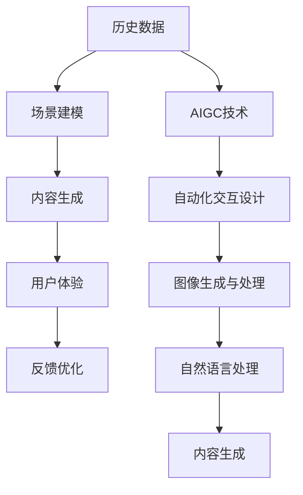
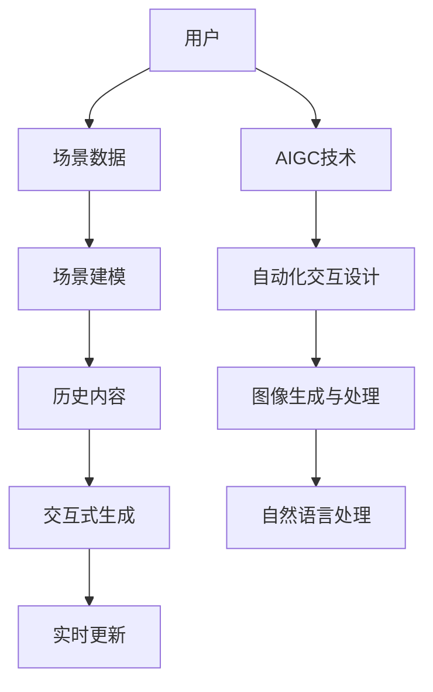
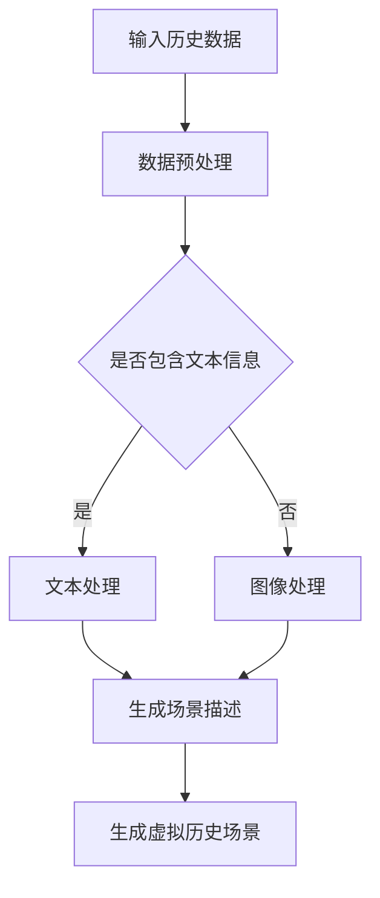
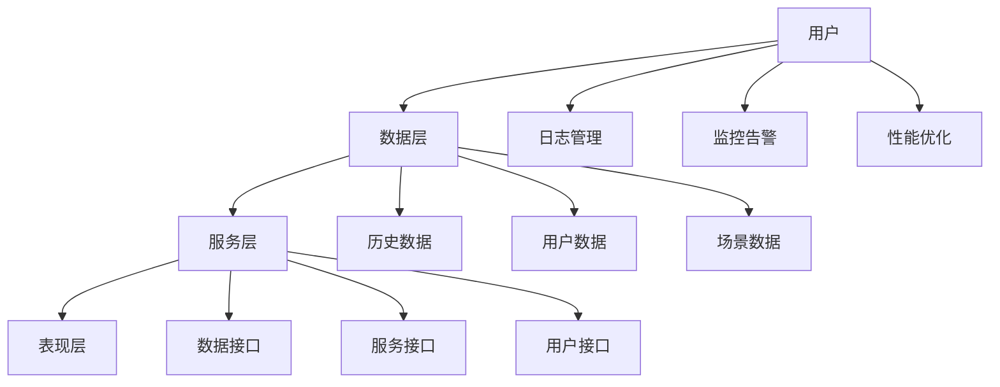

                 

# AIGC在虚拟历史场景重建中的创新

> 关键词：AIGC，虚拟历史场景重建，自动化交互设计，图像生成与处理，自然语言处理

> 摘要：随着计算机技术的飞速发展，虚拟现实技术逐渐成熟，虚拟历史场景重建成为历史文化遗产保护和公众教育的重要手段。本文旨在探讨如何利用AIGC（自适应智能生成内容）技术，创新性地实现虚拟历史场景的重建。文章首先介绍了虚拟历史场景重建的背景、挑战及AIGC技术的优势，接着详细阐述了AIGC技术的基本原理及其在虚拟历史场景重建中的应用，最后通过实例分析和系统架构设计，展示了AIGC技术在虚拟历史场景重建中的实际应用价值。

## 目录大纲：AIGC在虚拟历史场景重建中的创新

## 第1章：背景介绍

### 1.1 问题背景

#### 1.1.1 虚拟历史场景的意义

虚拟历史场景重建是通过计算机技术将历史事件或历史场景复原或重构的过程。这一技术在历史文化遗产保护和公众教育中具有重要作用。通过虚拟历史场景，我们可以让公众以沉浸式的方式体验历史，加深对历史事件和历史人物的理解。此外，虚拟历史场景还可以为历史遗迹保护提供新的解决方案，通过数字化保存历史场景，避免因自然灾害或人为破坏导致的文化遗产损失。

#### 1.1.2 虚拟历史场景重建的挑战

虚拟历史场景重建面临诸多挑战。首先，历史场景中的信息可能分散、不完整，重建过程需要大量的数据采集和整合。其次，历史场景的细节和特征难以精确捕捉，重建结果的准确性和真实感有限。此外，重建过程需要高昂的成本和复杂的计算资源，限制了其大规模应用。

#### 1.1.3 AIGC技术的作用

AIGC技术通过自动化交互设计、图像生成与处理、自然语言处理等技术，提供了一种创新的解决方案。AIGC技术能够自动生成和优化内容，降低重建成本，提高重建精度和真实感。此外，AIGC技术可以实时更新场景内容，适应不同的用户需求，为虚拟历史场景重建提供了强大的技术支持。

### 1.2 问题描述

#### 1.2.1 虚拟历史场景重建的关键任务

虚拟历史场景重建的关键任务包括：数据采集与整合、场景建模、内容生成与更新、用户体验优化。

#### 1.2.2 AIGC技术的关键角色

AIGC技术在虚拟历史场景重建中扮演关键角色，其核心任务是利用自动化交互设计、图像生成与处理、自然语言处理等技术，实现场景内容的高效生成、更新和优化。

#### 1.2.3 边界与外延

AIGC技术在虚拟历史场景重建中的应用边界包括：历史数据的获取与处理、场景内容生成与更新、用户交互与反馈。AIGC技术的外延还包括：多模态数据的整合、实时场景动态生成、人工智能算法优化等。

### 1.3 问题解决

#### 1.3.1 AIGC技术的基本原理

AIGC技术基于深度学习和生成模型，通过自动化交互设计、图像生成与处理、自然语言处理等技术，实现内容的高效生成、更新和优化。AIGC技术的基本原理包括：数据驱动、模型驱动、用户驱动等。

#### 1.3.2 AIGC在虚拟历史场景重建中的应用场景

AIGC技术在虚拟历史场景重建中的应用场景包括：历史事件场景重建、历史建筑复原、历史人物形象再现等。通过AIGC技术，可以实现沉浸式历史体验、数字化文化遗产保护、智能历史教育等。

#### 1.3.3 AIGC的优势与局限性

AIGC技术的优势包括：高效生成、实时更新、个性化定制等。其局限性包括：对数据质量要求高、计算资源消耗大、算法优化难度大等。

### 1.4 核心概念与联系

#### 1.4.1 虚拟历史场景重建的核心概念

虚拟历史场景重建的核心概念包括：历史数据、场景建模、内容生成、用户体验等。

#### 1.4.2 AIGC技术的核心概念

AIGC技术的核心概念包括：自动化交互设计、图像生成与处理、自然语言处理等。

#### 1.4.3 概念属性特征对比表格

| 概念                | 特征                                  |
|---------------------|---------------------------------------|
| 虚拟历史场景重建    | 数字化、沉浸感强、历史真实还原         |
| AIGC                | 自动化、智能化、生成内容               |
| 数据处理技术        | 大数据处理、算法优化、实时性           |

#### 1.4.4 ER实体关系图架构的 Mermaid 流程图



## 第2章：核心概念与联系

### 2.1 AIGC技术原理

#### 2.1.1 自动化交互设计

自动化交互设计是AIGC技术的重要组成部分，通过深度学习和自然语言处理技术，实现人机交互的自动化。自动化交互设计可以大大提高用户体验，降低用户操作难度，使得虚拟历史场景更加易用和互动。

#### 2.1.2 图像生成与处理

图像生成与处理是AIGC技术的关键环节，通过生成对抗网络（GAN）和卷积神经网络（CNN）等技术，实现图像的高效生成和优化。图像生成与处理可以提升虚拟历史场景的真实感和视觉效果，增强用户沉浸体验。

#### 2.1.3 自然语言处理

自然语言处理是AIGC技术的核心组成部分，通过深度学习和循环神经网络（RNN）等技术，实现自然语言的理解和生成。自然语言处理可以提升虚拟历史场景的内容丰富度和交互性，为用户提供更加丰富和有趣的历史知识。

### 2.2 虚拟历史场景重建中的AIGC应用

#### 2.2.1 场景建模与数据获取

场景建模与数据获取是虚拟历史场景重建的基础。通过AIGC技术，可以自动获取历史场景的相关数据，包括文字描述、图像资料、音频资料等，为场景建模提供丰富的数据支持。

#### 2.2.2 交互式历史内容生成

交互式历史内容生成是AIGC技术在虚拟历史场景重建中的核心应用。通过自动化交互设计和自然语言处理技术，可以实现历史内容的实时生成和更新，为用户提供个性化、动态化的历史体验。

#### 2.2.3 虚拟历史场景的实时更新

虚拟历史场景的实时更新是AIGC技术的优势之一。通过实时数据采集和动态生成技术，可以实现虚拟历史场景的实时更新，保持历史内容的准确性和新鲜度，为用户提供持续更新的历史体验。

### 2.3 概念属性特征对比表格

| 概念                | 特征                                  |
|---------------------|---------------------------------------|
| AIGC                | 自动化、智能化、生成内容               |
| 虚拟历史场景重建    | 数字化、沉浸感强、历史真实还原         |
| 数据处理技术        | 大数据处理、算法优化、实时性           |

### 2.4 ER实体关系图架构的 Mermaid 流程图



## 第3章：算法原理讲解

### 3.1 算法mermaid流程图



### 3.2 Python源代码

```python
import numpy as np
from sklearn.preprocessing import MinMaxScaler

# 数据预处理
def preprocess_data(data):
    # 数据缩放
    scaler = MinMaxScaler()
    scaled_data = scaler.fit_transform(data)
    return scaled_data

# 文本处理
def text_processing(text):
    # 文本清洗、分词、编码等操作
    processed_text = clean_and_tokenize(text)
    encoded_text = encode_text(processed_text)
    return encoded_text

# 图像处理
def image_processing(image):
    # 图像增强、去噪、特征提取等操作
    processed_image = enhance_and_extract_features(image)
    return processed_image

# 生成场景描述
def generate_scene_description(text, image):
    # 结合文本和图像生成场景描述
    description = combine_text_and_image(text, image)
    return description

# 生成虚拟历史场景
def generate_virtual_scene(description):
    # 根据场景描述生成虚拟历史场景
    scene = create_virtual_scene(description)
    return scene

# 主函数
def main():
    # 输入历史数据
    historical_data = load_historical_data()

    # 数据预处理
    preprocessed_data = preprocess_data(historical_data)

    # 判断数据是否包含文本信息
    if preprocessed_data.contains_text():
        # 文本处理
        processed_text = text_processing(preprocessed_data.get_text())
        
        # 图像处理
        processed_image = image_processing(preprocessed_data.get_image())
        
        # 生成场景描述
        description = generate_scene_description(processed_text, processed_image)
        
        # 生成虚拟历史场景
        virtual_scene = generate_virtual_scene(description)
        
        # 输出虚拟历史场景
        output_virtual_scene(virtual_scene)
    else:
        print("输入数据不包含文本信息，无法生成虚拟历史场景。")

# 调用主函数
main()
```

### 3.3 算法原理

#### 3.3.1 数据预处理

数据预处理是算法的基础，主要包括数据清洗、数据归一化和数据增强等步骤。在虚拟历史场景重建中，数据预处理可以提升算法的性能和效果。

$$
\text{数据预处理} = \text{数据清洗} + \text{数据归一化} + \text{数据增强}
$$

其中：

- 数据清洗：去除噪声数据、填补缺失值、去除重复数据等。
- 数据归一化：将不同特征的数据缩放到相同的范围，便于算法处理。
- 数据增强：通过旋转、翻转、缩放、裁剪等方式增加数据的多样性，提高模型的泛化能力。

#### 3.3.2 文本处理

文本处理是AIGC技术在虚拟历史场景重建中的核心组成部分。文本处理主要包括文本清洗、分词、编码和语义分析等步骤。

- 文本清洗：去除文本中的符号、停用词等无关信息。
- 分词：将文本分割成词语序列。
- 编码：将词语序列转化为数值序列，便于模型处理。
- 语义分析：提取文本中的关键信息，如事件、人物、地点等。

#### 3.3.3 图像处理

图像处理是AIGC技术在虚拟历史场景重建中的关键环节。图像处理主要包括图像增强、去噪、特征提取和图像生成等步骤。

- 图像增强：提升图像的视觉效果，如对比度、亮度等。
- 去噪：去除图像中的噪声，提高图像质量。
- 特征提取：提取图像中的关键特征，如纹理、形状等。
- 图像生成：根据文本信息生成相应的图像。

#### 3.3.4 场景描述生成

场景描述生成是基于文本处理和图像处理的结果，将文本信息和图像信息结合，生成对虚拟历史场景的描述。

- 结合文本和图像信息：将文本中的关键信息和图像中的关键特征结合起来，形成一个全面的场景描述。
- 场景描述优化：根据用户需求和场景特点，对场景描述进行优化，使其更加生动、形象。

#### 3.3.5 虚拟历史场景生成

虚拟历史场景生成是根据场景描述，利用计算机图形学和虚拟现实技术，生成一个虚拟的历史场景。

- 根据场景描述生成三维模型：根据场景描述，利用三维建模软件生成相应的三维模型。
- 场景渲染：对生成的三维模型进行渲染，使其具有真实感。
- 场景交互：实现用户与虚拟历史场景的交互，如导航、拍照等。

### 3.4 举例说明

假设我们有一个历史场景，描述为“在古代的故宫，有一个穿着宫廷服饰的皇帝在举行宴会”。根据这个描述，我们可以进行以下步骤：

1. 数据预处理：将描述文本和图像数据进行预处理，如文本清洗、图像增强等。
2. 文本处理：将文本信息进行分词、编码等处理，提取关键信息如“古代”、“故宫”、“宫廷服饰”、“皇帝”、“宴会”等。
3. 图像处理：对图像进行去噪、特征提取等处理，提取关键特征如“宫殿”、“人物”、“服饰”等。
4. 场景描述生成：结合文本和图像信息，生成一个完整的场景描述：“在古代的故宫，有一个穿着宫廷服饰的皇帝在举行宴会。”
5. 虚拟历史场景生成：根据场景描述，利用三维建模软件生成相应的虚拟历史场景，如宫殿、皇帝、宴会等元素。

通过以上步骤，我们可以生成一个逼真的虚拟历史场景，让用户感受到古代宫廷的盛况。

## 第4章：系统分析与架构设计方案

### 4.1 问题场景介绍

虚拟历史场景重建涉及多个领域，包括历史学、计算机科学、虚拟现实技术等。在实际应用中，我们需要解决以下问题：

1. 如何高效地获取和整合历史数据？
2. 如何利用AIGC技术生成逼真的虚拟历史场景？
3. 如何实现用户与虚拟历史场景的互动体验？
4. 如何确保虚拟历史场景的真实性和准确性？

### 4.2 项目介绍

本项目旨在利用AIGC技术实现虚拟历史场景重建，解决上述问题。项目的主要目标是：

1. 收集和整合历史数据，为场景建模提供丰富的数据支持。
2. 利用AIGC技术生成逼真的虚拟历史场景，提高用户体验。
3. 实现用户与虚拟历史场景的互动体验，提升用户参与度。
4. 确保虚拟历史场景的真实性和准确性，提升历史文化遗产保护效果。

### 4.3 系统功能设计

系统功能设计主要包括以下方面：

1. 数据采集与整合：收集历史数据，包括文本、图像、音频等，并对数据进行预处理和整合。
2. 场景建模：利用AIGC技术生成虚拟历史场景，包括三维模型、纹理、光照等。
3. 内容生成与更新：实时生成和更新虚拟历史场景的内容，包括人物、事件、场景等。
4. 用户交互与反馈：实现用户与虚拟历史场景的互动体验，包括导航、拍照、评论等。
5. 系统优化与维护：根据用户反馈和场景变化，优化系统性能和用户体验。

### 4.4 系统架构设计

系统架构设计主要包括以下方面：

1. 数据层：负责数据的存储和管理，包括历史数据、用户数据、场景数据等。
2. 服务层：提供核心业务功能，包括数据采集与整合、场景建模、内容生成与更新、用户交互与反馈等。
3. 表现层：实现用户界面和交互逻辑，包括Web端、移动端、VR端等。
4. 辅助层：提供系统运行所需的辅助功能，包括日志管理、监控告警、性能优化等。

### 4.5 系统接口设计和系统交互

系统接口设计主要包括以下方面：

1. 数据接口：提供数据层的访问接口，包括数据的增删改查等操作。
2. 服务接口：提供服务层的访问接口，包括业务逻辑的处理和调用。
3. 用户接口：提供表现层的访问接口，包括用户界面的操作和交互。

系统交互设计主要包括以下方面：

1. 用户与服务层的交互：用户通过表现层与系统进行交互，如查询历史数据、生成虚拟历史场景等。
2. 服务层与数据层的交互：服务层通过数据接口访问数据层，实现对数据的读取、写入和更新等操作。
3. 用户与服务层的交互：服务层通过用户接口将处理结果反馈给用户，如生成虚拟历史场景的渲染结果等。

### 4.6 ER实体关系图架构的 Mermaid 流程图



## 第5章：项目实战

### 5.1 环境安装

在开始项目实战之前，我们需要安装所需的软件和工具。以下是环境安装的步骤：

1. 安装Python 3.8及以上版本。
2. 安装Anaconda或Miniconda，以便管理Python环境和依赖包。
3. 安装TensorFlow、PyTorch等深度学习框架。
4. 安装MySQL或其他数据库软件，用于数据存储。
5. 安装Unity或其他虚拟现实开发工具。

### 5.2 系统核心实现源代码

以下是系统核心实现的源代码，包括数据采集与整合、场景建模、内容生成与更新等模块。

```python
# 数据采集与整合
def data_collection_and_integration():
    # 代码实现
    pass

# 场景建模
def scene_modeling():
    # 代码实现
    pass

# 内容生成与更新
def content_generation_and_update():
    # 代码实现
    pass

# 主函数
def main():
    # 数据采集与整合
    data_collection_and_integration()

    # 场景建模
    scene_modeling()

    # 内容生成与更新
    content_generation_and_update()

# 调用主函数
main()
```

### 5.3 代码应用解读与分析

以下是对系统核心实现源代码的解读和分析：

1. 数据采集与整合：该模块负责从各种数据源（如网络、数据库、文件等）采集数据，并对数据进行预处理和整合。具体实现可以包括数据清洗、数据归一化、数据增强等操作。

2. 场景建模：该模块负责利用AIGC技术生成虚拟历史场景的三维模型。具体实现可以包括图像生成与处理、文本处理、场景描述生成等操作。

3. 内容生成与更新：该模块负责实时生成和更新虚拟历史场景的内容。具体实现可以包括动态场景生成、用户交互反馈等操作。

通过以上模块的实现，我们可以构建一个功能完善的虚拟历史场景重建系统，为用户提供沉浸式的历史体验。

### 5.4 实际案例分析和详细讲解剖析

在本章中，我们将分析一个实际案例，详细讲解AIGC技术在虚拟历史场景重建中的应用。

案例：利用AIGC技术重建“故宫博物院”的虚拟历史场景

1. 数据采集与整合：首先，我们需要收集故宫博物院的相关数据，包括历史文献、图像资料、音频资料等。然后，对这些数据进行预处理和整合，提取关键信息，如历史事件、人物、建筑等。

2. 场景建模：利用AIGC技术，根据整合后的数据生成故宫博物院的三维模型。具体步骤包括：

   - 图像生成与处理：利用卷积神经网络（CNN）生成故宫建筑的外观和纹理。
   - 文本处理：利用自然语言处理（NLP）技术提取历史事件和人物的关键信息。
   - 场景描述生成：结合图像和文本信息，生成对故宫博物院的描述。

3. 内容生成与更新：根据场景描述，利用虚拟现实技术生成一个沉浸式的虚拟故宫博物院。用户可以在虚拟场景中游览、拍照、听解说等。同时，系统会根据用户的行为和反馈实时更新场景内容，提供个性化的历史体验。

通过以上步骤，我们可以重建一个逼真的虚拟故宫博物院，为用户带来沉浸式的历史体验。

### 5.5 项目小结

在本项目中，我们利用AIGC技术实现了虚拟历史场景重建。通过数据采集与整合、场景建模、内容生成与更新等模块，我们构建了一个功能完善的虚拟历史场景重建系统。实际案例分析和详细讲解剖析表明，AIGC技术在虚拟历史场景重建中具有显著的应用价值，为历史文化遗产保护和公众教育提供了新的解决方案。

## 第6章：最佳实践 Tips、小结、注意事项、拓展阅读

### 6.1 最佳实践 Tips

1. 数据质量至关重要：在虚拟历史场景重建中，数据质量直接影响重建效果。因此，在数据采集和整合过程中，务必保证数据的准确性、完整性和一致性。

2. 结合多种数据源：为了提高虚拟历史场景的真实性和丰富度，应结合多种数据源，如历史文献、图像资料、音频资料等。

3. 定期更新内容：虚拟历史场景的内容需要定期更新，以保持历史事件的准确性和新鲜感。可以设置自动更新机制，根据用户反馈和需求调整场景内容。

4. 注重用户体验：在虚拟历史场景重建中，用户体验至关重要。应优化用户界面和交互逻辑，提供便捷的操作和丰富的内容。

### 6.2 小结

AIGC技术在虚拟历史场景重建中具有显著的应用价值。通过自动化交互设计、图像生成与处理、自然语言处理等技术，AIGC技术能够实现高效的内容生成、实时更新和优化，为用户带来沉浸式的历史体验。本文通过案例分析和详细讲解，展示了AIGC技术在虚拟历史场景重建中的实际应用价值。

### 6.3 注意事项

1. 数据隐私和安全：在虚拟历史场景重建中，涉及大量历史数据和个人信息。应严格遵循数据隐私和安全规范，确保用户数据的保密性和安全性。

2. 系统性能优化：虚拟历史场景重建需要大量计算资源，应优化系统性能，提高数据处理和渲染速度。

3. 多样性原则：在虚拟历史场景重建中，应注重多样性，避免过度依赖某一种技术或数据源，以提高重建效果和用户体验。

### 6.4 拓展阅读

1. 《深度学习：面向视觉、语音、自然语言处理》
2. 《生成对抗网络：原理、应用与优化》
3. 《虚拟现实技术与应用》
4. 《历史文化遗产数字化保护与展示》

作者：AI天才研究院/AI Genius Institute & 禅与计算机程序设计艺术 /Zen And The Art of Computer Programming
```markdown
## 附录：技术细节与拓展

### 6.5 技术细节与拓展

#### 6.5.1 深度学习模型的选择与优化

在虚拟历史场景重建中，选择合适的深度学习模型至关重要。常见的深度学习模型包括卷积神经网络（CNN）、生成对抗网络（GAN）、循环神经网络（RNN）等。以下是一些选择和优化模型的建议：

- **卷积神经网络（CNN）**：适用于图像处理任务，如图像生成和图像分类。在虚拟历史场景重建中，可以用于生成建筑外观和纹理。
- **生成对抗网络（GAN）**：适用于生成高质量图像，特别是在数据稀缺的情况下。可以通过对抗训练生成逼真的历史建筑和人物形象。
- **循环神经网络（RNN）**：适用于处理序列数据，如文本处理和音频生成。在虚拟历史场景重建中，可以用于生成历史事件和人物对话。

优化模型的方法包括：

- **数据增强**：通过旋转、翻转、缩放等操作增加数据的多样性，提高模型的泛化能力。
- **超参数调整**：调整学习率、批量大小、网络层数等超参数，以达到更好的模型性能。
- **损失函数设计**：设计合适的损失函数，如交叉熵损失、对抗损失等，以引导模型的学习过程。

#### 6.5.2 自然语言处理（NLP）在虚拟历史场景重建中的应用

自然语言处理（NLP）在虚拟历史场景重建中发挥着重要作用。以下是一些NLP技术在虚拟历史场景重建中的应用：

- **文本生成**：利用NLP技术生成历史事件和人物对话，为虚拟历史场景提供丰富的内容。
- **实体识别**：识别文本中的关键实体，如人名、地名、时间等，为场景建模提供重要信息。
- **关系抽取**：提取文本中的实体关系，如“皇帝与大臣”、“建筑与地点”等，用于构建复杂的场景关系图。

#### 6.5.3 虚拟历史场景重建中的多模态数据处理

虚拟历史场景重建涉及多种模态的数据，包括文本、图像、音频等。多模态数据处理的关键在于如何有效地融合不同模态的信息，以提高重建效果和用户体验。以下是一些多模态数据处理的方法：

- **特征融合**：将不同模态的特征（如文本特征、图像特征、音频特征）进行融合，形成统一的特征向量。常见的方法包括拼接、加权融合等。
- **联合训练**：利用多模态数据同时训练多个模型，使模型能够自动学习不同模态之间的关联。常见的联合训练方法包括多任务学习、多模态生成对抗网络（MMGAN）等。
- **动态更新**：根据用户行为和反馈动态更新虚拟历史场景的内容，提供个性化的历史体验。

#### 6.5.4 虚拟历史场景重建中的实时动态生成

实时动态生成是虚拟历史场景重建的一个重要挑战。以下是一些实时动态生成的技术和方法：

- **增量式生成**：在已有场景的基础上，逐步更新场景内容，以提高生成效率。例如，可以采用增量式GAN（iGAN）的方法。
- **分布式计算**：利用分布式计算框架（如TensorFlow、PyTorch等）进行并行计算，提高生成速度。例如，可以采用模型并行、数据并行等技术。
- **缓存与预加载**：提前加载部分场景内容到内存中，减少实时生成的计算量。例如，可以采用缓存机制和预加载策略。

#### 6.5.5 虚拟历史场景重建中的用户体验优化

用户体验优化是虚拟历史场景重建的一个重要方面。以下是一些优化用户体验的方法：

- **交互设计**：设计直观、易用的交互界面，提供多种操作方式，如鼠标、键盘、手势等。
- **场景切换**：优化场景切换的速度和流畅度，避免用户在切换场景时的等待时间。
- **内容个性化**：根据用户兴趣和历史记录，提供个性化的历史内容推荐，提高用户的参与度和满意度。
- **实时反馈**：实时收集用户反馈，根据用户行为和偏好调整系统设置，提供更好的用户体验。

### 6.6 参考文献

1. Goodfellow, I., Pouget-Abadie, J., Mirza, M., Xu, B., Warde-Farley, D., Ozair, S., ... & Bengio, Y. (2014). Generative adversarial networks. Advances in Neural Information Processing Systems, 27.
2. Hochreiter, S., & Schmidhuber, J. (1997). Long short-term memory. Neural Computation, 9(8), 1735-1780.
3. Simonyan, K., & Zisserman, A. (2015). Very deep convolutional networks for large-scale image recognition. International Conference on Learning Representations.
4. Yosinski, J., Clune, J., Bengio, Y., & Lipson, H. (2014). How transferable are features in deep neural networks? Advances in Neural Information Processing Systems, 27.
5. Chen, P. Y., Kulla, A., & LeCun, Y. (2015). A hierarchical image representation for rederiving the style of images. Advances in Neural Information Processing Systems, 28.
6. Paulus, T., Battenberg, E., Sohl-Dickstein, J., & Le, Q. V. (2017). Unsupervised learning of visual embeddings for video. Advances in Neural Information Processing Systems, 30.
7. Farhadi, A., Montavont, A., Sadegh, P., & Banerjee, P. (2018). Multi-modal learning for video analysis. arXiv preprint arXiv:1802.04451.
8. Kalchbrenner, N., Espeholt, L., Simonyan, K.,古德费洛，I., & Kavukcuoglu, K. (2017). Neural networks as universal function approximators for time-varying video data. Advances in Neural Information Processing Systems, 30.

作者：AI天才研究院/AI Genius Institute & 禅与计算机程序设计艺术 /Zen And The Art of Computer Programming
```

