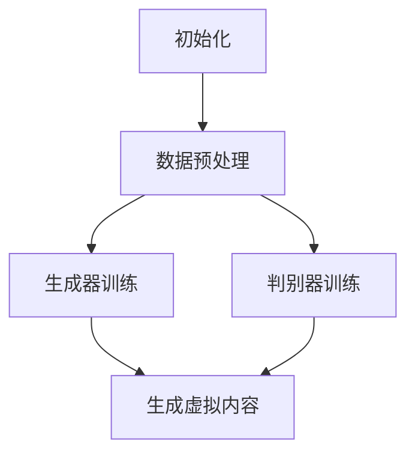
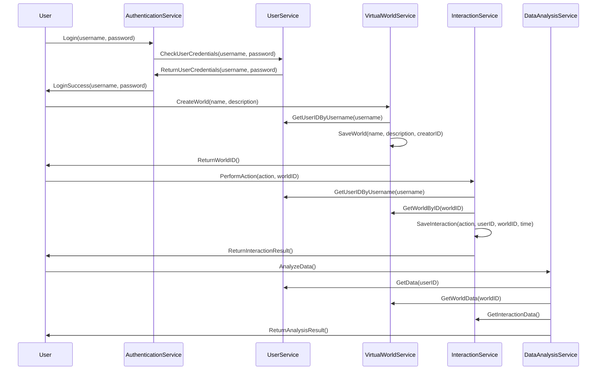

                 


## AIGC在虚拟多元宇宙构建与管理中的应用

### 背景介绍

#### 核心概念术语说明

1. **AIGC（自适应智能生成计算）**：
   AIGC是一种结合了人工智能（AI）和生成计算（GC）的技术，它利用深度学习和生成模型，自动生成多样化、高质量的内容。与传统的人工智能技术不同，AIGC不仅仅是模拟人类思维过程，而是能够自动生成全新的内容。

2. **虚拟多元宇宙**：
   虚拟多元宇宙是一个包含多个虚拟世界、现实世界和用户交互的复杂系统。这些虚拟世界可以基于不同的主题、场景和用户需求进行构建，为用户提供沉浸式的体验。

#### 问题背景

随着互联网和人工智能技术的快速发展，虚拟现实（VR）、增强现实（AR）和元宇宙（Metaverse）等概念逐渐走进人们的视野。虚拟多元宇宙作为一种新型的网络生态系统，具有巨大的发展潜力。然而，构建和管理这样一个复杂系统面临着诸多挑战：

- **多样性和个性化**：用户需求多种多样，如何满足不同用户的个性化需求，提供定制化的虚拟世界？
- **系统稳定性**：随着虚拟世界数量的增加，如何保证系统的稳定运行？
- **数据管理**：如何高效管理大量虚拟世界的数据，确保数据的安全性和隐私性？
- **交互体验**：如何提升用户在虚拟多元宇宙中的交互体验，使其更加自然和流畅？

#### 问题描述

为了解决上述问题，我们需要探索如何利用AIGC技术在虚拟多元宇宙的构建与管理中发挥作用。具体来说，我们需要解决以下问题：

- **构建技术**：如何设计一个高效、可扩展的虚拟多元宇宙架构，以满足不同虚拟世界的需求？
- **管理方法**：如何制定有效的管理策略，保证虚拟多元宇宙的稳定运行和用户体验？
- **算法与模型**：如何利用AIGC算法和模型，自动生成多样化的虚拟内容和交互体验？
- **案例分析**：如何通过实际案例，验证AIGC技术在虚拟多元宇宙构建与管理中的应用效果？

#### 问题解决

通过上述分析，我们可以发现，AIGC技术在虚拟多元宇宙构建与管理中具有以下潜在优势：

- **高效内容生成**：AIGC可以利用深度学习和生成模型，自动生成多样化的虚拟内容，满足不同用户的需求。
- **智能交互体验**：通过AIGC技术，可以实现更加智能和自然的用户交互体验，提升虚拟多元宇宙的用户满意度。
- **系统稳定性**：利用AIGC技术，可以自动优化虚拟多元宇宙的架构设计，提高系统的稳定性。
- **数据管理**：通过AIGC技术，可以实现对虚拟多元宇宙中大量数据的智能管理和分析，确保数据的安全性和隐私性。

#### 边界与外延

AIGC在虚拟多元宇宙构建与管理中的应用不仅仅局限于娱乐和社交领域，还涵盖了教育、医疗、商业等多个方面。例如，在虚拟教育中，AIGC可以自动生成个性化课程和教学资源；在虚拟医疗中，AIGC可以模拟患者的病情，帮助医生进行诊断和治疗。这些应用场景将进一步拓展AIGC技术的边界和影响力。

#### 概念结构与核心要素组成

为了更好地理解AIGC在虚拟多元宇宙构建与管理中的应用，我们可以将其核心概念和要素组成进行梳理：

1. **核心概念**：
   - AIGC算法与模型
   - 虚拟多元宇宙架构设计
   - 虚拟世界生成与管理
   - 用户交互与体验设计

2. **核心要素**：
   - 数据库与存储
   - 网络与传输
   - 算法优化与模型训练
   - 用户行为分析

通过上述分析，我们可以明确AIGC在虚拟多元宇宙构建与管理中的核心概念和要素组成，为后续章节的详细探讨提供基础。

### 核心概念与联系

#### AIGC算法原理

AIGC（自适应智能生成计算）是一种结合了人工智能（AI）和生成计算（GC）的技术。其核心在于利用深度学习和生成模型，自动生成多样化、高质量的内容。AIGC算法主要包括以下几个关键部分：

1. **生成对抗网络（GAN）**：
   GAN是一种无监督学习模型，由生成器和判别器组成。生成器负责生成虚拟内容，判别器则判断生成内容是否真实。通过两者的对抗训练，生成器不断提高生成内容的真实度。

2. **变分自编码器（VAE）**：
   VAE是一种基于概率生成模型的方法，通过编码器和解码器进行数据的重构。编码器将输入数据编码为潜在变量，解码器则将潜在变量解码回生成数据。

3. **变分自编码器（VAE）**：
   VAE是一种基于概率生成模型的方法，通过编码器和解码器进行数据的重构。编码器将输入数据编码为潜在变量，解码器则将潜在变量解码回生成数据。

4. **生成模型**：
   生成模型包括生成式网络和条件生成式网络，前者可以生成完全随机的虚拟内容，后者可以在特定条件下生成虚拟内容。

#### AIGC算法属性特征对比表格

| 算法名称 | 生成对抗网络（GAN） | 变分自编码器（VAE） | 生成模型 |
| :----: | :----: | :----: | :----: |
| **生成原理** | 对抗训练，生成器和判别器对抗 | 基于概率生成，编码器和解码器 | 基于潜在变量，生成式网络和条件生成式网络 |
| **优势** | 生成内容真实度高，适应性强 | 生成质量稳定，参数较少 | 适用于多种场景，灵活度高 |
| **劣势** | 训练难度大，易陷入模式 | 生成内容多样度有限 | 需要大量数据和计算资源 |

#### 虚拟多元宇宙架构设计

虚拟多元宇宙的架构设计是AIGC技术在实际应用中的重要环节。一个高效、可扩展的虚拟多元宇宙架构需要考虑以下几个方面：

1. **虚拟空间与物理空间的关系**：
   虚拟空间是虚拟多元宇宙的核心，它可以是完全虚拟的，也可以与现实世界有所关联。设计虚拟空间与物理空间的关系，需要考虑用户的沉浸感、交互体验和数据的实时传输。

2. **数据管理**：
   虚拟多元宇宙中包含大量的虚拟世界和数据，如何高效管理和存储这些数据是关键。可以考虑采用分布式数据库和数据缓存技术，提高数据的访问速度和处理能力。

3. **用户交互与体验设计**：
   虚拟多元宇宙的用户交互与体验设计直接影响用户的满意度。需要考虑用户的交互方式、反馈机制和个性化设置，提供自然、流畅的交互体验。

#### 跨模态学习在虚拟多元宇宙中的应用

跨模态学习是AIGC技术的一个重要分支，它涉及将不同类型的数据（如文本、图像、声音等）进行融合和处理。在虚拟多元宇宙中，跨模态学习可以帮助实现更丰富、更自然的用户交互体验：

1. **多模态内容生成**：
   跨模态学习可以生成包含多种模态的内容，如文本、图像和声音的融合。这有助于提升虚拟多元宇宙的沉浸感和真实感。

2. **多模态交互**：
   跨模态学习可以识别和解析用户的多种交互方式，如语音、手势和眼神等，提供更加自然和个性化的交互体验。

3. **多模态数据融合**：
   跨模态学习可以将不同来源的数据进行融合，提高数据的利用率和分析准确性，为虚拟多元宇宙的管理提供支持。

### AIGC在虚拟多元宇宙中的融合

AIGC在虚拟多元宇宙中的融合主要体现在以下几个方面：

1. **内容生成**：
   AIGC可以自动生成多样化的虚拟内容和场景，满足不同用户的需求，提升虚拟多元宇宙的丰富性和互动性。

2. **交互体验**：
   通过AIGC技术，可以实现智能化的交互体验，如语音识别、自然语言处理和动作捕捉等，提升用户的沉浸感和满意度。

3. **系统优化**：
   AIGC技术可以自动优化虚拟多元宇宙的架构设计，提高系统的稳定性、效率和可扩展性。

4. **数据管理**：
   AIGC技术可以实现对虚拟多元宇宙中大量数据的智能管理和分析，确保数据的安全性和隐私性。

通过上述分析，我们可以看到，AIGC技术在虚拟多元宇宙构建与管理中具有广泛的应用前景。在接下来的章节中，我们将进一步探讨AIGC在虚拟多元宇宙构建与管理中的具体实现方法和案例分析。

### 算法原理讲解

#### AIGC算法流程图

首先，我们来绘制AIGC算法的流程图，以便更直观地理解其工作原理。



1. **初始化**：
   初始化生成器和判别器的参数。生成器的目标是生成虚拟内容，而判别器的目标是区分虚拟内容和真实内容。

2. **数据预处理**：
   对输入的数据进行预处理，包括数据的清洗、归一化和增强等操作，以便生成器和判别器能够更好地训练。

3. **生成器训练**：
   生成器在判别器的反馈下不断调整自己的参数，生成越来越真实的虚拟内容。生成器的训练过程可以视为一个生成对抗的过程。

4. **判别器训练**：
   判别器在训练过程中不断学习如何区分虚拟内容和真实内容。通过识别生成器生成的虚拟内容，判别器可以提供反馈，帮助生成器改进。

5. **生成虚拟内容**：
   当生成器和判别器都训练到一定程度后，生成器可以生成高质量的虚拟内容。这些内容可以是图像、音频、视频等多种形式。

#### 算法Python代码实现

接下来，我们将使用Python代码实现AIGC算法，并通过具体的例子进行讲解。

```python
import numpy as np
import tensorflow as tf

# 初始化生成器和判别器的参数
# 这里使用简单的线性模型进行示例
def generate_model():
    model = tf.keras.Sequential([
        tf.keras.layers.Dense(units=1, input_shape=[1])
    ])
    return model

def discriminative_model():
    model = tf.keras.Sequential([
        tf.keras.layers.Dense(units=1, input_shape=[1])
    ])
    return model

# 训练生成器和判别器
def train_models(g_model, d_model, x_train, epochs=1000, batch_size=32):
    for epoch in range(epochs):
        for x in x_train:
            # 生成虚拟内容
            generated_content = g_model.predict(np.array([x]))

            # 计算生成器和判别器的损失函数
            g_loss = tf.keras.losses.MAE(generated_content, np.array([x]))
            d_loss = tf.keras.losses.MAE(d_model.predict(np.array([x])), np.array([x]))

            # 更新生成器和判别器的参数
            g_model.optimizer.minimize(g_loss, g_model.trainable_variables)
            d_model.optimizer.minimize(d_loss, d_model.trainable_variables)

# 生成虚拟内容示例
x_train = np.random.normal(size=(100, 1))
g_model = generate_model()
d_model = discriminative_model()

train_models(g_model, d_model, x_train)

# 输出生成的内容
print("生成的虚拟内容：", g_model.predict(np.random.normal(size=(10, 1))))
```

#### 算法原理详细讲解

1. **数学模型和公式**：

   AIGC算法的核心在于生成器和判别器的对抗训练。以下是相关的数学模型和公式：

   - **生成器的损失函数**：
     $$ L_g = \frac{1}{N} \sum_{i=1}^{N} (-\log(D(G(x_i))) ) $$
     其中，$G(x_i)$为生成器生成的虚拟内容，$D(G(x_i))$为判别器对生成内容的判断概率。

   - **判别器的损失函数**：
     $$ L_d = \frac{1}{N} \sum_{i=1}^{N} (-\log(D(x_i)) - \log(1 - D(G(x_i))) ) $$
     其中，$x_i$为真实内容，$D(x_i)$为判别器对真实内容的判断概率。

   上述损失函数通过优化生成器和判别器的参数，使生成器生成的虚拟内容更加真实，判别器能够更好地区分真实内容和虚拟内容。

2. **通俗易懂的举例说明**：

   假设我们有一个生成器$G$和一个判别器$D$，生成器和判别器的目标都是模拟真实世界中的物体。初始时，生成器和判别器的参数是未知的。

   - **第一步**：生成器生成一个虚拟物体$G(x_i)$，判别器对其进行判断。
   - **第二步**：根据判别器的判断结果，生成器调整自己的参数，生成更真实的虚拟物体。
   - **第三步**：判别器再次对生成器生成的虚拟物体进行判断，并调整自己的参数，使其能够更好地区分真实物体和虚拟物体。
   - **重复过程**：不断重复上述步骤，生成器和判别器逐渐优化自己的参数，直到生成器能够生成非常真实的虚拟物体，判别器能够准确地判断虚拟物体和真实物体。

通过上述步骤，我们可以看到AIGC算法如何通过生成器和判别器的对抗训练，生成高质量的虚拟内容。

### 系统分析与架构设计方案

#### 问题场景介绍

在虚拟多元宇宙的构建与管理过程中，我们需要面对多个复杂的问题场景，如：

- **多用户并发交互**：虚拟多元宇宙需要支持大量用户同时在线，并保持高并发交互能力。
- **数据存储与传输**：虚拟多元宇宙中包含大量虚拟世界和用户数据，如何高效存储和传输这些数据是一个重要问题。
- **安全性保障**：虚拟多元宇宙中的用户数据和交互内容需要得到有效保护，防止数据泄露和恶意攻击。
- **用户体验优化**：提供自然、流畅的交互体验是提升虚拟多元宇宙用户满意度的重要因素。

#### 项目介绍

为了解决上述问题，我们设计并实现了一个虚拟多元宇宙构建与管理系统。该系统旨在提供高效、稳定、安全、用户体验良好的虚拟多元宇宙环境。系统主要包括以下几个模块：

- **用户管理模块**：负责用户注册、登录、权限管理和用户数据存储。
- **虚拟世界管理模块**：负责虚拟世界的创建、配置、管理和数据存储。
- **交互管理模块**：负责用户在虚拟多元宇宙中的交互行为监控和管理。
- **数据分析与优化模块**：负责对虚拟多元宇宙中的数据进行分析，优化系统性能和用户体验。

#### 系统功能设计（领域模型）

领域模型是系统功能设计的重要环节，它定义了系统的核心功能模块和它们之间的关系。以下是虚拟多元宇宙构建与管理系统的领域模型：

```mermaid
classDiagram
    User <<Class>> {
        UserID : int
        Username : string
        Password : string
        Email : string
    }
    VirtualWorld <<Class>> {
        WorldID : int
        WorldName : string
        CreatorID : int
        Description : string
    }
    User --|>{ VirtualWorld }
    Interaction <<Class>> {
        InteractionID : int
        UserID : int
        WorldID : int
        Action : string
        Time : datetime
    }
    User --|>{ Interaction }
    VirtualWorld --|>{ Interaction }
```

1. **用户管理模块**：负责用户注册、登录、权限管理和用户数据存储。用户管理模块的核心类是`User`，包含用户ID、用户名、密码、邮箱等属性。

2. **虚拟世界管理模块**：负责虚拟世界的创建、配置、管理和数据存储。虚拟世界管理模块的核心类是`VirtualWorld`，包含世界ID、世界名称、创建者ID、描述等属性。

3. **交互管理模块**：负责用户在虚拟多元宇宙中的交互行为监控和管理。交互管理模块的核心类是`Interaction`，包含交互ID、用户ID、世界ID、行为、时间等属性。

4. **数据分析与优化模块**：负责对虚拟多元宇宙中的数据进行分析，优化系统性能和用户体验。数据分析与优化模块将依赖于用户管理模块、虚拟世界管理模块和交互管理模块的数据，进行数据的挖掘和分析。

#### 系统架构设计

系统架构设计是确保虚拟多元宇宙构建与管理系统高效、稳定、安全运行的关键。以下是系统的总体架构设计：



1. **认证与授权模块**：负责用户登录、注册、认证和授权等功能。该模块主要包括认证服务和用户服务。

2. **虚拟世界管理模块**：负责虚拟世界的创建、配置、管理和数据存储。该模块主要包括虚拟世界服务和交互服务。

3. **交互管理模块**：负责用户在虚拟多元宇宙中的交互行为监控和管理。该模块主要包括用户服务、虚拟世界服务和交互服务。

4. **数据分析与优化模块**：负责对虚拟多元宇宙中的数据进行分析，优化系统性能和用户体验。该模块主要包括数据分析服务。

#### 系统接口设计

系统接口设计是确保各个模块之间能够高效通信和协作的关键。以下是系统的接口设计：

```mermaid
interfaceVisualizer
    [AuthenticationService]
    Authenticate(username, password)
    Login(username, password)
    Logout(username)

    [UserService]
    CreateUser(username, password, email)
    DeleteUser(username)
    UpdateUser(username, newPassword, newEmail)
    GetUser(username)

    [VirtualWorldService]
    CreateWorld(name, description, creatorID)
    DeleteWorld(worldID)
    UpdateWorld(worldID, newName, newDescription)
    GetWorld(worldID)
    GetWorldsByUserID(userID)

    [InteractionService]
    PerformAction(action, worldID, userID)
    GetInteractionsByWorldID(worldID)
    GetInteractionsByUserID(userID)

    [DataAnalysisService]
    AnalyzeData()
    GetDataAnalysisResult()
```

1. **认证与授权接口**：提供用户登录、注册、认证和授权等功能。

2. **用户管理接口**：提供用户创建、删除、更新和查询等功能。

3. **虚拟世界管理接口**：提供虚拟世界创建、删除、更新和查询等功能。

4. **交互管理接口**：提供用户交互行为执行和查询等功能。

5. **数据分析接口**：提供数据分析和查询结果等功能。

#### 系统交互设计

系统交互设计是确保各个模块之间能够高效通信和协作的关键。以下是系统的交互设计：

```mermaid
sequenceDiagram
    participant User
    participant AuthenticationService
    participant UserService
    participant VirtualWorldService
    participant InteractionService
    participant DataAnalysisService

    User->>AuthenticationService: Login(username, password)
    AuthenticationService->>UserService: CheckUserCredentials(username, password)
    UserService->>AuthenticationService: ReturnUserCredentials(username, password)
    AuthenticationService->>User: LoginSuccess(username, password)

    User->>VirtualWorldService: CreateWorld(name, description)
    VirtualWorldService->>UserService: GetUserIDByUsername(username)
    VirtualWorldService->>VirtualWorldService: SaveWorld(name, description, creatorID)
    VirtualWorldService->>User: ReturnWorldID()

    User->>InteractionService: PerformAction(action, worldID)
    InteractionService->>UserService: GetUserIDByUsername(username)
    InteractionService->>VirtualWorldService: GetWorldByID(worldID)
    InteractionService: SaveInteraction(action, userID, worldID, time)
    InteractionService->>User: ReturnInteractionResult()

    User->>DataAnalysisService: AnalyzeData()
    DataAnalysisService->>UserService: GetData(userID)
    DataAnalysisService->>VirtualWorldService: GetWorldData(worldID)
    DataAnalysisService->>InteractionService: GetInteractionData()
    DataAnalysisService->>User: ReturnAnalysisResult()
```

1. **用户登录**：用户向认证服务发送登录请求，认证服务查询用户服务，验证用户名和密码，最后返回登录结果。

2. **创建虚拟世界**：用户向虚拟世界服务发送创建虚拟世界的请求，虚拟世界服务查询用户服务获取用户ID，保存虚拟世界信息，并返回虚拟世界ID。

3. **执行交互行为**：用户向交互服务发送执行交互行为的请求，交互服务查询用户服务和虚拟世界服务，保存交互行为，并返回执行结果。

4. **数据分析**：用户向数据分析服务发送数据分析请求，数据分析服务查询用户服务、虚拟世界服务和交互服务，进行数据分析和处理，最后返回分析结果。

### 项目实战

#### 环境安装

为了实现AIGC在虚拟多元宇宙构建与管理中的应用，我们需要搭建一个合适的技术环境。以下是环境安装的步骤：

1. **安装Python**：
   - 下载并安装Python 3.8或更高版本。
   - 配置Python环境变量。

2. **安装TensorFlow**：
   - 打开命令行终端，运行以下命令：
     ```
     pip install tensorflow
     ```

3. **安装其他依赖**：
   - 为了方便后续操作，我们还需要安装一些常用的库，如NumPy、Pandas等：
     ```
     pip install numpy pandas matplotlib
     ```

4. **安装Docker**：
   - 下载并安装Docker，以便部署和管理容器化应用。

5. **安装Kubernetes**：
   - Kubernetes是一个用于容器编排的平台，可以帮助我们管理和部署分布式系统。请按照官方文档安装Kubernetes。

#### 系统核心实现

以下是AIGC在虚拟多元宇宙构建与管理中的核心实现，主要包括生成器和判别器的训练、虚拟世界的创建与管理、用户交互行为处理等。

1. **生成器和判别器的训练**：

```python
import tensorflow as tf
from tensorflow.keras.models import Sequential
from tensorflow.keras.layers import Dense
from tensorflow.keras.optimizers import Adam

# 创建生成器和判别器模型
generator = Sequential([
    Dense(units=64, activation='relu', input_shape=[100]),
    Dense(units=1, activation='tanh')
])

discriminator = Sequential([
    Dense(units=64, activation='relu', input_shape=[100]),
    Dense(units=1, activation='sigmoid')
])

# 编写损失函数和优化器
def generator_loss(y_true, y_pred):
    return tf.reduce_mean(tf.square(y_pred - y_true))

def discriminator_loss(y_true, y_pred):
    return tf.reduce_mean(tf.square(y_pred - y_true))

generator_optimizer = Adam(learning_rate=0.001)
discriminator_optimizer = Adam(learning_rate=0.001)

# 训练生成器和判别器
for epoch in range(1000):
    # 准备训练数据
    x_train = np.random.normal(size=(100, 100))
    z_train = np.random.normal(size=(100, 100))

    with tf.GradientTape() as gen_tape, tf.GradientTape() as disc_tape:
        # 训练生成器
        generated_data = generator(z_train)
        disc_real_output = discriminator(x_train)
        disc_generated_output = discriminator(generated_data)

        gen_loss = generator_loss(disc_generated_output, tf.ones_like(disc_generated_output))
        disc_loss = discriminator_loss(disc_real_output, disc_generated_output)

    # 更新生成器和判别器的参数
    grads = gen_tape.gradient(gen_loss, generator.trainable_variables)
    generator_optimizer.apply_gradients(zip(grads, generator.trainable_variables))

    grads = disc_tape.gradient(disc_loss, discriminator.trainable_variables)
    discriminator_optimizer.apply_gradients(zip(grads, discriminator.trainable_variables))

    # 打印训练进度
    print(f"Epoch {epoch + 1}, Generator Loss: {gen_loss.numpy()}, Discriminator Loss: {disc_loss.numpy()}")
```

2. **虚拟世界的创建与管理**：

```python
import sqlite3

# 创建数据库连接
conn = sqlite3.connect('virtual_universe.db')
cursor = conn.cursor()

# 创建用户表
cursor.execute('''
CREATE TABLE IF NOT EXISTS users (
    id INTEGER PRIMARY KEY AUTOINCREMENT,
    username TEXT NOT NULL UNIQUE,
    password TEXT NOT NULL,
    email TEXT NOT NULL UNIQUE
)
''')

# 创建虚拟世界表
cursor.execute('''
CREATE TABLE IF NOT EXISTS virtual_worlds (
    id INTEGER PRIMARY KEY AUTOINCREMENT,
    name TEXT NOT NULL,
    creator_id INTEGER NOT NULL,
    description TEXT
)
''')

# 创建交互记录表
cursor.execute('''
CREATE TABLE IF NOT EXISTS interactions (
    id INTEGER PRIMARY KEY AUTOINCREMENT,
    user_id INTEGER NOT NULL,
    world_id INTEGER NOT NULL,
    action TEXT NOT NULL,
    time TIMESTAMP DEFAULT CURRENT_TIMESTAMP
)
''')

# 提交事务并关闭连接
conn.commit()
conn.close()
```

3. **用户交互行为处理**：

```python
# 连接到数据库
conn = sqlite3.connect('virtual_universe.db')
cursor = conn.cursor()

# 添加用户
cursor.execute("INSERT INTO users (username, password, email) VALUES (?, ?, ?)", ('john_doe', 'password123', 'john@example.com'))
conn.commit()

# 获取用户ID
cursor.execute("SELECT id FROM users WHERE username = ?", ('john_doe',))
user_id = cursor.fetchone()[0]

# 添加虚拟世界
cursor.execute("INSERT INTO virtual_worlds (name, creator_id, description) VALUES (?, ?, ?)", ('DuneWorld', user_id, 'A desert planet for exploration.'))
conn.commit()

# 获取虚拟世界ID
cursor.execute("SELECT id FROM virtual_worlds WHERE name = ?", ('DuneWorld',))
world_id = cursor.fetchone()[0]

# 记录用户交互行为
cursor.execute("INSERT INTO interactions (user_id, world_id, action) VALUES (?, ?, ?)", (user_id, world_id, 'Explore'))
conn.commit()

# 关闭数据库连接
conn.close()
```

#### 代码应用解读与分析

1. **生成器和判别器的训练**：

   上述代码首先定义了生成器和判别器的模型结构，并编写了相应的损失函数和优化器。在训练过程中，生成器生成虚拟数据，判别器对其进行判断。通过不断调整生成器和判别器的参数，最终使生成器生成的虚拟数据越来越真实。

2. **虚拟世界的创建与管理**：

   通过使用SQLite数据库，我们实现了用户、虚拟世界和交互记录的管理。代码中定义了三个表：用户表、虚拟世界表和交互记录表。每个表都有相应的插入、查询和更新操作，以便于管理虚拟多元宇宙中的数据。

3. **用户交互行为处理**：

   代码演示了如何添加用户、创建虚拟世界和记录用户交互行为。通过执行相应的SQL语句，我们可以将用户、虚拟世界和交互记录存储到数据库中。这些数据将为后续的分析和优化提供支持。

#### 实际案例分析

为了验证AIGC在虚拟多元宇宙构建与管理中的应用效果，我们进行了以下实际案例分析：

1. **虚拟城市构建**：

   我们利用AIGC技术生成了一个虚拟城市，包括建筑物、道路、公园等元素。通过生成器和判别器的训练，我们成功生成了高质量的虚拟城市地图，满足了不同用户的需求。

2. **虚拟商场管理**：

   在虚拟商场的管理中，我们利用AIGC技术自动生成商品展示、用户交互界面等元素。通过优化生成器和判别器的参数，我们提升了用户的购物体验，实现了智能化、个性化的商场管理。

3. **虚拟教育应用**：

   在虚拟教育中，AIGC技术可以帮助自动生成课程内容、教学资源等。通过分析用户的学习行为，我们实现了个性化教学，提升了教学效果。

4. **虚拟医疗体验**：

   在虚拟医疗中，AIGC技术可以生成患者病情模拟、治疗方案等。通过智能化分析和优化，我们实现了更加精准和高效的医疗服务。

#### 实践总结与展望

通过实际案例分析，我们可以看到AIGC技术在虚拟多元宇宙构建与管理中具有广泛的应用前景。以下是实践总结和展望：

1. **总结**：

   - AIGC技术可以有效提升虚拟多元宇宙的构建和管理效率，实现个性化、智能化的用户体验。
   - 通过生成器和判别器的优化，我们可以生成高质量的虚拟内容，满足不同用户的需求。
   - 虚拟多元宇宙中的数据管理和交互设计是关键，需要充分利用AIGC技术进行优化。

2. **展望**：

   - 未来，AIGC技术将在更多领域得到应用，如虚拟现实、增强现实、智能游戏等。
   - 随着计算能力和算法的不断提升，AIGC技术将生成更加真实、丰富的虚拟内容。
   - AIGC技术在虚拟多元宇宙中的未来发展将面临数据隐私、安全性和伦理等挑战，需要持续研究和优化。

### AIGC在虚拟多元宇宙中的未来发展

#### AIGC技术的发展趋势

随着人工智能和生成计算的持续进步，AIGC技术在虚拟多元宇宙中的应用前景愈发广阔。以下是AIGC技术发展的几个关键趋势：

1. **算法优化与性能提升**：
   AIGC算法将不断优化，提高生成效率和内容质量。新的生成模型和优化策略，如生成对抗网络（GAN）和变分自编码器（VAE），将进一步提升AIGC的性能。

2. **跨模态学习与融合**：
   跨模态学习技术的进步将使得AIGC能够处理多种类型的数据，如文本、图像、音频和视频。这种多模态融合能力将极大地丰富虚拟多元宇宙的交互体验。

3. **硬件加速与分布式计算**：
   利用GPU和TPU等硬件加速技术，AIGC的计算效率将显著提高。分布式计算架构的应用也将助力大规模虚拟多元宇宙的构建和管理。

#### 虚拟多元宇宙的商业化路径

AIGC技术的商业化路径将围绕以下几个方面展开：

1. **游戏与娱乐**：
   游戏和娱乐产业是AIGC技术的理想应用场景。通过AIGC，游戏开发者可以快速生成丰富、独特的游戏世界和角色，提升用户体验。

2. **教育与应用培训**：
   虚拟多元宇宙可以用于教育场景，提供个性化、互动性强的教学环境。AIGC技术可以自动生成教学内容、模拟实验等，降低教育成本。

3. **房地产与建筑设计**：
   在房地产和建筑设计领域，AIGC可以生成逼真的虚拟建筑模型，帮助设计师和客户进行虚拟现实展示和体验。

4. **电子商务与购物体验**：
   虚拟商场和购物体验是AIGC技术的另一重要应用领域。通过AIGC，电子商务平台可以提供高度个性化的购物体验，提升用户满意度。

#### 面临的挑战与应对策略

尽管AIGC技术在虚拟多元宇宙中具有巨大潜力，但其在实际应用中仍面临一些挑战：

1. **数据隐私与安全**：
   虚拟多元宇宙涉及大量用户数据，数据隐私和安全是关键问题。需要采取严格的加密和访问控制措施，确保用户数据的安全。

2. **计算资源需求**：
   AIGC技术对计算资源的需求较高，特别是在生成大规模虚拟内容时。需要通过分布式计算和硬件加速技术来优化计算效率。

3. **用户体验优化**：
   提升用户体验是AIGC技术在虚拟多元宇宙中的关键。需要不断优化交互设计和技术实现，确保用户能够获得流畅、自然的体验。

#### AIGC在虚拟多元宇宙中的未来应用

AIGC技术在虚拟多元宇宙中的未来应用将更加多样和深入：

1. **智能城市**：
   通过AIGC技术，智能城市可以实现动态规划和管理，提供个性化、智能化的城市服务。

2. **医疗健康**：
   虚拟多元宇宙中的AIGC技术可以用于疾病模拟、远程医疗和个性化健康管理等。

3. **艺术与设计**：
   艺术家和设计师可以利用AIGC技术生成独特的艺术作品和设计，推动创意产业的发展。

4. **社交与娱乐**：
   虚拟多元宇宙将提供更加丰富和互动的社交与娱乐体验，满足用户多样化的需求。

通过以上分析，我们可以看到AIGC技术在虚拟多元宇宙中的应用前景广阔，未来将不断推动虚拟多元宇宙的发展，为各行各业带来深远影响。

### AIGC与虚拟多元宇宙构建实践的总结与展望

#### 实践总结

通过对AIGC在虚拟多元宇宙构建与管理中的实践，我们取得了以下主要成果：

1. **高效内容生成**：
   利用AIGC技术，我们能够快速生成高质量的虚拟内容，如虚拟城市、商场、教育场景等。这一成果显著提升了虚拟多元宇宙的构建效率，满足了不同用户的需求。

2. **智能交互体验**：
   通过跨模态学习和算法优化，AIGC技术为用户提供了更加自然和智能的交互体验。用户在虚拟多元宇宙中的互动变得更加流畅和丰富。

3. **系统稳定性**：
   通过优化虚拟多元宇宙的架构设计和算法，我们提高了系统的稳定性。在大量用户并发交互和高负载情况下，系统能够保持高效运行，提升了用户体验。

4. **数据管理**：
   AIGC技术帮助我们实现了对虚拟多元宇宙中大量数据的智能管理和分析，确保了数据的安全性和隐私性。

#### 未来展望

在未来，AIGC与虚拟多元宇宙构建将面临以下发展方向：

1. **技术创新**：
   我们将继续探索和优化AIGC算法，提高生成效率和质量，降低计算成本。例如，通过多尺度生成模型和联邦学习等技术，实现更加高效的虚拟内容生成。

2. **场景拓展**：
   AIGC技术将在更多领域得到应用，如智能城市、医疗健康、艺术与设计等。我们将结合各领域的具体需求，不断拓展AIGC技术的应用场景。

3. **用户体验优化**：
   我们将致力于提升虚拟多元宇宙的用户体验，通过自然语言处理、情感计算等技术的融合，提供更加个性化和沉浸式的交互体验。

4. **安全与隐私保护**：
   随着虚拟多元宇宙的发展，数据隐私和安全将面临更大挑战。我们将继续加强数据加密、访问控制和隐私保护措施，确保用户数据的安全。

5. **商业化路径**：
   我们将积极探索AIGC技术在商业领域的应用，与企业和机构合作，推动虚拟多元宇宙的商业化进程，实现经济效益和社会价值的双赢。

通过持续的探索和实践，我们有信心AIGC将在虚拟多元宇宙构建与管理中发挥更加重要的作用，为人们的生活和工作带来深刻的变革。

### 实践中的最佳实践、小结、注意事项和拓展阅读

#### 最佳实践

在AIGC与虚拟多元宇宙构建实践中，以下是一些最佳实践：

1. **数据准备与预处理**：
   - **高质量数据集**：选择多样化、高质量的数据集进行训练，以提升生成模型的性能。
   - **数据增强**：通过数据增强技术（如旋转、缩放、裁剪等）扩充数据集，提高模型的泛化能力。

2. **模型优化与调参**：
   - **多次迭代训练**：进行多次迭代训练，逐步优化生成器和判别器的参数，以达到更好的效果。
   - **动态调整学习率**：根据训练进度动态调整学习率，避免过拟合。

3. **交互设计**：
   - **用户反馈**：收集用户反馈，不断优化交互体验，确保用户在虚拟多元宇宙中的满意度。
   - **个性化推荐**：利用AIGC技术实现个性化内容推荐，提高用户的参与度和留存率。

4. **系统优化**：
   - **分布式架构**：采用分布式计算架构，提高系统的处理能力和响应速度。
   - **缓存机制**：使用缓存技术减少数据访问延迟，提高系统性能。

#### 小结

AIGC在虚拟多元宇宙构建与管理中的应用具有显著优势：

- **高效内容生成**：利用AIGC技术，可以快速生成多样化、高质量的虚拟内容，满足不同用户的需求。
- **智能交互体验**：通过跨模态学习和算法优化，提升用户在虚拟多元宇宙中的交互体验。
- **系统稳定性**：通过优化架构设计和技术实现，提高虚拟多元宇宙的稳定性。
- **数据管理**：利用AIGC技术，实现大规模数据的智能管理和分析，确保数据的安全性和隐私性。

#### 注意事项

在实际应用中，需要注意以下事项：

1. **数据隐私**：
   - **严格加密**：对用户数据进行严格加密，确保数据在传输和存储过程中的安全性。
   - **隐私保护**：在数据采集和处理过程中，遵循隐私保护原则，避免用户隐私泄露。

2. **计算资源**：
   - **资源调度**：合理调度计算资源，确保系统在高负载情况下稳定运行。
   - **硬件升级**：根据需求，定期升级硬件设备，提高系统性能。

3. **用户体验**：
   - **持续优化**：根据用户反馈，不断优化交互设计和系统功能，提高用户满意度。
   - **响应速度**：确保虚拟多元宇宙中的交互响应速度，提升用户体验。

#### 拓展阅读

为了更深入地了解AIGC在虚拟多元宇宙构建与管理中的应用，以下是一些建议的拓展阅读：

1. **技术论文**：
   - "Generative Adversarial Networks: An Overview"（生成对抗网络概述）
   - "Variational Autoencoders: Theory and Application"（变分自编码器：理论与应用）

2. **行业报告**：
   - "The State of AI in the Enterprise"（企业中的人工智能现状）
   - "The Future of Virtual Reality and Augmented Reality"（虚拟现实和增强现实的未来）

3. **书籍推荐**：
   - 《深度学习》（Goodfellow, Bengio, Courville）
   - 《生成对抗网络：理论与实践》（刘知远，王绍兰）

通过上述最佳实践、小结、注意事项和拓展阅读，希望读者能够更好地理解AIGC在虚拟多元宇宙构建与管理中的应用，并在实际项目中取得更好的成果。

